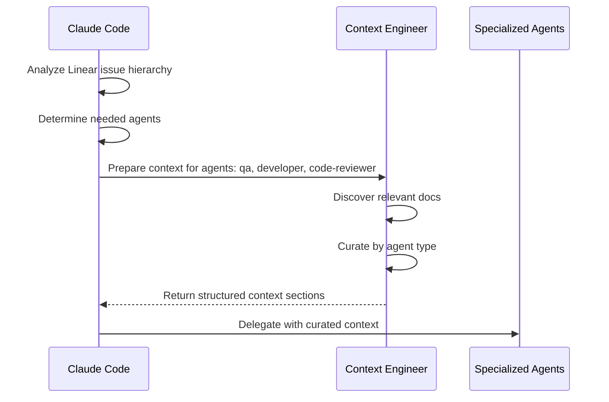

# Agent Documentation Reference Guide

This guide documents agent specialization patterns, documentation requirements, and best practices for the CycleTime agent system.

## Purpose

This README helps:
- **Claude Code**: Select appropriate documentation when delegating to agents
- **Context Engineer**: Curate relevant context for each agent type
- **Developers**: Understand which agents need which documentation
- **Maintainers**: Keep agent configurations consistent and up-to-date

## Agent Specialization Matrix

This matrix shows which documentation each agent type should reference based on their role and responsibilities.

### Core Documentation (All Agents)

Every agent should have access to these foundational documents:

| Document | Path | Purpose |
|----------|------|---------|
| **Project Fundamentals** | `docs/reference/project-fundamentals.md` | Technology stack, architecture, conventions |
| **Git Conventions** | `.claude/shared/git-conventions.md` | Branch naming, commit standards |
| **Linear Reference** | `.claude/shared/linear-reference.md` | Issue management, status workflows |
| **Definition of Done** | `docs/reference/definition-of-done.md` | Quality gates, completion criteria |

**IMPORTANT**: `CLAUDE.md` is reserved for Development Manager instructions ONLY. It contains orchestration responsibilities (agent delegation, think level strategies, quality gates) that should NOT be included in agent contexts. Agents should reference `docs/reference/project-fundamentals.md` instead for project basics.

### Agent-Specific Documentation

#### QA Agent (@agent-qa)

**Primary Role**: Testing, validation, quality assurance

**Generic Documents**:
- `.claude/shared/testing-standards.md` - Testing philosophy and architecture
- `.claude/shared/development-commands.md` - Test execution commands

**Specialized Documents**:
- `docs/concepts/testing/testing-strategy.md` - Overall testing approach
- `docs/concepts/testing/test-architecture.md` - Test organization and structure
- `docs/patterns/testing/unit-test-pattern.md` - Unit testing patterns
- `docs/patterns/testing/integration-test-pattern.md` - Integration testing patterns
- `docs/patterns/testing/system-test-pattern.md` - System testing patterns
- `docs/guides/testing/parallel-testing-guide.md` - Parallel test execution
- `docs/reference/checklists/test-quality-checklist.md` - Test quality standards

**Workflow Documents**:
- `.claude/workflows/tdd-workflow.md` - RED phase execution
- `docs/reference/definition-of-done.md` (Section 5: Testing Requirements)

**Domain Focus**: Testing philosophy, test categorization, TDD methodology, coverage standards, test patterns

---

#### Developer Agent (@agent-developer)

**Primary Role**: Code implementation, feature development

**Generic Documents**:
- `.claude/shared/development-commands.md` - Build and test commands
- `.claude/shared/git-conventions.md` - Commit message standards

**Specialized Documents**:
- `docs/concepts/architecture/domain-driven-design.md` - DDD principles
- `docs/patterns/architecture/dependency-injection.md` - Ktor native DI patterns
- `docs/guides/development/feature-workflow.md` - Standard development workflow
- `docs/guides/development/development-setup.md` - Development environment
- `docs/guides/development/api-best-practices.md` - API implementation standards
- `docs/guides/development/mcp-development.md` - MCP integration patterns

**Workflow Documents**:
- `.claude/workflows/tdd-workflow.md` - GREEN phase execution
- `.claude/workflows/direct-workflow.md` - Direct implementation approach
- `docs/reference/definition-of-done.md` (Section 1: Code Completion Criteria)

**Domain Focus**: Domain-driven design, dependency injection, repository patterns, Ktor framework, implementation standards

---

#### Code Reviewer Agent (@agent-code-reviewer)

**Primary Role**: Code review, security validation, quality assessment

**Generic Documents**:
- `.claude/shared/development-commands.md` - Quality check commands
- `.claude/shared/testing-standards.md` - Test quality expectations

**Specialized Documents**:
- `docs/reference/definition-of-done.md` - Complete quality checklist
- `docs/reference/checklists/test-quality-checklist.md` - Test review criteria
- `docs/guides/development/api-best-practices.md` - API security patterns
- `docs/concepts/architecture/domain-driven-design.md` - Architecture validation

**Workflow Documents**:
- `.claude/workflows/tdd-workflow.md` - REFACTOR phase execution
- `docs/reference/definition-of-done.md` (Section 3: Quality Gates, Section 6: Code Review)

**Domain Focus**: Security patterns, code quality standards, architectural compliance, test coverage, performance validation

---

#### Software Architect Agent (@agent-software-architect)

**Primary Role**: System design, architectural decisions, technical planning

**Generic Documents**:
- All core documentation

**Specialized Documents**:
- `docs/architecture/overview.md` - System architecture
- `docs/concepts/architecture/domain-driven-design.md` - DDD principles
- `docs/patterns/architecture/dependency-injection.md` - DI patterns
- `docs/concepts/mcp/mcp-protocol-concepts.md` - MCP architecture
- `docs/patterns/mcp/` - MCP integration patterns
- `docs/reference/PRD.md` - Product requirements and vision

**Workflow Documents**:
- `docs/reference/definition-of-done.md` (Section 1.3: Architecture Alignment)
- Architecture decision records (when they exist)

**Domain Focus**: System design, DDD boundaries, integration patterns, scalability considerations, architectural decisions

---

#### Tech Lead Agent (@agent-tech-lead)

**Primary Role**: Technical coordination, story breakdown, estimation

**Generic Documents**:
- `.claude/shared/linear-reference.md` - Team/project IDs, estimation scale
- All core documentation

**Specialized Documents**:
- `docs/guides/development/feature-workflow.md` - Development workflows
- `docs/guides/development/branching-strategy.md` - Branch management
- `docs/reference/agents.md` - Agent capabilities and selection
- `docs/reference/decision-guide.md` - Workflow selection guidance
- `docs/reference/worktree-operations.md` - Worktree coordination

**Workflow Documents**:
- `.claude/workflows/tdd-workflow.md` - TDD coordination
- `.claude/workflows/task-tool-workflow.md` - Agent delegation
- `docs/guides/testing/parallel-testing-guide.md` - Parallel coordination

**Domain Focus**: Story breakdown, estimation, dependency mapping, workflow coordination, agent delegation strategies

---

#### Product Manager Agent (@agent-product-manager)

**Primary Role**: Requirements gathering, user stories, stakeholder coordination

**Generic Documents**:
- `.claude/shared/linear-reference.md` - Issue hierarchy, Linear workflows
- `CLAUDE.md` - Project overview and vision

**Specialized Documents**:
- `docs/reference/PRD.md` - Product requirements document
- `docs/reference/user-experience.md` - UX patterns and workflows
- `docs/guides/getting-started/onboarding-guide.md` - User onboarding flows

**Workflow Documents**:
- Linear integration patterns (embedded in `.claude/shared/linear-reference.md`)
- `docs/reference/definition-of-done.md` (Section 4: Linear Integration)

**Domain Focus**: User needs, acceptance criteria, stakeholder communication, user experience, product vision

---

#### DevOps Engineer Agent (@agent-devops-engineer)

**Primary Role**: Build optimization, CI/CD, deployment, infrastructure

**Generic Documents**:
- `.claude/shared/development-commands.md` - Build and test commands
- `.claude/shared/git-conventions.md` - Commit standards (especially `ci:` and `build:` prefixes)

**Specialized Documents**:
- `docs/concepts/cicd/cicd-pipeline-concept.md` - CI/CD architecture
- `docs/concepts/cicd/environment-concept.md` - Environment concepts
- `docs/reference/cicd/` - All CI/CD specifications
- `docs/guides/operations/` - Deployment guides
- `docs/operations/deployment-guide.md` - Deployment procedures

**Workflow Documents**:
- `docs/reference/definition-of-done.md` (Section 7: Continuous Integration)
- CI/CD configuration files (`.github/workflows/`)

**Domain Focus**: Build optimization, CI/CD pipelines, caching strategies, deployment automation, performance monitoring

---

#### Tech Writer Agent (@agent-tech-writer)

**Primary Role**: Technical documentation, API docs, guides

**Generic Documents**:
- `docs/README.md` - Documentation structure overview
- `CLAUDE.md` - Project understanding

**Specialized Documents**:
- `docs/contributing/metadata-schema.md` - YAML frontmatter requirements
- `docs/contributing/document-standards.md` - Documentation quality standards
- `docs/.templates/` - Documentation templates
- `docs/reference/api/` - API documentation examples
- `docs/guides/` - Guide writing patterns

**Workflow Documents**:
- `docs/reference/definition-of-done.md` (Section 2: Documentation Requirements)
- Documentation DAG architecture from `docs/README.md`

**Domain Focus**: Documentation standards, YAML frontmatter, Mermaid diagrams, API documentation, user guides, technical writing

---

#### Context Engineer Agent (@agent-context-engineer)

**Primary Role**: Context preparation and curation for agent delegation

**Generic Documents**:
- All core documentation (needs comprehensive project knowledge)
- `docs/README.md` - Documentation structure for DAG navigation

**Specialized Documents**:
- All documentation domains for context selection:
  - `docs/concepts/` - For foundational knowledge
  - `docs/patterns/` - For implementation patterns
  - `docs/guides/` - For workflow guidance
  - `docs/reference/` - For quick lookups
- Agent configurations (`.claude/agents/*.md`) - To understand agent needs
- Shared configurations (`.claude/shared/*.md`) - For project conventions

**Workflow Documents**:
- All workflow documents to understand development approaches
- `docs/reference/agents.md` - Agent capabilities and requirements
- `docs/reference/decision-guide.md` - Workflow selection logic

**Domain Focus**: Documentation discovery, relevance scoring, context organization, agent-specific curation, dependency analysis, progressive loading

---

#### Web UI Engineer Agent (@agent-web-ui-engineer)

**Primary Role**: Frontend development with HTMX, Tailwind CSS, and server-driven UI architecture

**Generic Documents**:
- `.claude/shared/development-commands.md` - Build and serve commands
- `.claude/shared/git-conventions.md` - Commit message standards

**Specialized Documents**:
- `docs/design/spi-690-dashboard-design.md` - Dashboard design specification with HTMX/Tailwind patterns
- `docs/patterns/ui/htmx-patterns.md` - HTMX progressive enhancement patterns (when created)
- `docs/patterns/ui/tailwind-design-system.md` - Tailwind design system guidelines (when created)
- `docs/examples/ui/ktor-html-dsl-examples.md` - Ktor HTML DSL component examples (when created)

**Workflow Documents**:
- `.claude/workflows/direct-workflow.md` - Direct implementation approach
- `docs/reference/definition-of-done.md` (Section 8: UI/UX Requirements when added)

**Domain Focus**: HTMX interactivity patterns, Tailwind CSS utility-first design, Ktor HTML DSL type-safe templates, server-driven architecture, accessibility (WCAG), responsive design, visual hierarchy, progressive enhancement

**Think Level Recommendation**: `think hard` for complex UI patterns and accessibility considerations, `think` for straightforward component implementation

---

## Document Inclusion Guidelines

### When to Use @ References in Agent Configs

Use `@path/to/document.md` references in agent configuration files when:

1. **Always Needed**: Document is required for every invocation of this agent type
2. **Core Competency**: Document defines fundamental patterns the agent must follow
3. **Stable Reference**: Document content doesn't change frequently
4. **Clear Scope**: Document has well-defined relevance to agent role

### When NOT to Use @ References

Avoid `@` references when:

1. **Context-Dependent**: Document only relevant for certain tasks
2. **Frequently Updated**: Content changes often (use Context Engineer instead)
3. **Already in CLAUDE.md**: Content is duplicated in shared context
4. **Task-Specific**: Only needed for specific workflows (mention in prompts instead)

### Best Practice Pattern

**Agent Config Structure**:
```markdown
---
name: agent-name
description: Brief description
model: sonnet|opus
color: color-name
---

[Agent personality and core role description]

## Core Responsibilities
[List primary responsibilities]

## [Domain-Specific Sections]
[Organized by domain expertise]

## References (optional - only if always needed)
@.claude/shared/[always-needed-config].md
```

**Context Engineer Pattern**:
```markdown
# Context Engineer prepares agent-specific context
Claude Code: "@agent-context-engineer Prepare context for SPI-XXX requiring agents: qa, developer"

# Context Engineer returns structured sections:
## QA AGENT CONTEXT
- testing-standards.md:1-100 - TDD methodology
- test-architecture.md:75-150 - Test patterns
- [task-specific test examples]

## DEVELOPER AGENT CONTEXT
- development-commands.md:1-50 - Build commands
- domain-driven-design.md:1-100 - DDD principles
- [task-specific implementation patterns]
```

## Think Level Escalation Patterns

From CLAUDE.md, agents use different reasoning depths based on task complexity:

| Think Level | When to Use | Agent Types |
|-------------|-------------|-------------|
| **think** | Simple, well-defined tasks | Developer (simple features), QA (basic tests) |
| **think hard** | Moderate complexity, some unknowns | Developer (moderate features), Code Reviewer (standard review) |
| **think harder** | Complex issues, architectural decisions | Software Architect, Tech Lead (story breakdown) |
| **ultrathink** | Critical systems, maximum reasoning depth | Context Engineer, Software Architect (major design) |

### Escalation Strategy

```
Initial Task → think
  ↓ (blocker encountered)
Re-engage → think hard
  ↓ (still blocked)
Re-engage → think harder
  ↓ (still blocked)
Re-engage → ultrathink
  ↓ (still blocked)
Escalate to User
```

## Context Engineer Integration

The Context Engineer agent is invoked BEFORE delegating to specialized agents to prepare curated, relevant context.

### When to Invoke Context Engineer

Claude Code should invoke Context Engineer for:

1. **Complex Linear Issues**: Issues with multiple subtasks or technical domains
2. **Multi-Agent Workflows**: When 2+ different agent types will be needed
3. **Parallel Development**: Multiple features being developed simultaneously
4. **Domain-Heavy Features**: Authentication, data layer, architecture changes
5. **Cross-Component Work**: Features touching multiple system areas

### Context Engineer Workflow



### Context Engineer Output Format

The Context Engineer returns structured sections that Claude Code extracts when delegating:

```markdown
## GENERAL CONTEXT (For All Agents)
- Project foundation documents
- Linear issue hierarchy
- Technical requirements

## QA AGENT CONTEXT
- Testing standards and patterns
- Domain-specific test examples

## DEVELOPER AGENT CONTEXT
- Implementation patterns
- Similar feature examples

## CODE-REVIEWER AGENT CONTEXT
- Review standards
- Security patterns
```

Claude Code then includes the relevant section when delegating to each agent.

## Validation and Maintenance

### Periodic Review Schedule

- **Monthly**: Review agent documentation references for accuracy
- **After SPI-722 completion**: Update all paths to new DAG structure
- **On major architecture changes**: Update agent specialization matrix
- **When new document types added**: Update Context Engineer discovery patterns

### Validation Checklist

When updating agent configurations:

- [ ] Core documentation references are current
- [ ] Specialized documentation paths are correct
- [ ] Workflow document links are valid
- [ ] Domain focus accurately reflects agent capabilities
- [ ] Think level guidance is appropriate for agent role
- [ ] Context Engineer patterns are up-to-date

### Common Issues and Solutions

**Issue**: Agent references outdated documentation path
**Solution**: Update path in agent config, verify with Read tool

**Issue**: Agent lacks access to critical domain knowledge
**Solution**: Add to specialized documents section, or use Context Engineer for dynamic inclusion

**Issue**: Too many @ references making agent context bloated
**Solution**: Move task-specific docs to Context Engineer curation, keep only always-needed docs

**Issue**: Agents producing inconsistent outputs across similar tasks
**Solution**: Ensure shared configurations (`.claude/shared/*.md`) are referenced consistently

## Migration from Legacy Structure

After SPI-722 documentation restructuring, agents should reference:

### OLD → NEW Path Mappings

| Legacy Path | New DAG Path |
|-------------|--------------|
| `docs/testing/strategy.md` | `docs/concepts/testing/testing-strategy.md` |
| `docs/testing/tdd-workflow.md` | `.claude/workflows/tdd-workflow.md` |
| `docs/development/branching-strategy.md` | `docs/guides/development/branching-strategy.md` |
| `docs/reference/technical-design/domain-entities.md` | `docs/concepts/architecture/domain-driven-design.md` |
| `docs/reference/technical-design/testing-architecture-tdd.md` | `docs/concepts/testing/test-architecture.md` |
| `docs/reference/technical-design/dependency-injection-patterns.md` | `docs/patterns/architecture/dependency-injection.md` |

**Note**: Most legacy paths are now archived in `docs/archive/pre-dag-migration/`. Always reference the new DAG structure.

## References

- [Agent Reference](../reference/agents.md) - Authoritative agent capabilities
- [Definition of Done](../reference/definition-of-done.md) - Quality standards all agents should follow
- [Documentation README](../../docs/README.md) - DAG structure overview
- [Document Standards](../../docs/contributing/document-standards.md) - Documentation quality requirements
- [Metadata Schema](../../docs/contributing/metadata-schema.md) - YAML frontmatter specification

---

**Last Updated**: 2025-10-25 (SPI-804 added web-ui-engineer agent)
