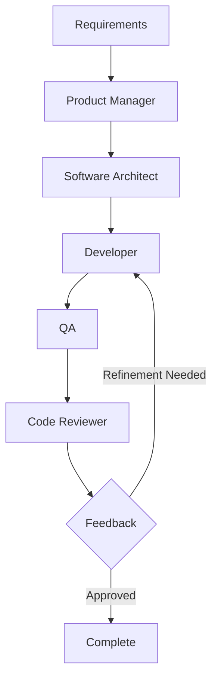
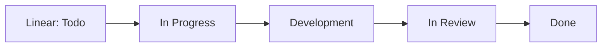

# Task Tool Workflow

Interactive development patterns using Task tool agents for coordinated development.

## Overview

Task tool agents provide interactive, specialized assistance for development tasks. They excel at analysis, planning, iterative development, and coordinated parallel execution (up to 10 concurrent agents) within Claude Code's environment.

**Agent Reference**: See [Agent Reference](../docs/reference/agents.md) for complete agent capabilities and selection guidelines.

## Core Workflow Patterns

### Pattern 1: Standard Feature Development



**Workflow Example:**
```
@agent-product-manager "Define requirements for user profile management (SPI-612)"
@agent-software-architect "Design architecture for user profile management"
@agent-developer "Implement user profile management per design"
@agent-qa "Create comprehensive tests for user profile management"
@agent-code-reviewer "Review implementation for quality and security"
```

### Pattern 2: Research and Problem Solving

```
# Investigation
@agent-developer "Investigate why user sessions expire prematurely"

# Analysis
@agent-software-architect "Analyze authentication performance bottlenecks"

# Solution Design
@agent-tech-lead "Design solution for session management issues"
```

### Pattern 3: Iterative Refinement

```
@agent-developer "Implement basic user authentication"
# Review output, provide feedback
@agent-developer "Enhance authentication with password validation"
@agent-qa "Validate enhanced authentication meets requirements"
```

## Integration Workflows

### Standard Development Flow

```bash
# 1. Create feature branch
git checkout -b feat/spi-612-user-profiles

# 2. Use Task tool agents
@agent-developer "Implement user profile management for SPI-612"

# 3. Iterative refinement
@agent-code-reviewer "Review implementation"
@agent-developer "Address feedback"

# 4. Commit changes (manually)
git add . && git commit -m "feat: implement user profile management (SPI-612)"
```

### With Worktrees

```bash
git worktree add .worktrees/spi-612-user-profiles -b feat/spi-612-user-profiles
cd .worktrees/spi-612-user-profiles
@agent-developer "Implement according to design"
```

### Linear Status Updates



## Best Practices

### Task Descriptions

**Be Specific:**
```
❌ @agent-developer "Fix auth issue"
✅ @agent-developer "Fix JWT token expiration where tokens expire after 15 minutes instead of configured 1 hour"
```

**Provide Context:**
```
❌ @agent-code-reviewer "Review code"
✅ @agent-code-reviewer "Review authentication for security vulnerabilities, focusing on JWT handling and session management"
```

### Quality Gates

**Before Use:**
- [ ] Clear requirements defined
- [ ] Appropriate agent selected
- [ ] Specific task description prepared

**After Completion:**
- [ ] Review implementations created by agents
- [ ] Test thoroughly
- [ ] Commit with proper messages
- [ ] Update Linear status

## Common Workflow Examples

### Feature Implementation
```
@agent-product-manager "Define user stories for profile management (SPI-612)"
@agent-software-architect "Design technical implementation for user profiles"
@agent-developer "Implement user profile management with view/edit capabilities"
@agent-qa "Create testing strategy for profile management"
@agent-code-reviewer "Review implementation for security and quality"
```

### Bug Investigation
```
@agent-developer "Investigate session expiration issue - analyze JWT token lifecycle"
@agent-software-architect "Design robust solution for JWT management"
@agent-developer "Implement fix ensuring proper token expiration handling"
@agent-qa "Design tests to verify fix and prevent regression"
```

### Parallel Development (Multi-Feature)
```
# Coordinated Parallel Development
@agent-tech-lead "Coordinate parallel development of user management: authentication, profiles, permissions"

# This automatically launches multiple concurrent agents:
# - @agent-developer (authentication) - parallel execution
# - @agent-developer (user profiles) - parallel execution
# - @agent-developer (permissions) - parallel execution
# All with shared context and coordination
```

### Parallel Development with Review
```
# 1. Parallel Implementation Phase
@agent-tech-lead "Launch parallel development of payment features: processing, validation, reporting"

# 2. Coordinated Review Phase
@agent-code-reviewer "Review all payment implementations for consistency and security"
@agent-qa "Design integration tests for payment features"
```

### Mixed Parallel Workflow
```
# Planning and coordination
@agent-software-architect "Design architecture for parallel API development"

# Parallel implementation with coordination
@agent-tech-lead "Coordinate parallel API development: users, orders, inventory"

# Cross-feature integration
@agent-developer "Implement API integration layer connecting all services"
```

## Troubleshooting

**Generic Response**: Provide more specific context and requirements

**Codebase Mismatch**: Include existing patterns in task description

**Requirement Gaps**: Be explicit about constraints and acceptance criteria

See [Troubleshooting Guide](../docs/reference/troubleshooting.md) for detailed solutions.

## Integration

Integrates with:
- [Single Feature Workflow](../docs/development/single-feature-workflow.md) - Primary single feature process
- [Agent Reference](../docs/reference/agents.md) - Complete agent capabilities
- [Decision Guide](../docs/reference/decision-guide.md) - When to use Task tool agents
- [Troubleshooting](../docs/reference/troubleshooting.md) - Common issues and solutions

## Quick Reference

```
@agent-developer "specific implementation task"
@agent-qa "specific testing requirements"
@agent-code-reviewer "specific review criteria"
@agent-software-architect "specific design challenge"
@agent-product-manager "specific requirements question"
@agent-tech-lead "specific planning need"
@agent-devops-engineer "specific infrastructure task"
```

**Key Principles:**
1. Be specific in task descriptions
2. Choose appropriate agent for task type
3. Iterate based on feedback
4. Review and test agent implementations
5. Update Linear status throughout development