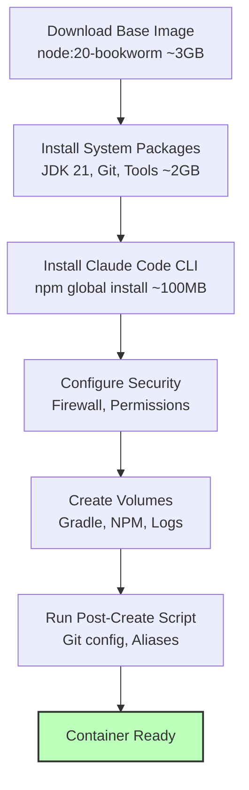

# DevContainer Setup Guide

Complete guide for setting up the CycleTime devcontainer for safe, unattended Claude Code operations.

## Table of Contents

1. [Prerequisites](#prerequisites)
2. [First-Time Setup](#first-time-setup)
3. [Authentication Configuration](#authentication-configuration)
4. [Container Build Process](#container-build-process)
5. [Verification Steps](#verification-steps)
6. [Common Setup Issues](#common-setup-issues)

---

## Prerequisites

### Required Software

**Docker Desktop** (or Docker Engine)
- **Download**: https://www.docker.com/products/docker-desktop
- **Minimum version**: 20.10+
- **Recommended version**: Latest stable release
- **Note**: Docker Desktop includes Docker Engine, Docker CLI, and Docker Compose

**Visual Studio Code**
- **Download**: https://code.visualstudio.com/
- **Minimum version**: 1.75+
- **Recommended version**: Latest stable release

**Dev Containers Extension**
- **VS Code Marketplace**: https://marketplace.visualstudio.com/items?itemName=ms-vscode-remote.remote-containers
- **Installation**: In VS Code, press `Cmd+Shift+X` (Mac) or `Ctrl+Shift+X` (Windows/Linux), search for "Dev Containers", and click Install

**Anthropic API Key**
- **Get Your Key**: https://console.anthropic.com/settings/keys
- **Create a new API key** (starts with `sk-ant-`)
- **Copy the key** - you'll need it for authentication configuration

### System Requirements

**Hardware Requirements:**
- **CPU**: 4+ cores recommended (container uses up to 4 cores)
- **RAM**: 8GB+ recommended (container uses up to 8GB)
- **Disk**: 15GB+ free space for images, volumes, and caches
  - Base image: ~3GB
  - Build caches: ~2-5GB
  - Audit logs: ~1GB (with rotation)

**Operating System Requirements:**
- **macOS**: 10.15 (Catalina) or later
- **Windows**: Windows 10/11 with WSL 2
- **Linux**: Any distribution with kernel 5.10+

**Docker Desktop Resource Allocation:**

After installing Docker Desktop, configure resource limits:

1. Open Docker Desktop
2. Navigate to **Settings > Resources**
3. Configure:
   - **CPUs**: 4 or more
   - **Memory**: 8GB or more
   - **Swap**: 2GB or more
   - **Disk image size**: 64GB or more

---

## First-Time Setup

### Step 1: Clone the Repository

```bash
# Clone CycleTime repository
git clone https://github.com/your-org/cycletime.git
cd cycletime

# Verify you're in the correct directory
ls -la .devcontainer/
# Should show: devcontainer.json, Dockerfile, README.md, SAFETY.md, etc.
```

### Step 2: Configure API Key (CRITICAL)

**Option A: Environment Variable (Recommended)**

1. **On macOS/Linux:**

   ```bash
   # Add to your shell profile (~/.zshrc or ~/.bashrc)
   echo 'export ANTHROPIC_API_KEY="sk-ant-api03-YOUR_KEY_HERE"' >> ~/.zshrc

   # Reload shell configuration
   source ~/.zshrc

   # Verify it's set
   echo $ANTHROPIC_API_KEY
   # Should output: sk-ant-api03-YOUR_KEY_HERE
   ```

2. **On Windows (PowerShell):**

   ```powershell
   # Set user environment variable (persists across sessions)
   [System.Environment]::SetEnvironmentVariable(
       'ANTHROPIC_API_KEY',
       'sk-ant-api03-YOUR_KEY_HERE',
       'User'
   )

   # Restart PowerShell, then verify
   $env:ANTHROPIC_API_KEY
   # Should output: sk-ant-api03-YOUR_KEY_HERE
   ```

**Option B: devcontainer.json (Less Secure)**

Edit `.devcontainer/devcontainer.json` and add:

```json
{
  "containerEnv": {
    "ANTHROPIC_API_KEY": "sk-ant-api03-YOUR_KEY_HERE"
  }
}
```

⚠️ **Security Warning**: Do NOT commit API keys to version control. Add `.devcontainer/devcontainer.json` to `.git/info/exclude` if using Option B.

### Step 3: Open Project in VS Code

```bash
# Open project in VS Code
code .
```

Alternatively, open VS Code first, then:
1. File > Open Folder
2. Navigate to `cycletime` directory
3. Click "Open"

### Step 4: Reopen in Container

**You'll see a notification in VS Code:**

```
Folder contains a Dev Container configuration file.
Reopen in Container  [Reopen Folder Locally]
```

Click **"Reopen in Container"**

**Or use Command Palette:**

1. Press `Cmd+Shift+P` (Mac) or `Ctrl+Shift+P` (Windows/Linux)
2. Type: `Dev Containers: Reopen in Container`
3. Press Enter

---

## Container Build Process

### What Happens During Build

The first build takes **5-10 minutes** depending on your internet connection and system performance.

**Build Stages:**



**Progress Indicators:**

You'll see VS Code progress notifications:
- "Starting container..."
- "Building image..."
- "Installing extensions..."
- "Running post-create command..."
- "Container ready"

**Terminal Output:**

The integrated terminal will show:

```
[1/6] Downloading base image... ████████████████████░░░░░░░░ 80%
[2/6] Installing system packages...
[3/6] Installing Claude Code CLI...
[4/6] Configuring security...
[5/6] Creating volumes...
[6/6] Running post-create script...

✓ Container built successfully
```

### Build Artifacts

**Docker Images Created:**
- `vsc-cycletime-<hash>:latest` - Your project's devcontainer image

**Docker Volumes Created:**
- `cycletime-gradle-cache` - Gradle dependencies and build cache
- `cycletime-npm-cache` - NPM packages
- `cycletime-claude-config` - Claude Code configuration (persistent)
- `cycletime-audit-logs` - Security audit logs

**View Volumes:**

```bash
# List all volumes
docker volume ls | grep cycletime

# Inspect a specific volume
docker volume inspect cycletime-gradle-cache
```

---

## Verification Steps

Once the container starts, verify your setup:

### Step 1: Check Integrated Terminal

VS Code should open an integrated terminal **inside the container**. The prompt will look like:

```
vscode@container:/workspace$
```

Or with zsh (default):

```
➜  workspace
```

### Step 2: Verify Installations

Run each command and verify expected output:

**Java/JVM:**

```bash
java -version
# Expected:
# openjdk version "21.0.x" 2024-xx-xx
# OpenJDK Runtime Environment (build 21.0.x+xx)
# OpenJDK 64-Bit Server VM (build 21.0.x+xx, mixed mode, sharing)
```

**Node.js:**

```bash
node --version
# Expected: v20.x.x

npm --version
# Expected: 10.x.x or higher
```

**Claude Code CLI:**

```bash
claude --version
# Expected: 2.0.32 or higher
```

**Gradle:**

```bash
./gradlew --version
# Expected:
# ------------------------------------------------------------
# Gradle 9.1.0
# ------------------------------------------------------------
# Kotlin:       2.2.0
# JVM:          21.0.x
```

**Git:**

```bash
git --version
# Expected: git version 2.x.x

# Verify git configuration
git config --get user.name
# Expected: CycleTime Agent (or your configured name)

git config --get user.email
# Expected: agent@cycletime.dev (or your configured email)
```

### Step 3: Verify Claude Code Authentication

**Check authentication status:**

```bash
claude /status
```

**Expected Output (Success):**

```
✓ Authentication: API Key
✓ Model: claude-sonnet-4-5-20250929
✓ Organization: Your Organization Name
✓ API Status: Active
```

**Expected Output (Failure - No API Key):**

```
✗ Authentication: Not authenticated
ℹ Set ANTHROPIC_API_KEY environment variable
ℹ Visit: https://console.anthropic.com/settings/keys
```

If authentication fails, see [Troubleshooting Authentication](#authentication-problems) below.

### Step 4: Test Claude Code

**Simple Test (Uses ~100 tokens):**

```bash
claude "Say hello"
```

**Expected Output:**

```
Hello! I'm Claude, an AI assistant. How can I help you today?
```

**Project Test (Uses ~500 tokens):**

```bash
claude "What is this project about?"
```

Expected: Claude analyzes the codebase and provides a summary of CycleTime.

### Step 5: Run Tests

**Unit tests:**

```bash
./gradlew test
```

**Expected**: All tests pass (or at least compile and run)

**Build project:**

```bash
./gradlew build
```

**Expected**: BUILD SUCCESSFUL in Xs

### Step 6: Verify Safety Mechanisms

**Check firewall status:**

```bash
# Inside container
sudo iptables -L OUTPUT -n -v | head -20
```

**Expected**: Rules for egress whitelisting (GitHub, Anthropic API, NPM, etc.)

**Test network isolation:**

```bash
# This should SUCCEED (whitelisted)
curl -I https://api.anthropic.com

# This should FAIL (blocked)
curl -I https://example.com
```

**Check resource limits:**

```bash
# CPU limit
cat /sys/fs/cgroup/cpu/cpu.cfs_quota_us
# Expected: 400000 (4 cores)

# Memory limit
cat /sys/fs/cgroup/memory/memory.limit_in_bytes
# Expected: 8589934592 (8GB)

# PID limit
cat /sys/fs/cgroup/pids/pids.max
# Expected: 200
```

**Verify audit logging:**

```bash
# Check audit log exists
ls -la /workspace/.claude/audit.log

# Test audit logger
/usr/local/bin/audit-logger.sh file_read test.txt success 10

# View logged entry
tail -1 /workspace/.claude/audit.log | jq .
```

---

## Common Setup Issues

### Container Build Failures

#### Issue: Docker Build Timeout

**Symptoms:**

```
ERROR: failed to solve: failed to compute cache key:
  "/var/lib/docker" failed to dial context deadline exceeded
```

**Solutions:**

1. **Increase Docker Desktop timeout:**
   - Docker Desktop > Settings > Docker Engine
   - Add: `"max-download-time": "3600"`
   - Restart Docker Desktop

2. **Check Docker daemon is running:**

   ```bash
   docker ps
   # Should list running containers (may be empty, but no errors)
   ```

3. **Clean Docker cache:**

   ```bash
   # Warning: Removes all unused images, containers, volumes
   docker system prune -a --volumes

   # Confirm when prompted: y
   ```

4. **Rebuild without cache:**

   - Command Palette: `Dev Containers: Rebuild Container Without Cache`

#### Issue: Permission Denied During Build

**Symptoms:**

```
Error: EACCES: permission denied, mkdir '/home/node/.npm'
```

**Solutions:**

1. **Ensure Docker Desktop has file access:**
   - macOS: System Settings > Privacy & Security > Files and Folders > Docker
   - Windows: Docker Desktop > Settings > Resources > File Sharing

2. **Check Docker Desktop is running as current user** (not root)

3. **Reinstall Docker Desktop** if permission issues persist

### Authentication Problems

#### Issue: API Key Not Found

**Symptoms:**

```bash
claude /status
# Output: Authentication: Not authenticated
```

**Solutions:**

1. **Verify API key is set on host:**

   ```bash
   # On macOS/Linux
   echo $ANTHROPIC_API_KEY

   # On Windows PowerShell
   $env:ANTHROPIC_API_KEY
   ```

2. **Rebuild container to pick up environment:**

   - Command Palette: `Dev Containers: Rebuild Container`

3. **Check devcontainer.json passes environment:**

   Verify `.devcontainer/devcontainer.json` contains:

   ```json
   {
     "containerEnv": {
       "ANTHROPIC_API_KEY": "${localEnv:ANTHROPIC_API_KEY}"
     }
   }
   ```

4. **Manually set inside container (temporary):**

   ```bash
   export ANTHROPIC_API_KEY="sk-ant-api03-YOUR_KEY_HERE"
   claude /status
   ```

#### Issue: Invalid API Key

**Symptoms:**

```bash
claude "test"
# Output: Error: Invalid API key
```

**Solutions:**

1. **Verify API key format:**
   - Must start with `sk-ant-api03-` (or similar prefix)
   - No extra spaces or quotes
   - Full key copied (often truncated in console)

2. **Generate new API key:**
   - Visit: https://console.anthropic.com/settings/keys
   - Create New Key
   - Copy entire key
   - Update environment variable

3. **Check API key permissions:**
   - Some keys are scoped to specific models
   - Ensure key has access to Claude models

#### Issue: Rate Limit Errors

**Symptoms:**

```bash
claude "test"
# Output: Error: Rate limit exceeded (429)
```

**Solutions:**

1. **Wait for rate limit reset** (usually 1 minute)

2. **Check your usage in Anthropic Console:**
   - https://console.anthropic.com/settings/usage

3. **Consider upgrading your plan:**
   - https://console.anthropic.com/settings/plans

4. **Use lower-cost model for development:**

   ```bash
   claude --model claude-haiku-4-20250309 "test"
   ```

### Git Configuration Issues

#### Issue: "Dubious Ownership" Errors

**Symptoms:**

```bash
git status
# Output: fatal: detected dubious ownership in repository at '/workspace'
```

**Solutions:**

1. **Run post-create script manually:**

   ```bash
   bash /workspace/.devcontainer/post-create.sh
   ```

2. **Or configure git safe directory manually:**

   ```bash
   git config --global --add safe.directory /workspace
   ```

3. **Verify it worked:**

   ```bash
   git status
   # Should work without errors
   ```

### Network/Firewall Issues

#### Issue: Cannot Access Whitelisted Domains

**Symptoms:**

```bash
curl https://api.anthropic.com
# Output: curl: (7) Failed to connect to api.anthropic.com
```

**Solutions:**

1. **Verify firewall initialization:**

   ```bash
   sudo /usr/local/bin/init-firewall.sh
   ```

2. **Check iptables rules:**

   ```bash
   sudo iptables -L OUTPUT -n | grep -i anthropic
   ```

3. **Test DNS resolution:**

   ```bash
   dig +short api.anthropic.com
   # Should return IP addresses
   ```

4. **Check ipset contains domain:**

   ```bash
   sudo ipset list allowed-domains | grep <IP>
   ```

5. **Temporarily disable firewall for debugging:**

   ```bash
   # WARNING: Reduces security
   sudo iptables -P OUTPUT ACCEPT
   sudo iptables -F OUTPUT

   # Test connection
   curl https://api.anthropic.com

   # Re-enable firewall
   sudo /usr/local/bin/init-firewall.sh
   ```

### Resource Limit Issues

#### Issue: Out of Memory Errors

**Symptoms:**

```bash
./gradlew build
# Output: Expiring Daemon because JVM heap space is exhausted
```

**Solutions:**

1. **Increase Docker Desktop memory allocation:**
   - Docker Desktop > Settings > Resources > Memory
   - Set to 12GB or 16GB
   - Restart Docker Desktop

2. **Adjust JVM heap size:**

   ```bash
   export JAVA_OPTS="-Xmx6g"
   ./gradlew build
   ```

3. **Check container memory limit:**

   ```bash
   cat /sys/fs/cgroup/memory/memory.limit_in_bytes
   # Should be 8589934592 (8GB)
   ```

4. **Edit devcontainer.json to increase limit:**

   ```json
   {
     "hostConfig": {
       "memory": "16g",
       "memorySwap": "16g"
     }
   }
   ```

   Then rebuild container.

#### Issue: Process Limit Reached

**Symptoms:**

```bash
./gradlew test
# Output: fork: retry: Resource temporarily unavailable
```

**Solutions:**

1. **Check current PID usage:**

   ```bash
   ps aux | wc -l
   # Should be well below 200
   ```

2. **Increase PID limit in devcontainer.json:**

   ```json
   {
     "hostConfig": {
       "pidsLimit": 300
     }
   }
   ```

3. **Rebuild container**

### VS Code Extension Issues

#### Issue: Kotlin Extension Not Loading

**Symptoms:**

- No syntax highlighting for `.kt` files
- No code completion

**Solutions:**

1. **Reload window:**
   - Command Palette: `Developer: Reload Window`

2. **Reinstall extension:**
   - Command Palette: `Dev Containers: Rebuild Container`

3. **Check extension logs:**
   - View > Output > Select "Kotlin Language Server" from dropdown

4. **Verify JAVA_HOME:**

   ```bash
   echo $JAVA_HOME
   # Expected: /usr/lib/jvm/java-21-openjdk-amd64
   ```

---

## Next Steps

**Setup Complete!** You're ready to use the CycleTime devcontainer.

Proceed to:
- [Usage Guide](./USAGE-GUIDE.md) - Daily development workflows
- [Best Practices](./BEST-PRACTICES.md) - Safe workflow patterns
- [Troubleshooting](./TROUBLESHOOTING.md) - Additional troubleshooting guidance

---

## Getting Help

If you encounter issues not covered in this guide:

1. **Check container logs:**

   ```bash
   docker logs <container-id>
   ```

2. **Review audit logs:**

   ```bash
   cat /workspace/.claude/audit.log | jq .
   ```

3. **Consult additional documentation:**
   - [SAFETY.md](../SAFETY.md) - Safety mechanisms explained
   - [DANGEROUS-MODE.md](../DANGEROUS-MODE.md) - Unattended operations guide
   - [Troubleshooting Guide](./TROUBLESHOOTING.md) - Comprehensive troubleshooting

4. **Open GitHub Issue:**
   - https://github.com/your-org/cycletime/issues
   - Include: setup steps attempted, error messages, system info

---

**Version**: 1.0
**Last Updated**: 2025-11-03
**Related Documents**:
- [Usage Guide](./USAGE-GUIDE.md)
- [Best Practices](./BEST-PRACTICES.md)
- [Troubleshooting Guide](./TROUBLESHOOTING.md)
- [FAQ](./FAQ.md)
