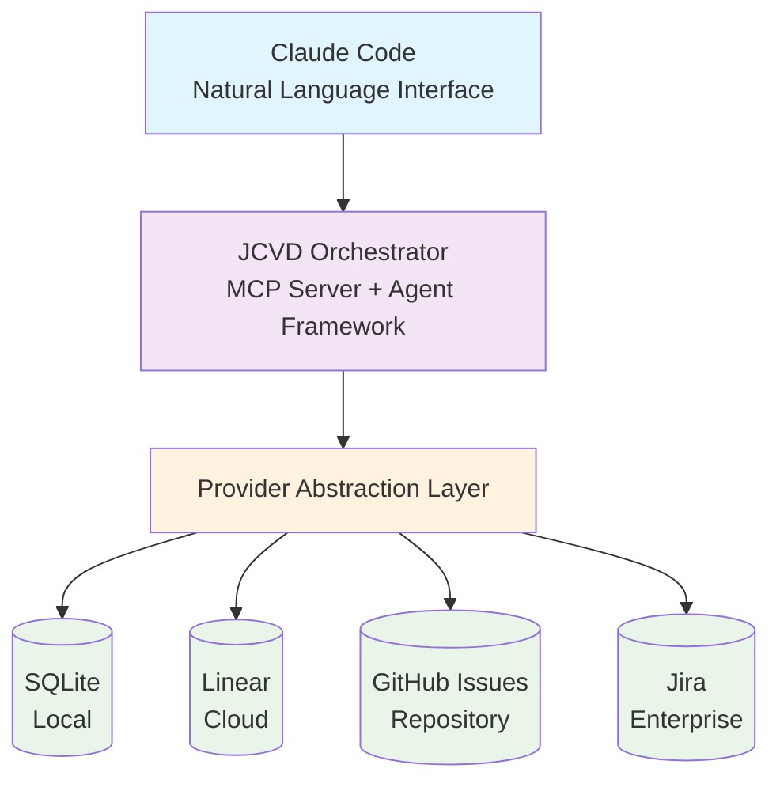

# JCVD: Complete Project Orchestration for Claude Code


## What is JCVD?

JCVD is a project orchestration framework that extends Claude Code to manage
complete software development lifecycles with minimal configuration overhead.
The system handles requirements gathering, project structure creation, task
sequencing, and documentation maintenance across development sessions through
simple, natural language interactions. Rather than focusing on individual coding
tasks, JCVD coordinates all artifacts needed for systematic project execution
while maintaining the intuitive experience developers expect from Claude Code.

## How it works

## Design Principles

**Data Ownership**

- Local-first architecture with embedded SQLite foundation
- Optional cloud provider integration without dependency requirements
- Transparent data formats and complete export capabilities

**Implementation Simplicity**

- Single-command project initialization with sensible defaults
- Progressive feature exposure with essential functionality immediately
  available
- Convention-based configuration with extension points for customization

**System Longevity**

- Provider-agnostic interfaces prevent vendor dependency
- Standard data formats support cross-system migration
- Open source license ensures ongoing accessibility and modification rights

## System Architecture

JCVD implements a multi-layer, provider-agnostic architecture with embedded
SQLite as the foundational data layer:



The architecture supports offline-first development with embedded SQLite,
providing migration paths to cloud providers as collaboration requirements
evolve.

## Implementation Status

**Current Phase**: Pre-implementation with comprehensive documentation complete

**Available Documentation**:

- **[PRD.md](docs/PRD.md)** - Product requirements and business objectives
- **[ARCHITECTURE.md](docs/ARCHITECTURE.md)** - Technical specifications and
  system design
- **[USER_EXPERIENCE.md](docs/USER_EXPERIENCE.md)** - User workflows and
  interaction patterns
- **[ONBOARDING.md](docs/ONBOARDING.md)** - Project integration strategies and
  adoption approaches

## Quick Start

```bash
# TODO: Implementation in progress
# When ready, JCVD will support:

# Install JCVD
npm install -g jcvd

# Initialize new project with interactive requirements gathering
jcvd init

# Or start with existing PRD
jcvd init --prd ./my-project-requirements.md

# Get intelligent next task recommendation
jcvd next

# Work on specific issue
jcvd work ISSUE-123
```

## Target Users

JCVD primarily serves individual software engineers and freelancers who need
systematic project structure without configuration complexity. Solo developers
benefit from automated project scaffolding and structured workflows, while
freelancers gain demonstrable development processes for client engagements. The
framework also supports small development teams (2-4 people) seeking rapid
project initialization with professional practices, including startups
implementing standardized delivery processes and teams adopting structured issue
tracking methodologies.

## Contributing

JCVD is in pre-implementation phase. Contributions currently focus on:

- Architecture review and design feedback
- Provider integration design and requirements
- User experience validation for target developer workflows
- Testing participation during implementation phases

## Development Roadmap

- **Proof of Concept** (Month 1): Embedded SQLite foundation with basic
  orchestration engine
- **MVP** (Months 2-3): Local project orchestration with task recommendation
  system
- **V1.0** (Months 4-5): Multi-provider architecture and Linear integration
- **V2.0** (Months 6-8): GitHub Issues and Jira provider implementations
- **V3.0+** (Month 9+): Existing project integration and migration tooling

---

## What does JCVD stand for?

JCVD stands for "John + Claude = Velocity Driver", inspired by the legendary
action star known for his disciplined approach to martial arts and film. Just as
JCVD embodies strength and precision, this project aims to bring robust,
systematic development practices to software engineering with minimal overhead.
