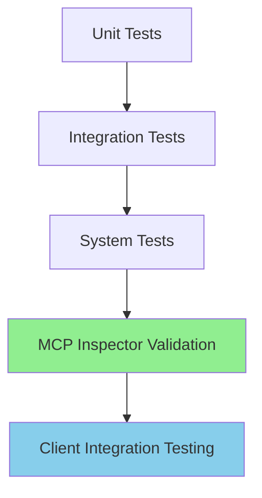

# SPI-706 Documentation Update Proposal

**Date**: 2025-10-16
**Author**: Technical Writer (Claude Code)
**Source**: SPI-706 Validation Report Analysis
**Scope**: MCP Inspector Integration & SDK Validation Workflows

---

## Executive Summary

The SPI-706 validation work successfully validated the MCP SDK v0.7.2 implementation using MCP Inspector and comprehensive testing. However, **critical validation tooling and workflows are not documented** for the development team.

### Critical Gap Identified

**MCP Inspector** is mentioned in:
- ✅ Migration plan (`mcp-sdk-migration-plan.md` Phase 5)
- ✅ Architecture decision (`ADR-001-adopt-mcp-kotlin-sdk-v0.7.2.md`)

But **NOT documented** in:
- ❌ Development workflow guides
- ❌ Troubleshooting documentation
- ❌ Testing strategy
- ❌ Validation procedures

### Impact

Without MCP Inspector documentation:
- Developers cannot validate their MCP changes
- QA cannot reproduce validation procedures
- Troubleshooting production issues lacks critical diagnostic tool
- New team members don't know the tool exists
- Hard-won validation knowledge from SPI-706 is lost

### Recommendation

**HIGH PRIORITY**: Document MCP Inspector as a first-class validation and troubleshooting tool across multiple documentation areas.

---

## Section A: MCP Inspector Documentation Needs

### Gap Analysis

The validation report shows MCP Inspector usage in **Phase 1, Sections 1.1-1.3** (lines 30-133):

**What was done (successful patterns)**:
```bash
# Installation
npm install -g @modelcontextprotocol/inspector

# Usage
npx @modelcontextprotocol/inspector --transport sse --server-url http://localhost:8080

# Result
Inspector web UI started on port 6274 with authentication token
```

**What was validated**:
- Server health endpoint
- SDK endpoint registration (POST `/`, SSE at `/`)
- Tool registry (17 tools across 4 providers)
- Resource registry (4 resource providers)
- Protocol compliance verification

**Why this matters**:
- MCP Inspector is THE official validation tool for MCP servers
- It's the same tool used by Anthropic to validate Claude Code integrations
- It provides protocol-level validation that automated tests cannot
- It's essential for debugging client connection issues

### Required Documentation

#### 1. **New File**: `docs/getting-started/mcp-inspector-guide.md`

**Purpose**: Comprehensive guide for using MCP Inspector with CycleTime

**Proposed Outline**:
```markdown
# MCP Inspector Guide

## What is MCP Inspector?
- Official validation tool from Anthropic
- Protocol compliance verification
- Interactive testing of MCP servers
- Debugging client connection issues

## Installation

### Prerequisites
- Node.js 18+ required
- CycleTime server running locally

### Install Inspector
```bash
npm install -g @modelcontextprotocol/inspector
```

### Verify Installation
```bash
npx @modelcontextprotocol/inspector --version
```

## Quick Start

### Start CycleTime Server
```bash
./gradlew run
# Wait for: "Application started in X.XX seconds"
```

### Launch Inspector
```bash
npx @modelcontextprotocol/inspector --transport sse --server-url http://localhost:8080
```

### Access Web UI
```
Inspector started on: http://localhost:6274
Authentication token: [displayed in terminal]
```

## Validation Workflows

### 1. Protocol Compliance Validation
- Server initialize request
- Protocol version negotiation
- Capability exchange
- Server info verification

### 2. Tool Registry Validation
- List all registered tools
- Verify tool schemas
- Test tool execution
- Validate parameter schemas

### 3. Resource Registry Validation
- List all registered resources
- Verify resource URIs
- Test resource reading
- Validate resource content

### 4. Error Handling Validation
- Invalid requests
- Missing parameters
- Unknown tools/resources
- Malformed JSON-RPC

## Common Validation Scenarios

### Validating New Tool Implementation
[Step-by-step with screenshots/examples]

### Validating Resource Changes
[Step-by-step with screenshots/examples]

### Debugging Client Connection Issues
[Common issues and Inspector-based diagnosis]

## Troubleshooting Inspector Issues

### Inspector Won't Start
[Solutions]

### Connection Refused Errors
[Solutions]

### Authentication Issues
[Solutions]

## Integration with Development Workflow

### Pre-Commit Validation
[How to use Inspector before committing MCP changes]

### PR Review Checklist
[Inspector validation steps for code reviewers]

### Debugging Production Issues
[Using Inspector against staging/production servers]

## Related Documentation
- [MCP Testing Guide](mcp-testing.md)
- [MCP Troubleshooting](../reference/mcp-troubleshooting.md)
- [MCP Development Workflow](../development/mcp-development.md)
```

**Rationale**:
- MCP Inspector deserves dedicated comprehensive guide
- Official tool from Anthropic should have first-class documentation
- Validation report shows it's essential for SDK validation
- Prevents knowledge loss from SPI-706 validation work

---

#### 2. **Update**: `docs/getting-started/mcp-testing.md`

**Current State**: 1085 lines, comprehensive curl-based testing, NO MCP Inspector

**Proposed Updates**:

**Location**: After line 110 (Basic Health Checks), INSERT new section:

```markdown
## MCP Inspector Validation (Recommended)

**Recommended Approach**: While curl-based testing validates HTTP connectivity, **MCP Inspector provides protocol-level validation** that automated tests cannot.

### Why Use MCP Inspector?

- **Official Tool**: Maintained by Anthropic (MCP creators)
- **Protocol Compliance**: Validates JSON-RPC and MCP spec adherence
- **Interactive Testing**: Web UI for tool/resource exploration
- **Client Simulation**: Tests server as Claude Code would connect
- **Debugging Aid**: Visualizes protocol flow and errors

### Quick Inspector Validation

```bash
# Terminal 1: Start CycleTime
./gradlew run

# Terminal 2: Launch Inspector
npx @modelcontextprotocol/inspector --transport sse --server-url http://localhost:8080

# Terminal 3: Health check
curl http://localhost:8080/mcp
```

**Result**: Inspector web UI at http://localhost:6274 with interactive testing

### Inspector vs curl Testing

| Validation Type | curl | MCP Inspector |
|-----------------|------|---------------|
| HTTP connectivity | ✅ | ✅ |
| JSON-RPC format | ✅ | ✅ |
| Protocol compliance | ❌ | ✅ |
| Interactive testing | ❌ | ✅ |
| Client simulation | ❌ | ✅ |
| Error visualization | ❌ | ✅ |

**Recommendation**: Use curl for quick smoke tests, MCP Inspector for comprehensive validation.

**Detailed Guide**: See [MCP Inspector Guide](mcp-inspector-guide.md) for complete usage instructions.
```

**Location**: In "Common Issues and Solutions" section (after line 756), ADD:

```markdown
### Issue: Protocol Validation Failures

**Symptom**: curl tests pass but Claude Code won't connect

**Diagnosis with MCP Inspector**:
```bash
npx @modelcontextprotocol/inspector --transport sse --server-url http://localhost:8080
# Inspector shows protocol validation errors that curl doesn't catch
```

**Solution**: Inspector error messages indicate specific protocol violations
- Check MCP spec version compatibility
- Verify capability exchange format
- Validate JSON-RPC 2.0 compliance
- Review server info structure

**See**: [MCP Inspector Guide](mcp-inspector-guide.md) for validation workflows
```

**Rationale**:
- Existing guide is comprehensive for curl testing
- Add Inspector as complementary tool, not replacement
- Show when Inspector is superior to curl
- Link to detailed guide for full Inspector usage

---

#### 3. **Update**: `docs/reference/mcp-troubleshooting.md`

**Current State**: 2361 lines, 10 common issues, diagnostic tools section, NO MCP Inspector

**Proposed Updates**:

**Location**: In "Diagnostic Tools" section (after line 2156), ADD new subsection:

```markdown
### MCP Inspector (Protocol Diagnostics)

**Purpose**: Protocol-level validation and client simulation for MCP servers

**When to Use MCP Inspector**:
- ✅ Validating MCP SDK implementation
- ✅ Debugging client connection failures
- ✅ Verifying protocol compliance
- ✅ Testing tool/resource registration
- ✅ Simulating Claude Code connection

**Installation**:
```bash
npm install -g @modelcontextprotocol/inspector
```

**Basic Usage**:
```bash
# Start CycleTime server
./gradlew run

# Launch Inspector
npx @modelcontextprotocol/inspector --transport sse --server-url http://localhost:8080

# Access web UI: http://localhost:6274
```

**Validation Checklist**:
```bash
#!/bin/bash
# mcp-inspector-validation.sh

echo "=== MCP Inspector Validation ==="

# Start server
./gradlew run &
SERVER_PID=$!
sleep 5

# Launch Inspector in background
npx @modelcontextprotocol/inspector \
  --transport sse \
  --server-url http://localhost:8080 &
INSPECTOR_PID=$!

echo "Inspector UI: http://localhost:6274"
echo "Validate:"
echo "  1. Server initialization"
echo "  2. Tool registry (17 tools expected)"
echo "  3. Resource registry (4 providers expected)"
echo "  4. Tool execution"
echo "  5. Error handling"

read -p "Press Enter after validation..."

# Cleanup
kill $INSPECTOR_PID $SERVER_PID
echo "=== Validation Complete ==="
```

**Common Inspector Findings**:

| Issue | Inspector Shows | Solution |
|-------|----------------|----------|
| Protocol version mismatch | Version negotiation failure | Update server protocol version |
| Invalid tool schema | Schema validation errors | Fix JSON Schema format |
| Missing capabilities | Capability exchange incomplete | Register server capabilities |
| Malformed JSON-RPC | Request parsing errors | Fix JSON-RPC 2.0 format |

**Detailed Guide**: See [MCP Inspector Guide](../getting-started/mcp-inspector-guide.md)
```

**Location**: In each common issue section, ADD "Diagnosis with MCP Inspector" subsection:

**Example for Issue 1 (Connection Refused)**:
```markdown
**Solution 5: Verify with MCP Inspector**

```bash
# Quick protocol validation
npx @modelcontextprotocol/inspector --transport sse --server-url http://localhost:8080

# If Inspector connects: Protocol is correct, client issue
# If Inspector fails: Server protocol issue
```

**Inspector Advantages**:
- Shows exact protocol error (not just "connection refused")
- Validates JSON-RPC format compliance
- Tests capability exchange
- Simulates real client connection
```

**Rationale**:
- Troubleshooting guide is used when things break
- Inspector is THE tool for diagnosing MCP protocol issues
- Add Inspector as diagnostic tool alongside curl/logs
- Show Inspector as client simulator for debugging

---

#### 4. **Update**: `docs/development/mcp-development.md`

**Current State**: 868 lines, development workflow guide, NO MCP Inspector

**Proposed Updates**:

**Location**: After "Debugging MCP Issues" section (after line 493), ADD new section:

```markdown
## Validating Changes with MCP Inspector

### When to Use Inspector

Use MCP Inspector to validate changes before committing:

- ✅ **New tool implementations** - Verify tool schema and execution
- ✅ **Resource changes** - Validate resource URIs and content
- ✅ **Protocol updates** - Ensure spec compliance
- ✅ **Error handling** - Test error responses
- ✅ **Before PR creation** - Final validation check

### Pre-Commit Validation Workflow

```bash
# 1. Start local server with changes
./gradlew run

# 2. Launch Inspector
npx @modelcontextprotocol/inspector --transport sse --server-url http://localhost:8080

# 3. Validate in Inspector UI (http://localhost:6274)
#    - Server initializes successfully
#    - New tools appear in registry
#    - Tool execution works
#    - Error handling correct

# 4. Run automated tests
./gradlew test

# 5. Commit if validation passes
git add .
git commit -m "feat: add new tool"
```

### Example: Validating New Tool

**Scenario**: Added `archive_project` tool

**Validation Steps**:

1. **Start Server**:
   ```bash
   ./gradlew run
   ```

2. **Launch Inspector**:
   ```bash
   npx @modelcontextprotocol/inspector --transport sse --server-url http://localhost:8080
   ```

3. **Verify Tool Registration**:
   - Open Inspector UI (http://localhost:6274)
   - Navigate to Tools tab
   - Verify "archive_project" appears in list
   - Check tool description is clear
   - Verify input schema is correct

4. **Test Tool Execution**:
   - Click "archive_project" tool
   - Fill in required parameters
   - Execute tool
   - Verify response format
   - Check error handling (invalid inputs)

5. **Validate Protocol Compliance**:
   - Verify JSON-RPC 2.0 format
   - Check error codes match spec
   - Ensure proper response structure

6. **If Validation Passes**:
   ```bash
   ./gradlew test  # Automated tests
   git commit -m "feat(tools): add project archival tool"
   ```

### Inspector in Code Review

**PR Author Checklist**:
- [ ] Validated changes with MCP Inspector
- [ ] Screenshot of Inspector tool registry (if tools added)
- [ ] Screenshot of tool execution (if behavior changed)
- [ ] Verified error handling in Inspector

**Code Reviewer Checklist**:
- [ ] Pull PR branch and validate with Inspector
- [ ] Verify tool schemas in Inspector UI
- [ ] Test tool execution with various inputs
- [ ] Confirm error handling matches spec

### Troubleshooting with Inspector

**Issue**: Tool not appearing in Claude Code

**Diagnosis**:
```bash
# 1. Validate with Inspector
npx @modelcontextprotocol/inspector --transport sse --server-url http://localhost:8080

# 2. Check if tool appears in Inspector UI
# - If YES in Inspector but NO in Claude Code: Client issue
# - If NO in Inspector: Server registration issue

# 3. Check Inspector logs for errors
# - Tool registration failures
# - Schema validation errors
# - Protocol violations
```

**Detailed Guide**: See [MCP Inspector Guide](../getting-started/mcp-inspector-guide.md)
```

**Rationale**:
- Development workflow should include validation tools
- Inspector should be part of standard development process
- Pre-commit validation prevents breaking changes
- Code review process should include Inspector validation

---

#### 5. **Update**: `docs/testing/sdk-client-testing.md`

**Current State**: 1280 lines, comprehensive SDK testing guide, NO MCP Inspector

**Proposed Updates**:

**Location**: In "Related Documentation" section (end of file), ADD:

```markdown
### Validation Tools
- [MCP Inspector Guide](../getting-started/mcp-inspector-guide.md) - Protocol validation tool
- [MCP Inspector Integration](../development/mcp-development.md#validating-changes-with-mcp-inspector) - Development workflow integration
```

**Location**: After "Troubleshooting" section (before Related Documentation), ADD new section:

```markdown
## MCP Inspector Validation

### When to Use Inspector with SDK Tests

SDK Client tests validate implementation correctness. MCP Inspector validates protocol compliance.

**Use Inspector for**:
- Protocol-level validation (spec compliance)
- Client simulation (how Claude Code sees server)
- Interactive debugging (explore tools/resources)
- Visual verification (UI-based testing)

**Use SDK tests for**:
- Automated regression testing
- CI/CD integration
- Performance benchmarking
- Integration testing

### Inspector + SDK Test Workflow

**Example: Validating SDK Integration**

```bash
# 1. Run SDK integration tests
./gradlew integrationTest --tests "*MCPSdkTransportTest"

# 2. If tests pass, validate with Inspector
./gradlew run &
npx @modelcontextprotocol/inspector --transport sse --server-url http://localhost:8080

# 3. Inspector validation checklist
#    - Initialize request succeeds
#    - Tools list shows all 17 tools
#    - Resources list shows all 4 providers
#    - Tool execution works
#    - Error responses formatted correctly

# 4. If Inspector validation passes
# ✅ SDK integration confirmed
# ✅ Protocol compliance verified
# ✅ Ready for production
```

### Complementary Validation

| Aspect | SDK Tests | MCP Inspector |
|--------|-----------|---------------|
| **Automated** | ✅ | ❌ |
| **CI/CD** | ✅ | ❌ |
| **Protocol Validation** | ⚠️ | ✅ |
| **Client Simulation** | ⚠️ | ✅ |
| **Interactive Testing** | ❌ | ✅ |
| **Visual Debugging** | ❌ | ✅ |
| **Performance** | ✅ | ❌ |

**Best Practice**: SDK tests for automation, Inspector for validation

**See**: [MCP Inspector Guide](../getting-started/mcp-inspector-guide.md) for complete Inspector usage
```

**Rationale**:
- SDK testing guide is comprehensive but lacks validation tool reference
- Inspector complements automated tests
- Show where Inspector excels vs SDK tests
- Integrated workflow for complete validation

---

## Section B: Architecture Documentation Updates

### 1. **Update**: `docs/architecture/mcp-sdk-migration-plan.md`

**Current State**: Mentions Inspector in Phase 5 validation (lines 660-683)

**Proposed Updates**:

**Location**: Phase 5 validation section (lines 660-683), EXPAND:

**Current text**:
```markdown
**Day 17: MCP Inspector Validation**

**Setup:**
```bash
# Install MCP Inspector (if not already installed)
npm install -g @modelcontextprotocol/inspector

# Start CycleTime server
./gradlew run

# Launch Inspector
mcp-inspector http://localhost:3006/mcp
```

**Validation Checklist:**
- ✅ Server initializes successfully
- ✅ All tools listed correctly (4 providers)
- ✅ All resources listed correctly (3 providers)
- ✅ Tool schemas validate correctly
- ✅ Tool execution returns valid responses
- ✅ Resource URIs resolve correctly
- ✅ Error handling works as expected
```

**Replace with**:
```markdown
**Day 17: MCP Inspector Validation**

**Why MCP Inspector is Critical**:
- Official validation tool from Anthropic
- Protocol compliance verification (automated tests can't do this)
- Client simulation (tests how Claude Code sees server)
- Visual debugging of tool/resource registry

**Setup:**
```bash
# Install MCP Inspector
npm install -g @modelcontextprotocol/inspector

# Start CycleTime server
./gradlew run

# Launch Inspector
npx @modelcontextprotocol/inspector --transport sse --server-url http://localhost:8080

# Access Inspector web UI
# URL: http://localhost:6274
# Authentication token shown in terminal
```

**Validation Workflow**:

1. **Protocol Initialization**:
   - Navigate to Inspector UI
   - Verify server responds to initialize
   - Check protocol version: 2024-11-05
   - Validate capability exchange

2. **Tool Registry**:
   - Verify 17 tools registered (4 providers)
   - Check tool schemas validate
   - Test tool execution with sample data
   - Verify error responses

3. **Resource Registry**:
   - Verify 4 resource providers registered
   - Check resource URIs resolve
   - Test resource reading
   - Validate resource content format

4. **Error Handling**:
   - Test invalid tool names
   - Test missing required parameters
   - Test invalid resource URIs
   - Verify error codes match MCP spec

**Success Criteria**:
- ✅ All Inspector validation passes
- ✅ No protocol warnings or errors
- ✅ Tool/resource registry complete
- ✅ Error handling spec-compliant

**Documentation Reference**:
After validation succeeds, document Inspector usage in:
- [MCP Inspector Guide](../getting-started/mcp-inspector-guide.md) - NEW FILE
- [MCP Testing Guide](../getting-started/mcp-testing.md) - UPDATE
- [MCP Troubleshooting](../reference/mcp-troubleshooting.md) - UPDATE
- [MCP Development Workflow](../development/mcp-development.md) - UPDATE

**See**: SPI-706 validation report for complete validation methodology
```

**Rationale**:
- Migration plan already mentions Inspector
- Expand to show WHY Inspector is critical
- Link to new Inspector guide
- Reference SPI-706 validation as example

---

### 2. **Update**: `docs/architecture/decisions/ADR-001-adopt-mcp-kotlin-sdk-v0.7.2.md`

**Current State**: Mentions Inspector briefly in validation section (line 537)

**Proposed Updates**:

**Location**: Validation section (lines 529-561), ADD after "Functional Requirements":

```markdown
### Validation Tools

**MCP Inspector** (Official validation tool):
- Protocol compliance verification
- Client simulation and debugging
- Interactive tool/resource testing
- Error handling validation

**Installation**:
```bash
npm install -g @modelcontextprotocol/inspector
```

**Validation Workflow**:
```bash
# Start CycleTime
./gradlew run

# Launch Inspector
npx @modelcontextprotocol/inspector --transport sse --server-url http://localhost:8080

# Validate in UI (http://localhost:6274)
# - Protocol compliance
# - Tool registry (17 tools expected)
# - Resource registry (4 providers expected)
# - Tool execution
# - Error handling
```

**Inspector Validation is CRITICAL** because:
- Automated tests validate implementation logic
- Inspector validates protocol compliance
- Inspector simulates real client connections
- Inspector catches protocol violations automated tests miss

**Documentation**: See [MCP Inspector Guide](../../getting-started/mcp-inspector-guide.md) for complete usage

### Testing Tools

**SDK Client Testing** (Automated testing):
- Implementation correctness
- Regression prevention
- CI/CD integration
- Performance benchmarking

See [SDK Client Testing Guide](../../testing/sdk-client-testing.md) for patterns
```

**Rationale**:
- ADR mentions validation but doesn't explain validation tools
- Differentiate Inspector (protocol) from SDK tests (implementation)
- Show Inspector as essential validation tool for SDK adoption
- Link to comprehensive Inspector guide

---

## Section C: Testing/Validation Documentation

### 1. **Update**: `docs/testing/strategy.md`

**Current State**: General testing strategy, no MCP validation tools

**Proposed Updates**:

**Location**: After "Test Categories" section (after line 31), ADD new section:

```markdown
## MCP Validation Strategy

CycleTime's MCP server requires protocol-level validation beyond automated testing.

### Validation Layers



### 1. Automated Testing (SDK Client Tests)

**Purpose**: Validate implementation correctness

- Unit tests: Business logic isolation
- Integration tests: Component interactions
- System tests: End-to-end workflows

**Tools**: Kotest, MockK, Ktor testApplication

**Coverage**: 80%+ code coverage

**See**: [SDK Client Testing Guide](sdk-client-testing.md)

### 2. Protocol Validation (MCP Inspector)

**Purpose**: Validate MCP protocol compliance

- Protocol version negotiation
- Capability exchange format
- JSON-RPC 2.0 compliance
- Tool/resource schema validation
- Error code compliance

**Tools**: MCP Inspector (official Anthropic tool)

**Coverage**: All MCP protocol endpoints

**See**: [MCP Inspector Guide](../getting-started/mcp-inspector-guide.md)

### 3. Client Integration Testing

**Purpose**: Validate real client compatibility

- Claude Code connection testing
- Tool discovery and execution
- Resource access
- Session management
- Error handling

**Tools**: Claude Code, MCP Inspector

**Coverage**: Critical user workflows

**See**: [MCP Testing Guide](../getting-started/mcp-testing.md)

### Validation Workflow

**Before Every PR**:
```bash
# 1. Run automated tests
./gradlew test

# 2. Validate with MCP Inspector
npx @modelcontextprotocol/inspector --transport sse --server-url http://localhost:8080

# 3. Test with Claude Code (optional but recommended)
# Connect Claude Code to local server
# Execute sample workflow

# 4. If all pass: Create PR
```

**Why Layered Validation**:
- Automated tests catch implementation bugs
- Inspector catches protocol violations
- Client testing catches integration issues
- Each layer catches different failure modes

**Critical**: All three layers must pass before merging to main
```

**Rationale**:
- Testing strategy should include protocol validation
- Show MCP Inspector as distinct validation layer
- Integrate Inspector into PR workflow
- Explain why layered validation is necessary

---

### 2. **New Section** in `docs/testing/strategy.md`: "MCP Validation Best Practices"

**Location**: Before "Related Documentation" section (end of file), ADD:

```markdown
## MCP Validation Best Practices

### Pre-Commit Validation

**Developer Workflow**:
```bash
# 1. Make MCP changes (new tool, resource, etc.)
# 2. Run unit tests
./gradlew unitTest

# 3. Run integration tests
./gradlew integrationTest

# 4. Validate with Inspector
npx @modelcontextprotocol/inspector --transport sse --server-url http://localhost:8080

# 5. Commit only if ALL pass
git add .
git commit -m "feat: add new tool"
```

### Code Review Validation

**Reviewer Checklist**:
- [ ] Automated tests pass
- [ ] MCP Inspector validation passed (author confirms)
- [ ] Screenshots of Inspector tool/resource registry (if applicable)
- [ ] Error handling validated in Inspector

**Reviewer Actions**:
```bash
# 1. Checkout PR branch
git checkout pr-branch-name

# 2. Validate with Inspector
./gradlew run &
npx @modelcontextprotocol/inspector --transport sse --server-url http://localhost:8080

# 3. Verify in Inspector UI
#    - Tool/resource changes appear
#    - Schemas are correct
#    - Execution works
#    - Error handling correct

# 4. Approve if validation passes
```

### CI/CD Integration

**GitHub Actions Workflow** (Future):
```yaml
name: MCP Validation

on: [pull_request]

jobs:
  mcp-validate:
    runs-on: ubuntu-latest
    steps:
      - uses: actions/checkout@v3

      - name: Start Server
        run: ./gradlew run &

      - name: Install MCP Inspector
        run: npm install -g @modelcontextprotocol/inspector

      - name: Validate Protocol
        run: |
          npx @modelcontextprotocol/inspector \
            --transport sse \
            --server-url http://localhost:8080 \
            --validate-only
```

**Note**: CI integration requires Inspector CLI mode (future enhancement)

### Validation Failure Triage

**Failure Pattern**:
```
Automated tests pass ✅
Inspector validation fails ❌
```

**Diagnosis**:
- Protocol violation (JSON-RPC format)
- Schema validation failure
- Missing capability declaration
- Error code non-compliance

**Solution**: Inspector error messages show exact protocol issue

**Failure Pattern**:
```
Automated tests fail ❌
Inspector validation passes ✅
```

**Diagnosis**:
- Business logic bug
- Integration issue
- Test environment problem

**Solution**: Review test logs, fix implementation

**Failure Pattern**:
```
Automated tests pass ✅
Inspector validation passes ✅
Claude Code connection fails ❌
```

**Diagnosis**:
- Client-specific issue
- Network/firewall problem
- Authentication/session issue

**Solution**: Check Claude Code logs, verify network connectivity
```

**Rationale**:
- Provide practical validation workflows
- Show how Inspector integrates with development process
- Triage patterns help diagnose failure modes
- CI/CD integration shows future direction

---

## Section D: Troubleshooting Guide Additions

### 1. **New Section**: "Using MCP Inspector for Debugging"

**Location**: In `docs/reference/mcp-troubleshooting.md`, after "Diagnostic Tools" section (after line 2267), ADD:

```markdown
## Using MCP Inspector for Debugging

### When to Use Inspector

MCP Inspector is most valuable for:

1. **Protocol Issues**:
   - Claude Code won't connect but curl works
   - Tool execution fails in Claude Code but passes in tests
   - Error messages don't match MCP spec
   - Capability negotiation failures

2. **Schema Validation**:
   - Tool schemas rejected by clients
   - Resource URIs not recognized
   - Parameter validation inconsistencies

3. **Client Simulation**:
   - Testing how Claude Code will see server
   - Verifying tool/resource discovery
   - Validating error responses

### Debugging Workflow

**Problem**: Claude Code can't discover tools

**Diagnosis Steps**:

```bash
# 1. Verify server health
curl http://localhost:8080/health
# Should return: {"status":"healthy"}

# 2. Validate with Inspector
npx @modelcontextprotocol/inspector --transport sse --server-url http://localhost:8080

# 3. Check Inspector UI (http://localhost:6274)
#    Navigate to Tools tab
#    - Are tools listed?
#      - YES: Protocol correct, client issue
#      - NO: Server registration issue

# 4. If tools missing in Inspector
#    Check server logs for:
#    - Tool provider initialization errors
#    - Registration failures
#    - Schema validation errors
```

**Problem**: Tool execution works in tests but fails in Claude Code

**Diagnosis Steps**:

```bash
# 1. Test with Inspector
npx @modelcontextprotocol/inspector --transport sse --server-url http://localhost:8080

# 2. Execute tool in Inspector UI
#    - Use same parameters as Claude Code
#    - Observe response format
#    - Check error messages

# 3. Compare responses
#    Inspector response vs Test response
#    - Different? Protocol layer issue
#    - Same? Client interpretation issue
```

**Problem**: Error responses don't match MCP spec

**Diagnosis Steps**:

```bash
# 1. Trigger error in Inspector
#    - Invalid tool name
#    - Missing required parameter
#    - Invalid resource URI

# 2. Verify error code
#    Inspector shows:
#    - Error code (should match JSON-RPC 2.0)
#    - Error message
#    - Error data (if any)

# 3. Compare to MCP spec
#    https://modelcontextprotocol.io/specification/
#    - Error codes correct?
#    - Message format correct?
#    - Data structure correct?
```

### Inspector Diagnostic Patterns

#### Pattern 1: "Works in Inspector, fails in Claude Code"

**Diagnosis**: Client-specific issue, not protocol issue

**Actions**:
1. Check Claude Code version compatibility
2. Verify Claude Code MCP configuration
3. Review Claude Code logs
4. Check for client-side authentication issues

**Not a CycleTime Server Issue**: Protocol is correct

---

#### Pattern 2: "Fails in Inspector, passes in automated tests"

**Diagnosis**: Protocol violation not caught by tests

**Actions**:
1. Review Inspector error message (shows exact protocol issue)
2. Check JSON-RPC 2.0 compliance
3. Verify MCP spec adherence
4. Update tests to catch protocol violations

**Critical**: Fix protocol issue before deploying

---

#### Pattern 3: "Fails in Inspector, fails in automated tests"

**Diagnosis**: Implementation bug

**Actions**:
1. Review test failure logs
2. Fix implementation bug
3. Re-run tests
4. Re-validate with Inspector

**Standard Debugging**: Not protocol-specific

---

#### Pattern 4: "Works in Inspector, works in automated tests, fails in production"

**Diagnosis**: Environment or deployment issue

**Actions**:
1. Check production server health
2. Verify network connectivity
3. Review production logs
4. Check authentication/authorization
5. Validate with Inspector against production URL (if accessible)

**Not a Protocol Issue**: Environment-specific

---

### Inspector Error Messages

**Common Inspector Errors**:

```bash
# Error: "Protocol version mismatch"
# Cause: Server protocol version != Client expected version
# Solution: Update server protocol version to match MCP spec

# Error: "Invalid tool schema"
# Cause: Tool input schema doesn't match JSON Schema spec
# Solution: Review tool schema format, ensure valid JSON Schema

# Error: "Missing capability"
# Cause: Server doesn't declare required capability
# Solution: Add capability to server capabilities declaration

# Error: "Invalid JSON-RPC format"
# Cause: Response doesn't match JSON-RPC 2.0 spec
# Solution: Review JSON-RPC response format, ensure compliance
```

### Inspector Best Practices

**DO**:
- ✅ Use Inspector before committing MCP changes
- ✅ Validate protocol compliance with Inspector
- ✅ Test error handling in Inspector UI
- ✅ Share Inspector screenshots in PRs (if relevant)
- ✅ Use Inspector to reproduce client issues

**DON'T**:
- ❌ Skip Inspector validation (automated tests aren't enough)
- ❌ Ignore Inspector warnings (they indicate spec violations)
- ❌ Use Inspector as only testing (automated tests still required)
- ❌ Forget to update Inspector (keep it current)

**Workflow**:
```
Code → Unit Tests → Integration Tests → MCP Inspector → Claude Code Testing → Commit
```

**If any step fails, fix before proceeding to next step**
```

**Rationale**:
- Troubleshooting guide needs Inspector as diagnostic tool
- Show practical debugging workflows with Inspector
- Diagnostic patterns help triage issues quickly
- Best practices prevent common mistakes

---

## Section E: Prioritized Update Plan

### Priority Levels

**P0 - Critical (Do First)**:
- Create comprehensive MCP Inspector guide
- Document Inspector in development workflow

**P1 - High Priority (Do Soon)**:
- Integrate Inspector into testing strategy
- Add Inspector to troubleshooting guide

**P2 - Medium Priority (Do Eventually)**:
- Update all documentation cross-references
- Add Inspector screenshots/examples

**P3 - Nice-to-Have (Do When Time Permits)**:
- CI/CD integration documentation
- Video tutorials

---

### Prioritized Task List

#### Phase 1: Foundation (P0 - Critical)

**Task 1.1**: Create `/docs/getting-started/mcp-inspector-guide.md`
- **Priority**: P0
- **Effort**: 4-6 hours
- **Status**: Not Started
- **Description**: Comprehensive MCP Inspector guide (installation, usage, workflows)
- **Dependencies**: None
- **Deliverable**: New file with complete Inspector documentation

**Task 1.2**: Update `/docs/development/mcp-development.md`
- **Priority**: P0
- **Effort**: 2-3 hours
- **Status**: Not Started
- **Description**: Add "Validating Changes with MCP Inspector" section
- **Dependencies**: Task 1.1 (for cross-references)
- **Deliverable**: Updated file with Inspector integration in dev workflow

**Estimated Phase 1 Duration**: 6-9 hours (1-2 days)

---

#### Phase 2: Testing Integration (P1 - High Priority)

**Task 2.1**: Update `/docs/testing/strategy.md`
- **Priority**: P1
- **Effort**: 2-3 hours
- **Status**: Not Started
- **Description**: Add "MCP Validation Strategy" section
- **Dependencies**: Task 1.1, Task 1.2
- **Deliverable**: Updated testing strategy with Inspector as validation layer

**Task 2.2**: Update `/docs/getting-started/mcp-testing.md`
- **Priority**: P1
- **Effort**: 2-3 hours
- **Status**: Not Started
- **Description**: Add Inspector sections and comparisons to curl testing
- **Dependencies**: Task 1.1
- **Deliverable**: Updated testing guide with Inspector integration

**Task 2.3**: Update `/docs/testing/sdk-client-testing.md`
- **Priority**: P1
- **Effort**: 1-2 hours
- **Status**: Not Started
- **Description**: Add Inspector validation section
- **Dependencies**: Task 1.1
- **Deliverable**: Updated SDK testing guide with Inspector validation

**Estimated Phase 2 Duration**: 5-8 hours (1 day)

---

#### Phase 3: Troubleshooting (P1 - High Priority)

**Task 3.1**: Update `/docs/reference/mcp-troubleshooting.md`
- **Priority**: P1
- **Effort**: 3-4 hours
- **Status**: Not Started
- **Description**: Add "Using MCP Inspector for Debugging" section
- **Dependencies**: Task 1.1
- **Deliverable**: Updated troubleshooting guide with Inspector diagnostic workflows

**Task 3.2**: Update common issues with Inspector diagnosis
- **Priority**: P1
- **Effort**: 2-3 hours
- **Status**: Not Started
- **Description**: Add Inspector diagnosis to each of 10 common issues
- **Dependencies**: Task 3.1
- **Deliverable**: Updated issue sections with Inspector-based diagnosis

**Estimated Phase 3 Duration**: 5-7 hours (1 day)

---

#### Phase 4: Architecture Documentation (P1 - High Priority)

**Task 4.1**: Update `/docs/architecture/mcp-sdk-migration-plan.md`
- **Priority**: P1
- **Effort**: 1-2 hours
- **Status**: Not Started
- **Description**: Expand Phase 5 Inspector validation section
- **Dependencies**: Task 1.1
- **Deliverable**: Updated migration plan with detailed Inspector validation

**Task 4.2**: Update `/docs/architecture/decisions/ADR-001-adopt-mcp-kotlin-sdk-v0.7.2.md`
- **Priority**: P1
- **Effort**: 1 hour
- **Status**: Not Started
- **Description**: Add validation tools section with Inspector
- **Dependencies**: Task 1.1
- **Deliverable**: Updated ADR with Inspector validation explanation

**Estimated Phase 4 Duration**: 2-3 hours (0.5 days)

---

#### Phase 5: Cross-References & Polish (P2 - Medium Priority)

**Task 5.1**: Add Inspector references to all relevant docs
- **Priority**: P2
- **Effort**: 2-3 hours
- **Status**: Not Started
- **Description**: Update "Related Documentation" sections across all docs
- **Dependencies**: All Phase 1-4 tasks
- **Deliverable**: Consistent cross-referencing throughout documentation

**Task 5.2**: Add Inspector to CLAUDE.md
- **Priority**: P2
- **Effort**: 1 hour
- **Status**: Not Started
- **Description**: Add Inspector to development tools section
- **Dependencies**: Task 1.1
- **Deliverable**: Updated CLAUDE.md with Inspector reference

**Task 5.3**: Add Inspector to quick-start guides
- **Priority**: P2
- **Effort**: 1-2 hours
- **Status**: Not Started
- **Description**: Mention Inspector in getting-started documentation
- **Dependencies**: Task 1.1
- **Deliverable**: Updated quick-start guides with Inspector mention

**Estimated Phase 5 Duration**: 4-6 hours (1 day)

---

#### Phase 6: Enhancements (P3 - Nice-to-Have)

**Task 6.1**: Add Inspector screenshots to guide
- **Priority**: P3
- **Effort**: 2-3 hours
- **Status**: Not Started
- **Description**: Capture and add screenshots of Inspector UI
- **Dependencies**: Task 1.1
- **Deliverable**: Enhanced Inspector guide with visual aids

**Task 6.2**: Create Inspector video tutorial
- **Priority**: P3
- **Effort**: 4-6 hours
- **Status**: Not Started
- **Description**: Record Inspector usage walkthrough
- **Dependencies**: Task 1.1
- **Deliverable**: Video tutorial linked from documentation

**Task 6.3**: Document CI/CD Inspector integration
- **Priority**: P3
- **Effort**: 2-3 hours
- **Status**: Not Started
- **Description**: Create GitHub Actions workflow for Inspector validation
- **Dependencies**: Task 1.1, CI/CD tooling research
- **Deliverable**: CI/CD integration documentation

**Estimated Phase 6 Duration**: 8-12 hours (1-2 days)

---

### Total Effort Estimate

| Phase | Priority | Effort | Duration |
|-------|----------|--------|----------|
| Phase 1 | P0 Critical | 6-9 hours | 1-2 days |
| Phase 2 | P1 High | 5-8 hours | 1 day |
| Phase 3 | P1 High | 5-7 hours | 1 day |
| Phase 4 | P1 High | 2-3 hours | 0.5 days |
| Phase 5 | P2 Medium | 4-6 hours | 1 day |
| Phase 6 | P3 Nice-to-Have | 8-12 hours | 1-2 days |
| **Total** | **Mixed** | **30-45 hours** | **5.5-7.5 days** |

**Minimum Viable Documentation (P0 + P1)**: 18-27 hours (3-4.5 days)

**Complete Documentation (P0 + P1 + P2)**: 22-33 hours (4-5.5 days)

---

### Implementation Sequence

**Week 1: Critical Foundation**
- Day 1-2: Phase 1 (P0 - Foundation)
- Day 3: Phase 2 (P1 - Testing Integration)
- Day 4: Phase 3 (P1 - Troubleshooting)
- Day 5: Phase 4 (P1 - Architecture)

**Week 2: Polish & Enhancements**
- Day 1: Phase 5 (P2 - Cross-References)
- Day 2-3: Phase 6 (P3 - Enhancements) [Optional]

**Recommended Approach**: Complete Phases 1-4 (P0 + P1) first for immediate value, then tackle Phases 5-6 based on team priorities.

---

## Summary

### Critical Findings

1. **Documentation Gap**: MCP Inspector is essential but undocumented
2. **Knowledge Loss Risk**: SPI-706 validation knowledge not captured
3. **Team Impact**: Developers lack validation tooling knowledge
4. **Quality Risk**: Protocol validation not in standard workflow

### Recommended Actions

**Immediate (This Sprint)**:
- Create comprehensive MCP Inspector guide (P0)
- Integrate Inspector into development workflow (P0)
- Add Inspector to testing strategy (P1)

**Short-term (Next Sprint)**:
- Update troubleshooting guide with Inspector (P1)
- Update architecture documentation (P1)
- Complete cross-references (P2)

**Long-term (Future Sprints)**:
- Add visual aids and screenshots (P3)
- Create video tutorials (P3)
- CI/CD integration (P3)

### Success Metrics

**Documentation Complete When**:
- ✅ New team member can install and use Inspector from docs alone
- ✅ Developers reference Inspector in PR descriptions
- ✅ QA can reproduce validation procedures from documentation
- ✅ Troubleshooting guide solves Inspector-detectable issues quickly

**Operational Success When**:
- ✅ Inspector validation becomes standard pre-commit workflow
- ✅ Protocol violations caught before PR creation
- ✅ Client connection issues diagnosed faster with Inspector
- ✅ Team knowledge persists beyond individual contributors

---

**Next Steps**: Review proposal with team, prioritize phases, assign tasks, begin Phase 1 documentation creation.
