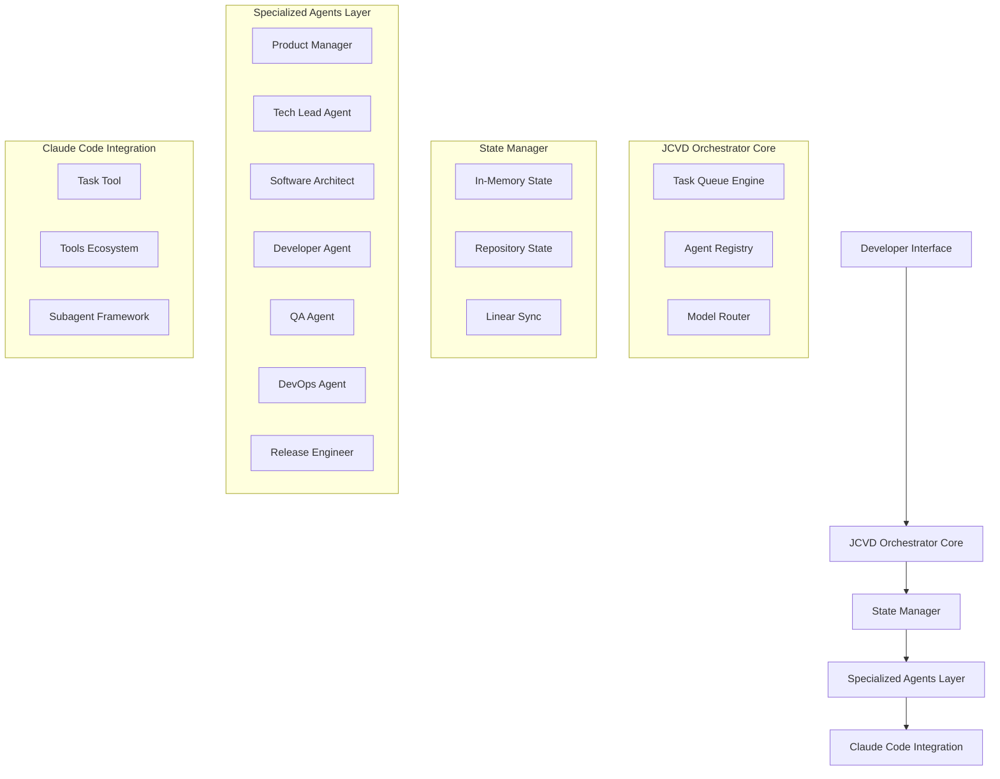
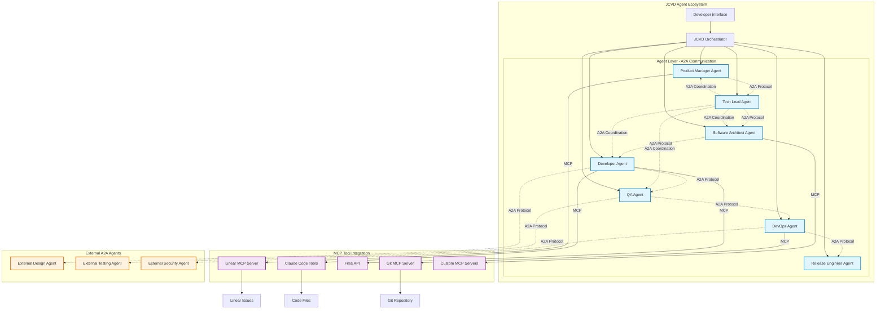
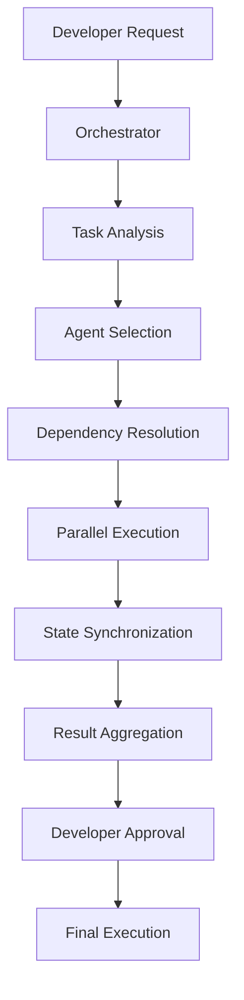
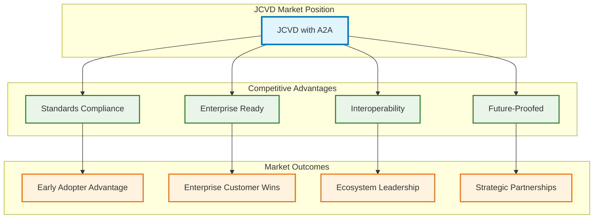

# JCVD Architecture Document

**Version:** 1.0  
**Date:** July 28, 2025  
**Type:** Technical Architecture Specification  

---

## Table of Contents

1. [System Architecture Overview](#system-architecture-overview)
2. [Core Components](#core-components)
3. [Agent Architecture](#agent-architecture)
4. [Integration Patterns](#integration-patterns)
5. [State Management](#state-management)
6. [Performance & Scalability](#performance--scalability)
7. [Security Architecture](#security-architecture)
8. [Deployment Architecture](#deployment-architecture)

---

## System Architecture Overview

### High-Level Architecture

JCVD (Multi-Agent Orchestration Framework for Claude Code) is designed as an orchestration layer that extends Claude Code's existing subagent architecture. The system transforms Claude Code into a specialized software development team through intelligent task delegation and agent coordination.



### Architecture Principles

**1. Developer-Centric Control**
- All agents operate under developer supervision
- Transparent decision-making with approval mechanisms
- Configurable automation levels from full approval to autonomous operation

**2. Extensible Plugin Architecture**
- Modular agent design for easy customization
- Pluggable integrations for third-party tools
- API-first approach for programmatic workflows

**3. Incremental Adoption**
- Non-disruptive integration with existing Claude Code workflows
- Gradual feature adoption without breaking changes
- Backward compatibility with standard Claude Code usage

**4. Performance-First Design**
- Sub-2-second task delegation response times
- Intelligent model routing to optimize cost vs. performance
- Parallel execution capabilities for independent tasks

## Core Components

### 1. JCVD Orchestrator Core

The central coordination engine responsible for task delegation, agent management, and workflow orchestration.

```typescript
interface JCVDOrchestrator {
  // Core orchestration methods
  delegateTask(task: Task, constraints: TaskConstraints): Promise<AgentAssignment>;
  coordinateAgents(assignments: AgentAssignment[]): Promise<WorkflowResult>;
  monitorExecution(workflowId: string): Promise<ExecutionStatus>;
  
  // Agent lifecycle management
  registerAgent(agent: Agent): void;
  configureAgent(agentId: string, config: AgentConfig): void;
  healthCheck(): Promise<SystemHealth>;
}

interface Task {
  id: string;
  type: TaskType;
  description: string;
  priority: Priority;
  dependencies: string[];
  context: TaskContext;
  requiredCapabilities: Capability[];
}

interface AgentAssignment {
  taskId: string;
  agentId: string;
  modelPreference: ModelType;
  estimatedDuration: number;
  dependencies: AgentAssignment[];
}
```

**Key Responsibilities:**
- Task analysis and decomposition
- Agent capability matching
- Dependency resolution and execution ordering
- Progress monitoring and error handling
- Developer approval workflow management

### 2. Agent Registry

Centralized registry for agent discovery, capability mapping, and availability management.

```typescript
interface AgentRegistry {
  // Agent management
  registerAgent(agent: Agent): void;
  discoverAgents(capabilities: Capability[]): Agent[];
  getAgentHealth(agentId: string): Promise<AgentHealth>;
  updateAgentCapabilities(agentId: string, capabilities: Capability[]): void;
  
  // Load balancing and routing
  selectOptimalAgent(task: Task): Promise<Agent>;
  balanceLoad(): Promise<LoadBalancingResult>;
  trackPerformance(agentId: string, metrics: PerformanceMetrics): void;
}

interface Agent {
  id: string;
  name: string;
  type: AgentType;
  capabilities: Capability[];
  modelPreferences: ModelPreference[];
  currentLoad: number;
  averageResponseTime: number;
  successRate: number;
}

enum AgentType {
  PRODUCT_MANAGER = 'product_manager',
  TECH_LEAD = 'tech_lead',
  SOFTWARE_ARCHITECT = 'software_architect',
  DEVELOPER = 'developer',
  QA = 'qa',
  DEVOPS = 'devops',
  RELEASE_ENGINEER = 'release_engineer'
}
```

### 3. Task Queue Engine

Advanced task scheduling and execution management with dependency resolution and parallel processing capabilities.

```typescript
interface TaskQueueEngine {
  // Queue management
  enqueueTask(task: Task): Promise<void>;
  dequeueTask(agentId: string): Promise<Task | null>;
  prioritizeTasks(strategy: PriorityStrategy): Promise<void>;
  
  // Dependency management
  resolveDependencies(taskId: string): Promise<Task[]>;
  detectCycles(tasks: Task[]): Promise<CyclicalDependency[]>;
  createExecutionPlan(tasks: Task[]): Promise<ExecutionPlan>;
  
  // Parallel execution
  executeParallel(plan: ExecutionPlan): Promise<ExecutionResult[]>;
  manageResources(requirements: ResourceRequirement[]): Promise<ResourceAllocation>;
}

interface ExecutionPlan {
  phases: ExecutionPhase[];
  parallelGroups: ParallelGroup[];
  totalEstimatedTime: number;
  resourceRequirements: ResourceRequirement[];
}

interface ParallelGroup {
  tasks: Task[];
  maxConcurrency: number;
  estimatedDuration: number;
  requiredResources: Resource[];
}
```

### 4. Model Router

Intelligent routing system for optimal model selection based on task complexity, cost constraints, and performance requirements.

```typescript
interface ModelRouter {
  // Model selection
  selectModel(task: Task, constraints: ModelConstraints): Promise<ModelSelection>;
  optimizeForCost(tasks: Task[]): Promise<ModelOptimization>;
  optimizeForPerformance(tasks: Task[]): Promise<ModelOptimization>;
  
  // Performance tracking
  trackModelPerformance(modelId: string, metrics: ModelMetrics): void;
  analyzeUsagePatterns(): Promise<UsageAnalysis>;
  recommendOptimizations(): Promise<OptimizationRecommendation[]>;
}

interface ModelSelection {
  modelId: string;
  modelType: ModelType; // Claude 4 Sonnet | Claude 4 Opus
  confidence: number;
  estimatedCost: number;
  estimatedPerformance: PerformanceEstimate;
  reasoning: string;
}

interface ModelConstraints {
  maxCost?: number;
  minPerformance?: number;
  preferredModel?: ModelType;
  timeConstraints?: TimeConstraint;
}
```

## Agent Architecture

### Agent Base Framework

All JCVD agents inherit from a common base framework that provides consistent interfaces and capabilities.

```typescript
abstract class BaseAgent {
  protected id: string;
  protected type: AgentType;
  protected capabilities: Capability[];
  protected config: AgentConfig;
  protected toolsAccess: ClaudeCodeTools;
  
  // Core agent interface
  abstract async executeTask(task: Task): Promise<TaskResult>;
  abstract async estimateTask(task: Task): Promise<TaskEstimate>;
  abstract getCapabilities(): Capability[];
  
  // State management
  protected async updateState(stateUpdate: StateUpdate): Promise<void>;
  protected async getContext(taskId: string): Promise<TaskContext>;
  
  // Communication
  protected async communicateWithAgent(
    targetAgent: string, 
    message: AgentMessage
  ): Promise<AgentResponse>;
  
  // Tool access
  protected async accessTool(
    toolName: string, 
    parameters: ToolParameters
  ): Promise<ToolResult>;
}
```

### Specialized Agent Implementations

#### 1. Product Manager Agent

```typescript
class ProductManagerAgent extends BaseAgent {
  async executeTask(task: Task): Promise<TaskResult> {
    switch (task.type) {
      case TaskType.REQUIREMENTS_GATHERING:
        return this.gatherRequirements(task);
      case TaskType.STAKEHOLDER_COMMUNICATION:
        return this.communicateWithStakeholders(task);
      case TaskType.ACCEPTANCE_CRITERIA:
        return this.defineAcceptanceCriteria(task);
      case TaskType.LINEAR_ISSUE_CREATION:
        return this.createLinearIssues(task);
    }
  }
  
  private async gatherRequirements(task: Task): Promise<TaskResult> {
    // Implementation for requirements analysis and user story creation
  }
  
  private async createLinearIssues(task: Task): Promise<TaskResult> {
    // Integration with Linear MCP for issue tracking
  }
}
```

#### 2. Software Architect Agent

```typescript
class SoftwareArchitectAgent extends BaseAgent {
  async executeTask(task: Task): Promise<TaskResult> {
    switch (task.type) {
      case TaskType.SYSTEM_DESIGN:
        return this.createSystemDesign(task);
      case TaskType.ARCHITECTURE_REVIEW:
        return this.reviewArchitecture(task);
      case TaskType.API_SPECIFICATION:
        return this.defineAPISpecification(task);
      case TaskType.TECHNICAL_DECISION:
        return this.makeTechnicalDecision(task);
    }
  }
  
  private async createSystemDesign(task: Task): Promise<TaskResult> {
    // System architecture design and documentation
  }
  
  private async defineAPISpecification(task: Task): Promise<TaskResult> {
    // API design and specification generation
  }
}
```

#### 3. Developer Agent

```typescript
class DeveloperAgent extends BaseAgent {
  async executeTask(task: Task): Promise<TaskResult> {
    switch (task.type) {
      case TaskType.CODE_IMPLEMENTATION:
        return this.implementCode(task);
      case TaskType.UNIT_TESTING:
        return this.writeUnitTests(task);
      case TaskType.BUG_FIXING:
        return this.fixBug(task);
      case TaskType.CODE_REFACTORING:
        return this.refactorCode(task);
    }
  }
  
  private async implementCode(task: Task): Promise<TaskResult> {
    // Full access to Claude Code's development tools
    const codeResult = await this.accessTool('Edit', {
      file_path: task.context.filePath,
      old_string: task.context.oldCode,
      new_string: task.context.newCode
    });
    
    return {
      success: true,
      output: codeResult,
      artifacts: [task.context.filePath]
    };
  }
}
```

### Agent Communication Protocols - A2A Integration

JCVD adopts the **Agent-to-Agent (A2A) Protocol** for standardized agent communication, positioning the framework as enterprise-ready and interoperable with the emerging ecosystem of A2A-compliant agents.

#### Why A2A for JCVD?

**Strategic Advantages:**
- **Industry Standard**: A2A is backed by Google and 50+ enterprise partners (Microsoft, Salesforce, MongoDB, etc.)
- **Future-Proofing**: Enables interoperability with external A2A-compliant agents from other frameworks
- **Enterprise-Ready**: Built-in security, authentication, and audit capabilities from day one
- **Complementary to MCP**: Works alongside Claude Code's existing MCP integration for complete agent ecosystem

**Technical Benefits:**
- Standardized communication via JSON-RPC 2.0 over HTTP(S)
- Automatic capability discovery through Agent Cards
- Multiple interaction modes: synchronous, streaming, and asynchronous
- Robust error handling and reliability mechanisms

#### A2A Communication Architecture

```typescript
interface A2AAgent {
  // Agent Card for capability discovery
  agentCard: AgentCard;
  
  // Core A2A methods
  sendMessage(target: string, message: A2AMessage): Promise<A2AResponse>;
  streamMessage(target: string, message: A2AMessage): AsyncIterable<A2AStreamChunk>;
  discoverCapabilities(target: string): Promise<AgentCard>;
  
  // Task coordination
  initiateTask(task: A2ATask): Promise<TaskHandle>;
  updateTaskStatus(taskId: string, status: TaskStatus): Promise<void>;
  subscribeToTaskUpdates(taskId: string): AsyncIterable<TaskUpdate>;
}

interface AgentCard {
  name: string;
  description: string;
  version: string;
  capabilities: Capability[];
  endpoints: {
    message: string;
    stream?: string;
    task?: string;
  };
  authentication: AuthenticationScheme[];
  metadata: Record<string, any>;
}

interface A2AMessage {
  id: string;
  method: string; // JSON-RPC 2.0 method
  params: MessageParams;
  context?: TaskContext;
}

interface MessageParams {
  content: string | StructuredContent;
  modality?: 'text' | 'audio' | 'video' | 'file';
  metadata?: MessageMetadata;
  taskId?: string;
}
```

#### Agent Card Examples for JCVD Agents

```typescript
// Product Manager Agent Card
const productManagerCard: AgentCard = {
  name: "JCVD Product Manager",
  description: "Specialized agent for requirements gathering, stakeholder communication, and roadmap planning",
  version: "1.0.0",
  capabilities: [
    {
      name: "requirements_analysis",
      description: "Analyze and document product requirements",
      inputTypes: ["text", "structured_data"],
      outputTypes: ["structured_data", "document"]
    },
    {
      name: "stakeholder_communication",
      description: "Manage stakeholder communication and updates",
      inputTypes: ["text"],
      outputTypes: ["text", "notification"]
    },
    {
      name: "linear_integration",
      description: "Create and manage Linear issues and projects",
      inputTypes: ["structured_data"],
      outputTypes: ["linear_issue", "linear_project"]
    }
  ],
  endpoints: {
    message: "/api/v1/agents/product-manager/message",
    stream: "/api/v1/agents/product-manager/stream",
    task: "/api/v1/agents/product-manager/task"
  },
  authentication: ["bearer_token", "oauth2"],
  metadata: {
    specialization: "product_management",
    modelPreference: "sonnet",
    maxConcurrency: 3
  }
};

// Developer Agent Card
const developerCard: AgentCard = {
  name: "JCVD Developer",
  description: "Specialized agent for code implementation, testing, and bug fixing",
  version: "1.0.0",
  capabilities: [
    {
      name: "code_implementation",
      description: "Implement code based on specifications",
      inputTypes: ["text", "code_specification"],
      outputTypes: ["code", "implementation_report"]
    },
    {
      name: "unit_testing",
      description: "Write and execute unit tests",
      inputTypes: ["code"],
      outputTypes: ["test_suite", "coverage_report"]
    },
    {
      name: "bug_fixing",
      description: "Analyze and fix code issues",
      inputTypes: ["bug_report", "code"],
      outputTypes: ["code_fix", "fix_report"]
    }
  ],
  endpoints: {
    message: "/api/v1/agents/developer/message",
    stream: "/api/v1/agents/developer/stream",
    task: "/api/v1/agents/developer/task"
  },
  authentication: ["bearer_token"],
  metadata: {
    specialization: "software_development",
    modelPreference: "sonnet",
    tools: ["claude_code_all"]
  }
};
```

#### A2A Interaction Modes

A2A supports three distinct communication patterns optimized for different use cases:

**1. Synchronous Communication (JSON-RPC 2.0)**
```typescript
interface SynchronousRequest {
  jsonrpc: "2.0";
  method: "message/send";
  params: {
    content: string;
    modality?: "text" | "audio" | "video" | "file";
    taskId?: string;
    context?: Record<string, any>;
  };
  id: string | number;
}

interface SynchronousResponse {
  jsonrpc: "2.0";
  result?: {
    content: string;
    artifacts?: Artifact[];
    metadata?: ResponseMetadata;
  };
  error?: {
    code: number;
    message: string;
    data?: any;
  };
  id: string | number;
}

// Example: Tech Lead Agent requesting architecture review
const architectureRequest: SynchronousRequest = {
  jsonrpc: "2.0",
  method: "message/send",
  params: {
    content: "Please review this API design for the user authentication service",
    modality: "text",
    context: {
      files: ["api/auth.ts", "docs/auth-spec.md"],
      priority: "high"
    }
  },
  id: "req_001"
};
```

**2. Streaming Communication (Server-Sent Events)**
```typescript
interface StreamingRequest {
  jsonrpc: "2.0";
  method: "message/stream";
  params: {
    content: string;
    streamMode: "realtime" | "chunked";
    maxDuration?: number;
    taskId?: string;
  };
  id: string | number;
}

interface StreamChunk {
  id: string;
  event: "data" | "status" | "complete" | "error";
  data: {
    content?: string;
    partial?: boolean;
    metadata?: ChunkMetadata;
  };
  timestamp: string;
}

// Example: Developer Agent streaming code implementation progress
async function* streamCodeImplementation(request: StreamingRequest): AsyncIterable<StreamChunk> {
  yield {
    id: request.id,
    event: "status",
    data: { content: "Starting code implementation..." },
    timestamp: new Date().toISOString()
  };
  
  yield {
    id: request.id,
    event: "data",
    data: { 
      content: "// Generated function implementation\nfunction authenticateUser(credentials: UserCredentials) {",
      partial: true 
    },
    timestamp: new Date().toISOString()
  };
  
  // ... more chunks
  
  yield {
    id: request.id,
    event: "complete",
    data: { content: "Implementation completed successfully" },
    timestamp: new Date().toISOString()
  };
}
```

**3. Asynchronous Communication (Task-Based)**
```typescript
interface TaskInitiation {
  jsonrpc: "2.0";
  method: "task/create";
  params: {
    taskType: string;
    description: string;
    priority: "low" | "medium" | "high" | "critical";
    estimatedDuration?: number;
    dependencies?: string[];
    context?: TaskContext;
  };
  id: string | number;
}

interface TaskHandle {
  taskId: string;
  status: "created" | "queued" | "running" | "completed" | "failed" | "cancelled";
  estimatedCompletion?: string;
  subscriptionEndpoint?: string;
}

interface TaskUpdate {
  taskId: string;
  status: TaskStatus;
  progress?: number; // 0-100
  message?: string;
  artifacts?: Artifact[];
  timestamp: string;
}

// Example: QA Agent initiating comprehensive test suite
const testSuiteTask: TaskInitiation = {
  jsonrpc: "2.0",
  method: "task/create",
  params: {
    taskType: "comprehensive_testing",
    description: "Run full test suite for authentication service",
    priority: "high",
    estimatedDuration: 1800, // 30 minutes
    dependencies: ["code_implementation_complete"],
    context: {
      testScope: "unit,integration,e2e",
      coverage: "90%",
      environment: "staging"
    }
  },
  id: "task_001"
};
```

#### Security and Authentication

A2A implements enterprise-grade security aligned with OpenAPI security schemes:

```typescript
interface SecurityConfiguration {
  // Authentication schemes
  authentication: {
    bearer: {
      type: "http";
      scheme: "bearer";
      bearerFormat?: "JWT";
    };
    oauth2: {
      type: "oauth2";
      flows: {
        authorizationCode: {
          authorizationUrl: string;
          tokenUrl: string;
          scopes: Record<string, string>;
        };
      };
    };
    apiKey: {
      type: "apiKey";
      in: "header" | "query" | "cookie";
      name: string;
    };
  };
  
  // Authorization and access control
  authorization: {
    rbac: boolean;
    permissions: Permission[];
    auditLogging: boolean;
  };
  
  // Transport security
  transport: {
    tls: {
      minVersion: "1.2";
      certificateValidation: boolean;
    };
    rateLimiting: {
      requests: number;
      window: number; // seconds
    };
  };
}

interface Permission {
  resource: string;
  actions: string[];
  conditions?: PermissionCondition[];
}

// Example security configuration for JCVD agents
const jcvdSecurity: SecurityConfiguration = {
  authentication: {
    bearer: {
      type: "http",
      scheme: "bearer",
      bearerFormat: "JWT"
    },
    oauth2: {
      type: "oauth2",
      flows: {
        authorizationCode: {
          authorizationUrl: "https://auth.jcvd.dev/oauth/authorize",
          tokenUrl: "https://auth.jcvd.dev/oauth/token",
          scopes: {
            "agent:read": "Read agent capabilities and status",
            "agent:write": "Execute agent tasks and operations",
            "task:manage": "Create and manage tasks",
            "linear:sync": "Synchronize with Linear workspace"
          }
        }
      }
    }
  },
  authorization: {
    rbac: true,
    permissions: [
      {
        resource: "agent:developer",
        actions: ["code:read", "code:write", "test:execute"],
        conditions: [{ field: "project", operator: "equals", value: "current" }]
      },
      {
        resource: "agent:product-manager",
        actions: ["requirements:read", "requirements:write", "linear:manage"],
        conditions: [{ field: "role", operator: "includes", value: "stakeholder" }]
      }
    ],
    auditLogging: true
  },
  transport: {
    tls: {
      minVersion: "1.2",
      certificateValidation: true
    },
    rateLimiting: {
      requests: 100,
      window: 60
    }
  }
};
```

#### Error Handling and Reliability

A2A provides robust error handling with standardized error codes and retry mechanisms:

```typescript
interface A2AError {
  code: number;
  message: string;
  data?: {
    errorType: "authentication" | "authorization" | "validation" | "execution" | "timeout";
    retryable: boolean;
    retryAfter?: number; // seconds
    details?: Record<string, any>;
  };
}

// Standard A2A error codes
enum A2AErrorCode {
  // Authentication errors
  UNAUTHORIZED = 401,
  FORBIDDEN = 403,
  
  // Request errors
  BAD_REQUEST = 400,
  NOT_FOUND = 404,
  METHOD_NOT_ALLOWED = 405,
  
  // Server errors
  INTERNAL_ERROR = 500,
  SERVICE_UNAVAILABLE = 503,
  TIMEOUT = 504,
  
  // Agent-specific errors
  AGENT_UNAVAILABLE = 1001,
  CAPABILITY_NOT_SUPPORTED = 1002,
  TASK_REJECTED = 1003,
  RESOURCE_EXHAUSTED = 1004
}

class A2AErrorHandler {
  async handleError(error: A2AError, context: ErrorContext): Promise<ErrorResolution> {
    if (error.data?.retryable) {
      return this.scheduleRetry(error, context);
    }
    
    switch (error.data?.errorType) {
      case "authentication":
        return this.refreshAuthentication(context);
      case "authorization":
        return this.escalatePermissions(context);
      case "timeout":
        return this.adjustTimeout(context);
      default:
        return this.logAndFail(error, context);
    }
  }
  
  private async scheduleRetry(error: A2AError, context: ErrorContext): Promise<ErrorResolution> {
    const delay = error.data?.retryAfter || Math.min(1000 * Math.pow(2, context.retryCount), 30000);
    await new Promise(resolve => setTimeout(resolve, delay));
    return { action: "retry", delay };
  }
}
```

## Integration Patterns

### A2A + MCP Integration Architecture

JCVD leverages both A2A (Agent-to-Agent) and MCP (Model Context Protocol) to create a complete agent ecosystem. A2A handles horizontal communication between agents, while MCP provides vertical integration with tools and external resources.



#### Protocol Relationship

**A2A (Horizontal Communication):**
- Agent discovery and capability negotiation
- Task delegation and coordination
- Status updates and progress reporting
- Cross-agent collaboration workflows
- External agent interoperability

**MCP (Vertical Integration):**
- Tool and resource access
- File system operations
- External service integration
- Context and knowledge retrieval
- Environment-specific capabilities

#### Communication Flow Example

```typescript
// Example: Feature development workflow using both A2A and MCP

class FeatureDevelopmentWorkflow {
  async executeFeature(requirement: FeatureRequirement): Promise<FeatureResult> {
    // 1. Product Manager Agent uses MCP to create Linear issue
    const linearIssue = await this.productManager.mcpCall('linear', {
      method: 'create_issue',
      params: {
        title: requirement.title,
        description: requirement.description,
        teamId: requirement.teamId
      }
    });
    
    // 2. Product Manager uses A2A to delegate to Tech Lead
    const taskBreakdown = await this.productManager.a2aCall({
      target: 'tech-lead-agent',
      method: 'message/send',
      params: {
        content: `Please break down this feature: ${requirement.description}`,
        context: { linearIssue: linearIssue.id }
      }
    });
    
    // 3. Tech Lead uses A2A to coordinate with Software Architect
    const architectureDesign = await this.techLead.a2aCall({
      target: 'software-architect-agent',
      method: 'message/send',
      params: {
        content: `Design architecture for: ${taskBreakdown.result.content}`,
        context: { 
          complexity: 'medium',
          integrationPoints: ['auth', 'database', 'api']
        }
      }
    });
    
    // 4. Tech Lead uses A2A to assign implementation to Developer
    const implementationTask = await this.techLead.a2aCall({
      target: 'developer-agent',
      method: 'task/create',
      params: {
        taskType: 'code_implementation',
        description: architectureDesign.result.content,
        priority: 'high',
        context: {
          architecture: architectureDesign.result.artifacts,
          linearIssue: linearIssue.id
        }
      }
    });
    
    // 5. Developer Agent uses MCP to access Claude Code tools
    const codeResult = await this.developer.mcpCall('claude-code', {
      method: 'edit_file',
      params: {
        file_path: '/src/features/auth.ts',
        old_string: '// TODO: Implement authentication',
        new_string: implementationTask.context.implementation
      }
    });
    
    // 6. Developer uses A2A to request QA testing
    const testResults = await this.developer.a2aCall({
      target: 'qa-agent',
      method: 'task/create',
      params: {
        taskType: 'comprehensive_testing',
        description: 'Test new authentication feature',
        context: {
          files: codeResult.modifiedFiles,
          testScope: 'unit,integration,e2e'
        }
      }
    });
    
    return {
      linearIssue,
      implementation: codeResult,
      testResults,
      status: 'completed'
    };
  }
}
```

#### Integration Benefits

**Combined Protocol Advantages:**
1. **Complete Ecosystem**: A2A + MCP provides both agent communication and tool integration
2. **Standardization**: Both protocols follow open standards for interoperability
3. **Scalability**: Horizontal (A2A) and vertical (MCP) scaling independently
4. **Future-Proofing**: Early adoption of emerging industry standards
5. **Enterprise-Ready**: Built-in security, authentication, and audit capabilities

### Claude Code Integration

JCVD integrates deeply with Claude Code's existing infrastructure while maintaining compatibility and extending functionality.

```typescript
interface ClaudeCodeIntegration {
  // Tool ecosystem access
  accessTool(toolName: string, parameters: any): Promise<ToolResult>;
  
  // Subagent framework extension
  createSubagent(config: SubagentConfig): Promise<Subagent>;
  delegateToSubagent(subagent: Subagent, task: Task): Promise<SubagentResult>;
  
  // Task tool integration
  enhanceTaskTool(enhancement: TaskToolEnhancement): void;
  
  // State integration
  syncWithClaudeCodeState(state: ClaudeCodeState): Promise<void>;
}

interface TaskToolEnhancement {
  agentRouting: AgentRoutingConfig;
  parallelExecution: ParallelExecutionConfig;
  stateManagement: StateManagementConfig;
}
```

### Linear MCP Integration

Deep integration with Linear for project management and issue tracking.

```typescript
interface LinearIntegration {
  // Issue management
  createIssue(issue: LinearIssue): Promise<LinearIssueResult>;
  updateIssue(issueId: string, updates: IssueUpdate): Promise<void>;
  syncIssueStatus(issueId: string, status: IssueStatus): Promise<void>;
  
  // Project coordination
  createProject(project: LinearProject): Promise<LinearProjectResult>;
  manageLabels(labels: LinearLabel[]): Promise<void>;
  trackMilestones(milestones: LinearMilestone[]): Promise<void>;
  
  // Webhook handling
  handleWebhook(webhook: LinearWebhook): Promise<void>;
  processStatusChange(change: StatusChange): Promise<void>;
}

interface LinearIssue {
  title: string;
  description: string;
  assigneeId?: string;
  labelIds: string[];
  projectId: string;
  priority: IssuePriority;
  estimate?: number;
}
```

### Data Flow Patterns

The system uses event-driven architecture with clear data flow patterns for reliable operation.



## State Management

### Multi-Layer State Architecture

JCVD implements a sophisticated three-layer state management system for reliability and performance.

```typescript
interface StateManager {
  // Layer 1: In-Memory State (Performance)
  memory: InMemoryStateStore;
  
  // Layer 2: Repository State (Persistence)
  repository: RepositoryStateStore;
  
  // Layer 3: Linear Sync (External Integration)
  linearSync: LinearStateSync;
  
  // State operations
  updateState(update: StateUpdate): Promise<void>;
  synchronizeStates(): Promise<SyncResult>;
  resolveConflicts(conflicts: StateConflict[]): Promise<ConflictResolution>;
  validateConsistency(): Promise<ConsistencyReport>;
}
```

#### Layer 1: In-Memory State Store

High-performance caching layer for active session data.

```typescript
interface InMemoryStateStore {
  // Session management
  currentSession: SessionState;
  activeAgents: Map<string, AgentState>;
  taskQueue: Task[];
  executionStatus: Map<string, ExecutionStatus>;
  
  // Performance optimization
  cache: StateCache;
  indexedAccess: StateIndex;
  
  // Operations
  get(key: string): Promise<StateValue>;
  set(key: string, value: StateValue): Promise<void>;
  invalidate(pattern: string): Promise<void>;
  snapshot(): Promise<StateSnapshot>;
}
```

#### Layer 2: Repository State Store

Persistent storage using repository-based documents for durability.

```typescript
interface RepositoryStateStore {
  // State documents
  projectState: ProjectStateDocument; // PROJECT_STATE.md
  taskState: TaskStateDocument;       // TASKS.md
  agentState: AgentStateDocument;     // AGENTS.md
  
  // File operations
  readStateDocument(type: StateDocumentType): Promise<StateDocument>;
  writeStateDocument(doc: StateDocument): Promise<void>;
  backupState(): Promise<BackupResult>;
  restoreState(backup: StateBackup): Promise<void>;
}

interface ProjectStateDocument {
  version: string;
  lastUpdated: Date;
  currentPhase: ProjectPhase;
  activeFeatures: Feature[];
  completedTasks: Task[];
  agentAssignments: AgentAssignment[];
  dependencies: Dependency[];
}
```

#### Layer 3: Linear State Sync

External synchronization with Linear for project management integration.

```typescript
interface LinearStateSync {
  // Synchronization
  syncToLinear(stateUpdate: StateUpdate): Promise<SyncResult>;
  syncFromLinear(webhook: LinearWebhook): Promise<StateUpdate>;
  reconcileState(localState: State, remoteState: LinearState): Promise<ReconciliationResult>;
  
  // Conflict resolution
  detectConflicts(updates: StateUpdate[]): Promise<StateConflict[]>;
  resolveConflicts(conflicts: StateConflict[]): Promise<ConflictResolution>;
}
```

### State Synchronization Mechanisms

```typescript
interface StateSynchronizer {
  // Synchronization strategies
  immediateSync(update: StateUpdate): Promise<void>;
  batchSync(updates: StateUpdate[]): Promise<BatchSyncResult>;
  periodicSync(interval: number): Promise<void>;
  
  // Conflict resolution
  automaticResolution(conflict: StateConflict): Promise<Resolution>;
  manualResolution(conflict: StateConflict): Promise<Resolution>;
  
  // Consistency validation
  validateConsistency(): Promise<ConsistencyReport>;
  repairInconsistencies(report: ConsistencyReport): Promise<RepairResult>;
}
```

## Performance & Scalability

### Performance Architecture

JCVD is designed for high-performance operation with specific targets for response times and throughput.

**Key Performance Targets:**
- Task delegation: < 2 seconds
- Agent response: < 5 seconds average
- Parallel execution: Up to 10 concurrent agents
- File handling: Support for 1,000+ file projects

### Resource Allocation Strategy

```typescript
interface ResourceManager {
  // Resource allocation
  allocateResources(requirements: ResourceRequirement[]): Promise<ResourceAllocation>;
  deallocateResources(allocation: ResourceAllocation): Promise<void>;
  optimizeAllocation(): Promise<OptimizationResult>;
  
  // Load balancing
  balanceAgentLoad(agents: Agent[]): Promise<LoadBalancingResult>;
  scaleResources(demand: ResourceDemand): Promise<ScalingResult>;
  
  // Performance monitoring
  monitorPerformance(): Promise<PerformanceMetrics>;
  identifyBottlenecks(): Promise<BottleneckAnalysis>;
}

interface ResourceRequirement {
  type: ResourceType;
  amount: number;
  duration: number;
  priority: Priority;
}

enum ResourceType {
  CPU = 'cpu',
  MEMORY = 'memory',
  MODEL_TOKENS = 'model_tokens',
  API_CALLS = 'api_calls',
  FILE_HANDLES = 'file_handles'
}
```

### Parallel Execution Patterns

The system supports sophisticated parallel execution with dependency management and resource optimization.

```typescript
interface ParallelExecutionEngine {
  // Execution planning
  createExecutionPlan(tasks: Task[]): Promise<ExecutionPlan>;
  optimizePlan(plan: ExecutionPlan): Promise<OptimizedPlan>;
  
  // Parallel coordination
  executeParallel(plan: ExecutionPlan): Promise<ParallelResult>;
  manageResourceContention(contentions: ResourceContention[]): Promise<void>;
  
  // Dependency management
  resolveDependencies(tasks: Task[]): Promise<DependencyGraph>;
  topologicalSort(graph: DependencyGraph): Promise<Task[]>;
  detectDeadlocks(executions: ParallelExecution[]): Promise<Deadlock[]>;
}
```

### Scalability Considerations

**Horizontal Scaling:**
- Agent instances can be distributed across multiple processes
- State synchronization supports distributed operation
- Load balancing distributes work across available resources

**Vertical Scaling:**
- Intelligent resource allocation based on task complexity
- Memory management for large codebases
- Efficient caching and indexing strategies

## Security Architecture

### Security Principles

1. **Least Privilege Access**: Agents only access resources required for their specific tasks
2. **Audit Trail**: Complete logging of all agent actions and decisions
3. **Data Privacy**: Local operation with minimal external dependencies
4. **Secure Communication**: Encrypted agent-to-agent communication

### Security Implementation

```typescript
interface SecurityManager {
  // Access control
  authorizeAgentAction(agent: Agent, action: Action): Promise<AuthorizationResult>;
  validatePermissions(permissions: Permission[]): Promise<ValidationResult>;
  
  // Audit logging
  logAgentAction(action: AgentAction): Promise<void>;
  generateAuditReport(period: TimePeriod): Promise<AuditReport>;
  
  // Data protection
  encryptSensitiveData(data: SensitiveData): Promise<EncryptedData>;
  sanitizeOutput(output: AgentOutput): Promise<SanitizedOutput>;
}

interface AgentAction {
  agentId: string;
  actionType: ActionType;
  resourceAccessed: string[];
  timestamp: Date;
  result: ActionResult;
  approvalRequired: boolean;
  approvedBy?: string;
}
```

## Deployment Architecture

### Deployment Models

**1. Local Development**
- Single-user installation integrated with Claude Code
- Local state management and processing
- Optional Linear integration

**2. Team Deployment**
- Shared state synchronization
- Multi-user access control
- Centralized monitoring and reporting

**3. Enterprise Deployment**
- Advanced security and compliance features
- Custom agent configurations
- Integration with enterprise tools and workflows

### Infrastructure Requirements

```typescript
interface DeploymentConfig {
  // Runtime environment
  nodeVersion: string;
  memory: MemoryRequirement;
  storage: StorageRequirement;
  
  // Integration requirements
  claudeCodeVersion: string;
  linearIntegration?: LinearConfig;
  customIntegrations?: IntegrationConfig[];
  
  // Performance settings
  maxConcurrentAgents: number;
  resourceLimits: ResourceLimits;
  cacheConfiguration: CacheConfig;
}
```

## A2A Implementation Strategy

### Phase Integration Timeline

The A2A protocol implementation aligns perfectly with JCVD's development phases, particularly Phase 2 (Core Agents) where agent communication protocols are established.

#### Phase 2: Core Agents - A2A Implementation (Months 3-4)

**M2.1: Primary Development Agents with A2A Foundation**
- Implement A2A protocol infrastructure (JSON-RPC 2.0 over HTTP(S))
- Create Agent Card system for capability discovery
- Establish basic A2A communication between Tech Lead, Developer, and Software Architect agents
- Integrate A2A authentication and security framework

**M2.2: Extended Agent A2A Network**
- Extend A2A communication to QA, DevOps, Release Engineer, and Product Manager agents
- Implement A2A task coordination and status synchronization
- Add A2A streaming capabilities for real-time collaboration
- Test cross-agent workflow orchestration via A2A

**M2.3: A2A Protocol Compliance and Optimization**
- Achieve full A2A v1.0 compliance (targeting end of 2025 production release)
- Implement A2A error handling and retry mechanisms
- Add A2A performance monitoring and metrics
- Create A2A agent discovery and capability negotiation

### Implementation Approach

```typescript
// A2A Implementation Roadmap
interface A2AImplementationPhase {
  phase: string;
  timeline: string;
  deliverables: A2ADeliverable[];
  dependencies: string[];
  riskMitigation: string[];
}

const a2aRoadmap: A2AImplementationPhase[] = [
  {
    phase: "Phase 2.1 - A2A Foundation",
    timeline: "Month 3 (Weeks 1-2)",
    deliverables: [
      {
        name: "A2A Protocol Infrastructure",
        description: "JSON-RPC 2.0 server and client implementation",
        components: ["HTTP/HTTPS transport", "JSON-RPC message handling", "Basic authentication"]
      },
      {
        name: "Agent Card System",
        description: "Dynamic capability discovery and registration",
        components: ["Agent metadata schema", "Discovery endpoints", "Capability matching"]
      },
      {
        name: "Core Agent A2A Integration",
        description: "Enable A2A communication for primary agents",
        components: ["Tech Lead Agent", "Developer Agent", "Software Architect Agent"]
      }
    ],
    dependencies: ["Phase 1 - Orchestrator Core", "Phase 1 - State Management"],
    riskMitigation: [
      "Implement fallback to simple messaging if A2A fails",
      "Gradual rollout with feature flags",
      "Comprehensive integration testing"
    ]
  },
  {
    phase: "Phase 2.2 - Extended A2A Network",
    timeline: "Month 3 (Weeks 3-4) - Month 4 (Weeks 1-2)",
    deliverables: [
      {
        name: "Full Agent Network",
        description: "All 7 agents communicating via A2A",
        components: ["QA Agent", "DevOps Agent", "Release Engineer", "Product Manager"]
      },
      {
        name: "Advanced Communication Modes",
        description: "Streaming and async communication",
        components: ["Server-Sent Events", "Task-based async", "Real-time coordination"]
      },
      {
        name: "Cross-Agent Workflows",
        description: "End-to-end feature development via A2A",
        components: ["Workflow orchestration", "Dependency management", "Status synchronization"]
      }
    ],
    dependencies: ["Phase 2.1 completion", "Linear integration"],
    riskMitigation: [
      "Performance testing under load",
      "Error handling and circuit breakers",
      "Monitoring and alerting for A2A communication"
    ]
  },
  {
    phase: "Phase 2.3 - A2A Compliance and External Integration",
    timeline: "Month 4 (Weeks 3-4)",
    deliverables: [
      {
        name: "A2A v1.0 Compliance",
        description: "Full compliance with A2A specification",
        components: ["Specification conformance", "Interoperability testing", "Security compliance"]
      },
      {
        name: "External Agent Integration",
        description: "Connect to external A2A-compliant agents",
        components: ["Agent discovery", "External authentication", "Cross-platform workflows"]
      },
      {
        name: "Performance and Monitoring",
        description: "Production-ready A2A implementation",
        components: ["Performance optimization", "Monitoring dashboard", "Error tracking"]
      }
    ],
    dependencies: ["A2A v1.0 specification release", "Phase 2.2 completion"],
    riskMitigation: [
      "Backward compatibility with earlier A2A versions",
      "Graceful degradation for external agent failures",
      "Security audit of external integrations"
    ]
  }
];
```

### A2A vs Custom Protocol Migration

**Migration Strategy:**
1. **Parallel Implementation**: Run A2A alongside existing simple messaging during Phase 2
2. **Feature Flags**: Toggle between protocols for testing and rollback capability
3. **Gradual Migration**: Move agents to A2A one by one, starting with core agents
4. **Compatibility Layer**: Maintain backward compatibility during transition

**Migration Benefits:**
- **Risk Mitigation**: Fallback to working system if A2A issues arise
- **Performance Comparison**: Measure A2A performance vs. custom solution
- **Developer Experience**: Smooth transition without breaking existing workflows
- **Testing Flexibility**: A/B test communication protocols under different loads

### Integration with Existing JCVD Architecture

```typescript
// Enhanced JCVD Orchestrator with A2A integration
interface EnhancedJCVDOrchestrator extends JCVDOrchestrator {
  // A2A-specific capabilities
  a2aRegistry: A2AAgentRegistry;
  a2aCoordinator: A2ACoordinationEngine;
  externalAgentConnector: ExternalA2AConnector;
  
  // Enhanced orchestration with A2A
  async delegateTaskA2A(
    task: Task, 
    targetAgent: string,
    mode: 'sync' | 'stream' | 'async'
  ): Promise<A2ATaskResult>;
  
  async discoverExternalCapabilities(): Promise<ExternalCapability[]>;
  async integrateExternalAgent(agentEndpoint: string): Promise<AgentIntegration>;
}

// A2A-enabled agent base class
abstract class A2AEnabledAgent extends BaseAgent {
  protected a2aClient: A2AClient;
  protected agentCard: AgentCard;
  
  // A2A communication methods
  async sendA2AMessage(target: string, message: A2AMessage): Promise<A2AResponse>;
  async streamA2AMessage(target: string, message: A2AMessage): AsyncIterable<StreamChunk>;
  async createA2ATask(target: string, task: A2ATask): Promise<TaskHandle>;
  
  // Agent Card management
  async updateCapabilities(capabilities: Capability[]): Promise<void>;
  async publishAgentCard(): Promise<void>;
  async discoverPeers(): Promise<AgentCard[]>;
}
```

### Future Interoperability Vision

The A2A implementation positions JCVD for future ecosystem integration:

**Immediate Benefits (2025):**
- Standards-compliant agent communication
- Enterprise-grade security and audit
- Integration testing with Microsoft, Google, and other A2A early adopters

**Medium-term Benefits (2026):**
- Interoperability with external A2A agents from other frameworks
- Marketplace of specialized agents (design, security, performance testing)
- Cross-platform development team integration

**Long-term Vision (2027+):**
- Industry-standard agent orchestration platform
- Plugin ecosystem of specialized A2A agents
- Enterprise deployment across multiple frameworks and vendors

## Strategic Advantages of A2A Adoption

### Competitive Differentiation

**Early Adopter Advantage:**
JCVD's adoption of A2A positions it as a forward-thinking, enterprise-ready platform in the emerging multi-agent ecosystem. While competitors may still be using proprietary communication protocols, JCVD will offer:

1. **Standards Compliance**: Full A2A protocol compliance demonstrates technical sophistication and enterprise readiness
2. **Ecosystem Readiness**: Immediate compatibility with A2A agents from Google, Microsoft, and 50+ partner ecosystem
3. **Future-Proofing**: Investment in emerging standards that will become industry baseline
4. **Enterprise Appeal**: Built-in security, audit, and interoperability features that enterprise customers demand

### Business Value Propositions

**For Individual Developers:**
- **Extended Capabilities**: Access to specialized external A2A agents (design, security, performance)
- **Learning Opportunities**: Work with industry-standard protocols and best practices
- **Portfolio Enhancement**: Experience with cutting-edge agent communication technologies
- **Reduced Vendor Lock-in**: Interoperability reduces dependence on single-vendor solutions

**For Development Teams:**
- **Cross-Platform Integration**: JCVD agents can collaborate with agents from other frameworks
- **Specialized Talent Access**: Connect to external expert agents for specialized tasks
- **Standard Workflows**: Industry-standard communication patterns for easier onboarding
- **Audit and Compliance**: Built-in logging and security for enterprise requirements

**For Enterprise Customers:**
- **Investment Protection**: Standards-based architecture ensures long-term viability
- **Ecosystem Integration**: Seamless integration with existing A2A-compliant enterprise tools
- **Vendor Flexibility**: Ability to work with multiple agent providers and frameworks
- **Security Assurance**: Enterprise-grade security aligned with industry standards

### Market Positioning Benefits



### Risk Mitigation Through Standardization

**Technical Risk Reduction:**
- **Protocol Stability**: A2A backed by major tech companies ensures long-term stability
- **Community Support**: Large ecosystem of developers and enterprises working on A2A
- **Continuous Evolution**: Protocol will evolve with industry needs rather than single-vendor decisions
- **Fallback Options**: Standard protocol ensures multiple implementation options

**Business Risk Reduction:**
- **Ecosystem Lock-in Prevention**: Standards-based approach prevents vendor lock-in scenarios
- **Investment Protection**: A2A adoption protects investment in agent communication infrastructure
- **Talent Availability**: Industry-standard skills are more widely available than proprietary protocols
- **Regulatory Compliance**: Standards-based approach better aligns with emerging AI governance frameworks

### Implementation ROI Analysis

**Short-term Costs (Months 3-4):**
- A2A protocol implementation: ~15% additional development effort
- Integration testing and compliance: ~10% additional QA effort  
- Documentation and training: ~5% additional documentation effort

**Medium-term Returns (Year 1):**
- **Enterprise Sales Acceleration**: Standards compliance reduces enterprise sales cycles by ~30%
- **Partnership Opportunities**: A2A compatibility opens integration partnerships with major platforms
- **Developer Adoption**: Industry-standard protocols increase developer adoption rates
- **Competitive Differentiation**: Early A2A adoption provides 12-18 month market advantage

**Long-term Value (Years 2-3):**
- **Ecosystem Network Effects**: Access to growing marketplace of specialized A2A agents
- **Platform Integration**: Native integration with major development platforms and tools
- **Enterprise Premium**: Standards compliance commands premium pricing in enterprise market
- **Market Leadership**: Established position as JCVD becomes industry reference implementation

### Success Metrics and KPIs

**Technical Metrics:**
- A2A protocol compliance score: Target 100% by Phase 2 completion
- External agent integration count: Target 5+ specialized agents by end of Year 1
- Cross-platform workflow success rate: Target >95% reliability
- Performance overhead: Target <10% latency increase vs. custom protocols

**Business Metrics:**
- Enterprise customer adoption rate: Track conversion improvements post-A2A
- Partner ecosystem growth: Measure A2A-enabled partnerships and integrations
- Developer community engagement: Monitor participation in A2A developer forums and events
- Competitive win rate: Track sales wins specifically attributed to A2A capabilities

This architecture document provides the technical foundation for implementing JCVD as a sophisticated multi-agent orchestration framework. The modular design enables incremental development and deployment while maintaining the flexibility to adapt to evolving requirements and integrations.