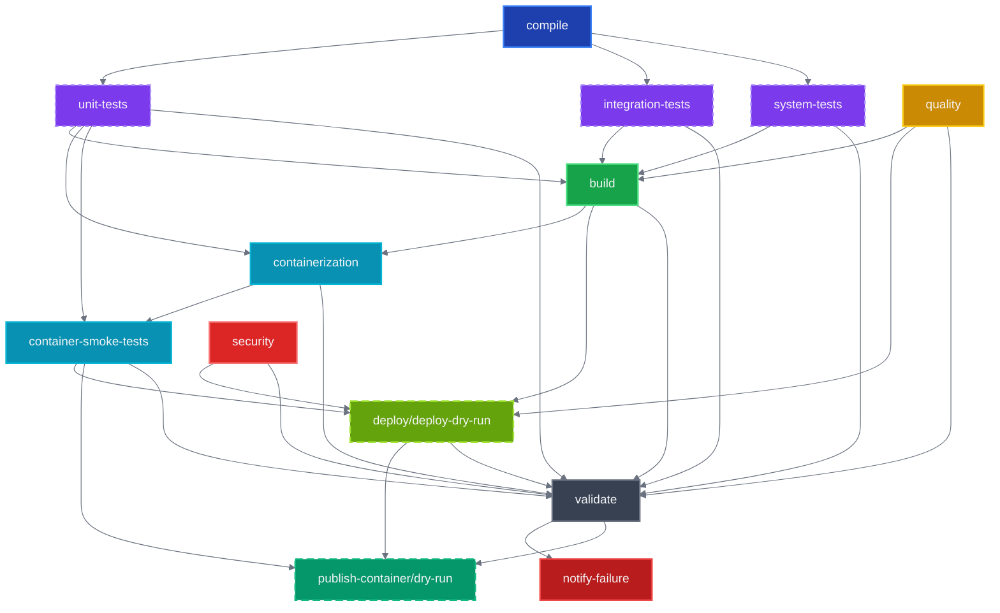
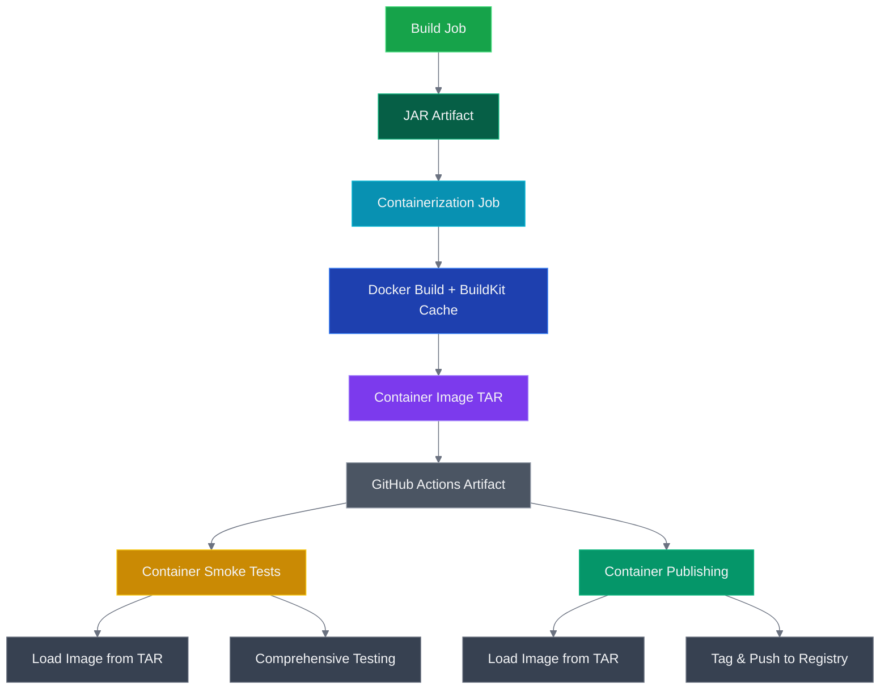
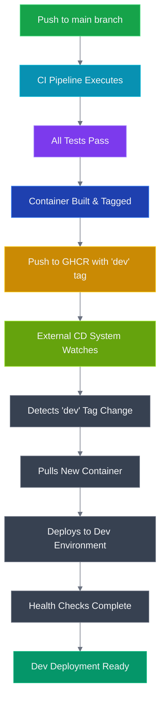

# CI/CD Architecture Documentation

## Overview

JCVD employs a comprehensive CI/CD pipeline designed for maximum performance, reliability, and developer experience. The pipeline implements a **compile-first architecture** with intelligent caching, parallel execution, and smart build skipping to minimize feedback time and resource consumption.

## Pipeline Philosophy

Our CI/CD system is built on several core principles:

1. **Compile-First Architecture**: Separate compilation from execution to enable artifact reuse
2. **Intelligent Build Skipping**: Skip unnecessary work when only documentation changes
3. **Comprehensive Caching Strategy**: Multi-layer caching across dependencies, compilation, and test results
4. **Parallel Execution**: Maximize throughput through strategic job parallelization
5. **Fail-Fast Strategy**: Quick feedback on critical issues while preserving complete test coverage

## Job Dependency Graph



## Artifact Flow Architecture

```mermaid
%%{init: {'theme':'dark', 'themeVariables': { 'primaryColor':'#1f2937', 'primaryTextColor':'#f3f4f6', 'primaryBorderColor':'#4b5563', 'lineColor':'#6b7280', 'secondaryColor':'#374151', 'tertiaryColor':'#1f2937', 'background':'#111827', 'mainBkg':'#1f2937', 'secondBkg':'#374151', 'tertiaryBkg':'#4b5563', 'textColor':'#f3f4f6', 'labelTextColor':'#f3f4f6', 'nodeTextColor':'#f3f4f6', 'edgeLabelBackground':'#1f2937'}}}%%
graph LR
    subgraph "Compile Stage"
        A[Source Code] --> B[Gradle Compile]
        B --> C[Compiled Classes]
        B --> D[Kotlin Artifacts]
        B --> E[Test Classes]
    end
    
    subgraph "Artifact Storage"
        C --> F[compiled-artifacts]
        D --> F
        E --> F
        F --> G[GitHub Actions Artifacts]
    end
    
    subgraph "Test Stages"
        G --> H[Unit Tests]
        G --> I[Integration Tests]
        G --> J[System Tests]
        H --> K[unit-test-results]
        I --> L[integration-test-results]
        J --> M[system-test-results]
    end
    
    subgraph "Build Stage"
        G --> N[Build Application]
        N --> O[jcvd-jar]
        N --> P[build-artifacts]
    end
    
    subgraph "Container Stage"
        O --> Q[Containerization]
        P --> Q
        Q --> R[Container Artifact]
        R --> S[Container Tests]
        S --> U[Container Publishing]
    end
    
    subgraph "Deployment Stage"
        P --> T[Deploy Readiness]
        K --> T
        L --> T
        M --> T
        S --> T
        U --> T
    end
    
    style A fill:#1f2937,stroke:#4b5563,color:#f3f4f6
    style B fill:#1e40af,stroke:#3b82f6,color:#f3f4f6
    style C fill:#374151,stroke:#6b7280,color:#f3f4f6
    style D fill:#374151,stroke:#6b7280,color:#f3f4f6
    style E fill:#374151,stroke:#6b7280,color:#f3f4f6
    style F fill:#0891b2,stroke:#06b6d4,color:#f3f4f6
    style G fill:#4b5563,stroke:#9ca3af,color:#f3f4f6
    style H fill:#7c3aed,stroke:#a78bfa,color:#f3f4f6
    style I fill:#7c3aed,stroke:#a78bfa,color:#f3f4f6
    style J fill:#7c3aed,stroke:#a78bfa,color:#f3f4f6
    style K fill:#6b7280,stroke:#9ca3af,color:#f3f4f6
    style L fill:#6b7280,stroke:#9ca3af,color:#f3f4f6
    style M fill:#6b7280,stroke:#9ca3af,color:#f3f4f6
    style N fill:#16a34a,stroke:#4ade80,color:#f3f4f6
    style O fill:#065f46,stroke:#10b981,color:#f3f4f6
    style P fill:#065f46,stroke:#10b981,color:#f3f4f6
    style Q fill:#0891b2,stroke:#06b6d4,color:#f3f4f6
    style R fill:#1e40af,stroke:#3b82f6,color:#f3f4f6
    style S fill:#0891b2,stroke:#06b6d4,color:#f3f4f6
    style T fill:#65a30d,stroke:#a3e635,color:#f3f4f6
    style U fill:#059669,stroke:#10b981,color:#f3f4f6
```



## Job Architecture Details

### 1. Compile Job (Foundation)

**Purpose**: Compile all source and test code once for reuse across all other jobs

**Key Features**:
- **Smart Change Detection**: Only runs when actual code files change
- **Comprehensive Caching**: Gradle dependencies, Kotlin compilation cache
- **Artifact Creation**: Uploads compiled classes, Kotlin artifacts, and resources
- **CI-Optimized Configuration**: Uses specialized `gradle-ci.properties`

**Cache Strategy**:
```yaml
# Multi-level dependency caching
gradle-deps-v2-ubuntu-jdk21-{hash}
kotlin-compile-v2-ubuntu-jdk21-{hash}
```

**Outputs**:
- `compiled-artifacts`: All compiled classes and resources
- `run_tests`: Boolean flag indicating whether testing should proceed

### 2. Test Suite Jobs (Parallel Execution)

#### Unit Tests
**Purpose**: Fast validation of business logic and domain models
- **Runtime**: < 2 minutes target
- **Parallelization**: Max CPU utilization
- **Cache Key**: Based on domain/verification source changes
- **Memory**: 512MB max heap (optimized for speed)

#### Integration Tests  
**Purpose**: Database interactions and service integration
- **Runtime**: < 5 minutes target
- **Parallelization**: Conservative (2 threads for database safety)
- **Cache Key**: Includes application/infrastructure sources + DB version
- **Memory**: 1GB max heap

#### System Tests
**Purpose**: End-to-end scenarios and performance validation
- **Runtime**: < 10 minutes target
- **Parallelization**: Sequential execution (performance sensitive)
- **Cache Key**: Conservative caching (includes application.conf)
- **Memory**: 2GB max heap with GC logging

### 3. Quality Job (Independent)

**Purpose**: Code quality analysis and standards enforcement

**Features**:
- **Always Runs**: Even for documentation-only changes
- **Detekt Analysis**: Static code analysis with caching
- **Parallel Execution**: Enabled for faster analysis
- **Result Caching**: Based on source code and configuration changes

### 4. Build Job (Convergence Point)

**Purpose**: Create deployable application artifacts

**Dependencies**: All test jobs + quality must complete
**Key Optimizations**:
- **Reuses Compiled Artifacts**: No recompilation needed
- **Skips Tests**: Uses `-x test` flag for faster execution
- **Creates Fat JAR**: Single executable artifact
- **Verification**: Ensures JAR exists and reports size

**Outputs**:
- `jcvd-jar`: Production-ready application JAR
- `build-artifacts`: Supporting files for deployment

### 5. Containerization Job (Build Once, Use Everywhere)

**Purpose**: Build container image once and save as artifact for reuse across jobs

**Key Features**:
- **Artifact-Based Build**: Uses pre-built JAR from build stage (no source compilation in Docker)
- **BuildKit Cache**: Advanced Docker layer caching with GitHub Actions backend
- **Multi-Scope Caching**: Branch-specific + main branch cache inheritance
- **Container Image Artifact**: Saves built image as tar file for downstream jobs
- **Image Validation**: Performs basic functionality tests on built image

**Workflow**:
1. Downloads pre-built JAR artifact from build stage
2. Builds container image using BuildKit with advanced caching
3. Saves image as tar artifact (`container-image`) for reuse
4. Performs initial container validation tests
5. Uploads image artifact with 7-day retention

**BuildKit Configuration**:
```yaml
cache-from: |
  type=gha,scope=docker-main
  type=gha,scope=docker-${{ github.ref_name }}
cache-to: type=gha,mode=max,scope=docker-${{ github.ref_name }}
outputs: type=docker,dest=/tmp/jcvd-image.tar
```

**Outputs**:
- `container-image`: Docker image saved as tar artifact for downstream reuse

### 6. Container Smoke Tests (Comprehensive Quality Gate)

**Purpose**: Production-readiness validation using pre-built container image

**Workflow**:
1. Downloads `container-image` artifact from containerization job
2. Loads Docker image from tar file (no rebuild required)
3. Runs comprehensive smoke tests without docker-compose
4. Uses direct docker commands for faster execution

**Test Coverage**:
- **Health Endpoint**: Validates `/health` endpoint response
- **MCP Endpoints**: Tests `/mcp`, `/mcp/tools`, `/mcp/resources` accessibility
- **WebSocket Connectivity**: Verifies WebSocket endpoint at `/ws`
- **Container Startup Time**: Ensures startup within 30 seconds
- **Resource Usage**: Validates memory usage under 512MB
- **Port Accessibility**: Confirms host-to-container port mapping
- **Container Logs**: Analyzes startup logs for errors

**Performance Validation**:
```bash
# Resource constraints applied during testing
docker run --memory="512m" --cpus="1.0" jcvd:smoke-test
```

**Key Benefits**:
- No container rebuild (uses validated artifact)
- Faster test execution (pre-built image)
- Same image tested and later published
- Comprehensive production-readiness validation

### 7. Container Publishing Jobs (Registry Distribution)

#### Publish Container (Production)
**Purpose**: Publish validated container images to GitHub Container Registry

**Conditions**:
- Only runs after all validations pass (`validate` job succeeds)
- Limited to `main` branch and release tags (`refs/tags/v*`)
- Requires `packages: write` permission

**Workflow**:
1. Downloads validated `container-image` artifact
2. Loads pre-built and tested Docker image
3. Tags image according to branch/release strategy
4. Pushes to GitHub Container Registry (`ghcr.io`)

#### Publish Container Dry-Run (Feature Branches)
**Purpose**: Show what would be published without actual registry push

**Conditions**:
- Runs on feature branches after validation
- Shows tagging strategy that would be applied

**Features**:
- Displays registry details
- Shows what tags would be created
- Validates publishing readiness
- No actual registry push

**Tagging Strategy**:
- **Main Branch**: 
  - `:latest` (rolling latest)
  - `:sha-{commit}` (specific commit)
- **Release Tags**: 
  - `:v{version}` (semantic version)
  - `:latest` (updated to latest release)

**Registry Details**:
- **Registry**: `ghcr.io/spiralhouse/jcvd`
- **Authentication**: GitHub token with packages scope
- **Visibility**: Public registry for container distribution

**Pull Commands**:
```bash
# Latest from main branch
docker pull ghcr.io/spiralhouse/jcvd:latest

# Specific commit
docker pull ghcr.io/spiralhouse/jcvd:sha-abc1234

# Release version
docker pull ghcr.io/spiralhouse/jcvd:v1.0.0
```

### 8. Security Job (Continuous)

**Purpose**: Vulnerability scanning and security validation

**Features**:
- **Always Runs**: Independent of code changes
- **NVD Integration**: Uses National Vulnerability Database API
- **Dependency Analysis**: Scans all project dependencies
- **Cache Strategy**: Caches vulnerability database for performance
- **Threshold**: Fails on CVSS >= 7.0

### 9. Deploy Jobs (Production & Dry-Run)

#### Deploy (Production)
**Purpose**: Production deployment (main branch only)

**Conditions**:
- Only runs on `refs/heads/main`
- All prerequisite jobs must succeed
- Container smoke tests must pass

**Validation**:
- Deployment readiness checks
- Artifact validation
- Environment preparation

#### Deploy Dry-Run (Feature Branches)
**Purpose**: Validate deployment readiness without actual deployment

**Conditions**:
- Runs on feature branches (not main)
- Container smoke tests must succeed

**Features**:
- Shows deployment readiness status
- Validates all prerequisites met
- Provides clear feedback on what would happen on main
- No actual deployment performed

### 10. Validate Job (Reporting)

**Purpose**: Comprehensive pipeline status reporting

**Features**:
- **Always Runs**: Regardless of job failures
- Downloads all available artifacts
- Provides detailed success/failure analysis
- Reports caching performance metrics
- Summarizes optimization benefits

## Dry-Run Strategy for Feature Branches

### Purpose

Feature branches use dry-run jobs to validate deployment and publishing readiness without performing actual production operations. This provides developers with confidence that their changes are production-ready while maintaining security.

### Dry-Run Jobs

#### Deploy Dry-Run
- **When**: Feature branches with successful smoke tests
- **What**: Shows deployment readiness without actual deployment
- **Output**: Confirmation that all prerequisites are met
- **Security**: No production access required

#### Publish Container Dry-Run
- **When**: Feature branches after validation passes
- **What**: Shows what would be published to registry
- **Output**: Registry paths and tags that would be created
- **Security**: No registry write permissions needed

### Benefits

1. **Visibility**: Developers see deployment/publishing readiness
2. **Validation**: Confirms all prerequisites are met
3. **Education**: Shows what happens when merged to main
4. **Safety**: No accidental production deployments
5. **Feedback**: Clear messaging about branch requirements

### Example Output

```
🔍 Deployment Dry Run
=====================
✅ Container smoke tests passed
✅ Build artifacts created
✅ Quality checks passed
⚠️ This is a DRY RUN - no actual deployment
📝 Deployment will occur when merged to main
Ready for deployment: YES ✅
```

## Container Image Lifecycle

### Build Once, Test Everywhere Philosophy

JCVD implements a sophisticated container image lifecycle that follows the "build once, test everywhere" principle to ensure consistency, performance, and reliability across all pipeline stages.

#### Image Build and Artifact Flow



#### Artifact-Based Distribution Between Jobs

**Container Image Artifact Strategy**:
1. **Single Build**: Container image built once in `containerization` job
2. **TAR Packaging**: Image saved as compressed tar file (`/tmp/jcvd-image.tar`)
3. **Artifact Upload**: TAR uploaded to GitHub Actions with 7-day retention
4. **Multi-Job Reuse**: Same artifact downloaded and reused in downstream jobs
5. **Consistent Testing**: Identical image used for smoke tests and publishing

**Key Benefits**:
- **Consistency**: Same image tested and published (no rebuilds)
- **Performance**: Faster job execution (no Docker build overhead)
- **Reliability**: Eliminates build environment differences between jobs
- **Cost Efficiency**: Reduced compute time and resource usage

#### Validation Gates Before Publishing

The container publishing process implements multiple validation gates to ensure only production-ready images reach the registry:

**Gate 1: Build Validation** (Containerization Job)
- JAR artifact verification
- Docker build success
- Basic container startup test
- Image artifact upload confirmation

**Gate 2: Smoke Test Validation** (Container Smoke Tests Job)
- Health endpoint response validation
- MCP server endpoint accessibility
- WebSocket connectivity verification
- Resource usage validation (< 512MB memory)
- Container startup time verification (< 30 seconds)
- Port accessibility from host system

**Gate 3: Pipeline Validation** (Validate Job)
- All jobs must complete successfully
- No test failures across any test suite
- Security scan must pass (CVSS < 7.0)
- Quality checks must pass

**Gate 4: Publishing Conditions**
- Only `main` branch or release tags (`refs/tags/v*`)
- All validation gates must pass
- GitHub Actions permissions verified

#### Pull Commands for Published Images

**Production Images** (Published to `ghcr.io/spiralhouse/jcvd`):

```bash
# Latest stable version (main branch)
docker pull ghcr.io/spiralhouse/jcvd:latest

# Dev environment (auto-deployed from main)
docker pull ghcr.io/spiralhouse/jcvd:dev

# Specific commit (immutable reference)
docker pull ghcr.io/spiralhouse/jcvd:sha-abc1234

# Release version (semantic versioning)
docker pull ghcr.io/spiralhouse/jcvd:v1.0.0

# Running the container
docker run -p 8080:8080 -e DATABASE_URL=jdbc:sqlite:/app/data/jcvd.db ghcr.io/spiralhouse/jcvd:latest
```

**Development Usage**:

```bash
# Quick local testing
docker run -p 8080:8080 --rm ghcr.io/spiralhouse/jcvd:latest

# With persistent data
docker run -p 8080:8080 -v $(pwd)/data:/app/data ghcr.io/spiralhouse/jcvd:latest

# Resource-constrained testing (matches CI smoke tests)
docker run -p 8080:8080 --memory="512m" --cpus="1.0" ghcr.io/spiralhouse/jcvd:latest
```

**Registry Information**:
- **Registry**: GitHub Container Registry (`ghcr.io`)
- **Namespace**: `spiralhouse/jcvd`
- **Visibility**: Public (open source project)
- **Authentication**: Not required for pulling
- **Architecture**: `linux/amd64`

## Caching Architecture

### Multi-Layer Caching Strategy (SPI-475)

Our caching system operates at multiple levels to maximize performance:

#### 1. GitHub Actions Cache
```yaml
# Dependencies (shared across jobs)
gradle-deps-v2-{os}-{jdk}-{hash}

# Compilation outputs (job-specific)
kotlin-compile-v2-{os}-{jdk}-{hash}
build-outputs-v2-{os}-{hash}

# Test results (suite-specific)
unit-test-results-v1-{os}-{jdk}-{hash}
integration-test-results-v1-{os}-{hash}
system-test-results-v1-{os}-{hash}
```

#### 2. Gradle Build Cache
- **Local Cache**: Task output caching
- **Configuration Cache**: Build script parsing cache
- **Incremental Compilation**: Changed-file-only compilation

#### 3. Docker BuildKit Cache
- **Layer Caching**: Aggressive Docker layer reuse
- **GitHub Actions Backend**: Persistent cache across workflow runs
- **Multi-Scope Strategy**: Branch + main inheritance

#### 4. Test Result Cache
- **Smart Invalidation**: Only re-run when relevant sources change
- **Suite-Specific Keys**: Different cache keys per test type
- **Performance Tracking**: Cache hit metrics in validation job

## Performance Optimizations

### Build System Performance

#### Gradle Configuration (gradle.properties)
```properties
# JVM Settings
org.gradle.jvmargs=-Xmx4096m -XX:+UseG1GC -XX:+UseStringDeduplication

# Parallel Execution
org.gradle.parallel=true
org.gradle.workers.max=4

# Caching
org.gradle.caching=true
org.gradle.configuration-cache=true
org.gradle.vfs.watch=true

# Kotlin Optimizations
kotlin.incremental=true
kotlin.compiler.execution.strategy=in-process
```

#### CI-Specific Configuration (gradle-ci.properties)
```properties
# Conservative memory for GitHub Actions (7GB RAM limit)
org.gradle.jvmargs=-Xmx3072m -XX:MaxMetaspaceSize=768m

# Optimized for 2 CPU cores
org.gradle.workers.max=2

# CI-specific timeouts
systemProp.org.gradle.internal.http.connectionTimeout=30000
```

### Kotlin Compilation Optimizations

#### Advanced Compiler Flags
```kotlin
freeCompilerArgs.addAll(
    "-Xuse-fir",                    // Use new FIR frontend (faster)
    "-Xuse-k2",                     // Use K2 compiler (experimental but faster)
    "-Xbackend-threads=0",          // Use all available threads
    "-Xjvm-default=all"             // Generate default methods
)
```

#### Test Execution Performance
```kotlin
// Parallel test execution
maxParallelForks = Runtime.getRuntime().availableProcessors()

// Memory optimization
maxHeapSize = "2048m"
forkEvery = 100  // Prevent memory leaks

// JVM optimizations
jvmArgs(
    "-XX:+UseG1GC",
    "-XX:MaxGCPauseMillis=100",
    "-XX:+UseStringDeduplication"
)
```

## Smart Build Skipping

### Path-Based Filtering

The pipeline implements intelligent build skipping based on changed files:

```yaml
paths-ignore:
  - '**.md'
  - '.gitignore' 
  - 'docs/**'
  - '.claude/**'
  - 'LICENSE'
  - 'SESSION_SUMMARY.md'
  - 'STRATEGY.md'
  - 'PROJECT_STRUCTURE.md'
```

### Change Detection Logic

```bash
# Only compile if relevant files changed
if git diff --name-only HEAD~1 HEAD | grep -E '\.(kt|kts|java|gradle)$|src/|build\.gradle|settings\.gradle|gradle\.properties'; then
  echo "run_tests=true" >> $GITHUB_OUTPUT
else
  echo "run_tests=false" >> $GITHUB_OUTPUT  
fi
```

### Job-Level Conditionals

Each job evaluates whether to run based on the compile job output:
```yaml
if: needs.compile.outputs.run_tests == 'true' || github.event_name == 'workflow_dispatch'
```

## Cache Invalidation Strategies

### Precise Cache Keys

Our cache keys are designed for optimal invalidation:

#### Dependency Cache
```yaml
key: gradle-deps-v2-ubuntu-jdk21-${{ hashFiles('**/*.gradle*', '**/gradle-wrapper.properties', 'gradle/libs.versions.toml') }}
```
**Invalidates when**: Build scripts, wrapper, or version catalog changes

#### Compilation Cache  
```yaml
key: kotlin-compile-v2-ubuntu-jdk21-${{ hashFiles('src/**/*.kt', 'build.gradle.kts') }}
```
**Invalidates when**: Source code or build configuration changes

#### Test Cache (Unit Tests)
```yaml
key: unit-test-results-v1-ubuntu-jdk21-${{ hashFiles('src/test/**/*.kt', 'src/main/**/*.kt') }}
```
**Invalidates when**: Test code or implementation changes

### Cache Hierarchy

Our restore-keys create a fallback hierarchy:
```yaml
restore-keys: |
  gradle-deps-v2-ubuntu-jdk21-    # Same OS + JDK, any dependencies
  gradle-deps-v2-ubuntu-          # Same OS, any JDK
```

## Troubleshooting Guide

### Common CI Failures

#### 1. Compilation Failures
**Symptoms**: `compile` job fails
**Investigation**:
```bash
# Check local compilation
./gradlew compileKotlin compileTestKotlin

# Check with CI configuration
cp .github/gradle-ci.properties gradle.properties
./gradlew compileKotlin --no-daemon
```

#### 2. Test Failures
**Symptoms**: Test jobs fail but compile succeeds
**Investigation**:
```bash
# Run specific test suite
./gradlew unitTest        # Fast unit tests
./gradlew integrationTest # Database integration
./gradlew systemTest      # Performance tests

# Check with CI memory limits
GRADLE_OPTS="-Xmx3072m" ./gradlew test
```

#### 3. Docker Build Failures
**Symptoms**: `docker` job fails
**Investigation**:
```bash
# Build locally with BuildKit
export DOCKER_BUILDKIT=1
docker build -t jcvd:test .

# Check artifact availability
ls -la build/libs/jcvd-server.jar
```

#### 4. Cache Issues
**Symptoms**: Slow builds despite caching
**Investigation**:
- Check cache keys in workflow logs
- Verify cache hit/miss rates in `validate` job output
- Consider cache version bump if caches are corrupted

### Performance Debugging

#### Build Time Analysis
```bash
# Generate build performance report
./gradlew build --profile

# Enable Gradle build scan
./gradlew build --scan

# Monitor cache effectiveness
./gradlew build --build-cache --info
```

#### Memory Issues
```bash
# Check memory usage during build
./gradlew build -Dorg.gradle.jvmargs="-Xmx4g -XX:+PrintGCDetails"

# Monitor test memory
./gradlew test -Dorg.gradle.jvmargs="-Xmx2g -XX:+UseG1GC"
```

## Performance Metrics

### Expected Performance Improvements

Based on our comprehensive optimization strategy:

#### Overall CI Time Reduction
- **Documentation-only changes**: 70% base reduction + caching benefits
- **Code changes with cache hits**: 40-60% reduction
- **Combined optimization**: Up to 85% total time savings

#### Specific Improvements
- **Dependency downloads**: 80-90% reduction with cache hits
- **Gradle compilation**: 40-60% improvement with incremental + cache
- **Docker builds**: 60-80% faster with BuildKit layer caching
- **Test execution**: 30-50% faster with result caching + parallelization

#### Resource Efficiency
- **Concurrency control**: Prevents waste from outdated runs
- **Fail-fast strategy**: Early termination saves 50-70% resources on failures
- **Conditional execution**: Skips unnecessary jobs based on change type

### Monitoring and Metrics

The `validate` job provides comprehensive performance reporting:

```bash
📊 Comprehensive Caching Strategy Performance:
==============================================
📊 Cache Layer Status:
  • Gradle Dependencies: Multi-job reuse enabled
  • Build Outputs: Smart invalidation by source changes  
  • Test Results: Cached per test suite with precise keys
  • Kotlin Compilation: Incremental with source tracking
  • Docker Layers: BuildKit with GitHub Actions cache
  • Quality Reports: Detekt results cached by source + config
  • Security Scans: Dependency check database cached

📈 Expected Performance Improvements:
  • Overall CI time: 40-60% reduction (combined optimizations)
  • Total potential savings: Up to 85% for cached builds
```

## Future Enhancements

### Planned Optimizations

1. **Remote Build Cache**: Gradle Enterprise integration for team-wide caching
2. **Test Sharding**: Distribute tests across multiple runners  
3. **Incremental Docker Builds**: Source-level incremental container builds
4. **Matrix Optimization**: Intelligent matrix reduction based on changes
5. **Deployment Automation**: Blue-green deployment with health checks

### Monitoring Improvements

1. **Build Analytics**: Historical performance tracking
2. **Cache Effectiveness Metrics**: Detailed cache hit/miss analysis
3. **Resource Usage Monitoring**: Memory and CPU utilization tracking
4. **Failure Analysis**: Automated failure classification and reporting

## Best Practices for Developers

### Local Development

```bash
# Quick feedback during development
./gradlew quickTest                    # Fast unit tests only
./gradlew testWatch --continuous       # Continuous test execution

# Development server with hot-reload
./gradlew devRun --continuous          # Auto-restart on changes
```

### Pre-Push Validation

```bash
# Comprehensive validation before push
./gradlew clean build                  # Full build + all tests
./gradlew buildStatus                  # Check optimization status
docker build -t jcvd:test .          # Verify Docker build
```

### CI Optimization Tips

1. **Small Commits**: Enable granular caching and faster feedback
2. **Descriptive Commits**: Help with cache key generation and debugging
3. **Test Locally**: Use `act` for workflow validation
4. **Monitor Cache**: Check cache hit rates in CI logs
5. **Update Dependencies Carefully**: Dependency changes invalidate caches

This architecture provides a robust, performant, and maintainable CI/CD pipeline that scales with the project and team while maintaining excellent developer experience through fast feedback loops and intelligent optimization strategies.

## Dev Environment Auto-Deployment (SPI-497)

### Overview

JCVD implements automatic deployment to the dev environment through container tagging and external deployment system integration. This approach provides zero-configuration dev deployments while maintaining clear separation between CI/CD and deployment responsibilities.

### Deployment Architecture



### Dev Deployment Process

#### 1. Trigger Conditions

Dev deployment automatically triggers when:
- ✅ Push to `main` branch
- ✅ All CI tests pass (unit, integration, system)
- ✅ Code quality checks pass
- ✅ Security scans pass
- ✅ Container builds successfully
- ✅ Container smoke tests pass

#### 2. Container Tagging Strategy

Every successful main branch build creates multiple tags:

```yaml
tags: |
  # Version-specific tag (immutable)
  type=raw,value=${{ version }},enable=${{ is_release }}
  type=raw,value=${{ version }},enable=${{ !is_release }},suffix=-snapshot
  # Latest stable (for releases only)
  type=raw,value=latest,enable=${{ is_release }}
  # Dev environment tag (MUTABLE - overwrites on each build)
  type=raw,value=dev,enable=true
  # Commit-specific tag (immutable)
  type=sha,prefix=sha-
```

**Key Properties of `dev` Tag**:
- **Mutable**: Overwrites on each main branch build
- **Always Applied**: Every main branch build gets tagged as `dev`
- **External Trigger**: External CD system watches for changes to this tag
- **Automatic**: No manual intervention required

#### 3. Container Metadata for External CD System

Each container includes comprehensive deployment metadata in labels:

```yaml
labels: |
  # Standard OCI labels
  org.opencontainers.image.title=JCVD Server
  org.opencontainers.image.description=Project orchestration framework with MCP integration
  org.opencontainers.image.version=${{ version }}
  org.opencontainers.image.revision=${{ commit_sha }}
  org.opencontainers.image.created=${{ timestamp }}
  
  # Deployment-specific metadata
  deployment.environment=dev
  deployment.version=${{ version }}
  deployment.commit=${{ commit_sha }}
  deployment.branch=${{ branch_name }}
  deployment.build-timestamp=${{ build_id }}
  deployment.trigger=push-to-main
```

#### 4. External Deployment System Integration

**Our Responsibilities** (CI/CD Pipeline):
- ✅ Build and test container thoroughly
- ✅ Tag with mutable `dev` tag
- ✅ Push to GitHub Container Registry
- ✅ Include comprehensive deployment metadata
- ✅ Report deployment trigger status

**External System Responsibilities** (CD System):
- 👀 Watch for `dev` tag changes in GHCR
- ⬇️ Pull `ghcr.io/spiralhouse/jcvd:dev` when changed
- 🚀 Deploy to dev environment automatically
- 🏥 Perform application health checks
- ✅ Complete deployment verification

### Dev Deployment Commands

#### Checking Current Dev Version

```bash
# Inspect current dev image metadata
docker pull ghcr.io/spiralhouse/jcvd:dev
docker inspect ghcr.io/spiralhouse/jcvd:dev --format='{{.Config.Labels}}'

# Extract deployment information
docker inspect ghcr.io/spiralhouse/jcvd:dev \
  --format='Version: {{index .Config.Labels "deployment.version"}}' \
  --format='Commit: {{index .Config.Labels "deployment.commit"}}' \
  --format='Build: {{index .Config.Labels "deployment.build-timestamp"}}'
```

#### Manual Dev Environment Testing

```bash
# Run dev environment locally (matches external deployment)
docker run -p 8080:8080 --name jcvd-dev \
  -e DATABASE_URL=jdbc:sqlite:/app/data/jcvd.db \
  -v $(pwd)/dev-data:/app/data \
  ghcr.io/spiralhouse/jcvd:dev

# Test health endpoints
curl http://localhost:8080/health
curl http://localhost:8080/mcp/resources

# View deployment metadata
curl http://localhost:8080/info  # If implemented
```

#### Monitoring Dev Deployments

```bash
# Check for latest dev image
docker pull ghcr.io/spiralhouse/jcvd:dev && echo "New dev version available"

# Compare local vs remote dev tag
LOCAL_SHA=$(docker images ghcr.io/spiralhouse/jcvd:dev --format "{{.ID}}")
docker pull ghcr.io/spiralhouse/jcvd:dev > /dev/null
REMOTE_SHA=$(docker images ghcr.io/spiralhouse/jcvd:dev --format "{{.ID}}" | head -1)

if [ "$LOCAL_SHA" != "$REMOTE_SHA" ]; then
  echo "Dev environment has been updated!"
else
  echo "Dev environment is up to date"
fi
```

### Deployment Workflow

#### Success Path

```
1. 🔧 Developer pushes to main
2. ⚡ CI pipeline executes (5-15 minutes)
3. ✅ All validation gates pass
4. 🐳 Container tagged with 'dev' and pushed to GHCR
5. 📢 Pipeline reports deployment trigger
6. 👀 External CD system detects 'dev' tag change (< 30 seconds)
7. ⬇️ Pulls new container image (< 1 minute)
8. 🚀 Deploys to dev environment (< 3 minutes)
9. 🏥 Health checks complete (< 1 minute)
10. ✅ Dev environment ready with new version (< 5 minutes total)
```

#### Failure Handling

```
CI Stage Failure:
- ❌ Any test fails → dev tag not updated
- ❌ Container build fails → no deployment trigger
- ❌ Security scan fails → deployment blocked
Result: Dev environment remains on last known good version

CD Stage Failure:
- ❌ Health checks fail → external system handles rollback
- ❌ Deployment fails → external system retry logic
- ❌ Network issues → external system monitoring alerts
Result: External CD system maintains environment stability
```

### Monitoring and Observability

#### CI Pipeline Monitoring

The pipeline provides comprehensive deployment status in GitHub Actions:

```markdown
## 🚀 Dev Environment Deployment Triggered

✅ Container successfully pushed to GHCR
📦 Registry: ghcr.io/spiralhouse/jcvd
🏷️ Version: 1.2.3-snapshot
🌟 Dev Tag: ghcr.io/spiralhouse/jcvd:dev
📋 Commit: abc1234
🔗 Branch: main

## 🔄 External Deployment Process
1. 👀 External CD system detects new 'dev' tag
2. ⬇️ Pulls ghcr.io/spiralhouse/jcvd:dev
3. 🚀 Deploys to dev environment automatically
4. 🏥 Performs automated health checks
5. ✅ Completes deployment verification

⏱️ Expected deployment time: < 5 minutes

### 📋 Container Labels for External System
- deployment.environment=dev
- deployment.version=1.2.3-snapshot
- deployment.commit=abc1234
- deployment.branch=main
- deployment.build-timestamp=123456789
```

#### External System Integration Points

**Container Labels**: External system can extract metadata
```bash
DEPLOYMENT_VERSION=$(docker inspect ghcr.io/spiralhouse/jcvd:dev \
  --format='{{index .Config.Labels "deployment.version"}}')
```

**Health Endpoints**: External system validates deployment
```bash
curl -f http://dev-jcvd.example.com/health || deployment_failed
```

**Image Change Detection**: External system watches registry
```bash
# Pseudocode for external CD system
watch_registry("ghcr.io/spiralhouse/jcvd:dev") {
  on_change(new_image) {
    deploy_to_dev_environment(new_image)
  }
}
```

### Dev Environment Characteristics

#### Container Configuration
- **Registry**: `ghcr.io/spiralhouse/jcvd:dev`
- **Update Frequency**: Every main branch push (multiple times per day)
- **Rollback Strategy**: External CD system maintains previous image
- **Health Checks**: Standard endpoints + custom validation

#### Performance Expectations
- **Build to Push**: 10-20 minutes (full CI pipeline)
- **Push to Deployment**: < 5 minutes (external system)
- **Total Deployment Time**: < 25 minutes from code push
- **Deployment Frequency**: Continuous (every main branch push)

#### Environment Stability
- **Deployment Isolation**: Dev deployments don't affect production
- **Test Quality Gate**: Extensive testing before dev deployment
- **Container Validation**: Smoke tests ensure basic functionality
- **Metadata Tracking**: Full deployment provenance in container labels

### Security Considerations

#### Container Security
- ✅ All dependencies scanned for vulnerabilities (CVSS < 7.0)
- ✅ Container built from secure base images
- ✅ No secrets embedded in container images
- ✅ Container runs as non-root user

#### Registry Security
- ✅ GitHub Container Registry with organization access controls
- ✅ Container images signed and verified
- ✅ External system uses read-only registry access
- ✅ Image provenance tracked through metadata labels

#### Deployment Security
- ✅ Dev environment isolated from production networks
- ✅ External CD system uses service account authentication
- ✅ Health check endpoints don't expose sensitive information
- ✅ Container resource limits prevent resource exhaustion

### Troubleshooting Dev Deployments

#### Common Issues

**1. Dev Tag Not Updated**
```bash
# Diagnosis
gh api repos/spiralhouse/jcvd/actions/runs \
  --jq '.workflow_runs[] | select(.head_branch == "main") | {id, conclusion, created_at}'

# Look for failed CI runs preventing dev tag update
```

**2. External System Not Deploying**
```bash
# Check if dev tag changed
docker pull ghcr.io/spiralhouse/jcvd:dev
docker inspect ghcr.io/spiralhouse/jcvd:dev \
  --format='Build: {{index .Config.Labels "deployment.build-timestamp"}}'

# Verify external system can access registry
docker pull ghcr.io/spiralhouse/jcvd:dev  # Should succeed from external system
```

**3. Health Checks Failing**
```bash
# Test container locally
docker run -p 8080:8080 --rm ghcr.io/spiralhouse/jcvd:dev &
sleep 30
curl -f http://localhost:8080/health || echo "Health check failed"
```

#### Recovery Procedures

**Rollback Dev Environment**:
```bash
# External CD system should maintain previous working image
# If manual rollback needed:
docker pull ghcr.io/spiralhouse/jcvd:sha-<previous-commit>
# Deploy specific commit instead of 'dev' tag
```

**Force Dev Deployment**:
```bash
# Re-trigger pipeline with workflow_dispatch
gh workflow run cicd.yml --ref main

# Or create empty commit to trigger deployment
git commit --allow-empty -m "Force dev deployment"
git push origin main
```

**Verify Deployment**:
```bash
# Comprehensive dev environment verification
curl http://dev-jcvd.example.com/health | jq .
curl http://dev-jcvd.example.com/mcp/resources | jq '.resources | length'

# Check deployment metadata
docker inspect ghcr.io/spiralhouse/jcvd:dev | jq '.Config.Labels'
```

This dev deployment architecture provides fully automated, reliable, and observable deployments while maintaining clear separation of concerns between the CI/CD pipeline and the external deployment system.