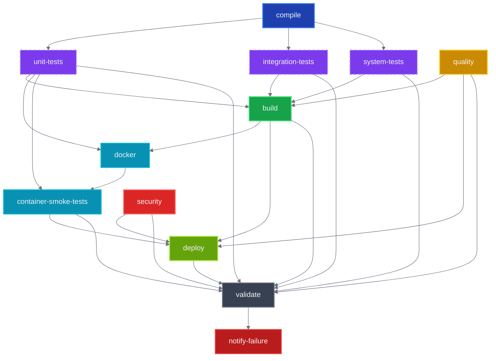

# CI/CD Architecture Documentation

## Overview

JCVD employs a comprehensive CI/CD pipeline designed for maximum performance, reliability, and developer experience. The pipeline implements a **compile-first architecture** with intelligent caching, parallel execution, and smart build skipping to minimize feedback time and resource consumption.

## Pipeline Philosophy

Our CI/CD system is built on several core principles:

1. **Compile-First Architecture**: Separate compilation from execution to enable artifact reuse
2. **Intelligent Build Skipping**: Skip unnecessary work when only documentation changes
3. **Comprehensive Caching Strategy**: Multi-layer caching across dependencies, compilation, and test results
4. **Parallel Execution**: Maximize throughput through strategic job parallelization
5. **Fail-Fast Strategy**: Quick feedback on critical issues while preserving complete test coverage

## Job Dependency Graph



## Artifact Flow Architecture

```mermaid
%%{init: {'theme':'dark', 'themeVariables': { 'primaryColor':'#1f2937', 'primaryTextColor':'#f3f4f6', 'primaryBorderColor':'#4b5563', 'lineColor':'#6b7280', 'secondaryColor':'#374151', 'tertiaryColor':'#1f2937', 'background':'#111827', 'mainBkg':'#1f2937', 'secondBkg':'#374151', 'tertiaryBkg':'#4b5563', 'textColor':'#f3f4f6', 'labelTextColor':'#f3f4f6', 'nodeTextColor':'#f3f4f6', 'edgeLabelBackground':'#1f2937'}}}%%
graph LR
    subgraph "Compile Stage"
        A[Source Code] --> B[Gradle Compile]
        B --> C[Compiled Classes]
        B --> D[Kotlin Artifacts]
        B --> E[Test Classes]
    end
    
    subgraph "Artifact Storage"
        C --> F[compiled-artifacts]
        D --> F
        E --> F
        F --> G[GitHub Actions Artifacts]
    end
    
    subgraph "Test Stages"
        G --> H[Unit Tests]
        G --> I[Integration Tests]
        G --> J[System Tests]
        H --> K[unit-test-results]
        I --> L[integration-test-results]
        J --> M[system-test-results]
    end
    
    subgraph "Build Stage"
        G --> N[Build Application]
        N --> O[jcvd-jar]
        N --> P[build-artifacts]
    end
    
    subgraph "Container Stage"
        O --> Q[Docker Build]
        P --> Q
        Q --> R[Docker Image]
        R --> S[Container Tests]
    end
    
    subgraph "Deployment Stage"
        P --> T[Deploy Readiness]
        K --> T
        L --> T
        M --> T
        S --> T
    end
    
    style A fill:#1f2937,stroke:#4b5563,color:#f3f4f6
    style B fill:#1e40af,stroke:#3b82f6,color:#f3f4f6
    style C fill:#374151,stroke:#6b7280,color:#f3f4f6
    style D fill:#374151,stroke:#6b7280,color:#f3f4f6
    style E fill:#374151,stroke:#6b7280,color:#f3f4f6
    style F fill:#0891b2,stroke:#06b6d4,color:#f3f4f6
    style G fill:#4b5563,stroke:#9ca3af,color:#f3f4f6
    style H fill:#7c3aed,stroke:#a78bfa,color:#f3f4f6
    style I fill:#7c3aed,stroke:#a78bfa,color:#f3f4f6
    style J fill:#7c3aed,stroke:#a78bfa,color:#f3f4f6
    style K fill:#6b7280,stroke:#9ca3af,color:#f3f4f6
    style L fill:#6b7280,stroke:#9ca3af,color:#f3f4f6
    style M fill:#6b7280,stroke:#9ca3af,color:#f3f4f6
    style N fill:#16a34a,stroke:#4ade80,color:#f3f4f6
    style O fill:#065f46,stroke:#10b981,color:#f3f4f6
    style P fill:#065f46,stroke:#10b981,color:#f3f4f6
    style Q fill:#0891b2,stroke:#06b6d4,color:#f3f4f6
    style R fill:#1e40af,stroke:#3b82f6,color:#f3f4f6
    style S fill:#0891b2,stroke:#06b6d4,color:#f3f4f6
    style T fill:#65a30d,stroke:#a3e635,color:#f3f4f6
```



## Job Architecture Details

### 1. Compile Job (Foundation)

**Purpose**: Compile all source and test code once for reuse across all other jobs

**Key Features**:
- **Smart Change Detection**: Only runs when actual code files change
- **Comprehensive Caching**: Gradle dependencies, Kotlin compilation cache
- **Artifact Creation**: Uploads compiled classes, Kotlin artifacts, and resources
- **CI-Optimized Configuration**: Uses specialized `gradle-ci.properties`

**Cache Strategy**:
```yaml
# Multi-level dependency caching
gradle-deps-v2-ubuntu-jdk21-{hash}
kotlin-compile-v2-ubuntu-jdk21-{hash}
```

**Outputs**:
- `compiled-artifacts`: All compiled classes and resources
- `run_tests`: Boolean flag indicating whether testing should proceed

### 2. Test Suite Jobs (Parallel Execution)

#### Unit Tests
**Purpose**: Fast validation of business logic and domain models
- **Runtime**: < 2 minutes target
- **Parallelization**: Max CPU utilization
- **Cache Key**: Based on domain/verification source changes
- **Memory**: 512MB max heap (optimized for speed)

#### Integration Tests  
**Purpose**: Database interactions and service integration
- **Runtime**: < 5 minutes target
- **Parallelization**: Conservative (2 threads for database safety)
- **Cache Key**: Includes application/infrastructure sources + DB version
- **Memory**: 1GB max heap

#### System Tests
**Purpose**: End-to-end scenarios and performance validation
- **Runtime**: < 10 minutes target
- **Parallelization**: Sequential execution (performance sensitive)
- **Cache Key**: Conservative caching (includes application.conf)
- **Memory**: 2GB max heap with GC logging

### 3. Quality Job (Independent)

**Purpose**: Code quality analysis and standards enforcement

**Features**:
- **Always Runs**: Even for documentation-only changes
- **Detekt Analysis**: Static code analysis with caching
- **Parallel Execution**: Enabled for faster analysis
- **Result Caching**: Based on source code and configuration changes

### 4. Build Job (Convergence Point)

**Purpose**: Create deployable application artifacts

**Dependencies**: All test jobs + quality must complete
**Key Optimizations**:
- **Reuses Compiled Artifacts**: No recompilation needed
- **Skips Tests**: Uses `-x test` flag for faster execution
- **Creates Fat JAR**: Single executable artifact
- **Verification**: Ensures JAR exists and reports size

**Outputs**:
- `jcvd-jar`: Production-ready application JAR
- `build-artifacts`: Supporting files for deployment

### 5. Docker Job (Containerization)

**Purpose**: Create and test containerized application

**Optimizations**:
- **Artifact-Based Build**: Uses pre-built JAR (no source compilation in Docker)
- **BuildKit Cache**: Advanced Docker layer caching with GitHub Actions backend
- **Multi-Scope Caching**: Branch-specific + main branch cache inheritance
- **No-Build Testing**: Tests container without rebuilding

**BuildKit Configuration**:
```yaml
cache-from: |
  type=gha,scope=docker-main
  type=gha,scope=docker-${{ github.ref_name }}
cache-to: type=gha,mode=max,scope=docker-${{ github.ref_name }}
```

### 6. Container Smoke Tests (Quality Gate)

**Purpose**: Production-readiness validation

**Test Coverage**:
- Health endpoint validation (`/health`)
- MCP server endpoints (`/mcp`, `/mcp/tools`, `/mcp/resources`)
- WebSocket connectivity (`ws://localhost:8080/ws`)
- Container startup performance (< 10 seconds)
- Resource usage validation (< 512MB memory)
- Port accessibility verification

### 7. Security Job (Continuous)

**Purpose**: Vulnerability scanning and security validation

**Features**:
- **Always Runs**: Independent of code changes
- **NVD Integration**: Uses National Vulnerability Database API
- **Dependency Analysis**: Scans all project dependencies
- **Cache Strategy**: Caches vulnerability database for performance
- **Threshold**: Fails on CVSS >= 7.0

### 8. Deploy Job (Conditional)

**Purpose**: Production deployment (main branch only)

**Conditions**:
- Only runs on `refs/heads/main`
- All prerequisite jobs must succeed
- No job failures allowed

**Validation**:
- Deployment readiness checks
- Artifact validation
- Environment preparation

### 9. Validate Job (Reporting)

**Purpose**: Comprehensive pipeline status reporting

**Features**:
- **Always Runs**: Regardless of job failures
- Downloads all available artifacts
- Provides detailed success/failure analysis
- Reports caching performance metrics
- Summarizes optimization benefits

## Caching Architecture

### Multi-Layer Caching Strategy (SPI-475)

Our caching system operates at multiple levels to maximize performance:

#### 1. GitHub Actions Cache
```yaml
# Dependencies (shared across jobs)
gradle-deps-v2-{os}-{jdk}-{hash}

# Compilation outputs (job-specific)
kotlin-compile-v2-{os}-{jdk}-{hash}
build-outputs-v2-{os}-{hash}

# Test results (suite-specific)
unit-test-results-v1-{os}-{jdk}-{hash}
integration-test-results-v1-{os}-{hash}
system-test-results-v1-{os}-{hash}
```

#### 2. Gradle Build Cache
- **Local Cache**: Task output caching
- **Configuration Cache**: Build script parsing cache
- **Incremental Compilation**: Changed-file-only compilation

#### 3. Docker BuildKit Cache
- **Layer Caching**: Aggressive Docker layer reuse
- **GitHub Actions Backend**: Persistent cache across workflow runs
- **Multi-Scope Strategy**: Branch + main inheritance

#### 4. Test Result Cache
- **Smart Invalidation**: Only re-run when relevant sources change
- **Suite-Specific Keys**: Different cache keys per test type
- **Performance Tracking**: Cache hit metrics in validation job

## Performance Optimizations

### Build System Performance

#### Gradle Configuration (gradle.properties)
```properties
# JVM Settings
org.gradle.jvmargs=-Xmx4096m -XX:+UseG1GC -XX:+UseStringDeduplication

# Parallel Execution
org.gradle.parallel=true
org.gradle.workers.max=4

# Caching
org.gradle.caching=true
org.gradle.configuration-cache=true
org.gradle.vfs.watch=true

# Kotlin Optimizations
kotlin.incremental=true
kotlin.compiler.execution.strategy=in-process
```

#### CI-Specific Configuration (gradle-ci.properties)
```properties
# Conservative memory for GitHub Actions (7GB RAM limit)
org.gradle.jvmargs=-Xmx3072m -XX:MaxMetaspaceSize=768m

# Optimized for 2 CPU cores
org.gradle.workers.max=2

# CI-specific timeouts
systemProp.org.gradle.internal.http.connectionTimeout=30000
```

### Kotlin Compilation Optimizations

#### Advanced Compiler Flags
```kotlin
freeCompilerArgs.addAll(
    "-Xuse-fir",                    // Use new FIR frontend (faster)
    "-Xuse-k2",                     // Use K2 compiler (experimental but faster)
    "-Xbackend-threads=0",          // Use all available threads
    "-Xjvm-default=all"             // Generate default methods
)
```

#### Test Execution Performance
```kotlin
// Parallel test execution
maxParallelForks = Runtime.getRuntime().availableProcessors()

// Memory optimization
maxHeapSize = "2048m"
forkEvery = 100  // Prevent memory leaks

// JVM optimizations
jvmArgs(
    "-XX:+UseG1GC",
    "-XX:MaxGCPauseMillis=100",
    "-XX:+UseStringDeduplication"
)
```

## Smart Build Skipping

### Path-Based Filtering

The pipeline implements intelligent build skipping based on changed files:

```yaml
paths-ignore:
  - '**.md'
  - '.gitignore' 
  - 'docs/**'
  - '.claude/**'
  - 'LICENSE'
  - 'SESSION_SUMMARY.md'
  - 'STRATEGY.md'
  - 'PROJECT_STRUCTURE.md'
```

### Change Detection Logic

```bash
# Only compile if relevant files changed
if git diff --name-only HEAD~1 HEAD | grep -E '\.(kt|kts|java|gradle)$|src/|build\.gradle|settings\.gradle|gradle\.properties'; then
  echo "run_tests=true" >> $GITHUB_OUTPUT
else
  echo "run_tests=false" >> $GITHUB_OUTPUT  
fi
```

### Job-Level Conditionals

Each job evaluates whether to run based on the compile job output:
```yaml
if: needs.compile.outputs.run_tests == 'true' || github.event_name == 'workflow_dispatch'
```

## Cache Invalidation Strategies

### Precise Cache Keys

Our cache keys are designed for optimal invalidation:

#### Dependency Cache
```yaml
key: gradle-deps-v2-ubuntu-jdk21-${{ hashFiles('**/*.gradle*', '**/gradle-wrapper.properties', 'gradle/libs.versions.toml') }}
```
**Invalidates when**: Build scripts, wrapper, or version catalog changes

#### Compilation Cache  
```yaml
key: kotlin-compile-v2-ubuntu-jdk21-${{ hashFiles('src/**/*.kt', 'build.gradle.kts') }}
```
**Invalidates when**: Source code or build configuration changes

#### Test Cache (Unit Tests)
```yaml
key: unit-test-results-v1-ubuntu-jdk21-${{ hashFiles('src/test/**/*.kt', 'src/main/**/*.kt') }}
```
**Invalidates when**: Test code or implementation changes

### Cache Hierarchy

Our restore-keys create a fallback hierarchy:
```yaml
restore-keys: |
  gradle-deps-v2-ubuntu-jdk21-    # Same OS + JDK, any dependencies
  gradle-deps-v2-ubuntu-          # Same OS, any JDK
```

## Troubleshooting Guide

### Common CI Failures

#### 1. Compilation Failures
**Symptoms**: `compile` job fails
**Investigation**:
```bash
# Check local compilation
./gradlew compileKotlin compileTestKotlin

# Check with CI configuration
cp .github/gradle-ci.properties gradle.properties
./gradlew compileKotlin --no-daemon
```

#### 2. Test Failures
**Symptoms**: Test jobs fail but compile succeeds
**Investigation**:
```bash
# Run specific test suite
./gradlew unitTest        # Fast unit tests
./gradlew integrationTest # Database integration
./gradlew systemTest      # Performance tests

# Check with CI memory limits
GRADLE_OPTS="-Xmx3072m" ./gradlew test
```

#### 3. Docker Build Failures
**Symptoms**: `docker` job fails
**Investigation**:
```bash
# Build locally with BuildKit
export DOCKER_BUILDKIT=1
docker build -t jcvd:test .

# Check artifact availability
ls -la build/libs/jcvd-server.jar
```

#### 4. Cache Issues
**Symptoms**: Slow builds despite caching
**Investigation**:
- Check cache keys in workflow logs
- Verify cache hit/miss rates in `validate` job output
- Consider cache version bump if caches are corrupted

### Performance Debugging

#### Build Time Analysis
```bash
# Generate build performance report
./gradlew build --profile

# Enable Gradle build scan
./gradlew build --scan

# Monitor cache effectiveness
./gradlew build --build-cache --info
```

#### Memory Issues
```bash
# Check memory usage during build
./gradlew build -Dorg.gradle.jvmargs="-Xmx4g -XX:+PrintGCDetails"

# Monitor test memory
./gradlew test -Dorg.gradle.jvmargs="-Xmx2g -XX:+UseG1GC"
```

## Performance Metrics

### Expected Performance Improvements

Based on our comprehensive optimization strategy:

#### Overall CI Time Reduction
- **Documentation-only changes**: 70% base reduction + caching benefits
- **Code changes with cache hits**: 40-60% reduction
- **Combined optimization**: Up to 85% total time savings

#### Specific Improvements
- **Dependency downloads**: 80-90% reduction with cache hits
- **Gradle compilation**: 40-60% improvement with incremental + cache
- **Docker builds**: 60-80% faster with BuildKit layer caching
- **Test execution**: 30-50% faster with result caching + parallelization

#### Resource Efficiency
- **Concurrency control**: Prevents waste from outdated runs
- **Fail-fast strategy**: Early termination saves 50-70% resources on failures
- **Conditional execution**: Skips unnecessary jobs based on change type

### Monitoring and Metrics

The `validate` job provides comprehensive performance reporting:

```bash
📊 Comprehensive Caching Strategy Performance:
==============================================
📊 Cache Layer Status:
  • Gradle Dependencies: Multi-job reuse enabled
  • Build Outputs: Smart invalidation by source changes  
  • Test Results: Cached per test suite with precise keys
  • Kotlin Compilation: Incremental with source tracking
  • Docker Layers: BuildKit with GitHub Actions cache
  • Quality Reports: Detekt results cached by source + config
  • Security Scans: Dependency check database cached

📈 Expected Performance Improvements:
  • Overall CI time: 40-60% reduction (combined optimizations)
  • Total potential savings: Up to 85% for cached builds
```

## Future Enhancements

### Planned Optimizations

1. **Remote Build Cache**: Gradle Enterprise integration for team-wide caching
2. **Test Sharding**: Distribute tests across multiple runners  
3. **Incremental Docker Builds**: Source-level incremental container builds
4. **Matrix Optimization**: Intelligent matrix reduction based on changes
5. **Deployment Automation**: Blue-green deployment with health checks

### Monitoring Improvements

1. **Build Analytics**: Historical performance tracking
2. **Cache Effectiveness Metrics**: Detailed cache hit/miss analysis
3. **Resource Usage Monitoring**: Memory and CPU utilization tracking
4. **Failure Analysis**: Automated failure classification and reporting

## Best Practices for Developers

### Local Development

```bash
# Quick feedback during development
./gradlew quickTest                    # Fast unit tests only
./gradlew testWatch --continuous       # Continuous test execution

# Development server with hot-reload
./gradlew devRun --continuous          # Auto-restart on changes
```

### Pre-Push Validation

```bash
# Comprehensive validation before push
./gradlew clean build                  # Full build + all tests
./gradlew buildStatus                  # Check optimization status
docker build -t jcvd:test .          # Verify Docker build
```

### CI Optimization Tips

1. **Small Commits**: Enable granular caching and faster feedback
2. **Descriptive Commits**: Help with cache key generation and debugging
3. **Test Locally**: Use `act` for workflow validation
4. **Monitor Cache**: Check cache hit rates in CI logs
5. **Update Dependencies Carefully**: Dependency changes invalidate caches

This architecture provides a robust, performant, and maintainable CI/CD pipeline that scales with the project and team while maintaining excellent developer experience through fast feedback loops and intelligent optimization strategies.