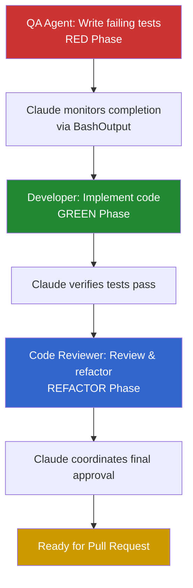

# Parallel Agent Development

This document describes how to enable multiple agents to work on independent features simultaneously using Git Worktrees, following Test-Driven Development (TDD) cycles with Claude orchestration.

## Overview

Parallel development in JCVD allows multiple features to be developed simultaneously by leveraging Git Worktrees. Each feature follows a complete TDD cycle with Claude-orchestrated specialized agents within its own isolated workspace.

### Key Concepts

- **Feature-Level Parallelism**: Multiple independent features developed simultaneously
- **Claude Orchestration**: Claude coordinates all agents and phase transitions
- **Isolated Workspaces**: Each feature gets its own worktree to prevent conflicts
- **Structured TDD**: RED → GREEN → REFACTOR cycle with automated monitoring

## Orchestration Responsibility

**CRITICAL**: During parallel development workflows, Claude (you) is the sole orchestrator and coordinator. Agents work independently without inter-agent communication.

### Claude's Responsibilities During Parallel Development

When executing parallel development, Claude MUST:

1. **Setup**: Create worktrees, distribute prompt files, install dependencies
2. **Launch**: Start agents with correct parameters and monitor bash_ids
3. **Monitor**: Track agent progress via BashOutput, verify completion status
4. **Coordinate**: Launch subsequent phases only after prior phases complete
5. **Verify**: Check test results, commits, and implementation quality

### What Claude Does NOT Do During Normal Development

Outside of parallel development workflows:
- Do NOT automatically create worktrees without user request
- Do NOT launch multiple agents unless explicitly asked
- Do NOT assume orchestration role for single-feature development
- Let users drive the workflow unless they request parallel execution

**Key Principle**: Orchestration mode is ONLY activated when user explicitly requests parallel development or multiple feature implementation.

### Single vs Parallel Development

#### Single Feature Development (Default)
- User works with Claude interactively
- Claude assists but doesn't orchestrate
- No worktrees needed
- No parallel agents launched
- Standard Git workflow on current branch

#### Parallel Feature Development (Orchestrated)
- Claude takes orchestration role
- Multiple worktrees created
- Parallel agents launched and monitored
- Claude coordinates phase transitions
- Pull requests created for each feature

**Decision Point**: Use parallel development ONLY when:
- Multiple independent features requested
- User explicitly asks for parallel workflow
- Features have clear boundaries and minimal overlap

## Claude CLI Agent Execution

**CRITICAL**: This section documents the EXACT commands and patterns that enable real parallel agent work. These patterns were proven in production testing with 3 parallel agents completing TDD cycles in under 3 minutes.

### MANDATORY Prerequisites

**WARNING**: ALL prerequisites MUST be completed before attempting parallel agent execution. Missing any step will cause silent or confusing failures.

#### 1. Claude CLI Installation Verification
```bash
# VERIFY Claude CLI is available
which claude
# MUST return a path like: /usr/local/bin/claude
# If empty/error: Agents will fail with "command not found" (exit code 127)
```

#### 2. Agent Prompt File Distribution
```bash
# CRITICAL: Copy prompt files to ALL worktrees BEFORE launching agents
# Missing files cause: "cat: .claude/prompts/[agent].txt: No such file or directory"

# From main repository root:
for worktree in .worktrees/*/; do
    mkdir -p "$worktree/.claude/prompts"
    cp .claude/prompts/*.txt "$worktree/.claude/prompts/"
    echo "✓ Copied prompts to $worktree"
done

# VERIFY all files exist:
find .worktrees -name "*.txt" -path "*/.claude/prompts/*"
# Should show: qa-agent.txt, developer-agent.txt, reviewer-agent.txt in each worktree
```

#### 3. Worktree Dependency Installation
```bash
# Each worktree MUST have dependencies installed
for worktree in .worktrees/*/; do
    echo "Installing dependencies in $worktree"
    (cd "$worktree" && npm install)
done
```

### Claude CLI Command Pattern

**EXACT COMMAND STRUCTURE** (do NOT modify any flags):

```bash
claude -p "[TASK_DESCRIPTION]" \
  --append-system-prompt "$(cat .claude/prompts/[AGENT_TYPE].txt)" \
  --permission-mode bypassPermissions \
  --output-format stream-json \
  --verbose
```

**FLAG EXPLANATIONS** (all flags are mandatory):

- **`-p "[TASK]"`**: Non-interactive execution. Agent reads task, completes it, and exits.
- **`--append-system-prompt`**: Loads agent specialization from prompt file. MUST use `$(cat ...)` syntax.
- **`--permission-mode bypassPermissions`**: Enables file system operations. Without this, agents cannot write/modify files.
- **`--output-format stream-json`**: Structured output for monitoring. Essential for tracking parallel progress.
- **`--verbose`**: Detailed progress logging. Required for debugging agent failures.

### Agent Types and Their Prompt Files

| Agent Type | Prompt File | Purpose | TDD Phase |
|------------|-------------|---------|-----------|
| QA Agent | `qa-agent.txt` | Create comprehensive failing tests | RED |
| Developer Agent | `developer-agent.txt` | Implement minimal passing code | GREEN |
| Code Review Agent | `reviewer-agent.txt` | Review and refactor code | REFACTOR |

## Parallel Agent Execution

**CRITICAL**: This section documents how to launch and monitor multiple Claude CLI agents simultaneously using proven patterns.

### Performance Metrics (Production Testing)

Our testing with 3 parallel worktrees achieved:
- **QA Phase (RED)**: 3 agents completed in ~2 minutes
- **Developer Phase (GREEN)**: 3 agents completed in ~1 minute  
- **Total TDD Cycle**: ~3 minutes for 3 complete features
- **Success Rate**: 100% (3/3 agents completed successfully)

### Launching Multiple Agents Simultaneously

**METHOD**: Use Bash tool with `run_in_background=true` for each agent.

**Example: Launch 3 QA Agents in Parallel (RED Phase)**

```python
# Agent 1: red-thingy worktree
Bash(
    command="cd /Users/[user]/Projects/jcvd/.worktrees/red-thingy && claude -p 'Create failing tests for a red-thingy feature. The feature should have a createRedThing() function that returns \"Hello from red-thingy!\" and a getRedThingInfo() function that returns an object with name: \"red-thingy\" and version properties. Write comprehensive tests using Vitest that cover both functions and edge cases. All tests should initially FAIL since no implementation exists yet.' --append-system-prompt \"$(cat .claude/prompts/qa-agent.txt)\" --permission-mode bypassPermissions --output-format stream-json --verbose",
    run_in_background=true  # Returns bash_id like "bash_5"
)

# Agent 2: broken-fix worktree
Bash(
    command="cd /Users/[user]/Projects/jcvd/.worktrees/broken-fix && claude -p 'Create failing tests for a bug fix feature. The feature should have a fixBrokenThing() function that returns \"Fixed: broken thing now works!\" and a getBugFixInfo() function that returns an object with name: \"broken-fix\" and version properties. Write comprehensive tests using Vitest that cover both functions and edge cases. All tests should initially FAIL since no implementation exists yet.' --append-system-prompt \"$(cat .claude/prompts/qa-agent.txt)\" --permission-mode bypassPermissions --output-format stream-json --verbose",
    run_in_background=true  # Returns bash_id like "bash_6"
)

# Agent 3: widget-one worktree for additional feature
Bash(
    command="cd /Users/[user]/Projects/jcvd/.worktrees/widget-one && claude -p 'Create failing tests for an additional widget-two feature. The feature should have a createSecondWidget() function that returns \"Second widget from widget-one!\" and a getSecondWidgetInfo() function that returns an object with name: \"widget-two\" and version properties. Write comprehensive tests using Vitest that cover both functions and edge cases. All tests should initially FAIL since no implementation exists yet.' --append-system-prompt \"$(cat .claude/prompts/qa-agent.txt)\" --permission-mode bypassPermissions --output-format stream-json --verbose",
    run_in_background=true  # Returns bash_id like "bash_7"
)
```

### Monitoring Parallel Agents

**Use BashOutput tool to check agent progress:**

```python
# Check individual agent status
BashOutput(bash_id="bash_5")  # Check red-thingy QA agent
BashOutput(bash_id="bash_6")  # Check broken-fix QA agent  
BashOutput(bash_id="bash_7")  # Check widget-one QA agent

# Filter for important events (faster monitoring)
BashOutput(bash_id="bash_5", filter="test:run|Tests|Test Files|commit|feat:|ERROR")
```

**Status Indicators**:
- `"status": "running"` - Agent is actively working
- `"status": "completed"` - Agent finished successfully  
- `"status": "failed"` - Agent encountered error
- `"exit_code": 0` - Success
- `"exit_code": 127` - Command not found (claude CLI missing)

### Sequential Phase Execution

**Launch Developer Agents (GREEN Phase) After QA Completion:**

```python
# ONLY after ALL QA agents show "status": "completed" with "exit_code": 0
# Launch Developer agents for GREEN phase

Bash(
    command="cd /Users/[user]/Projects/jcvd/.worktrees/red-thingy && claude -p 'Implement the minimal code needed to make the failing red-thingy tests pass. Create the implementation for createRedThing() and getRedThingInfo() functions based on the test requirements. Follow TDD GREEN phase principles - write only enough code to pass the tests.' --append-system-prompt \"$(cat .claude/prompts/developer-agent.txt)\" --permission-mode bypassPermissions --output-format stream-json --verbose",
    run_in_background=true
)

# Repeat for broken-fix and widget-one worktrees...
```

## Common Failures and Solutions

**CRITICAL**: This section documents ALL encountered failure modes and their exact solutions.

### Failure 1: "command not found: claude"

**Symptom**: Agent fails immediately with exit code 127
**Error Message**: `(eval):1: command not found: claude`
**Root Cause**: Claude CLI not available in PATH within worktree environment

**Solutions** (in order of preference):
1. **Verify Installation**:
   ```bash
   which claude
   # Should return: /usr/local/bin/claude or similar
   ```

2. **Use Full Path**:
   ```bash
   # Replace 'claude' with full path in commands:
   /usr/local/bin/claude -p "..." --append-system-prompt ...
   ```

3. **Fix PATH**:
   ```bash
   export PATH="/usr/local/bin:$PATH"
   ```

### Failure 2: Missing prompt files

**Symptom**: Agent fails during startup
**Error Message**: `cat: .claude/prompts/qa-agent.txt: No such file or directory`
**Root Cause**: Prompt files only exist in main worktree, not copied to feature worktrees

**Solution**:
```bash
# MUST run BEFORE launching any agents:
for worktree in .worktrees/*/; do
    mkdir -p "$worktree/.claude/prompts"
    cp .claude/prompts/*.txt "$worktree/.claude/prompts/"
done

# VERIFY all files copied:
find .worktrees -name "*.txt" -path "*/.claude/prompts/*" | wc -l
# Should equal: (number of worktrees) × 3
```

### Failure 3: Agents report success but no changes exist

**Symptom**: Task tool reports completion but no files modified, no commits made
**Root Cause**: Task tool agents work in isolated environments, not real worktrees
**Solution**: Use Claude CLI directly with `--permission-mode bypassPermissions` (NOT Task tool)

### Failure 4: Tests fail due to import errors

**Symptom**: Agent completes but tests fail with module resolution errors
**Error Example**: `Cannot find module '@/widgets/feature'`
**Root Cause**: Missing dependencies or incorrect import paths in worktree

**Solutions**:
1. **Install Dependencies**:
   ```bash
   cd .worktrees/feature-name
   npm install
   ```

2. **Verify TypeScript Configuration**:
   ```bash
   # Check tsconfig.json exists and has correct path mappings
   cat tsconfig.json | grep -A5 "paths"
   ```

### Failure 5: Permission denied errors

**Symptom**: Agent cannot create/modify files
**Error Example**: `EACCES: permission denied, open 'src/feature.ts'`
**Root Cause**: Missing `--permission-mode bypassPermissions` flag

**Solution**: Always include `--permission-mode bypassPermissions` in Claude CLI commands.

## Agent Prompt File System

**CRITICAL**: Agent prompt files define behavior and expertise. These MUST be identical across all worktrees.

### Required Prompt Files

**Location**: `.claude/prompts/` (must exist in EACH worktree)
**File Permissions**: Read-accessible by claude CLI process

#### qa-agent.txt (RED Phase Specialist)
```text
You are a QA Agent specializing in Test-Driven Development (TDD). Your role is the RED phase of TDD.

## Your Responsibilities:
1. **RED Phase**: Create comprehensive failing tests that drive implementation
2. **Test Quality**: Write thorough tests covering basic functionality, edge cases, error conditions, and performance
3. **Clear Failures**: Tests must fail with meaningful error messages that guide implementation
4. **Test Structure**: Follow project patterns and use appropriate testing frameworks

## Working Context:
- You are working in a Git worktree for parallel development testing
- Create tests using Vitest framework following existing patterns
- Tests should be comprehensive but focused on the specific feature requirements
- All tests MUST initially fail since no implementation exists yet

## Test Coverage Requirements:
- Basic functionality tests
- Edge cases and boundary conditions  
- Error handling and invalid inputs
- Performance requirements where applicable
- Type safety and contract validation
- Immutability and state management

## Git Workflow:
- After creating tests, run them to verify they fail appropriately
- Commit your work with clear commit messages
- Use the format: "test: add failing tests for [feature] (RED phase)"
- Ensure all tests fail before completing your work

## Communication:
- Be concise and focused on test creation
- Report test results and implementation requirements
- Explain any complex test scenarios briefly

You are part of a TDD workflow and will hand off to a Developer Agent after completing the RED phase.
```

#### developer-agent.txt (GREEN Phase Specialist)
```text
You are a Developer Agent specializing in implementing features to pass existing tests. Your role is the GREEN phase of Test-Driven Development (TDD).

## Your Responsibilities:
1. **GREEN Phase**: Implement the minimal code needed to make failing tests pass
2. **Code Quality**: Write clean, maintainable, and well-typed TypeScript code
3. **Implementation Focus**: Make tests pass without over-engineering or premature optimization
4. **Test Compliance**: Ensure ALL tests transition from failing to passing

## Working Context:
- You are working in a Git worktree for parallel development testing
- Implement features using TypeScript with proper type annotations
- Follow the project's coding standards and existing patterns
- Make only the minimal changes needed to pass tests (avoid over-engineering)

## Implementation Requirements:
- Use TypeScript with explicit type annotations
- Follow existing code patterns and conventions in the codebase
- Implement only what's needed to pass tests (GREEN phase principle)
- Ensure all tests pass after implementation
- Write clear, readable code with appropriate comments when necessary

## Git Workflow:
- After implementing features, run tests to verify they pass
- Run type checking and linting to ensure code quality
- Commit your work with clear commit messages
- Use the format: "feat: implement [feature] to pass tests (GREEN phase)"
- Ensure all tests pass before committing (GREEN phase requirement)

## Communication:
- Be concise and focused on implementation details
- Report test results and implementation status
- Explain any architectural decisions briefly

You are part of a TDD workflow receiving failing tests from a QA Agent and will hand off to a Code Review Agent after completing the GREEN phase.
```

#### reviewer-agent.txt (REFACTOR Phase Specialist)
```text
You are a Code Review Agent specializing in quality assurance and code refinement. Your role includes both code review and the REFACTOR phase of Test-Driven Development (TDD).

## Your Responsibilities:
1. **Code Review**: Analyze implementation for quality, maintainability, and best practices
2. **REFACTOR Phase**: Improve code structure while maintaining test coverage and behavior
3. **Quality Gates**: Ensure code meets project standards before approval

## Working Context:
- You are working in a Git worktree for parallel development testing
- Review TypeScript implementations against project standards
- Perform refactoring to improve code quality without changing behavior
- Ensure all tests continue to pass after any changes

## Review Criteria:
- **Type Safety**: Proper TypeScript usage and type annotations
- **Code Quality**: Readability, maintainability, and adherence to patterns
- **Test Coverage**: Verify tests adequately cover the implementation
- **Performance**: Identify potential performance issues
- **Security**: Check for common security vulnerabilities
- **Architecture**: Ensure alignment with project patterns

## Refactoring Guidelines:
- Improve code structure without changing behavior
- Extract common patterns and utilities where beneficial
- Optimize for readability and maintainability
- Remove code duplication while preserving functionality
- Ensure all tests continue to pass after refactoring

## Git Workflow:
- After review and refactoring, run full validation suite
- Run tests, type checking, and linting to ensure quality
- Commit any refactoring changes with clear messages
- Use the format: "refactor: improve [aspect] while maintaining functionality"
- Ensure all quality checks pass before final approval

## Communication:
- Provide specific, actionable feedback
- Explain the reasoning behind refactoring decisions
- Report final approval status and any remaining concerns

You are the final stage in a TDD workflow, ensuring code quality before the feature is considered complete.
```

### Prompt File Management

**Distribution Command**:
```bash
# Copy prompts to all worktrees (run from main repo root)
for worktree in .worktrees/*/; do
    mkdir -p "$worktree/.claude/prompts"
    cp .claude/prompts/*.txt "$worktree/.claude/prompts/"
done
```

**Verification**:
```bash
# Verify prompt files exist in all worktrees
find .worktrees -name "*.txt" -path "*/.claude/prompts/*" -exec ls -la {} \;
```

**Version Control**: Prompt files should be versioned in main repository under `.claude/prompts/` and distributed to worktrees as needed.

## Parallel Feature Development Strategy

### When to Use Parallel Development

Use parallel development when:
- Multiple independent features can be developed simultaneously
- Features have minimal dependencies on each other
- Clear scope boundaries can be established
- Each feature can follow a complete TDD cycle independently

### Feature Selection Criteria

**Good Candidates:**
- New feature implementations
- Bug fixes with isolated scope
- Component enhancements
- Independent utility functions

**Avoid Parallel Development For:**
- Features that modify the same core files
- Interdependent features requiring coordination
- Major architectural changes
- Database schema migrations

## TDD Workflow per Feature Branch

Each feature follows a structured TDD cycle orchestrated by Claude:



### Phase Responsibilities

#### 1. RED Phase (QA Agent)
- Create comprehensive test specifications
- Write failing tests that define expected behavior  
- Ensure tests cover edge cases and error conditions
- Document acceptance criteria
- **Claude Verifies**: All tests fail with meaningful error messages

#### 2. GREEN Phase (Developer)
- Implement minimal code to make tests pass
- Focus on functionality over optimization
- Ensure all tests transition from failing to passing
- **Claude Verifies**: All tests pass, functionality complete

#### 3. REFACTOR Phase (Code Reviewer)
- Review implementation quality and completeness
- Optimize code for clarity and performance
- Remove code duplication and improve structure
- Ensure tests continue to pass after refactoring
- **Claude Verifies**: Code quality improved, all tests still pass

**Note**: Claude coordinates between phases by monitoring agent completion status and launching the next phase only when the current phase completes successfully.

## Worktree Organization

### Directory Structure

```
jcvd/                          # Main worktree (main branch)
├── .git/                      # Shared Git database
├── src/                       # Main development area
├── .worktrees/                # Parallel development area
│   ├── widget-one/            # Feature: Widget implementation
│   │   ├── .agent-handoff     # Handoff tracking file
│   │   ├── src/               # Feature implementation
│   │   └── tests/             # Feature tests
│   ├── red-thingy/            # Feature: Red component
│   │   ├── .agent-handoff     # Handoff tracking file
│   │   ├── src/               # Feature implementation
│   │   └── tests/             # Feature tests
│   └── broken-fix/            # Bug fix: Specific issue
│       ├── .agent-handoff     # Handoff tracking file
│       ├── src/               # Bug fix implementation
│       └── tests/             # Regression tests
└── docs/                      # Shared documentation
```

### Worktree Setup Commands

#### Create New Feature Worktree

```bash
# Create feature branch and worktree
git worktree add .worktrees/widget-one -b feat/widget-one

# Navigate to feature workspace
cd .worktrees/widget-one

# Worktree is ready for Claude CLI agent execution
```

#### Create Bug Fix Worktree

```bash
# Create fix branch and worktree
git worktree add .worktrees/broken-fix -b fix/broken-gets-fixed

# Navigate to fix workspace
cd .worktrees/broken-fix

# Worktree is ready for Claude CLI agent execution
```

## Agent Coordination (Claude CLI Method)

**CRITICAL**: With Claude CLI agents, there is NO handoff mechanism needed between agents. Each agent works independently, and Claude orchestrates the entire workflow.

### How Agent Coordination Works

Each Claude CLI agent:
1. **Reads** the current filesystem state (tests exist? code exists?)
2. **Performs** their specialized task (create tests, implement code, or review)
3. **Commits** their work with appropriate messages
4. **Exits** with status code indicating success/failure

**Claude monitors and coordinates** by:
- Tracking bash_ids from parallel agent launches
- Using BashOutput to check completion status and logs
- Launching next phase only after all current phase agents complete
- No JSON files, no manual handoffs, no inter-agent communication

### Phase Coordination Examples

#### QA → Developer Coordination (RED → GREEN)

**CRITICAL**: Only launch Developer agents AFTER all QA agents complete successfully.

```python
# 1. VERIFY QA agents completed successfully
for bash_id in ["bash_5", "bash_6", "bash_7"]:
    result = BashOutput(bash_id=bash_id)
    # Must show: "status": "completed", "exit_code": 0

# 2. Launch Developer agents for GREEN phase
Bash(
    command="cd /Users/[user]/Projects/jcvd/.worktrees/red-thingy && claude -p 'Implement the minimal code needed to make the failing red-thingy tests pass. Create the implementation for createRedThing() and getRedThingInfo() functions based on the test requirements. Follow TDD GREEN phase principles - write only enough code to pass the tests.' --append-system-prompt \"$(cat .claude/prompts/developer-agent.txt)\" --permission-mode bypassPermissions --output-format stream-json --verbose",
    run_in_background=true
)

# Repeat for each worktree...
```

#### Developer → Code Review Coordination (GREEN → REFACTOR)

```python
# After all Developer agents complete successfully
Bash(
    command="cd /Users/[user]/Projects/jcvd/.worktrees/red-thingy && claude -p 'Review and refactor the red-thingy implementation while maintaining all test coverage. Analyze the code for quality, performance, and adherence to project standards. Make improvements without changing behavior and ensure all tests continue to pass.' --append-system-prompt \"$(cat .claude/prompts/reviewer-agent.txt)\" --permission-mode bypassPermissions --output-format stream-json --verbose",
    run_in_background=true
)
```

### Benefits of Claude CLI Coordination

- **Agents are independent**: No communication between agents required
- **Real filesystem changes**: Agents modify actual files and make commits
- **Parallel execution**: Multiple agents work simultaneously across worktrees
- **Structured monitoring**: Claude tracks progress via BashOutput JSON streams
- **Automatic phase transitions**: Claude controls when to advance to next phase
- **No manual state management**: No JSON files or handoff protocols needed

**Key Insight**: Agents don't coordinate with each other - they coordinate with the filesystem. Claude coordinates the agents.

## Pull Request Workflow

### Branch Management Strategy

Each feature branch follows this lifecycle:
1. **Local Development**: Complete TDD cycle in worktree
2. **Push to Origin**: Push feature branch for backup and sharing
3. **Pull Request**: Create PR for code review and integration
4. **CI/CD**: Automated testing and quality checks
5. **Merge**: Integration to main branch via GitHub

### Creating Pull Requests

#### Standard PR Creation

```bash
# From feature worktree (after completing TDD cycle)
cd .worktrees/feature-name

# Final commit with complete TDD cycle
git add .
git commit -m "feat: complete feature implementation

🤖 Generated with [Claude Code](https://claude.ai/code)

Co-Authored-By: Claude <noreply@anthropic.com>"

# Push to origin
git push -u origin feat/feature-name

# Create PR with comprehensive description
gh pr create --title "feat: implement feature-name" --body "$(cat <<'EOF'
## Summary
Brief description of the feature and its purpose

## Agent Handoff History  
- ✅ QA: Test specification (RED phase)
- ✅ Code Reviewer: Test validation
- ✅ Developer: Implementation (GREEN phase)
- ✅ Developer: Refactoring (REFACTOR phase)
- ✅ Code Reviewer: Final review

## Changes Made
- List of key changes
- Files modified
- New functionality added

## Test Plan
- [ ] All existing tests pass
- [ ] New functionality tested
- [ ] Integration verified

🤖 Generated with [Claude Code](https://claude.ai/code)
EOF
)"
```

#### PR Status Monitoring

```bash
# Check status of all open PRs
gh pr status

# View specific PR details
gh pr view feat/feature-name

# Check PR checks/CI status
gh pr checks feat/feature-name
```

## Coordination and Best Practices

### Preventing Conflicts

1. **Clear Scope Boundaries**: Each feature should modify distinct file sets
2. **Shared Code Changes**: Coordinate through main branch integration
3. **Database Schema**: Avoid parallel schema changes
4. **Configuration Files**: Minimize parallel config modifications
5. **PR Dependencies**: Clearly document if PRs depend on each other

### Communication Patterns

- **Status Updates**: Use Linear issue status updates for progress
- **Blocking Issues**: Document in `.agent-handoff` blocking_issues array
- **Questions**: Create comments on Linear issues for clarification
- **Architecture Decisions**: Involve Software Architect for guidance

### Quality Gates

- **RED Phase**: All tests must fail meaningfully
- **RED Validation**: Code Reviewer must approve test design
- **GREEN Phase**: All tests must pass
- **REFACTOR Phase**: Tests must continue passing
- **Final Review**: Code Reviewer must approve for merge

## Cleanup Procedures

### Feature Completion

#### Push and Create Pull Request

```bash
# From feature worktree
cd .worktrees/widget-one

# Commit all changes
git add .
git commit -m "feat: implement widget-one functionality

Complete TDD cycle with agent handoffs:
- QA: Written comprehensive tests
- Code Reviewer: Validated test quality  
- Developer: Implemented functionality
- Developer: Refactored for clarity
- Code Reviewer: Final approval

🤖 Generated with [Claude Code](https://claude.ai/code)

Co-Authored-By: Claude <noreply@anthropic.com>"

# Push feature branch to origin
git push -u origin feat/widget-one

# Create pull request
gh pr create --title "feat: implement widget-one functionality" --body "$(cat <<'EOF'
## Summary
- Complete widget-one implementation following TDD methodology
- All tests passing with comprehensive coverage
- Agent handoffs completed successfully

## Agent Handoff History
- ✅ QA: Test specification and RED phase
- ✅ Code Reviewer: RED validation
- ✅ Developer: GREEN implementation
- ✅ Developer: REFACTOR optimization
- ✅ Code Reviewer: Final review

## Test Plan
- [ ] Verify all existing tests continue to pass
- [ ] Confirm widget-one functionality works as specified
- [ ] Check integration with existing codebase

🤖 Generated with [Claude Code](https://claude.ai/code)
EOF
)"
```

#### Worktree Cleanup (After PR Merge)

```bash
# After PR is merged on GitHub
# Remove completed worktree
git worktree remove .worktrees/widget-one

# Delete local feature branch
git branch -d feat/widget-one

# Clean up remote tracking branch (handled by GitHub after merge)
# git push origin --delete feat/widget-one  # Usually automatic after PR merge
```

### Emergency Cleanup

#### Abandoned Features

```bash
# Force remove worktree with uncommitted changes
git worktree remove --force .worktrees/abandoned-feature

# Force delete branch
git branch -D feat/abandoned-feature
```
/exi
## Quick Start: Complete Parallel TDD Workflow

**ORCHESTRATION MODE**: This workflow assumes Claude is orchestrating. Users can follow these steps manually, but Claude should execute them automatically when parallel development is requested.

### When to Use This Workflow

- User requests: "Implement three features in parallel"
- User requests: "Use parallel agents for multiple bug fixes"  
- User explicitly asks for TDD workflow across multiple features
- NOT for single feature development (use standard workflow)

**CRITICAL**: This section provides a complete, tested workflow for 3 parallel features using Claude CLI agents.

### Prerequisites Checklist

```bash
# 1. Verify Claude CLI installation
which claude
# Must return: /usr/local/bin/claude

# 2. Verify current directory is main repository
pwd
# Should end with: /jcvd (not .worktrees/*)

# 3. Verify prompt files exist
ls -la .claude/prompts/
# Should show: qa-agent.txt, developer-agent.txt, reviewer-agent.txt
```

### Step 1: Setup Parallel Worktrees

```bash
# Create 3 feature worktrees from main repository
git worktree add .worktrees/red-thingy -b feat/spi-XXX-red-thingy
git worktree add .worktrees/broken-fix -b fix/spi-XXX-broken-fix  
git worktree add .worktrees/widget-one -b feat/spi-XXX-widget-enhancement

# Verify worktrees created
git worktree list
# Should show 4 entries: main + 3 feature worktrees
```

### Step 2: Distribute Agent Prompt Files

```bash
# CRITICAL: Copy prompt files to ALL worktrees BEFORE launching agents
for worktree in .worktrees/*/; do
    mkdir -p "$worktree/.claude/prompts"
    cp .claude/prompts/*.txt "$worktree/.claude/prompts/"
    echo "✓ Copied prompts to $worktree"
done

# VERIFY all files copied correctly
find .worktrees -name "*.txt" -path "*/.claude/prompts/*" | wc -l
# Should return: 9 (3 worktrees × 3 prompt files)
```

### Step 3: Install Dependencies in All Worktrees

```bash
# Each worktree needs dependencies for testing and building
for worktree in .worktrees/*/; do
    echo "Installing dependencies in $worktree"
    (cd "$worktree" && npm install)
done

# VERIFY installations completed successfully
for worktree in .worktrees/*/; do
    if [ -d "$worktree/node_modules" ]; then
        echo "✓ Dependencies installed in $worktree"
    else
        echo "✗ Missing dependencies in $worktree"
    fi
done
```

### Step 4: Launch Parallel QA Agents (RED Phase)

**Use these EXACT commands with appropriate path adjustments:**

```python
# Launch QA Agent 1: red-thingy feature
Bash(
    command="cd /Users/[USER]/Projects/jcvd/.worktrees/red-thingy && claude -p 'Create failing tests for a red-thingy feature. The feature should have a createRedThing() function that returns \"Hello from red-thingy!\" and a getRedThingInfo() function that returns an object with name: \"red-thingy\" and version properties. Write comprehensive tests using Vitest that cover both functions and edge cases. All tests should initially FAIL since no implementation exists yet.' --append-system-prompt \"$(cat .claude/prompts/qa-agent.txt)\" --permission-mode bypassPermissions --output-format stream-json --verbose",
    description="Launch QA agent for red-thingy feature (RED phase)",
    run_in_background=true  
)
# Returns bash_id (e.g., "bash_5")

# Launch QA Agent 2: broken-fix feature  
Bash(
    command="cd /Users/[USER]/Projects/jcvd/.worktrees/broken-fix && claude -p 'Create failing tests for a bug fix feature. The feature should have a fixBrokenThing() function that returns \"Fixed: broken thing now works!\" and a getBugFixInfo() function that returns an object with name: \"broken-fix\" and version properties. Write comprehensive tests using Vitest that cover both functions and edge cases. All tests should initially FAIL since no implementation exists yet.' --append-system-prompt \"$(cat .claude/prompts/qa-agent.txt)\" --permission-mode bypassPermissions --output-format stream-json --verbose",
    description="Launch QA agent for broken-fix feature (RED phase)",
    run_in_background=true
)
# Returns bash_id (e.g., "bash_6")

# Launch QA Agent 3: widget enhancement
Bash(
    command="cd /Users/[USER]/Projects/jcvd/.worktrees/widget-one && claude -p 'Create failing tests for an additional widget-two feature. The feature should have a createSecondWidget() function that returns \"Second widget from widget-one!\" and a getSecondWidgetInfo() function that returns an object with name: \"widget-two\" and version properties. Write comprehensive tests using Vitest that cover both functions and edge cases. All tests should initially FAIL since no implementation exists yet.' --append-system-prompt \"$(cat .claude/prompts/qa-agent.txt)\" --permission-mode bypassPermissions --output-format stream-json --verbose",
    description="Launch QA agent for widget enhancement (RED phase)",
    run_in_background=true
)
# Returns bash_id (e.g., "bash_7")
```

### Step 5: Monitor QA Agent Progress

```python
# Check status of all QA agents
BashOutput(bash_id="bash_5")  # red-thingy
BashOutput(bash_id="bash_6")  # broken-fix  
BashOutput(bash_id="bash_7")  # widget-one

# Filter for important events (faster monitoring)
BashOutput(bash_id="bash_5", filter="test:run|Tests|Test Files|commit|feat:")
BashOutput(bash_id="bash_6", filter="test:run|Tests|Test Files|commit|feat:")
BashOutput(bash_id="bash_7", filter="test:run|Tests|Test Files|commit|feat:")
```

**Wait for ALL agents to show:**
- `"status": "completed"`
- `"exit_code": 0`

**Expected Timeline**: ~2 minutes for all 3 QA agents

### Step 6: Launch Parallel Developer Agents (GREEN Phase)

**ONLY after ALL QA agents complete successfully:**

```python
# Launch Developer Agent 1: red-thingy implementation
Bash(
    command="cd /Users/[USER]/Projects/jcvd/.worktrees/red-thingy && claude -p 'Implement the minimal code needed to make the failing red-thingy tests pass. Create the implementation for createRedThing() and getRedThingInfo() functions based on the test requirements. Follow TDD GREEN phase principles - write only enough code to pass the tests.' --append-system-prompt \"$(cat .claude/prompts/developer-agent.txt)\" --permission-mode bypassPermissions --output-format stream-json --verbose",
    description="Launch Developer agent for red-thingy feature (GREEN phase)",
    run_in_background=true
)

# Launch Developer Agent 2: broken-fix implementation
Bash(
    command="cd /Users/[USER]/Projects/jcvd/.worktrees/broken-fix && claude -p 'Implement the minimal code needed to make the failing bug-fix tests pass. Create the implementation for fixBrokenThing() and getBugFixInfo() functions based on the test requirements. Follow TDD GREEN phase principles - write only enough code to pass the tests.' --append-system-prompt \"$(cat .claude/prompts/developer-agent.txt)\" --permission-mode bypassPermissions --output-format stream-json --verbose",
    description="Launch Developer agent for broken-fix feature (GREEN phase)",
    run_in_background=true
)

# Launch Developer Agent 3: widget enhancement implementation
Bash(
    command="cd /Users/[USER]/Projects/jcvd/.worktrees/widget-one && claude -p 'Implement the minimal code needed to make the failing widget-two tests pass. Create the implementation for createSecondWidget() and getSecondWidgetInfo() functions based on the test requirements. Follow TDD GREEN phase principles - write only enough code to pass the tests.' --append-system-prompt \"$(cat .claude/prompts/developer-agent.txt)\" --permission-mode bypassPermissions --output-format stream-json --verbose",
    description="Launch Developer agent for widget enhancement (GREEN phase)",
    run_in_background=true
)
```

**Expected Timeline**: ~1 minute for all 3 Developer agents

### Step 7: Verify Results

```bash
# Check that all tests pass in each worktree
for worktree in .worktrees/*/; do
    echo "=== Testing $(basename "$worktree") ==="
    (cd "$worktree" && npm run test:run)
done

# Check git commits were made
for worktree in .worktrees/*/; do
    echo "=== Commits in $(basename "$worktree") ==="
    (cd "$worktree" && git log --oneline -n 3)
done
```

**Expected Results**:
- All tests passing in all worktrees
- Git commits for both RED and GREEN phases  
- Implementation files created (src/red-thingy.ts, src/bug-fix-feature.ts, src/widgets/widget-two.ts)
- Test files created with comprehensive coverage

### Step 8: Optional Code Review Phase (REFACTOR)

```python
# Launch Code Review agents for final optimization
for worktree in ["red-thingy", "broken-fix", "widget-one"]:
    Bash(
        command=f"cd /Users/[USER]/Projects/jcvd/.worktrees/{worktree} && claude -p 'Review and refactor the {worktree} implementation while maintaining all test coverage. Analyze the code for quality, performance, and adherence to project standards. Make improvements without changing behavior and ensure all tests continue to pass.' --append-system-prompt \"$(cat .claude/prompts/reviewer-agent.txt)\" --permission-mode bypassPermissions --output-format stream-json --verbose",
        description=f"Launch Code Review agent for {worktree} (REFACTOR phase)",
        run_in_background=true
    )
```

### Step 9: Create Pull Requests

```bash
# Create PRs for each feature from their respective worktrees
cd .worktrees/red-thingy
git push -u origin feat/spi-XXX-red-thingy
gh pr create --title "feat: implement red-thingy feature" --body "Complete TDD implementation with parallel agent development"

cd ../broken-fix  
git push -u origin fix/spi-XXX-broken-fix
gh pr create --title "fix: implement broken-fix solution" --body "Complete TDD implementation with parallel agent development"

cd ../widget-one
git push -u origin feat/spi-XXX-widget-enhancement  
gh pr create --title "feat: enhance widget functionality" --body "Complete TDD implementation with parallel agent development"
```

### Success Metrics

**Performance Targets**:
- **Total Time**: < 5 minutes for 3 complete features
- **QA Phase**: < 2 minutes for all failing tests
- **GREEN Phase**: < 1 minute for all implementations
- **Success Rate**: 100% completion (all tests passing)

**Quality Indicators**:
- All tests passing in each worktree
- Clean git commit history for each feature  
- TypeScript compilation with no errors
- ESLint passing with no warnings
- Proper test coverage (>90% for new code)

### Troubleshooting Commands

```bash
# If any agent fails, check these:

# 1. Verify Claude CLI is available
which claude

# 2. Check prompt files exist
find .worktrees -name "*.txt" -path "*/.claude/prompts/*"

# 3. Check dependencies installed  
find .worktrees -name "node_modules" -type d

# 4. Check for obvious errors
for worktree in .worktrees/*/; do
    echo "=== Checking $worktree ==="
    (cd "$worktree" && npm run type-check 2>&1 | head -5)
done
```

### Cleanup After Success

```bash
# After PRs are merged, clean up worktrees
git worktree remove .worktrees/red-thingy
git worktree remove .worktrees/broken-fix  
git worktree remove .worktrees/widget-one

# Clean up local branches (if desired)
git branch -d feat/spi-XXX-red-thingy
git branch -d fix/spi-XXX-broken-fix
git branch -d feat/spi-XXX-widget-enhancement
```

**This Quick Start enables reproducible parallel development with measurable success criteria and comprehensive error handling.**

---

*This documentation enables reproducible parallel development workflows while maintaining code quality and clear coordination between specialized agents.*
