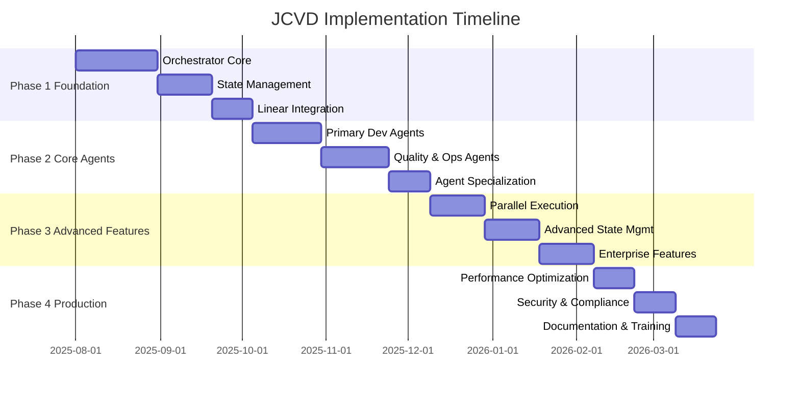

# JCVD: Multi-Agent Orchestration Framework for Claude Code
## Product Requirements Document

**Version:** 1.0  
**Date:** July 28, 2025  
**Authors:** John Burbridge, Claude Code

---

## Table of Contents

1. [Executive Summary](#executive-summary)
2. [Project Overview](#project-overview)
3. [Business Requirements](#business-requirements)
4. [Use Cases & User Stories](#use-cases--user-stories)
5. [High-Level Technical Approach](#high-level-technical-approach)
6. [Agent Overview](#agent-overview)
7. [Implementation Roadmap](#implementation-roadmap)
8. [Success Metrics](#success-metrics)
9. [Risk Assessment](#risk-assessment)

---

## Executive Summary

**JCVD** is a personal AI development assistant that transforms Claude Code into a specialized software development team for individual engineers. By leveraging Claude Code's existing subagent architecture, JCVD creates focused AI agents that handle different aspects of the development process, enabling developers to accelerate their personal development cycles while maintaining full control and oversight.

The framework addresses the challenge individual developers face when juggling multiple disciplines - from requirements analysis and architecture design to implementation, testing, and deployment. JCVD allows developers to focus on creative problem-solving and high-level decision-making while delegating routine tasks to specialized AI agents that work under their supervision.

**Key Value Propositions:**
- **Accelerated Development Cycles**: Complete features 3-5x faster through parallel task execution
- **Maintained Quality Standards**: Automated checks and processes ensure consistent code quality
- **Reduced Context Switching**: Stay focused on core development while agents handle peripheral tasks
- **Complete Developer Control**: All agent actions are transparent and require developer approval for critical decisions

## Project Overview

### Vision Statement
To create the most effective AI-powered personal development assistant that enables individual software engineers to deliver high-quality features faster while maintaining complete control over their development process.

### Problem Statement
Individual software engineers face increasing complexity in modern development:
- **Context Switching Overhead**: Constantly switching between different types of work (coding, testing, documentation, deployment)
- **Cognitive Load**: Juggling multiple disciplines and best practices simultaneously
- **Routine Task Burden**: Spending significant time on repetitive tasks that could be automated
- **Quality Consistency**: Difficulty maintaining consistent standards across all aspects of development
- **Knowledge Gaps**: Having to research and learn new technologies/patterns for each project phase

### Solution Overview
JCVD transforms Claude Code into a personal AI development team by:

1. **Specialized Personal Assistants**: Seven focused agents that handle different development disciplines
2. **Intelligent Task Delegation**: Automatic routing of work to the most appropriate agent while keeping developer in control
3. **Parallel Work Execution**: Agents work on independent tasks simultaneously while developer focuses on core logic
4. **Consistent Process Enforcement**: Automated quality checks and standards without developer overhead
5. **Transparent Operations**: All agent actions are visible and require developer approval for significant decisions

### Target Users
**Primary**: Individual Software Engineers
- Solo developers working on personal or client projects
- Engineers at companies who want to accelerate their individual productivity
- Developers learning new technologies who want expert guidance across disciplines
- Senior engineers who want to focus on architecture/design while automating implementation details

**Secondary**: Small Development Teams (2-3 people)
- Teams where each member uses JCVD as their personal assistant
- Startups where developers wear multiple hats and need efficiency gains

## Business Requirements

### Functional Requirements

#### FR1: Personal Assistant Orchestration
- **FR1.1**: System must support seven specialized personal development assistant agents
- **FR1.2**: Orchestrator must intelligently delegate tasks while requiring developer approval for significant decisions
- **FR1.3**: Support for parallel execution of independent tasks while developer focuses on core work
- **FR1.4**: Transparent task delegation with clear visibility into what each agent is doing

#### FR2: Development State Management
- **FR2.1**: Maintain current project state and context across all personal assistant agents
- **FR2.2**: Optional integration with Linear for personal task tracking and organization
- **FR2.3**: Support for resuming work sessions with full context restoration
- **FR2.4**: Automatic saving of agent outputs and decisions for developer review

#### FR3: Intelligent Agent Selection
- **FR3.1**: Intelligent model selection (Claude 4 Sonnet vs Opus) based on task complexity and user preferences
- **FR3.2**: Support for user-configured agent preferences and specializations
- **FR3.3**: Cost-aware model routing to optimize performance vs. expense
- **FR3.4**: Performance tracking to improve future task delegation decisions

#### FR4: Developer Control & Integration
- **FR4.1**: Native integration with Claude Code's existing tool ecosystem
- **FR4.2**: Developer override capabilities for all agent decisions
- **FR4.3**: Configurable automation levels (from full approval required to autonomous operation)
- **FR4.4**: Clear audit trail of all agent actions and developer decisions

### Non-Functional Requirements

#### NFR1: Performance
- **Response Time**: Agent task delegation < 3 seconds for individual developer workflow
- **Throughput**: Support for 3-5 parallel agent operations per developer session
- **Scalability**: Handle personal projects with up to 500 files efficiently

#### NFR2: Reliability
- **Session Continuity**: Maintain context across interrupted work sessions
- **Error Handling**: Clear error messages and graceful fallback to manual operation
- **Recovery**: Ability to resume work with full context after failures

#### NFR3: Privacy & Security
- **Local Operation**: Agents work with local code without unnecessary external dependencies
- **Data Privacy**: All code and project data stays within developer's control
- **Secure Integration**: Safe integration with developer's existing Claude Code setup

#### NFR4: Developer Experience
- **Learning Curve**: <15 minutes for experienced Claude Code users to start being productive
- **Transparency**: Clear understanding of what each agent is doing and why
- **Control**: Easy ability to approve, modify, or reject any agent action
- **Customization**: Simple configuration of agent behavior and automation levels

## Use Cases & User Stories

### Primary Use Cases

#### UC1: Individual Feature Development
**Actor**: Individual Software Developer  
**Goal**: Complete a feature from concept to deployment with AI assistance  
**Preconditions**: Developer has JCVD configured and project repository setup  
**Flow**:
1. Developer describes feature requirements to JCVD
2. Product Manager Agent helps refine requirements and create acceptance criteria
3. Software Architect Agent proposes technical approach and integration points
4. Developer reviews and approves architecture, then focuses on core implementation
5. Developer Agent assists with boilerplate code, utility functions, and routine tasks
6. QA Agent automatically generates test cases and runs quality checks
7. DevOps Agent handles deployment preparation while developer focuses on logic
8. Developer maintains control and approval over all significant decisions

#### UC2: Bug Investigation and Fix
**Actor**: Individual Software Developer  
**Goal**: Efficiently diagnose and fix a reported bug  
**Preconditions**: Bug report or issue description available  
**Flow**:
1. Developer provides bug description to JCVD
2. Developer Agent helps investigate codebase and identifies potential root causes
3. QA Agent creates reproduction steps and test cases
4. Developer focuses on implementing the fix while agents handle supporting tasks
5. QA Agent runs regression tests and validates the fix
6. DevOps Agent prepares deployment if needed
7. Developer approves all changes before they are applied

#### UC3: Learning New Technology
**Actor**: Individual Software Developer  
**Goal**: Implement a feature using unfamiliar technology or framework  
**Preconditions**: Developer needs to use new tech stack or patterns  
**Flow**:
1. Developer specifies the technology/framework they want to learn
2. Software Architect Agent provides architecture guidance and best practices
3. Developer Agent offers implementation examples and code templates
4. QA Agent suggests appropriate testing approaches for the new technology
5. DevOps Agent handles deployment and configuration aspects
6. Developer learns by doing while agents provide expert guidance and handle routine setup

### User Stories

#### Epic: Personal Productivity
- **As an** individual developer, **I want** JCVD agents to handle routine tasks **so that** I can focus on complex problem-solving and creative work
- **As a** solo developer, **I want** to maintain full control over all decisions **so that** I understand and can maintain my codebase
- **As a** developer, **I want** transparent agent operations **so that** I can learn from their suggestions and improve my skills
- **As a** freelancer, **I want** to deliver features 3-5x faster **so that** I can take on more clients and increase my income

#### Epic: Learning and Growth
- **As a** junior developer, **I want** expert guidance across all development disciplines **so that** I can learn best practices while building real features
- **As a** senior developer, **I want** to focus on architecture and design **so that** agents can handle implementation details and boilerplate
- **As a** developer learning new tech, **I want** contextual examples and guidance **so that** I can become productive quickly without extensive research

#### Epic: Quality and Consistency
- **As a** developer, **I want** automated quality checks and testing **so that** I can maintain high standards without manual overhead
- **As a** consultant, **I want** consistent code patterns across all my projects **so that** I can maintain professional quality regardless of project constraints
- **As a** developer, **I want** automatic documentation and deployment preparation **so that** my projects are always delivery-ready

## High-Level Technical Approach

### System Overview

JCVD will be built as an orchestration layer that extends Claude Code's existing subagent architecture. The system will coordinate specialized AI agents that work as personal assistants to individual developers, with all significant decisions requiring developer approval.

**Core Integration Points:**
- **Claude Code Extension**: Leverages existing Task tool and agent delegation framework
- **Linear MCP Integration**: Optional integration for issue tracking and project management  
- **State Management**: Multi-layer system maintaining project context across agents
- **Model Routing**: Intelligent selection between Claude models based on task complexity

**Key Architecture Principles:**
- **Developer Control**: All agents work under developer supervision with transparent operations
- **Incremental Adoption**: Can be adopted gradually without disrupting existing workflows
- **Extensible Design**: Plugin architecture for future integrations and customizations

## Agent Overview

JCVD will implement seven specialized agents, each focusing on a specific aspect of software development:

### 1. Product Manager Agent
- **Focus**: Requirements gathering, stakeholder communication, roadmap planning
- **Key Outputs**: User stories, acceptance criteria, Linear issues, stakeholder communication

### 2. Tech Lead Agent  
- **Focus**: Task coordination, dependency management, engineering process enforcement
- **Key Outputs**: Task breakdowns, dependency maps, agent assignments, progress reports

### 3. Software Architect Agent
- **Focus**: System design, technical decisions, architecture documentation
- **Key Outputs**: Architecture diagrams, technical design docs, ADRs, API specifications

### 4. Developer Agent
- **Focus**: Code implementation, unit testing, bug resolution
- **Key Outputs**: Production code, unit tests, bug fixes, refactoring improvements

### 5. QA Agent
- **Focus**: Test planning, quality assurance, defect management
- **Key Outputs**: Test plans, automated tests, bug reports, quality metrics

### 6. DevOps Agent
- **Focus**: Infrastructure, CI/CD pipelines, deployment coordination
- **Key Outputs**: Infrastructure configs, CI/CD definitions, monitoring setup

### 7. Release Engineer Agent
- **Focus**: Release planning, deployment orchestration, incident response
- **Key Outputs**: Release plans, deployment reports, release notes

Each agent will be implemented as a specialized Claude Code subagent with domain-specific prompts, tools, and model preferences optimized for their responsibilities.


## Implementation Roadmap

### Development Phases

#### Phase 1: Foundation (Months 1-2)
**Objective**: Establish core orchestration framework and basic agent infrastructure

**Milestones:**
- **M1.1**: JCVD Orchestrator Core Engine
  - Task delegation and routing system
  - Agent registry and discovery mechanism
  - Basic state management infrastructure
  - Integration with Claude Code's Task tool

- **M1.2**: State Management System
  - Repository-based state documents (PROJECT_STATE.md, TASKS.md)
  - In-memory state coordination
  - Basic conflict detection and resolution
  - State validation and consistency checks

- **M1.3**: Linear MCP Integration
  - Linear MCP server configuration and setup
  - Basic issue creation and status synchronization
  - Agent-to-Linear mapping configuration
  - Webhook handling for real-time updates

**Deliverables:**
- Core orchestration engine
- Basic agent framework
- Linear integration
- Foundation documentation

#### Phase 2: Core Agents (Months 3-4)
**Objective**: Implement and test the seven specialized software development agents

**Milestones:**
- **M2.1**: Primary Development Agents
  - Tech Lead Agent with dependency management
  - Developer Agent with full Claude Code tool access
  - Software Architect Agent with system design capabilities
  - Basic agent-to-agent communication protocols

- **M2.2**: Quality and Operations Agents
  - QA Agent with testing framework integration
  - DevOps Agent with CI/CD and infrastructure management
  - Release Engineer Agent with deployment coordination
  - Product Manager Agent with requirements management

- **M2.3**: Agent Specialization and Model Routing
  - Claude 4 Sonnet vs Opus intelligent routing
  - Agent-specific tool configurations
  - Domain expertise optimization
  - Performance monitoring and metrics

**Deliverables:**
- All seven specialized agents
- Agent interaction protocols
- Model routing system
- Basic workflow automation

#### Phase 3: Advanced Orchestration (Months 5-6)
**Objective**: Implement sophisticated coordination, parallel execution, and enterprise features

**Milestones:**
- **M3.1**: Parallel Execution Engine
  - Dependency graph analysis and optimization
  - Parallel task execution with up to 10 concurrent agents
  - Resource allocation and load balancing
  - Advanced error handling and recovery

- **M3.2**: Advanced State Management
  - Multi-layer state synchronization
  - Advanced conflict resolution strategies
  - State backup and recovery mechanisms
  - Cross-system consistency validation

- **M3.3**: Enterprise Integration Features
  - Custom agent configuration and specialization
  - Plugin architecture for third-party integrations
  - API access for programmatic workflow automation
  - Advanced monitoring and observability

**Deliverables:**
- Parallel execution engine
- Advanced state management
- Enterprise integration features
- Performance optimization

#### Phase 4: Production Readiness (Months 7-8)
**Objective**: Polish, optimize, and prepare for production deployment

**Milestones:**
- **M4.1**: Performance Optimization
  - Response time optimization (< 2 seconds for delegation)
  - Throughput optimization (10+ parallel operations)
  - Resource usage optimization
  - Scalability testing (1,000+ file projects)

- **M4.2**: Security and Compliance
  - Authentication and authorization framework
  - Role-based access control for agents
  - Secure handling of sensitive code and data
  - Security audit and vulnerability assessment

- **M4.3**: Documentation and Training
  - Comprehensive user documentation
  - Agent configuration guides
  - Best practices and workflow examples
  - Video tutorials and onboarding materials

**Deliverables:**
- Production-ready system
- Security framework
- Complete documentation
- Training materials

### Implementation Strategy

#### Development Approach
- **Iterative Development**: Each phase builds incrementally on previous phases
- **Early Validation**: Regular testing with real-world projects throughout development
- **Community Feedback**: Early access program for select users to provide feedback
- **Continuous Integration**: Automated testing and quality assurance throughout development

#### Technical Milestones


```mermaid
gantt
    title JCVD Implementation Timeline
    dateFormat  YYYY-MM-DD
    section Phase 1 Foundation
    Orchestrator Core        :a1, 2025-08-01, 30d
    State Management         :a2, after a1, 20d
    Linear Integration       :a3, after a2, 15d
    
    section Phase 2 Core Agents
    Primary Dev Agents       :b1, after a3, 25d
    Quality & Ops Agents     :b2, after b1, 25d
    Agent Specialization     :b3, after b2, 15d
    
    section Phase 3 Advanced Features
    Parallel Execution       :c1, after b3, 20d
    Advanced State Mgmt      :c2, after c1, 20d
    Enterprise Features      :c3, after c2, 20d
    
    section Phase 4 Production
    Performance Optimization :d1, after c3, 15d
    Security & Compliance    :d2, after d1, 15d
    Documentation & Training :d3, after d2, 15d
```

#### Risk Mitigation

**Technical Risks:**
- **Claude Code API Changes**: Maintain close relationship with Anthropic team for early access to changes
- **Linear API Limitations**: Develop fallback mechanisms and alternative integrations
- **Performance Bottlenecks**: Implement comprehensive monitoring and optimization from Phase 1
- **State Consistency Issues**: Extensive testing of state management under concurrent loads

**Market Risks:**
- **Competition**: Focus on unique multi-agent orchestration capabilities
- **Adoption Challenges**: Invest heavily in documentation and developer experience
- **Feature Complexity**: Provide simple default configurations with advanced customization options

#### Success Criteria

**Phase 1 Success:**
- ✅ Basic task delegation working with 3+ agents
- ✅ Linear integration creating and updating issues
- ✅ Repository state documents maintained consistently
- ✅ No critical bugs in core orchestration

**Phase 2 Success:**
- ✅ All 7 agents operational with domain expertise
- ✅ End-to-end feature development workflow functional
- ✅ Model routing optimizing for task complexity
- ✅ Agent-to-agent communication protocols stable

**Phase 3 Success:**
- ✅ 5+ parallel agents executing simultaneously
- ✅ Complex project coordination (20+ tasks)
- ✅ Enterprise features configurable and documented
- ✅ Sub-2-second task delegation response times

**Phase 4 Success:**
- ✅ Production deployment ready
- ✅ Security audit passed
- ✅ User documentation complete
- ✅ Early adopters successfully onboarded


## Success Metrics

### Key Performance Indicators (KPIs)

#### Development Velocity Metrics
- **Feature Delivery Speed**: 10x improvement in time-to-delivery for standard features
- **Parallel Work Efficiency**: 70% reduction in sequential bottlenecks
- **Context Switch Reduction**: 80% reduction in developer context switching time
- **Task Completion Rate**: 95% task completion rate with automated quality checks

#### Quality Metrics
- **Defect Rate**: < 2% defect rate in agent-delivered features
- **Code Coverage**: Maintain > 90% test coverage across all agent-developed code
- **Architecture Compliance**: 100% compliance with established architecture patterns
- **Documentation Completeness**: 95% of features delivered with complete documentation

#### Operational Metrics
- **System Uptime**: 99.9% availability during business hours
- **Response Time**: < 2 seconds average for task delegation
- **Resource Utilization**: Optimal balance between Sonnet and Opus usage
- **Error Recovery**: < 5 minutes average recovery time from agent failures

#### User Adoption Metrics
- **User Onboarding**: < 30 minutes for experienced Claude Code users
- **Feature Adoption**: 80% of teams using at least 5 of 7 specialized agents
- **User Satisfaction**: > 4.5/5 average satisfaction rating
- **Retention Rate**: > 90% monthly retention rate

### Business Impact Measurements

#### Cost Efficiency
- **Development Cost Reduction**: 60% reduction in development costs per feature
- **Resource Optimization**: 40% improvement in team resource utilization
- **Time-to-Market**: 70% faster feature delivery to production
- **Technical Debt**: 50% reduction in technical debt accumulation

#### Scalability Impact
- **Team Scaling**: Enable 3x team productivity without proportional headcount increase
- **Project Complexity**: Handle 5x more complex projects with same team size
- **Cross-team Coordination**: 80% reduction in cross-team coordination overhead
- **Knowledge Distribution**: 90% reduction in single-point-of-failure knowledge bottlenecks

### Measurement Framework

#### Data Collection
```typescript
interface MetricsCollector {
  // Performance metrics
  recordTaskDelegationTime(taskId: string, duration: number): void;
  recordAgentExecutionTime(agentId: string, taskId: string, duration: number): void;
  recordStateUpdateTime(updateType: string, duration: number): void;
  
  // Quality metrics
  recordDefectRate(period: string, defects: number, totalDeliveries: number): void;
  recordCodeCoverage(project: string, coverage: number): void;
  recordArchitectureCompliance(violations: ComplianceViolation[]): void;
  
  // Business metrics
  recordFeatureDeliveryTime(featureId: string, startTime: Date, endTime: Date): void;
  recordUserSatisfaction(userId: string, rating: number, feedback: string): void;
  recordCostSavings(project: string, estimatedSavings: number): void;
}
```

#### Reporting Dashboard
- **Real-time Performance**: Live metrics on task delegation and execution
- **Quality Trends**: Historical trends in defect rates and code quality
- **Agent Utilization**: Resource usage across different agent types
- **Business Impact**: ROI calculations and cost savings analysis

#### Alerting System
- **Performance Degradation**: Alerts when response times exceed thresholds
- **Quality Issues**: Notifications for compliance violations or high defect rates
- **System Health**: Monitoring for agent failures or state inconsistencies
- **Usage Anomalies**: Detection of unusual usage patterns or potential issues

## Risk Assessment

### Technical Risks

#### High Risk

**R1: Claude Code API Dependencies**
- **Probability**: Medium
- **Impact**: High
- **Description**: Breaking changes in Claude Code's subagent API or tool ecosystem
- **Mitigation**: 
  - Maintain close relationship with Anthropic team
  - Implement abstraction layer for Claude Code integration
  - Develop fallback mechanisms for critical functionality
  - Regular testing against Claude Code beta releases

**R2: State Consistency Under Load**
- **Probability**: Medium
- **Impact**: High
- **Description**: State synchronization failures during high-concurrency operations
- **Mitigation**:
  - Implement robust conflict resolution mechanisms
  - Extensive load testing with concurrent agents
  - Automatic state recovery and validation
  - Backup and rollback capabilities

**R3: Linear API Rate Limiting**
- **Probability**: High
- **Impact**: Medium
- **Description**: Linear API rate limits affecting real-time synchronization
- **Mitigation**:
  - Implement intelligent request batching
  - Develop offline mode with sync queuing
  - Create alternative state persistence mechanisms
  - Negotiate higher rate limits with Linear

#### Medium Risk

**R4: Model Selection Optimization**
- **Probability**: Medium
- **Impact**: Medium
- **Description**: Suboptimal model routing leading to poor performance or high costs
- **Mitigation**:
  - Implement adaptive learning for model selection
  - Comprehensive cost monitoring and optimization
  - User-configurable model preferences
  - Regular analysis and tuning of routing algorithms

**R5: Agent Coordination Complexity**
- **Probability**: Medium
- **Impact**: Medium
- **Description**: Complex inter-agent dependencies leading to deadlocks or inefficiencies
- **Mitigation**:
  - Implement timeout mechanisms for all agent interactions
  - Dependency cycle detection and prevention
  - Fallback strategies for failed agent communications
  - Comprehensive testing of coordination scenarios

### Business Risks

#### High Risk

**R6: Market Competition**
- **Probability**: High
- **Impact**: High
- **Description**: Competitors developing similar multi-agent development tools
- **Mitigation**:
  - Focus on unique orchestration and Claude Code integration
  - Rapid feature development and continuous innovation
  - Strong community building and developer advocacy
  - Patent protection for key innovations

**R7: User Adoption Barriers**
- **Probability**: Medium
- **Impact**: High
- **Description**: Complexity preventing widespread adoption among development teams
- **Mitigation**:
  - Invest heavily in user experience and onboarding
  - Provide comprehensive documentation and tutorials
  - Create simple default configurations
  - Develop community support and examples

#### Medium Risk

**R8: Regulatory and Compliance**
- **Probability**: Low
- **Impact**: High
- **Description**: Changes in AI regulations affecting automated development tools
- **Mitigation**:
  - Stay informed on AI regulation developments
  - Implement comprehensive audit trails
  - Ensure human oversight capabilities
  - Develop compliance reporting features

**R9: Scaling Challenges**
- **Probability**: Medium
- **Impact**: Medium
- **Description**: Technical or operational challenges scaling to enterprise customers
- **Mitigation**:
  - Design for scalability from Phase 1
  - Regular performance testing at scale
  - Enterprise customer pilot programs
  - Dedicated enterprise support capabilities

### Operational Risks

#### Medium Risk

**R10: Key Personnel Dependency**
- **Probability**: Medium
- **Impact**: Medium
- **Description**: Over-reliance on specific team members for critical knowledge
- **Mitigation**:
  - Comprehensive documentation of all systems
  - Cross-training team members on critical components
  - Knowledge sharing sessions and code reviews
  - Succession planning for key roles

**R11: Security Vulnerabilities**
- **Probability**: Medium
- **Impact**: High
- **Description**: Security flaws in agent coordination or state management
- **Mitigation**:
  - Regular security audits and penetration testing
  - Secure coding practices and code reviews
  - Automated security scanning in CI/CD
  - Incident response plan and procedures

### Risk Monitoring and Response

#### Risk Dashboard
```typescript
interface RiskMonitor {
  trackRisk(riskId: string, indicators: RiskIndicator[]): void;
  assessRiskLevel(riskId: string): RiskLevel;
  triggerMitigation(riskId: string, severity: 'low' | 'medium' | 'high'): void;
  generateRiskReport(period: string): RiskReport;
}

interface RiskIndicator {
  name: string;
  currentValue: number;
  threshold: number;
  trend: 'improving' | 'stable' | 'worsening';
  lastChecked: Date;
}
```

#### Contingency Plans

**Claude Code API Changes**:
1. Immediate assessment of impact scope
2. Emergency compatibility layer implementation
3. Communication with users about temporary limitations
4. Accelerated development of permanent solution

**State Consistency Failures**:
1. Automatic rollback to last known good state
2. Notify affected agents and halt conflicting operations
3. Manual state reconciliation by Tech Lead agent
4. Post-incident analysis and prevention measures

**Linear API Issues**:
1. Switch to offline mode with local state management
2. Queue all Linear updates for batch processing
3. Notify users of temporary synchronization delays
4. Resume normal operation when API is restored

#### Regular Risk Reviews
- **Weekly**: Operational risk assessment and monitoring
- **Monthly**: Technical risk evaluation and mitigation progress
- **Quarterly**: Strategic risk review and business impact analysis
- **Annual**: Comprehensive risk framework update and planning