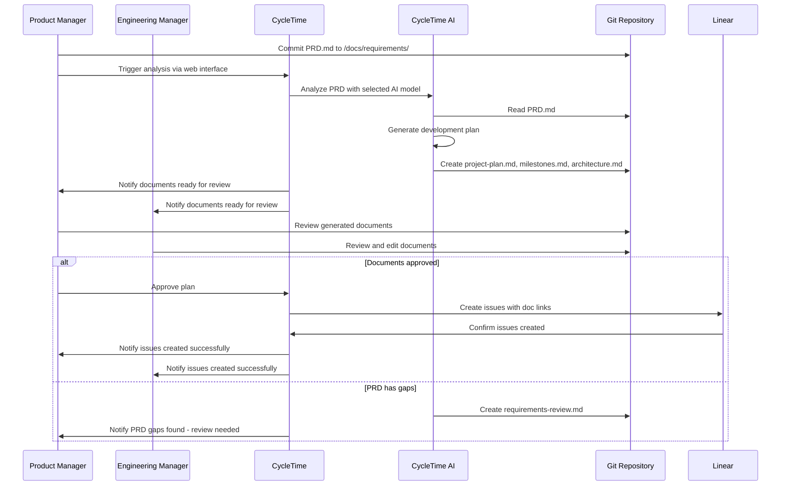
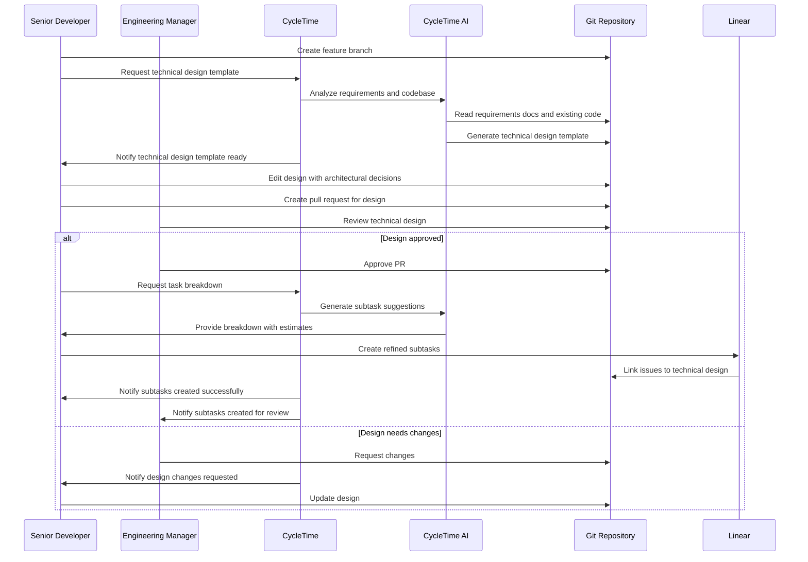
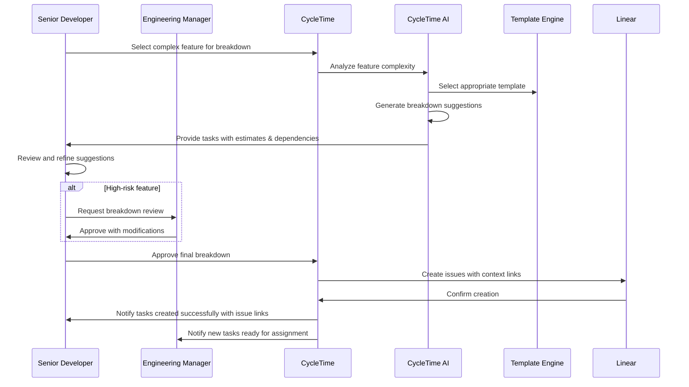
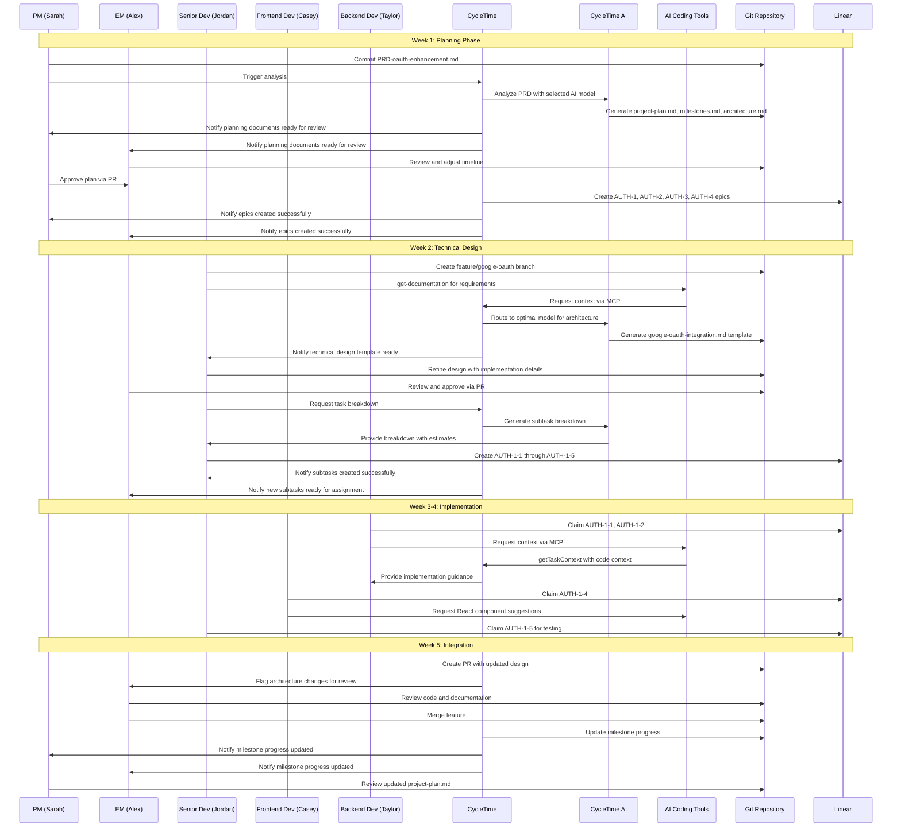

# CycleTime - Intelligent Project Orchestration Platform PRD

## 1. Overview

### 1.1 Product Summary

**Product Name**: CycleTime  
**Product Type**: Intelligent Project Orchestration Platform with MCP Integration  
**Version**: 1.1  
**Document Owner**: John Burbridge  
**Last Updated**: July 17, 2025

### 1.2 Problem Statement

Engineering teams of any size, from enterprises to solo founders, struggle to maintain alignment and deliver consistent results as projects scale in complexity. Technology leaders face critical challenges: coordinating across multiple developers with varying workflows, maintaining project coherence as teams grow, and ensuring deliverable accuracy without forcing tool standardization that reduces developer productivity. The manual process of breaking down requirements into actionable development plans is inconsistent across teams, and project documentation often becomes stale or disconnected from actual development work, leading to context loss and miscommunication that compounds with team size.

**AI Agent Context Window Limitations**: While AI tools can assist with individual development tasks, they face critical limitations when working with large, complex software projects. AI agents frequently lose crucial project context due to conversation length constraints, context switching between different tools and sessions, and inability to efficiently access comprehensive project documentation. This leads to agent hallucination, inconsistent recommendations, and decisions that don't align with broader project goals and architectural constraints. Developers find themselves repeatedly re-explaining project context, significantly reducing the productivity gains that AI assistance should provide.

**Parallel Development Coordination Challenges**: When multiple developers work on the same project simultaneously, teams struggle with coordination overhead and integration risks. Without clear system boundaries, API contracts, and dependency mappings defined upfront, developers often create incompatible implementations that require expensive late-stage refactoring. Traditional project management tools focus on task assignment but fail to address the technical coordination needed for parallel development. Teams resort to frequent meetings, shared documents, and informal communication to coordinate interfaces and dependencies, leading to bottlenecks, blocked developers, and integration surprises that derail project timelines.

**Development Standards Consistency Challenges**: Engineering teams struggle to maintain consistent code quality and development practices across projects and team members. While static analysis tools and linters catch syntax issues, they cannot enforce team-specific practices like Test-Driven Development cycles, architectural patterns, documentation standards, or nuanced code review requirements. Human code review becomes the primary mechanism for standards enforcement, creating bottlenecks and inconsistent application of team practices. New team members lack guidance on team-specific conventions, and AI coding assistants operate without awareness of established team standards, leading to code that technically works but doesn't align with team practices and architectural decisions.

Currently, there's no integrated solution that maintains living documentation in the repository while intelligently orchestrating the entire project lifecycle from requirements analysis to task completion, specifically addressing the context window management challenges that prevent reliable AI agent collaboration, the technical coordination challenges that prevent efficient parallel development, and the standards enforcement challenges that prevent consistent development practices in software development.

### 1.3 Solution Overview

CycleTime is an intelligent project orchestration platform that enhances team collaboration and developer experience through AI-assisted project planning. The platform keeps humans in control of all critical decisions while leveraging the best of AI to improve planning efficiency and team coordination. CycleTime specifically addresses AI agent context window limitations through repository-centric documentation and intelligent context management, enabling reliable human-AI collaboration across extended development cycles.

The platform provides flexible AI model selection with support for leading providers (OpenAI, Anthropic, Google, and more) for planning and analysis tasks, while supporting integration with popular AI coding tools (Claude Code, Cursor, Windsurf, GitHub Copilot, JetBrains AI, etc.) for code-specific assistance during development. Through advanced context window management via the Model Context Protocol (MCP), CycleTime ensures that AI agents maintain consistent access to relevant project information without overwhelming their processing capabilities or causing hallucinations due to context loss.

By analyzing Markdown-formatted requirements documents stored in the project repository and providing AI-powered assistance through your chosen AI models, CycleTime creates a seamless connection between documentation, planning, and execution that both humans and AI agents can access throughout the project lifecycle, with intelligent context prioritization that scales from simple features to complex, multi-month projects. The platform supports both monorepo and polyrepo architectures, with the MVP implementation focusing on monorepos for streamlined initial deployment.

### 1.4 Context Window Management Strategy

**Core Challenge**: AI agents working on software projects face significant limitations due to context window constraints. When agents lose access to crucial project context—whether due to conversation length limits, context switching between tools, or incomplete documentation access—they tend to hallucinate, make incorrect assumptions, or provide suboptimal recommendations that don't align with project requirements.

**CycleTime's Approach**: 

**Repository-Centric Context Persistence**: Unlike conversation-based AI interactions that lose context over time, CycleTime maintains all project context in versioned repository documentation. This ensures that both human team members and AI agents can access complete, up-to-date project information at any point in the development lifecycle.

**Intelligent Context Retrieval**: Through the MCP (Model Context Protocol) integration, local AI tools can request specific project context with semantic search capabilities. Rather than overwhelming agents with entire documentation sets, CycleTime provides targeted, relevant context based on the current task and conversation scope.

**Layered Context Architecture**:
- **Immediate Context**: Current task specifications and directly related documentation
- **Project Context**: Overall project goals, architecture decisions, and milestone status  
- **Historical Context**: Previous decisions, completed tasks, and lessons learned
- **Cross-Reference Context**: Related tasks, dependencies, and impact analysis

**Context Window Optimization**: CycleTime automatically prioritizes and structures context delivery to maximize agent effectiveness within token limits, ensuring critical information reaches agents while filtering out noise that could lead to confusion or hallucination.

This strategy transforms AI agent reliability from a best-effort interaction to a systematic, context-aware collaboration that maintains project coherence across extended development cycles.

## 2. Goals & Success Metrics

### 2.1 Primary Goals

1. **Enhance Team Collaboration**: Improve project planning efficiency and team coordination through intelligent AI assistance with your preferred models
1. **Improve Developer Experience**: Leverage the best of AI to reduce planning overhead and enhance development workflows with 95%+ success rate
1. **Integrate with Existing Workflows**: Seamlessly connect with teams' preferred issue tracking systems (Linear, Jira, GitHub Issues) without requiring process changes
1. **Maintain Living Documentation**: Keep all project documentation in sync with actual development progress
1. **Seamless AI Tool Integration**: Enable popular AI coding tools (Claude Code, Cursor, Windsurf, etc.) to access repository context through MCP integration
1. **Eliminate Context Window Limitations**: Provide AI agents with intelligent, prioritized access to project context, eliminating hallucinations and inconsistencies caused by context loss
1. **Maintain Human Control**: Ensure teams drive all critical decisions while benefiting from AI-enhanced collaboration and documentation accessibility

### 2.2 Success Metrics

- **Time Savings**: Reduce project planning time from 2-3 days to 2-3 hours
- **AI Reliability**: Achieve 95%+ successful AI API responses with consistent quality across multiple providers
- **Context Window Effectiveness**: Reduce AI agent hallucination incidents by 90% through intelligent context management
- **Context Retrieval Performance**: Deliver relevant project context to AI agents in <5 seconds for 95% of requests
- **Integration Risk Reduction**: Reduce late-stage integration errors by 75% through contract-first development
- **Parallel Development Efficiency**: Enable 60%+ of development tasks to proceed in parallel without coordination bottlenecks
- **Contract Compliance**: Achieve 90%+ implementation compliance with generated API contracts and system boundaries
- **Adoption**: 200+ projects managed within first year
- **Quality**: 95%+ user satisfaction with generated plans after human review
- **Integration Success**: 90%+ successful repository context provision to AI coding tools with optimized context delivery
- **Productivity**: 40% faster time-to-first-commit on new projects
- **Agent Consistency**: 85%+ consistency in AI recommendations across different conversation sessions for the same project context
- **Adoption**: 200+ projects managed within first year across teams of varying sizes
- **Retention**: 80%+ of teams continue using CycleTime after 3 months

### 2.3 Non-Goals

- Autonomous code generation without human review
- Replacing human developers or engineering managers
- Supporting non-development project types initially
- Providing deployment or production management capabilities

## 3. User Personas & Use Cases

### 3.1 Primary Users

**Product Manager Persona**: Sarah Chen

- **Background**: 5+ years PM experience, works with engineering teams of 5-15 people
- **Goals**: Quickly translate product vision into clear, actionable engineering work with confidence in AI-generated recommendations
- **Pain Points**: Manual requirement breakdown takes too long, documentation becomes stale, inconsistent quality in project planning
- **Technical Proficiency**: Comfortable with project management tools, basic understanding of development processes
- **AI Comfort Level**: Willing to use AI for assistance but wants to maintain control over decisions

**Engineering Manager Persona**: Alex Rodriguez

- **Background**: Technical lead managing 8-12 developers across frontend, backend, and QA
- **Goals**: Ensure efficient project execution with clear task distribution, progress visibility, and team coordination without forcing tool standardization
- **Pain Points**: Team alignment challenges as projects scale, inconsistent task breakdown quality, difficulty tracking dependencies across different developer workflows, project documentation scattered across tools, resistance to new tools that disrupt developer productivity
- **Technical Proficiency**: Strong technical background, experienced with issue tracking and project management
- **AI Comfort Level**: Sees AI as a productivity tool but insists on human oversight for technical decisions and values solutions that work with existing developer tools

**Senior Developer Persona**: Jordan Kim

- **Background**: 7+ years development experience, often leads technical design discussions
- **Goals**: Understand requirements quickly, get clear technical specifications, focus on implementation with consistent AI assistance using preferred development tools
- **Pain Points**: Poorly defined requirements, unclear technical specifications, difficulty finding project context and documentation, forced adoption of new tools that disrupt established workflows, context switching between tools
- **Technical Proficiency**: Expert in development tools and workflows, strong preferences for specific editors and development environments
- **AI Comfort Level**: Comfortable using AI for code suggestions but wants to review all AI-generated technical content and prefers solutions that integrate with existing AI tools rather than replacing them

### 3.2 Use Cases

#### Use Case 1: Repository-Based PRD to Development Plan

- **Actor**: Product Manager + Engineering Manager
- **Preconditions**: PRD written in Markdown format, project repository exists with configured issue tracker
- **Main Flow**:
1. PM commits PRD.md to repository in `/docs/requirements/` directory
1. PM triggers CycleTime analysis via repository integration or web interface
1. CycleTime AI analyzes Markdown PRD and generates suggested development plan
1. CycleTime creates additional Markdown documents: `project-plan.md`, `milestones.md`, `architecture.md`
1. PM and EM review generated documents, make edits directly in repository
1. Upon approval, CycleTime creates issues in tracking system with links to repository documentation
1. All project documentation remains version-controlled and accessible to team
- **Expected Outcome**: Structured development plan with living documentation maintained in repository
- **Alternative Flows**: If PRD has gaps, CycleTime AI creates `requirements-review.md` highlighting missing information



#### Use Case 2: Hybrid Technical Documentation Workflow

- **Actor**: Senior Developer + Engineering Manager
- **Preconditions**: Feature issues exist with approved requirements, repository documentation structure established
- **Main Flow**:
1. Developer selects feature for technical design and creates branch
1. CycleTime AI analyzes requirements from repository docs and existing codebase
1. CycleTime generates technical design template in `/docs/technical-designs/[feature-name].md`
1. CycleTime notifies developer that technical design template is ready
1. Developer edits Markdown document with architectural decisions and high-level design
1. EM reviews design document via pull request process
1. Upon approval, developer creates detailed subtasks in Linear using CycleTime AI-suggested breakdown
1. CycleTime notifies team when subtasks are created successfully
1. Implementation details captured in code comments and PR descriptions
1. Technical design remains linked to issues and updated for architectural changes only
- **Expected Outcome**: Right-sized documentation with architectural decisions in repository and implementation details in workflow



#### Use Case 3: AI-Assisted Task Breakdown

- **Actor**: Senior Developer + Engineering Manager
- **Preconditions**: Epic-level issues exist with approved requirements, feature complexity templates available
- **Main Flow**:
1. Developer selects complex feature requiring breakdown
1. CycleTime AI analyzes feature requirements and suggests subtask breakdown using appropriate templates
1. CycleTime provides breakdown suggestions with effort estimates and dependencies
1. Developer reviews, refines, and approves suggested subtasks
1. CycleTime creates Linear issues with proper linking and context
1. CycleTime notifies developer and manager when tasks are created successfully
1. Breakdown rationale captured in issue description for future reference
1. Review process applied for high-risk features based on complexity scoring
- **Expected Outcome**: Consistent task breakdown quality with engineer ownership and AI assistance



#### Use Case 4: End-to-End Workflow Example - 3-Engineer Team with Linear

- **Actors**: Product Manager (Sarah), Engineering Manager (Alex), Senior Developer (Jordan), Frontend Developer (Casey), Backend Developer (Taylor)
- **Project**: “User Authentication Enhancement” - Add OAuth providers and improve security
- **Preconditions**: Project repository exists, Linear workspace configured, team has CycleTime access

**Detailed Workflow**:

**Week 1: Planning Phase**

1. **Sarah (PM)** commits `PRD-oauth-enhancement.md` to `/docs/requirements/`
1. **Sarah** triggers CycleTime analysis via web dashboard
1. **CycleTime** analyzes PRD using your preferred AI model, generates:
- `project-plan.md` (3-month timeline, 4 milestones)
- `milestones.md` (OAuth providers, Security audit, UI redesign, Testing)
- `architecture.md` (Security architecture, API changes, Database schema)
1. **Alex (EM)** reviews generated documents, adjusts timeline from 3 to 4 months
1. **Sarah and Alex** approve plan via PR review process
1. **CycleTime** creates Linear issues with auto-generated descriptions and links to documentation:
- `AUTH-1: Implement Google OAuth Provider` (Epic)
- `AUTH-2: Add GitHub OAuth Provider` (Epic)
- `AUTH-3: Security Audit and Hardening` (Epic)
- `AUTH-4: Update UI for Multiple Providers` (Epic)
1. **CycleTime** generates contract documentation to enable parallel development:
- `/docs/contracts/auth-api-spec.md` (OpenAPI specification for OAuth endpoints)
- `/docs/contracts/system-boundaries.md` (Component responsibilities and interfaces)
- `/docs/contracts/data-contracts.md` (Database schemas and message formats)
- `/docs/contracts/dependency-map.md` (Integration points and data flow)
1. **Alex** reviews and approves contract specifications, enabling parallel work to begin

**Week 2: Parallel Development Setup**
7. **Jordan (Senior Dev)** selects AUTH-1 epic, creates feature branch `feature/google-oauth`
8. **Jordan** uses Claude Code with MCP tool: `get-documentation` to review requirements and architecture
9. **CycleTime** uses optimal AI models for architectural analysis and reasoning
10. **CycleTime** generates `/docs/technical-designs/google-oauth-integration.md` using selected AI models with:
- API endpoint specifications
- Database schema changes
- Security considerations
- Frontend integration points
11. **Jordan** refines design, adds implementation details and testing strategy
12. **Alex** reviews technical design via PR, approves with minor security suggestions
13. **Jordan** uses CycleTime AI-assisted breakdown tool to create implementable tasks:
- `AUTH-1-1: Create OAuth service class` (Backend, 3 story points)
- `AUTH-1-2: Add Google OAuth endpoints` (Backend, 5 story points)
- `AUTH-1-3: Update user model for OAuth data` (Backend, 2 story points)
- `AUTH-1-4: Frontend OAuth button component` (Frontend, 3 story points)
- `AUTH-1-5: Integration tests` (QA, 2 story points)
14. **CycleTime** creates Linear issues with proper dependencies and context links

**Week 3-4: Parallel Implementation**
14. **Taylor (Backend)** and **Casey (Frontend)** begin parallel development using generated contracts:
- **Taylor** uses contract specifications to implement OAuth service endpoints
- **Casey** uses mock API responses generated from contracts to build UI components
- Both developers work simultaneously without coordination bottlenecks
15. **Taylor** uses Cursor with MCP integration to access CycleTime standards:
   - `CycleTime.getTaskContext({ task_id: "AUTH-1-1", include_contracts: true, include_standards: true })`
   - Receives team-specific TDD requirements and security patterns for OAuth implementation
   - Gets real-time guidance on architectural patterns and code organization standards
16. **Casey** uses Windsurf with standards-aware development:
   - `CycleTime.validateContractCompliance({ component: "oauth-button" })`
   - Receives component naming conventions and accessibility standards
   - Gets automated suggestions for React patterns and testing requirements
17. **Jordan** creates integration tests following team TDD standards:
   - Uses CycleTime-delivered testing patterns via MCP
   - Follows Red-Green-Refactor cycle enforced by development standards
   - Generates test cases that align with contract specifications
18. **Development workflow with standards enforcement**:
   - **CycleTime** validates implementation compliance with both contracts and development standards
   - **AI coding tools** provide real-time feedback on standards violations
   - **Pull requests** automatically analyzed for standards compliance before merge
19. As each component completes, **CycleTime** updates dependency status and unblocks dependent tasks
20. **Linear** shows progress with contract compliance indicators, standards compliance scores, and integration readiness status

**Week 5: Integration and Review**
20. **Jordan** creates PR for feature branch, includes updated technical design
21. **CycleTime** automatically analyzes PR for:
    - Contract compliance with generated API specifications
    - Development standards adherence (TDD coverage, documentation, security practices)
    - Architecture consistency with documented design
22. **CycleTime** generates PR review report showing:
    - ✅ 95% standards compliance (minor documentation formatting issues)
    - ✅ Contract validation passed for all OAuth endpoints
    - ⚠️ Advisory: Consider adding rate limiting to OAuth callback endpoint
23. **Alex** reviews code, documentation, and automated compliance report
24. **Team** merges feature after addressing advisory suggestions
25. **CycleTime** updates milestone progress and standards compliance metrics in repository
26. **Sarah** reviews updated `project-plan.md` showing 25% completion with high code quality metrics

**Key Benefits Demonstrated**:

- **Parallel development enabled**: Clear contracts allow multiple developers to work simultaneously without coordination bottlenecks
- **Integration risk minimized**: Contract compliance validation catches incompatibilities before merge conflicts
- **Documentation stays current**: All project context lives in repository with code
- **Reliable AI assistance**: Optimal AI models for planning and architecture, AI coding tools for development assistance
- **Seamless tool integration**: Linear issues link directly to repository documentation
- **Human oversight**: All AI suggestions reviewed and approved by appropriate team members
- **Consistent quality**: Contract-based development ensures predictable, high-quality implementations
- **Knowledge sharing**: New team members can understand project by reading repository docs and contracts

**Timeline**: 5 weeks from PRD to first major feature completion
**Traditional approach**: 8-10 weeks with manual planning and disconnected documentation
**Time savings**: 40-50% reduction in planning and coordination overhead

- **Expected Outcome**: Faster development cycles with better documentation and team coordination



## 4. Product Requirements

### 4.1 Must-Have Features (P0)

#### Feature 1: Multi-Model PRD Analysis Engine

- **Description**: Analyze Markdown PRD documents using optimal AI models for consistent, high-quality planning and analysis
- **User Story**: “As a Product Manager, I want the system to automatically select the best AI model for analyzing my PRD so that I get the highest quality results while optimizing costs”
- **Acceptance Criteria**:
  - Parse Markdown PRD documents from repository `/docs/requirements/` directory
  - Analyze requirements using your preferred AI models for complex reasoning and understanding
  - Generate planning documents: `project-plan.md`, `milestones.md`, `architecture.md` in repository
  - Support standard Markdown extensions (tables, code blocks, mermaid diagrams)
  - Achieve 95%+ successful API responses with consistent quality output
  - Provide clear error handling and retry mechanisms for API failures
  - Support configurable AI model parameters and prompts across multiple providers
- **Implementation**: Multi-provider AI integration, Git integration, Markdown parsing library, template-based document generation

#### Feature 2: Documentation-Linked Issue Management

- **Description**: Create issues in external tracking systems with automatic links to repository documentation
- **User Story**: “As an Engineering Manager, I want issues automatically created with links to our project docs so that context is always available”
- **Acceptance Criteria**:
  - Integrate with Jira, GitHub Issues, and Linear
  - Generate issue descriptions that reference specific sections of repository documentation
  - Include direct links to relevant Markdown files and line numbers
  - Automatically update issue descriptions when linked documentation changes
  - Support bidirectional linking between issues and documentation sections
  - Maintain issue templates that encourage documentation references
- **Implementation**: Issue tracker APIs, Git webhook integration, Markdown link parsing

#### Feature 3: Adaptive Technical Design System

- **Description**: Generate technical design documents focused on architectural decisions with AI-assisted task breakdown for implementation
- **User Story**: “As a Senior Developer, I want technical designs created with the most appropriate AI model for architectural planning so that I get consistent, high-quality specifications”
- **Acceptance Criteria**:
  - Use optimal AI models for technical analysis and architectural reasoning
  - Generate technical design templates in `/docs/technical-designs/` directory focusing on architectural decisions
  - Provide AI-assisted task breakdown using feature complexity templates
  - Create design documents with high-level specifications and decision rationale
  - Support lightweight templates for common feature types
  - Enable breakdown review process for high-risk features
  - Automatically detect when code changes affect architectural decisions
  - Enable collaborative editing through standard Git workflow with AI assistance
- **Implementation**: Multi-model AI integration, Git integration, template system, task breakdown algorithms, complexity scoring

#### Feature 4: Repository-Synced Progress Tracking

- **Description**: Monitor project progress by analyzing both repository activity and issue tracker updates
- **User Story**: “As an Engineering Manager, I want progress tracking that reflects both our documentation and actual code changes”
- **Acceptance Criteria**:
  - Monitor commits, documentation changes, and issue tracker updates
  - Automatically update project status documents in repository
  - Detect discrepancies between documented plans and actual implementation
  - Generate progress reports with links to specific documentation and code changes
  - Identify when documentation needs updates based on code evolution
  - Provide notifications when project status documents are automatically updated
- **Implementation**: Git webhook integration, commit analysis, automated documentation updates

#### Feature 5: Contract-First Development Documentation

- **Description**: Generate system architecture, API contracts, and dependency maps from PRDs to enable parallel development with minimal integration risk
- **User Story**: "As an Engineering Manager, I want clear system boundaries and API contracts defined upfront so that multiple developers can work in parallel without integration conflicts"
- **Acceptance Criteria**:
  - Generate system component boundaries and responsibilities from PRD analysis
  - Create API specifications (OpenAPI/GraphQL schemas) for component interfaces
  - Produce dependency matrices showing component interactions and data flow
  - Generate integration point documentation with clear contracts
  - Create mock/stub templates for parallel development and testing
  - Validate implementation compliance with generated contracts
  - Support iterative contract refinement as requirements evolve
  - Enable contract versioning and change impact analysis
  - Automatically detect when code changes affect system contracts
- **Implementation**: Contract generation engine, dependency analysis algorithms, API specification generators, mock/stub generation tools, compliance validation system

#### Feature 6: Custom Development Standards Enforcement

- **Description**: Enable teams to define, deliver, and enforce custom development standards through AI agents and automated code analysis
- **User Story**: "As an Engineering Manager, I want to define team-specific development standards that are automatically delivered to AI coding tools and enforced in pull requests so that our code quality and practices remain consistent across all team members"
- **Acceptance Criteria**:
  - Define custom development standards in Markdown format within repository (`/docs/standards/` directory)
  - Ship with sensible default standards library (TDD, conventional commits, security practices, documentation requirements)
  - Allow full customization: disable, relax, or replace any standard entirely
  - Deliver standards to AI coding tools via MCP for real-time guidance during development
  - Analyze pull requests for standards compliance using AI-powered code analysis
  - Support configurable enforcement levels: advisory (suggestions only), warning (non-blocking), blocking (prevent merge)
  - Provide detailed compliance reports with specific improvement recommendations
  - Enable standards inheritance: organization → team → project → repository levels
  - Track standards compliance metrics and team adherence trends
  - Support exception handling with justification requirements for standards bypasses
- **Implementation**: Standards definition framework, MCP standards delivery system, AI-powered code analysis engine, PR integration webhooks, compliance reporting dashboard

### 4.2 Should-Have Features (P1)

#### Feature 7: Configurable Multi-Model AI Assistant

- **Description**: Provide contextual assistance using intelligent model routing based on task type and user preferences
- **User Story**: “As a Developer, I want AI assistance that automatically uses the best model for my current task type so that I get optimal help whether I’m planning, coding, or documenting”
- **Acceptance Criteria**:
  - Automatically route requests to optimal models based on task type (documentation analysis, code generation, architectural planning)
  - Access all project documentation from repository in real-time
  - Support user-configurable model preferences with organization-wide defaults
  - Provide task-specific context by analyzing linked documentation with appropriate specialized models
  - Enable model performance monitoring and automatic fallback to alternative models
  - Support cost controls and budget management across different model tiers
  - Maintain model selection transparency with reasoning explanations
- **Implementation**: MCP server with multi-model orchestration, Git integration, document indexing, semantic search, and cost tracking

#### Feature 8: Documentation-Based Dependency Management

- **Description**: Automatically identify and track dependencies through documentation analysis
- **User Story**: “As an Engineering Manager, I want dependency tracking that’s based on our actual project documentation”
- **Acceptance Criteria**:
  - Parse dependency information from technical design documents
  - Visualize dependencies between features, components, and milestones
  - Automatically detect when documentation changes affect dependencies
  - Generate dependency graphs from repository documentation
  - Alert when circular dependencies are introduced in planning documents
  - Suggest optimal task ordering based on documented dependencies
- **Implementation**: Markdown parsing for dependency extraction, graph analysis, visualization components

### 4.3 Could-Have Features (P2)

#### Feature 9: Team Velocity Analytics

- **Description**: Analyze team performance patterns and suggest optimizations
- **User Story**: “As an Engineering Manager, I want insights into team velocity so that I can improve our development process”
- **Rationale**: Valuable for continuous improvement but not essential for core functionality

#### Feature 10: Multi-Project Portfolio View

- **Description**: Manage multiple projects with shared resources and dependencies
- **User Story**: “As a Director of Engineering, I want to see progress across multiple projects so that I can allocate resources effectively”
- **Rationale**: Important for larger organizations but adds significant complexity

## 5. Technical Requirements

### 5.1 System Architecture

**Primary Architecture**: Repository-Centric with Context-Aware AI Integration

- **Multi-Model AI Integration**: Direct API integration with multiple providers for all planning and analysis tasks with intelligent model routing
- **Git Integration**: Direct repository access for reading/writing Markdown documentation
- **Context Management Service**: Intelligent document chunking, semantic search, and context prioritization engine
- **Contract Generation Engine**: Automated system boundary analysis, API specification generation, and dependency mapping for parallel development
- **Standards Engine**: Custom development standards definition, AI-powered compliance analysis, and automated enforcement system
- **CycleTime Server**: Central orchestration engine with REST API and webhook support
- **Web Dashboard**: React-based interface for project management, document preview, and AI model configuration
- **MCP Server Component**: Provides AI assistance with optimized repository context delivery for AI coding tools
- **Document Indexing Service**: Vector-based search and semantic analysis for efficient context retrieval
- **Context Window Optimizer**: Real-time context budgeting and delivery optimization for AI agents
- **Issue Tracker Integrations**: Bidirectional sync with external systems

### 5.2 MCP Server Specifications

**Server Type**: Hybrid (Resources + Tools) with Context Window Optimization

**Protocol Details**:

- **MCP Version**: 1.0
- **Transport**: stdio (for local development), HTTP (for remote access)
- **Authentication**: Project-based API keys

**Context Window Management Features**:

- **Intelligent Context Chunking**: Automatically segments large documentation into semantically coherent chunks that fit within agent context windows
- **Context Prioritization**: Ranks context relevance based on current task, conversation history, and project phase
- **Semantic Search Integration**: Provides vector-based search capabilities for finding relevant context across project documentation
- **Context Window Budgeting**: Monitors and optimizes token usage to prevent context overflow and maintain conversation coherence
- **Cross-Reference Resolution**: Automatically resolves and includes related documentation sections when agents request specific context
- **Layered Context Delivery**: Provides context at multiple granularity levels (immediate, project, historical) based on agent needs

### 5.3 Functional Requirements

**Core Platform (REST API)**:

- **AI Model Orchestration**: Intelligent routing, fallback management, and cost optimization across multiple AI providers
- **Repository Integration**: Git operations for reading/writing Markdown documentation
- **Document Processing**: Markdown parsing, template generation, and structure validation using appropriate specialized models
- **Project Management**: CRUD operations for projects with repository-backed documentation
- **Issue Integration**: Bidirectional sync with external issue trackers and documentation links
- **Progress Tracking**: Repository activity monitoring and automated documentation updates
- **User Management**: Role-based access control with Git permissions integration and model usage policies

**MCP Resources**:

- **repository-docs**: Access to all project documentation from repository
- **project-context**: Current project information with links to specific documentation sections
- **task-specifications**: Detailed specifications with references to design documents
- **technical-designs**: Live technical design documents from repository
- **progress-status**: Real-time project status with documentation change history
- **dependency-graph**: Dependency information extracted from documentation

**MCP Tools**:

- **get-documentation**: Retrieve specific documentation sections from repository for AI coding tools with intelligent chunking
- **get-contextual-overview**: Provide layered project context (immediate/project/historical) optimized for agent context windows
- **search-project-context**: Semantic search across all project documentation with relevance ranking
- **analyze-requirements**: Get CycleTime AI analysis of requirements using optimal models with document references
- **suggest-implementation**: Receive implementation suggestions from AI coding tools with CycleTime-provided context and technical designs
- **review-technical-design**: Get CycleTime AI feedback on design documents using architectural reasoning models
- **check-dependencies**: Analyze dependencies from documentation structure with context prioritization
- **update-documentation**: Create or update documentation files in repository
- **cross-reference-docs**: Find related information across different documentation types with semantic linking
- **validate-documentation**: Check documentation consistency and completeness
- **optimize-context-delivery**: Dynamically adjust context delivery based on agent performance and conversation length
- **track-context-usage**: Monitor context window utilization and suggest optimizations
- **configure-models**: Set model preferences and routing policies for specific tasks
- **get-model-recommendations**: Receive CycleTime suggestions for optimal model selection based on task complexity
- **manage-context-budget**: Set and monitor context window usage limits for different agent types
- **generate-contracts**: Create API specifications and interface contracts from requirements analysis
- **validate-contract-compliance**: Check implementation compliance with generated contracts
- **analyze-system-boundaries**: Identify component boundaries and responsibilities for parallel development
- **create-dependency-map**: Generate dependency matrices and integration point documentation
- **generate-mock-stubs**: Create mock/stub templates for parallel development and testing
- **get-team-standards**: Retrieve current team development standards for AI coding tools
- **validate-standards-compliance**: Check code compliance with team development standards
- **analyze-code-patterns**: Identify adherence to team practices (TDD cycles, architectural patterns, etc.)
- **suggest-standards-improvements**: Provide recommendations for better standards compliance
- **create-standards-report**: Generate detailed compliance reports for pull requests
- **configure-enforcement-levels**: Set standards enforcement policies (advisory/warning/blocking)
- **track-standards-metrics**: Monitor team adherence trends and compliance rates

### 5.4 Non-Functional Requirements

**Performance**:

- Multi-model document analysis: < 2 minutes for documents up to 10,000 lines with optimal model selection
- Model routing decisions: < 500ms for task-to-model assignment
- Repository documentation sync: < 30 seconds for projects with 100+ docs
- Issue creation with doc links: < 60 seconds for projects with 50+ issues
- MCP documentation queries: < 5 seconds for any repository document with cached model responses
- Cross-reference analysis: < 10 seconds across full project documentation
- **Context Window Optimization**: < 2 seconds for context prioritization and chunking for any project size
- **Semantic Search Performance**: < 3 seconds for finding relevant context across repositories with 1000+ documents
- **Context Delivery Optimization**: 95% reduction in irrelevant context delivered to agents
- Cost optimization: 49% reduction in AI costs through intelligent model routing

**Reliability**:

- Uptime: 99.5% availability during business hours
- Documentation consistency: Real-time sync between repository and platform within 2 minutes
- Version control: Full Git history preservation for all documentation changes
- Backup: Repository-based backup through Git with redundant hosting

**Security**:

- Git integration with SSH key or token-based authentication
- Repository access control through existing Git permissions
- Role-based access control aligned with repository permissions
- Audit logging for all documentation changes via Git commit history
- Encrypted communication with external services

**Scalability**:

- Support 500+ concurrent projects with repository integration
- Handle repositories with 1,000+ documentation files
- Support 100+ concurrent users with repository access
- Intelligent model load balancing across multiple AI providers
- Efficient Git operations with shallow clones and selective file monitoring
- Horizontal scaling for AI orchestration workloads

## 6. User Experience Requirements

### 6.1 Installation Experience

- **Setup Time**: < 15 minutes from installation to first repository connection
- **Repository Integration**: Guided setup for Git repository access with validation
- **Documentation Structure**: Automated creation of standard documentation directories and templates

### 6.2 Developer Experience

- **Documentation Browser**: Intuitive interface for viewing and editing repository documentation
- **AI Model Dashboard**: Transparent model selection with performance metrics and cost tracking
- **Markdown Editor**: Rich editing experience with live preview and template support
- **Git Integration**: Seamless workflow for documentation changes via standard Git operations
- **MCP Integration**: Transparent access to repository documentation through existing AI tools with configurable model preferences
- **Mobile**: Responsive design for documentation viewing and light editing on mobile devices

### 6.3 Documentation Workflows

- **Version Control**: All documentation changes go through standard Git workflow (commit, branch, merge)
- **Review Process**: Documentation changes reviewed via pull requests with stakeholder approval
- **Template System**: Consistent document structure enforced through customizable templates
- **Change Tracking**: Complete audit trail of all documentation modifications via Git history

## 7. Constraints & Assumptions

### 7.1 Technical Constraints

- Must integrate with existing issue tracking systems without requiring custom installations
- AI suggestions must be clearly marked and require explicit human approval
- Limited by external API rate limits and availability

### 7.2 Business Constraints

- Initial focus on software development projects only
- Markdown-only documentation format for AI analysis
- Requires Git repository setup and existing issue tracker
- Multi-model approach requires API access to major AI providers (OpenAI, Anthropic, Google)
- English language support for documentation analysis initially

### 7.3 Assumptions

- Teams follow agile or similar iterative development methodologies
- Developers are comfortable with Git workflow for documentation management
- Organizations value having project documentation version-controlled with code
- Teams are willing to adopt Markdown as primary documentation format
- AI model APIs will remain stable and continue to improve in capabilities
- Organizations are willing to invest in multiple AI provider relationships for optimal performance

## 8. Dependencies & Integrations

### 8.1 External Dependencies

- **AI Model Providers**: Multiple provider APIs (OpenAI, Anthropic, Google, etc.) for planning and analysis
- **Git Integration**: Direct repository access via SSH/HTTPS for documentation management
- **Issue Tracking APIs**: Jira, GitHub Issues, Linear APIs for bidirectional sync
- **Markdown Processing**: Advanced Markdown parsing with support for extensions (tables, mermaid, etc.)
- **Error Handling Infrastructure**: Retry mechanisms and fallback strategies for API reliability
- **Webhook Support**: Git hosting platform webhooks for real-time repository monitoring

### 8.2 Integration Points

- **Issue Tracking Systems**: Bidirectional sync for project state management
- **Development Tools**: MCP integration for AI assistance during development
- **Communication Tools**: Slack/Teams integration for notifications and updates
- **Code Repositories**: GitHub/GitLab integration for context and technical analysis

## 9. Risks & Mitigation

### 9.1 Technical Risks

- **Risk**: AI model provider API changes or service disruptions affect core functionality
- **Impact**: High - Could prevent access to specialized models and disrupt workflows
- **Probability**: Medium - Multiple providers reduce individual risk but increase complexity
- **Mitigation**: Multi-provider architecture with automatic failover, comprehensive monitoring, and contract SLAs
- **Risk**: Model performance degradation or quality issues with AI suggestions
- **Impact**: High - Could reduce user trust and adoption if AI recommendations become unreliable
- **Probability**: Medium - AI model quality varies and can change with updates
- **Mitigation**: Performance monitoring, A/B testing of model outputs, user feedback loops, and manual override capabilities

### 9.2 Business Risks

- **Risk**: Rapid AI model cost increases or pricing model changes affect platform economics
- **Impact**: High - Could make the platform uneconomical or require significant price increases
- **Probability**: Medium - AI pricing is still evolving and could change rapidly
- **Mitigation**: Multi-provider cost optimization, flexible pricing models, and cost monitoring with budget controls
- **Risk**: Teams resist AI-assisted planning due to trust or control concerns
- **Impact**: High - Could limit adoption and growth
- **Probability**: Medium - AI adoption varies by organization culture
- **Mitigation**: Emphasize human control, provide transparency in AI decision-making, gradual feature rollout, and comprehensive training

## 10. Launch Plan

### 10.1 Release Strategy

- **Alpha**: Internal testing with 3 pilot projects (Month 1-2)
- **Beta**: Limited release to 15 partner development teams (Month 3-4)
- **GA**: General availability with full feature set (Month 5-6)

### 10.2 Go-to-Market

- **Target Audience**: Engineering teams at tech companies with 5-50 developers
- **Distribution Channels**: SaaS platform, integration marketplaces, developer conferences
- **Pricing Model**: Per-project subscription with free tier for small teams

### 10.3 Success Criteria for Launch

- 100+ active projects in beta phase
- 90%+ user satisfaction with plan quality after human review
- Successful integration with all three major issue trackers
- 49% cost reduction demonstrated through intelligent model routing
- Multi-model orchestration working reliably across different task types
- **Contract-first development metrics**:
  - 75% reduction in integration conflicts measured across pilot projects
  - 90%+ implementation compliance with generated contracts
  - 60% faster parallel development cycles with automated contract validation
- **Standards enforcement metrics**:
  - 85%+ development standards compliance rate across teams using MCP integration
  - 50% reduction in code review time due to automated standards checking
  - 95% developer satisfaction with AI-delivered standards guidance during development
  - 3x improvement in code consistency scores measured through automated analysis

## 11. Post-Launch

### 11.1 Maintenance & Support

- **Support Channels**: Email support, documentation site, community forum
- **Update Frequency**: Bi-weekly feature releases, immediate bug fixes
- **Training**: Video tutorials, best practices guides, webinars

### 11.2 Future Roadmap

- **Q2**: Advanced model performance analytics, automated optimization recommendations, enhanced contract generation with machine learning
- **Q3**: Custom model integration support for organization-specific models, local deployment options, advanced standards enforcement with team learning
- **Q4**: Support for non-English PRDs and international issue trackers, expanded model provider ecosystem, industry-specific development standards templates
- **Year 2**: Predictive project analytics, autonomous model selection based on historical performance, AI-powered contract evolution and standards optimization

## 12. Appendices

### A. Competitive Analysis

- **Project Management**: Comparison with Linear, Asana, Monday.com and their emerging AI capabilities
- **AI-Powered Planning**: Analysis of existing AI project management tools and their model selection strategies
- **Developer Tools**: Comparison with GitHub Projects, Jira Software, and multi-model AI platforms like Cursor and Replit
- **AI Orchestration**: Analysis of LLM gateway solutions and enterprise AI model management platforms

### B. User Research

- Interviews with 25 engineering managers on current planning pain points
- Survey of 100+ developers on AI assistance preferences and trust levels
- Analysis of successful project planning processes at high-performing teams

### C. Technical Architecture

- System architecture diagram showing web app, AI orchestration layer, API server, MCP integration, and external services
- Multi-model routing diagrams for different task types (planning, coding, documentation)
- Data flow diagrams for PRD analysis and issue generation workflows
- Security architecture for multi-tenant SaaS deployment with AI provider integration
- Cost optimization architecture showing intelligent model selection and caching strategies

### D. API Examples

```javascript
// Example: Analyzing a PRD
const analysis = await cycletime.analyzePRD({
  document_url: "https://docs.google.com/document/d/...",
  project_id: "proj_123",
  preferences: {
    methodology: "agile",
    timeline: "3_months",
    team_size: 8
  }
});

// Example: MCP tool for getting task context
const context = await cycletime.getTaskContext({
  task_id: "PROJ-456",
  include_dependencies: true,
  include_code_context: true
});
```

