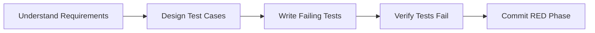
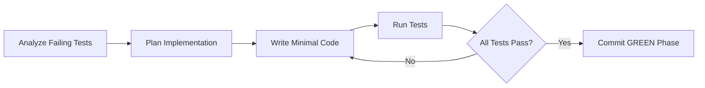
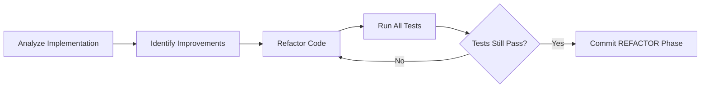

# TDD Workflow

Test-Driven Development follows the RED → GREEN → REFACTOR cycle. This workflow can be executed sequentially for single features or in parallel for multiple independent features using the parallel development system.

## TDD Overview

Test-Driven Development is a development methodology where tests are written before the implementation. This approach ensures that code is designed to meet specific requirements and provides immediate feedback about functionality.

### TDD Principles

1. **RED**: Write failing tests that define expected behavior
2. **GREEN**: Write minimal code to make tests pass
3. **REFACTOR**: Improve code quality while maintaining functionality

## TDD Workflow Modes

### Sequential TDD (Single Feature)
- Traditional TDD approach for single features
- Interactive development with immediate feedback
- Developer drives the RED → GREEN → REFACTOR cycle

### Parallel TDD (Multiple Features)  
- Uses parallel development infrastructure (see `docs/PARALLEL_DEVELOPMENT.md`)
- Multiple TDD cycles run simultaneously in isolated worktrees
- Claude orchestrates agents across multiple features
- Scales TDD methodology to handle multiple independent features

## Agent Roles in TDD

### Test Agent (RED Phase)
**Purpose**: Create comprehensive failing tests
**Specialization**: TDD mode in `test-agent.txt`

**Responsibilities**:
- Write failing tests that define expected behavior
- Ensure tests cover edge cases and error conditions
- Create tests that serve as living documentation
- Verify all tests fail meaningfully before implementation

### Implementation Agent (GREEN Phase)
**Purpose**: Write minimal code to pass tests
**Specialization**: Test-driven mode in `implementation-agent.txt`

**Responsibilities**:
- Implement minimal code to make failing tests pass
- Focus on functionality over optimization
- Ensure all tests transition from failing to passing
- Follow existing code patterns and conventions

### Review Agent (REFACTOR Phase)
**Purpose**: Improve code quality while maintaining test coverage
**Specialization**: TDD refactoring mode in `review-agent.txt`

**Responsibilities**:
- Review implementation for quality and maintainability
- Optimize code structure and performance
- Remove code duplication and improve readability
- Ensure all tests continue passing after refactoring

## TDD Phase Details

### Phase 1: RED (Write Failing Tests)



**Success Criteria**:
- All tests fail with meaningful error messages
- Tests cover happy path, edge cases, and error conditions
- Test names serve as living documentation
- Tests are isolated and independent

**Example Agent Command**:
```bash
claude -p "Create failing tests for user authentication. Write comprehensive tests for login, logout, and session management that initially fail since no implementation exists." \
  --append-system-prompt "$(cat .claude/prompts/test-agent.txt)" \
  --permission-mode bypassPermissions --output-format stream-json --verbose
```

### Phase 2: GREEN (Implement Minimal Code)



**Success Criteria**:
- All tests transition from failing to passing
- Implementation is minimal but correct
- No over-engineering or premature optimization
- Code follows project patterns and conventions

**Example Agent Command**:
```bash
claude -p "Implement minimal authentication system to make failing tests pass. Focus on core login/logout functionality without over-engineering." \
  --append-system-prompt "$(cat .claude/prompts/implementation-agent.txt)" \
  --permission-mode bypassPermissions --output-format stream-json --verbose
```

### Phase 3: REFACTOR (Improve Code Quality)



**Success Criteria**:
- All tests continue passing after refactoring
- Code quality improved (readability, performance, maintainability)  
- No functional changes to behavior
- Follows architectural patterns and conventions

**Example Agent Command**:
```bash
claude -p "Review and refactor authentication implementation while maintaining all test coverage. Improve code structure, error handling, and performance." \
  --append-system-prompt "$(cat .claude/prompts/review-agent.txt)" \
  --permission-mode bypassPermissions --output-format stream-json --verbose
```

## Sequential TDD Workflow

For single feature development:

### Step 1: Setup
```bash
# Ensure you're on the feature branch
git checkout -b feat/user-authentication
```

### Step 2: RED Phase
1. Run test agent to create failing tests
2. Verify tests fail as expected
3. Review test coverage and quality

### Step 3: GREEN Phase  
1. Run implementation agent to make tests pass
2. Verify all tests now pass
3. Ensure minimal implementation without over-engineering

### Step 4: REFACTOR Phase
1. Run review agent to improve code quality
2. Verify tests still pass after improvements
3. Ensure code follows project standards

### Step 5: Integration
1. Run full test suite to check for regressions
2. Create pull request with TDD completion evidence
3. Document TDD cycle in commit messages

## Parallel TDD Workflow

For multiple independent features, use parallel development infrastructure:

### Setup Phase
```bash
# Create worktrees for each feature
git worktree add .worktrees/authentication -b feat/user-authentication
git worktree add .worktrees/user-profile -b feat/user-profile  
git worktree add .worktrees/password-reset -b feat/password-reset
```

### RED Phase (Parallel)
Launch test agents simultaneously across all features:

```python
# Authentication feature
Bash(
    command="cd .worktrees/authentication && claude -p 'Create failing tests for user authentication system...' --append-system-prompt \"$(cat .claude/prompts/test-agent.txt)\" --permission-mode bypassPermissions --output-format stream-json --verbose",
    run_in_background=true
)

# User profile feature  
Bash(
    command="cd .worktrees/user-profile && claude -p 'Create failing tests for user profile management...' --append-system-prompt \"$(cat .claude/prompts/test-agent.txt)\" --permission-mode bypassPermissions --output-format stream-json --verbose",
    run_in_background=true
)

# Password reset feature
Bash(
    command="cd .worktrees/password-reset && claude -p 'Create failing tests for password reset flow...' --append-system-prompt \"$(cat .claude/prompts/test-agent.txt)\" --permission-mode bypassPermissions --output-format stream-json --verbose", 
    run_in_background=true
)
```

### Monitor RED Phase
```python
# Check completion of all test agents
BashOutput(bash_id="bash_5")  # authentication
BashOutput(bash_id="bash_6")  # user-profile  
BashOutput(bash_id="bash_7")  # password-reset
```

### GREEN Phase (Parallel)
Launch implementation agents after all tests are created:

```python
# Only after ALL RED phase agents complete successfully
Bash(
    command="cd .worktrees/authentication && claude -p 'Implement authentication system to make failing tests pass...' --append-system-prompt \"$(cat .claude/prompts/implementation-agent.txt)\" --permission-mode bypassPermissions --output-format stream-json --verbose",
    run_in_background=true
)

# Repeat for other features...
```

### REFACTOR Phase (Parallel)
Launch review agents after all implementations complete:

```python
# After all GREEN phase agents complete
Bash(
    command="cd .worktrees/authentication && claude -p 'Review and refactor authentication implementation...' --append-system-prompt \"$(cat .claude/prompts/review-agent.txt)\" --permission-mode bypassPermissions --output-format stream-json --verbose",
    run_in_background=true
)

# Repeat for other features...
```

## Quality Gates

### RED Phase Gates
- **All tests must fail**: Verify no false positives
- **Meaningful failures**: Tests fail for the right reasons  
- **Comprehensive coverage**: Happy path, edges cases, errors covered
- **Test isolation**: Each test can run independently

### GREEN Phase Gates
- **All tests must pass**: No failing tests remain
- **Minimal implementation**: No over-engineering or gold-plating
- **Code quality**: Follows project patterns and conventions
- **Integration**: Works with existing codebase

### REFACTOR Phase Gates
- **Tests still pass**: No functional regressions
- **Code quality improved**: More readable, maintainable, performant
- **Architecture alignment**: Follows established patterns
- **No behavioral changes**: Refactoring preserves functionality

## Pull Request Templates for TDD

### TDD Phase Completion Checklist
```markdown
## TDD Phase Completion
- ✅ RED Phase: Comprehensive failing tests created
- ✅ GREEN Phase: Implementation completed, all tests pass
- ✅ REFACTOR Phase: Code reviewed and optimized

## Test Coverage
- [ ] Happy path scenarios covered
- [ ] Edge cases and boundary conditions tested  
- [ ] Error conditions and exception handling validated
- [ ] Integration points tested

## Code Quality
- [ ] Follows project coding standards
- [ ] Proper error handling implemented
- [ ] Performance considerations addressed
- [ ] Security best practices followed
```

## TDD Benefits

### Development Benefits
- **Clear requirements**: Tests define expected behavior upfront
- **Design improvement**: Writing tests first improves API design
- **Faster debugging**: Tests pinpoint issues immediately
- **Refactoring confidence**: Tests provide safety net for changes

### Code Quality Benefits  
- **Higher test coverage**: Tests written for all functionality
- **Better architecture**: TDD encourages modular, testable design
- **Regression protection**: Tests catch breaking changes immediately
- **Living documentation**: Tests document expected behavior

### Team Benefits
- **Shared understanding**: Tests communicate requirements clearly
- **Faster onboarding**: Tests help new developers understand code
- **Quality assurance**: Built-in quality gates prevent defects
- **Parallel development**: Multiple developers can work independently

## When to Use TDD

### Ideal TDD Scenarios
- **Complex business logic**: Algorithms and calculations
- **API development**: Well-defined interfaces and contracts
- **Bug fixes**: Reproduce-then-fix approach
- **Critical functionality**: Mission-critical features need comprehensive testing
- **Refactoring**: Tests provide safety net for restructuring

### Consider Alternatives For
- **UI development**: Visual components hard to test-drive
- **Rapid prototyping**: Speed over quality in early exploration
- **Simple CRUD**: Straightforward data operations
- **External integrations**: Use mocks/stubs extensively
- **Performance optimization**: May require profiling-driven approach

## TDD Anti-Patterns to Avoid

### Test-Related Anti-Patterns
- **Testing implementation details**: Test behavior, not internal structure
- **Brittle tests**: Tests should survive refactoring
- **Slow tests**: Keep unit tests fast (< 10ms each)
- **Over-mocking**: Use real objects when practical

### Development Anti-Patterns
- **Big bang implementation**: Implement incrementally  
- **Skipping RED**: Always see tests fail first
- **Over-engineering in GREEN**: Write minimal code first
- **Skipping REFACTOR**: Code quality improvement is essential

### Process Anti-Patterns
- **No test review**: Tests need review like production code
- **Ignoring test failures**: All tests must pass before proceeding
- **Testing after implementation**: Tests written after lose TDD benefits

## Integration with Parallel Development

TDD integrates seamlessly with parallel development:

1. **Use parallel development** when you have multiple independent features
2. **Choose TDD workflow** when test-first development provides value
3. **Combine both** for comprehensive feature development at scale
4. **Monitor progress** through both TDD phase completion and parallel agent status

This approach scales TDD methodology from single features to multiple parallel development streams while maintaining the quality and design benefits of test-driven development.