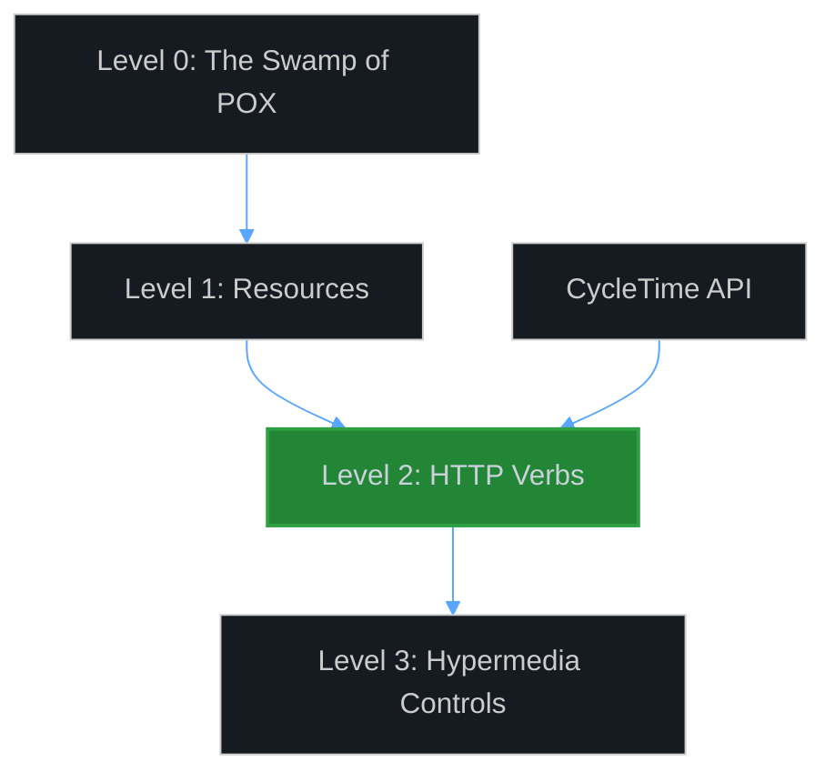
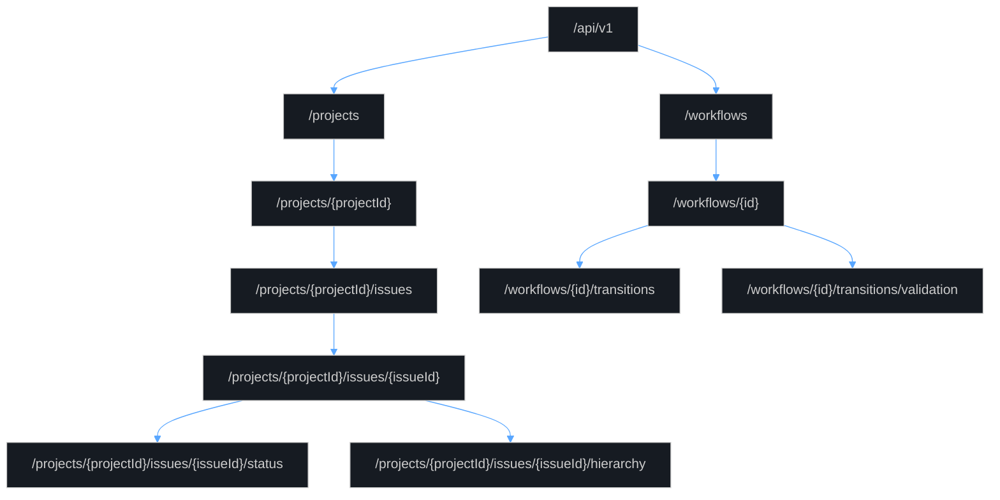
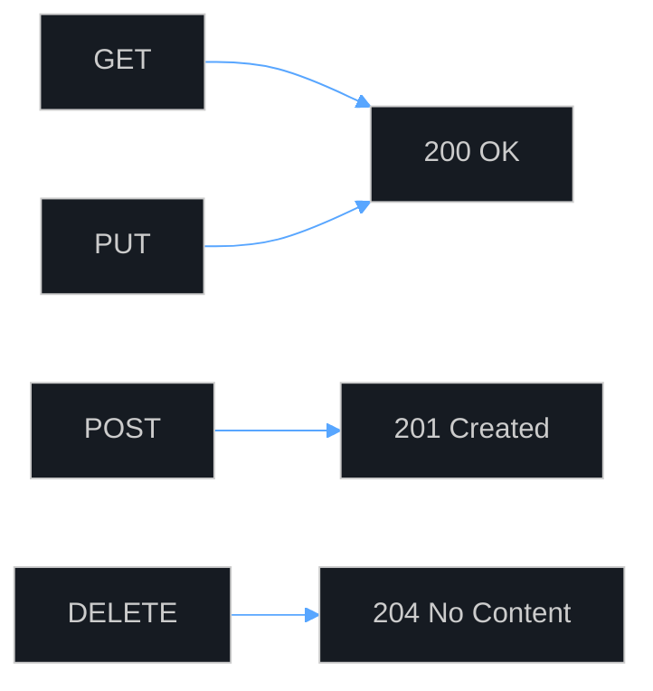
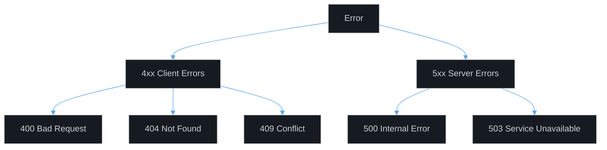
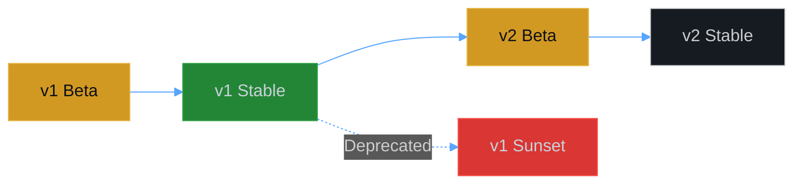
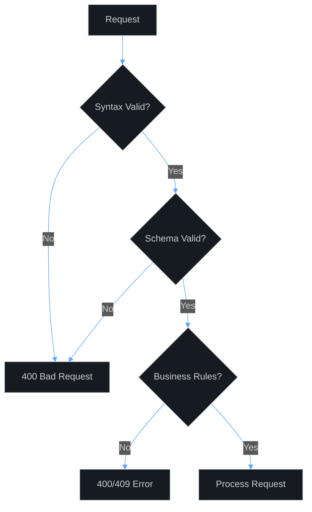
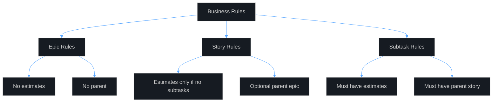
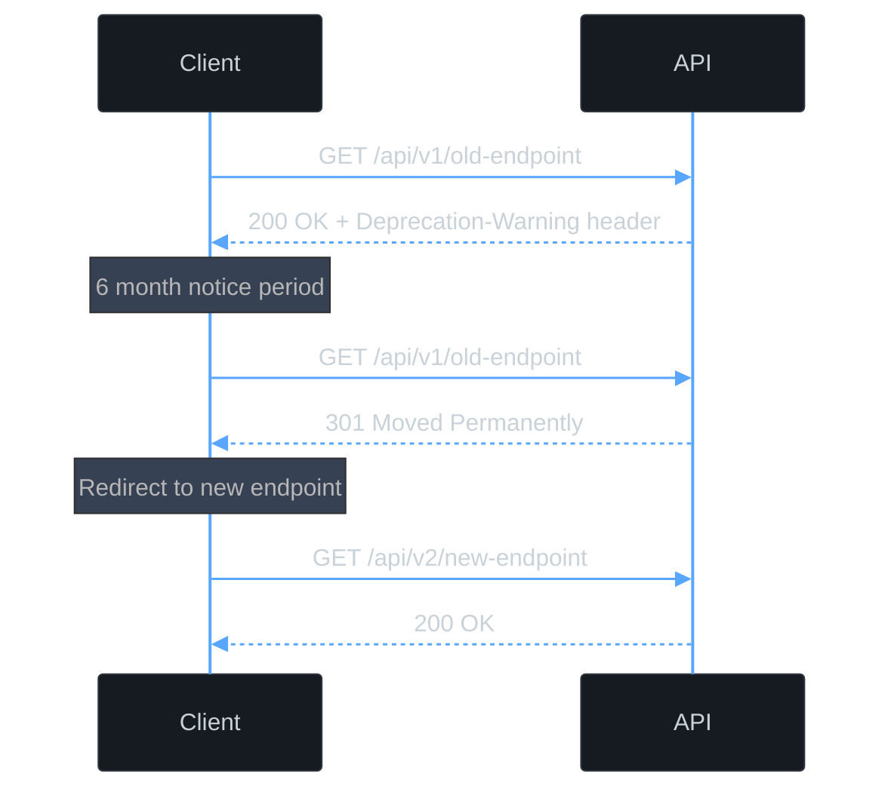

# API Best Practices Guide

## Overview

This guide documents the RESTful design principles and best practices used in the CycleTime CE API. It serves as both a reference for API consumers and a guide for contributors extending the API.

## REST Maturity Model

The CycleTime API implements **Richardson Maturity Model Level 2** through the following design choices:



### Level 2 Implementation
- **Resource-Based URLs**: `/api/v1/projects/{id}/issues`
- **HTTP Verbs**: GET, POST, PUT, DELETE with proper semantics
- **Status Codes**: Meaningful HTTP status codes for all responses (200, 201, 204, 400, 404, 500)
- **Stateless Operations**: Each request is self-contained

### Future Level 3 Considerations
- HATEOAS links for resource navigation
- Self-describing API with embedded actions
- Currently not implemented but architecture supports future addition

## Resource Hierarchy

### Nested Resource Design

Resources are organized in a logical hierarchy reflecting real-world relationships:



### Design Rationale

**Why Nested Resources?**
1. **Context Enforcement**: Issues must belong to a project
2. **Authorization Path**: Future auth can leverage path hierarchy
3. **Logical Grouping**: Clear parent-child relationships
4. **RESTful Navigation**: URLs reflect domain structure

**Example**: Creating an issue requires project context:
```
POST /api/v1/projects/550e8400-e29b-41d4-a716-446655440001/issues
```
Not:
```
POST /api/v1/issues?projectId=550e8400-e29b-41d4-a716-446655440001
```

## HTTP Methods Usage

### Method Semantics

| Method | Usage | Idempotent | Safe | Request Body | Response Body |
|--------|-------|------------|------|--------------|---------------|
| GET | Retrieve resources | Yes | Yes | No | Yes |
| POST | Create resources | No | No | Yes | Yes |
| PUT | Full/partial update | Yes | No | Yes | Yes |
| DELETE | Remove resources | Yes | No | No | No |

### Idempotency Patterns

**DELETE Operations**:
```http
DELETE /api/v1/projects/{id}
```
- Returns `204` even if resource doesn't exist
- Multiple calls have same effect as single call
- Prevents client retry issues

**PUT Operations**:
```http
PUT /api/v1/projects/{id}
{
  "name": "Updated Name"
}
```
- Partial updates supported (null fields ignored)
- Same request produces same result
- Version conflicts handled via business rules

## Status Code Guidelines

### Success Codes



| Code | When to Use | Response Body |
|------|-------------|---------------|
| 200 OK | Successful GET, PUT | Resource data |
| 201 Created | Successful POST | Created resource |
| 204 No Content | Successful DELETE | Empty |

### Error Codes



| Code | Meaning | Example Scenario |
|------|---------|-----------------|
| 400 | Invalid request | Validation failure, malformed JSON |
| 404 | Resource not found | Invalid ID, wrong context |
| 409 | Conflict | Business rule violation |
| 500 | Server error | Unexpected exception |
| 503 | Service unavailable | Database down |

### Error Response Structure

Consistent error format across all endpoints:

```json
{
  "error": "Brief error message",
  "details": "Detailed explanation or validation details",
  "timestamp": "2024-01-01T00:00:00Z"
}
```

## URL Design Patterns

### Resource Naming Conventions

**Use Nouns, Not Verbs**:
- ✅ `/api/v1/projects`
- ❌ `/api/v1/getProjects`

**Plural Resource Names**:
- ✅ `/api/v1/projects` (even for single resource)
- ❌ `/api/v1/project`

**Hierarchical Relationships**:
- ✅ `/api/v1/projects/{projectId}/issues`
- ❌ `/api/v1/issues?projectId={projectId}`

### Query Parameters vs Path Parameters

**Path Parameters**: Resource identification
```
GET /api/v1/projects/{projectId}/issues/{issueId}
```

**Query Parameters**: Resource filtering/options
```
POST /api/v1/workflows?template=default
GET /api/v1/issues?status=IN_PROGRESS&assignee=john (future)
```

### Resource Actions

For operations that don't fit CRUD, use resource-based sub-resources:

**Status Transitions** (Resource-based):
```
POST /api/v1/projects/{projectId}/issues/{issueId}/status
```
Not:
```
POST /api/v1/projects/{projectId}/issues/{issueId}/transition-status
```

**Validation** (Resource-based):
```
POST /api/v1/workflows/{id}/transitions/validation
```
Not:
```
POST /api/v1/workflows/{id}/validate-transition
```

## Versioning Strategy

### URL Path Versioning

All API endpoints include version in the path:
```
/api/v1/projects
/api/v1/workflows
```

### Version Lifecycle



**Versioning Rules**:
1. Major versions for breaking changes
2. New versions run parallel during transition
3. Deprecation notices at least 6 months before sunset
4. Clear migration guides for version transitions

### Backward Compatibility

**Compatible Changes** (No version bump):
- Adding new endpoints
- Adding optional request fields
- Adding response fields
- Adding new enum values

**Breaking Changes** (Requires new version):
- Removing/renaming endpoints
- Changing required fields
- Modifying response structure
- Removing enum values

## Request/Response Design

### Request Validation

**Validation Layers**:



**Validation Order**:
1. **Syntax**: Valid JSON structure
2. **Schema**: Required fields, types, formats
3. **Business**: Domain rules, relationships

### Partial Updates

PUT operations support partial updates:

```json
// Only update provided fields
PUT /api/v1/projects/{id}
{
  "name": "New Name"
  // description remains unchanged
}
```

**Implementation Pattern**:
- Null values are ignored (not set to null)
- Explicit empty strings clear text fields
- At least one field must be provided

### Response Consistency

**Collection Responses**:
```json
{
  "items": [...],      // Consistent field name
  "totalCount": 42     // Always include count
}
```

**Single Resource**:
```json
{
  "id": "...",         // Always include ID
  "createdAt": "...",  // Timestamps for audit
  "updatedAt": "..."   // Track modifications
}
```

## Business Rule Enforcement

### Hierarchy Rules



### Validation Examples

**Epic Creation** (No estimate allowed):
```json
POST /api/v1/projects/{projectId}/issues
{
  "title": "Authentication System",
  "type": "EPIC",
  "estimate": 5  // ❌ Returns 400: Epics cannot have estimates
}
```

**Subtask Creation** (Parent required):
```json
POST /api/v1/projects/{projectId}/issues
{
  "title": "Setup OAuth",
  "type": "SUBTASK"  // ❌ Returns 400: Subtask requires parentId
}
```

## Performance Considerations

### Response Size Management

**Current State**:
- Full resource serialization
- No pagination (planned feature)
- Embedded related resources

**Future Optimizations**:
```http
GET /api/v1/projects/{id}/issues?fields=id,title,status
GET /api/v1/projects?page=1&size=20
```

### Caching Headers (Future)

Planned cache control implementation:
```http
HTTP/1.1 200 OK
Cache-Control: max-age=300
ETag: "33a64df551425fcc55e4d42a148795d9f25f89d4"
Last-Modified: Wed, 21 Oct 2024 07:28:00 GMT
```

## Security Patterns (Future)

### Authentication
```http
Authorization: Bearer <token>
```

### Rate Limiting
```http
X-RateLimit-Limit: 1000
X-RateLimit-Remaining: 999
X-RateLimit-Reset: 1609459200
```

### CORS Headers
```http
Access-Control-Allow-Origin: *
Access-Control-Allow-Methods: GET, POST, PUT, DELETE
Access-Control-Allow-Headers: Content-Type, Authorization
```

## API Evolution Guidelines

### Adding Features

**New Endpoints**: Add under existing version
```
/api/v1/projects/{id}/archive  // New in v1.1
```

**New Fields**: Add as optional
```json
{
  "id": "...",
  "name": "...",
  "tags": ["new", "optional"]  // Added in v1.1
}
```

### Deprecation Process



**Deprecation Headers**:
```http
Deprecation-Warning: This endpoint is deprecated
Sunset: Sat, 31 Dec 2024 23:59:59 GMT
Link: </api/v2/new-endpoint>; rel="successor-version"
```

## Testing API Integrations

### Integration Test Pattern

```bash
# 1. Create test project
PROJECT_ID=$(curl -X POST http://localhost:8080/api/v1/projects \
  -H "Content-Type: application/json" \
  -d '{"name": "Test Project"}' \
  | jq -r '.id')

# 2. Create test issue
ISSUE_ID=$(curl -X POST http://localhost:8080/api/v1/projects/$PROJECT_ID/issues \
  -H "Content-Type: application/json" \
  -d '{"title": "Test Issue", "type": "STORY"}' \
  | jq -r '.id')

# 3. Verify creation
curl http://localhost:8080/api/v1/projects/$PROJECT_ID/issues/$ISSUE_ID

# 4. Cleanup
curl -X DELETE http://localhost:8080/api/v1/projects/$PROJECT_ID/issues/$ISSUE_ID
curl -X DELETE http://localhost:8080/api/v1/projects/$PROJECT_ID
```

### Error Handling Tests

Always test error scenarios:
- Invalid JSON syntax
- Missing required fields
- Business rule violations
- Non-existent resources
- Invalid state transitions

## Common Anti-Patterns to Avoid

### ❌ Action-Based URLs
```
POST /api/v1/issues/create
POST /api/v1/issues/update
POST /api/v1/issues/delete
```

### ❌ Success/Failure in Response Body
```json
{
  "success": false,
  "error": "Not found"  // Use HTTP 404 instead
}
```

### ❌ Nested Response Wrapping
```json
{
  "data": {
    "result": {
      "project": { ... }  // Too much nesting
    }
  }
}
```

### ❌ Inconsistent Naming
```
/api/v1/getProjects     // Verb in URL
/api/v1/project-list    // Inconsistent style
/api/v1/PROJECTS        // Wrong case
```

## Monitoring and Observability

### Key Metrics

Track these API metrics:
- Request rate by endpoint
- Response time percentiles (p50, p95, p99)
- Error rate by status code
- Payload sizes
- Active connections

### Health Check Integration

The `/health` endpoint provides:
- Service dependencies status
- Performance metrics
- Database connectivity
- MCP integration status (if enabled)

Use this for:
- Load balancer health checks
- Monitoring alerts
- Deployment verification
- Debugging connectivity issues

## Migration Patterns

### From Legacy to v1

**Step 1**: Parallel Implementation
```kotlin
// Support both during transition
val projectUrl = if (useV1) {
    "/api/v1/projects"
} else {
    "/api/projects"
}
```

**Step 2**: Gradual Migration
```kotlin
// Migrate endpoint by endpoint
suspend fun getProject(id: String): Response {
    return try {
        client.get("/api/v1/projects/$id")
    } catch (e: Exception) {
        // Fallback to legacy
        client.get("/api/projects/$id")
    }
}
```

**Step 3**: Clean Cutover
```kotlin
// Remove legacy support
val baseUrl = "/api/v1"
```

## API Client Best Practices

### Retry Logic

```kotlin
suspend fun apiCall(url: String, options: RequestOptions, maxRetries: Int = 3): HttpResponse {
    repeat(maxRetries) { i ->
        try {
            val response = client.request(url) {
                // Apply options
            }

            // Don't retry client errors
            if (response.status.value in 400..499) {
                error("Client error: ${response.status.value}")
            }

            // Retry server errors
            if (response.status.value >= 500) {
                if (i == maxRetries - 1) error("Server error")
                delay(2.0.pow(i).toLong() * 1000) // Exponential backoff
                return@repeat
            }

            return response
        } catch (error: Exception) {
            if (i == maxRetries - 1) throw error
        }
    }
    error("Max retries exceeded")
}
```

### Error Handling

```kotlin
suspend fun handleApiResponse(response: HttpResponse): ApiResult {
    if (!response.status.isSuccess()) {
        val error = response.body<ErrorResponse>()
        throw ApiError(
            status = response.status.value,
            error = error.error,
            details = error.details
        )
    }
    return response.body()
}
```

## Summary

The CycleTime CE API follows REST Level 2 principles to provide a clean, consistent, and predictable interface. Key principles:

1. **Resource-Oriented**: URLs represent resources, not actions
2. **HTTP Semantics**: Proper use of methods and status codes
3. **Hierarchical Structure**: Nested resources reflect domain relationships
4. **Consistent Patterns**: Uniform error handling and response formats
5. **Evolution-Ready**: Versioning strategy supports backward compatibility

Following these best practices ensures the API remains maintainable, extensible, and pleasant to use for both consumers and contributors.