# CycleTime Data Flow Mapping

## Overview

This document provides a comprehensive mapping of data flows throughout the CycleTime system, showing how all 15 services interact through request-response patterns and event-driven architecture. This serves as the authoritative reference for service contract definitions and parallel development coordination.

## Service Interaction Matrix

### 15 Services Overview

| Service | Type | Status | Primary Function |
|---------|------|--------|------------------|
| API Gateway | Infrastructure | ✅ Implemented | Request routing, authentication, rate limiting |
| Web Dashboard | UI | ✅ Implemented | React interface for project management |
| AI Orchestration Service | Core | ✅ Implemented | Multi-provider AI routing and optimization |
| Context Management Service | Core | ⚠️ Contract Needed | AI context window optimization |
| Document Indexing Service | Core | ⚠️ Contract Needed | Vector-based semantic search |
| Contract Generation Engine | Core | ⚠️ Contract Needed | API specifications and system boundaries |
| Standards Engine | Core | ❌ Missing | Custom development standards enforcement |
| Project Service | Core | ✅ Implemented | Project lifecycle management (needs HTTP APIs) |
| Documentation Service | Core | ✅ Implemented | Markdown processing and templates |
| Task Breakdown Service | Core | ✅ Implemented | AI-assisted task analysis |
| Notification Service | Integration | ❌ Missing | Multi-channel alert delivery |
| Git Integration Service | Integration | ✅ Implemented | Repository operations and webhooks |
| Issue Tracker Service | Integration | ✅ Implemented | Linear/GitHub/Jira synchronization |
| MCP Server | Integration | ❌ Missing | AI assistant integration |
| CLI Tool | Interface | ❌ Missing | Command-line project management |

## Core Data Flow Patterns

### 1. Request-Response Flows (Synchronous)

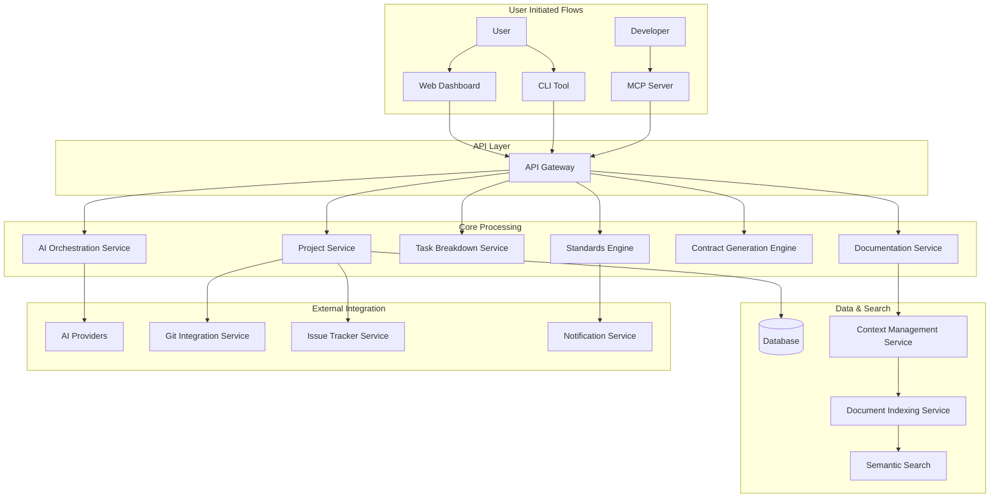

### 2. Event-Driven Flows (Asynchronous)

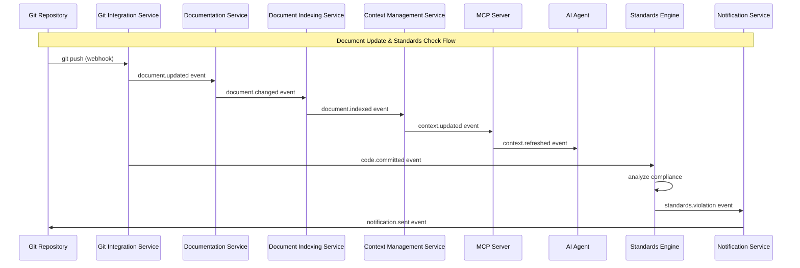

### 3. Contract-First Development Flow

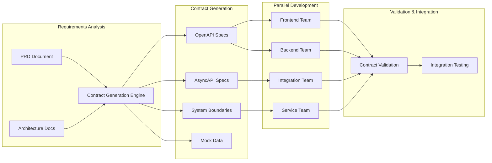

## Service-Specific Data Flow Patterns

### Context Management Service Data Flow

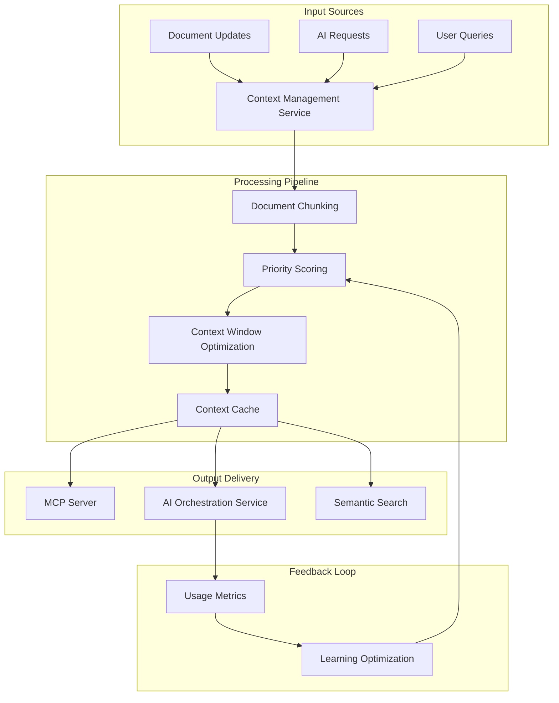

### Standards Engine Data Flow

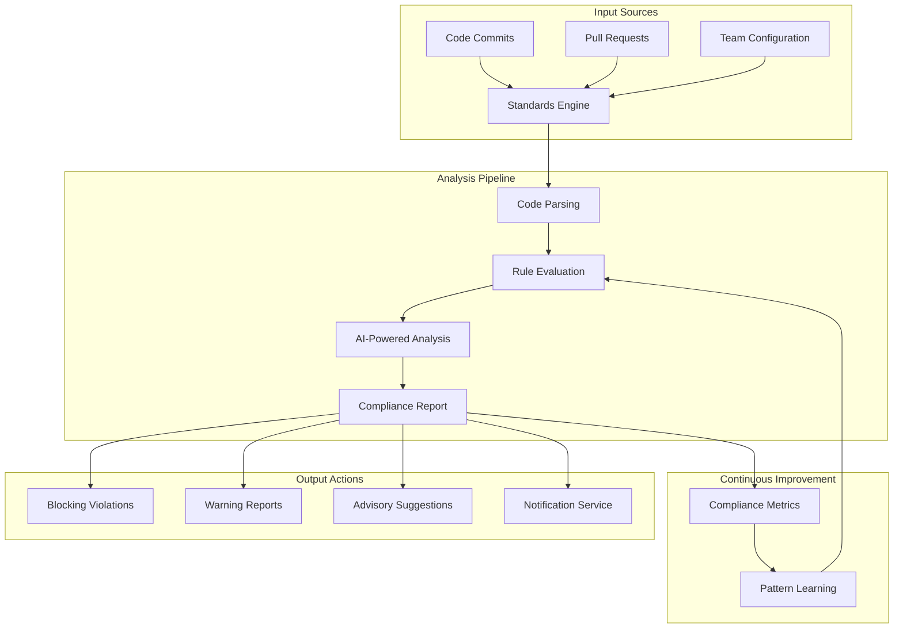

### MCP Server Data Flow

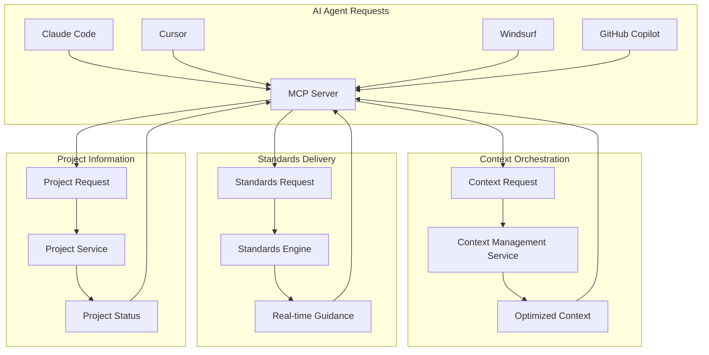

### Notification Service Data Flow

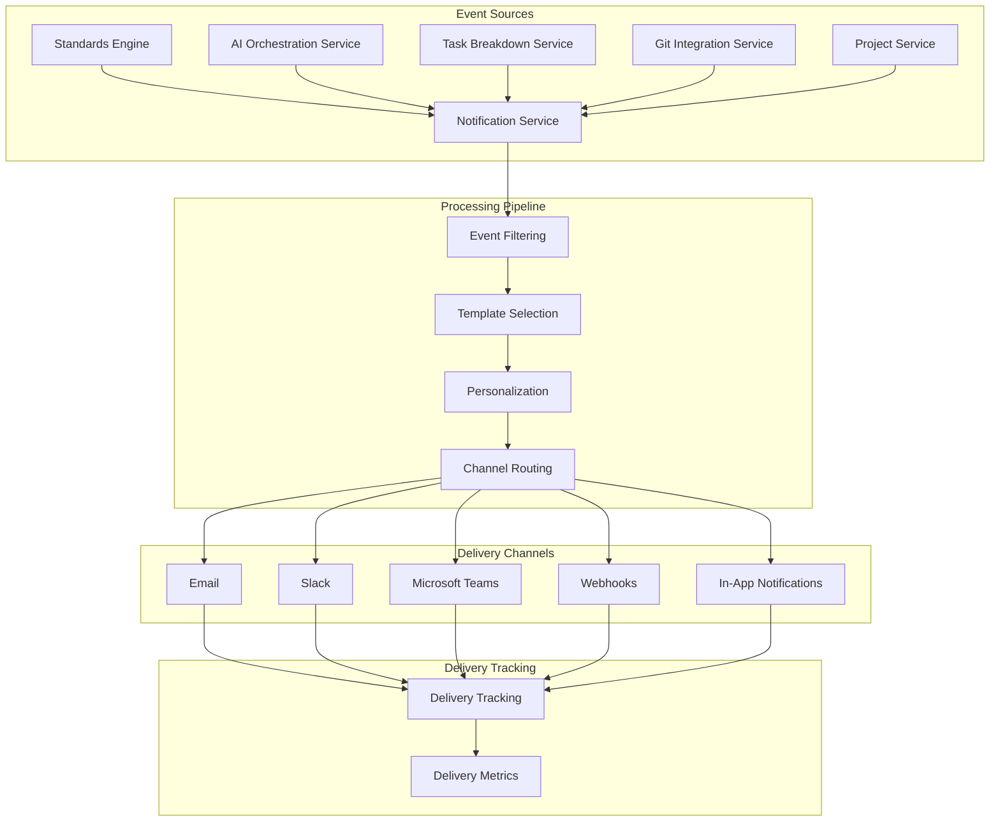

## Cross-Service Event Chains

### 1. Document Update Chain

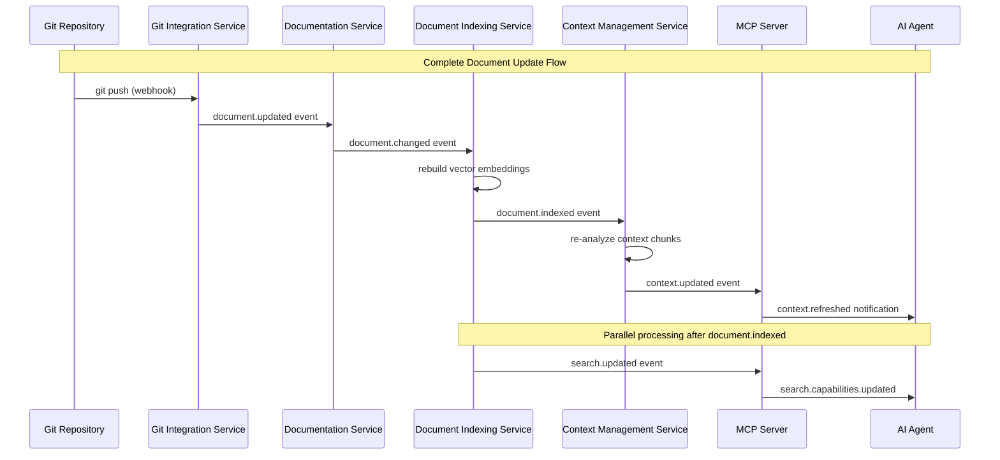

### 2. Standards Enforcement Chain

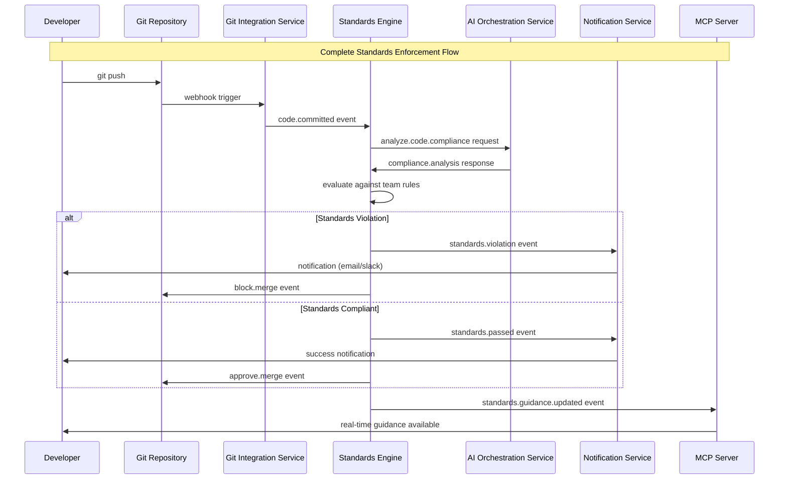

### 3. AI Context Optimization Chain

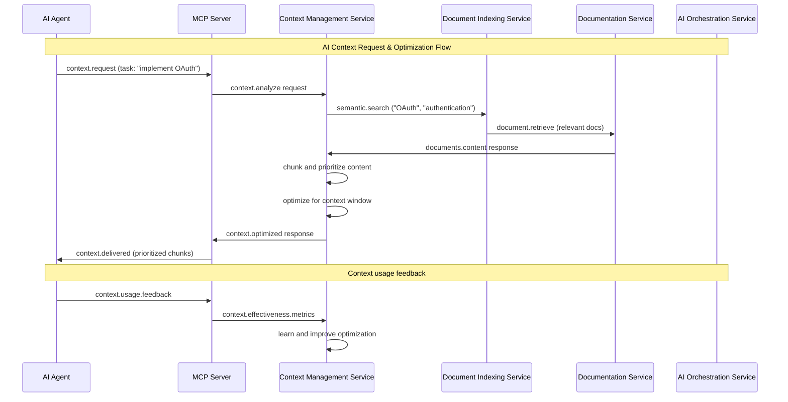

### 4. Contract Compliance Chain

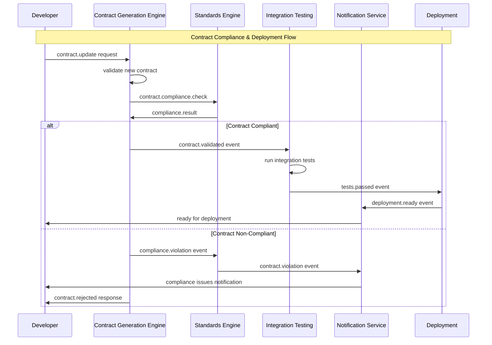

## API Contract Relationships

### HTTP API Dependencies

```yaml
# Service → Dependencies (HTTP calls)
API Gateway:
  - Authentication Service
  - All Core Services (routing)

Web Dashboard:
  - API Gateway (all requests)
  - Project Service (via API Gateway)
  - Documentation Service (via API Gateway)

CLI Tool:
  - API Gateway (all requests)
  - Project Service (via API Gateway)
  - Git Integration Service (via API Gateway)

MCP Server:
  - Context Management Service (direct)
  - Standards Engine (direct)
  - Project Service (direct)
  - Document Indexing Service (direct)

Contract Generation Engine:
  - AI Orchestration Service (analysis)
  - Documentation Service (template generation)
  - Standards Engine (compliance validation)

Context Management Service:
  - Document Indexing Service (semantic search)
  - Documentation Service (content retrieval)
  - AI Orchestration Service (analysis)

Standards Engine:
  - AI Orchestration Service (code analysis)
  - Git Integration Service (code retrieval)
  - Notification Service (alerts)

Project Service:
  - Git Integration Service (repository operations)
  - Issue Tracker Service (synchronization)
  - Notification Service (status updates)

Task Breakdown Service:
  - AI Orchestration Service (analysis)
  - Context Management Service (requirements context)
  - Standards Engine (complexity assessment)

Notification Service:
  - External APIs (email, Slack, Teams)
  - Configuration Service (preferences)
```

### Event-Driven Dependencies

```yaml
# Service → Published Events
Git Integration Service:
  - document.updated
  - code.committed
  - repository.changed
  - webhook.received

Documentation Service:
  - document.created
  - document.modified
  - document.deleted
  - template.applied

Document Indexing Service:
  - document.indexed
  - search.updated
  - embeddings.generated
  - index.optimized

Context Management Service:
  - context.analyzed
  - context.optimized
  - context.delivered
  - context.usage.tracked

Standards Engine:
  - standards.analyzed
  - compliance.violation
  - compliance.passed
  - standards.updated

AI Orchestration Service:
  - ai.request.started
  - ai.request.completed
  - ai.request.failed
  - ai.usage.tracked

Project Service:
  - project.created
  - project.updated
  - project.completed
  - milestone.reached

Task Breakdown Service:
  - task.analyzed
  - task.estimated
  - task.dependencies.mapped
  - breakdown.completed

Notification Service:
  - notification.sent
  - notification.delivered
  - notification.failed
  - notification.preferences.updated

MCP Server:
  - mcp.session.started
  - mcp.context.delivered
  - mcp.standards.delivered
  - mcp.session.ended

Contract Generation Engine:
  - contract.generated
  - contract.validated
  - contract.published
  - contract.version.updated

CLI Tool:
  - cli.command.executed
  - cli.project.initialized
  - cli.error.occurred
  - cli.status.requested
```

## Data Transformation Paths

### User Input to System Output

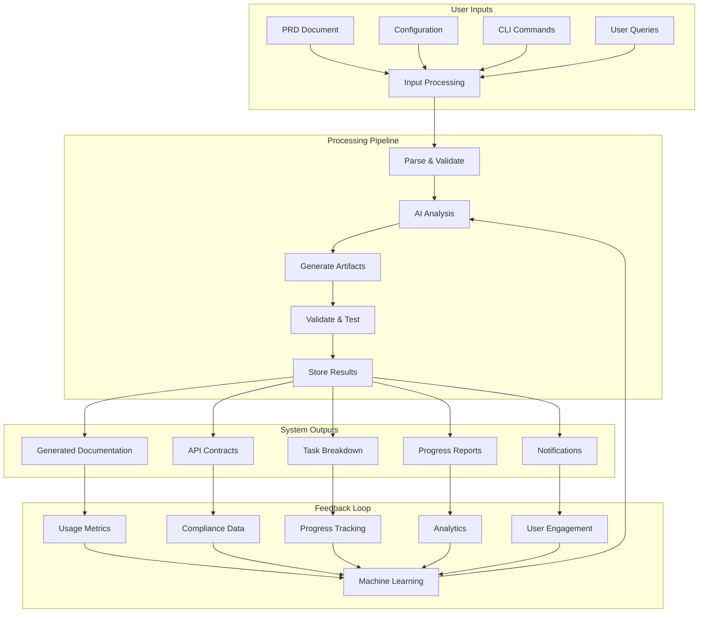

### Error Propagation and Recovery

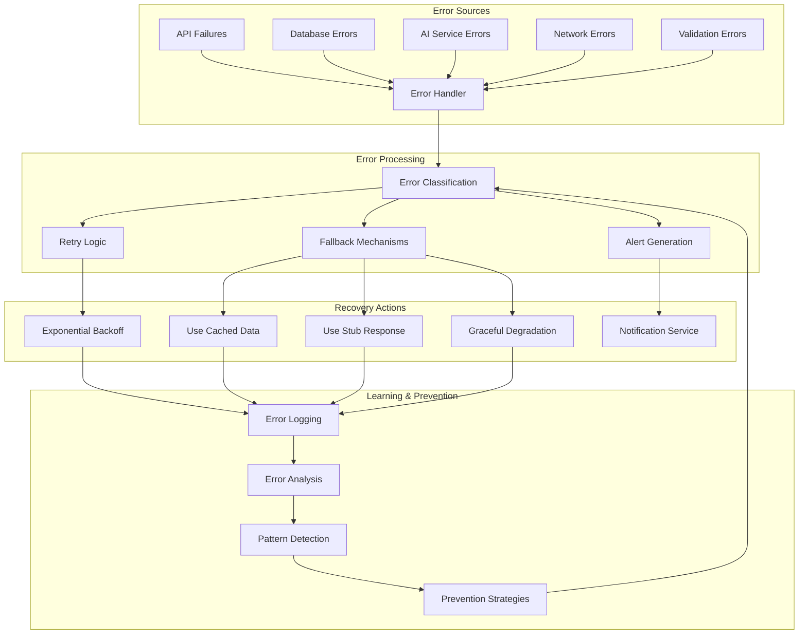

## Performance and Scalability Considerations

### Request Flow Optimization

```yaml
# Critical Path Analysis
High Priority Flows:
  - User → API Gateway → Project Service → Response (< 1 second)
  - AI Agent → MCP Server → Context Management → Response (< 5 seconds)
  - Code Commit → Standards Engine → Analysis → Notification (< 30 seconds)

Medium Priority Flows:
  - Document Update → Indexing → Context Update (< 2 minutes)
  - Contract Generation → Validation → Publishing (< 5 minutes)
  - Task Breakdown → Analysis → Issue Creation (< 10 minutes)

Background Flows:
  - Analytics Processing (< 1 hour)
  - Report Generation (< 4 hours)
  - Learning Model Updates (< 24 hours)
```

### Data Volume Planning

```yaml
# Expected Data Volumes
Documents:
  - Small Projects: 10-50 documents, 1-5 MB total
  - Medium Projects: 50-200 documents, 5-50 MB total
  - Large Projects: 200-1000 documents, 50-500 MB total

API Requests:
  - Development Phase: 100-500 requests/day
  - Active Development: 1000-5000 requests/day
  - Enterprise Usage: 10000+ requests/day

Event Volume:
  - Code Commits: 10-100 events/day
  - Document Updates: 5-50 events/day
  - AI Requests: 50-500 events/day
  - Notifications: 20-200 events/day
```

## Security and Compliance Data Flow

### Authentication and Authorization Flow

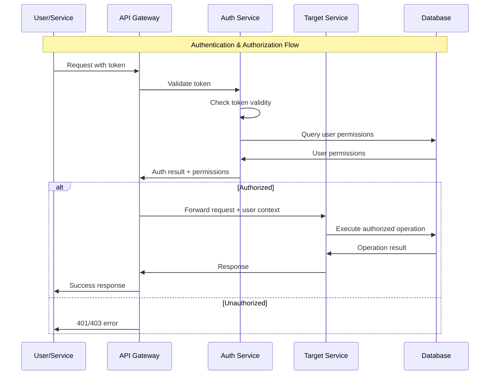

### Data Privacy and Compliance

```yaml
# Data Classification
Public Data:
  - API documentation
  - Public repositories
  - Open source contracts

Internal Data:
  - Project documentation
  - Team configurations
  - Usage analytics

Sensitive Data:
  - API keys and secrets
  - User authentication tokens
  - Private repository content
  - Proprietary code analysis

# Compliance Requirements
- GDPR: User data handling, right to deletion
- SOC 2: Security controls, audit logging
- Enterprise: Data residency, encryption at rest/transit
```

## Conclusion

This comprehensive data flow mapping serves as the foundation for all service contract definitions in the SPI-81 epic. Each service contract must align with these established patterns to ensure seamless integration and optimal system performance.

The documented flows enable:
- **Parallel Development**: Clear service boundaries and contracts
- **Integration Confidence**: Well-defined APIs and event schemas
- **Performance Optimization**: Understanding of critical paths and bottlenecks
- **Error Handling**: Comprehensive error propagation and recovery strategies
- **Security Compliance**: Proper authentication and data protection flows

All subsequent service contract tickets should reference this document to ensure consistency and completeness in the CycleTime system architecture.