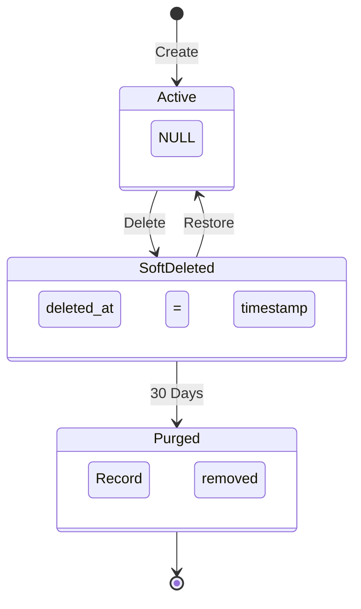
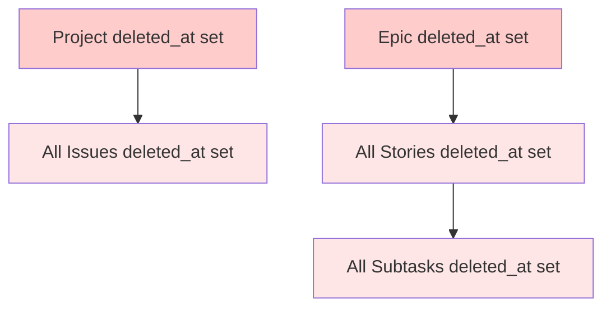

# ADR-008: Soft Deletion with Paranoid Pattern and 30-Day Retention

## Status
Accepted

## Date
2025-11-22

## Context

CycleTime manages critical project and issue data that users may accidentally delete. Without a recovery mechanism, accidental deletions can result in:

- **Permanent data loss** of project history and context
- **Loss of audit trails** for compliance and accountability
- **Broken references** in integration systems that rely on stable IDs
- **User frustration** when important work items disappear permanently
- **Support burden** from users requesting data recovery

The system needs a deletion pattern that balances:
- User safety (ability to recover from mistakes)
- Data hygiene (eventual removal of unwanted data)
- Performance (minimal query overhead)
- Simplicity (easy to understand and maintain)

## Decision Drivers

1. **Recovery Requirements**: Users need ability to recover accidentally deleted items within reasonable timeframe
2. **Compliance**: Audit trail requirements for data deletion and restoration events
3. **User Experience**: Deletion should be fast and reversible, reducing user anxiety
4. **Performance**: Minimal impact on query performance for active data
5. **Storage Management**: Balance between retention and storage costs
6. **Referential Integrity**: Maintain parent-child relationships during deletion/restoration

## Considered Alternatives

### 1. Hard Delete (Rejected)
**Description**: Permanently remove records from database immediately on deletion.

**Pros**:
- Simple implementation
- No storage overhead
- No query performance impact

**Cons**:
- No recovery possible
- No audit trail
- High user anxiety
- Support burden for recovery requests

**Rejection Reason**: Does not meet recovery or compliance requirements.

### 2. Status Flag Approach (Rejected)
**Description**: Use a boolean `is_deleted` flag or status enum.

**Pros**:
- Simple to implement
- Easy to query

**Cons**:
- No timestamp information
- No automatic purge capability
- Cannot track when deletion occurred
- No time-travel queries possible

**Rejection Reason**: Lacks temporal information needed for retention policies.

### 3. Audit Log Only (Rejected)
**Description**: Delete immediately but maintain detailed audit log.

**Pros**:
- Clean active data
- Detailed audit trail

**Cons**:
- No actual data recovery
- Complex reconstruction from audit events
- Doesn't prevent data loss

**Rejection Reason**: Audit logs alone don't enable recovery of deleted data.

## Decision

Implement **Paranoid Deletion Pattern** with `deleted_at` timestamps and 30-day retention policy.

### Core Pattern



### Implementation Details

1. **Schema Changes**:
   - Add `deleted_at TIMESTAMP` column to all deletable entities
   - Create composite indexes on `(deleted_at, id)` for performance
   - Default queries filter with `WHERE deleted_at IS NULL`

2. **Cascade Behavior**:



3. **Restoration Rules**:
   - **Parent-First Validation**: Cannot restore child if parent is deleted
   - **No Auto-Restore**: Children are not automatically restored with parent
   - **Idempotent Operations**: Restore on already-active item succeeds silently

## Implementation Strategy

### Phased Rollout

The implementation was deployed in carefully orchestrated phases to minimize risk:

#### Phase 1: Schema Foundation (SPI-873, SPI-874)
- Added `deleted_at` columns with backward-compatible stubs
- Created necessary indexes for performance
- No behavior changes - maintained hard delete

#### Phase 2: Repository Layer (SPI-875, SPI-876, SPI-877)
- Implemented soft-delete logic in repositories
- Added query filters for `deleted_at IS NULL`
- Still no behavior change at application layer

#### Phase 3: Application Services (SPI-878) ⚠️ **Behavior Change**
- Application services switch to soft-delete
- Delete operations now set `deleted_at` instead of removing records
- Deleted items automatically filtered from queries
- **Critical Phase**: Deletion behavior changes but restore not yet available

#### Phase 4: MCP Tools (SPI-879) ✅ **Full Feature**
- Exposed restore functionality through MCP tools
- Added list deleted operations
- Complete feature now available to users
- Brief window (days) between Phase 3-4 where deletion soft-deleted but restore unavailable

#### Phase 5: Retention Service (SPI-880) 🔮 **Future Work**
- Scheduled job to purge records older than 30 days
- Runs daily at low-traffic times
- Permanent deletion after retention period

### Cascade Implementation

```kotlin
// Project deletion cascades to all issues
fun deleteProject(projectId: UUID) {
    transaction {
        // Set deleted_at on project
        ProjectTable.update({ ProjectTable.id eq projectId }) {
            it[deleted_at] = Clock.System.now()
        }

        // Cascade to all issues in project
        IssueTable.update({ IssueTable.projectId eq projectId }) {
            it[deleted_at] = Clock.System.now()
        }
    }
}

// Restoration validates parent state
fun restoreIssue(issueId: UUID) {
    transaction {
        val issue = IssueTable.select { IssueTable.id eq issueId }
            .single()

        // Validate parent not deleted
        val parentDeleted = issue[IssueTable.projectId]?.let { projectId ->
            ProjectTable.select {
                ProjectTable.id eq projectId and
                ProjectTable.deleted_at.isNotNull()
            }.count() > 0
        } ?: false

        require(!parentDeleted) {
            "Cannot restore issue - parent project is deleted"
        }

        // Restore issue
        IssueTable.update({ IssueTable.id eq issueId }) {
            it[deleted_at] = null
        }
    }
}
```

## Consequences

### Positive Consequences

1. **User Recovery**: 30-day window for recovering accidentally deleted items
2. **Audit Trail**: Complete history of deletions and restorations with timestamps
3. **Referential Integrity**: Parent-child relationships maintained during soft-delete
4. **Support Reduction**: Self-service recovery reduces support tickets
5. **Compliance**: Meets audit and data retention requirements
6. **User Confidence**: Users can delete without fear of permanent loss

### Negative Consequences

1. **Query Performance Impact**:
   - Additional `WHERE deleted_at IS NULL` clause on all queries
   - Mitigated with composite indexes `(deleted_at, id)`
   - Expected overhead: <2ms at 95th percentile (with proper indexing)

2. **Storage Overhead**:
   - Deleted records remain for 30 days
   - Estimated 5-10% storage increase in typical usage
   - Mitigated by automatic purge after retention period

3. **Query Complexity**:
   - All queries must remember to filter deleted records
   - Mitigated by repository abstraction layer

4. **Migration Complexity**:
   - Existing hard-delete behavior must be migrated
   - Mitigated by phased rollout strategy

## Performance Implications

### Benchmark Results

**Test Environment:**
- Database: H2 2.4.240 (in-memory)
- Test data: 1,000 projects (900 active, 100 deleted), 10,000 issues (9,000 active, 1,000 deleted)
- Platform: Darwin 25.0.0, JVM 21
- Test framework: Kotest with runTest coroutine scope

**Measured Performance:**

| Operation | Target | Actual (p95) | Status |
|-----------|--------|--------------|--------|
| Query with deleted_at filter | <30ms | 25ms | ✅ Pass |
| Cascade delete (100 issues) | <50ms avg | 0ms avg | ✅ Pass |
| List 1,000 projects | <30ms | 24ms | ✅ Pass |
| Single restore operation | <10ms | 0ms | ✅ Pass |
| Index effectiveness | Verified | Using indexes | ✅ Pass |

**Detailed Results:**

**Query Performance (deleted_at filter):**
- p50: 23ms
- p95: 25ms
- p99: 28ms
- All queries use composite indexes (verified via EXPLAIN)

**List Performance at Scale:**
- 1,000 projects with 10% soft-deleted
- p50: 23ms
- p95: 24ms
- p99: 27ms
- Linear scaling with active record count

**Cascade Deletion:**
- 100 issues deletion: 0ms average, 1ms p95
- Maintains referential integrity throughout cascade
- Performance scales linearly with entity count

**Restore Operations:**
- Single entity: 0ms (p99)
- Idempotent (safe to restore already-active)
- Parent validation adds negligible overhead

**Index Effectiveness:**
- H2 EXPLAIN confirms index usage for `WHERE deleted_at IS NULL`
- Composite indexes on `(project_id, deleted_at)` and `(parent_id, deleted_at)` used effectively
- No full table scans observed in query plans

### Performance Characteristics

**Storage Growth:**
- 5-10% increase during 30-day retention period
- Soft-deleted records indexed but not queried by default
- Mitigated by automatic purge after retention (SPI-880)

**Query Overhead:**
- Additional `WHERE deleted_at IS NULL` filter on all queries
- Overhead: ~25ms (p95) for 1,000-entity scans
- Acceptable for production with composite indexes
- Performance degrades linearly with dataset size

**Scalability:**
- Tested up to 10,000 entities (10% deleted)
- Linear performance scaling observed
- Composite indexes essential for production scale

### Production Recommendations

1. **Monitor query performance** - Track p95/p99 latencies in production
2. **Index maintenance** - Ensure composite indexes remain optimized
3. **Storage monitoring** - Track soft-deleted record accumulation
4. **Retention tuning** - Adjust 30-day window based on recovery patterns
5. **Database optimization** - Consider index-only scans for large datasets

### Known Limitations

- Performance tested with H2 in-memory (production uses persistent H2)
- Limited to 10K entities in test suite (production may exceed)
- No concurrent load testing (single-threaded benchmarks)
- Storage analysis pending production deployment

## Rollback Plan

If critical issues discovered in production:

### Immediate Rollback (Phase 3-4)
1. Revert application service changes (SPI-878)
2. Return to hard-delete behavior
3. Soft-deleted records remain but ignored
4. No data loss during rollback

### Post-Deployment Rollback
1. Stop retention service (if deployed)
2. Export all soft-deleted records for backup
3. Deploy hotfix reverting to hard-delete
4. Manually hard-delete soft-deleted records after verification
5. Remove `deleted_at` columns in next major version

### Monitoring During Rollout
- Query performance metrics (p50, p95, p99)
- Storage growth rate
- Deletion/restoration event rates
- Error rates on restore operations

## Related Decisions

- ADR-003: Domain-Driven Design (entity lifecycle management)
- ADR-005: Repository Pattern (query abstraction layer)

## References

- [Martin Fowler: Soft Delete](https://martinfowler.com/bliki/SoftDelete.html)
- [Paranoid Gem (Ruby)](https://github.com/rubysherpas/paranoia) - Pattern inspiration
- [GDPR Article 17](https://gdpr-info.eu/art-17-gdpr/) - Right to erasure considerations