# DevContainer Safety Architecture for Unattended AI Operations

## Executive Summary

This architecture document defines a comprehensive safety system for running Claude Code CLI in unattended mode within devcontainers for CycleTime's autonomous development workflows. The architecture implements defense-in-depth security combining container isolation, resource limits, network restrictions, audit logging, and automated recovery mechanisms.

### Key Design Decisions

Based on research from SPI-940 and analysis of Anthropic's official devcontainer implementation, this architecture adopts:

1. **6-Layer Defense-in-Depth Model** - Multiple overlapping security controls from Anthropic's proven pattern
2. **Firewall-Based Network Isolation** - iptables + ipset egress whitelisting preventing data exfiltration
3. **Resource Limits for CycleTime Workloads** - 4 CPU cores, 8GB RAM, 200 PIDs supporting Gradle + MCP server
4. **Git-Based Rollback System** - Automated verification and recovery using version control primitives
5. **JSON Lines Audit Logging** - Structured logging compatible with centralized aggregation and analysis
6. **Fine-Grained Access Tokens** - Git HTTPS tokens instead of SSH keys for better auditability and revocation

### Architecture Goals

**Safety**: Prevent unintended or malicious operations from affecting host system or external resources

**Recoverability**: Enable automatic rollback to known-good states when operations fail verification

**Observability**: Comprehensive audit logging and monitoring for security analysis and debugging

**Performance**: Resource allocation supporting CycleTime's Kotlin/JVM + Node.js dual-runtime workloads

**Maintainability**: Clear operational procedures, troubleshooting guides, and emergency controls

### Risk Mitigation Summary

| Risk Category | Primary Mitigation | Secondary Mitigation | Residual Risk |
|--------------|-------------------|---------------------|---------------|
| Data Exfiltration | Network firewall (iptables + ipset) | Egress monitoring + alerting | Low |
| Credential Theft | No credential mounting | Read-only sensitive mounts | Low |
| Privilege Escalation | Non-root user + capability dropping | Seccomp + AppArmor profiles | Low |
| Resource Exhaustion | cgroups limits (CPU/memory/PIDs) | Watchdog process + circuit breaker | Low |
| Malicious Code | Git rollback + test verification | Code review + static analysis | Medium |
| Container Breakout | Defense-in-depth layers | Runtime security monitoring | Low |

**Overall Risk Assessment**: LOW with comprehensive controls implemented

### Implementation Status

- **SPI-940**: Research phase COMPLETE (DevContainer best practices documented)
- **SPI-941**: Architecture phase IN PROGRESS (this document)
- **SPI-942-948**: Implementation phases PLANNED (see Section 9: Implementation Roadmap)

---

## 1. Architecture Overview

### 1.1 System Context

```mermaid
graph TB
    subgraph "Host System"
        DOCKER[Docker Engine]
        HOST_FS[Host Filesystem]
        HOST_NET[Host Network]
    end

    subgraph "Devcontainer Isolation Boundary"
        CONTAINER[CycleTime Claude Code Container]

        subgraph "Container Components"
            NODE[Node.js 20 + Claude Code CLI]
            JVM[OpenJDK 21 + Gradle]
            MCP[MCP Server :8080]
            FIREWALL[iptables Firewall]
            WATCHDOG[Safety Watchdog]
        end

        subgraph "Volume Mounts"
            WORKSPACE[/workspace - Read-Only]
            BUILD_CACHE[Build Caches - Volumes]
            AUDIT_LOGS[Audit Logs - Volume]
        end
    end

    subgraph "External Services"
        GITHUB[GitHub - Git Operations]
        ANTHROPIC[Anthropic API - Claude]
        NPM[NPM Registry - Packages]
        MAVEN[Maven Central - Dependencies]
        LINEAR[Linear API - Issue Tracking]
    end

    DOCKER --> CONTAINER
    HOST_FS -.->|Read-Only Mount| WORKSPACE
    CONTAINER --> FIREWALL
    FIREWALL -->|Whitelisted| GITHUB
    FIREWALL -->|Whitelisted| ANTHROPIC
    FIREWALL -->|Whitelisted| NPM
    FIREWALL -->|Whitelisted| MAVEN
    FIREWALL -->|Whitelisted| LINEAR
    FIREWALL -.->|Blocked| HOST_NET

    NODE --> MCP
    JVM --> MCP
    WATCHDOG -.->|Monitors| NODE
    WATCHDOG -.->|Monitors| JVM

    classDef external fill:#f9f,stroke:#333,stroke-width:2px
    classDef isolation fill:#bbf,stroke:#333,stroke-width:4px
    classDef security fill:#fbb,stroke:#333,stroke-width:2px

    class GITHUB,ANTHROPIC,NPM,MAVEN,LINEAR external
    class CONTAINER isolation
    class FIREWALL,WATCHDOG security
```

### 1.2 Security Layers (Defense-in-Depth)

The architecture implements six overlapping security layers, each providing independent protection:

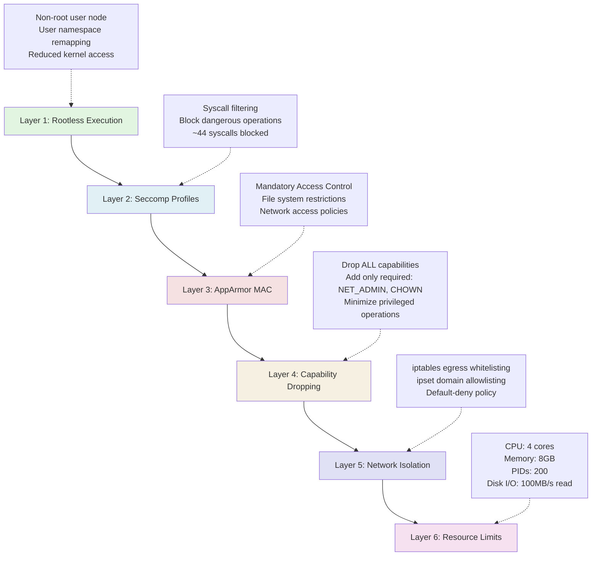

**Layer Interaction**: Each layer operates independently. Compromise of one layer does not grant access through others, requiring attackers to breach multiple layers simultaneously.

### 1.3 Component Architecture

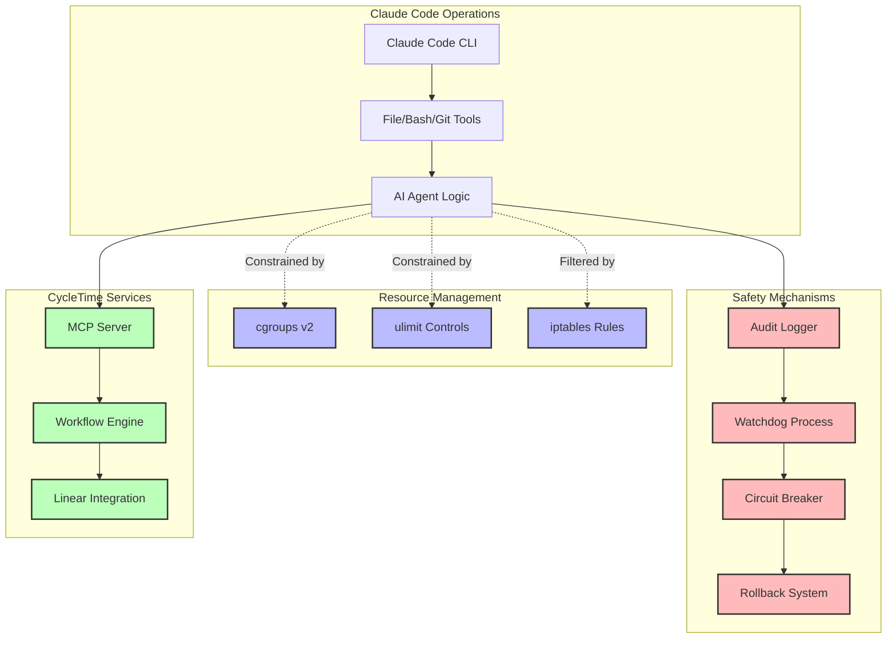

### 1.4 Data Flow Architecture

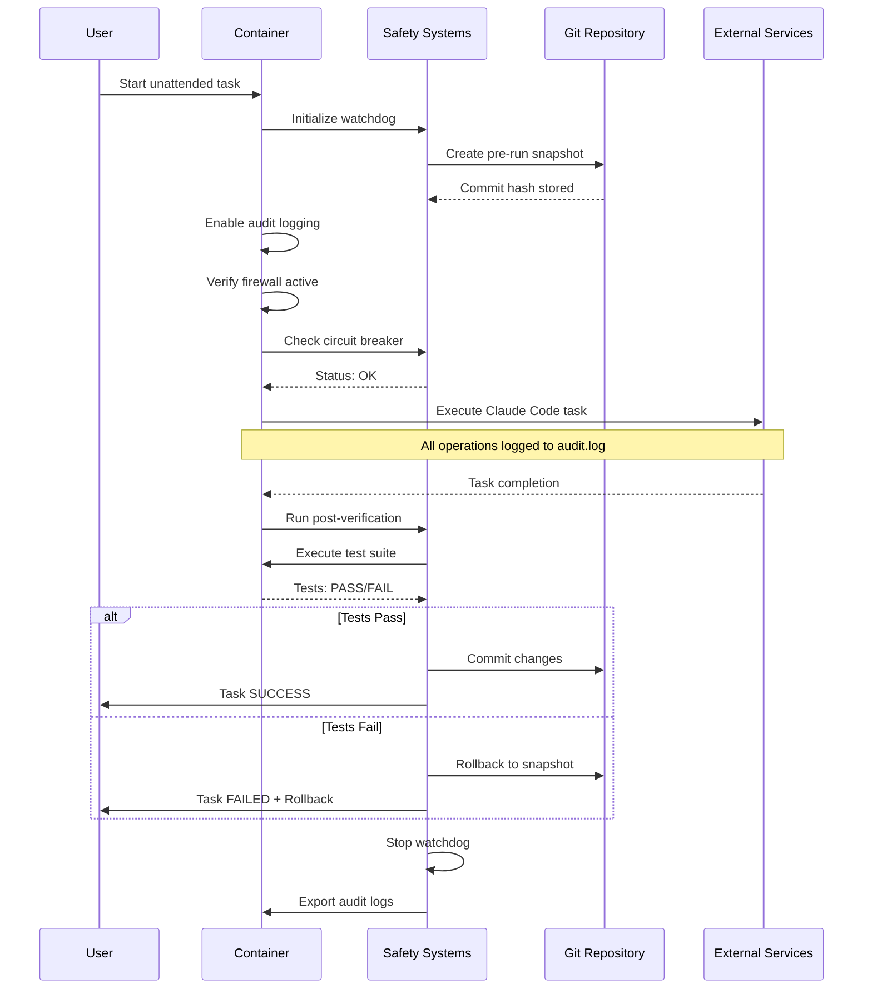

### 1.5 Threat Model

**Assets to Protect**:
- Source code (intellectual property, business logic)
- Credentials (API keys, Git tokens, database passwords)
- Build artifacts (compiled binaries, JAR files)
- Audit logs (security monitoring data)
- Host system (Docker host, other containers)

**Threat Actors**:
1. **Malicious AI Agent** - Compromised or misbehaving Claude Code instance
2. **External Attacker** - Exploiting vulnerabilities in container or Claude Code
3. **Supply Chain Attack** - Malicious dependencies injected during builds
4. **Insider Threat** - Authorized user with malicious intent

**Attack Vectors**:
- Network exfiltration of sensitive data
- Privilege escalation via container breakout
- Resource exhaustion (DoS)
- Code injection or backdoor installation
- Credential theft from mounted volumes

**Security Controls Applied** (see Section 1.2 for detailed layer breakdown)

---

## 2. Container Isolation Design

### 2.1 Base Image Selection

**Chosen Base**: `node:20-bookworm` (Debian 12)

**Rationale**:
- Official Node.js image maintained by Docker Inc + Node.js Foundation
- Debian Bookworm provides stable, well-tested package ecosystem
- Security updates via `apt` for system dependencies
- Compatible with OpenJDK 21 installation for CycleTime's dual-runtime requirements
- Supports iptables, ipset, iproute2 for network isolation
- Non-root `node` user (UID 1000) pre-configured

**Alternative Considered**: Alpine Linux
- **Rejected**: musl libc incompatibilities with JVM, smaller package ecosystem, limited AppArmor support

**Security Hardening**:
```dockerfile
FROM node:20-bookworm

# 1. Update base image packages (security patches)
RUN apt-get update && apt-get upgrade -y && rm -rf /var/lib/apt/lists/*

# 2. Remove unnecessary setuid binaries
RUN find / -perm /6000 -type f -exec chmod a-s {} \; 2>/dev/null || true

# 3. Disable root password
RUN passwd -l root

# 4. Configure secure umask
RUN echo "umask 027" >> /etc/profile

# 5. Disable core dumps
RUN echo "* hard core 0" >> /etc/security/limits.conf
```

### 2.2 Volume Mount Strategy

```mermaid
graph LR
    subgraph "Host Filesystem"
        PROJECT[/Project Source Code/]
        GRADLE_HOST[/.gradle/]
        NPM_HOST[/node_modules/]
    end

    subgraph "Docker Volumes"
        GRADLE_VOL[gradle-cache Volume]
        NPM_VOL[npm-cache Volume]
        CLAUDE_CONFIG[claude-config Volume]
        AUDIT_VOL[claude-audit-logs Volume]
    end

    subgraph "Container Filesystem"
        WORKSPACE[/workspace - READ-ONLY]
        WORKSPACE_OVERLAY[/workspace-write - Overlay]
        GRADLE_CACHE[/home/node/.gradle]
        NPM_CACHE[/home/node/.npm]
        CLAUDE_DIR[/home/node/.claude]
        AUDIT_LOGS[/var/log/claude]
    end

    PROJECT -.->|bind, ro| WORKSPACE
    WORKSPACE --> WORKSPACE_OVERLAY
    GRADLE_VOL --> GRADLE_CACHE
    NPM_VOL --> NPM_CACHE
    CLAUDE_CONFIG --> CLAUDE_DIR
    AUDIT_VOL --> AUDIT_LOGS

    classDef readonly fill:#fdd,stroke:#333,stroke-width:2px
    classDef writable fill:#dfd,stroke:#333,stroke-width:2px
    classDef volume fill:#ddf,stroke:#333,stroke-width:2px

    class WORKSPACE readonly
    class WORKSPACE_OVERLAY,GRADLE_CACHE,NPM_CACHE,CLAUDE_DIR,AUDIT_LOGS writable
    class GRADLE_VOL,NPM_VOL,CLAUDE_CONFIG,AUDIT_VOL volume
```

**Mount Configuration**:

```json
{
  "mounts": [
    {
      "source": "${localWorkspaceFolder}",
      "target": "/workspace",
      "type": "bind",
      "readonly": true,
      "consistency": "cached"
    },
    {
      "source": "cycletime-gradle-cache",
      "target": "/home/node/.gradle",
      "type": "volume"
    },
    {
      "source": "cycletime-npm-cache",
      "target": "/home/node/.npm",
      "type": "volume"
    },
    {
      "source": "cycletime-claude-config",
      "target": "/home/node/.claude",
      "type": "volume"
    },
    {
      "source": "cycletime-audit-logs",
      "target": "/var/log/claude",
      "type": "volume"
    },
    {
      "target": "/tmp",
      "type": "tmpfs",
      "tmpfs-size": 1073741824,
      "tmpfs-mode": "1777"
    }
  ]
}
```

**Security Properties**:

1. **Source Code Read-Only**: Prevents Claude Code from modifying host files directly
2. **Build Cache Isolation**: Gradle and NPM caches in named volumes prevent host pollution
3. **Persistent Configuration**: Claude Code configuration survives container rebuilds
4. **Audit Log Persistence**: Security logs survive container termination
5. **Temporary File Isolation**: tmpfs mount for ephemeral data (1GB limit)

**Write Operations Handling**:

For operations requiring source code modification (git commits, file edits):
- Use **workspace overlay pattern**: Copy-on-write layer over read-only source
- OR: Temporarily remount `/workspace` as writable for specific operations
- OR: Use git working directory in writable volume, push changes to host via git operations

**Recommended Approach**: Workspace overlay with explicit sync operations:

```bash
#!/bin/bash
# sync-workspace.sh - Copy changes from overlay to host

rsync -av --delete /workspace-overlay/ /workspace/
```

### 2.3 Network Isolation

**Network Architecture**:

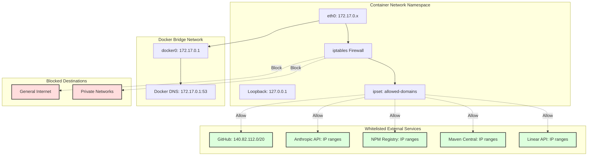

**Firewall Implementation** (see Section 4 for full script):

```bash
#!/bin/bash
# init-firewall.sh - Network isolation enforcement

set -e

# Extract Docker DNS
DNS_IP=$(cat /etc/resolv.conf | grep nameserver | awk '{print $2}')

# Flush existing rules
iptables -F
iptables -X
iptables -t nat -F
iptables -t nat -X

# Create ipset for allowed domains
ipset create allowed-domains hash:ip hashsize 4096 maxelem 10000

# Whitelist CycleTime-specific services
ALLOWED_DOMAINS=(
    # Version Control
    "github.com"
    "api.github.com"

    # Package Registries
    "registry.npmjs.org"
    "repo.maven.apache.org"
    "repo1.maven.org"
    "plugins.gradle.org"
    "services.gradle.org"

    # Anthropic
    "api.anthropic.com"
    "console.anthropic.com"

    # Linear
    "api.linear.app"

    # Observability
    "sentry.io"
)

# Resolve and add to ipset
for domain in "${ALLOWED_DOMAINS[@]}"; do
    for ip in $(dig +short $domain @$DNS_IP); do
        # IPv4 only
        if [[ $ip =~ ^[0-9]+\.[0-9]+\.[0-9]+\.[0-9]+$ ]]; then
            ipset add allowed-domains $ip 2>/dev/null || true
        fi
    done
done

# Fetch GitHub IP ranges from API
for ip in $(curl -s https://api.github.com/meta | jq -r '.git[]'); do
    ipset add allowed-domains $ip 2>/dev/null || true
done

# Default policies: DROP
iptables -P INPUT DROP
iptables -P FORWARD DROP
iptables -P OUTPUT DROP

# Allow loopback (MCP server localhost:8080)
iptables -A INPUT -i lo -j ACCEPT
iptables -A OUTPUT -o lo -j ACCEPT

# Allow established/related connections
iptables -A INPUT -m state --state ESTABLISHED,RELATED -j ACCEPT
iptables -A OUTPUT -m state --state ESTABLISHED,RELATED -j ACCEPT

# Allow DNS to Docker resolver only
iptables -A OUTPUT -p udp -d $DNS_IP --dport 53 -j ACCEPT
iptables -A OUTPUT -p tcp -d $DNS_IP --dport 53 -j ACCEPT

# Allow SSH for git operations
iptables -A OUTPUT -p tcp --dport 22 -j ACCEPT

# Allow HTTPS to whitelisted domains
iptables -A OUTPUT -p tcp --dport 443 -m set --match-set allowed-domains dst -j ACCEPT

# Allow HTTP to whitelisted domains (for redirects)
iptables -A OUTPUT -p tcp --dport 80 -m set --match-set allowed-domains dst -j ACCEPT

# Log rejected egress attempts (debugging + security monitoring)
iptables -A OUTPUT -m limit --limit 5/min -j LOG --log-prefix "EGRESS-BLOCKED: " --log-level 4

# Reject everything else
iptables -A OUTPUT -j REJECT --reject-with icmp-host-unreachable

# Verification
echo "Testing firewall configuration..."
if ! curl -s --max-time 5 https://api.github.com/zen > /dev/null; then
    echo "ERROR: GitHub API unreachable"
    exit 1
fi

if curl -s --max-time 5 https://example.com > /dev/null 2>&1; then
    echo "WARNING: Firewall not blocking example.com"
    exit 1
fi

echo "✓ Firewall initialized successfully"
echo "✓ Whitelisted domains: ${#ALLOWED_DOMAINS[@]}"
echo "✓ Total IPs in ipset: $(ipset list allowed-domains | wc -l)"
```

**Firewall Maintenance**:

```bash
# Refresh IP addresses hourly (cron job)
0 * * * * /usr/local/bin/refresh-whitelist.sh

# refresh-whitelist.sh
#!/bin/bash
ipset flush allowed-domains
/usr/local/bin/init-firewall.sh
```

### 2.4 User Namespace Isolation

**User Configuration**:

```dockerfile
# Create non-root user matching host UID/GID
ARG HOST_UID=1000
ARG HOST_GID=1000

RUN groupadd -g ${HOST_GID} cycletime && \
    useradd -u ${HOST_UID} -g cycletime -G sudo -s /bin/bash -m cycletime && \
    echo "cycletime ALL=(ALL) NOPASSWD: /usr/local/bin/init-firewall.sh" >> /etc/sudoers

USER cycletime
WORKDIR /workspace
```

**Benefits**:
- Files created in container have correct ownership on host
- Limits damage from container breakout (attacker gains only user-level access)
- Compatible with rootless Docker mode (future migration path)

**Sudo Access**: Limited to single firewall initialization script with no parameters, preventing privilege escalation via sudo.

---

## 3. Permission Model

### 3.1 Operation Classification

CycleTime operations are classified into risk categories determining required permissions:

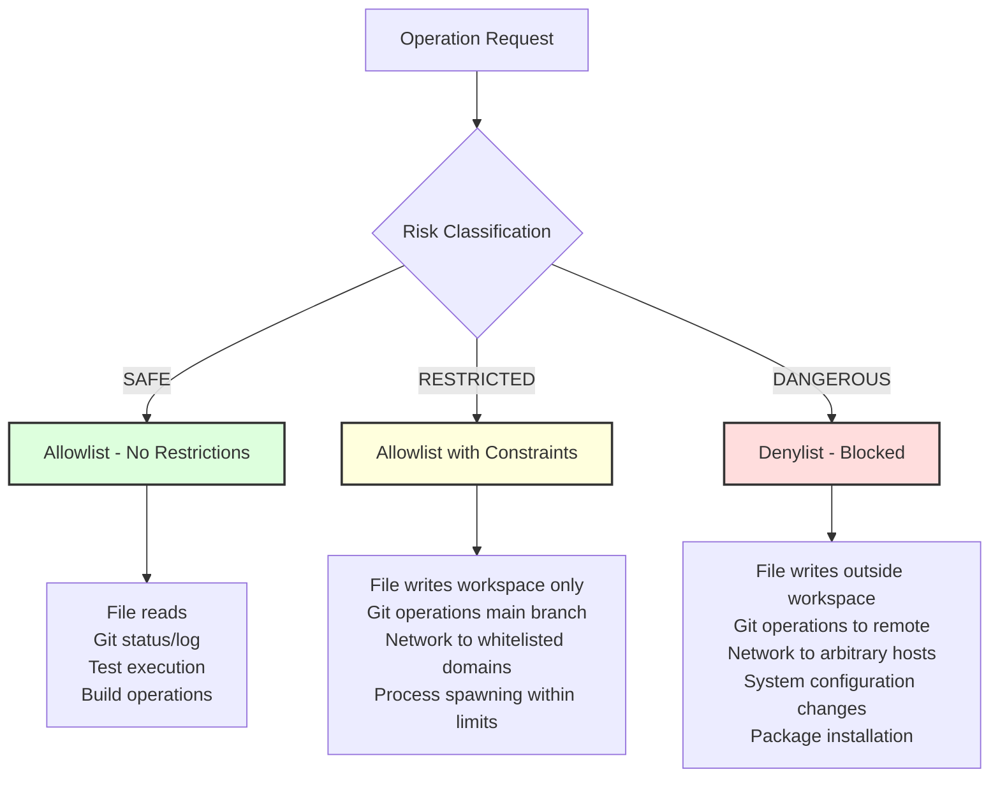

### 3.2 File System Permissions

**Allowlist** (Permitted Operations):

| Path Pattern | Operations | Rationale |
|-------------|-----------|-----------|
| `/workspace/**/*.kt` | read, write | Kotlin source code editing |
| `/workspace/**/*.md` | read, write | Documentation updates |
| `/workspace/build.gradle.kts` | read, write | Build configuration |
| `/workspace/src/**` | read, write | Source code modifications |
| `/workspace/docs/**` | read, write | Documentation management |
| `/home/cycletime/.claude/**` | read, write | Claude Code configuration |
| `/home/cycletime/.gradle/**` | read, write | Build cache |
| `/tmp/**` | read, write, execute | Temporary files |

**Denylist** (Blocked Operations):

| Path Pattern | Operations | Rationale |
|-------------|-----------|-----------|
| `/etc/**` | write | System configuration |
| `/usr/**` | write | System binaries |
| `/home/cycletime/.ssh/**` | read, write | SSH credentials |
| `**/.env` | read, write | Environment secrets |
| `**/credentials.json` | read, write | API credentials |
| `/workspace/.git/config` | write | Git configuration tampering |

**AppArmor Profile** (see Section 2.1 SPI-940 research for full profile):

```
profile cycletime-claude-code flags=(attach_disconnected,mediate_deleted) {
  #include <abstractions/base>

  # Allow workspace operations
  /workspace/** rw,

  # Allow build caches
  /home/cycletime/.gradle/** rw,
  /home/cycletime/.npm/** rw,

  # Deny sensitive paths
  deny /etc/shadow r,
  deny /etc/sudoers r,
  deny /home/cycletime/.ssh/** rw,
  deny /**/.env r,
  deny /**/credentials.json r,

  # Allow Node.js and JVM
  /usr/bin/node ix,
  /usr/lib/jvm/** ix,
  /usr/bin/gradle ix,
}
```

### 3.3 Git Operation Permissions

**Git operations are classified by risk level**:

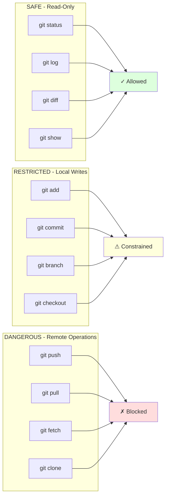

**Git Configuration Constraints**:

```bash
# Git configuration enforced on container startup
git config --global user.name "CycleTime Agent"
git config --global user.email "agent@cycletime.dev"
git config --global core.editor "nano"
git config --global --add safe.directory /workspace

# Disable automatic remote operations
git config --global push.default nothing
git config --global fetch.prune false

# Require explicit branch names
git config --global push.autoSetupRemote false
```

**Branch Protection**:

```bash
#!/bin/bash
# git-wrapper.sh - Wraps git commands with safety checks

COMMAND=$1
shift

case $COMMAND in
    push|pull|fetch)
        echo "ERROR: Remote git operations are blocked in unattended mode"
        echo "Changes are committed locally only. Manual push required."
        exit 1
        ;;

    checkout)
        BRANCH=$1
        if [[ "$BRANCH" == "main" ]] || [[ "$BRANCH" == "master" ]]; then
            echo "ERROR: Cannot checkout protected branch: $BRANCH"
            exit 1
        fi
        git "$COMMAND" "$@"
        ;;

    commit)
        # Allow commits only to feature branches
        CURRENT_BRANCH=$(git branch --show-current)
        if [[ "$CURRENT_BRANCH" == "main" ]] || [[ "$CURRENT_BRANCH" == "master" ]]; then
            echo "ERROR: Cannot commit directly to protected branch: $CURRENT_BRANCH"
            exit 1
        fi
        git "$COMMAND" "$@"
        ;;

    *)
        # Allow all other git commands
        git "$COMMAND" "$@"
        ;;
esac
```

**Usage**: Replace `git` binary with wrapper script:

```bash
# In devcontainer postStartCommand
sudo mv /usr/bin/git /usr/bin/git.real
sudo cp /usr/local/bin/git-wrapper.sh /usr/bin/git
sudo chmod +x /usr/bin/git
```

### 3.4 Network Permission Model

**Domain Whitelist** (see Section 2.3 for iptables implementation):

| Domain | Purpose | Risk Level |
|--------|---------|-----------|
| `github.com`, `api.github.com` | Git operations, Linear sync | Low |
| `api.anthropic.com` | Claude Code API | Low |
| `registry.npmjs.org` | Node.js dependencies | Medium |
| `repo.maven.apache.org` | JVM dependencies | Medium |
| `plugins.gradle.org` | Gradle plugins | Medium |
| `api.linear.app` | Linear issue tracking | Low |
| `sentry.io` | Error reporting | Low |

**Network Operation Audit Logging**:

All network operations are logged with:
- Timestamp (ISO 8601 with timezone)
- Destination domain and IP
- Protocol and port
- Request size (bytes)
- Response status code
- Duration (milliseconds)

Example audit log entry:
```json
{
  "timestamp": "2025-11-03T15:42:13.456Z",
  "type": "network_request",
  "operation": "https_get",
  "destination": "api.github.com",
  "ip": "140.82.112.3",
  "port": 443,
  "request_bytes": 1234,
  "response_status": 200,
  "response_bytes": 5678,
  "duration_ms": 234,
  "user": "cycletime-agent",
  "result": "success"
}
```

### 3.5 Process Execution Permissions

**Allowed Binaries**:
- `/usr/bin/node` - Node.js runtime
- `/usr/bin/java` - JVM runtime
- `/usr/bin/gradle` - Gradle build tool
- `/usr/bin/git` - Git version control (via wrapper)
- `/usr/bin/bash`, `/bin/sh` - Shell interpreters
- `/usr/bin/npm` - Node package manager
- `/usr/bin/curl`, `/usr/bin/wget` - HTTP clients (constrained by firewall)

**Blocked Binaries**:
- `/usr/bin/ssh` - Direct SSH connections (use HTTPS git instead)
- `/usr/bin/docker` - Nested containers (security risk)
- `/usr/sbin/**` - System administration tools
- Compiler binaries not in allowlist (prevents runtime code compilation attacks)

**Process Spawn Limits**:
```bash
# ulimit configuration in container
ulimit -u 200        # Max 200 processes (prevents fork bombs)
ulimit -t 3600       # Max 1 hour CPU time per process
ulimit -f 10485760   # Max 10GB file size
ulimit -v 8388608    # Max 8GB virtual memory
```

---

## 4. Resource Limits

### 4.1 CPU Limits

**Configuration**:

```json
{
  "hostConfig": {
    "cpus": "4.0",
    "cpuShares": 1024,
    "cpuQuota": 400000,
    "cpuPeriod": 100000,
    "cpuset": "0-3"
  }
}
```

**Explanation**:
- `cpus: "4.0"` - Maximum 4 CPU cores (400% CPU)
- `cpuShares: 1024` - Default weight for CPU scheduling
- `cpuQuota: 400000` - 4 seconds of CPU time per 1 second period
- `cpuPeriod: 100000` - 100ms scheduling period (kernel default)
- `cpuset: "0-3"` - Pin to specific CPU cores (optional, for NUMA systems)

**Workload Justification**:
- **Gradle Builds**: 2-3 cores for parallel compilation (`--max-workers=3`)
- **Node.js Claude Code**: 1 core for AI agent operations
- **MCP Server**: 0.5 cores for request handling
- **Overhead**: 0.5 cores for system operations

**Monitoring**:

```bash
# Check CPU throttling
docker stats cycletime-claude-code --no-stream --format "table {{.Name}}\t{{.CPUPerc}}\t{{.MemUsage}}"

# Inside container
cat /sys/fs/cgroup/cpu.stat | grep throttled
# nr_throttled: number of times throttled
# throttled_time: total time throttled (nanoseconds)
```

**Alerting Threshold**: Alert if `throttled_time` increases by >10% per hour (indicates CPU starvation)

### 4.2 Memory Limits

**Configuration**:

```json
{
  "hostConfig": {
    "memory": "8589934592",
    "memorySwap": "8589934592",
    "memoryReservation": "4294967296",
    "kernelMemory": "536870912",
    "oomKillDisable": false,
    "oomScoreAdj": 500
  }
}
```

**Explanation**:
- `memory: "8589934592"` - Hard limit: 8GB RAM
- `memorySwap: "8589934592"` - Disable swap (memory + swap = memory)
- `memoryReservation: "4294967296"` - Soft limit: 4GB (triggers reclaim before hard limit)
- `kernelMemory: "536870912"` - Kernel memory limit: 512MB
- `oomKillDisable: false` - Allow OOM killer (safer than hang)
- `oomScoreAdj: 500` - Prefer killing this container over host processes

**Memory Allocation**:

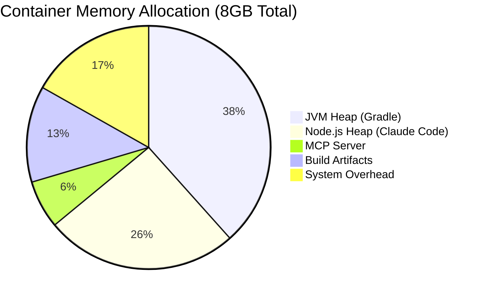

**JVM Memory Configuration**:

```bash
# Gradle JVM settings (gradle.properties)
org.gradle.jvmargs=-Xmx3g -Xms1g -XX:MaxMetaspaceSize=512m -XX:+HeapDumpOnOutOfMemoryError -XX:HeapDumpPath=/tmp

# Gradle daemon settings
org.gradle.daemon.idletimeout=600000
org.gradle.workers.max=3
```

**Node.js Memory Configuration**:

```bash
# Environment variable in devcontainer.json
export NODE_OPTIONS="--max-old-space-size=2048"  # 2GB heap
```

**Container-Aware Memory Management**:

Node.js 20+ automatically detects cgroup limits:
```javascript
const v8 = require('v8');
const heapStats = v8.getHeapStatistics();
console.log(`Max heap: ${heapStats.heap_size_limit / 1024 / 1024 / 1024}GB`);
// Output: ~1.5GB (Node.js automatically leaves headroom)
```

**Memory Monitoring**:

```bash
# Real-time memory usage
docker stats cycletime-claude-code --no-stream --format "table {{.Name}}\t{{.MemUsage}}\t{{.MemPerc}}"

# Inside container - check for memory pressure
cat /sys/fs/cgroup/memory.pressure
# some: occasional memory pressure
# full: sustained memory pressure (BAD)
```

**Alerting Thresholds**:
- **WARNING**: Memory usage > 6.5GB (80% of limit)
- **CRITICAL**: Memory usage > 7.5GB (95% of limit)
- **EMERGENCY**: OOM killer invoked (container will be restarted)

### 4.3 Disk I/O Limits

**Configuration**:

```json
{
  "hostConfig": {
    "blkioWeight": 500,
    "deviceReadBps": [
      {
        "path": "/dev/sda",
        "rate": 104857600
      }
    ],
    "deviceWriteBps": [
      {
        "path": "/dev/sda",
        "rate": 52428800
      }
    ],
    "deviceReadIOps": [
      {
        "path": "/dev/sda",
        "rate": 1000
      }
    ],
    "deviceWriteIOps": [
      {
        "path": "/dev/sda",
        "rate": 500
      }
    ]
  }
}
```

**Explanation**:
- `blkioWeight: 500` - Relative I/O priority (100-1000, default 500)
- `deviceReadBps: 104857600` - Max 100MB/s read throughput
- `deviceWriteBps: 52428800` - Max 50MB/s write throughput
- `deviceReadIOps: 1000` - Max 1000 read IOPS
- `deviceWriteIOps: 500` - Max 500 write IOPS

**Workload Justification**:
- **Gradle Builds**: Read-heavy (dependencies, source files)
- **Test Execution**: Mixed read/write (test data, logs)
- **Artifact Generation**: Write-heavy (JAR files, documentation)
- **100MB/s read** sufficient for typical build operations
- **50MB/s write** prevents disk saturation during builds

**Monitoring**:

```bash
# Container I/O statistics
docker stats cycletime-claude-code --no-stream --format "table {{.Name}}\t{{.BlockIO}}"

# Inside container - check I/O pressure
cat /sys/fs/cgroup/io.pressure
```

### 4.4 Process/PID Limits

**Configuration**:

```json
{
  "hostConfig": {
    "pidsLimit": 200
  }
}
```

**Workload Breakdown**:
- **Gradle Daemon**: 1 process + ~10 worker threads (threads share PID in Docker)
- **Gradle Workers**: Up to 3 parallel workers × ~5 processes = 15 processes
- **Node.js Claude Code**: 1 process + event loop (single-threaded)
- **MCP Server**: 1 Ktor server process + coroutines (lightweight)
- **Test Processes**: ~50 processes (Gradle test workers, JUnit forks)
- **Shell Commands**: ~20 concurrent bash/git/curl processes
- **Overhead**: ~100 PIDs reserved for system, monitoring, safety scripts

**Total**: ~187 processes under normal operation, 200 PID limit provides 7% headroom

**Fork Bomb Protection**:

```bash
# Test fork bomb protection
:(){ :|:& };:

# Expected behavior: Process creation fails after 200 PIDs
# bash: fork: retry: Resource temporarily unavailable
```

**Monitoring**:

```bash
# Current process count
docker exec cycletime-claude-code ps aux | wc -l

# PID limit from inside container
cat /sys/fs/cgroup/pids.max
# Output: 200

# Current PID usage
cat /sys/fs/cgroup/pids.current
```

**Alerting Threshold**: Alert if PID usage > 180 (90% of limit)

### 4.5 Network Bandwidth Limits

**Configuration**:

```json
{
  "hostConfig": {
    "networkMode": "bridge"
  }
}
```

**Bandwidth Shaping** (applied via tc on host):

```bash
# Host-side traffic control for container network interface
CONTAINER_VETH=$(docker exec cycletime-claude-code cat /sys/class/net/eth0/iflink)
VETH_NAME=$(ip link | grep "^${CONTAINER_VETH}:" | awk -F: '{print $2}' | tr -d ' ')

# Limit egress to 50 Mbps
tc qdisc add dev $VETH_NAME root tbf rate 50mbit burst 10kb latency 50ms

# Limit ingress to 100 Mbps (requires ifb)
tc qdisc add dev $VETH_NAME ingress
tc filter add dev $VETH_NAME parent ffff: protocol ip u32 match u32 0 0 flowid 1:1 action mirred egress redirect dev ifb0
tc qdisc add dev ifb0 root tbf rate 100mbit burst 10kb latency 50ms
```

**Rationale**:
- **Egress 50 Mbps**: Sufficient for git operations, API calls, package downloads
- **Ingress 100 Mbps**: Higher limit for downloading dependencies (npm, Maven)
- Prevents network saturation attacks or unintended large file downloads

**Monitoring**:

```bash
# Container network statistics
docker stats cycletime-claude-code --no-stream --format "table {{.Name}}\t{{.NetIO}}"

# Inside container - bandwidth usage
ifconfig eth0 | grep "RX bytes"
```

### 4.6 Resource Limit Summary

| Resource | Soft Limit | Hard Limit | Workload Basis | Monitoring Threshold |
|----------|-----------|-----------|---------------|---------------------|
| CPU | 3.0 cores | 4.0 cores | Gradle (2-3) + Node.js (1) | 90% utilization |
| Memory | 4GB | 8GB | JVM (3GB) + Node.js (2GB) + overhead | 80% usage |
| PIDs | 180 | 200 | Gradle workers (50) + tests (50) + overhead | 90% usage |
| Disk Read | 80 MB/s | 100 MB/s | Build operations | 80% throughput |
| Disk Write | 40 MB/s | 50 MB/s | Artifact generation | 80% throughput |
| Network Egress | 40 Mbps | 50 Mbps | Git + API operations | 80% bandwidth |
| Network Ingress | 80 Mbps | 100 Mbps | Dependency downloads | 80% bandwidth |

**Automatic Scaling**: Resource limits are static (no auto-scaling) to maintain predictable security boundaries

---

## 5. Rollback & Recovery

### 5.1 Git-Based Rollback Architecture

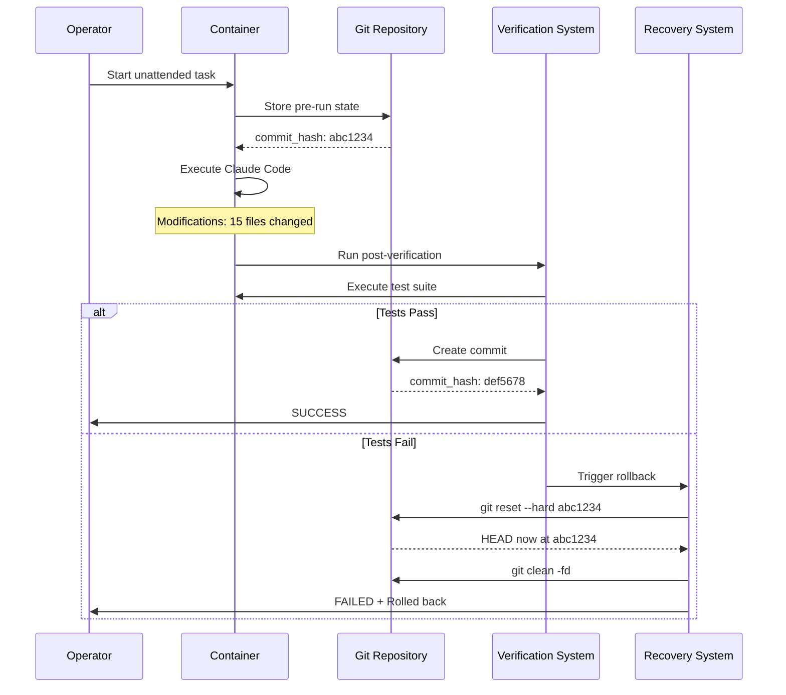

### 5.2 Pre-Run State Capture

**Implementation**:

```bash
#!/bin/bash
# pre-run-snapshot.sh - Capture state before Claude Code execution

set -e

SNAPSHOT_DIR="/var/lib/cycletime/snapshots"
SNAPSHOT_FILE="$SNAPSHOT_DIR/pre-run-$(date +%Y%m%d-%H%M%S).json"

mkdir -p "$SNAPSHOT_DIR"

# Capture git state
PRE_RUN_COMMIT=$(git rev-parse HEAD)
PRE_RUN_BRANCH=$(git branch --show-current)
PRE_RUN_DIRTY=$(git status --porcelain | wc -l)

# Capture file checksums (for verification)
find /workspace -type f -name "*.kt" -o -name "*.md" -o -name "*.gradle*" | \
    xargs sha256sum > /tmp/pre-run-checksums.txt

# Capture container state
CONTAINER_UPTIME=$(cat /proc/uptime | awk '{print $1}')
MEMORY_USAGE=$(cat /sys/fs/cgroup/memory.current)
CPU_USAGE=$(cat /sys/fs/cgroup/cpu.stat | grep usage_usec | awk '{print $2}')

# Store snapshot metadata
cat > "$SNAPSHOT_FILE" <<EOF
{
  "timestamp": "$(date -u +%Y-%m-%dT%H:%M:%SZ)",
  "git": {
    "commit": "$PRE_RUN_COMMIT",
    "branch": "$PRE_RUN_BRANCH",
    "dirty_files": $PRE_RUN_DIRTY
  },
  "container": {
    "uptime_seconds": $CONTAINER_UPTIME,
    "memory_bytes": $MEMORY_USAGE,
    "cpu_usec": $CPU_USAGE
  },
  "checksums": "/tmp/pre-run-checksums.txt"
}
EOF

echo "✓ Pre-run snapshot created: $SNAPSHOT_FILE"
echo "$PRE_RUN_COMMIT" > /tmp/rollback-point
```

### 5.3 Post-Verification System

**Verification Steps**:

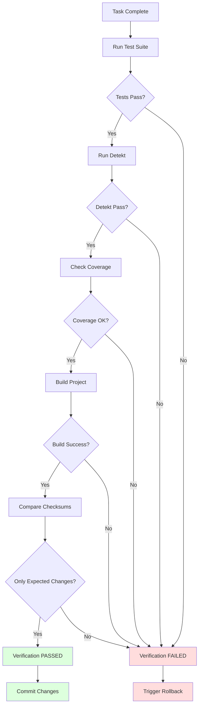

**Implementation**:

```bash
#!/bin/bash
# post-verification.sh - Verify changes before committing

set -e

SNAPSHOT_FILE=$(ls -t /var/lib/cycletime/snapshots/pre-run-*.json | head -1)
PRE_RUN_COMMIT=$(cat /tmp/rollback-point)

echo "Running post-verification checks..."
echo "Pre-run commit: $PRE_RUN_COMMIT"
echo "Current commit: $(git rev-parse HEAD)"

# 1. Run test suite
echo "[1/5] Running test suite..."
if ! timeout 30m ./gradlew test --rerun-tasks --no-daemon; then
    echo "✗ Tests FAILED"
    exit 1
fi
echo "✓ Tests passed"

# 2. Run static analysis
echo "[2/5] Running detekt..."
if ! ./gradlew detekt --no-daemon; then
    echo "✗ Detekt FAILED"
    exit 1
fi
echo "✓ Detekt passed"

# 3. Check code coverage
echo "[3/5] Checking coverage..."
if ! ./gradlew koverVerify --no-daemon; then
    echo "✗ Coverage check FAILED"
    exit 1
fi
echo "✓ Coverage requirements met"

# 4. Build project
echo "[4/5] Building project..."
if ! timeout 20m ./gradlew build --no-daemon; then
    echo "✗ Build FAILED"
    exit 1
fi
echo "✓ Build successful"

# 5. Verify file changes
echo "[5/5] Verifying file changes..."
find /workspace -type f -name "*.kt" -o -name "*.md" -o -name "*.gradle*" | \
    xargs sha256sum > /tmp/post-run-checksums.txt

# Check if unexpected files were modified
diff /tmp/pre-run-checksums.txt /tmp/post-run-checksums.txt > /tmp/file-changes.txt || true

CHANGED_FILES=$(wc -l < /tmp/file-changes.txt)
if [ $CHANGED_FILES -gt 100 ]; then
    echo "✗ Too many files changed: $CHANGED_FILES (threshold: 100)"
    echo "Unexpected changes detected. Manual review required."
    exit 1
fi
echo "✓ File changes within expected bounds ($CHANGED_FILES files)"

echo ""
echo "========================================"
echo "POST-VERIFICATION: PASSED"
echo "========================================"
echo "All checks completed successfully"
exit 0
```

### 5.4 Rollback Execution

**Rollback Script**:

```bash
#!/bin/bash
# rollback.sh - Restore to pre-run state

set -e

ROLLBACK_POINT=$(cat /tmp/rollback-point 2>/dev/null || echo "")

if [ -z "$ROLLBACK_POINT" ]; then
    echo "ERROR: No rollback point found"
    exit 1
fi

echo "========================================="
echo "ROLLBACK INITIATED"
echo "========================================="
echo "Target commit: $ROLLBACK_POINT"
echo "Current commit: $(git rev-parse HEAD)"
echo ""

# 1. Stash any uncommitted changes
echo "[1/5] Stashing uncommitted changes..."
git stash push -u -m "Rollback stash $(date +%Y%m%d-%H%M%S)" || true
echo "✓ Changes stashed"

# 2. Reset to rollback point
echo "[2/5] Resetting to rollback point..."
git reset --hard "$ROLLBACK_POINT"
echo "✓ Reset complete"

# 3. Clean untracked files
echo "[3/5] Cleaning untracked files..."
git clean -fd
echo "✓ Untracked files removed"

# 4. Verify state
echo "[4/5] Verifying rollback..."
CURRENT_COMMIT=$(git rev-parse HEAD)
if [ "$CURRENT_COMMIT" != "$ROLLBACK_POINT" ]; then
    echo "✗ Rollback verification FAILED"
    echo "Expected: $ROLLBACK_POINT"
    echo "Got: $CURRENT_COMMIT"
    exit 1
fi
echo "✓ Rollback verified"

# 5. Clean build artifacts
echo "[5/5] Cleaning build artifacts..."
./gradlew clean --no-daemon || true
rm -rf build/ .gradle/
echo "✓ Build artifacts cleaned"

echo ""
echo "========================================="
echo "ROLLBACK COMPLETE"
echo "========================================="
echo "Repository restored to: $ROLLBACK_POINT"
echo "Stashed changes available: git stash list"
```

### 5.5 Automated Recovery Workflow

**Complete Workflow**:

```bash
#!/bin/bash
# run-with-recovery.sh - Execute Claude Code with automated recovery

set -e

TASK_DESCRIPTION="$1"
MAX_RETRIES=3
RETRY_COUNT=0

if [ -z "$TASK_DESCRIPTION" ]; then
    echo "Usage: run-with-recovery.sh '<task description>'"
    exit 1
fi

# Verify container isolation
if [ "$DEVCONTAINER" != "true" ]; then
    echo "ERROR: Must run inside devcontainer"
    exit 1
fi

# Verify firewall active
if ! iptables -L OUTPUT | grep -q "REJECT"; then
    echo "ERROR: Firewall not active"
    exit 1
fi

echo "========================================="
echo "UNATTENDED TASK EXECUTION"
echo "========================================="
echo "Task: $TASK_DESCRIPTION"
echo "Max retries: $MAX_RETRIES"
echo ""

while [ $RETRY_COUNT -lt $MAX_RETRIES ]; do
    echo "Attempt $((RETRY_COUNT + 1)) of $MAX_RETRIES"

    # 1. Create pre-run snapshot
    echo "[Step 1/4] Creating pre-run snapshot..."
    /usr/local/bin/pre-run-snapshot.sh

    # 2. Execute Claude Code
    echo "[Step 2/4] Executing Claude Code..."
    timeout 30m claude \
        --dangerously-skip-permissions \
        --log-level=debug \
        "$TASK_DESCRIPTION" \
        2>&1 | tee -a /var/log/claude/audit.log

    CLAUDE_EXIT=$?

    if [ $CLAUDE_EXIT -ne 0 ]; then
        echo "✗ Claude Code failed with exit code $CLAUDE_EXIT"
        /usr/local/bin/rollback.sh
        RETRY_COUNT=$((RETRY_COUNT + 1))
        continue
    fi

    # 3. Run post-verification
    echo "[Step 3/4] Running post-verification..."
    if ! /usr/local/bin/post-verification.sh; then
        echo "✗ Post-verification failed"
        /usr/local/bin/rollback.sh
        RETRY_COUNT=$((RETRY_COUNT + 1))
        continue
    fi

    # 4. Commit changes
    echo "[Step 4/4] Committing changes..."
    git add -A
    git commit -m "feat: $TASK_DESCRIPTION

Automated commit by CycleTime Agent

🤖 Generated with Claude Code (unattended mode)
✓ All verification checks passed
" || echo "No changes to commit"

    echo ""
    echo "========================================="
    echo "TASK COMPLETED SUCCESSFULLY"
    echo "========================================="
    exit 0
done

echo ""
echo "========================================="
echo "TASK FAILED AFTER $MAX_RETRIES ATTEMPTS"
echo "========================================="
echo "Manual intervention required"
exit 1
```

### 5.6 Snapshot Management

**Snapshot Retention Policy**:

```bash
#!/bin/bash
# cleanup-snapshots.sh - Manage snapshot retention

SNAPSHOT_DIR="/var/lib/cycletime/snapshots"
RETENTION_DAYS=7

# Keep last 7 days of snapshots
find "$SNAPSHOT_DIR" -name "pre-run-*.json" -mtime +$RETENTION_DAYS -delete

# Keep last 20 snapshots regardless of age
ls -t "$SNAPSHOT_DIR"/pre-run-*.json | tail -n +21 | xargs rm -f 2>/dev/null || true

# Report current snapshot count
SNAPSHOT_COUNT=$(ls "$SNAPSHOT_DIR"/pre-run-*.json 2>/dev/null | wc -l)
echo "Snapshot retention: $SNAPSHOT_COUNT snapshots (max 20, max age ${RETENTION_DAYS}d)"
```

**Cron Job**:

```bash
# Run daily at 2 AM
0 2 * * * /usr/local/bin/cleanup-snapshots.sh
```

---

## 6. Logging & Monitoring

### 6.1 Audit Log Schema

**JSON Lines Format**:

```json
{
  "timestamp": "2025-11-03T15:42:13.456Z",
  "level": "info|warn|error",
  "type": "file_operation|command_execution|network_request|git_operation|process_spawn",
  "operation": "read|write|execute|request",
  "resource": "/path/to/file or command or URL",
  "user": "cycletime-agent",
  "result": "success|failure|blocked",
  "duration_ms": 123,
  "metadata": {
    "key": "value"
  }
}
```

**Example Audit Entries**:

```json
{"timestamp":"2025-11-03T15:42:13.456Z","level":"info","type":"file_operation","operation":"write","resource":"/workspace/src/main/kotlin/Auth.kt","user":"cycletime-agent","result":"success","duration_ms":45,"metadata":{"size_bytes":3421}}

{"timestamp":"2025-11-03T15:42:14.123Z","level":"info","type":"command_execution","operation":"execute","resource":"./gradlew test","user":"cycletime-agent","result":"success","duration_ms":12340,"metadata":{"exit_code":0,"output_lines":234}}

{"timestamp":"2025-11-03T15:42:15.789Z","level":"info","type":"network_request","operation":"https_get","resource":"https://api.github.com/repos/cycletime/cycletime/commits","user":"cycletime-agent","result":"success","duration_ms":234,"metadata":{"status_code":200,"response_bytes":5678}}

{"timestamp":"2025-11-03T15:42:16.456Z","level":"warn","type":"network_request","operation":"https_get","resource":"https://example.com","user":"cycletime-agent","result":"blocked","duration_ms":0,"metadata":{"reason":"not_whitelisted"}}

{"timestamp":"2025-11-03T15:42:17.123Z","level":"error","type":"git_operation","operation":"push","resource":"origin/main","user":"cycletime-agent","result":"blocked","duration_ms":0,"metadata":{"reason":"remote_operations_disabled"}}
```

### 6.2 Logging Architecture

```mermaid
graph TB
    subgraph "Container"
        CC[Claude Code CLI]
        WRAPPER[Operation Wrappers]
        AUDIT_LIB[Audit Logging Library]
        LOG_FILE[/var/log/claude/audit.log]
    end

    subgraph "Log Shipping"
        FLUENT[Fluent Bit]
        BUFFER[Local Buffer]
    end

    subgraph "Centralized Logging"
        ELASTIC[Elasticsearch]
        GRAFANA[Grafana]
        ALERTS[Alert Manager]
    end

    CC --> WRAPPER
    WRAPPER --> AUDIT_LIB
    AUDIT_LIB --> LOG_FILE
    LOG_FILE --> FLUENT
    FLUENT --> BUFFER
    BUFFER --> ELASTIC
    ELASTIC --> GRAFANA
    ELASTIC --> ALERTS

    classDef logging fill:#bbf,stroke:#333,stroke-width:2px
    classDef ship fill:#fbf,stroke:#333,stroke-width:2px
    classDef central fill:#bfb,stroke:#333,stroke-width:2px

    class AUDIT_LIB,LOG_FILE logging
    class FLUENT,BUFFER ship
    class ELASTIC,GRAFANA,ALERTS central
```

### 6.3 Audit Logging Implementation

**Logging Library** (Kotlin):

```kotlin
// src/main/kotlin/io/spiralhouse/cycletime/safety/AuditLogger.kt

package io.spiralhouse.cycletime.safety

import kotlinx.serialization.Serializable
import kotlinx.serialization.json.Json
import kotlinx.serialization.encodeToString
import java.time.Instant
import java.io.File
import java.io.FileWriter

@Serializable
data class AuditLogEntry(
    val timestamp: String,
    val level: LogLevel,
    val type: OperationType,
    val operation: String,
    val resource: String,
    val user: String = "cycletime-agent",
    val result: Result,
    val duration_ms: Long,
    val metadata: Map<String, String> = emptyMap()
)

enum class LogLevel { INFO, WARN, ERROR }
enum class OperationType { FILE_OPERATION, COMMAND_EXECUTION, NETWORK_REQUEST, GIT_OPERATION, PROCESS_SPAWN }
enum class Result { SUCCESS, FAILURE, BLOCKED }

object AuditLogger {
    private val logFile = File("/var/log/claude/audit.log")
    private val json = Json { prettyPrint = false }

    init {
        logFile.parentFile.mkdirs()
    }

    fun log(
        level: LogLevel,
        type: OperationType,
        operation: String,
        resource: String,
        result: Result,
        durationMs: Long,
        metadata: Map<String, String> = emptyMap()
    ) {
        val entry = AuditLogEntry(
            timestamp = Instant.now().toString(),
            level = level,
            type = type,
            operation = operation,
            resource = resource,
            result = result,
            duration_ms = durationMs,
            metadata = metadata
        )

        val jsonLine = json.encodeToString(entry)
        FileWriter(logFile, true).use { it.appendLine(jsonLine) }
    }
}
```

**Usage Example**:

```kotlin
val startTime = System.currentTimeMillis()
try {
    File("/workspace/src/main/kotlin/Auth.kt").writeText(content)
    val duration = System.currentTimeMillis() - startTime

    AuditLogger.log(
        level = LogLevel.INFO,
        type = OperationType.FILE_OPERATION,
        operation = "write",
        resource = "/workspace/src/main/kotlin/Auth.kt",
        result = Result.SUCCESS,
        durationMs = duration,
        metadata = mapOf("size_bytes" to content.length.toString())
    )
} catch (e: Exception) {
    val duration = System.currentTimeMillis() - startTime

    AuditLogger.log(
        level = LogLevel.ERROR,
        type = OperationType.FILE_OPERATION,
        operation = "write",
        resource = "/workspace/src/main/kotlin/Auth.kt",
        result = Result.FAILURE,
        durationMs = duration,
        metadata = mapOf("error" to e.message.orEmpty())
    )
}
```

### 6.4 Log Shipping Configuration

**Fluent Bit Configuration** (`fluent-bit.conf`):

```ini
[SERVICE]
    Flush        5
    Daemon       Off
    Log_Level    info
    Parsers_File parsers.conf

[INPUT]
    Name         tail
    Path         /var/log/claude/audit.log
    Parser       json
    Tag          cycletime.audit
    Refresh_Interval 5

[FILTER]
    Name         modify
    Match        cycletime.audit
    Add          environment ${ENVIRONMENT}
    Add          container ${HOSTNAME}

[OUTPUT]
    Name         es
    Match        cycletime.audit
    Host         ${ELASTICSEARCH_HOST}
    Port         9200
    Index        cycletime-audit
    Type         _doc
    HTTP_User    ${ELASTICSEARCH_USER}
    HTTP_Passwd  ${ELASTICSEARCH_PASSWORD}
    tls          On
    tls.verify   On
    Retry_Limit  5

[OUTPUT]
    Name         file
    Match        cycletime.audit
    Path         /var/log/claude/backup
    Format       json_lines
```

**Deployment** (devcontainer.json):

```json
{
  "runServices": ["fluent-bit"],
  "dockerComposeFile": "docker-compose.yml"
}
```

**docker-compose.yml**:

```yaml
version: '3.8'
services:
  cycletime-claude-code:
    build: .devcontainer
    volumes:
      - ./:/workspace:ro
      - audit-logs:/var/log/claude

  fluent-bit:
    image: fluent/fluent-bit:2.1
    volumes:
      - audit-logs:/var/log/claude:ro
      - ./.devcontainer/fluent-bit.conf:/fluent-bit/etc/fluent-bit.conf:ro
    environment:
      ELASTICSEARCH_HOST: ${ELASTICSEARCH_HOST}
      ELASTICSEARCH_USER: ${ELASTICSEARCH_USER}
      ELASTICSEARCH_PASSWORD: ${ELASTICSEARCH_PASSWORD}
      ENVIRONMENT: ${ENVIRONMENT:-development}
    depends_on:
      - cycletime-claude-code

volumes:
  audit-logs:
```

### 6.5 Monitoring Dashboards

**Grafana Dashboard Configuration**:

```json
{
  "dashboard": {
    "title": "CycleTime Unattended Operations",
    "panels": [
      {
        "title": "Operation Success Rate",
        "targets": [
          {
            "query": "SELECT COUNT(*) FROM cycletime_audit WHERE result='success' GROUP BY time(1m)"
          }
        ],
        "type": "graph"
      },
      {
        "title": "Blocked Operations",
        "targets": [
          {
            "query": "SELECT COUNT(*) FROM cycletime_audit WHERE result='blocked' GROUP BY type"
          }
        ],
        "type": "pie"
      },
      {
        "title": "Resource Usage",
        "targets": [
          {
            "query": "SELECT mean(cpu_percent) FROM container_stats WHERE container='cycletime-claude-code'"
          },
          {
            "query": "SELECT mean(memory_percent) FROM container_stats WHERE container='cycletime-claude-code'"
          }
        ],
        "type": "graph"
      },
      {
        "title": "Recent Errors",
        "targets": [
          {
            "query": "SELECT timestamp, type, resource, metadata.error FROM cycletime_audit WHERE level='error' ORDER BY timestamp DESC LIMIT 20"
          }
        ],
        "type": "table"
      }
    ]
  }
}
```

### 6.6 Alerting Rules

**Alert Definitions**:

```yaml
groups:
  - name: cycletime_safety
    interval: 1m
    rules:
      - alert: HighBlockedOperationRate
        expr: rate(cycletime_audit_blocked_total[5m]) > 10
        for: 5m
        labels:
          severity: warning
        annotations:
          summary: "High rate of blocked operations"
          description: "Container {{ $labels.container }} has {{ $value }} blocked operations per second"

      - alert: HighFailureRate
        expr: rate(cycletime_audit_failed_total[5m]) / rate(cycletime_audit_total[5m]) > 0.1
        for: 5m
        labels:
          severity: critical
        annotations:
          summary: "High operation failure rate"
          description: "Container {{ $labels.container }} has {{ $value | humanizePercentage }} failure rate"

      - alert: MemoryUsageHigh
        expr: container_memory_usage_bytes{container="cycletime-claude-code"} / container_spec_memory_limit_bytes > 0.8
        for: 5m
        labels:
          severity: warning
        annotations:
          summary: "Container memory usage high"
          description: "Container {{ $labels.container }} memory usage at {{ $value | humanizePercentage }}"

      - alert: CPUThrottlingHigh
        expr: rate(container_cpu_cfs_throttled_seconds_total{container="cycletime-claude-code"}[5m]) > 0.1
        for: 5m
        labels:
          severity: warning
        annotations:
          summary: "High CPU throttling"
          description: "Container {{ $labels.container }} throttled {{ $value | humanizeDuration }} in last 5 minutes"

      - alert: SuspiciousNetworkActivity
        expr: cycletime_audit_network_request{resource=~".*pastebin.*|.*transfer.sh.*|.*ngrok.*"} > 0
        for: 1m
        labels:
          severity: critical
        annotations:
          summary: "Suspicious network activity detected"
          description: "Container {{ $labels.container }} attempted connection to {{ $labels.resource }}"
```

**Alert Routing** (alertmanager.yml):

```yaml
route:
  receiver: 'default'
  group_by: ['alertname', 'container']
  group_wait: 30s
  group_interval: 5m
  repeat_interval: 4h
  routes:
    - match:
        severity: critical
      receiver: 'pagerduty'
      continue: true
    - match:
        severity: warning
      receiver: 'slack'

receivers:
  - name: 'default'
    webhook_configs:
      - url: 'http://cycletime-monitoring/alerts'

  - name: 'slack'
    slack_configs:
      - api_url: '${SLACK_WEBHOOK_URL}'
        channel: '#cycletime-alerts'
        title: 'CycleTime Alert'

  - name: 'pagerduty'
    pagerduty_configs:
      - service_key: '${PAGERDUTY_SERVICE_KEY}'
```

---

## 7. Emergency Controls

### 7.1 Circuit Breaker Pattern

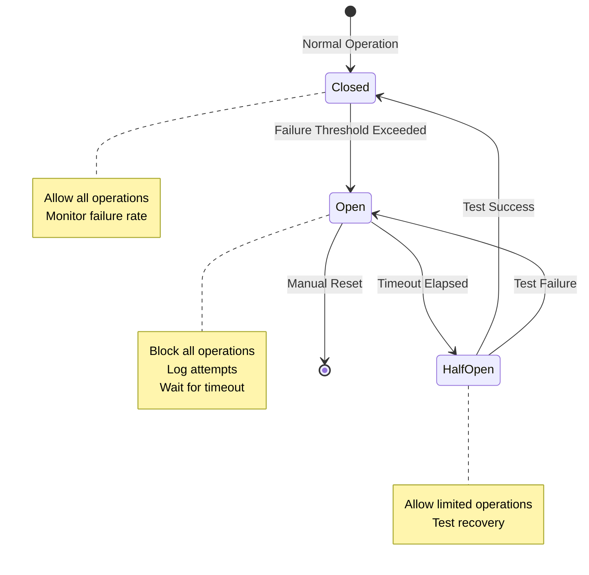

**Implementation**:

```bash
#!/bin/bash
# circuit-breaker.sh - Emergency stop mechanism

BREAKER_FILE="/var/lib/cycletime/circuit-breaker.state"
BREAKER_REASON_FILE="/var/lib/cycletime/circuit-breaker.reason"

# State: closed (normal), open (stopped), half-open (testing)
get_state() {
    if [ ! -f "$BREAKER_FILE" ]; then
        echo "closed"
        return
    fi
    cat "$BREAKER_FILE"
}

# Check if operations should be allowed
check_breaker() {
    STATE=$(get_state)

    case $STATE in
        closed)
            return 0  # Allow operation
            ;;
        open)
            echo "ERROR: Circuit breaker OPEN - operations blocked"
            if [ -f "$BREAKER_REASON_FILE" ]; then
                echo "Reason: $(cat $BREAKER_REASON_FILE)"
            fi
            return 1  # Block operation
            ;;
        half-open)
            echo "WARNING: Circuit breaker HALF-OPEN - limited operations"
            return 0  # Allow operation (testing recovery)
            ;;
    esac
}

# Trip circuit breaker
trip_breaker() {
    REASON="$1"

    echo "========================================="
    echo "CIRCUIT BREAKER TRIPPED"
    echo "========================================="
    echo "Reason: $REASON"
    echo "Timestamp: $(date -u +%Y-%m-%dT%H:%M:%SZ)"

    echo "open" > "$BREAKER_FILE"
    echo "$REASON" > "$BREAKER_REASON_FILE"

    # Kill running Claude Code processes
    pkill -9 -f "claude" || true

    # Alert monitoring system
    logger -t cycletime-breaker -p crit "Circuit breaker tripped: $REASON"

    # Send notification (if configured)
    if [ -n "$SLACK_WEBHOOK_URL" ]; then
        curl -X POST "$SLACK_WEBHOOK_URL" \
            -H 'Content-Type: application/json' \
            -d "{\"text\":\"🚨 CycleTime Circuit Breaker TRIPPED: $REASON\"}"
    fi

    echo "All operations blocked. Manual reset required."
}

# Reset circuit breaker (manual)
reset_breaker() {
    echo "========================================="
    echo "CIRCUIT BREAKER RESET"
    echo "========================================="
    echo "Timestamp: $(date -u +%Y-%m-%dT%H:%M:%SZ)"

    rm -f "$BREAKER_FILE" "$BREAKER_REASON_FILE"

    logger -t cycletime-breaker -p info "Circuit breaker reset"

    echo "Operations enabled. Monitoring resumed."
}

# Test recovery (half-open state)
test_recovery() {
    echo "half-open" > "$BREAKER_FILE"

    echo "Testing recovery..."

    # Run lightweight verification
    if timeout 5m ./gradlew test --tests "*SmokeTest" --no-daemon; then
        echo "✓ Recovery test PASSED"
        reset_breaker
        return 0
    else
        echo "✗ Recovery test FAILED"
        trip_breaker "Recovery test failed"
        return 1
    fi
}

# Monitor and auto-trip
monitor_and_trip() {
    # Check failure rate
    TOTAL_OPS=$(jq -r '1' /var/log/claude/audit.log | wc -l)
    FAILED_OPS=$(jq -r 'select(.result=="failure")' /var/log/claude/audit.log | wc -l)

    if [ $TOTAL_OPS -gt 0 ]; then
        FAILURE_RATE=$(echo "scale=2; $FAILED_OPS * 100 / $TOTAL_OPS" | bc)

        if (( $(echo "$FAILURE_RATE > 50" | bc -l) )); then
            trip_breaker "Failure rate ${FAILURE_RATE}% exceeds threshold (50%)"
            return
        fi
    fi

    # Check suspicious activity
    if grep -q '"result":"blocked"' /var/log/claude/audit.log | tail -100 | wc -l | awk '$1 > 20'; then
        trip_breaker "High rate of blocked operations (>20 in last 100)"
        return
    fi

    # Check memory usage
    MEM_USAGE=$(cat /sys/fs/cgroup/memory.current)
    MEM_LIMIT=$(cat /sys/fs/cgroup/memory.max)
    MEM_PERCENT=$(echo "scale=2; $MEM_USAGE * 100 / $MEM_LIMIT" | bc)

    if (( $(echo "$MEM_PERCENT > 95" | bc -l) )); then
        trip_breaker "Memory usage ${MEM_PERCENT}% exceeds threshold (95%)"
        return
    fi

    # Check CPU throttling
    THROTTLED_TIME=$(cat /sys/fs/cgroup/cpu.stat | grep throttled_usec | awk '{print $2}')
    if [ $THROTTLED_TIME -gt 300000000 ]; then  # 5 minutes
        trip_breaker "Excessive CPU throttling (${THROTTLED_TIME}μs)"
        return
    fi
}

# Main command dispatcher
case "$1" in
    check)
        check_breaker
        ;;
    trip)
        trip_breaker "${2:-Manual trip}"
        ;;
    reset)
        reset_breaker
        ;;
    test)
        test_recovery
        ;;
    monitor)
        monitor_and_trip
        ;;
    *)
        echo "Usage: $0 {check|trip|reset|test|monitor} [reason]"
        exit 1
        ;;
esac
```

### 7.2 Watchdog Process

**Watchdog Implementation**:

```bash
#!/bin/bash
# watchdog.sh - Monitor Claude Code processes and enforce limits

CLAUDE_PROCESS_NAME="claude"
MAX_RUNTIME_SECONDS=3600  # 1 hour
MAX_MEMORY_PERCENT=80
CHECK_INTERVAL=60  # Check every minute
LOG_FILE="/var/log/cycletime/watchdog.log"

log() {
    echo "[$(date -u +%Y-%m-%dT%H:%M:%SZ)] $*" | tee -a "$LOG_FILE"
}

check_process() {
    # Find Claude Code process
    PID=$(pgrep -f "$CLAUDE_PROCESS_NAME" | head -n 1)

    if [ -z "$PID" ]; then
        return 0  # No process running
    fi

    # Check runtime
    RUNTIME=$(ps -o etimes= -p "$PID" 2>/dev/null || echo "0")

    if [ "$RUNTIME" -gt "$MAX_RUNTIME_SECONDS" ]; then
        log "WARNING: Claude Code process $PID exceeded max runtime (${RUNTIME}s > ${MAX_RUNTIME_SECONDS}s)"

        # Graceful shutdown
        log "Sending SIGTERM to process $PID"
        kill -TERM "$PID"
        sleep 10

        # Force kill if still running
        if ps -p "$PID" > /dev/null 2>&1; then
            log "Sending SIGKILL to process $PID"
            kill -KILL "$PID"
        fi

        # Trip circuit breaker
        /usr/local/bin/circuit-breaker.sh trip "Watchdog: Max runtime exceeded (${RUNTIME}s)"
        return 1
    fi

    # Check memory usage
    MEM_PERCENT=$(ps -o %mem= -p "$PID" 2>/dev/null | awk '{print int($1)}')

    if [ -n "$MEM_PERCENT" ] && [ "$MEM_PERCENT" -gt "$MAX_MEMORY_PERCENT" ]; then
        log "WARNING: Claude Code process $PID high memory usage (${MEM_PERCENT}% > ${MAX_MEMORY_PERCENT}%)"

        # Don't kill yet, just alert
        if [ "$MEM_PERCENT" -gt 95 ]; then
            log "CRITICAL: Memory usage critical, terminating process"
            kill -TERM "$PID"
            sleep 5
            kill -KILL "$PID" 2>/dev/null || true

            /usr/local/bin/circuit-breaker.sh trip "Watchdog: Critical memory usage (${MEM_PERCENT}%)"
            return 1
        fi
    fi

    return 0
}

# Main monitoring loop
log "Watchdog started (PID: $$)"
log "Max runtime: ${MAX_RUNTIME_SECONDS}s, Max memory: ${MAX_MEMORY_PERCENT}%"

while true; do
    # Check circuit breaker state
    if ! /usr/local/bin/circuit-breaker.sh check > /dev/null 2>&1; then
        log "Circuit breaker OPEN - monitoring paused"
        sleep $CHECK_INTERVAL
        continue
    fi

    # Check Claude Code process
    check_process

    # Check container health
    /usr/local/bin/circuit-breaker.sh monitor

    sleep $CHECK_INTERVAL
done
```

**Systemd Service** (for container init):

```ini
[Unit]
Description=CycleTime Watchdog
After=network.target

[Service]
Type=simple
User=cycletime
ExecStart=/usr/local/bin/watchdog.sh
Restart=always
RestartSec=10

[Install]
WantedBy=multi-user.target
```

### 7.3 Graceful Shutdown

**Shutdown Script**:

```bash
#!/bin/bash
# graceful-shutdown.sh - Cleanly stop Claude Code operations

TIMEOUT_SECONDS=30

log() {
    echo "[$(date -u +%Y-%m-%dT%H:%M:%SZ)] $*"
    logger -t cycletime-shutdown "$*"
}

log "========================================="
log "GRACEFUL SHUTDOWN INITIATED"
log "========================================="

# 1. Set circuit breaker to prevent new operations
/usr/local/bin/circuit-breaker.sh trip "Graceful shutdown requested"

# 2. Find Claude Code process
CLAUDE_PID=$(pgrep -f "claude" | head -n 1)

if [ -z "$CLAUDE_PID" ]; then
    log "No Claude Code process found"
    exit 0
fi

log "Claude Code process found: PID $CLAUDE_PID"

# 3. Send SIGTERM for graceful shutdown
log "Sending SIGTERM to Claude Code (graceful shutdown)"
kill -TERM "$CLAUDE_PID"

# 4. Wait for graceful shutdown
log "Waiting up to ${TIMEOUT_SECONDS}s for graceful shutdown..."
for i in $(seq 1 $TIMEOUT_SECONDS); do
    if ! ps -p "$CLAUDE_PID" > /dev/null 2>&1; then
        log "✓ Claude Code stopped gracefully after ${i}s"
        exit 0
    fi
    sleep 1
    echo -n "."
done
echo ""

# 5. Force kill if timeout exceeded
log "WARNING: Graceful shutdown timeout exceeded, forcing stop"
kill -KILL "$CLAUDE_PID"

if ps -p "$CLAUDE_PID" > /dev/null 2>&1; then
    log "✗ ERROR: Failed to stop Claude Code process"
    exit 1
fi

log "✓ Claude Code forcibly stopped"
log "========================================="
log "SHUTDOWN COMPLETE"
log "========================================="
```

### 7.4 Emergency Stop Button

**Web Interface** (simple Flask app):

```python
# emergency-stop-server.py
from flask import Flask, render_template, request, jsonify
import subprocess
import logging

app = Flask(__name__)
logging.basicConfig(level=logging.INFO)

@app.route('/')
def index():
    return render_template('emergency_stop.html')

@app.route('/api/status', methods=['GET'])
def status():
    """Get current circuit breaker status"""
    result = subprocess.run(
        ['/usr/local/bin/circuit-breaker.sh', 'check'],
        capture_output=True,
        text=True
    )

    state = "closed" if result.returncode == 0 else "open"

    return jsonify({
        'state': state,
        'message': result.stdout.strip()
    })

@app.route('/api/emergency-stop', methods=['POST'])
def emergency_stop():
    """Emergency stop button endpoint"""
    reason = request.json.get('reason', 'Emergency stop button pressed')

    logging.warning(f"EMERGENCY STOP: {reason}")

    # Trip circuit breaker
    subprocess.run(['/usr/local/bin/circuit-breaker.sh', 'trip', reason])

    # Graceful shutdown
    subprocess.run(['/usr/local/bin/graceful-shutdown.sh'])

    return jsonify({
        'status': 'stopped',
        'message': 'Emergency stop executed successfully'
    })

@app.route('/api/reset', methods=['POST'])
def reset():
    """Reset circuit breaker"""
    logging.info("Circuit breaker reset requested")

    subprocess.run(['/usr/local/bin/circuit-breaker.sh', 'reset'])

    return jsonify({
        'status': 'reset',
        'message': 'Circuit breaker reset successfully'
    })

if __name__ == '__main__':
    app.run(host='0.0.0.0', port=9090)
```

**HTML Template** (templates/emergency_stop.html):

```html
<!DOCTYPE html>
<html>
<head>
    <title>CycleTime Emergency Controls</title>
    <style>
        body {
            font-family: Arial, sans-serif;
            max-width: 600px;
            margin: 50px auto;
            padding: 20px;
        }
        .status {
            padding: 20px;
            border-radius: 5px;
            margin: 20px 0;
        }
        .status.closed { background-color: #d4edda; }
        .status.open { background-color: #f8d7da; }
        button {
            padding: 15px 30px;
            font-size: 16px;
            margin: 10px;
            cursor: pointer;
            border-radius: 5px;
            border: none;
        }
        .emergency-stop {
            background-color: #dc3545;
            color: white;
            font-weight: bold;
        }
        .reset {
            background-color: #28a745;
            color: white;
        }
    </style>
</head>
<body>
    <h1>CycleTime Emergency Controls</h1>

    <div id="status" class="status">
        <h2>Status: <span id="state">Loading...</span></h2>
        <p id="message"></p>
    </div>

    <div>
        <button class="emergency-stop" onclick="emergencyStop()">
            🛑 EMERGENCY STOP
        </button>
        <button class="reset" onclick="reset()">
            ✓ Reset Circuit Breaker
        </button>
    </div>

    <script>
        async function fetchStatus() {
            const response = await fetch('/api/status');
            const data = await response.json();

            document.getElementById('state').textContent = data.state.toUpperCase();
            document.getElementById('message').textContent = data.message;
            document.getElementById('status').className = 'status ' + data.state;
        }

        async function emergencyStop() {
            const reason = prompt('Reason for emergency stop:');
            if (!reason) return;

            if (!confirm('Are you sure you want to EMERGENCY STOP all operations?')) {
                return;
            }

            const response = await fetch('/api/emergency-stop', {
                method: 'POST',
                headers: {'Content-Type': 'application/json'},
                body: JSON.stringify({reason: reason})
            });

            const data = await response.json();
            alert(data.message);
            fetchStatus();
        }

        async function reset() {
            if (!confirm('Reset circuit breaker and resume operations?')) {
                return;
            }

            const response = await fetch('/api/reset', {
                method: 'POST'
            });

            const data = await response.json();
            alert(data.message);
            fetchStatus();
        }

        // Fetch status every 5 seconds
        setInterval(fetchStatus, 5000);
        fetchStatus();
    </script>
</body>
</html>
```

---

## 8. Implementation Roadmap

### 8.1 Phase 1: Container Foundation (SPI-942) - PLANNED

**Timeline**: 2 weeks
**Dependencies**: None
**Risk**: Low

**Tasks**:
1. Create Dockerfile with multi-runtime support (Node.js 20 + OpenJDK 21)
2. Configure base security hardening (remove setuid binaries, disable root)
3. Implement volume mount strategy (read-only workspace + writable overlays)
4. Set up devcontainer.json with basic configuration
5. Test container builds and basic Claude Code execution

**Deliverables**:
- `.devcontainer/Dockerfile` - Multi-runtime container image
- `.devcontainer/devcontainer.json` - VS Code devcontainer configuration
- `.devcontainer/README.md` - Setup and usage documentation
- Validation script verifying container functionality

**Testing Checklist**:
- [ ] Container builds successfully from Dockerfile
- [ ] Node.js 20 installed and functional
- [ ] OpenJDK 21 installed and functional
- [ ] Gradle builds CycleTime successfully
- [ ] Claude Code CLI executes basic commands
- [ ] Volume mounts work as expected (read-only source, writable caches)
- [ ] Non-root user has correct permissions

### 8.2 Phase 2: Network Isolation (SPI-943) - PLANNED

**Timeline**: 1 week
**Dependencies**: SPI-942 (container foundation)
**Risk**: Medium (firewall complexity)

**Tasks**:
1. Implement `init-firewall.sh` script (iptables + ipset configuration)
2. Define CycleTime-specific domain whitelist
3. Configure DNS restrictions (Docker DNS only)
4. Set up firewall verification tests
5. Implement firewall refresh mechanism (hourly cron)
6. Add egress monitoring and logging

**Deliverables**:
- `.devcontainer/init-firewall.sh` - Firewall initialization script
- `.devcontainer/refresh-whitelist.sh` - IP refresh script
- `.devcontainer/whitelist-domains.txt` - Domain whitelist configuration
- Network isolation test suite

**Testing Checklist**:
- [ ] Firewall blocks non-whitelisted domains (example.com)
- [ ] Whitelisted domains accessible (github.com, api.anthropic.com)
- [ ] GitHub IP ranges fetched and updated automatically
- [ ] DNS queries restricted to Docker resolver only
- [ ] Loopback traffic allowed (MCP server localhost:8080)
- [ ] Egress monitoring logs blocked attempts
- [ ] Firewall survives container restart

### 8.3 Phase 3: Resource Limits (SPI-944) - PLANNED

**Timeline**: 1 week
**Dependencies**: SPI-942 (container foundation)
**Risk**: Low

**Tasks**:
1. Configure cgroups v2 limits (CPU, memory, PIDs, disk I/O)
2. Set ulimit constraints for process execution
3. Configure JVM heap sizing for Gradle
4. Configure Node.js heap sizing for Claude Code
5. Implement resource monitoring scripts
6. Test resource limit enforcement

**Deliverables**:
- Updated `.devcontainer/devcontainer.json` with hostConfig limits
- Resource monitoring dashboard queries
- Load testing scripts to validate limits
- Resource limit documentation

**Testing Checklist**:
- [ ] CPU usage capped at 400% (4 cores)
- [ ] Memory usage capped at 8GB (OOM killer activates if exceeded)
- [ ] PID limit enforced (200 max processes)
- [ ] Disk I/O throttling active (100MB/s read, 50MB/s write)
- [ ] Fork bomb prevented by PID limits
- [ ] Resource monitoring detects near-limit conditions
- [ ] Gradle builds complete within resource constraints

### 8.4 Phase 4: Permission Model (SPI-945) - PLANNED

**Timeline**: 1.5 weeks
**Dependencies**: SPI-942 (container foundation)
**Risk**: Medium (git wrapper complexity)

**Tasks**:
1. Implement AppArmor profile for file system restrictions
2. Create git-wrapper.sh for git operation controls
3. Implement Seccomp profile for syscall filtering
4. Configure capability dropping
5. Set up permission violation logging
6. Test permission enforcement

**Deliverables**:
- `.devcontainer/apparmor-profile` - AppArmor MAC policy
- `.devcontainer/seccomp-profile.json` - Seccomp syscall filter
- `.devcontainer/git-wrapper.sh` - Git operation wrapper
- Permission model documentation

**Testing Checklist**:
- [ ] AppArmor blocks writes to /etc/, /usr/, sensitive paths
- [ ] AppArmor allows workspace operations
- [ ] Git wrapper blocks remote operations (push, pull, fetch)
- [ ] Git wrapper prevents commits to main/master branch
- [ ] Seccomp profile blocks dangerous syscalls
- [ ] Capability dropping limits privileged operations
- [ ] Permission violations logged to audit.log

### 8.5 Phase 5: Audit Logging (SPI-946) - PLANNED

**Timeline**: 1 week
**Dependencies**: SPI-942 (container foundation)
**Risk**: Low

**Tasks**:
1. Implement AuditLogger Kotlin library
2. Instrument file operations with logging
3. Instrument command execution with logging
4. Instrument network requests with logging
5. Set up log rotation
6. Configure Fluent Bit log shipping (optional)

**Deliverables**:
- `src/main/kotlin/io/spiralhouse/cycletime/safety/AuditLogger.kt`
- Updated operation wrappers with audit logging
- Log rotation configuration
- Fluent Bit configuration (for centralized logging)

**Testing Checklist**:
- [ ] File operations logged with timestamps, paths, results
- [ ] Command executions logged with duration, exit codes
- [ ] Network requests logged with destinations, response codes
- [ ] Logs in valid JSON Lines format
- [ ] Log rotation prevents unbounded growth
- [ ] Fluent Bit ships logs to Elasticsearch (if configured)

### 8.6 Phase 6: Rollback System (SPI-947) - PLANNED

**Timeline**: 1.5 weeks
**Dependencies**: SPI-942 (container foundation), SPI-946 (audit logging)
**Risk**: Medium (verification complexity)

**Tasks**:
1. Implement pre-run-snapshot.sh
2. Implement post-verification.sh
3. Implement rollback.sh
4. Create run-with-recovery.sh orchestration script
5. Set up snapshot retention policy
6. Test rollback scenarios

**Deliverables**:
- `/usr/local/bin/pre-run-snapshot.sh` - Snapshot creation
- `/usr/local/bin/post-verification.sh` - Verification suite
- `/usr/local/bin/rollback.sh` - Rollback execution
- `/usr/local/bin/run-with-recovery.sh` - Orchestration
- Rollback test suite

**Testing Checklist**:
- [ ] Pre-run snapshots capture git commit, file checksums, container state
- [ ] Post-verification runs tests, detekt, kover, build
- [ ] Rollback restores to pre-run commit successfully
- [ ] Rollback cleans untracked files
- [ ] Failed verification triggers automatic rollback
- [ ] Snapshot retention policy keeps 20 recent + 7 days
- [ ] Recovery workflow retries up to 3 times

### 8.7 Phase 7: Emergency Controls (SPI-948) - PLANNED

**Timeline**: 1 week
**Dependencies**: SPI-946 (audit logging), SPI-947 (rollback system)
**Risk**: Low

**Tasks**:
1. Implement circuit-breaker.sh
2. Implement watchdog.sh monitoring process
3. Implement graceful-shutdown.sh
4. Create emergency stop web interface (optional)
5. Configure monitoring and auto-trip rules
6. Test emergency scenarios

**Deliverables**:
- `/usr/local/bin/circuit-breaker.sh` - Circuit breaker logic
- `/usr/local/bin/watchdog.sh` - Monitoring daemon
- `/usr/local/bin/graceful-shutdown.sh` - Shutdown script
- `/usr/local/bin/emergency-stop-server.py` - Web interface (optional)
- Emergency procedures documentation

**Testing Checklist**:
- [ ] Circuit breaker trips on high failure rate (>50%)
- [ ] Circuit breaker trips on suspicious activity
- [ ] Circuit breaker trips on resource exhaustion
- [ ] Watchdog terminates processes exceeding max runtime (1 hour)
- [ ] Watchdog terminates processes exceeding memory limits (80%)
- [ ] Graceful shutdown stops Claude Code within timeout (30s)
- [ ] Manual emergency stop button works via web interface
- [ ] Circuit breaker reset resumes operations

### 8.8 Phase 8: Monitoring Integration (SPI-949) - PLANNED

**Timeline**: 1 week
**Dependencies**: SPI-946 (audit logging), SPI-948 (emergency controls)
**Risk**: Low

**Tasks**:
1. Set up Prometheus metrics exporters
2. Configure Grafana dashboards
3. Define alert rules and thresholds
4. Set up alert routing (Slack, PagerDuty)
5. Create monitoring runbooks
6. Test end-to-end monitoring

**Deliverables**:
- Prometheus configuration
- Grafana dashboard JSON
- Alert rules YAML
- Alertmanager configuration
- Monitoring runbook documentation

**Testing Checklist**:
- [ ] Container metrics exported to Prometheus
- [ ] Audit log metrics exported (success rate, blocked ops, errors)
- [ ] Grafana dashboards visualize metrics correctly
- [ ] Alerts fire when thresholds exceeded
- [ ] Alert routing delivers to Slack/PagerDuty
- [ ] Monitoring detects and alerts on real issues

### 8.9 Phase 9: Documentation & Training (SPI-950) - PLANNED

**Timeline**: 1 week
**Dependencies**: All previous phases
**Risk**: Low

**Tasks**:
1. Write operational runbook
2. Create troubleshooting guide
3. Document emergency procedures
4. Create video walkthrough
5. Conduct internal training sessions
6. Gather feedback and iterate

**Deliverables**:
- `docs/operations/unattended-operations-runbook.md`
- `docs/operations/troubleshooting-guide.md`
- `docs/operations/emergency-procedures.md`
- Video walkthrough (15-20 minutes)
- Training materials and slides

**Completion Criteria**:
- [ ] Operational runbook covers all common scenarios
- [ ] Troubleshooting guide addresses known issues
- [ ] Emergency procedures clearly documented
- [ ] Video demonstrates end-to-end workflow
- [ ] Team trained on safety architecture
- [ ] Feedback incorporated into documentation

### 8.10 Implementation Timeline

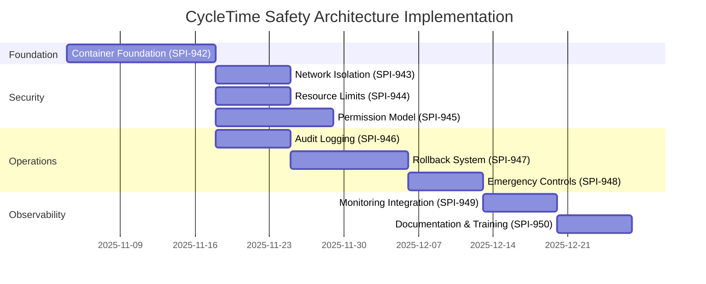

**Total Duration**: ~9 weeks (with some parallel work)

**Critical Path**: 942 → 946 → 947 → 948 → 949 → 950

---

## 9. Operational Procedures

### 9.1 Daily Operations

**Pre-Flight Checklist**:

```bash
#!/bin/bash
# pre-flight-check.sh - Verify system health before operations

echo "========================================="
echo "PRE-FLIGHT HEALTH CHECK"
echo "========================================="

# 1. Check container status
if [ "$DEVCONTAINER" != "true" ]; then
    echo "✗ Not running in devcontainer"
    exit 1
fi
echo "✓ Devcontainer environment verified"

# 2. Check firewall status
if ! iptables -L OUTPUT | grep -q "REJECT"; then
    echo "✗ Firewall not active"
    exit 1
fi
echo "✓ Firewall active and configured"

# 3. Check circuit breaker
if ! /usr/local/bin/circuit-breaker.sh check > /dev/null 2>&1; then
    echo "✗ Circuit breaker OPEN - operations blocked"
    exit 1
fi
echo "✓ Circuit breaker CLOSED (normal operation)"

# 4. Check resource availability
MEM_AVAIL=$(cat /sys/fs/cgroup/memory.max)
MEM_USED=$(cat /sys/fs/cgroup/memory.current)
MEM_PERCENT=$(echo "scale=2; $MEM_USED * 100 / $MEM_AVAIL" | bc)

if (( $(echo "$MEM_PERCENT > 80" | bc -l) )); then
    echo "⚠ WARNING: Memory usage high (${MEM_PERCENT}%)"
else
    echo "✓ Memory usage normal (${MEM_PERCENT}%)"
fi

# 5. Check disk space
DISK_AVAIL=$(df /workspace | tail -1 | awk '{print $4}')
if [ $DISK_AVAIL -lt 10485760 ]; then  # 10GB
    echo "⚠ WARNING: Low disk space ($(( $DISK_AVAIL / 1024 / 1024 ))GB available)"
else
    echo "✓ Disk space adequate ($(( $DISK_AVAIL / 1024 / 1024 ))GB available)"
fi

# 6. Check git status
if ! git status > /dev/null 2>&1; then
    echo "✗ Git repository not accessible"
    exit 1
fi
echo "✓ Git repository accessible"

# 7. Check authentication
if ! claude /status > /dev/null 2>&1; then
    echo "✗ Claude Code authentication failed"
    exit 1
fi
echo "✓ Claude Code authenticated"

# 8. Check watchdog process
if ! pgrep -f "watchdog.sh" > /dev/null; then
    echo "⚠ WARNING: Watchdog process not running"
    /usr/local/bin/watchdog.sh &
else
    echo "✓ Watchdog process running"
fi

echo ""
echo "========================================="
echo "PRE-FLIGHT CHECK: PASSED"
echo "========================================="
echo "System ready for operations"
```

**Daily Monitoring**:

```bash
#!/bin/bash
# daily-health-check.sh - Morning health check routine

echo "Daily Health Check - $(date +%Y-%m-%d)"
echo ""

# Audit log analysis
echo "=== Audit Log Summary (Last 24 Hours) ==="
LOG_FILE="/var/log/claude/audit.log"
CUTOFF=$(date -u -d "24 hours ago" +%Y-%m-%dT%H:%M:%S)

TOTAL_OPS=$(jq -r "select(.timestamp > \"$CUTOFF\")" "$LOG_FILE" | wc -l)
SUCCESS_OPS=$(jq -r "select(.timestamp > \"$CUTOFF\" and .result == \"success\")" "$LOG_FILE" | wc -l)
FAILURE_OPS=$(jq -r "select(.timestamp > \"$CUTOFF\" and .result == \"failure\")" "$LOG_FILE" | wc -l)
BLOCKED_OPS=$(jq -r "select(.timestamp > \"$CUTOFF\" and .result == \"blocked\")" "$LOG_FILE" | wc -l)

echo "Total operations: $TOTAL_OPS"
echo "Success: $SUCCESS_OPS"
echo "Failure: $FAILURE_OPS"
echo "Blocked: $BLOCKED_OPS"

if [ $TOTAL_OPS -gt 0 ]; then
    SUCCESS_RATE=$(echo "scale=2; $SUCCESS_OPS * 100 / $TOTAL_OPS" | bc)
    echo "Success rate: ${SUCCESS_RATE}%"
fi

echo ""

# Resource usage trends
echo "=== Resource Usage Trends ==="
docker stats cycletime-claude-code --no-stream --format "table {{.CPUPerc}}\t{{.MemUsage}}\t{{.NetIO}}\t{{.BlockIO}}"

echo ""

# Snapshot count
echo "=== Snapshot Status ==="
SNAPSHOT_COUNT=$(ls /var/lib/cycletime/snapshots/pre-run-*.json 2>/dev/null | wc -l)
SNAPSHOT_SIZE=$(du -sh /var/lib/cycletime/snapshots 2>/dev/null | awk '{print $1}')
echo "Snapshots: $SNAPSHOT_COUNT (${SNAPSHOT_SIZE})"

echo ""

# Recent alerts
echo "=== Recent Alerts (Last 24 Hours) ==="
journalctl -u cycletime-watchdog --since "24 hours ago" --no-pager | grep -i "alert\|warning\|error" | tail -10
```

### 9.2 Incident Response

**Incident Severity Levels**:

| Severity | Definition | Response Time | Escalation |
|----------|-----------|---------------|------------|
| **SEV-1 (Critical)** | Production operations blocked, data loss risk | < 15 minutes | Immediate escalation to on-call engineer |
| **SEV-2 (High)** | Degraded operations, rollbacks failing | < 1 hour | Escalate if unresolved in 2 hours |
| **SEV-3 (Medium)** | Performance issues, high resource usage | < 4 hours | Escalate if unresolved in 8 hours |
| **SEV-4 (Low)** | Minor issues, cosmetic problems | < 1 day | No escalation |

**Incident Response Procedures**:

**SEV-1: Container Unresponsive**

```bash
# 1. Verify incident
docker ps | grep cycletime-claude-code

# 2. Check container logs
docker logs cycletime-claude-code --tail 100

# 3. Attempt graceful restart
docker exec cycletime-claude-code /usr/local/bin/graceful-shutdown.sh
docker restart cycletime-claude-code

# 4. If restart fails, force restart
docker stop cycletime-claude-code
docker start cycletime-claude-code

# 5. Verify post-restart health
docker exec cycletime-claude-code /usr/local/bin/pre-flight-check.sh

# 6. Document incident
cat > /var/log/cycletime/incidents/$(date +%Y%m%d-%H%M%S)-sev1.txt <<EOF
Incident: Container Unresponsive
Severity: SEV-1
Timestamp: $(date -u +%Y-%m-%dT%H:%M:%SZ)
Actions Taken:
- Checked container status: [status]
- Reviewed logs: [summary]
- Restarted container: [success/failure]
Resolution: [resolved/escalated]
EOF
```

**SEV-2: Circuit Breaker Tripped**

```bash
# 1. Check circuit breaker state
/usr/local/bin/circuit-breaker.sh check

# 2. Review audit logs for cause
tail -100 /var/log/claude/audit.log | jq 'select(.result == "failure" or .result == "blocked")'

# 3. Identify root cause
# - High failure rate?
# - Suspicious activity?
# - Resource exhaustion?

# 4. Remediate root cause
# Example: If memory exhaustion
docker stats cycletime-claude-code --no-stream
# Increase memory limit if justified

# 5. Test recovery
/usr/local/bin/circuit-breaker.sh test

# 6. Reset circuit breaker if test passes
/usr/local/bin/circuit-breaker.sh reset

# 7. Monitor for recurrence
tail -f /var/log/claude/audit.log
```

**SEV-3: High Resource Usage**

```bash
# 1. Identify resource bottleneck
docker stats cycletime-claude-code --no-stream

# 2. Review resource-intensive operations
jq -r 'select(.duration_ms > 1000) | "\(.timestamp) \(.type) \(.resource) \(.duration_ms)ms"' \
    /var/log/claude/audit.log | tail -50

# 3. Check for resource leaks
docker exec cycletime-claude-code ps aux --sort=-%mem | head -20

# 4. Consider temporary limit increase
# Edit .devcontainer/devcontainer.json
# Rebuild container

# 5. Optimize workload if possible
# Example: Reduce Gradle parallel workers
# Edit gradle.properties: org.gradle.workers.max=2
```

### 9.3 Maintenance Windows

**Weekly Maintenance Checklist**:

```bash
#!/bin/bash
# weekly-maintenance.sh

echo "========================================="
echo "WEEKLY MAINTENANCE"
echo "========================================="
echo "Date: $(date +%Y-%m-%d)"
echo ""

# 1. Update base image
echo "[1/7] Updating base image..."
docker pull node:20-bookworm

# 2. Rebuild devcontainer
echo "[2/7] Rebuilding devcontainer..."
docker build -t cycletime-claude-code .devcontainer/

# 3. Rotate API keys (if scheduled)
echo "[3/7] Checking API key rotation schedule..."
# Rotate every 90 days
KEY_AGE=$(( ($(date +%s) - $(stat -c %Y /run/secrets/anthropic_api_key)) / 86400 ))
if [ $KEY_AGE -gt 90 ]; then
    echo "⚠ WARNING: API key age: ${KEY_AGE} days (rotate at 90 days)"
fi

# 4. Clean old snapshots
echo "[4/7] Cleaning old snapshots..."
/usr/local/bin/cleanup-snapshots.sh

# 5. Vacuum audit logs
echo "[5/7] Compressing old audit logs..."
find /var/log/claude -name "audit.log.*" -mtime +7 -exec gzip {} \;

# 6. Update firewall whitelist
echo "[6/7] Refreshing firewall whitelist..."
docker exec cycletime-claude-code /usr/local/bin/refresh-whitelist.sh

# 7. Backup configuration
echo "[7/7] Backing up configuration..."
tar -czf /backup/cycletime-config-$(date +%Y%m%d).tar.gz \
    .devcontainer/ \
    /var/lib/cycletime/snapshots/

echo ""
echo "========================================="
echo "WEEKLY MAINTENANCE: COMPLETE"
echo "========================================="
```

### 9.4 Troubleshooting Guide

**Common Issues**:

| Issue | Symptoms | Diagnosis | Resolution |
|-------|----------|-----------|------------|
| Firewall blocks required service | `npm install` fails with timeout | Check egress logs: `iptables -L OUTPUT -v` | Add domain to whitelist, refresh firewall |
| Git operations slow | Commits take >30 seconds | Check git config, verify no remote hooks | Disable auto-fetch, optimize git config |
| Memory OOM killed | Container stops unexpectedly | Check `docker logs` for OOM message | Increase memory limit or optimize workload |
| Circuit breaker tripped | Operations blocked | Check `/var/lib/cycletime/circuit-breaker.reason` | Remediate cause, test recovery, reset |
| Watchdog terminates process | Claude Code stops after 1 hour | Check watchdog logs | Increase MAX_RUNTIME_SECONDS or optimize task |
| Tests fail after changes | Post-verification fails | Review test output, check code changes | Fix failing tests or rollback changes |

---

## 10. Security Considerations

### 10.1 Threat Mitigation Summary

Refer to Section 1.5 for complete threat model. Key mitigations:

- **Data Exfiltration**: Firewall blocks non-whitelisted domains (LOW residual risk)
- **Credential Theft**: No credentials mounted, read-only sensitive paths (LOW residual risk)
- **Privilege Escalation**: Multi-layer defense-in-depth (LOW residual risk)
- **Resource Exhaustion**: cgroups hard limits prevent host impact (LOW residual risk)
- **Malicious Code Injection**: Git rollback + test verification (MEDIUM residual risk - requires code review)

### 10.2 Compliance Alignment

This architecture supports compliance with:

- **SOC 2 Type II**: Access controls, audit logging, incident response, disaster recovery
- **ISO 27001**: Risk assessment, defense-in-depth, monitoring, business continuity
- **GDPR**: Audit logging for data access, automated data deletion capabilities
- **NIST Cybersecurity Framework**: Identify, Protect, Detect, Respond, Recover functions

### 10.3 Audit Requirements

**Required Audit Logs**:
- All file system operations (read, write, delete)
- All command executions (command, exit code, duration)
- All network requests (destination, status, duration)
- All git operations (branch, commit, operation type)
- All authentication events
- All circuit breaker state changes
- All emergency stop invocations

**Retention**: Minimum 90 days for operational logs, 1 year for security-relevant events

**Access Controls**: Audit logs read-only to Claude Code, writable only by logging subsystem

---

## 11. Future Enhancements

### 11.1 Advanced Security Features

**Machine Learning-Based Anomaly Detection**:
- Train models on normal operation patterns
- Detect anomalous behavior in real-time
- Auto-trip circuit breaker on detected anomalies
- **Timeline**: 6-12 months post-GA

**Formal Verification of Safety Properties**:
- Mathematical proofs of security guarantees
- Verify resource limits cannot be exceeded
- Verify firewall rules prevent exfiltration
- **Timeline**: 12-18 months post-GA

**Hardware-Based Isolation (TEE)**:
- Trusted Execution Environment for sensitive operations
- Intel SGX or AMD SEV for memory encryption
- Attestation and sealed storage
- **Timeline**: 18-24 months post-GA

### 11.2 Operational Improvements

**Automated Remediation**:
- Self-healing for common failure modes
- Automatic resource limit adjustment based on workload
- Intelligent circuit breaker with adaptive thresholds
- **Timeline**: 3-6 months post-GA

**Advanced Rollback Strategies**:
- Incremental rollback (undo specific changes only)
- Multi-level snapshots (file, directory, project)
- Git bisect integration for regression hunting
- **Timeline**: 6-9 months post-GA

**Distributed Tracing**:
- OpenTelemetry integration
- End-to-end request tracing across MCP, Claude Code, services
- Performance bottleneck identification
- **Timeline**: 6-9 months post-GA

### 11.3 Scalability Enhancements

**Multi-Container Orchestration**:
- Kubernetes deployment for production scale
- Separate containers for build, test, deployment stages
- Resource pooling and autoscaling
- **Timeline**: 9-12 months post-GA

**Distributed Audit Logging**:
- Stream logs to distributed systems (Kafka, Kinesis)
- Real-time log analytics with sub-second latency
- Long-term cold storage (S3 Glacier)
- **Timeline**: 6-9 months post-GA

---

## 12. References

### 12.1 Research & Standards

- **SPI-940**: DevContainer Best Practices for Claude Code CLI (research document)
- **Anthropic DevContainer**: Official implementation (github.com/anthropics/claude-code/.devcontainer)
- **OWASP Container Security**: Docker Security Cheat Sheet
- **NIST SP 800-190**: Application Container Security Guide
- **CIS Docker Benchmark**: Docker security hardening guide

### 12.2 Technology Documentation

- **Docker Security**: docs.docker.com/engine/security/
- **Seccomp**: docs.docker.com/engine/security/seccomp/
- **AppArmor**: gitlab.com/apparmor/apparmor/-/wikis/home
- **cgroups v2**: kernel.org/doc/html/latest/admin-guide/cgroup-v2.html
- **iptables**: netfilter.org/documentation/

### 12.3 Community Resources

- **Claude Code in DevContainer**: medium.com/@a8n.one/how-to-isolate-claude-code-using-devcontainer-setup-68f8e2d109c8
- **Secure AI Development**: medium.com/@brett_4870/building-a-secure-ai-development-environment-containerized-claude-code-mcp-integration-e2129fe3af5a
- **Claudetainer Project**: github.com/smithclay/claudetainer

---

## Appendices

### Appendix A: Configuration Files

Complete configuration files are available in:
- `.devcontainer/Dockerfile` - Container image definition
- `.devcontainer/devcontainer.json` - VS Code devcontainer configuration
- `.devcontainer/init-firewall.sh` - Network isolation script
- `.devcontainer/apparmor-profile` - AppArmor MAC policy
- `.devcontainer/seccomp-profile.json` - Seccomp syscall filter

### Appendix B: Glossary

- **AppArmor**: Linux Security Module providing Mandatory Access Control
- **Circuit Breaker**: Safety pattern that stops operations when failure thresholds exceeded
- **cgroups**: Linux control groups for resource limiting and isolation
- **DevContainer**: VS Code development container specification
- **Defense-in-Depth**: Security strategy using multiple overlapping protection layers
- **ipset**: Linux kernel extension for efficient IP address management
- **iptables**: Linux firewall configuration tool
- **Seccomp**: Secure Computing Mode for syscall filtering
- **Watchdog**: Monitoring process that enforces operational limits

### Appendix C: Acronyms

- **API**: Application Programming Interface
- **CLI**: Command Line Interface
- **CPU**: Central Processing Unit
- **DoS**: Denial of Service
- **GDPR**: General Data Protection Regulation
- **I/O**: Input/Output
- **ISO**: International Organization for Standardization
- **JVM**: Java Virtual Machine
- **MAC**: Mandatory Access Control
- **MCP**: Model Context Protocol
- **NIST**: National Institute of Standards and Technology
- **OOM**: Out of Memory
- **PID**: Process Identifier
- **RAM**: Random Access Memory
- **REST**: Representational State Transfer
- **SEV**: Severity
- **SOC**: Service Organization Control
- **SSH**: Secure Shell
- **TEE**: Trusted Execution Environment

---

## Document Metadata

**Version**: 1.0
**Author**: CycleTime Architecture Team
**Date**: 2025-11-03
**Status**: DRAFT (SPI-941 In Progress)
**Review Cycle**: Quarterly (or after major security incidents)
**Next Review**: 2025-02-03

**Change Log**:

| Version | Date | Author | Changes |
|---------|------|--------|---------|
| 1.0 | 2025-11-03 | Architecture Team | Initial architecture document based on SPI-940 research |

---

**End of Document**
