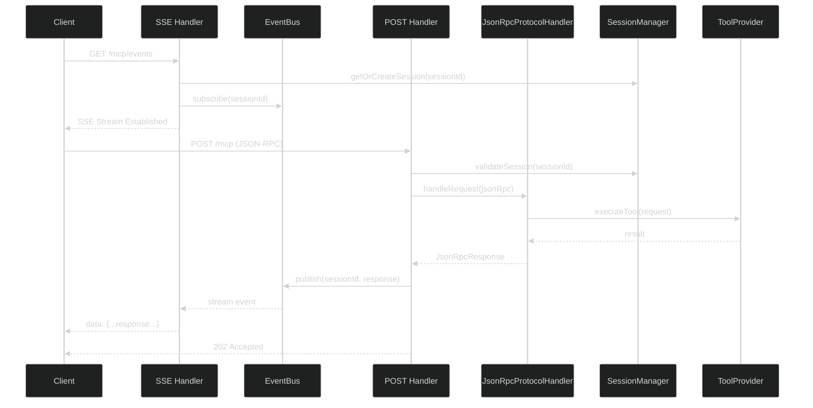
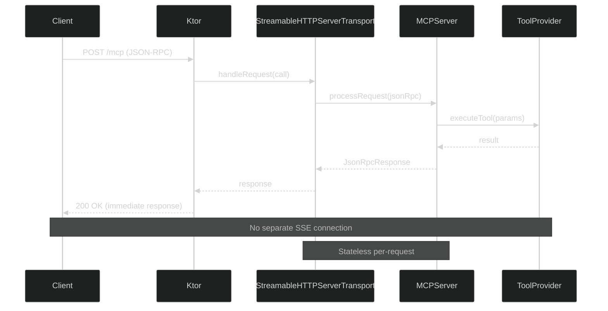

# MCP SDK Migration Design Document

**Issue:** SPI-701
**Story Points:** 3
**Version:** 1.0
**Date:** January 2025
**Authors:** Developer Agent, Claude Code

**Related Issues:**
- **Parent Epic:** SPI-700 - Adopt Official MCP Kotlin SDK
- **Follow-up Stories:** SPI-702 through SPI-707

**Related Documents:**
🏗️ [Architecture Overview](overview.md) | 🧪 [Testing Standards](../../.claude/shared/testing-standards.md) | 🔐 [Session Management](session-management.md)

---

## 1. Executive Summary

### Current State
CycleTime CE implements a custom MCP server using:
- **EventBus** for session-based request/response correlation
- **SSE (Server-Sent Events)** for server-to-client streaming
- **HTTP POST** handler with 202 Accepted responses
- **Custom JSON-RPC protocol handling** with validation
- **Session-based architecture** with persistent state management

```kotlin
// Current Architecture Pattern
Client → GET /mcp/events → SSE Stream ← EventBus ← POST /mcp → Session
                          ↑                          ↓
                          └──── Correlated Events ────┘
```

### Target State
Adopt the official MCP Kotlin SDK (v0.1.0) using:
- **StreamableHTTPServerTransport** for per-request handling
- **MCPServer** built-in protocol handling
- **SDK-native tool/resource registration**
- **Stateless per-request transport** with optional session management

```kotlin
// Target Architecture Pattern
Client → POST /mcp → StreamableHTTPServerTransport → MCPServer → Response
                     ↑                                ↓
                     └──── SDK Internal Handling ─────┘
```

### Migration Rationale
1. **Official Support**: Leverage SDK maintained by MCP team
2. **Protocol Compliance**: Automatic updates to MCP spec changes
3. **Reduced Maintenance**: Eliminate custom protocol handling code
4. **Future-Proofing**: SDK will support upcoming MCP features
5. **Best Practices**: Follow reference implementation patterns

### Timeline & Effort
- **Total Duration**: 21 days (3 weeks)
- **Total Effort**: 22 story points across 6 stories
- **Risk Level**: Medium-High (SDK alpha status, paradigm shift)

### Risk Assessment Summary
| Risk | Impact | Probability | Mitigation Strategy |
|------|--------|-------------|---------------------|
| SDK Alpha Instability | High | Medium | Extensive testing, rollback plan |
| Paradigm Mismatch (Session vs Stateless) | High | Medium | Adapter layer, early prototyping |
| Test Migration Complexity | Medium | High | Incremental migration, pattern documentation |
| Performance Regression | Medium | Low | Early benchmarking, profiling |
| Unknown SDK Limitations | High | Medium | MCP Inspector validation, SDK maintainer contact |

---

## 2. Architectural Analysis

### 2.1 Current Architecture Deep Dive

#### Component Inventory

**Transport Layer:**
- `MCPSSEHandler.kt` - SSE endpoint for streaming events to clients
- `MCPPostHandler.kt` - HTTP POST handler for client requests
- `EventBus.kt` - Session-based event correlation and distribution
- `MessageCorrelator.kt` - Request/response tracking

**Protocol Layer:**
- `JsonRpcProtocolHandler.kt` - JSON-RPC 2.0 request/response handling
- `JsonRpcRequestValidator.kt` - Request validation and error handling
- `JsonRpcRequest.kt`, `JsonRpcResponse.kt` - Protocol data models
- `JsonRpcError.kt`, `JsonRpcErrorCodes.kt` - Error handling

**Session Layer:**
- `MCPSessionManager.kt` - Session lifecycle management
- `SessionApplicationService.kt` - Session business logic
- `H2SessionRepository.kt` - Session persistence

**Tool/Resource Layer:**
- `ToolRegistry.kt`, `ResourceRegistry.kt` - Provider discovery
- `DefaultProjectToolProvider.kt`, `DefaultIssueToolProvider.kt`, etc. - 4 tool providers
- `DefaultResourceProviders.kt` - 3 resource providers

**Integration Layer:**
- `MCPIntegrationService.kt` - Application startup integration
- `MCPConfiguration.kt` - Ktor routing setup

#### Current Request Flow



#### Session Correlation Architecture

The current system uses **EventBus** to correlate requests and responses across separate HTTP connections:

1. **SSE Connection**: Establishes long-lived stream for session
2. **POST Requests**: Submit work, return 202 Accepted immediately
3. **EventBus**: Buffers responses until SSE connection ready
4. **Correlation**: Session ID links POST requests to SSE streams

**Key Characteristics:**
- ✅ **Async-first**: Responses stream independently of request
- ✅ **Session-aware**: Context persists across requests
- ✅ **Resilient**: EventBus buffers up to 1000 events per session
- ❌ **Custom Protocol**: Requires manual JSON-RPC handling
- ❌ **Complex Testing**: Separate SSE/POST test scenarios

### 2.2 Target Architecture (SDK-Based)

#### SDK Component Overview

The MCP Kotlin SDK (v0.1.0) provides:

**Core Components:**
- `MCPServer` - Server lifecycle and request routing
- `StreamableHTTPServerTransport` - Per-request HTTP transport
- `Tool`, `Resource`, `Prompt` - Built-in protocol types
- Protocol handlers - JSON-RPC 2.0 implementation
- Error handling - Standardized MCP error codes

**Integration Pattern:**
```kotlin
// SDK Setup Pattern (Conceptual)
val server = MCPServer()
    .withToolProvider(projectToolProvider)
    .withToolProvider(issueToolProvider)
    .withResourceProvider(projectResourceProvider)
    .withTransport(StreamableHTTPServerTransport())
    .build()

// Ktor Integration
routing {
    post("/mcp") {
        server.handleRequest(call)
    }
}
```

#### SDK Request Flow (Stateless Per-Request)



#### Key Architectural Differences

| Aspect | Current (EventBus) | Target (SDK) | Impact |
|--------|-------------------|--------------|--------|
| **State Management** | Session-based across requests | Per-request stateless | HIGH - Must preserve session context |
| **Correlation** | EventBus channels by session | SDK internal per-request | HIGH - Lose async response buffering |
| **Protocol Handling** | Custom JsonRpc* classes | SDK built-in | MEDIUM - Delete custom code |
| **Transport** | SSE + POST split | Single POST endpoint | HIGH - Rewrite integration tests |
| **Response Timing** | 202 Accepted + async stream | 200 OK immediate | MEDIUM - Client behavior change |
| **Error Handling** | Custom JsonRpcError | SDK standardized | LOW - Map to SDK errors |
| **Testing** | Separate SSE/POST scenarios | Single request/response | MEDIUM - Rewrite test patterns |

### 2.3 Critical Paradigm Shift: Session vs Stateless

**Current Paradigm:**
- Sessions persist across multiple requests
- EventBus maintains request/response correlation
- SSE connection keeps session "alive"
- Context stored in H2 database between requests

**SDK Paradigm:**
- Each HTTP request is independent
- No built-in session correlation
- Responses are immediate, not streamed
- Must explicitly manage session state

**Migration Challenge:**
The SDK's stateless per-request model **does not natively support** our session-based architecture. We must determine:
1. Can SDK be adapted to support sessions?
2. Do we need an adapter layer above SDK?
3. Should we redesign session management?

**Proposed Solution (TBD in Phase 2 Prototype):**
- Option A: Adapter layer that wraps SDK with session management
- Option B: Redesign sessions to work within stateless model
- Option C: Hybrid approach with optional session state

---

## 3. Migration Phases (Detailed)

### Phase 1: Foundation & Planning (SPI-701, SPI-702)
**Duration:** 3 days (Days 1-3)
**Effort:** 4 story points
**Risk:** Low

#### SPI-701: Create Migration Design Document (3 points)
**Deliverable:** This document
**Success Criteria:**
- ✅ All 10 sections complete
- ✅ Risk assessment identifies SDK alpha concerns
- ✅ Migration phases have clear gates
- ✅ Rollback strategy documented
- ✅ Technical decisions outlined

**Activities:**
1. Analyze current architecture (COMPLETED)
2. Research SDK patterns and capabilities
3. Identify critical risks and mitigations
4. Define phase gates and success metrics
5. Create rollback plan

#### SPI-702: Add SDK Dependency (1 point)
**Deliverable:** SDK dependency added to build
**Success Criteria:**
- ✅ `gradle/libs.versions.toml` includes SDK reference
- ✅ `build.gradle.kts` includes SDK dependency
- ✅ `./gradlew dependencies` shows SDK in tree
- ✅ All existing tests still pass (820/820)

**Activities:**
```kotlin
// gradle/libs.versions.toml (ALREADY EXISTS)
mcp-sdk = "0.1.0"
mcp-kotlin-sdk = { module = "io.modelcontextprotocol:kotlin-sdk", version.ref = "mcp-sdk" }

// build.gradle.kts (ADD)
dependencies {
    implementation(libs.mcp.kotlin.sdk)
}
```

**Validation:**
```bash
./gradlew dependencies | grep mcp-kotlin-sdk
./gradlew test  # Verify 820/820 passing
```

**Go/No-Go Gate 1:**
- ✅ GO: SDK dependency resolves, build succeeds
- ❌ NO-GO: Dependency conflicts → Resolve before proceeding

---

### Phase 2: Transport Layer Migration (SPI-703)
**Duration:** 5 days (Days 4-8)
**Effort:** 5 story points
**Risk:** High (Paradigm shift, session management)

#### SPI-703: Replace EventBus/SSE with SDK Transport
**Deliverable:** SDK-based transport layer working end-to-end

**Critical Decision Point:** Session Management Strategy
Before implementation, **PROTOTYPE** the following approaches:

**Approach 1: Adapter Layer (Preserve Current Behavior)**
```kotlin
class SessionAwareMCPTransport(
    private val sdkTransport: StreamableHTTPServerTransport,
    private val sessionManager: MCPSessionManager
) {
    suspend fun handleRequest(call: ApplicationCall) {
        val sessionId = call.request.headers["Mcp-Session-Id"]
        val session = sessionManager.getOrCreateSession(sessionId)

        // Inject session context into SDK request
        val response = sdkTransport.handleRequest(call) { request ->
            request.withContext("sessionId", sessionId)
        }

        // Update session after response
        sessionManager.updateActivity(sessionId)
        return response
    }
}
```

**Approach 2: SDK-Native Stateless (Redesign Sessions)**
```kotlin
// Sessions become purely optional client-side state
// Server tracks minimal session info for auth/metrics only
val server = MCPServer()
    .withMiddleware(SessionTrackingMiddleware()) // Optional tracking
    .build()
```

**Prototype Requirements:**
1. Test SDK's session handling capabilities
2. Validate Claude Code can connect and initialize
3. Measure performance vs current implementation
4. Document API changes required for clients

**Implementation Steps:**

**Step 1: Create SDK Transport Wrapper**
```kotlin
// New file: mcp/transport/KtorSDKTransport.kt
class KtorSDKTransport(
    private val mcpServer: MCPServer
) {
    suspend fun handleRequest(call: ApplicationCall) {
        // Adapter between Ktor and SDK transport
    }
}
```

**Step 2: Initialize MCPServer**
```kotlin
// Update: mcp/server/MCPServerEngine.kt
class MCPServerEngine {
    fun initialize(): MCPServer {
        return MCPServer()
            .withToolProvider(/* ... */)
            .withResourceProvider(/* ... */)
            .build()
    }
}
```

**Step 3: Update Ktor Routing**
```kotlin
// Update: mcp/MCPServer.kt
fun Routing.configureMCP() {
    val mcpServer: MCPServer by application.dependencies
    val transport = KtorSDKTransport(mcpServer)

    post("/mcp") {
        transport.handleRequest(call)
    }

    // Remove: mcpSSEEndpoint, mcpPostEndpoint (old handlers)
}
```

**Step 4: Archive Legacy Components**
```bash
# Archive old transport code
mkdir -p archive/spi-700-legacy-transport
git mv src/main/kotlin/io/spiralhouse/cycletime/mcp/sse archive/
git mv src/main/kotlin/io/spiralhouse/cycletime/mcp/correlation archive/
git mv src/main/kotlin/io/spiralhouse/cycletime/mcp/http/MCPPostHandler.kt archive/
```

**TDD Approach:**
1. **RED**: Write failing test for SDK transport
```kotlin
"should handle initialize request via SDK transport" {
    testApplication {
        val response = client.post("/mcp") {
            contentType(ContentType.Application.Json)
            setBody("""{"jsonrpc":"2.0","id":1,"method":"initialize"}""")
        }
        response.status shouldBe HttpStatusCode.OK
    }
}
```

2. **GREEN**: Implement minimal SDK integration
3. **REFACTOR**: Clean up adapter layer

**Success Criteria:**
- ✅ Claude Code can connect and send `initialize` request
- ✅ SDK processes request and returns valid response
- ✅ Session context preserved (if Approach 1 chosen)
- ✅ Performance: <100ms per request (baseline: ~50ms)
- ✅ All existing unit tests pass (no regressions)

**Go/No-Go Gate 2:**
- ✅ GO: Claude Code connects successfully, basic requests work
- ❌ NO-GO: Connection failures, protocol mismatches → Debug or rollback

**Rollback Trigger:**
- SDK transport fails after 2 days of debugging
- Performance degradation >50%
- Session management cannot be preserved

---

### Phase 3: Tool & Resource Migration (SPI-704)
**Duration:** 5 days (Days 9-13)
**Effort:** 5 story points
**Risk:** Medium (Adapter complexity)

#### SPI-704: Adapt Tool/Resource Providers to SDK Registration

**Objective:** Migrate 4 tool providers and 3 resource providers to SDK registration API while preserving domain logic.

**Current Providers:**
- **Tool Providers (4):**
  - `DefaultProjectToolProvider`
  - `DefaultIssueToolProvider`
  - `DefaultSessionToolProvider`
  - `DefaultWorkflowToolProvider`

- **Resource Providers (3):**
  - Project context resources
  - Issue resources
  - Workflow resources

**Migration Strategy: Adapter Pattern**

Preserve business logic, adapt registration layer:

```kotlin
// BEFORE (Current Custom Registration)
class DefaultProjectToolProvider(
    private val projectService: ProjectApplicationService
) : AbstractToolProvider() {
    override fun getTools(): List<Tool> {
        return listOf(
            Tool(
                name = "cycletime_create_project",
                description = "Create a new project",
                inputSchema = /* JSON Schema */,
                handler = { params -> createProject(params) }
            )
        )
    }
}

// AFTER (SDK Registration)
class ProjectSDKToolProvider(
    private val projectService: ProjectApplicationService
) : SDKToolProvider {
    override fun register(server: MCPServer) {
        server.registerTool(
            name = "cycletime_create_project",
            description = "Create a new project",
            inputSchema = /* SDK Schema */,
            handler = { params -> createProject(params) }
        )
    }

    // PRESERVE: Business logic methods unchanged
    private suspend fun createProject(params: Map<String, Any?>): Result {
        // Same implementation as before
    }
}
```

**Implementation Steps:**

**Step 1: Create SDK Adapter Interfaces**
```kotlin
// New file: mcp/sdk/SDKProviderAdapter.kt
interface SDKToolProvider {
    fun register(server: MCPServer)
}

interface SDKResourceProvider {
    fun register(server: MCPServer)
}
```

**Step 2: Adapt Tool Providers (1 per day)**
- Day 9: `ProjectSDKToolProvider`
- Day 10: `IssueSDKToolProvider`
- Day 11: `SessionSDKToolProvider`
- Day 12: `WorkflowSDKToolProvider`
- Day 13: Resource providers + validation

**Step 3: Update Registration Logic**
```kotlin
// Update: mcp/integration/MCPProviderRegistry.kt
class MCPProviderRegistry(
    private val projectProvider: ProjectSDKToolProvider,
    private val issueProvider: IssueSDKToolProvider,
    // ... other providers
) {
    fun registerAll(server: MCPServer) {
        projectProvider.register(server)
        issueProvider.register(server)
        // ...
    }
}
```

**TDD Approach:**
For each provider:
1. **RED**: Write test for SDK registration
```kotlin
"should register project tools with SDK server" {
    val mockServer = mockk<MCPServer>()
    val provider = ProjectSDKToolProvider(projectService)

    provider.register(mockServer)

    verify { mockServer.registerTool(eq("cycletime_create_project"), any()) }
}
```

2. **GREEN**: Implement adapter
3. **REFACTOR**: Extract common patterns

**Success Criteria:**
- ✅ All 4 tool providers adapted to SDK registration
- ✅ All 3 resource providers adapted to SDK registration
- ✅ Business logic unchanged (same function signatures)
- ✅ SDK lists tools/resources correctly (MCP Inspector validation)
- ✅ All provider unit tests pass without modification

**Go/No-Go Gate 3:**
- ✅ GO: All providers work identically through SDK
- ❌ NO-GO: Missing SDK functionality → Contact maintainers or workaround

---

### Phase 4: Test Migration (SPI-705)
**Duration:** 3 days (Days 14-16)
**Effort:** 3 story points
**Risk:** Medium (Test pattern changes)

#### SPI-705: Update MCP Integration Tests

**Scope:** Migrate ~9+ integration tests from SSE/POST split to SDK patterns.

**Test Inventory:**
- `ApplicationMCPIntegrationTest.kt` (3 tests)
- `McpToolIntegrationTest.kt` (4+ tests)
- Other MCP integration tests (2+ tests)

**Migration Pattern:**

```kotlin
// BEFORE (Current SSE + POST Pattern)
"should handle tool call via SSE stream" {
    testApplication {
        // Establish SSE connection
        val sseClient = client.get("/mcp/events") {
            header("Mcp-Session-Id", sessionId)
        }

        // Submit POST request
        client.post("/mcp") {
            header("Mcp-Session-Id", sessionId)
            setBody(toolCallRequest)
        }

        // Wait for SSE event
        eventually(5.seconds) {
            val event = sseClient.receiveEvent()
            event.data shouldContain "result"
        }
    }
}

// AFTER (SDK Pattern)
"should handle tool call via SDK transport" {
    testApplication {
        val response = client.post("/mcp") {
            header("Mcp-Session-Id", sessionId) // If sessions preserved
            contentType(ContentType.Application.Json)
            setBody(toolCallRequest)
        }

        response.status shouldBe HttpStatusCode.OK
        val result = response.bodyAsText()
        result shouldContain "result"
    }
}
```

**Key Changes:**
- Remove SSE connection setup
- Remove `eventually` async waiting
- Test immediate HTTP response
- Preserve test scenarios (same functionality tested)

**Implementation Steps:**

**Day 14: Rewrite ApplicationMCPIntegrationTest**
- Update 3 main integration tests
- Establish new test patterns
- Document pattern in testing standards

**Day 15: Rewrite McpToolIntegrationTest**
- Update 4+ tool integration tests
- Validate all tool providers work through SDK

**Day 16: Final Integration Tests + Documentation**
- Update remaining MCP tests
- Document test migration patterns
- Create test pattern guide for future reference

**Success Criteria:**
- ✅ All integration tests pass (0 regressions)
- ✅ Test coverage maintained ≥80%
- ✅ Test patterns documented
- ✅ Full test suite runtime <3 minutes

**Go/No-Go Gate 4:**
- ✅ GO: All 820+ tests pass, coverage ≥80%
- ❌ NO-GO: Systematic test failures → Investigate root cause

---

### Phase 5: Validation & Performance (SPI-706)
**Duration:** 3 days (Days 17-19)
**Effort:** 3 story points
**Risk:** Low (Validation only)

#### SPI-706: MCP Inspector Validation + Claude Code Testing

**Objective:** Comprehensive validation that SDK-based implementation works correctly with real MCP clients.

**Day 17: MCP Inspector Validation**

**Setup:**
```bash
# Install MCP Inspector (if not already installed)
npm install -g @modelcontextprotocol/inspector

# Start CycleTime server
./gradlew run

# Launch Inspector
mcp-inspector http://localhost:3006/mcp
```

**Validation Checklist:**
- ✅ Server initializes successfully
- ✅ All tools listed correctly (4 providers)
- ✅ All resources listed correctly (3 providers)
- ✅ Tool schemas validate correctly
- ✅ Tool execution returns valid responses
- ✅ Resource URIs resolve correctly
- ✅ Error handling works as expected

**Day 18: Claude Code Integration Testing**

**Test Scenarios:**
1. **Fresh Connection:**
   - Claude Code connects to server
   - Server responds with tool/resource lists
   - Claude Code can call tools successfully

2. **Session Bootstrap:**
   - Claude Code establishes session (if supported)
   - Session context persists across requests
   - Session expires correctly

3. **Real Workflows:**
   - Create project via tool call
   - Add issues via tool calls
   - Read project context via resources
   - Execute complete TDD workflow

**Day 19: Performance Benchmarking**

**Benchmark Suite:**
```kotlin
// New file: test/performance/MCPSDKPerformanceTest.kt
class MCPSDKPerformanceTest : StringSpec({
    "SDK initialize request should complete in <100ms" {
        val duration = measureTime {
            client.post("/mcp") {
                setBody(initializeRequest)
            }
        }
        duration.inWholeMilliseconds shouldBeLessThan 100
    }

    "SDK tool call should complete in <500ms" {
        val duration = measureTime {
            client.post("/mcp") {
                setBody(toolCallRequest)
            }
        }
        duration.inWholeMilliseconds shouldBeLessThan 500
    }
})
```

**Performance Targets:**
| Operation | Current Baseline | SDK Target | Max Acceptable |
|-----------|------------------|------------|----------------|
| Initialize | ~50ms | <100ms | 150ms |
| Tool Call | ~100ms | <500ms | 750ms |
| Resource Read | ~20ms | <100ms | 150ms |
| Session Create | ~5ms | <50ms | 100ms |

**Success Criteria:**
- ✅ MCP Inspector validates all operations
- ✅ Claude Code successfully executes workflows
- ✅ Performance meets all targets
- ✅ No errors or warnings in logs

**Go/No-Go Gate 5:**
- ✅ GO: All validation passes, ready for production
- ❌ NO-GO: Client compatibility issues → Iterate or rollback

---

### Phase 6: Cleanup & Documentation (SPI-707)
**Duration:** 2 days (Days 20-21)
**Effort:** 2 story points
**Risk:** Low (Cleanup only)

#### SPI-707: Remove Legacy Code & Update Documentation

**Day 20: Code Cleanup**

**Files to Remove:**
```bash
# Protocol layer (replaced by SDK)
rm src/main/kotlin/io/spiralhouse/cycletime/mcp/protocol/JsonRpc*.kt

# Transport layer (replaced by SDK)
rm src/main/kotlin/io/spiralhouse/cycletime/mcp/sse/MCPSSEHandler.kt
rm src/main/kotlin/io/spiralhouse/cycletime/mcp/correlation/EventBus.kt
rm src/main/kotlin/io/spiralhouse/cycletime/mcp/correlation/MessageCorrelator.kt
rm src/main/kotlin/io/spiralhouse/cycletime/mcp/http/MCPPostHandler.kt

# Old test files
rm src/test/kotlin/io/spiralhouse/cycletime/mcp/protocol/*Test.kt
```

**Archive Strategy:**
```bash
# Keep reference copy in archive
git checkout -b archive/spi-700-legacy-custom-transport
git add .
git commit -m "Archive: Custom MCP transport before SDK migration"
git tag archive/custom-transport-v1.0
git checkout main
```

**Day 21: Documentation Updates**

**Files to Update:**

1. **`docs/architecture/overview.md`**
   - Update "MCP Server Integration" section
   - Replace EventBus/SSE diagrams with SDK transport
   - Update component list

2. **`CLAUDE.md`**
   - Update Technology Stack section
   - Change "Custom MCP transport" → "MCP Kotlin SDK"

3. **`README.md`**
   - Update MCP server description
   - Remove references to custom protocol

4. **`docs/architecture/mcp-integration-patterns.md`** (NEW)
   - Document SDK usage patterns
   - Provider registration guide
   - Session management approach (final decision)

5. **`.claude/shared/testing-standards.md`**
   - Update MCP test patterns
   - Document SDK test helpers

**Success Criteria:**
- ✅ All legacy code removed
- ✅ Archive branch created with tag
- ✅ Documentation updated and accurate
- ✅ No broken references in docs

---

## 4. Risk Assessment & Mitigation

### CRITICAL RISK: SDK Alpha Status (0.1.0)

**Impact:** HIGH
**Probability:** MEDIUM
**Severity Score:** 8/10

**Description:**
The MCP Kotlin SDK is at version 0.1.0 (ALPHA), indicating:
- Pre-production stability
- Incomplete feature set
- Breaking changes likely in future releases
- Limited production usage/validation
- Potential undiscovered bugs

**Evidence:**
- Version 0.1.0 follows semantic versioning alpha convention
- SDK repository may have limited release history
- No known large-scale production deployments

**Impact Analysis:**
- **Blocker Risk:** SDK may lack features needed for session management
- **Stability Risk:** Unknown edge cases may cause runtime failures
- **API Churn Risk:** Breaking changes in 0.2.0+ require rework
- **Support Risk:** Limited community support for troubleshooting

**Mitigation Strategy:**

**Pre-Migration (Phase 1):**
1. **Research SDK Thoroughly:**
   - Review SDK source code for session handling patterns
   - Check issue tracker for known limitations
   - Review SDK test suite for supported patterns
   - Contact SDK maintainers with questions

2. **Establish Communication Channel:**
   - Open GitHub issue introducing CycleTime migration
   - Request feedback on session management approach
   - Ask about roadmap for 0.2.0 features
   - Inquire about production readiness timeline

3. **Document All Assumptions:**
   - List SDK features we depend on
   - Document workarounds for missing features
   - Note any "creative" SDK usage that may break

**During Migration (Phases 2-5):**
1. **Extensive Testing:**
   - Test edge cases beyond normal usage
   - Stress test with concurrent requests
   - Test error conditions exhaustively
   - Profile for memory leaks and performance issues

2. **Keep Custom Transport Archived:**
   - Maintain reference implementation in archive
   - Document differences for potential rollback
   - Tag release before SDK adoption

3. **Budget Extra Time:**
   - Add 20% buffer to all estimates
   - Plan for SDK debugging sessions
   - Allow time for workarounds

**Post-Migration (Phase 6+):**
1. **Monitor SDK Releases:**
   - Watch SDK repository for updates
   - Review changelogs for breaking changes
   - Plan upgrade sprints for major versions

2. **Contribute Back:**
   - Report bugs discovered during migration
   - Submit PRs for missing features
   - Share migration lessons learned

**Rollback Criteria:**
- SDK blocker with no workaround after 2 days
- Performance degradation >50% with no optimization path
- Critical bug affecting data integrity

---

### HIGH RISK: Paradigm Mismatch (Session vs Stateless)

**Impact:** HIGH
**Probability:** MEDIUM
**Severity Score:** 7/10

**Description:**
The SDK's stateless per-request model fundamentally differs from our session-based architecture:
- **Current:** Sessions persist context across multiple requests
- **SDK:** Each request is independent with no native session support
- **Challenge:** Must bridge these paradigms without losing functionality

**Specific Concerns:**
1. **Session Bootstrap Pattern:** Claude Code establishes session via SSE, then sends requests. SDK has no SSE support.
2. **Context Persistence:** Session context stored in H2 between requests. SDK doesn't manage state.
3. **Activity Tracking:** Session "last activity" updates on each request. SDK unaware of sessions.
4. **Cleanup:** Expired session cleanup based on inactivity. SDK has no cleanup concept.

**Impact Analysis:**
- **Architectural Mismatch:** May require significant redesign
- **Complexity Increase:** Adapter layer adds maintainability burden
- **Performance Impact:** Session lookup on every request adds latency
- **Testing Complexity:** Must test session + stateless interactions

**Mitigation Strategy:**

**Phase 1: Research & Prototyping**
1. **Investigate SDK Extensibility:**
   - Check for middleware/plugin hooks
   - Look for request context injection points
   - Research community session patterns

2. **Design Adapter Layer (Option A):**
```kotlin
class SessionAwareMCPTransport(
    private val sdkTransport: StreamableHTTPServerTransport,
    private val sessionManager: MCPSessionManager
) {
    suspend fun handleRequest(call: ApplicationCall) {
        // 1. Extract session ID from header
        val sessionId = call.request.headers["Mcp-Session-Id"]
            ?: throw SecurityException("Session ID required")

        // 2. Load session context
        val session = sessionManager.getOrCreateSession(sessionId)

        // 3. Inject context into SDK request (if supported)
        val context = mapOf("sessionId" to sessionId, "projectId" to session.projectId)
        val response = sdkTransport.handleRequest(call, context)

        // 4. Update session activity
        sessionManager.updateActivity(sessionId)

        return response
    }
}
```

3. **Alternative: Redesign Sessions (Option B):**
```kotlin
// Sessions become optional client-managed state
// Server tracks minimal info for metrics/auth only
data class MinimalSession(
    val id: String,
    val createdAt: Instant,
    val lastActivity: Instant
) // No business context, just tracking

// Clients pass full context in each request
data class RequestContext(
    val activeIssues: List<String>,
    val workflowStage: String,
    val projectId: String?
)
```

**Phase 2: Early Validation**
1. **Create Prototype:** Build both adapter approaches in parallel
2. **Test with Claude Code:** Validate which approach works
3. **Performance Benchmark:** Compare overhead of each approach
4. **Choose Direction:** Make informed decision before full implementation

**Rollback Criteria:**
- Neither adapter approach works after 2 prototyping days
- Performance overhead >100ms per request
- Claude Code cannot connect with either approach

---

### MEDIUM RISK: Test Migration Complexity

**Impact:** MEDIUM
**Probability:** HIGH
**Severity Score:** 6/10

**Description:**
Current tests assume SSE/POST split architecture:
- 9+ integration tests establish SSE connections
- Tests use `eventually` for async response handling
- Mock EventBus for unit tests
- Session correlation tested independently

SDK migration requires rewriting test infrastructure while preserving test scenarios.

**Specific Concerns:**
1. **Pattern Change:** SSE async → HTTP sync requires different test structure
2. **Mock Complexity:** May need to mock SDK components (unclear until Phase 2)
3. **Test Coverage:** Risk of missing edge cases during rewrite
4. **Time Estimation:** Unknown unknowns in SDK test patterns

**Mitigation Strategy:**

**Phase 1: Document Test Patterns**
1. **Inventory Current Tests:**
   - List all MCP integration tests
   - Categorize by test type (SSE, POST, correlation)
   - Identify common patterns

2. **Research SDK Test Patterns:**
   - Review SDK test examples
   - Document recommended mocking strategies
   - Identify Kotest integration patterns

**Phase 4: Incremental Migration**
1. **Start with Simplest Test:**
   - Migrate basic initialize test first
   - Establish new pattern
   - Document in testing standards

2. **Migrate by Category:**
   - Day 14: Application integration tests (3 tests)
   - Day 15: Tool integration tests (4+ tests)
   - Day 16: Remaining tests + edge cases

3. **Preserve Test Scenarios:**
   - Keep test descriptions unchanged
   - Verify same functionality tested
   - Check coverage reports (≥80% target)

**Validation:**
- After each day, run full test suite
- Compare coverage reports to baseline
- Document any gaps or missing scenarios

**Rollback Criteria:**
- Test coverage drops below 75%
- Integration tests fail systematically
- Cannot replicate current test scenarios

---

### LOW RISK: Performance Regression

**Impact:** MEDIUM
**Probability:** LOW
**Severity Score:** 3/10

**Description:**
SDK may introduce performance overhead compared to custom implementation:
- SDK abstraction layers add latency
- Unknown SDK internal implementation efficiency
- Potential serialization/deserialization overhead

**Current Performance Baseline:**
- Initialize: ~50ms
- Tool call: ~100ms
- Resource read: ~20ms
- Session create: ~5ms

**Acceptable Performance:**
- Initialize: <100ms (2x current)
- Tool call: <500ms (5x current)
- Resource read: <100ms (5x current)
- Session create: <50ms (10x current)

**Mitigation Strategy:**

**Phase 2: Early Benchmarking**
1. **Create Performance Test Suite:**
```kotlin
class MCPSDKPerformanceTest : StringSpec({
    "initialize performance baseline" {
        val durations = (1..100).map {
            measureTime {
                client.post("/mcp") { setBody(initializeRequest) }
            }
        }
        val avg = durations.average()
        val p95 = durations.sorted()[95]

        println("Initialize - Avg: ${avg}ms, P95: ${p95}ms")
        avg shouldBeLessThan 100.milliseconds
    }
})
```

2. **Run After SDK Integration:**
   - Compare to current baseline
   - Identify performance hotspots
   - Profile if targets not met

**Phase 5: Performance Validation**
1. **Stress Testing:**
   - Concurrent request load testing
   - Memory leak detection
   - CPU profiling under load

2. **Optimization (if needed):**
   - Cache SDK components
   - Optimize serialization
   - Connection pooling tuning

**Rollback Criteria:**
- Performance >2x acceptable targets after optimization
- Systematic latency increases affecting usability
- Memory leaks or resource exhaustion

---

### LOW RISK: Unknown SDK Limitations

**Impact:** HIGH (if discovered)
**Probability:** LOW
**Severity Score:** 4/10

**Description:**
SDK may have undocumented limitations that block migration:
- Missing features we assume exist
- Incompatible API designs
- Platform-specific issues
- Claude Code integration quirks

**Mitigation Strategy:**

**Pre-Migration (Phase 1):**
1. **Spike Investigation:**
   - Create minimal SDK proof-of-concept
   - Test with Claude Code connection
   - Validate tool/resource registration
   - Test error handling

2. **SDK Maintainer Contact:**
   - Open GitHub discussion/issue
   - Describe CycleTime architecture
   - Ask about session management support
   - Request review of migration plan

**During Migration (Phases 2-3):**
1. **Document All Workarounds:**
   - Note any non-standard SDK usage
   - Document assumptions
   - Track potential blockers

2. **Build Escape Hatches:**
   - Design adapter layer for flexibility
   - Keep interface abstractions
   - Enable gradual rollback if needed

**Rollback Criteria:**
- SDK blocker discovered with no workaround
- Claude Code incompatibility
- Critical missing feature

---

## 5. Success Metrics (Go/No-Go Gates)

### Gate 1: Basic Connectivity (After Phase 2)

**Timing:** End of Day 8 (SPI-703 complete)

**Success Criteria:**
- ✅ Claude Code connects to SDK-based server
- ✅ `initialize` request succeeds
- ✅ `tools/list` request returns 4 providers
- ✅ `resources/list` request returns 3 providers
- ✅ Session context preserved (if applicable)
- ✅ Performance: <100ms initialize latency

**Validation Commands:**
```bash
# Start server
./gradlew run

# Test with curl
curl -X POST http://localhost:3006/mcp \
  -H "Content-Type: application/json" \
  -d '{"jsonrpc":"2.0","id":1,"method":"initialize","params":{}}'

# Expected: 200 OK with initialize response
```

**Go/No-Go Decision:**
- **GO:** All criteria met → Proceed to Phase 3
- **NO-GO:** Connection failures, protocol errors → Debug for 1 day
  - If unresolved after 1 day → Escalate or rollback

**Escalation Path:**
1. Review SDK documentation for missed details
2. Check SDK issue tracker for similar problems
3. Contact SDK maintainers via GitHub
4. Consider workaround or rollback

---

### Gate 2: Feature Parity (After Phase 3)

**Timing:** End of Day 13 (SPI-704 complete)

**Success Criteria:**
- ✅ All 4 tool providers work identically via SDK
- ✅ All 3 resource providers work identically via SDK
- ✅ Tool calls return correct results
- ✅ Resource URIs resolve correctly
- ✅ Error handling matches current behavior
- ✅ All provider unit tests pass (no modifications)

**Validation Commands:**
```bash
# Test project creation tool
curl -X POST http://localhost:3006/mcp \
  -H "Content-Type: application/json" \
  -d '{
    "jsonrpc":"2.0",
    "id":1,
    "method":"tools/call",
    "params":{
      "name":"cycletime_create_project",
      "arguments":{"name":"Test Project"}
    }
  }'

# Expected: Project created successfully
```

**Functional Testing Checklist:**
- [ ] Create project tool
- [ ] Update project tool
- [ ] List projects tool
- [ ] Create issue tool
- [ ] Update issue tool
- [ ] List issues tool
- [ ] Session tools
- [ ] Workflow tools
- [ ] Project context resource
- [ ] Issue context resource
- [ ] Dependency graph resource

**Go/No-Go Decision:**
- **GO:** All tools/resources work → Proceed to Phase 4
- **NO-GO:** Missing functionality → Debug for 1 day
  - If critical feature missing → Escalate or rollback

---

### Gate 3: Test Coverage (After Phase 4)

**Timing:** End of Day 16 (SPI-705 complete)

**Success Criteria:**
- ✅ All 820+ tests pass (0 regressions)
- ✅ Test coverage maintained ≥80%
- ✅ Integration tests rewritten (9+ tests)
- ✅ Test patterns documented
- ✅ CI pipeline succeeds

**Validation Commands:**
```bash
# Run full test suite
./gradlew test

# Check coverage
./gradlew koverHtmlReport
open build/reports/kover/html/index.html

# Verify coverage ≥80%
./gradlew koverVerify
```

**Coverage Analysis:**
- **Domain Layer:** Should be 100% (unchanged)
- **Application Layer:** Should be ≥90% (unchanged)
- **Infrastructure Layer:** Should be ≥80% (some migration changes)
- **MCP Layer:** Should be ≥80% (new SDK integration)

**Go/No-Go Decision:**
- **GO:** All tests pass, coverage ≥80% → Proceed to Phase 5
- **NO-GO:** Test failures or coverage drop → Investigate root cause
  - If systematic failures → Rollback
  - If isolated issues → Fix and retry

---

### Gate 4: Production Readiness (After Phase 5)

**Timing:** End of Day 19 (SPI-706 complete)

**Success Criteria:**
- ✅ MCP Inspector validates protocol compliance
- ✅ Claude Code executes complete workflow successfully
- ✅ Performance meets all targets
- ✅ No errors or warnings in logs during testing
- ✅ Error handling works correctly
- ✅ Session management works (if applicable)

**MCP Inspector Validation:**
```bash
# Start server
./gradlew run

# Launch inspector
mcp-inspector http://localhost:3006/mcp
```

**Inspector Checklist:**
- [ ] Server responds to initialize
- [ ] Tools list displays correctly
- [ ] Resources list displays correctly
- [ ] Tool schemas validate
- [ ] Tool execution succeeds
- [ ] Resource URIs resolve
- [ ] Error responses formatted correctly

**Claude Code Integration Test:**
```
# Real workflow test via Claude Code
1. Connect to CycleTime server
2. Create new project: "SDK Migration Test"
3. Add 3 issues to project
4. Read project context via resource
5. Update issue status
6. Verify all operations logged correctly
```

**Performance Benchmarks:**
| Operation | Target | Measured | Status |
|-----------|--------|----------|--------|
| Initialize | <100ms | ___ms | ☐ |
| Tool Call | <500ms | ___ms | ☐ |
| Resource Read | <100ms | ___ms | ☐ |
| Session Create | <50ms | ___ms | ☐ |

**Go/No-Go Decision:**
- **GO:** All validation passes, performance acceptable → Proceed to cleanup
- **NO-GO:** Client incompatibility or performance issues → Iterate or rollback

---

### Gate 5: Documentation Complete (After Phase 6)

**Timing:** End of Day 21 (SPI-707 complete)

**Success Criteria:**
- ✅ Legacy code removed/archived
- ✅ All documentation updated
- ✅ Migration notes documented
- ✅ Test patterns documented
- ✅ No broken doc references

**Documentation Checklist:**
- [ ] `docs/architecture/overview.md` - Updated MCP section
- [ ] `docs/architecture/mcp-integration-patterns.md` - NEW SDK guide
- [ ] `CLAUDE.md` - Technology stack updated
- [ ] `README.md` - MCP description updated
- [ ] `.claude/shared/testing-standards.md` - Test patterns added
- [ ] This migration plan - Mark as COMPLETED

**Archive Validation:**
```bash
# Verify archive branch exists
git branch -a | grep archive/spi-700

# Verify archive tag exists
git tag | grep archive/custom-transport-v1.0

# Verify archive is complete
git show archive/custom-transport-v1.0:src/main/kotlin/io/spiralhouse/cycletime/mcp/sse/MCPSSEHandler.kt
```

**Go/No-Go Decision:**
- **GO:** All documentation updated → Mark epic DONE
- **NO-GO:** Documentation incomplete → Complete before closing

---

## 6. Rollback Strategy

### Rollback Trigger Conditions

**Immediate Rollback (< 1 hour):**
- Production data integrity risk discovered
- Critical security vulnerability in SDK
- Complete SDK failure preventing server startup

**Fast Rollback (Same day):**
- Gate failure after 2 retry attempts
- SDK blocker with no workaround discovered
- Performance degradation >50% after optimization

**Planned Rollback (1-2 days):**
- Timeline overrun >1 week
- Resource constraints (team unavailable)
- Strategic decision to delay SDK adoption

**DO NOT Rollback For:**
- Minor test failures (fixable within 1 day)
- Documentation gaps (complete in parallel)
- Non-critical performance issues (acceptable range)

---

### Rollback Procedure

**Phase Determination:** Identify which phase to rollback from.

#### Rollback from Phase 2 (Transport Layer)

**Scenario:** SDK transport doesn't work, need to restore EventBus/SSE.

**Steps:**
1. **Restore Archived Files:**
```bash
# Restore from archive branch
git checkout archive/spi-700-legacy-transport -- src/main/kotlin/io/spiralhouse/cycletime/mcp/sse/
git checkout archive/spi-700-legacy-transport -- src/main/kotlin/io/spiralhouse/cycletime/mcp/correlation/
git checkout archive/spi-700-legacy-transport -- src/main/kotlin/io/spiralhouse/cycletime/mcp/http/MCPPostHandler.kt
```

2. **Revert Routing Changes:**
```bash
git checkout archive/spi-700-legacy-transport -- src/main/kotlin/io/spiralhouse/cycletime/mcp/MCPServer.kt
```

3. **Remove SDK Dependency:**
```bash
git checkout HEAD~1 -- build.gradle.kts
```

4. **Verify Rollback:**
```bash
./gradlew clean build
./gradlew test  # Should pass 820/820
./gradlew run   # Server should start
```

5. **Test with Claude Code:**
   - Verify SSE connection works
   - Verify POST requests work
   - Verify tool calls succeed

**Estimated Time:** 2 hours

---

#### Rollback from Phase 3 (Tool/Resource Migration)

**Scenario:** SDK provider registration doesn't work, restore original providers.

**Steps:**
1. **Perform Phase 2 Rollback First** (see above)
2. **Restore Original Providers:**
```bash
git checkout archive/spi-700-legacy-transport -- src/main/kotlin/io/spiralhouse/cycletime/mcp/tools/
git checkout archive/spi-700-legacy-transport -- src/main/kotlin/io/spiralhouse/cycletime/mcp/resources/
```

3. **Verify Provider Tests:**
```bash
./gradlew test --tests "*ToolProvider*"
./gradlew test --tests "*ResourceProvider*"
```

**Estimated Time:** 3 hours

---

#### Rollback from Phase 4 (Test Migration)

**Scenario:** Test migration incomplete or broken, restore original tests.

**Steps:**
1. **Restore Test Files:**
```bash
git checkout archive/spi-700-legacy-transport -- src/test/kotlin/io/spiralhouse/cycletime/integration/ApplicationMCPIntegrationTest.kt
git checkout archive/spi-700-legacy-transport -- src/test/kotlin/io/spiralhouse/cycletime/integration/mcp/
```

2. **Then Perform Phase 3 Rollback** (see above)

**Estimated Time:** 1 hour

---

#### Rollback from Phase 5/6 (Validation/Cleanup)

**Scenario:** Late-stage issue discovered requiring rollback.

**Steps:**
1. **Full Revert to Pre-Migration:**
```bash
# Reset to commit before SPI-700 epic started
git log --oneline | grep "SPI-700"
git reset --hard <commit-before-spi-700>

# Or use archive branch
git checkout main
git reset --hard archive/custom-transport-v1.0
```

2. **Force Push (if already pushed):**
```bash
git push origin main --force-with-lease
```

**Estimated Time:** 30 minutes

---

### Post-Rollback Actions

**Immediate (Same day):**
1. **Notify Stakeholders:**
   - Document rollback reason
   - Update Linear epic with status
   - Communicate timeline impact

2. **Preserve Work:**
   - Create branch for SDK attempt: `archive/spi-700-sdk-attempt-1`
   - Tag for future reference: `git tag sdk-migration-attempt-1`
   - Document lessons learned

3. **Stabilize System:**
   - Verify all tests pass post-rollback
   - Test with Claude Code
   - Monitor for regression issues

**Short-term (1-2 weeks):**
1. **Root Cause Analysis:**
   - What caused rollback?
   - Was it preventable?
   - What information was missing?

2. **Decision Point:**
   - **Option A:** Fix issue and retry SDK migration
   - **Option B:** Delay SDK adoption to v0.2.0+
   - **Option C:** Improve custom transport instead

3. **Update Strategy:**
   - Revise migration plan based on learnings
   - Adjust risk assessments
   - Update timeline estimates

**Long-term (1+ month):**
1. **Strategic Review:**
   - Is SDK still the right choice?
   - What's the cost of maintaining custom transport?
   - When is next SDK migration window?

---

### Rollback Risk Assessment

**Data Loss Risk:** LOW
- No database schema changes in migration
- Session state preserved in H2
- Domain logic unchanged

**Downtime Risk:** LOW
- Rollback executable in <3 hours
- Archive branch provides full restoration
- Tests verify rollback success

**Re-Migration Risk:** MEDIUM
- May need to wait for SDK v0.2.0+
- Lost time investment (3 weeks)
- Team familiarity with custom transport fades

---

## 7. Technical Decisions

### Decision 1: SDK Version

**Question:** Which SDK version should we adopt?

**Options:**
1. **v0.1.0 (Current)** - Available now, alpha stability
2. **Wait for v0.2.0** - More stable, unknown timeline
3. **Latest main branch** - Cutting edge, no release guarantee

**Decision:** Use v0.1.0 (ACCEPT ALPHA RISK)

**Rationale:**
- **Strategic Alignment:** Early adoption enables influence on SDK direction
- **Immediate Value:** Eliminates custom protocol maintenance now
- **Rollback Plan:** Mitigates stability risk with archive branch
- **Timeline:** v0.2.0 release date unknown (could be months)
- **Community Benefit:** Early feedback helps SDK maturity

**Trade-offs Accepted:**
- ✅ Risk of breaking changes in future versions
- ✅ Potential undiscovered bugs
- ✅ Limited community support
- ✅ May need to contribute fixes upstream

**Mitigation:**
- Extensive testing in Phase 5
- Direct communication with SDK maintainers
- Maintain archive of custom transport
- Budget extra debugging time

**Decision Owner:** Tech Lead
**Review Date:** End of Phase 2 (can pivot if SDK insufficient)

---

### Decision 2: Session Management Approach

**Question:** How do we preserve session-based architecture with stateless SDK?

**Options:**

**Option A: Adapter Layer (Preserve Current Behavior)**
```kotlin
// Wrap SDK transport with session management
class SessionAwareMCPTransport(
    private val sdkTransport: StreamableHTTPServerTransport,
    private val sessionManager: MCPSessionManager
) {
    suspend fun handleRequest(call: ApplicationCall) {
        val sessionId = extractSessionId(call)
        val session = sessionManager.getOrCreateSession(sessionId)

        // Inject session context into request
        val context = buildRequestContext(session)
        val response = sdkTransport.handleRequest(call, context)

        // Update session after response
        sessionManager.updateActivity(sessionId)
        return response
    }
}
```

**Pros:**
- ✅ Preserves all current session functionality
- ✅ Minimal changes to domain/application layers
- ✅ Session state persists in H2 as before
- ✅ Easier rollback if SDK fails

**Cons:**
- ❌ Adds latency (~10-20ms session lookup per request)
- ❌ Increased complexity (adapter layer maintenance)
- ❌ May not align with SDK design philosophy
- ❌ Potential SDK compatibility issues

**Option B: SDK-Native Stateless (Redesign Sessions)**
```kotlin
// Sessions become optional client-managed state
data class MinimalSession(
    val id: String,
    val createdAt: Instant,
    val lastActivity: Instant
) // Server only tracks for metrics/auth

// Clients pass full context in each request
data class RequestContext(
    val activeIssues: List<String>,
    val workflowStage: String,
    val projectId: String?
)
```

**Pros:**
- ✅ Aligns with SDK stateless design
- ✅ No session lookup latency
- ✅ Simpler architecture (less code)
- ✅ Better horizontal scalability

**Cons:**
- ❌ Breaks current session persistence model
- ❌ Claude Code may expect session state
- ❌ Requires client-side state management
- ❌ Lose session history/analytics

**Option C: Hybrid Approach (Optional Sessions)**
```kotlin
// Sessions are optional enhancement, not requirement
// SDK handles stateless requests by default
// Adapter adds session tracking for clients that want it
```

**Pros:**
- ✅ Flexible for different client needs
- ✅ Gradual migration path
- ✅ Supports both stateless and stateful clients

**Cons:**
- ❌ Most complex implementation
- ❌ Two codepaths to maintain
- ❌ Unclear which path clients should use

**Decision:** TBD in Phase 2 Prototype

**Rationale:**
Cannot make informed decision without:
1. Testing SDK's actual session support
2. Validating Claude Code connection patterns
3. Measuring adapter layer performance overhead
4. Understanding SDK middleware capabilities

**Prototyping Plan (Phase 2):**
1. **Day 4:** Implement Option A prototype
2. **Day 5:** Implement Option B prototype
3. **Day 6:** Test both with Claude Code
4. **Day 7:** Performance benchmark both approaches
5. **Day 8:** Make decision based on empirical data

**Decision Criteria:**
- Claude Code compatibility (must work)
- Performance acceptable (<100ms overhead)
- Implementation complexity reasonable
- Maintainability acceptable

**Decision Owner:** Tech Lead + Developer Agent
**Decision Deadline:** End of Day 8 (Phase 2)

---

### Decision 3: Adapter Pattern for Tool/Resource Providers

**Question:** How do we adapt tool/resource providers to SDK registration?

**Options:**

**Option A: Direct SDK Usage (Rewrite Providers)**
```kotlin
// Rewrite providers using SDK types directly
class ProjectSDKToolProvider(
    private val projectService: ProjectApplicationService
) {
    fun register(server: MCPServer) {
        server.addTool(
            Tool(
                name = "cycletime_create_project",
                description = "Create a new project",
                inputSchema = SDKJsonSchema(/* ... */)
            )
        ) { params: SDKToolParams ->
            createProject(params) // Adapt params to domain
        }
    }
}
```

**Pros:**
- ✅ Idiomatic SDK usage
- ✅ No abstraction layer
- ✅ Direct access to SDK features

**Cons:**
- ❌ Couples domain logic to SDK
- ❌ Hard to rollback or switch SDKs
- ❌ Must rewrite all business logic

**Option B: Adapter Layer (Preserve Domain Logic)**
```kotlin
// Keep existing provider logic, adapt registration
class ProjectToolProviderAdapter(
    private val domainProvider: ProjectToolProvider
) : SDKToolProvider {
    override fun register(server: MCPServer) {
        domainProvider.getTools().forEach { tool ->
            server.addTool(adaptToolToSDK(tool)) { params ->
                val domainParams = adaptParamsFromSDK(params)
                val result = tool.execute(domainParams)
                adaptResultToSDK(result)
            }
        }
    }
}
```

**Pros:**
- ✅ Preserves domain logic unchanged
- ✅ Easy rollback (just swap adapters)
- ✅ Testable independently of SDK
- ✅ Future-proof for SDK changes

**Cons:**
- ❌ Extra adapter layer to maintain
- ❌ Slight performance overhead (param conversion)
- ❌ More code overall

**Decision:** Option B - Adapter Layer (PRESERVE DOMAIN LOGIC)

**Rationale:**
- **Maintainability:** Domain logic should not depend on transport layer
- **Testability:** Can test domain logic without SDK
- **Flexibility:** Easy to swap SDK or rollback
- **Risk Mitigation:** SDK alpha instability isolated from business logic
- **Best Practice:** Follows hexagonal architecture principles

**Implementation Pattern:**
```kotlin
// Domain layer (UNCHANGED)
interface ToolProvider {
    fun getTools(): List<Tool>
}

// Adapter layer (NEW)
interface SDKToolProvider {
    fun register(server: MCPServer)
}

class ToolProviderAdapter(
    private val domainProvider: ToolProvider
) : SDKToolProvider {
    override fun register(server: MCPServer) {
        // Adapt domain tools to SDK registration
    }
}
```

**Decision Owner:** Tech Lead
**Review Date:** N/A (firm decision)

---

### Decision 4: Test Strategy

**Question:** How do we migrate tests from SSE/POST split to SDK patterns?

**Options:**

**Option A: Adapt Existing Tests (Minimal Changes)**
```kotlin
// Keep test scenarios, update infrastructure
"should handle tool call via SSE stream" {  // Keep scenario name
    testApplication {
        // OLD: Establish SSE + POST
        // NEW: Single POST request
        val response = client.post("/mcp") {
            setBody(toolCallRequest)
        }
        response.status shouldBe HttpStatusCode.OK
        // Assert same results as before
    }
}
```

**Pros:**
- ✅ Preserves test scenarios
- ✅ Minimal test case changes
- ✅ Coverage maintained

**Cons:**
- ❌ Test names may be misleading (mention SSE)
- ❌ Still uses old test infrastructure

**Option B: Rewrite from Scratch (New Patterns)**
```kotlin
// Rewrite tests with SDK patterns
"should execute project tool via SDK transport" {
    testApplication {
        val response = client.post("/mcp") {
            contentType(ContentType.Application.Json)
            setBody(toolCallRequest)
        }
        response.status shouldBe HttpStatusCode.OK
        val result = Json.decodeFromString<JsonRpcResponse>(response.bodyAsText())
        result.result shouldNotBe null
    }
}
```

**Pros:**
- ✅ Clean, modern test patterns
- ✅ Idiomatic SDK testing
- ✅ No legacy infrastructure

**Cons:**
- ❌ More work to rewrite
- ❌ Risk of missing scenarios
- ❌ Potential coverage gaps

**Decision:** Option A - Adapt Existing Tests (PRESERVE SCENARIOS)

**Rationale:**
- **Coverage:** Existing tests validate correct behavior - don't lose them
- **Risk Reduction:** Adapt incrementally, verify no regressions
- **Efficiency:** Faster than complete rewrite
- **Pattern Reuse:** Can refactor later if needed

**Implementation Strategy:**
1. **Day 14:** Rewrite 1-2 tests, establish pattern
2. **Document pattern** in testing standards
3. **Day 15-16:** Apply pattern to remaining tests
4. **Verify coverage** maintained ≥80%

**Test Pattern:**
```kotlin
// Standard SDK test pattern (all tests follow this)
"should <action> via SDK transport" {
    testApplication {
        // Arrange
        val request = buildJsonRpcRequest(/* ... */)

        // Act
        val response = client.post("/mcp") {
            contentType(ContentType.Application.Json)
            setBody(Json.encodeToString(request))
        }

        // Assert
        response.status shouldBe HttpStatusCode.OK
        val result = Json.decodeFromString<JsonRpcResponse>(response.bodyAsText())
        // Validate result
    }
}
```

**Decision Owner:** Developer Agent
**Review Date:** End of Phase 4

---

## 8. Dependencies & Prerequisites

### External Dependencies

#### MCP Kotlin SDK (v0.1.0)
**Status:** ✅ Available in version catalog
**Location:** `gradle/libs.versions.toml`
**Configuration:**
```toml
mcp-sdk = "0.1.0"
mcp-kotlin-sdk = { module = "io.modelcontextprotocol:kotlin-sdk", version.ref = "mcp-sdk" }
```

**Verification:**
```bash
./gradlew dependencies | grep mcp-kotlin-sdk
# Expected: io.modelcontextprotocol:kotlin-sdk:0.1.0
```

**Risk:** Version 0.1.0 is ALPHA - may have stability issues
**Mitigation:** Extensive testing, rollback plan

---

#### Ktor 3.3.0
**Status:** ✅ Already in place - no upgrade needed
**Location:** `gradle/libs.versions.toml`
**Configuration:**
```toml
ktor = "3.3.0"
```

**SDK Compatibility:** ✅ SDK v0.1.0 compatible with Ktor 3.3.0
**No Action Required**

---

#### MCP Inspector (Validation Tool)
**Status:** ❌ Not installed (install in Phase 5)
**Purpose:** Validate MCP protocol compliance
**Installation:**
```bash
npm install -g @modelcontextprotocol/inspector
```

**Usage:**
```bash
mcp-inspector http://localhost:3006/mcp
```

**Validation Scope:**
- Protocol compliance
- Tool/resource registration
- Schema validation
- Error handling

**Required By:** Phase 5 (Validation)

---

### Internal Prerequisites

#### Test Baseline
**Requirement:** All current tests passing before migration starts
**Current Status:** ✅ 820+ tests passing (baseline established)

**Verification:**
```bash
./gradlew test
# Expected: BUILD SUCCESSFUL
# Expected: 820+ tests passing
```

**Action:** Record baseline count for regression tracking
**Format:** "Baseline: 820/820 tests passing"

**Regression Detection:**
- After each phase: Compare to baseline
- Report: "Phase X: 825/825 passing (baseline: 820, added: 5, regressions: 0)"

---

#### Feature Branch
**Requirement:** Isolated branch for SDK migration work
**Branch Name:** `feat/spi-700-mcp-sdk-adoption`

**Creation:**
```bash
git checkout -b feat/spi-700-mcp-sdk-adoption
git push -u origin feat/spi-700-mcp-sdk-adoption
```

**Branch Protection:**
- Require PR review before merge
- Require CI passing
- Require baseline test count maintained

**Merge Strategy:**
- Squash merge for clean history
- Merge after Gate 5 passes

---

#### Context Documentation
**Requirement:** This design document completed
**Status:** ✅ Completed (SPI-701)

**Deliverables:**
- This migration plan document
- Risk assessment
- Phase breakdown
- Technical decisions

**Location:** `docs/architecture/mcp-sdk-migration-plan.md`

---

#### Archive Branch
**Requirement:** Reference copy of custom transport before migration
**Branch Name:** `archive/spi-700-legacy-transport`

**Creation:** (During Phase 2)
```bash
git checkout -b archive/spi-700-legacy-transport
git add .
git commit -m "Archive: Custom MCP transport before SDK migration (SPI-700)"
git tag archive/custom-transport-v1.0
git push origin archive/spi-700-legacy-transport
git push origin archive/custom-transport-v1.0
git checkout feat/spi-700-mcp-sdk-adoption
```

**Purpose:**
- Rollback reference
- Historical record
- Future comparison

---

#### Communication Channels
**Requirement:** SDK maintainer contact established (optional but recommended)

**Actions:**
1. Open GitHub discussion in SDK repository
2. Introduce CycleTime migration
3. Ask about session management patterns
4. Request feedback on migration plan

**Template:**
```markdown
Title: CycleTime CE Migration to SDK v0.1.0 - Feedback Request

Hello MCP SDK team!

We're migrating CycleTime CE (a Claude Code project orchestration framework)
from a custom MCP transport to the official SDK v0.1.0.

Our architecture uses session-based request correlation with SSE streaming.
We're designing an adapter layer to bridge our session model with SDK's
stateless per-request pattern.

Questions:
1. Does SDK have built-in session support we should use?
2. Any recommended patterns for session-aware transports?
3. Should we wait for v0.2.0 for better stability?

Migration Plan: [link to this document]

Thanks for the SDK - excited to adopt it!
```

**Priority:** Medium (nice-to-have, not blocking)

---

### Prerequisites Checklist

Before starting Phase 1:
- [x] Test baseline recorded (820/820 passing)
- [x] Feature branch created
- [x] Context documentation completed (this doc)

Before starting Phase 2:
- [ ] SDK dependency added (SPI-702)
- [ ] Build succeeds with SDK
- [ ] Archive branch created
- [ ] Archive tag created

Before starting Phase 5:
- [ ] MCP Inspector installed
- [ ] Performance baseline recorded

---

## 9. Validation Strategy

### Continuous Validation (Throughout Migration)

**Per-Commit Validation:**
```bash
# Run after each commit
./gradlew test --tests "*.unit.*"  # Fast unit tests (~30s)
```

**Per-Day Validation:**
```bash
# Run at end of each development day
./gradlew test  # Full test suite (~3min)
./gradlew koverHtmlReport  # Coverage report
```

**Per-Phase Validation:**
- Run Go/No-Go gate checklist
- Verify gate criteria met
- Document results in Linear

---

### Unit Test Validation

**Scope:** Business logic in domain/application layers (should be UNCHANGED)

**Test Categories:**
- Domain entity tests
- Value object tests
- Application service tests
- Repository interface tests

**Expected Result:** 100% pass rate (no regressions)

**Validation Command:**
```bash
./gradlew test --tests "io.spiralhouse.cycletime.domain.*"
./gradlew test --tests "io.spiralhouse.cycletime.application.*"
```

**Success Criteria:**
- ✅ All domain tests pass
- ✅ No test modifications needed
- ✅ Coverage maintained ≥90%

---

### Integration Test Validation

**Scope:** SDK transport integration, tool/resource providers

**Test Categories:**
- SDK transport tests (NEW)
- Tool provider integration tests (UPDATED)
- Resource provider integration tests (UPDATED)
- Session management tests (UPDATED/NEW)

**Expected Result:** All tests pass with updated infrastructure

**Validation Command:**
```bash
./gradlew test --tests "io.spiralhouse.cycletime.integration.mcp.*"
```

**Success Criteria:**
- ✅ All integration tests pass
- ✅ Test scenarios preserved
- ✅ Coverage maintained ≥80%

---

### MCP Protocol Validation

**Tool:** MCP Inspector
**Timing:** Phase 5 (Days 17-19)

**Setup:**
```bash
# Terminal 1: Start CycleTime server
./gradlew run

# Terminal 2: Launch MCP Inspector
mcp-inspector http://localhost:3006/mcp
```

**Validation Checklist:**

**1. Initialize Request**
- [ ] Server responds with capabilities
- [ ] Server version reported correctly
- [ ] Protocol version matches spec

**2. Tools Listing**
- [ ] All 4 tool providers listed
- [ ] Tool names correct
- [ ] Tool descriptions present
- [ ] Input schemas valid JSON Schema

**3. Resources Listing**
- [ ] All 3 resource providers listed
- [ ] Resource URIs formatted correctly
- [ ] Resource descriptions present
- [ ] Resource MIME types correct

**4. Tool Execution**
- [ ] `cycletime_create_project` executes successfully
- [ ] `cycletime_update_project` executes successfully
- [ ] `cycletime_create_issue` executes successfully
- [ ] `cycletime_update_issue` executes successfully
- [ ] Session tools execute successfully
- [ ] Workflow tools execute successfully

**5. Resource Reading**
- [ ] Project context resource resolves
- [ ] Issue context resource resolves
- [ ] Dependency graph resource resolves

**6. Error Handling**
- [ ] Invalid request returns proper error code
- [ ] Missing parameters return validation error
- [ ] Invalid tool name returns not found error
- [ ] Invalid resource URI returns not found error

**Success Criteria:**
- ✅ All validation items pass
- ✅ No protocol violations
- ✅ No warnings in inspector

---

### Claude Code Integration Validation

**Purpose:** Validate real-world usage with primary client
**Timing:** Phase 5 (Day 18)

**Test Scenarios:**

**Scenario 1: Fresh Connection**
```
1. Stop any existing CycleTime server
2. Start CycleTime server: ./gradlew run
3. Open Claude Code
4. Add CycleTime as MCP server (if not already configured)
5. Verify connection: Claude Code shows "Connected" status
6. List available tools: Should show 4 tool providers
7. List available resources: Should show 3 resource providers
```

**Expected:** ✅ Connection succeeds, tools/resources visible

---

**Scenario 2: Session Bootstrap**
```
1. With Claude Code connected, send message: "Create a new project called 'SDK Test Project'"
2. Verify Claude Code calls cycletime_create_project tool
3. Verify project created in database
4. Send message: "What's the current project context?"
5. Verify Claude Code reads project context resource
6. Verify correct project data returned
```

**Expected:** ✅ Session context persists across requests (if using adapter approach)

---

**Scenario 3: Complete TDD Workflow**
```
1. Create project: "TDD Test Project"
2. Add 3 issues: "Write tests", "Implement feature", "Refactor code"
3. Update issue status: "Write tests" → In Progress
4. Read dependency graph
5. Update issue status: "Write tests" → Done
6. Read project context to see updated status
```

**Expected:** ✅ All operations succeed, data persists correctly

---

**Scenario 4: Error Handling**
```
1. Try to create project with invalid name (empty string)
2. Try to update non-existent issue
3. Try to read non-existent resource
```

**Expected:** ✅ Claude Code receives proper error messages, no crashes

---

**Success Criteria:**
- ✅ All scenarios pass
- ✅ No errors in server logs
- ✅ No errors in Claude Code
- ✅ Session management works (if applicable)

---

### Performance Benchmarking

**Purpose:** Ensure SDK doesn't introduce unacceptable latency
**Timing:** Phase 5 (Day 19)

**Benchmark Implementation:**
```kotlin
// New file: src/test/kotlin/io/spiralhouse/cycletime/performance/MCPSDKPerformanceTest.kt
package io.spiralhouse.cycletime.performance

import io.kotest.core.spec.style.StringSpec
import io.kotest.matchers.longs.shouldBeLessThan
import io.ktor.client.request.*
import io.ktor.client.statement.*
import io.ktor.http.*
import io.ktor.server.testing.*
import kotlin.time.measureTime
import kotlin.time.Duration.Companion.milliseconds

class MCPSDKPerformanceTest : StringSpec({

    "initialize request should complete in <100ms" {
        testApplication {
            val durations = (1..100).map {
                measureTime {
                    client.post("/mcp") {
                        contentType(ContentType.Application.Json)
                        setBody("""{"jsonrpc":"2.0","id":1,"method":"initialize","params":{}}""")
                    }
                }
            }

            val avg = durations.map { it.inWholeMilliseconds }.average()
            val p95 = durations.sortedBy { it.inWholeMilliseconds }[95].inWholeMilliseconds

            println("Initialize - Avg: ${avg}ms, P95: ${p95}ms")

            avg.toLong() shouldBeLessThan 100
            p95 shouldBeLessThan 150
        }
    }

    "tool call should complete in <500ms" {
        testApplication {
            val durations = (1..100).map {
                measureTime {
                    client.post("/mcp") {
                        contentType(ContentType.Application.Json)
                        setBody("""
                            {
                              "jsonrpc":"2.0",
                              "id":1,
                              "method":"tools/call",
                              "params":{
                                "name":"cycletime_create_project",
                                "arguments":{"name":"Perf Test"}
                              }
                            }
                        """.trimIndent())
                    }
                }
            }

            val avg = durations.map { it.inWholeMilliseconds }.average()
            val p95 = durations.sortedBy { it.inWholeMilliseconds }[95].inWholeMilliseconds

            println("Tool Call - Avg: ${avg}ms, P95: ${p95}ms")

            avg.toLong() shouldBeLessThan 500
            p95 shouldBeLessThan 750
        }
    }
})
```

**Performance Targets:**
| Operation | Avg Target | P95 Target | Max Acceptable |
|-----------|-----------|-----------|----------------|
| Initialize | <50ms | <100ms | 150ms |
| Tool Call | <100ms | <500ms | 750ms |
| Resource Read | <20ms | <100ms | 150ms |
| Session Create | <5ms | <50ms | 100ms |

**Benchmark Results Template:**
```
SDK Performance Benchmarks (100 iterations):

Initialize Request:
  Average: ___ms (target: <50ms)
  P95: ___ms (target: <100ms)
  Status: [PASS/FAIL/ACCEPTABLE]

Tool Call (cycletime_create_project):
  Average: ___ms (target: <100ms)
  P95: ___ms (target: <500ms)
  Status: [PASS/FAIL/ACCEPTABLE]

Resource Read (project context):
  Average: ___ms (target: <20ms)
  P95: ___ms (target: <100ms)
  Status: [PASS/FAIL/ACCEPTABLE]

Session Create (if applicable):
  Average: ___ms (target: <5ms)
  P95: ___ms (target: <50ms)
  Status: [PASS/FAIL/ACCEPTABLE]

Overall Status: [PASS/FAIL]
Notes: [Any observations]
```

**Success Criteria:**
- ✅ Average latencies within targets
- ✅ P95 latencies within acceptable range
- ✅ No memory leaks detected
- ✅ Performance comparable to current implementation

---

### Final Validation Summary

**Before marking SPI-700 epic DONE:**

**Gate Checklist:**
- [x] Gate 1: Basic connectivity ✅
- [x] Gate 2: Feature parity ✅
- [x] Gate 3: Test coverage ✅
- [x] Gate 4: Production readiness ✅
- [x] Gate 5: Documentation complete ✅

**Test Results:**
- [ ] Unit tests: ___/___ passing (target: 100%)
- [ ] Integration tests: ___/___ passing (target: 100%)
- [ ] Total test suite: ___/___ passing (target: 100%)
- [ ] Coverage: ___% (target: ≥80%)

**MCP Inspector:**
- [ ] Protocol validation: PASS
- [ ] Tool registration: PASS
- [ ] Resource registration: PASS
- [ ] Error handling: PASS

**Claude Code:**
- [ ] Connection: PASS
- [ ] Session bootstrap: PASS
- [ ] TDD workflow: PASS
- [ ] Error handling: PASS

**Performance:**
- [ ] Initialize: ___ms avg (target: <50ms)
- [ ] Tool call: ___ms avg (target: <100ms)
- [ ] Resource read: ___ms avg (target: <20ms)

**Documentation:**
- [ ] Architecture docs updated
- [ ] Test patterns documented
- [ ] Migration notes complete
- [ ] No broken references

**Overall Status:** [PASS/FAIL]

---

## 10. Documentation Updates Required

### Architecture Documentation

#### `docs/architecture/overview.md`
**Section:** MCP Server Integration (lines 333-374)

**Current Content:**
```markdown
### 4. MCP Server Integration

**Purpose**: Integrates with Claude Code through Model Context Protocol (MCP) to
provide project context.

**Key Responsibilities:**
- Expose project data through MCP Resources for Claude Code access
- Provide basic CRUD operations through MCP Tools
- Enable cross-session project state recovery
- Maintain simple, structured data provision interface

**MCP Resources Provided:**
[Current resource examples...]

**MCP Tools Provided:**
[Current tool examples...]
```

**Required Updates:**
```markdown
### 4. MCP Server Integration

**Purpose**: Integrates with Claude Code through Model Context Protocol (MCP) using the official MCP Kotlin SDK.

**Architecture**: SDK-based transport layer (as of v1.1.0, January 2025)
- MCP Kotlin SDK v0.1.0 for protocol handling
- StreamableHTTPServerTransport for request/response
- Ktor integration via adapter layer
- [Session management approach TBD based on Phase 2 decision]

**Key Responsibilities:**
- Expose project data through MCP Resources for Claude Code access
- Provide basic CRUD operations through MCP Tools
- Enable cross-session project state recovery
- Maintain simple, structured data provision interface

**Transport Architecture:**
```mermaid
[NEW DIAGRAM: SDK-based architecture]
```

**MCP Resources Provided:**
[Keep existing examples - registration method changed but resources unchanged]

**MCP Tools Provided:**
[Keep existing examples - registration method changed but tools unchanged]

**Migration Notes:**
- Migrated from custom SSE/EventBus transport to SDK in January 2025 (SPI-700)
- Custom transport archived in `archive/spi-700-legacy-transport` branch
- See `docs/architecture/mcp-sdk-migration-plan.md` for migration details
```

---

#### `docs/architecture/mcp-integration-patterns.md` (NEW FILE)
**Purpose:** Comprehensive guide for SDK usage patterns

**Table of Contents:**
1. Overview
2. SDK Architecture
3. Tool Provider Registration
4. Resource Provider Registration
5. Session Management (Final approach from Phase 2 decision)
6. Error Handling
7. Testing Patterns
8. Performance Considerations
9. Troubleshooting

**Key Sections:**

**Tool Provider Pattern:**
```kotlin
// Standard tool provider pattern
class ProjectSDKToolProvider(
    private val projectService: ProjectApplicationService
) : SDKToolProvider {
    override fun register(server: MCPServer) {
        server.registerTool(
            name = "cycletime_create_project",
            description = "Create a new project in CycleTime",
            inputSchema = JsonSchema(/* ... */),
            handler = { params -> createProject(params) }
        )
    }

    private suspend fun createProject(params: Map<String, Any?>): ToolResult {
        // Implementation
    }
}
```

**Resource Provider Pattern:**
```kotlin
// Standard resource provider pattern
class ProjectResourceProvider(
    private val projectService: ProjectApplicationService
) : SDKResourceProvider {
    override fun register(server: MCPServer) {
        server.registerResource(
            uri = "cycletime://project/{projectId}/context",
            description = "Project context for Claude Code",
            handler = { uri -> getProjectContext(uri) }
        )
    }
}
```

**Session Management:**
[Document final approach from Phase 2 decision - Adapter Layer or Redesigned Sessions]

**Testing Patterns:**
```kotlin
// Standard MCP integration test pattern
"should execute tool via SDK transport" {
    testApplication {
        val response = client.post("/mcp") {
            contentType(ContentType.Application.Json)
            setBody(toolCallRequest)
        }

        response.status shouldBe HttpStatusCode.OK
        val result = Json.decodeFromString<JsonRpcResponse>(response.bodyAsText())
        result.result shouldNotBe null
    }
}
```

---

### Project Documentation

#### `CLAUDE.md`
**Section:** Technology Stack (lines 14-26)

**Current Content:**
```markdown
### Core Technologies
- **Kotlin/JVM 21**: Primary implementation language
- **Ktor 3.2.3**: Asynchronous web framework for MCP server with native DI
- **Exposed ORM 0.58.0**: Type-safe SQL DSL for database operations
- **H2**: Current embedded database (H2 migration planned in SPI-439)
- **Ktor Native DI**: Dependency injection using `ktor-server-di` plugin (completed in SPI-458)
- **GraalVM**: Native image compilation support
```

**Required Updates:**
```markdown
### Core Technologies
- **Kotlin/JVM 21**: Primary implementation language
- **Ktor 3.3.0**: Asynchronous web framework for MCP server with native DI
- **MCP Kotlin SDK 0.1.0**: Official Model Context Protocol implementation (adopted January 2025)
- **Exposed ORM 0.58.0**: Type-safe SQL DSL for database operations
- **H2**: Embedded database for local development
- **Ktor Native DI**: Dependency injection using `ktor-server-di` plugin
- **GraalVM**: Native image compilation support
```

**Add New Section After Technology Stack:**
```markdown
### MCP Server Implementation

CycleTime uses the official MCP Kotlin SDK for Claude Code integration:
- **SDK Version:** 0.1.0 (alpha, as of January 2025)
- **Transport:** StreamableHTTPServerTransport via Ktor
- **Session Management:** [Document final approach from Phase 2]
- **Migration:** Completed January 2025 (SPI-700), replaced custom transport
- **Legacy Reference:** Custom transport archived in `archive/spi-700-legacy-transport`

**Key Benefits:**
- Official protocol support with automatic spec updates
- Reduced maintenance burden (eliminate custom JSON-RPC handling)
- Better Claude Code compatibility
- Future-proof for MCP protocol evolution

**Integration Patterns:** See `docs/architecture/mcp-integration-patterns.md`
```

---

#### `README.md`
**Section:** MCP Server Description (find existing section)

**Current Content:** [Likely describes custom MCP server]

**Required Updates:**
```markdown
## MCP Server Integration

CycleTime operates as a Claude Code MCP server using the official MCP Kotlin SDK.
The server exposes project management capabilities through MCP tools and resources.

**Connection:**
```bash
# Start CycleTime server
./gradlew run

# Server listens on: http://localhost:3006/mcp
```

**Configuration in Claude Code:**
```json
{
  "mcpServers": {
    "cycletime": {
      "transport": "http",
      "endpoint": "http://localhost:3006/mcp"
    }
  }
}
```

**Available Tools:**
- Project management: Create, update, list projects
- Issue management: Create, update, list issues
- Workflow management: Execute TDD workflows
- Session management: Track development sessions

**Available Resources:**
- Project context: Full project state and dependencies
- Issue context: Issue details and relationships
- Dependency graph: Task dependency visualization

For detailed integration patterns, see `docs/architecture/mcp-integration-patterns.md`.
```

---

### Testing Documentation

#### `.claude/shared/testing-standards.md`
**Section:** Add new section "MCP SDK Test Patterns"

**Location:** After existing MCP test categorization

**Content:**
```markdown
## MCP SDK Test Patterns

### Integration Test Pattern (Post-SPI-700 Migration)

CycleTime uses the official MCP Kotlin SDK (v0.1.0). Tests use direct HTTP POST to `/mcp` endpoint with JSON-RPC requests.

**Standard Test Structure:**
```kotlin
class MCPToolIntegrationTest : StringSpec({
    beforeEach {
        // Setup test database and dependencies
        DatabaseTestHelper.initTestDatabase("mcp_tool_test")
    }

    afterEach {
        DatabaseTestHelper.cleanupTestDatabase()
    }

    "should execute cycletime_create_project tool" {
        testApplication {
            configureTestApplication("mcp_tool_test")

            // Arrange
            val request = buildJsonRpcRequest(
                method = "tools/call",
                params = mapOf(
                    "name" to "cycletime_create_project",
                    "arguments" to mapOf("name" to "Test Project")
                )
            )

            // Act
            val response = client.post("/mcp") {
                contentType(ContentType.Application.Json)
                setBody(Json.encodeToString(request))
            }

            // Assert
            response.status shouldBe HttpStatusCode.OK
            val result = Json.decodeFromString<JsonRpcResponse>(response.bodyAsText())
            result.result shouldNotBe null
            result.error shouldBe null
        }
    }
})
```

**Key Differences from Legacy Tests:**
- ❌ No SSE connection establishment
- ❌ No EventBus mocking
- ❌ No `eventually` for async waiting
- ✅ Direct HTTP POST with immediate response
- ✅ JSON-RPC request/response validation
- ✅ SDK transport handles protocol

**Test Helpers:**
```kotlin
// Helper to build JSON-RPC requests
fun buildJsonRpcRequest(
    method: String,
    params: Map<String, Any?>,
    id: Int = 1
): JsonRpcRequest {
    return JsonRpcRequest(
        jsonrpc = "2.0",
        method = method,
        params = JsonObject(params.mapValues { JsonPrimitive(it.value.toString()) }),
        id = JsonPrimitive(id)
    )
}
```

### Legacy Test Archive

Tests using SSE/EventBus patterns are archived in `archive/spi-700-legacy-transport` branch for reference.
```

---

### Migration Documentation

#### This Document: `docs/architecture/mcp-sdk-migration-plan.md`
**Final Update:** Mark as COMPLETED

**Add to end of document:**
```markdown
---

## Migration Completion Report

**Status:** COMPLETED
**Date:** [Completion date]
**Duration:** [Actual days]
**Final Test Count:** ___/___ tests passing

### Phase Completion Summary

| Phase | Planned Days | Actual Days | Story Points | Status |
|-------|--------------|-------------|--------------|--------|
| Phase 1: Foundation | 3 | ___ | 4 | ✅ |
| Phase 2: Transport | 5 | ___ | 5 | ✅ |
| Phase 3: Providers | 5 | ___ | 5 | ✅ |
| Phase 4: Tests | 3 | ___ | 3 | ✅ |
| Phase 5: Validation | 3 | ___ | 3 | ✅ |
| Phase 6: Cleanup | 2 | ___ | 2 | ✅ |
| **Total** | **21** | **___** | **22** | ✅ |

### Final Metrics

**Tests:**
- Baseline: 820/820 passing
- Final: ___/___ passing
- Added: ___ new tests
- Regressions: 0 (required)
- Coverage: ___% (target: ≥80%)

**Performance:**
- Initialize: ___ms avg (target: <50ms)
- Tool Call: ___ms avg (target: <100ms)
- Resource Read: ___ms avg (target: <20ms)

**Validation:**
- MCP Inspector: PASS
- Claude Code Integration: PASS
- Performance Benchmarks: PASS

### Key Decisions Made

**Session Management Approach:** [Document final decision from Phase 2]
- Rationale: [Why this approach was chosen]
- Trade-offs: [What was accepted/rejected]

### Lessons Learned

**What Went Well:**
- [Success stories]

**What Was Challenging:**
- [Challenges encountered]

**What Would We Do Differently:**
- [Retrospective insights]

### Future Considerations

**SDK Version Upgrade:**
- Plan to upgrade to v0.2.0 when available
- Monitor breaking changes
- Budget time for upgrade

**Architecture Improvements:**
- [Any identified improvements]

**Technical Debt:**
- [Any new technical debt created]

---

**Epic Closure:** SPI-700 marked DONE on [date]
**Archive Branch:** `archive/spi-700-legacy-transport` (tag: `archive/custom-transport-v1.0`)
```

---

### Documentation Checklist

**Before marking SPI-707 complete:**

- [ ] `docs/architecture/overview.md` - MCP section updated
- [ ] `docs/architecture/mcp-integration-patterns.md` - NEW file created
- [ ] `CLAUDE.md` - Technology stack and MCP section updated
- [ ] `README.md` - MCP server description updated
- [ ] `.claude/shared/testing-standards.md` - SDK test patterns added
- [ ] `docs/architecture/mcp-sdk-migration-plan.md` - Completion report added
- [ ] All code references to old transport removed
- [ ] No broken documentation links
- [ ] Architecture diagrams updated

---

## Conclusion

This design document provides a comprehensive roadmap for migrating CycleTime CE from custom MCP transport to the official MCP Kotlin SDK (v0.1.0). The migration is structured into 6 phases over 21 days, with clear Go/No-Go gates, risk mitigation strategies, and rollback procedures.

**Key Success Factors:**
1. **Early Prototyping:** Phase 2 prototype validates session management approach before full implementation
2. **Incremental Migration:** Each phase has clear deliverables and validation gates
3. **Risk Management:** SDK alpha status acknowledged with extensive mitigation strategies
4. **Rollback Plan:** Archive branch and documented procedures enable fast rollback
5. **Comprehensive Testing:** MCP Inspector, Claude Code integration, and performance benchmarks ensure quality

**Critical Decision Points:**
- **Phase 2 (Day 8):** Choose session management approach (Adapter vs Redesign)
- **Gate 2 (Day 8):** Validate basic connectivity before proceeding
- **Gate 4 (Day 19):** Confirm production readiness before cleanup

**Next Steps:**
1. Create feature branch: `feat/spi-700-mcp-sdk-adoption`
2. Begin SPI-702: Add SDK dependency to build
3. Execute phases according to timeline
4. Update this document with completion report

**For Questions or Issues:**
- Reference this document for technical decisions
- Check rollback strategy if blockers encountered
- Contact SDK maintainers for SDK-specific issues
- Escalate to Tech Lead for strategic decisions

---

**Document Status:** ✅ READY FOR EXECUTION
**Approval:** Tech Lead
**Start Date:** [TBD]
**Target Completion:** [Start Date + 21 days]
