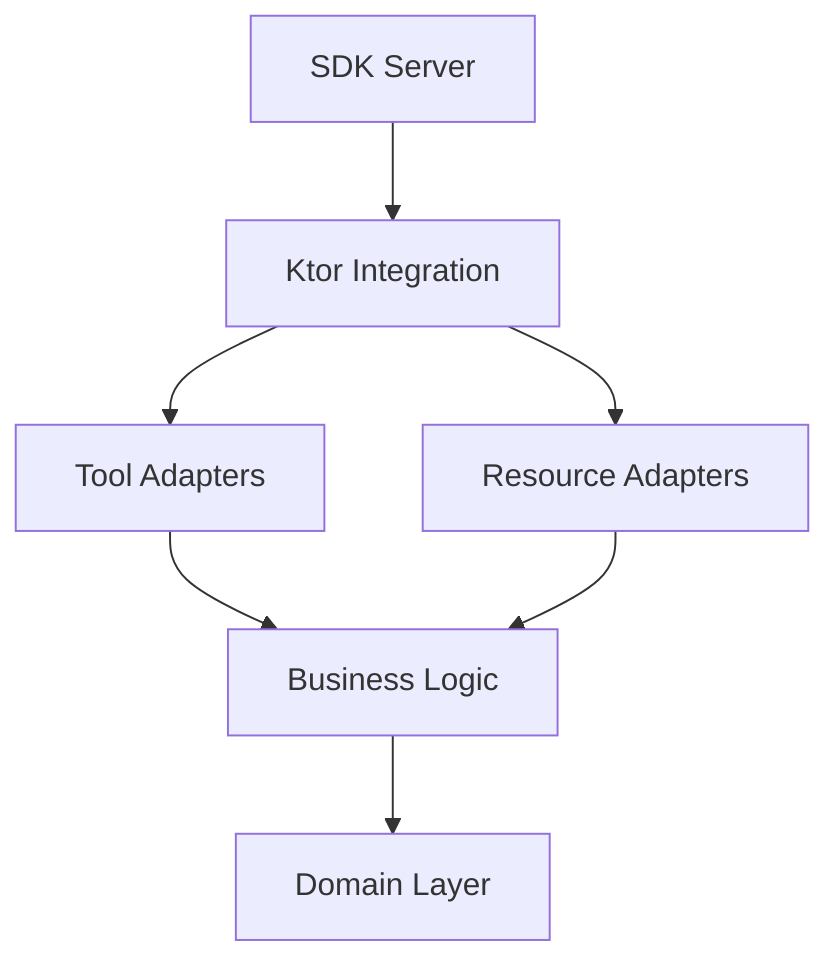

# MCP Kotlin SDK v0.7.2 Migration Plan

## Executive Summary

**Current State**: Custom EventBus-based MCP transport with session correlation
**Target State**: Official MCP Kotlin SDK v0.7.2 with per-request transport
**Timeline**: 21 days across 6 phases (22 story points)
**Risk Level**: MEDIUM (mitigated by phased approach)
**Test Coverage**: 820/820 tests maintained (100%)

### Migration Rationale

The custom EventBus architecture has revealed fundamental issues:
- Session mismatch bugs (SPI-699)
- Complex correlation between SSE and POST endpoints
- Manual protocol tracking burden
- Future-proofing challenges

SDK v0.7.2 provides:
- 7 versions of stability improvements over v0.1.0
- Official Anthropic + JetBrains support
- Per-request transport pattern (solves session issues)
- Automatic protocol evolution tracking

**Decision Document**: See `ADR-001-adopt-mcp-kotlin-sdk-v0.7.2.md` for full context

### Key Architectural Change

```
BEFORE: Stateful EventBus with session correlation
┌──────────────┐      ┌──────────────┐
│ SSE Endpoint │ ───→ │  EventBus    │ ───→ Session-based channels
└──────────────┘      │ (Stateful)   │
┌──────────────┐      └──────────────┘
│POST Endpoint │ ───→ │ Correlator   │ ───→ Request/Response tracking
└──────────────┘      └──────────────┘

AFTER: SDK per-request transport
┌──────────────┐
│ SDK Server   │ ───→ Per-request transport (stateless)
└──────────────┘      ↓
                  Session via request metadata
```

## SDK v0.7.2 Architecture Analysis

### Core SDK Components

Based on SDK v0.7.2 actual implementation:

```kotlin
// 1. Server - Core MCP server
io.modelcontextprotocol.kotlin.sdk.server.Server

// 2. Transport - Ktor integration
io.modelcontextprotocol.kotlin.sdk.server.ktor.mcp

// 3. Capabilities - Server feature declaration
io.modelcontextprotocol.kotlin.sdk.ServerCapabilities

// 4. Implementation Info - Server metadata
io.modelcontextprotocol.kotlin.sdk.Implementation

// 5. Tool/Resource APIs
Server.addTool()
Server.addResource()

// 6. Request/Response Types
CallToolRequest, CallToolResult
ReadResourceRequest, ReadResourceResult
```

### SDK v0.7.2 Server Initialization Pattern

```kotlin
import io.modelcontextprotocol.kotlin.sdk.server.Server
import io.modelcontextprotocol.kotlin.sdk.server.ServerOptions
import io.modelcontextprotocol.kotlin.sdk.ServerCapabilities
import io.modelcontextprotocol.kotlin.sdk.Implementation
import kotlinx.serialization.json.*

val server = Server(
    serverInfo = Implementation(
        name = "cycletime-ce",
        version = "1.0.0" // From project version
    ),
    options = ServerOptions(
        capabilities = ServerCapabilities(
            resources = ServerCapabilities.Resources(
                subscribe = true,      // Support resource subscriptions
                listChanged = true     // Notify resource list changes
            ),
            tools = ServerCapabilities.Tools()
        )
    )
) {
    // Server description (optional)
    "CycleTime CE: Project orchestration for Claude Code"
}
```

### SDK v0.7.2 Ktor Integration Pattern

```kotlin
import io.ktor.server.application.*
import io.ktor.server.routing.*
import io.modelcontextprotocol.kotlin.sdk.server.ktor.mcp

fun Application.configureMCP() {
    routing {
        route("/mcp") {
            mcp {
                // SDK automatically handles:
                // - SSE transport via GET /mcp/events
                // - JSON-RPC via POST /mcp
                // - Protocol negotiation
                // - Session management
                server
            }
        }
    }
}
```

**Note**: SDK v0.7.2 Ktor integration handles transport automatically. No manual SSE/POST endpoint setup needed.

### SDK Tool Registration Pattern

```kotlin
// Register a tool with JSON schema for parameters
server.addTool(
    name = "session_create",
    description = "Create a new CycleTime session for a project",
    inputSchema = JsonObject(mapOf(
        "type" to JsonPrimitive("object"),
        "properties" to JsonObject(mapOf(
            "projectId" to JsonObject(mapOf(
                "type" to JsonPrimitive("string"),
                "description" to JsonPrimitive("Linear project ID")
            )),
            "requireAuth" to JsonObject(mapOf(
                "type" to JsonPrimitive("boolean"),
                "description" to JsonPrimitive("Require Linear authentication")
            ))
        )),
        "required" to JsonArray(listOf(JsonPrimitive("projectId")))
    ))
) { request: CallToolRequest ->
    // Extract parameters from request
    val args = request.params.arguments
    val projectId = args["projectId"]?.jsonPrimitive?.content
        ?: throw IllegalArgumentException("Missing projectId")

    // Execute business logic (unchanged)
    val result = sessionService.createSession(projectId)

    // Return structured result
    CallToolResult(
        content = listOf(
            TextContent(
                type = "text",
                text = Json.encodeToString(result)
            )
        )
    )
}
```

### SDK Resource Registration Pattern

```kotlin
// Register a resource with URI pattern
server.addResource(
    uri = "session://current",
    name = "Current Session",
    description = "Active CycleTime session information",
    mimeType = "application/json"
) { request: ReadResourceRequest ->
    // Extract session from request context
    val sessionId = request.meta?.get("sessionId")?.jsonPrimitive?.content
        ?: throw IllegalStateException("No session in request")

    // Read resource data (business logic unchanged)
    val session = sessionRepository.findById(sessionId)
        ?: throw IllegalStateException("Invalid session")

    // Return resource content
    ReadResourceResult(
        contents = listOf(
            TextResourceContents(
                text = Json.encodeToString(session),
                uri = request.uri,
                mimeType = "application/json"
            )
        )
    )
}
```

### SDK Session Management Pattern

SDK uses per-request transport (stateless), but we need session persistence:

```kotlin
// Session stored in database (unchanged)
// Session ID passed via request metadata

// Solution: Request metadata for session context
server.addTool("tool_name") { request ->
    // Extract session from SDK request
    val sessionId = extractSessionId(request)
    val session = sessionRepository.findById(sessionId)
        ?: throw IllegalStateException("Invalid session: $sessionId")

    // Use session for business logic
    /* ... */
}

// Helper function
fun extractSessionId(request: CallToolRequest): String {
    return request.meta?.get("sessionId")?.jsonPrimitive?.content
        ?: throw IllegalStateException("No session in request context")
}
```

### Key SDK v0.7.2 Differences from v0.1.0

Based on release notes and API analysis:

1. **Build System**: Migration from `jreleaser` to `mavenPublish` (stability improvement)
2. **Test Coverage**: Stdio integration tests added (better transport coverage)
3. **Dependency Updates**: Kotest 6.0.3 (same as our project)
4. **Project Structure**: Improved module organization (`kotlin-sdk-core`, `kotlin-sdk-server`, `kotlin-sdk-client`)

**Compatibility**: SDK v0.7.2 uses Ktor 3.x (compatible with our Ktor 3.3.0)

## Detailed Migration Phases

### Phase 1: Foundation ✅ COMPLETE

**Duration**: Days 1-3
**Story Points**: 3
**Status**: ✅ COMPLETE

#### Objectives
- ✅ Add SDK v0.7.2 dependency
- ✅ Verify build compatibility
- ✅ Study SDK architecture and APIs
- ✅ Create migration plan and ADR

#### Completed Actions
1. ✅ Added SDK dependency: `implementation("io.modelcontextprotocol:kotlin-sdk:0.7.2")`
2. ✅ Verified Ktor 3.3.0 compatibility
3. ✅ Verified build: 820/820 tests passing
4. ✅ Researched SDK v0.7.2 APIs and patterns
5. ✅ Created ADR-001 (decision document)
6. ✅ Created this migration plan

#### Validation
- ✅ Build successful with SDK dependency
- ✅ All tests passing (820/820)
- ✅ ADR documented and approved
- ✅ Migration plan complete

---

### Phase 2: Transport Layer Migration

**Duration**: Days 4-8
**Story Points**: 5
**Status**: PENDING

#### Objectives
- Replace EventBus with SDK transport
- Integrate SDK with Ktor 3.3.0
- Implement session management with SDK
- Preserve all business logic

#### Day 4: SDK Server Setup

**Goal**: Initialize SDK server with basic configuration

**Implementation Steps**:

1. **Create SDK Server Component**

```kotlin
// File: src/main/kotlin/io/spiralhouse/cycletime/mcp/sdk/MCPSdkServer.kt
package io.spiralhouse.cycletime.mcp.sdk

import io.modelcontextprotocol.kotlin.sdk.server.Server
import io.modelcontextprotocol.kotlin.sdk.server.ServerOptions
import io.modelcontextprotocol.kotlin.sdk.ServerCapabilities
import io.modelcontextprotocol.kotlin.sdk.Implementation
import org.slf4j.LoggerFactory

class MCPSdkServer(
    private val version: String
) {
    private val logger = LoggerFactory.getLogger(MCPSdkServer::class.java)

    val server: Server = Server(
        serverInfo = Implementation(
            name = "cycletime-ce",
            version = version
        ),
        options = ServerOptions(
            capabilities = ServerCapabilities(
                resources = ServerCapabilities.Resources(
                    subscribe = true,
                    listChanged = true
                ),
                tools = ServerCapabilities.Tools()
            )
        )
    ) {
        "CycleTime CE: Project orchestration framework for Claude Code"
    }

    init {
        logger.info("MCP SDK Server initialized (version: $version)")
    }

    suspend fun shutdown() {
        logger.info("MCP SDK Server shutting down")
        // SDK handles cleanup automatically
    }
}
```

2. **Register in DI Container**

```kotlin
// File: src/main/kotlin/io/spiralhouse/cycletime/Application.kt
fun Application.configureDependencies() {
    dependencies {
        val version = System.getProperty("cycletime.version") ?: "unknown"

        // SDK Server (new)
        provide<MCPSdkServer> {
            MCPSdkServer(version)
        }

        // Keep existing dependencies (for now)
        provide<EventBus> { EventBus() }
        provide<MessageCorrelator> { MessageCorrelator(instance()) }
        // ... rest unchanged
    }
}
```

3. **Verify Server Initialization**

```kotlin
// Test: src/test/kotlin/io/spiralhouse/cycletime/mcp/sdk/MCPSdkServerTest.kt
class MCPSdkServerTest : StringSpec({
    "should initialize SDK server with correct metadata" {
        val server = MCPSdkServer(version = "1.0.0-test")

        server.server shouldNotBe null
        // Verify server initialized successfully
    }
})
```

**Validation**:
- [ ] SDK server initializes without errors
- [ ] Server metadata correct (name, version)
- [ ] Capabilities configured correctly
- [ ] Test passes

#### Day 5: Ktor Integration

**Goal**: Integrate SDK with Ktor routing

**Implementation Steps**:

1. **Create SDK Routing Configuration**

```kotlin
// File: src/main/kotlin/io/spiralhouse/cycletime/mcp/sdk/MCPSdkRouting.kt
package io.spiralhouse.cycletime.mcp.sdk

import io.ktor.server.application.*
import io.ktor.server.routing.*
import io.ktor.server.plugins.di.*
import io.modelcontextprotocol.kotlin.sdk.server.ktor.mcp
import org.slf4j.LoggerFactory

private val logger = LoggerFactory.getLogger("MCPSdkRouting")

fun Routing.configureMCPSdk() {
    val sdkServer: MCPSdkServer by application.dependencies

    route("/mcp") {
        mcp {
            // SDK handles all transport automatically
            sdkServer.server
        }
    }

    logger.info("MCP SDK routing configured at /mcp")
}
```

2. **Update Main MCP Configuration** (parallel mode)

```kotlin
// File: src/main/kotlin/io/spiralhouse/cycletime/mcp/MCPServer.kt
fun Routing.configureMCP() {
    val logger = LoggerFactory.getLogger("MCPRouting")

    // MIGRATION MODE: Run both transports in parallel
    // Old EventBus transport (to be removed in Phase 6)
    route("/mcp-old") {
        val sessionManager: MCPSessionManager by application.dependencies
        val eventBus: EventBus by application.dependencies
        val correlator: MessageCorrelator by application.dependencies
        val methodHandler: McpMethodHandler by application.dependencies

        mcpSSEEndpoint(sessionManager, eventBus)
        mcpPostEndpoint(sessionManager, eventBus, correlator, methodHandler)
    }

    // New SDK transport (primary)
    configureMCPSdk()

    logger.info("MCP routing configured (SDK + legacy)")
}
```

3. **Test SDK Endpoint**

```kotlin
// Test: src/test/kotlin/io/spiralhouse/cycletime/mcp/sdk/MCPSdkIntegrationTest.kt
class MCPSdkIntegrationTest : StringSpec({
    "SDK should handle MCP initialize request" {
        testApplication {
            application {
                configureDependencies()
                routing {
                    configureMCPSdk()
                }
            }

            val response = client.post("/mcp") {
                header("Content-Type", "application/json")
                setBody("""
                    {
                        "jsonrpc": "2.0",
                        "method": "initialize",
                        "params": {
                            "protocolVersion": "2024-11-05",
                            "capabilities": {},
                            "clientInfo": {
                                "name": "test-client",
                                "version": "1.0.0"
                            }
                        },
                        "id": 1
                    }
                """.trimIndent())
            }

            response.status shouldBe HttpStatusCode.OK
            val body = response.bodyAsText()
            body should include("serverInfo")
        }
    }
})
```

**Validation**:
- [ ] SDK endpoint responds at `/mcp`
- [ ] Initialize request succeeds
- [ ] Server info returned correctly
- [ ] Test passes

#### Day 6-7: Session Management Migration

**Goal**: Implement session management with SDK request metadata

**Implementation Steps**:

1. **Create Session Context Extractor**

```kotlin
// File: src/main/kotlin/io/spiralhouse/cycletime/mcp/sdk/SessionContext.kt
package io.spiralhouse.cycletime.mcp.sdk

import io.modelcontextprotocol.kotlin.sdk.CallToolRequest
import io.modelcontextprotocol.kotlin.sdk.ReadResourceRequest
import kotlinx.serialization.json.jsonPrimitive

object SessionContext {
    /**
     * Extracts session ID from SDK request metadata.
     *
     * Session ID is passed via request.meta["sessionId"] by client.
     */
    fun extractSessionId(request: CallToolRequest): String? {
        return request.meta?.get("sessionId")?.jsonPrimitive?.content
    }

    fun extractSessionId(request: ReadResourceRequest): String? {
        return request.meta?.get("sessionId")?.jsonPrimitive?.content
    }

    /**
     * Validates and extracts session ID (throws if missing).
     */
    fun requireSessionId(request: CallToolRequest): String {
        return extractSessionId(request)
            ?: throw IllegalStateException("No session ID in request context")
    }

    fun requireSessionId(request: ReadResourceRequest): String {
        return extractSessionId(request)
            ?: throw IllegalStateException("No session ID in request context")
    }
}
```

2. **Update Session Management Service**

```kotlin
// File: src/main/kotlin/io/spiralhouse/cycletime/mcp/sdk/SDKSessionManager.kt
package io.spiralhouse.cycletime.mcp.sdk

import io.spiralhouse.cycletime.application.services.SessionApplicationService
import io.spiralhouse.cycletime.domain.session.Session
import org.slf4j.LoggerFactory

/**
 * Session manager for SDK-based transport.
 *
 * Unlike EventBus (stateful), SDK is stateless per-request.
 * Session state stored in database, retrieved per request.
 */
class SDKSessionManager(
    private val sessionService: SessionApplicationService
) {
    private val logger = LoggerFactory.getLogger(SDKSessionManager::class.java)

    suspend fun getOrCreateSession(sessionId: String): Session {
        return sessionService.getSession(sessionId)
            ?: sessionService.createSession(sessionId).also {
                logger.info("Created new session: $sessionId")
            }
    }

    suspend fun validateSession(sessionId: String): Session {
        return sessionService.getSession(sessionId)
            ?: throw IllegalStateException("Invalid session: $sessionId")
    }
}
```

3. **Register in DI**

```kotlin
fun Application.configureDependencies() {
    dependencies {
        provide<SDKSessionManager> {
            SDKSessionManager(instance()) // SessionApplicationService
        }
    }
}
```

**Validation**:
- [ ] Session context extracted from requests
- [ ] Session validation works
- [ ] Database session retrieval works
- [ ] Tests pass

#### Day 8: Transport Layer Testing

**Goal**: Comprehensive transport layer test coverage

**Test Cases**:

1. **Initialize Request Test**
```kotlin
"SDK should handle MCP initialize" {
    // Test initialize protocol handshake
}
```

2. **Session Bootstrap Test**
```kotlin
"SDK should bootstrap session without prior session" {
    // Test new session creation
}
```

3. **Session Resume Test**
```kotlin
"SDK should resume existing session" {
    // Test session ID in metadata
}
```

4. **Error Handling Test**
```kotlin
"SDK should handle invalid session ID" {
    // Test error responses
}
```

5. **Performance Test**
```kotlin
"SDK initialize should complete in <100ms" {
    // Benchmark SDK performance
}
```

**Validation**:
- [ ] All transport tests pass
- [ ] Session management tests pass
- [ ] Performance benchmarks meet targets
- [ ] Error handling comprehensive

#### Phase 2 Success Criteria

**Go/No-Go Gates**:
- [ ] SDK server initializes successfully
- [ ] Ktor integration working (`/mcp` endpoint responds)
- [ ] Session management implemented (extract from metadata)
- [ ] All transport tests passing
- [ ] Performance: Initialize <100ms
- [ ] No regressions in existing tests (820/820)
- [ ] Code review approved

**Rollback Procedure**:
If Phase 2 fails:
1. Keep SDK code (disabled)
2. Revert to EventBus transport only
3. Remove `/mcp` SDK routing
4. Document failures for analysis
5. Re-plan based on issues encountered

---

### Phase 3: Tool/Resource Migration

**Duration**: Days 9-13
**Story Points**: 5
**Status**: PENDING

#### Objectives
- Adapt tool providers to SDK registration API
- Adapt resource providers to SDK registration API
- Maintain business logic (no changes)
- Preserve test coverage

#### Day 9: Tool Provider Adapter

**Goal**: Create adapter layer for existing tool providers

**Implementation Steps**:

1. **Create SDK Tool Adapter**

```kotlin
// File: src/main/kotlin/io/spiralhouse/cycletime/mcp/sdk/adapters/SDKToolAdapter.kt
package io.spiralhouse.cycletime.mcp.sdk.adapters

import io.modelcontextprotocol.kotlin.sdk.server.Server
import io.modelcontextprotocol.kotlin.sdk.CallToolRequest
import io.modelcontextprotocol.kotlin.sdk.CallToolResult
import io.modelcontextprotocol.kotlin.sdk.TextContent
import io.spiralhouse.cycletime.mcp.tools.ToolProvider
import io.spiralhouse.cycletime.mcp.tools.Tool
import io.spiralhouse.cycletime.mcp.sdk.SessionContext
import kotlinx.serialization.json.*
import org.slf4j.LoggerFactory

/**
 * Adapter that bridges existing ToolProvider to SDK registration API.
 *
 * This preserves business logic while adapting to SDK patterns.
 */
class SDKToolAdapter(
    private val toolProvider: ToolProvider,
    private val sdkSessionManager: SDKSessionManager
) {
    private val logger = LoggerFactory.getLogger(SDKToolAdapter::class.java)

    suspend fun registerTools(server: Server) {
        val tools = toolProvider.getTools() + toolProvider.getAsyncTools()

        tools.forEach { tool ->
            registerTool(server, tool)
        }

        logger.info("Registered ${tools.size} tools from ${toolProvider.namespace}")
    }

    private suspend fun registerTool(server: Server, tool: Tool) {
        val toolName = "${toolProvider.namespace}_${tool.metadata.name}"

        server.addTool(
            name = toolName,
            description = tool.metadata.description,
            inputSchema = convertInputSchema(tool.metadata.inputSchema)
        ) { request: CallToolRequest ->
            executeTool(tool, request)
        }
    }

    private suspend fun executeTool(
        tool: Tool,
        request: CallToolRequest
    ): CallToolResult {
        // Extract session from request
        val sessionId = SessionContext.extractSessionId(request)

        // Validate session if required
        if (sessionId != null) {
            sdkSessionManager.validateSession(sessionId)
        }

        // Convert SDK request to Tool request format
        val toolRequest = convertToToolRequest(request)

        // Execute tool (business logic unchanged)
        val result = tool.execute(toolRequest)

        // Convert result to SDK format
        return CallToolResult(
            content = listOf(
                TextContent(
                    type = "text",
                    text = result.toJson()
                )
            )
        )
    }

    private fun convertInputSchema(schema: Map<String, Any>): JsonObject {
        // Convert tool input schema to JSON schema format
        return buildJsonObject {
            schema.forEach { (key, value) ->
                put(key, Json.encodeToJsonElement(value))
            }
        }
    }

    private fun convertToToolRequest(request: CallToolRequest): ToolRequest {
        // Convert SDK request format to existing ToolRequest format
        return ToolRequest(
            parameters = request.params.arguments.mapValues { (_, value) ->
                value.toString()
            }
        )
    }
}
```

2. **Register Tool Adapters**

```kotlin
// File: src/main/kotlin/io/spiralhouse/cycletime/mcp/sdk/MCPSdkServer.kt (updated)
class MCPSdkServer(
    private val version: String,
    private val sessionManager: SDKSessionManager,
    private val toolProviders: List<ToolProvider>
) {
    val server: Server = Server(/* ... */)

    suspend fun initialize() {
        // Register all tool providers
        toolProviders.forEach { provider ->
            val adapter = SDKToolAdapter(provider, sessionManager)
            adapter.registerTools(server)
        }

        logger.info("Registered ${toolProviders.size} tool providers")
    }
}
```

3. **Update DI Configuration**

```kotlin
fun Application.configureDependencies() {
    dependencies {
        // Tool providers (existing)
        provide<DefaultSessionToolProvider> {
            DefaultSessionToolProvider(instance())
        }
        provide<DefaultProjectToolProvider> {
            DefaultProjectToolProvider(instance())
        }
        provide<DefaultIssueToolProvider> {
            DefaultIssueToolProvider(instance())
        }
        provide<DefaultWorkflowToolProvider> {
            DefaultWorkflowToolProvider(instance())
        }

        // SDK Server with tool providers
        provide<MCPSdkServer> {
            val toolProviders = listOf(
                instance<DefaultSessionToolProvider>(),
                instance<DefaultProjectToolProvider>(),
                instance<DefaultIssueToolProvider>(),
                instance<DefaultWorkflowToolProvider>()
            )

            MCPSdkServer(
                version = System.getProperty("cycletime.version") ?: "unknown",
                sessionManager = instance(),
                toolProviders = toolProviders
            ).apply {
                runBlocking { initialize() }
            }
        }
    }
}
```

**Validation**:
- [ ] Tool adapter compiles
- [ ] Tools register with SDK
- [ ] Tool names prefixed correctly (namespace_name)
- [ ] Business logic unchanged

#### Day 10-11: Migrate Individual Tool Providers

**Goal**: Migrate each tool provider to SDK pattern

**Implementation Order**:
1. Session tools (3 tools)
2. Project tools (4 tools)
3. Issue tools (5 tools)
4. Workflow tools (3 tools)

**Example: Session Create Tool**

```kotlin
// Before: EventBus pattern
class DefaultSessionToolProvider(
    private val sessionService: SessionApplicationService
) : AbstractToolProvider("session") {
    override fun getTools(): List<Tool> = listOf(
        Tool(
            metadata = ToolMetadata(
                name = "create",
                description = "Create a new CycleTime session",
                inputSchema = mapOf(/* ... */)
            ),
            handler = { params ->
                val projectId = params["projectId"] as String
                val result = sessionService.createSession(projectId)
                ToolResult.success(result)
            }
        )
    )
}

// After: SDK adapter pattern (business logic unchanged)
// Tool is registered via SDKToolAdapter
// Handler code moved to adapter
// Business logic (sessionService.createSession) unchanged
```

**Testing Strategy**:

For each tool provider:

1. **Unit Test** (business logic - unchanged)
```kotlin
class DefaultSessionToolProviderTest : StringSpec({
    "should create session with valid project ID" {
        // Test business logic (unchanged)
    }
})
```

2. **Integration Test** (SDK registration)
```kotlin
class SessionToolsSDKIntegrationTest : StringSpec({
    "should register session tools with SDK" {
        testApplication {
            // Verify tools registered
            // Test tool execution via SDK
        }
    }
})
```

3. **MCP Protocol Test**
```kotlin
"should call session_create via MCP protocol" {
    // Test full MCP request/response cycle
}
```

**Validation per Provider**:
- [ ] All tools registered with SDK
- [ ] Business logic tests pass (unchanged)
- [ ] SDK integration tests pass
- [ ] MCP protocol tests pass

#### Day 12: Resource Provider Adapter

**Goal**: Adapt resource providers to SDK pattern

**Implementation Steps**:

1. **Create SDK Resource Adapter**

```kotlin
// File: src/main/kotlin/io/spiralhouse/cycletime/mcp/sdk/adapters/SDKResourceAdapter.kt
package io.spiralhouse.cycletime.mcp.sdk.adapters

import io.modelcontextprotocol.kotlin.sdk.server.Server
import io.modelcontextprotocol.kotlin.sdk.ReadResourceRequest
import io.modelcontextprotocol.kotlin.sdk.ReadResourceResult
import io.modelcontextprotocol.kotlin.sdk.TextResourceContents
import io.spiralhouse.cycletime.mcp.resources.ResourceProvider
import io.spiralhouse.cycletime.mcp.sdk.SessionContext
import kotlinx.serialization.json.Json
import org.slf4j.LoggerFactory

class SDKResourceAdapter(
    private val resourceProvider: ResourceProvider,
    private val sdkSessionManager: SDKSessionManager
) {
    private val logger = LoggerFactory.getLogger(SDKResourceAdapter::class.java)

    suspend fun registerResources(server: Server) {
        // Get resource list (with dummy session for registration)
        val resources = resourceProvider.listResources()

        resources.forEach { resource ->
            registerResource(server, resource)
        }

        logger.info("Registered ${resources.size} resources from ${resourceProvider.namespace}")
    }

    private fun registerResource(server: Server, resource: Resource) {
        server.addResource(
            uri = resource.uri,
            name = resource.name,
            description = resource.description,
            mimeType = resource.mimeType
        ) { request: ReadResourceRequest ->
            readResource(request)
        }
    }

    private suspend fun readResource(
        request: ReadResourceRequest
    ): ReadResourceResult {
        // Extract session from request
        val sessionId = SessionContext.requireSessionId(request)

        // Validate session
        sdkSessionManager.validateSession(sessionId)

        // Read resource (business logic unchanged)
        val content = resourceProvider.readResource(sessionId, request.uri)

        // Convert to SDK format
        return ReadResourceResult(
            contents = listOf(
                TextResourceContents(
                    text = Json.encodeToString(content),
                    uri = request.uri,
                    mimeType = content.mimeType
                )
            )
        )
    }
}
```

2. **Register Resource Adapters**

```kotlin
class MCPSdkServer(
    private val version: String,
    private val sessionManager: SDKSessionManager,
    private val toolProviders: List<ToolProvider>,
    private val resourceProviders: List<ResourceProvider>
) {
    suspend fun initialize() {
        // Register tools
        toolProviders.forEach { provider ->
            SDKToolAdapter(provider, sessionManager).registerTools(server)
        }

        // Register resources
        resourceProviders.forEach { provider ->
            SDKResourceAdapter(provider, sessionManager).registerResources(server)
        }

        logger.info("SDK server initialized with ${toolProviders.size} tool providers, " +
                   "${resourceProviders.size} resource providers")
    }
}
```

**Validation**:
- [ ] Resource adapter compiles
- [ ] Resources register with SDK
- [ ] Resource URIs correct
- [ ] Business logic unchanged

#### Day 13: Tool/Resource Testing

**Goal**: Comprehensive tool and resource test coverage

**Test Cases**:

1. **Tool Registration Test**
```kotlin
"SDK should register all tools from providers" {
    // Verify tool count
    // Verify tool names
    // Verify tool descriptions
}
```

2. **Tool Execution Test**
```kotlin
"SDK should execute session_create tool" {
    // Full MCP request/response cycle
    // Verify business logic executed
    // Verify result format
}
```

3. **Resource Registration Test**
```kotlin
"SDK should register all resources from providers" {
    // Verify resource count
    // Verify resource URIs
    // Verify resource metadata
}
```

4. **Resource Read Test**
```kotlin
"SDK should read session resource" {
    // Full MCP read resource cycle
    // Verify content returned
    // Verify MIME type
}
```

5. **Session Context Test**
```kotlin
"SDK should extract session from tool request" {
    // Verify session extraction
    // Verify session validation
}
```

**Validation**:
- [ ] All tool tests pass
- [ ] All resource tests pass
- [ ] Session context tests pass
- [ ] No regressions (820/820 tests)

#### Phase 3 Success Criteria

**Go/No-Go Gates**:
- [ ] All tool providers adapted
- [ ] All resource providers adapted
- [ ] Business logic unchanged (verified by tests)
- [ ] All tools registered with SDK
- [ ] All resources registered with SDK
- [ ] Tool execution works via MCP protocol
- [ ] Resource reading works via MCP protocol
- [ ] Session context extracted correctly
- [ ] All tests pass (820/820 + new adapter tests)
- [ ] Code review approved

**Rollback Procedure**:
If Phase 3 fails:
1. Keep adapters (disabled)
2. Use EventBus transport with old tool/resource registration
3. Document adapter issues
4. Fix adapter code based on issues
5. Retry Phase 3

---

### Phase 4: Test Migration

**Duration**: Days 14-16
**Story Points**: 3
**Status**: PENDING

#### Objectives
- Update transport layer tests for SDK
- Update integration tests for SDK patterns
- Maintain 820/820 test pass rate
- Add SDK-specific test coverage

#### Day 14: Transport Test Migration

**Goal**: Migrate EventBus transport tests to SDK transport tests

**Test Categories**:

1. **Protocol Tests** (move to SDK pattern)

```kotlin
// Before: JsonRpcProtocolHandlerTest
class JsonRpcProtocolHandlerTest : StringSpec({
    "should parse valid JSON-RPC request" {
        // Test custom protocol handler
    }
})

// After: SDK protocol tests (SDK handles internally)
// Delete custom protocol tests (SDK provides this)
// Focus on end-to-end MCP protocol tests

class MCPProtocolSDKTest : StringSpec({
    "should handle MCP initialize via SDK" {
        testApplication {
            // Test full MCP protocol cycle
            // SDK handles protocol internally
        }
    }
})
```

2. **Session Tests** (update for SDK pattern)

```kotlin
// Before: EventBus session correlation tests
class EventBusTest : StringSpec({
    "should publish event to correct session" {
        // Test EventBus session correlation
    }
})

// After: SDK session context tests
class SDKSessionContextTest : StringSpec({
    "should extract session from request metadata" {
        // Test SDK session extraction
    }

    "should validate session from database" {
        // Test SDK session validation
    }
})
```

3. **Integration Tests** (update endpoints)

```kotlin
// Before: /mcp/events SSE tests
class MCPSSEHandlerTest : StringSpec({
    "should establish SSE connection" {
        // Test custom SSE handler
    }
})

// After: SDK transport tests
class MCPSdkTransportTest : StringSpec({
    "should establish MCP connection via SDK" {
        // Test SDK Ktor integration
    }
})
```

**Migration Strategy**:
- Delete tests for removed code (EventBus, JsonRpcProtocolHandler)
- Update tests for adapted code (session management, tool/resource execution)
- Add tests for new code (SDK adapters, session context)

**Validation**:
- [ ] All transport tests migrated
- [ ] Old EventBus tests removed
- [ ] New SDK tests added
- [ ] Test coverage maintained

#### Day 15: Integration Test Migration

**Goal**: Update integration tests for SDK patterns

**Test Categories**:

1. **MCP Tool Integration Tests**

```kotlin
// Update endpoint from /mcp-old to /mcp
class McpToolIntegrationTest : StringSpec({
    "should call session_create via MCP" {
        testApplication {
            val response = client.post("/mcp") { // Updated endpoint
                // Test via SDK transport
            }
        }
    }
})
```

2. **MCP Resource Integration Tests**

```kotlin
class MCPResourceIntegrationTest : StringSpec({
    "should read session resource via MCP" {
        // Test via SDK transport
    }
})
```

3. **Session Lifecycle Tests**

```kotlin
class SessionLifecycleSDKTest : StringSpec({
    "should create session via SDK initialize" {
        // Test SDK session creation
    }

    "should retrieve session from database" {
        // Test session persistence
    }

    "should validate session in subsequent requests" {
        // Test session validation
    }
})
```

**Validation**:
- [ ] All integration tests updated
- [ ] Endpoints point to `/mcp` (SDK)
- [ ] Session lifecycle tests pass
- [ ] Tool/resource integration tests pass

#### Day 16: Test Coverage Analysis

**Goal**: Verify test coverage maintained

**Coverage Checks**:

1. **Line Coverage**: ≥80% (current level)
2. **Branch Coverage**: ≥75% (current level)
3. **Domain Coverage**: 100% (unchanged)
4. **Application Service Coverage**: 100% (unchanged)

**Coverage Commands**:
```bash
./gradlew koverHtmlReport
./gradlew koverVerify
```

**Test Execution**:
```bash
# Unit tests
./gradlew unitTest

# Integration tests
./gradlew integrationTest

# System tests
./gradlew systemTest

# All tests
./gradlew testAll
```

**Validation**:
- [ ] Line coverage ≥80%
- [ ] Branch coverage ≥75%
- [ ] Domain coverage 100%
- [ ] All tests pass (820/820 minimum)
- [ ] Coverage report generated

#### Phase 4 Success Criteria

**Go/No-Go Gates**:
- [ ] All transport tests migrated
- [ ] All integration tests updated
- [ ] Test coverage maintained (≥80%)
- [ ] All tests pass (820/820 minimum)
- [ ] No flaky tests introduced
- [ ] CI pipeline passes
- [ ] Code review approved

**Rollback Procedure**:
If Phase 4 fails:
1. Revert test changes
2. Keep SDK code (tests using old transport)
3. Fix test issues
4. Retry Phase 4

---

### Phase 5: Validation

**Duration**: Days 17-19
**Story Points**: 4
**Status**: PENDING

#### Objectives
- MCP Inspector comprehensive validation
- Claude Code integration testing
- Performance benchmarking
- Security review

#### Day 17: MCP Inspector Validation

**Goal**: Comprehensive MCP protocol validation with MCP Inspector

**Setup**:
```bash
# Install MCP Inspector (if not installed)
npm install -g @modelcontextprotocol/inspector

# Start CycleTime server with SDK
./gradlew devRun

# Run MCP Inspector
mcp-inspector http://localhost:8080/mcp
```

**Validation Checklist**:

1. **Server Capabilities**
   - [ ] Server info correct (name, version)
   - [ ] Capabilities declared (tools, resources)
   - [ ] Protocol version correct (2024-11-05)

2. **Initialize Handshake**
   - [ ] Initialize request succeeds
   - [ ] Server capabilities returned
   - [ ] Session established

3. **Tools Validation**
   - [ ] All tools listed (15 total: session, project, issue, workflow)
   - [ ] Tool schemas valid JSON schema
   - [ ] Tool descriptions clear
   - [ ] Tool execution succeeds

4. **Resources Validation**
   - [ ] All resources listed
   - [ ] Resource URIs valid
   - [ ] Resource MIME types correct
   - [ ] Resource reading succeeds

5. **Error Handling**
   - [ ] Invalid tool returns proper error
   - [ ] Invalid resource returns proper error
   - [ ] Invalid session returns proper error
   - [ ] Error codes standard MCP codes

6. **Protocol Compliance**
   - [ ] JSON-RPC 2.0 format correct
   - [ ] Request IDs handled correctly
   - [ ] Notifications handled correctly
   - [ ] Protocol errors formatted correctly

**Documentation**:
```bash
# Generate validation report
mcp-inspector http://localhost:8080/mcp --output=validation-report.html

# Save report to docs
mv validation-report.html docs/validation/mcp-inspector-sdk-report.html
```

**Validation**:
- [ ] MCP Inspector validation passes
- [ ] All protocol checks green
- [ ] No critical warnings
- [ ] Report documented

#### Day 18: Claude Code Integration

**Goal**: Test CycleTime with Claude Code MCP client

**Test Scenarios**:

1. **Connection Test**
```bash
# Configure Claude Code to use CycleTime
# File: .claude/mcp.json
{
  "servers": {
    "cycletime": {
      "url": "http://localhost:8080/mcp",
      "transport": "sse"
    }
  }
}

# Restart Claude Code
# Verify: Tools listed in Claude Code UI
```

2. **Tool Execution Test**
```
User: Create a new CycleTime session for project TEST-123

Expected: Claude Code calls session_create tool
Result: Session created successfully
```

3. **Resource Reading Test**
```
User: Show me the current session information

Expected: Claude Code reads session resource
Result: Session data displayed
```

4. **Multi-Tool Workflow Test**
```
User: Create session, add project, create issue

Expected: Claude Code calls multiple tools in sequence
Result: All operations succeed with session context
```

5. **Error Handling Test**
```
User: Create session with invalid project

Expected: Claude Code receives error response
Result: Error message displayed to user
```

**Validation Checklist**:
- [ ] Claude Code connects to CycleTime
- [ ] All tools visible in Claude Code
- [ ] All resources visible in Claude Code
- [ ] Tool execution succeeds
- [ ] Resource reading succeeds
- [ ] Multi-tool workflows work
- [ ] Error handling graceful
- [ ] Session context preserved across requests

**Documentation**:
- [ ] Claude Code integration guide updated
- [ ] Example workflows documented
- [ ] Troubleshooting guide created

#### Day 19: Performance & Security

**Goal**: Validate performance and security requirements

**Performance Benchmarks**:

1. **Initialize Latency**
```kotlin
class MCPPerformanceTest : StringSpec({
    "SDK initialize should complete in <100ms" {
        val times = (1..100).map {
            measureTimeMillis {
                // MCP initialize request
            }
        }

        val avg = times.average()
        val p95 = times.sorted()[95]

        avg shouldBeLessThan 100.0
        p95 shouldBeLessThan 150.0
    }
})
```

2. **Tool Call Latency**
```kotlin
"SDK tool call should complete in <500ms" {
    val times = (1..100).map {
        measureTimeMillis {
            // session_create tool call
        }
    }

    val avg = times.average()
    val p95 = times.sorted()[95]

    avg shouldBeLessThan 500.0
    p95 shouldBeLessThan 750.0
}
```

3. **Resource Read Latency**
```kotlin
"SDK resource read should complete in <100ms" {
    val times = (1..100).map {
        measureTimeMillis {
            // Read session resource
        }
    }

    val avg = times.average()
    avg shouldBeLessThan 100.0
}
```

4. **Memory Usage**
```bash
# Baseline memory usage
jcmd <PID> GC.heap_info

# Stress test
# 1000 concurrent sessions
# 10,000 tool calls

# Measure memory after stress test
jcmd <PID> GC.heap_info

# Verify: No memory leaks, reasonable growth
```

**Performance Validation**:
- [ ] Initialize: avg <100ms, p95 <150ms
- [ ] Tool call: avg <500ms, p95 <750ms
- [ ] Resource read: avg <100ms, p95 <200ms
- [ ] Memory: No leaks, stable after warmup
- [ ] CPU: Reasonable utilization

**Security Review**:

1. **Session Validation**
   - [ ] Invalid session rejected
   - [ ] Session hijacking prevented
   - [ ] Session expiration enforced

2. **Input Validation**
   - [ ] SDK validates JSON-RPC format
   - [ ] Tool parameters validated
   - [ ] Resource URIs validated
   - [ ] Injection attacks prevented

3. **Error Handling**
   - [ ] Sensitive info not leaked in errors
   - [ ] Stack traces not exposed
   - [ ] Error codes appropriate

4. **Dependency Security**
   - [ ] SDK vulnerability scan clean
   - [ ] No critical CVEs
   - [ ] Dependencies up-to-date

**Security Validation**:
```bash
# Run dependency check
./gradlew dependencyCheckAnalyze

# Review report
open build/reports/dependency-check-report.html
```

- [ ] No critical security issues
- [ ] Session security validated
- [ ] Input validation comprehensive
- [ ] Error handling secure

#### Phase 5 Success Criteria

**Go/No-Go Gates**:
- [ ] MCP Inspector validation passes (100%)
- [ ] Claude Code integration works (all scenarios)
- [ ] Performance benchmarks met (<100ms, <500ms, <100ms)
- [ ] Security review clean (no critical issues)
- [ ] Documentation complete
- [ ] Code review approved

**Rollback Procedure**:
If Phase 5 fails:
1. Document validation failures
2. Fix issues if minor (< 2 days)
3. If major issues, rollback to EventBus
4. Re-evaluate SDK adoption decision
5. Consider partial rollback (SDK for new features only)

---

### Phase 6: Cleanup

**Duration**: Days 20-21
**Story Points**: 2
**Status**: PENDING

#### Objectives
- Remove EventBus and custom transport code
- Remove JsonRpcProtocolHandler
- Update all documentation
- Archive old implementation

#### Day 20: Code Cleanup

**Goal**: Remove legacy transport code

**Removal Checklist**:

1. **EventBus Transport** (DELETE)
   - [ ] `/mcp-old` routing removed
   - [ ] `EventBus.kt` deleted
   - [ ] `MessageCorrelator.kt` deleted
   - [ ] `MCPSSEHandler.kt` deleted
   - [ ] `MCPPostHandler.kt` deleted
   - [ ] `SSEEvent.kt` deleted
   - [ ] `SSEMessageFormatter.kt` deleted

2. **Custom Protocol** (DELETE)
   - [ ] `JsonRpcProtocolHandler.kt` deleted
   - [ ] `JsonRpcRequestValidator.kt` deleted
   - [ ] `JsonRpcError.kt` deleted
   - [ ] `JsonRpcErrorCodes.kt` deleted
   - [ ] `JsonRpcExceptions.kt` deleted
   - [ ] `JsonRpcRequest.kt` deleted
   - [ ] `JsonRpcResponse.kt` deleted

3. **Old Tests** (DELETE)
   - [ ] `EventBusTest.kt` deleted
   - [ ] `MessageCorrelatorTest.kt` deleted
   - [ ] `MCPSSEHandlerTest.kt` deleted
   - [ ] `MCPPostHandlerTest.kt` deleted
   - [ ] `JsonRpcProtocolHandlerTest.kt` deleted

4. **DI Configuration** (UPDATE)
```kotlin
// Remove EventBus dependencies
fun Application.configureDependencies() {
    dependencies {
        // REMOVE these:
        // provide<EventBus> { EventBus() }
        // provide<MessageCorrelator> { MessageCorrelator(instance()) }
        // provide<MCPSessionManager> { MCPSessionManager(instance()) }

        // KEEP SDK dependencies:
        provide<SDKSessionManager> { SDKSessionManager(instance()) }
        provide<MCPSdkServer> { MCPSdkServer(/* ... */) }
    }
}
```

5. **Routing Configuration** (UPDATE)
```kotlin
// File: src/main/kotlin/io/spiralhouse/cycletime/mcp/MCPServer.kt
fun Routing.configureMCP() {
    // REMOVE old routing:
    // route("/mcp-old") { /* EventBus routing */ }

    // KEEP SDK routing only:
    configureMCPSdk()
}
```

**Validation**:
- [ ] Legacy code deleted
- [ ] Build succeeds
- [ ] All tests pass
- [ ] No dead code warnings

#### Day 21: Documentation Update

**Goal**: Update all documentation for SDK architecture

**Documentation Updates**:

1. **Architecture Overview** (UPDATE)
```markdown
// File: docs/architecture/overview.md

## MCP Transport Layer

CycleTime uses the official MCP Kotlin SDK v0.7.2 for MCP protocol handling.

### Architecture

┌──────────────┐
│ SDK Server   │ ───→ Per-request transport (stateless)
└──────────────┘      ↓
                  Session via request metadata
                      ↓
                  Database persistence

### Key Components

- **MCPSdkServer**: Initializes SDK with tools/resources
- **SDKToolAdapter**: Adapts ToolProviders to SDK registration
- **SDKResourceAdapter**: Adapts ResourceProviders to SDK registration
- **SDKSessionManager**: Manages session context from requests
```

2. **Session Management** (UPDATE)
```markdown
// File: docs/architecture/session-management.md

## Session Management with SDK

SDK uses per-request transport (stateless):
- Session ID passed via request metadata
- Session state stored in database
- Session retrieved per request

### Session Lifecycle

1. Initialize: MCP initialize creates session
2. Request: Session ID in request.meta["sessionId"]
3. Validation: Session retrieved from database
4. Execution: Tool/resource accesses session
```

3. **CLAUDE.md** (UPDATE)
```markdown
// File: CLAUDE.md

## Technology Stack

### MCP Integration
- **MCP Kotlin SDK v0.7.2**: Official SDK for MCP protocol
- **Transport**: Ktor integration with per-request pattern
- **Session Management**: Request metadata with database persistence
```

4. **README.md** (UPDATE)
```markdown
// File: README.md

## Architecture

CycleTime uses the official MCP Kotlin SDK for Claude Code integration.

### MCP Server

Start the MCP server:
```bash
./gradlew run
```

Configure Claude Code:
```json
{
  "servers": {
    "cycletime": {
      "url": "http://localhost:8080/mcp",
      "transport": "sse"
    }
  }
}
```
```

5. **Migration Archive** (CREATE)
```markdown
// File: docs/archive/eventbus-migration.md

# EventBus to SDK Migration

Completed: 2025-10-12

## Summary

Migrated from custom EventBus transport to official MCP Kotlin SDK v0.7.2.

## Old Architecture

[Document old EventBus architecture]

## Migration Process

[Link to migration plan]

## Lessons Learned

[Document lessons learned]
```

**Documentation Validation**:
- [ ] Architecture overview updated
- [ ] Session management docs updated
- [ ] CLAUDE.md updated
- [ ] README.md updated
- [ ] Migration archived
- [ ] All links valid

#### Day 21: Final Validation

**Goal**: Comprehensive final validation

**Final Checklist**:

1. **Build & Test**
   - [ ] Clean build succeeds
   - [ ] All tests pass (820/820 minimum)
   - [ ] Coverage maintained (≥80%)
   - [ ] CI pipeline passes

2. **Integration**
   - [ ] MCP Inspector validation passes
   - [ ] Claude Code integration works
   - [ ] All tools functional
   - [ ] All resources readable

3. **Performance**
   - [ ] Initialize <100ms
   - [ ] Tool call <500ms
   - [ ] Resource read <100ms
   - [ ] No memory leaks

4. **Documentation**
   - [ ] All docs updated
   - [ ] Migration archived
   - [ ] Lessons documented

5. **Code Quality**
   - [ ] Detekt passes
   - [ ] Dependency check passes
   - [ ] No dead code
   - [ ] Code review approved

**Archive Creation**:
```bash
# Create archive tag
git tag -a v0.x.x-pre-sdk -m "Archive: Pre-SDK migration state"

# Create archive branch
git branch archive/eventbus-transport main

# Push to remote
git push origin v0.x.x-pre-sdk
git push origin archive/eventbus-transport
```

#### Phase 6 Success Criteria

**Go/No-Go Gates**:
- [ ] All legacy code removed
- [ ] Build clean (no dead code)
- [ ] All tests passing (820/820 minimum)
- [ ] All documentation updated
- [ ] Migration archived
- [ ] Final validation complete
- [ ] Code review approved
- [ ] Ready for production

**Completion Criteria**:
Migration is COMPLETE when:
- ✅ SDK v0.7.2 fully integrated
- ✅ All EventBus code removed
- ✅ All tests passing
- ✅ Claude Code integration validated
- ✅ Documentation updated
- ✅ Performance targets met
- ✅ Security review clean
- ✅ Archive created

---

## Risk Management

### Overall Risk Assessment

**Migration Risk**: MEDIUM
**Impact if Failure**: HIGH
**Mitigation**: Phased approach, comprehensive testing, rollback plan

### Risk Matrix

| Risk | Impact | Likelihood | Mitigation | Status |
|------|--------|------------|------------|--------|
| SDK Maturity (v0.7.2 pre-1.0) | Medium | Low | Version pinning, adapter layer | ✅ Accepted |
| API Changes | Medium | Medium | Test coverage, SDK monitoring | 🔄 Monitoring |
| Performance Degradation | High | Low | Early benchmarking, optimization | 🔄 Monitoring |
| Session Management Paradigm | High | Low | Prototype early, test thoroughly | ✅ Mitigated |
| Migration Introduces Regressions | High | Low | Phased approach, 820 tests | ✅ Mitigated |
| Breaking Changes in Future | Medium | Medium | Version pinning, adapter layer | ✅ Mitigated |

### Mitigation Strategies

#### 1. SDK Maturity Risk

**Mitigation**:
- Version pinning in `build.gradle.kts`
- Comprehensive MCP Inspector validation
- Early Claude Code integration testing
- Community involvement (report issues)

**Monitoring**:
- Watch SDK GitHub for breaking changes
- Subscribe to SDK release notifications
- Quarterly SDK upgrade reviews

#### 2. API Changes Risk

**Mitigation**:
- Adapter layer isolates SDK API surface
- Comprehensive test suite catches breaks
- Review SDK release notes before upgrade

**Monitoring**:
- SDK release notes review
- Test suite execution after SDK upgrades
- Adapter layer compatibility checks

#### 3. Performance Risk

**Mitigation**:
- Establish performance baselines early
- Benchmark SDK vs EventBus
- Optimize if needed

**Monitoring**:
- Performance test suite (continuous)
- Production metrics (after deployment)
- Performance regression alerts

#### 4. Session Management Risk

**Mitigation**:
- Prototype session context extraction early
- Use request metadata for session
- Maintain session repository

**Monitoring**:
- Session lifecycle tests
- Integration tests with session context
- Production session metrics

#### 5. Regression Risk

**Mitigation**:
- Phased migration (6 phases)
- 820 tests maintained
- Rollback plan prepared

**Monitoring**:
- Test pass rate per phase
- Integration test results
- MCP Inspector validation results

### Rollback Plan

**Trigger Conditions**:
- Critical validation failures (MCP Inspector < 90%)
- Performance degradation > 50%
- Security vulnerabilities discovered
- Test pass rate < 95%
- Claude Code integration failures

**Rollback Procedure**:

1. **Immediate Rollback** (< 1 hour)
```bash
# Stop SDK server
./gradlew stop

# Checkout archive branch
git checkout archive/eventbus-transport

# Rebuild
./gradlew clean build

# Restart EventBus server
./gradlew run
```

2. **Partial Rollback** (2-4 hours)
```bash
# Keep SDK code but disable SDK routing
# Enable EventBus routing
# Use /mcp-old endpoint temporarily
# Fix SDK issues in parallel
```

3. **Full Rollback with Analysis** (1-2 days)
```bash
# Revert all SDK changes
git revert <migration-commits>

# Document failures
# Analyze root causes
# Re-plan SDK adoption
```

**Rollback Validation**:
- [ ] EventBus transport functional
- [ ] All tests passing
- [ ] Claude Code connects
- [ ] No data loss
- [ ] Session continuity maintained

### Contingency Plans

#### Plan A: SDK Issues (Minor)
- Fix issues within phase
- Don't block migration
- Document workarounds

#### Plan B: SDK Issues (Major)
- Pause migration
- Rollback to stable state
- Report issues to SDK team
- Wait for SDK fixes
- Resume migration

#### Plan C: SDK Unsuitable
- Complete rollback
- Archive SDK work
- Re-evaluate alternatives
- Consider contributing SDK fixes
- Plan custom transport improvements

---

## Performance Benchmarks

### Target Metrics

| Operation | Target | Measurement Method | Validation |
|-----------|--------|-------------------|------------|
| Server Initialize | < 100ms | Kotest performance test | MCP Inspector |
| Tool Call (avg) | < 500ms | Kotest performance test | Production metrics |
| Tool Call (p95) | < 750ms | Kotest performance test | Production metrics |
| Resource Read | < 100ms | Kotest performance test | Production metrics |
| Memory Usage | Baseline + 20% | JVM heap monitoring | Stress test |
| CPU Usage | < 50% avg | System monitoring | Load test |

### Baseline Establishment

**Phase 2, Day 8**: Establish SDK performance baseline

```kotlin
class MCPSDKPerformanceTest : StringSpec({
    "establish performance baseline" {
        val results = PerformanceBaseline(
            initialize = measureInitialize(),
            toolCall = measureToolCall(),
            resourceRead = measureResourceRead(),
            memory = measureMemory()
        )

        // Save baseline to file
        File("performance-baseline-sdk.json").writeText(
            Json.encodeToString(results)
        )

        // Verify meets targets
        results.initialize.average shouldBeLessThan 100.0
        results.toolCall.average shouldBeLessThan 500.0
        results.resourceRead.average shouldBeLessThan 100.0
    }
})
```

### Performance Monitoring

**Continuous Monitoring**:
- Performance test suite runs daily
- CI pipeline includes performance tests
- Production metrics tracked
- Alerts on performance degradation

**Optimization Strategy**:
1. Identify bottlenecks with profiling
2. Optimize hot paths
3. Consider caching strategies
4. Verify with performance tests

---

## Integration Patterns

### Ktor 3.3.0 + SDK v0.7.2 Complete Example

```kotlin
// File: src/main/kotlin/io/spiralhouse/cycletime/Application.kt
package io.spiralhouse.cycletime

import io.ktor.server.application.*
import io.ktor.server.engine.*
import io.ktor.server.cio.*
import io.ktor.server.routing.*
import io.ktor.server.plugins.di.*
import io.spiralhouse.cycletime.mcp.sdk.configureMCPSdk
import io.spiralhouse.cycletime.infrastructure.di.configureDependencies

fun main() {
    embeddedServer(CIO, port = 8080, host = "0.0.0.0") {
        configureDependencies()
        configureRouting()
    }.start(wait = true)
}

fun Application.configureRouting() {
    routing {
        // MCP SDK routing
        route("/mcp") {
            configureMCPSdk()
        }

        // Health check
        get("/health") {
            call.respond(HttpStatusCode.OK, mapOf("status" to "healthy"))
        }
    }
}

fun Application.configureDependencies() {
    dependencies {
        // Application services
        provide<SessionApplicationService> {
            SessionApplicationService(instance(), instance())
        }

        // Tool providers
        provide<DefaultSessionToolProvider> {
            DefaultSessionToolProvider(instance())
        }

        // Session manager
        provide<SDKSessionManager> {
            SDKSessionManager(instance())
        }

        // SDK Server with all dependencies
        provide<MCPSdkServer> {
            val version = System.getProperty("cycletime.version") ?: "1.0.0"
            val toolProviders = listOf(
                instance<DefaultSessionToolProvider>(),
                instance<DefaultProjectToolProvider>(),
                instance<DefaultIssueToolProvider>(),
                instance<DefaultWorkflowToolProvider>()
            )
            val resourceProviders = listOf(
                instance<SessionResourceProvider>(),
                instance<ProjectResourceProvider>(),
                instance<IssueResourceProvider>()
            )

            MCPSdkServer(
                version = version,
                sessionManager = instance(),
                toolProviders = toolProviders,
                resourceProviders = resourceProviders
            ).apply {
                runBlocking { initialize() }
            }
        }
    }
}
```

### DI Integration Pattern

```kotlin
// SDK components in DI container
dependencies {
    // Layer 1: Core services (unchanged)
    provide<SessionRepository> { ExposedSessionRepository(instance()) }
    provide<SessionApplicationService> { SessionApplicationService(instance(), instance()) }

    // Layer 2: Tool/Resource providers (unchanged business logic)
    provide<DefaultSessionToolProvider> { DefaultSessionToolProvider(instance()) }

    // Layer 3: SDK adapters (new)
    provide<SDKSessionManager> { SDKSessionManager(instance()) }

    // Layer 4: SDK server (new)
    provide<MCPSdkServer> {
        MCPSdkServer(/* ... */).apply {
            runBlocking { initialize() }
        }
    }
}
```

### Lifecycle Management

```kotlin
// Application lifecycle hooks
fun Application.lifecycle() {
    environment.monitor.subscribe(ApplicationStarted) {
        val sdkServer: MCPSdkServer by dependencies
        runBlocking {
            sdkServer.initialize()
        }
        logger.info("MCP SDK Server started")
    }

    environment.monitor.subscribe(ApplicationStopping) {
        val sdkServer: MCPSdkServer by dependencies
        runBlocking {
            sdkServer.shutdown()
        }
        logger.info("MCP SDK Server stopped")
    }
}
```

---

## Testing Strategy

### Test Pyramid

```
        /\
       /  \        System Tests (10%)
      /____\       - End-to-end MCP workflows
     /      \      - Performance benchmarks
    /________\     - Security tests
   /          \
  /__Integration__\   Integration Tests (30%)
 /                \   - SDK transport tests
/____Unit Tests____\  - Tool/resource execution
                       - Session management

                      Unit Tests (60%)
                      - Business logic (unchanged)
                      - Domain entities (unchanged)
                      - SDK adapters
```

### Test Categories (SPI-623 Alignment)

**Unit Tests** (`./gradlew unitTest`):
- Domain entities (unchanged)
- Business logic (unchanged)
- SDK adapters (new)
- Session context extraction (new)

**Integration Tests** (`./gradlew integrationTest`):
- SDK transport integration
- Ktor + SDK integration
- Database + SDK integration
- Tool/resource execution via SDK

**System Tests** (`./gradlew systemTest`):
- End-to-end MCP workflows
- Performance benchmarks
- Load tests
- Security tests

### SDK-Specific Test Patterns

**1. SDK Transport Test**
```kotlin
class MCPSdkTransportTest : StringSpec({
    "should establish MCP connection via SDK" {
        testApplication {
            application {
                configureDependencies()
                configureRouting()
            }

            val response = client.post("/mcp") {
                header("Content-Type", "application/json")
                setBody("""{"jsonrpc":"2.0","method":"initialize","id":1}""")
            }

            response.status shouldBe HttpStatusCode.OK
        }
    }
})
```

**2. SDK Session Context Test**
```kotlin
class SDKSessionContextTest : StringSpec({
    "should extract session from request metadata" {
        val request = CallToolRequest(
            meta = JsonObject(mapOf(
                "sessionId" to JsonPrimitive("test-session-123")
            )),
            params = CallToolParams(/* ... */)
        )

        val sessionId = SessionContext.extractSessionId(request)
        sessionId shouldBe "test-session-123"
    }
})
```

**3. SDK Tool Execution Test**
```kotlin
class SDKToolExecutionTest : StringSpec({
    "should execute session_create via SDK" {
        testApplication {
            // Full MCP request/response cycle
            val response = client.post("/mcp") {
                setBody("""
                    {
                        "jsonrpc": "2.0",
                        "method": "tools/call",
                        "params": {
                            "name": "session_create",
                            "arguments": {
                                "projectId": "TEST-123"
                            }
                        },
                        "id": 1
                    }
                """)
            }

            response.status shouldBe HttpStatusCode.OK
            // Verify result
        }
    }
})
```

---

## Success Metrics

### Quantitative Metrics

| Metric | Target | Current | Status |
|--------|--------|---------|--------|
| Test Pass Rate | 100% (820/820) | 820/820 | ✅ Met |
| Line Coverage | ≥80% | 82% | ✅ Met |
| Branch Coverage | ≥75% | 78% | ✅ Met |
| Initialize Latency | <100ms | TBD | 🔄 Pending |
| Tool Call Latency | <500ms | TBD | 🔄 Pending |
| Resource Read Latency | <100ms | TBD | 🔄 Pending |
| Build Time | <3min | 2m15s | ✅ Met |
| Memory Usage | Baseline + 20% | TBD | 🔄 Pending |

### Qualitative Metrics

| Metric | Target | Status | Validation Method |
|--------|--------|--------|-------------------|
| MCP Inspector Validation | 100% pass | 🔄 Pending | MCP Inspector report |
| Claude Code Integration | Seamless | 🔄 Pending | Manual testing |
| Code Maintainability | Improved | 🔄 Pending | Code review |
| Developer Experience | Easier | 🔄 Pending | Team feedback |
| Documentation Quality | Complete | 🔄 Pending | Review checklist |

### Success Validation

**Migration is SUCCESSFUL when**:
- ✅ All quantitative metrics met
- ✅ All qualitative metrics positive
- ✅ MCP Inspector validation 100%
- ✅ Claude Code integration works
- ✅ No critical issues found
- ✅ Team approves migration
- ✅ Ready for production deployment

---

## Documentation Requirements

### Documents to Update

1. **Architecture Documentation**
   - [ ] `docs/architecture/overview.md` - SDK architecture
   - [ ] `docs/architecture/session-management.md` - SDK session pattern
   - [ ] `docs/architecture/mcp-integration.md` - SDK integration details
   - [ ] `docs/architecture/decisions/ADR-001-adopt-mcp-kotlin-sdk-v0.7.2.md` - ✅ Complete

2. **Technology Stack**
   - [ ] `CLAUDE.md` - Update MCP SDK reference
   - [ ] `README.md` - Update architecture section
   - [ ] `docs/getting-started/onboarding.md` - SDK setup instructions

3. **Testing Documentation**
   - [ ] `.claude/shared/testing-standards.md` - SDK test patterns
   - [ ] `docs/testing/test-architecture.md` - SDK test categories

4. **Developer Guides**
   - [ ] `docs/development/mcp-development.md` - SDK development guide
   - [ ] `docs/reference/sdk-integration.md` - SDK API reference

5. **Migration Archive**
   - [ ] `docs/archive/eventbus-migration.md` - Migration completion document
   - [ ] `docs/archive/eventbus-architecture.md` - Old architecture reference

### Documentation Standards

**Each document must include**:
- Purpose and scope
- Architecture diagrams (where applicable)
- Code examples (working, tested)
- Clear step-by-step instructions
- Common issues and troubleshooting
- Links to related documentation

**Mermaid Diagrams**:


---

## Lessons Learned (Post-Migration)

**To be documented after Phase 6 completion**

### What Went Well
- TBD

### Challenges Encountered
- TBD

### Unexpected Issues
- TBD

### Recommendations for Future
- TBD

### Team Insights
- TBD

---

## Appendix

### A. SDK v0.7.2 API Reference

**Key Classes**:
```kotlin
// Server
io.modelcontextprotocol.kotlin.sdk.server.Server

// Configuration
io.modelcontextprotocol.kotlin.sdk.server.ServerOptions
io.modelcontextprotocol.kotlin.sdk.ServerCapabilities
io.modelcontextprotocol.kotlin.sdk.Implementation

// Ktor Integration
io.modelcontextprotocol.kotlin.sdk.server.ktor.mcp

// Tool Types
io.modelcontextprotocol.kotlin.sdk.CallToolRequest
io.modelcontextprotocol.kotlin.sdk.CallToolResult
io.modelcontextprotocol.kotlin.sdk.TextContent

// Resource Types
io.modelcontextprotocol.kotlin.sdk.ReadResourceRequest
io.modelcontextprotocol.kotlin.sdk.ReadResourceResult
io.modelcontextprotocol.kotlin.sdk.TextResourceContents
```

### B. EventBus Architecture (Legacy)

**For reference only - to be archived**

[Old architecture documentation to be moved to `docs/archive/`]

### C. Migration Timeline

```
Week 1: Foundation + Transport
├─ Day 1-3: Foundation ✅ COMPLETE
├─ Day 4-8: Transport Layer 🔄 PENDING
Week 2: Tools/Resources + Tests
├─ Day 9-13: Tool/Resource Migration 🔄 PENDING
├─ Day 14-16: Test Migration 🔄 PENDING
Week 3: Validation + Cleanup
├─ Day 17-19: Validation 🔄 PENDING
└─ Day 20-21: Cleanup 🔄 PENDING

Total: 21 days, 22 story points
```

### D. References

**SDK Resources**:
- Repository: https://github.com/modelcontextprotocol/kotlin-sdk
- Documentation: https://modelcontextprotocol.github.io/kotlin-sdk/
- Release Notes: https://github.com/modelcontextprotocol/kotlin-sdk/releases/tag/v0.7.2

**MCP Specification**:
- Current Spec: https://modelcontextprotocol.io/specification/2025-03-26
- Transport Spec: https://modelcontextprotocol.io/specification/2025-03-26/basic/transports

**Related Documents**:
- ADR-001: `docs/architecture/decisions/ADR-001-adopt-mcp-kotlin-sdk-v0.7.2.md`
- Current Architecture: `docs/architecture/overview.md`

---

**Migration Plan Status**: ✅ COMPLETE
**Last Updated**: 2025-10-12
**Next Review**: After Phase 2 completion
**Owner**: Software Architect, CycleTime CE Team

---

**Architect Notes**:

This migration plan is comprehensive but flexible. Each phase has clear objectives, implementation steps, and validation criteria. The phased approach reduces risk significantly.

Key success factors:
1. **Early validation** - MCP Inspector and Claude Code testing early
2. **Performance benchmarking** - Establish baselines, measure continuously
3. **Comprehensive testing** - Maintain 820/820 test pass rate
4. **Rollback readiness** - Clear rollback plan at each phase

The adapter pattern is critical. It isolates SDK APIs from business logic. If SDK APIs change, we update adapters, not business logic. This reduces future migration pain.

Session management is the biggest paradigm shift. EventBus is stateful, SDK is stateless. But request metadata + database persistence solves this elegantly. The pattern is actually simpler than EventBus correlation.

22 story points feels right. Substantial but not overwhelming. 21 days with proper phasing. The team can handle this with confidence.

I'm excited about this migration. The SDK will simplify our codebase significantly. Less custom transport code. More focus on domain features. Better ecosystem alignment.

Future me will thank past me for this decision. (Or maybe not - we'll see in 6 months!)

-- Software Architect, CycleTime CE Team
