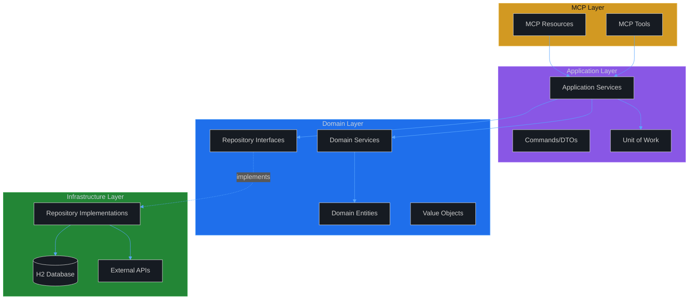
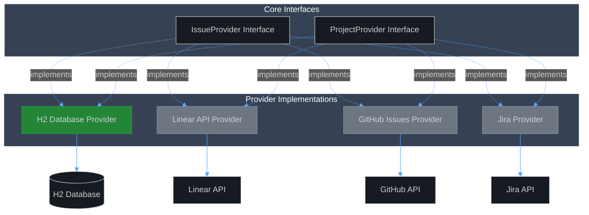
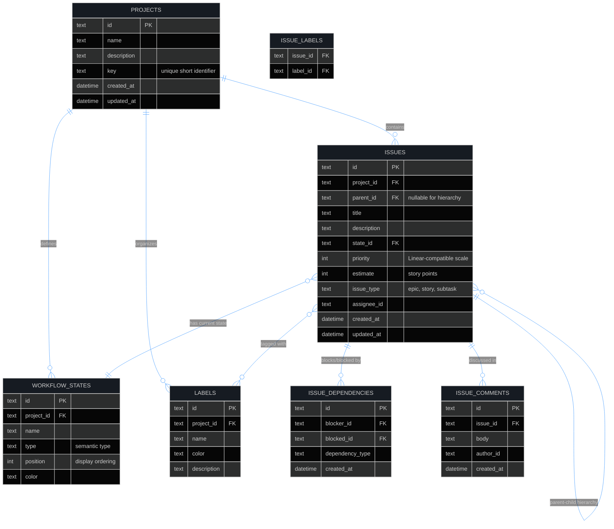
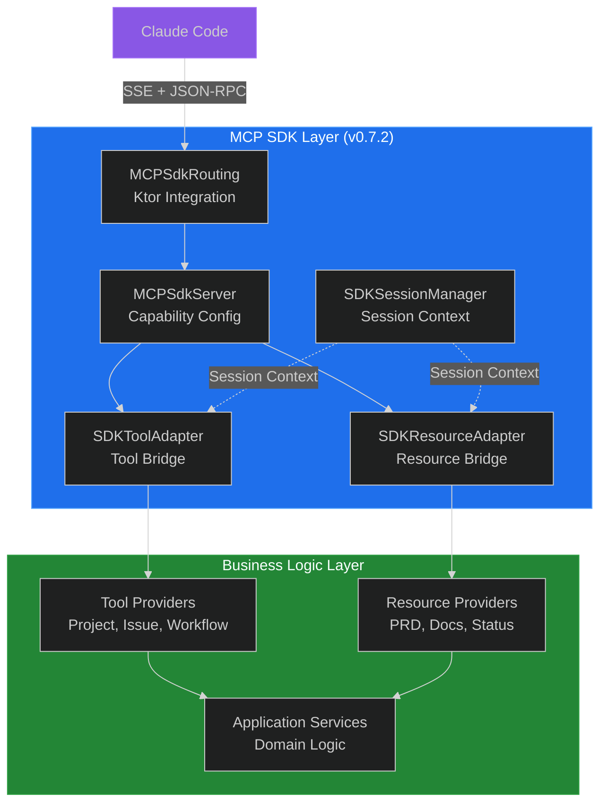

# CycleTime Technical Architecture

**Version:** 1.0  
**Date:** July 30, 2025  
**Authors:** Software Architect Agent, Claude Code

**Related Documents:**
📋 [PRD](../reference/PRD.md) | 👤 [User Experience](../reference/user-experience.md) | 🚀 [Onboarding Guide](../getting-started/onboarding.md)

---

## Overview

CycleTime (Project Orchestration Framework) implements a data and context provider architecture for Claude Code project management. The system provides structured project data, dependency tracking, and cross-session continuity through an embedded H2 database and MCP Resource integration.

### Architectural Principles

The CycleTime architecture is guided by four core principles that shape its design and implementation decisions. These principles ensure the system remains focused, maintainable, and well-integrated within the Claude Code ecosystem.

**Simplicity First**

CycleTime intentionally limits its scope to data and context provision rather than attempting complex orchestration. Claude Code handles agent delegation and workflow management, while CycleTime focuses on dependency graph traversal and basic CRUD operations. This division of responsibility keeps the system maintainable and prevents feature creep.

**Embedded-First Architecture**

The embedded H2 database serves as the default provider, enabling offline operation and concurrent access without external dependencies. This JVM-native approach integrates seamlessly with Exposed ORM and built-in connection pooling, providing immediate productivity for developers without configuration overhead.

**MCP Server Integration**

Built as a Claude Code MCP server, CycleTime integrates natively with the existing ecosystem. Project context flows to Claude Code agents through MCP Resources, while CycleTime leverages Claude Code's agent coordination capabilities rather than implementing custom orchestration logic.

**Context Provision Over Automation**

Rather than automating workflows, CycleTime exposes structured project data for Claude Code analysis. This approach supports manual workflows with rich context, enabling human-driven decisions backed by comprehensive project information and dependency insights.

## Domain-Driven Design Architecture

### Layered Architecture Approach

CycleTime follows **Domain-Driven Design** and **Hexagonal Architecture** principles with clear separation of concerns:



**Layer Responsibilities:**
- **Domain**: Core business logic, entities, repository interfaces
- **Application**: Use case orchestration, commands, Unit of Work
- **Infrastructure**: Repository implementations, database, external APIs
- **MCP**: Claude Code integration via Resources and Tools

### Domain Model Design

**Rich Domain Entities:**
- `Project`: Manages project state, issue relationships, archive rules
- `Issue`: Handles status transitions, hierarchy constraints
- Entities encapsulate business rules (e.g., "Cannot add issues to archived project")

**Value Objects for Type Safety:**
- `ProjectId`, `IssueId`: UUID-based identifiers with validation
- `IssueTitle`: String wrapper with length constraints
- Enums: `ProjectStatus`, `IssueStatus`, `IssueType`, `IssuePriority`

**Data Transfer Objects:**
- DTOs for serialization at infrastructure boundaries
- Separate domain models from persistence models

### Provider Implementation Status



| Provider            | Status   | Features                                                     | Primary Use Case                                     |
| ------------------- | -------- | ------------------------------------------------------------ | ---------------------------------------------------- |
| **H2 Database** | ✅ Current   | Embedded database, high-performance CRUD, concurrent access | Default provider (implemented in SPI-439, August 2025) |
| **Linear**          | 🔄 V2.0  | Linear API integration, team collaboration                   | Professional development, team coordination          |
| **GitHub Issues**   | 🔄 V3.0+ | Repository integration, basic workflows                      | OSS projects, GitHub-centric development             |
| **Jira**            | 🔄 V3.0+ | Enterprise workflows, custom fields                         | Enterprise development, complex organizations        |

### H2 Database Implementation Details

**Performance Characteristics:**
- Supports complex JOINs and aggregations for dependency analysis
- Built-in connection pooling and thread safety
- JVM-native memory management with caching and buffer management
- Cost-based query optimizer for dependency graph queries

**Exposed ORM Integration:**
- Native H2 support with JDBC driver
- Compile-time schema validation through Exposed DSL
- Type-safe query construction with Kotlin's type system
- Repository implementations with Exposed ORM patterns

**Development Features:**
- JVM-based debugging and profiling tools
- In-memory testing modes
- SQL compatibility modes (PostgreSQL/MySQL) for migration paths
- Spring Boot ecosystem patterns

## Data Models and Database Design

### Database Schema (H2)

The H2 database uses a schema designed for JVM integration, Exposed ORM compatibility, and straightforward migration to cloud providers:



**Key Schema Decisions:**

- **Hierarchy Enforcement**: Three-tier structure (Epic → Story → Subtask) enforced via CHECK constraints on `issue_type` and `parent_id` relationships
- **Flexible State Management**: Project-specific workflow states (`workflow_states`) enable custom processes while maintaining semantic types for orchestration logic
- **Dependency Graph**: Bidirectional relationships via `issue_dependencies` support complex task orchestration with cycle prevention through uniqueness constraints
- **Linear-Inspired Design**: Schema structure matches Linear's proven patterns, enabling straightforward data migration and familiar developer workflows

### Data Migration Strategy

Standardized export/import format supports provider switching:
- JSON-based export with version metadata
- Validation checksums for data integrity
- Hierarchy and dependency graph validation
- Incremental migration support

## Layered Architecture Components

### 1. Domain Layer

**Purpose**: Core business logic with no external dependencies.

**Key Components:**
- **Entities**: `Project`, `Issue` - encapsulate business rules and invariants
- **Value Objects**: `ProjectId`, `IssueTitle` - type safety and validation
- **Repository Interfaces**: `ProjectRepository`, `IssueRepository` - ports for data access
- **Domain Services**: Complex logic spanning multiple entities

### 2. Application Layer

**Purpose**: Orchestrates use cases, coordinates domain and infrastructure.

**Key Components:**
- **Application Services**: `ProjectApplicationService` - use case orchestration
- **Commands/DTOs**: Type-safe input contracts
- **Unit of Work**: Transaction coordination
- **Event Handlers**: Cross-aggregate coordination

**Interaction Pattern:**
MCP Tool → Application Service → Domain Entity → Repository → Database

### 3. Infrastructure Layer

**Purpose**: Technical implementations and external integrations.

**Key Components:**
- **Repository Implementations**: `H2ProjectRepository`, `H2IssueRepository` using Exposed ORM
- **Unit of Work**: `H2UnitOfWork` for transaction management
- **Migrations**: Schema evolution via `MigrationRunner`
- **External Integrations**: Linear, GitHub API adapters

### 4. MCP Layer

**Purpose**: Claude Code integration via Model Context Protocol.

**Key Components:**
- **Resources**: `ProjectResource`, `IssueResource` - read-only context provision
- **Tools**: `CreateIssueTool`, `UpdateIssueTool` - write operations
- **Registries**: Discovery and routing for resources and tools

### MCP SDK Integration (v0.7.2)

CycleTime uses the official MCP Kotlin SDK maintained by Anthropic and JetBrains for all Model Context Protocol functionality.

**Transport Architecture:**
- **Ktor Integration:** SDK provides native Ktor integration via `mcp { }` DSL
- **SSE Transport:** Server-Sent Events at root endpoint `/`
- **Protocol:** Automatic JSON-RPC 2.0 handling with MCP extensions
- **Session Management:** Stateless per-request with database persistence

**SDK Components:**
- `MCPSdkServer.kt` - Server initialization and capability configuration
- `MCPSdkRouting.kt` - Ktor routing integration
- `sdk/adapters/` - Bridge between business logic and SDK APIs
  - `SDKToolAdapter` - Adapts ToolProvider to SDK tool registration
  - `SDKResourceAdapter` - Adapts ResourceProvider to SDK resource registration
- `SDKSessionManager.kt` - Request metadata-based session handling
- `SessionContext.kt` - Session extraction utilities

**Migration (SPI-700/SPI-707):**

The SDK replaced our custom EventBus transport implementation:

| Component Removed | SDK Replacement |
|-------------------|-----------------|
| EventBus correlation | Per-request transport isolation |
| MCPPostHandler | SDK Ktor integration |
| MCPSSEHandler | SDK SSE implementation |
| JsonRpcProtocolHandler | SDK protocol handling |
| MCPSessionManager (legacy) | SDKSessionManager |

Benefits: Official support, automatic protocol updates, reduced maintenance, improved client compatibility.

#### MCP SDK Architecture



*Figure: MCP SDK integration architecture showing official SDK replacing custom transport*

### 3. Documentation Templates

**Purpose**: Provides basic documentation structure for project bootstrap.

**Key Responsibilities:**

- Standardized `docs/` directory structure creation
- Basic template provision for common project documents
- Manual documentation updates (no automated synchronization)
- Simple project structure generation

**Document Templates:**

- [PRD.md](../reference/PRD.md) - Product Requirements Document
- [overview.md](overview.md) - Technical Architecture (this document)
- [rest-endpoints.md](../api/rest-endpoints.md) - REST API Documentation
- OpenAPI Documentation - Available at `/swagger` endpoint when server is running
- [deployment-guide.md](../operations/deployment-guide.md) - Infrastructure and Deployment
- [ADR Directory](../reference/adr/) - Architecture Decision Records

### 4. MCP Server Integration

**Purpose**: Integrates with Claude Code through Model Context Protocol (MCP) to
provide project context.

**Key Responsibilities:**

- Expose project data through MCP Resources for Claude Code access
- Provide basic CRUD operations through MCP Tools
- Enable cross-session project state recovery
- Maintain simple, structured data provision interface

**MCP Resources Provided:**

```kotlin
// Project context for Claude Code analysis
@MCPResource("cycletime://project/{projectId}/context")
suspend fun getProjectContext(projectId: String): ProjectContext

// Unblocked tasks for task identification
@MCPResource("cycletime://project/{projectId}/unblocked-tasks")
suspend fun getUnblockedTasks(projectId: String): List<Issue>

// Dependency graph for relationship understanding
@MCPResource("cycletime://project/{projectId}/dependencies")
suspend fun getDependencyGraph(projectId: String): DependencyGraph
```

**MCP Tools Provided:**

```kotlin
// Basic issue operations
@MCPTool("cycletime_create_issue")
suspend fun createIssue(config: IssueConfig): Issue

@MCPTool("cycletime_update_issue_status")
suspend fun updateIssueStatus(issueId: String, status: String): Issue

@MCPTool("cycletime_add_dependency")
suspend fun addDependency(blockerId: String, blockedId: String)
```

### 5. Provider Storage

**Purpose**: Storage abstraction supporting multiple backends.

**Current Implementation:**
- H2 database (default, implemented)
- Basic CRUD operations
- Export/import for provider switching

**Future Providers:**
- Linear, GitHub Issues, Jira (planned)

### 6. Session Management

**Purpose**: Cross-session state persistence for Claude Code interactions.

See [Session Management](session-management.md) for complete technical reference.

**Key Features:**
- Domain-Driven Design with validation and auto-repair
- TimeProvider pattern for testable time operations
- Sub-millisecond performance with H2
- Automatic cleanup of expired/corrupted sessions

### 7. Development Workflow Integration

**Purpose**: Structured development practice support.

**Features:**
- TDD workflow orchestration (RED → GREEN → REFACTOR)
- Quality gate enforcement
- CI/CD pipeline integration
- Code quality metrics tracking

## Integration Patterns

### MCP Server Integration

**Integration via Model Context Protocol:**
- **Resources**: Expose project context to Claude Code (read-only)
- **Tools**: Provide CRUD operations and workflow actions
- **Registry**: Dynamic discovery and routing

### State Management

**Multi-Layer State Architecture:**
- **In-Memory**: Session context, caches, conversation state
- **Repository Documentation**: Version-controlled specs and ADRs
- **Issue Provider**: Authoritative project structure and progress

**Synchronization:** Pull from provider → Validate docs → Resolve conflicts → Update cache

## Technical Decision Rationale

### Provider-Agnostic Architecture

**Decision**: Implement unified interface abstraction rather than native
provider integration.

**Rationale**:

- Eliminates vendor lock-in concerns for individual developers
- Ensures feature parity regardless of chosen provider
- Enables seamless migration as project needs evolve
- Supports offline development with embedded database option

**Trade-offs**:

- Additional abstraction layer complexity
- Potential performance overhead for provider-specific optimizations
- Requires ongoing maintenance as provider APIs evolve

### Embedded Database Strategy

**Current**: H2 database serves as the default issue tracking provider for the Kotlin/JVM implementation (implemented in SPI-439, August 2025).

**Rationale**:

- Zero external dependencies for immediate productivity
- Native JVM integration with Exposed ORM for type-safe database operations
- Concurrent access support with built-in connection pooling
- Supports offline operation without external services
- JVM-native memory management and query execution
- Linear-inspired schema design enables migration to cloud providers
- No account setup or authentication requirements

**Trade-offs**:

- No built-in team collaboration features (resolved with provider switching)
- Requires manual backup and synchronization for distributed teams
- Limited advanced reporting compared to enterprise solutions

### MCP Server Architecture

**Decision**: Build CycleTime as a Claude Code MCP server rather than standalone
application.

**Rationale**:

- Native integration with Claude Code ecosystem and existing tools
- Leverages established user workflows and interaction patterns
- Access to comprehensive file system and development tool integration
- Utilizes Claude Code's built-in agent system for task delegation

**Trade-offs**:

- Dependency on Claude Code platform for operation
- Limited portability to other AI development environments
- Requires understanding of MCP protocol for customization

### Linear-Inspired Data Schema

**Decision**: Model embedded database schema after Linear's structure and
terminology.

**Rationale**:

- Linear represents current best practices in issue tracking design
- Familiar terminology and concepts for professional developers
- Straightforward migration path for users wanting to transition to Linear
- Proven scalability and workflow patterns

**Trade-offs**:

- May not align perfectly with other provider data models
- Requires transformation for providers with different paradigms
- Potential feature gaps for providers with unique capabilities

## Performance & Security

### Performance Targets
- Support for 10,000+ issues per project
- Comprehensive indexing for dependency graph queries
- Configurable caching (LRU) and lazy loading

### Security
- Database encryption at rest (system keychain)
- TLS 1.3 for external APIs
- Platform-appropriate credential storage
- Activity audit trail

## Cross-References

- **Business Requirements**: See [PRD](../reference/PRD.md) for functional requirements and success criteria
- **User Workflows**: See [User Experience](../reference/user-experience.md) for detailed user interaction patterns
- **API Documentation**: See [MCP Resources](../api/mcp-resources.md) for detailed MCP server interface specifications
- **Deployment Guide**: See [Deployment Guide](../operations/deployment-guide.md) for installation and configuration instructions

---

This architecture provides the technical foundation for CycleTime's comprehensive
project orchestration capabilities while maintaining flexibility, performance,
and developer control principles outlined in the product requirements.
