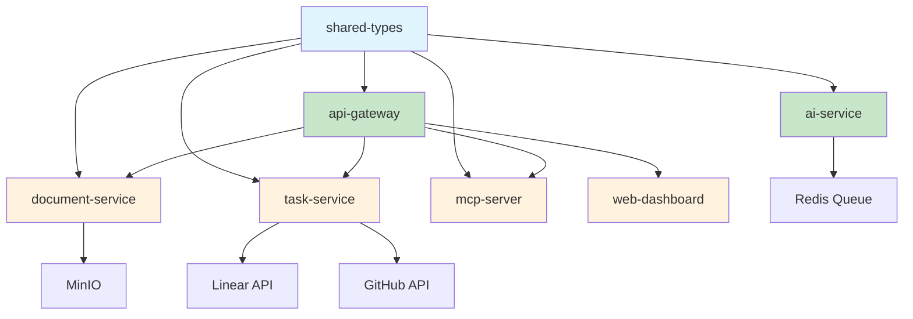

# Service Migration Documentation Index

## Overview

This documentation suite provides comprehensive guidance for migrating Docker services to TypeScript packages in the CycleTime monorepo. The migration strategy enables better code sharing, type safety, testing, and development workflows while maintaining service isolation and deployment flexibility.

## Documentation Structure

### 📚 Core Documentation

#### [Service Migration Guide](./service-migration-guide.md)
**Primary resource** - Comprehensive overview of migration strategy, benefits, and high-level approach.

**Key Topics:**
- Migration strategy and benefits
- Service inventory and priority matrix
- Migration patterns and architecture
- Common pitfalls and solutions
- Performance and security considerations

#### [Package Creation Patterns](./package-creation-patterns.md)
**Template library** - Standardized templates and patterns for creating TypeScript packages.

**Key Topics:**
- Package.json templates for web services and libraries
- TypeScript and Jest configuration patterns
- Source code templates and structure
- Docker integration patterns
- Best practices and naming conventions

#### [Migration Checklist](./migration-checklist.md)
**Step-by-step guide** - Detailed checklist for executing service migrations.

**Key Topics:**
- Pre-migration analysis and planning
- 8-phase migration process
- Quality assurance checkpoints
- Common issues and solutions
- Success criteria and validation

#### [Migration Examples](./migration-examples.md)
**Real-world examples** - Concrete examples using actual CycleTime services.

**Key Topics:**
- Document service migration (MinIO integration)
- Task service migration (Linear/GitHub APIs)
- Before/after comparisons
- Implementation highlights
- Testing strategies

### 🛠️ Templates and Tools

#### [Migration Templates Directory](./migration-templates/)
**Automation tools** - Ready-to-use templates and automation scripts.

**Contents:**
- `package.json.template` - Package configuration template
- `tsconfig.json.template` - TypeScript configuration
- `jest.config.js.template` - Testing configuration  
- `Dockerfile.template` - Container configuration
- `create-package.sh` - Package creation automation script

## Migration Workflow

### 1. Planning Phase
1. Read [Service Migration Guide](./service-migration-guide.md) for strategy overview
2. Review [Migration Examples](./migration-examples.md) for similar services
3. Use [Migration Checklist](./migration-checklist.md) for planning

### 2. Implementation Phase
1. Use automation: `./docs/architecture/migration-templates/create-package.sh`
2. Follow [Package Creation Patterns](./package-creation-patterns.md) for structure
3. Reference [Migration Examples](./migration-examples.md) for implementation details

### 3. Validation Phase
1. Execute [Migration Checklist](./migration-checklist.md) validation steps
2. Follow testing patterns from [Package Creation Patterns](./package-creation-patterns.md)
3. Review quality criteria in [Service Migration Guide](./service-migration-guide.md)

## Quick Start

### Create a New Service Package

```bash
# Navigate to project root
cd /path/to/cycletime

# Create web service package
./docs/architecture/migration-templates/create-package.sh \
  document-service \
  "Document processing and storage service" \
  web-service

# Create library package  
./docs/architecture/migration-templates/create-package.sh \
  shared-utils \
  "Common utility functions" \
  library
```

### Migration Command Reference

```bash
# Pre-migration analysis
npm run build --workspace=@cycletime/existing-service
npm run test --workspace=@cycletime/existing-service

# Package creation
./docs/architecture/migration-templates/create-package.sh service-name "description" type

# Post-migration validation
npm run build
npm run test
npm run lint
npm run typecheck

# Docker integration test
docker compose build service-name
docker compose up service-name
```

## Current Migration Status

### ✅ Completed Migrations

1. **shared-types** - Core type definitions
2. **ai-service** - AI provider abstraction (replaces claude-service)
3. **api-gateway** - HTTP gateway and authentication

### 🔄 In Progress

- None currently in progress

### 📋 Pending Migrations

4. **document-service** - File storage and processing (High Priority)
5. **task-service** - Linear/GitHub integration (High Priority)
6. **mcp-server** - MCP protocol implementation (Medium Priority)
7. **web-dashboard** - Frontend application (Medium Priority)

## Service Dependencies



**Legend:**
- 🔵 Blue: Core shared packages
- 🟢 Green: Completed migrations
- 🟡 Orange: Pending migrations

## Best Practices Summary

### 1. Package Structure
- Use consistent naming: `@cycletime/service-name`
- Follow established directory structure
- Implement comprehensive health checks

### 2. Configuration Management
- Use Zod for environment variable validation
- Provide sensible defaults
- Document all configuration options

### 3. Testing Strategy
- Maintain 80%+ test coverage
- Implement unit, integration, and E2E tests
- Use test setup files for consistency

### 4. Docker Integration
- Use multi-stage builds for optimization
- Implement proper health checks
- Configure security best practices

### 5. Development Workflow
- Follow TDD practices (Red-Green-Refactor)
- Use TypeScript strict mode
- Implement proper error handling

## Troubleshooting

### Common Issues

1. **TypeScript Compilation Errors**
   - Check module resolution in tsconfig.json
   - Verify workspace dependencies use `workspace:*`
   - Ensure all dependencies are installed

2. **Docker Build Failures**
   - Verify build context is project root
   - Check .dockerignore doesn't exclude necessary files
   - Ensure COPY commands use correct paths

3. **Test Failures in CI**
   - Check environment variable configuration
   - Verify test database setup
   - Ensure file system compatibility

4. **TurboRepo Cache Issues**
   - Clear cache: `npx turbo clean`
   - Check dependency graph: `npx turbo run build --dry-run`
   - Verify outputs configuration in turbo.json

### Getting Help

1. Review relevant documentation sections
2. Check migration examples for similar patterns
3. Consult the migration checklist for missed steps
4. Reference existing migrated packages for patterns

## Contributing

When updating migration documentation:

1. Keep all documents synchronized
2. Update examples when patterns change
3. Maintain automation scripts
4. Add new patterns to templates
5. Update this index when adding new documentation

## Related Architecture Documentation

- [TurboRepo Monorepo Strategy](./monorepo-strategy.md)
- [CI/CD Pipeline](./ci-cd-pipeline.md)
- [System Overview](./system-overview.md)

---

*Last updated: Generated for SPI-79 service migration documentation*