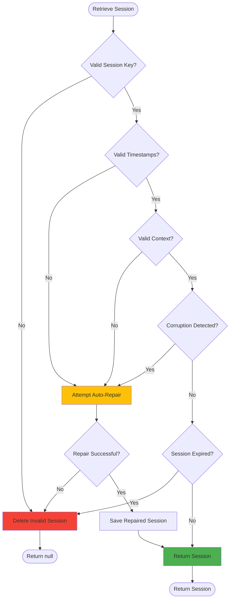
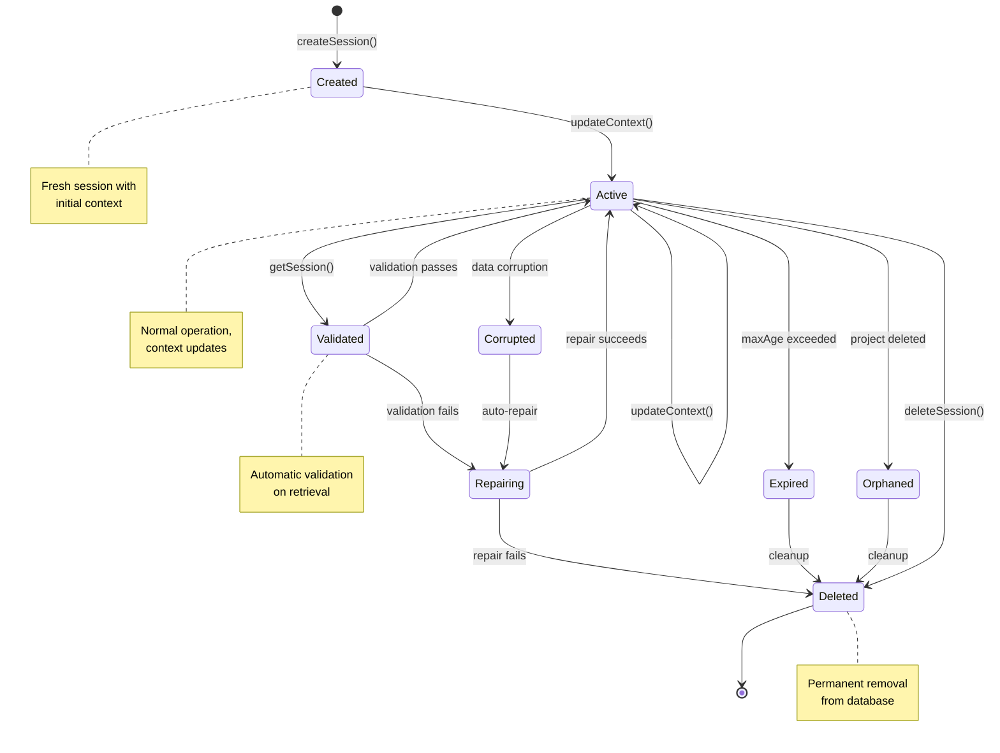

# Session Management Technical Reference

**Version:** 1.0  
**Date:** January 2025  
**Implementation:** SPI-346 Cross-Session State Persistence

**Related Documents:**  
🏗️ [ARCHITECTURE.md](ARCHITECTURE.md) | 👤 [USER_EXPERIENCE.md](USER_EXPERIENCE.md) | 🧪 [CLAUDE.md](../CLAUDE.md#testing-standards--architecture)

---

## Overview

The CycleTime Session Management system provides cross-session state persistence for Claude Code interactions, implementing Domain-Driven Design patterns with validation, automatic repair, and lifecycle management. This document serves as the technical reference for developers working with or extending the session management capabilities.

## Architecture Overview

### Design Principles

1. **Domain-Driven Design**: Rich domain model encapsulating business logic
2. **Dependency Injection**: TimeProvider pattern for testable time operations
3. **Data Integrity First**: Automatic validation and repair of corrupted data
4. **Performance Optimized**: Sub-millisecond operations with H2
5. **Test-Driven Development**: High test coverage with time-mocked tests for reliability

### Layer Architecture

| Layer | Component(s) | Responsibility |
|-------|-------------|----------------|
| **MCP Integration** | `SessionManager` | Claude Code integration via MCP protocol |
| **Application Services** | `SessionApplicationService` | Use case orchestration with Unit of Work |
| **Domain Services** | `SessionValidator`, `SessionCleanupService` | Validation rules and lifecycle management |
| **Domain Entities** | `Session`, `SessionKey`, `SessionContext` | Core business logic and invariants |
| **Infrastructure** | `H2SessionRepository` | Database persistence implementation |
| **Database** | H2 with indexes | Physical data storage layer |

## Core Components

### Domain Layer

#### Core Domain Components

**Session Entity:**
- Manages session state with business logic
- Key methods: `updateContext()`, `touch()`, `isExpired()`
- TimeProvider injection for testable time operations

**SessionKey Value Object:**
- Type-safe UUID v4 identifier with validation
- Factory method for generation

**SessionContext:**
- Structured data: `activeIssues`, `workflowStage`, `lastAction`, `contextData`

### Application Layer

#### SessionApplicationService

Orchestrates session CRUD operations with Unit of Work pattern for transactional consistency.

### Domain Services

#### SessionValidator

Validates and repairs session data integrity with configurable rules (max context size, active issues limit, string length constraints).

**Validation Flow:**



**Validation Checks:**
- Session key format (UUID v4)
- Timestamp consistency (createdAt <= updatedAt <= now)
- Context data structure and size limits
- Corruption detection (null bytes, control characters)
- Duplicate detection in arrays

**Auto-Repair Capabilities:**
- Fix timestamp inconsistencies
- Remove duplicate array entries
- Sanitize string data (remove null bytes)
- Restore missing required fields with defaults

#### SessionCleanupService

Manages session lifecycle: identifies expired, orphaned, and corrupted sessions with configurable cleanup policies.

### Infrastructure Layer

#### H2SessionRepository

Repository implementation using prepared statements for all CRUD operations with proper connection lifecycle management.

### MCP Integration Layer

#### SessionManager

High-level interface for Claude Code MCP integration providing session CRUD, lifecycle management, and conflict detection with configurable policies (maxAge, autoCleanup, cleanupInterval).

## Database Schema

### session_states Table

```sql
CREATE TABLE IF NOT EXISTS session_states (
  id VARCHAR(36) PRIMARY KEY DEFAULT RANDOM_UUID(),
  session_key VARCHAR(36) UNIQUE NOT NULL,
  project_id VARCHAR(36),
  current_context TEXT,  -- JSON serialized SessionContext
  last_activity TIMESTAMP NOT NULL DEFAULT CURRENT_TIMESTAMP,
  created_at TIMESTAMP NOT NULL DEFAULT CURRENT_TIMESTAMP,
  updated_at TIMESTAMP NOT NULL DEFAULT CURRENT_TIMESTAMP,
  FOREIGN KEY (project_id) REFERENCES projects(id)
);

-- Performance Indexes
CREATE INDEX idx_session_states_key ON session_states(session_key);
CREATE INDEX idx_session_states_activity ON session_states(last_activity);
CREATE INDEX idx_session_states_project ON session_states(project_id);
```

### Migration Strategy

Sessions are managed through the migration system:

```kotlin
// Migration 002: Add session state tracking
val migrations = listOf(
    Migration(
        version = "002",
        description = "Add session state tracking",
        sql = CREATE_SESSION_STATES_SQL
    )
)
```

## API Operations

### Session Lifecycle
- **Create**: Generate session with optional project context and initial data
- **Retrieve**: Get session with automatic validation and expiration checks
- **Update**: Modify context with automatic activity tracking
- **Delete**: Remove session and cleanup resources

See implementation code for detailed API signatures.

### Session Lifecycle

**State Machine:**



**Lifecycle Operations:**
- Expiration checks with configurable maxAge
- Automated cleanup (expired/orphaned/corrupted sessions)
- Conflict detection for project sessions

## Configuration

**Default Settings:**
- maxAge: 7 days
- autoCleanup: enabled (hourly)
- maxContextSize: 1MB
- maxActiveIssues: 100

**Configurable Policies:**
- Session lifetime and cleanup intervals
- Validation rules (context size, issue limits)
- Auto-repair vs delete-on-corruption

## Testing

**Unit Testing:**
- TimeProvider mocking for time-dependent operations
- Mock services for isolated business logic testing
- No real database dependencies

**Integration Testing:**
- Real H2 database with temporary files
- Full persistence and retrieval workflows
- Validation of cross-restart continuity

## Performance Characteristics

### Observed Operation Performance

The following performance characteristics were observed during development testing with H2 in-memory database. Actual performance will vary based on hardware, database mode, and workload patterns.

| Operation | Typical Range |
|-----------|--------------|
| Create Session | Sub-millisecond |
| Get Session (with validation) | Sub-millisecond |
| Update Context | Sub-millisecond |
| Delete Session | Sub-millisecond |
| Bulk Cleanup (1000 sessions) | 50-100ms |
| Validation & Repair | 1-5ms |

### Memory Usage Estimates

- **Per Session in Memory**: ~1KB
- **Repository Statement Cache**: ~10KB
- **Validator Rules Cache**: ~2KB
- **Total Overhead**: ~15KB + (1KB × active sessions)

### Database Optimization

- **Index Coverage**: All queries utilize indexes to avoid full table scans
- **Query Optimization**: Prepared statements and connection pooling enabled
- **Scalability**: Designed to handle thousands of concurrent sessions

## Error Handling

### Error Types

```kotlin
// Domain Errors
class InvalidSessionKeyError(message: String) : Exception(message)
class InvalidSessionDataError(message: String) : Exception(message)
class SessionNotFoundError(message: String) : Exception(message)
class SessionExpiredError(message: String) : Exception(message)

// Validation Errors
class SessionValidationError(
    message: String,
    val errors: List<ValidationError>
) : Exception(message)

// Corruption Errors
class SessionCorruptionError(
    message: String,
    val sessionKey: String,
    val corruptionType: String
) : Exception(message)

// Storage Errors
class SessionStorageError(
    val operation: String,
    cause: Throwable
) : Exception("Storage error during $operation", cause)
```

### Error Recovery Strategies

1. **Validation Failures**: Attempt auto-repair, delete if unrepairable
2. **Corruption Detection**: Log, attempt repair, quarantine if severe
3. **Storage Errors**: Retry with exponential backoff
4. **Expiration**: Clean delete with audit log
5. **Conflicts**: Resolve by last-write-wins or merge strategies

## Migration & Future Support

**Migration Path:**
- In-memory sessions → Persistent H2 sessions
- Plain objects → Rich domain entities with validation

**Future Providers:**
- Provider abstraction supports Redis, PostgreSQL, DynamoDB
- Planned for v2.0+

## Implementation Guidelines

**Time Handling:** Always use TimeProvider injection (never direct `Date.now()`)
**Expiration:** Handle expired sessions gracefully (create new or restore state)
**Context Size:** Validate before updates to prevent exceeding limits
**Structured Data:** Use SessionContext interface consistently
**Test Cleanup:** Properly shutdown managers and close database connections

## Troubleshooting

### Common Issues

#### Session Not Persisting

**Symptom**: Session lost after restart
**Cause**: Database not properly initialized or migrations not run
**Solution**: Ensure migrations are run on startup

```kotlin
val db = Database.connect(dbPath)
runMigrations(db) // Required!
```

#### Session Validation Failures

**Symptom**: Sessions being deleted unexpectedly
**Cause**: Corruption or invalid data
**Solution**: Enable auto-repair or relax validation rules

```kotlin
val sessionManager = SessionManager(
    sessionService = sessionService,
    timeProvider = timeProvider,
    databaseProvider = null,
    config = SessionConfig(
        maxContextSize = 2 * 1024 * 1024 // Increase limit
    )
)
```

#### Performance Degradation

**Symptom**: Slow session operations
**Cause**: Too many sessions, missing indexes
**Solution**: Enable aggressive cleanup, verify indexes

```kotlin
// Check indexes
// H2 schema introspection for indexes

// Aggressive cleanup
val cleanupResult = sessionManager.cleanupSessions()
```

## Future Enhancements

### Planned Features

1. **Session Merge**: Intelligent merging of conflicting sessions
2. **Session Templates**: Pre-configured session contexts for common workflows
3. **Session Analytics**: Detailed metrics and usage patterns
4. **Session Export/Import**: Backup and restore capabilities
5. **Multi-Provider Support**: Redis, PostgreSQL, DynamoDB backends
6. **Session Encryption**: At-rest encryption for sensitive context
7. **Session Sharing**: Team collaboration with shared sessions
8. **Session History**: Full audit trail of session modifications

### Extension Points

The architecture provides clear extension points for future enhancements:

- **Custom Validators**: Implement `ValidationRule` interface
- **Custom Cleanup Strategies**: Extend `CleanupService`
- **Storage Providers**: Implement `SessionRepository` interface
- **Context Serializers**: Custom serialization strategies
- **Event Handlers**: Session lifecycle event hooks

## Conclusion

The CycleTime Session Management system implements cross-session state persistence using Domain-Driven Design principles. The architecture includes validation, automatic repair capabilities, and lifecycle management to support session continuity for Claude Code interactions.

For questions or contributions, refer to the main project documentation or submit issues through the project's issue tracking system.