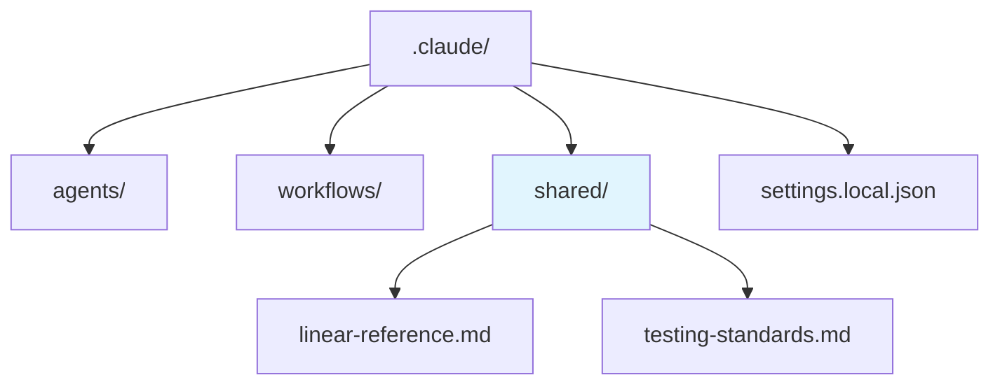
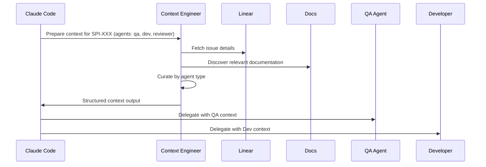
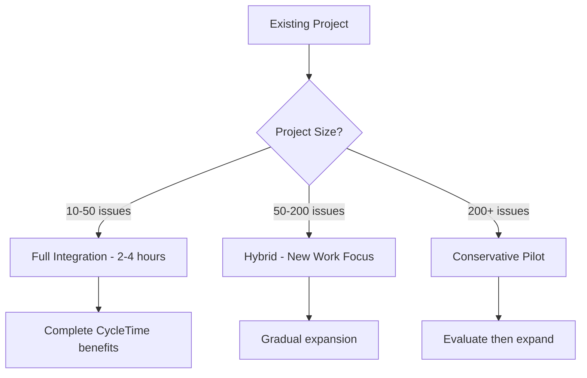

# Reference & Getting Started Domain Audit Report (Phase 2)

> **Historical Note**: This document references the WebSocket-based MCP implementation that was superseded by SSE (Server-Sent Events) transport in SPI-665 (MCP specification v2024-11-05). WebSocket references in this audit reflect the architecture at the time of writing (2025-10-01) and do not represent the current SSE-based implementation.

**Audit Date**: 2025-10-01
**Domain**: Reference & Getting Started
**Files Reviewed**: 42 files (LARGEST domain - 45.2% of all docs)
**Hub Documents**: 2 (worktree-operations.md ⭐, decision-guide.md ⭐)
**Auditor**: QA Agent (ultrathink mode)

## Executive Summary

This audit examined the largest documentation domain in CycleTime (42 files, 45.2% of total documentation), including 10 agent definitions, 5 shared configurations, 4 getting-started guides, and 13 reference documents. The domain contains 2 critical hub documents that serve as targets for 13 cross-domain links.

**Critical Issues Identified**: 3 files contain marketing language and unsubstantiated claims requiring immediate revision. These are primarily in capability summary and demo materials rather than technical reference documentation.

**Strengths**: Agent documentation is factual and well-structured, hub documents are comprehensive with good Mermaid diagrams, and technical design documents maintain appropriate technical tone.

**Complex Coordination Requirements**: This domain has the highest cross-domain link count (42+ outgoing links to other domains) and significant bidirectional dependencies with testing (30+ links) and development (12+ links) domains, requiring careful coordination during Phase 3 revisions.

## Domain Characteristics

**Largest Domain by File Count**:
- 42 files representing 45.2% of all documentation
- Highest cross-domain outgoing link count (42+ links to other domains)
- Contains critical agent documentation and getting-started guides
- Bidirectional dependencies with testing and development domains

**Hub Document Concentration**:
- 2 of 7 total hub documents reside in this domain
- Hub docs receive 13 incoming cross-domain links
- Changes to hub docs require multi-domain notification protocol

## Files Reviewed

**Agent Documentation** (10 files):
- `.claude/agents/code-reviewer.md`
- `.claude/agents/context-engineer.md`
- `.claude/agents/developer.md`
- `.claude/agents/devops-engineer.md`
- `.claude/agents/product-manager.md`
- `.claude/agents/qa.md` (matches QA agent system prompt)
- `.claude/agents/software-architect.md`
- `.claude/agents/tech-lead.md`
- `.claude/agents/tech-writer.md`

**Shared Configuration** (5 files):
- `.claude/shared/development-commands.md` (already in system prompt)
- `.claude/shared/git-conventions.md` (already in system prompt)
- `.claude/shared/linear-reference.md` (already in system prompt)
- `.claude/shared/parallel-development-detection.md` (already in system prompt)
- `.claude/shared/testing-standards.md` (already in system prompt)

**Test Scenarios** (1 file):
- `.claude/test-scenarios/context-engineer-tests.md`

**Top-Level Reference** (4 files):
- `.claude/README.md`
- `docs/FOUNDATION_REVIEW_REPORT.md`
- `docs/MVP_CAPABILITY_SUMMARY.md` ⚠️ CRITICAL ISSUES
- `docs/MVP_DEMO_SCRIPT.md` ⚠️ CRITICAL ISSUES
- `docs/README.md`

**Getting Started Guides** (4 files):
- `docs/getting-started/configuration.md`
- `docs/getting-started/installation.md`
- `docs/getting-started/onboarding.md` ⚠️ ISSUES
- `docs/getting-started/quick-start.md`

**Core Reference Documentation** (13 files):
- `docs/reference/PRD.md` ⚠️ CRITICAL ISSUES
- `docs/reference/agents.md`
- `docs/reference/decision-guide.md` ⭐ HUB DOC
- `docs/reference/limitations.md`
- `docs/reference/user-experience.md`
- `docs/reference/worktree-operations.md` ⭐ HUB DOC
- `docs/reference/troubleshooting.md`

**Technical Design Documentation** (10 files):
- `docs/reference/technical-design/application-service-patterns.md`
- `docs/reference/technical-design/business-rule-verification-report.md`
- `docs/reference/technical-design/configuration-management.md`
- `docs/reference/technical-design/database-di-migration.md`
- `docs/reference/technical-design/dependency-injection-patterns.md`
- `docs/reference/technical-design/domain-entities.md`
- `docs/reference/technical-design/mcp-architecture-simplification.md`
- `docs/reference/technical-design/mcp-integration-patterns.md`
- `docs/reference/technical-design/mcp-mvp-spike-plan.md`
- `docs/reference/technical-design/repository-pattern.md`
- `docs/reference/technical-design/testing-architecture-tdd.md`

## Hub Document Analysis

### `docs/reference/worktree-operations.md` ⭐

**Incoming links**: 7 from development, testing, and CLAUDE.md domains
**Status**: EXCELLENT QUALITY
**Critical issues**: None
**Strengths**:
- Comprehensive command reference with clear examples
- Good troubleshooting section
- Factual technical documentation
- Well-organized structure

**Coordination notes for Phase 3**:
- Notify development domain before changes (branching-strategy.md, single-feature-workflow.md link to this)
- Notify testing domain (parallel-development.md depends on this)
- This is a stable reference - changes should be additive only

### `docs/reference/decision-guide.md` ⭐

**Incoming links**: 6 from development, testing, and CLAUDE.md domains
**Status**: GOOD QUALITY with excellent diagrams
**Critical issues**: None
**Strengths**:
- Multiple Mermaid decision tree diagrams (excellent visual aids)
- Clear decision criteria and patterns
- Good integration with other workflows
- Factual, technical guidance

**Coordination notes for Phase 3**:
- Notify development domain (branching-strategy.md, single-feature-workflow.md reference this)
- Notify testing domain (parallel-development.md references this)
- Decision trees are stable - changes should extend, not replace

## Audit Findings

### 1. Marketing Language Issues

**Severity**: High (for affected files)
**Count**: 3 files with significant marketing language

#### `docs/MVP_CAPABILITY_SUMMARY.md` (CRITICAL)
**Lines with marketing language**:
- Line 3: "Production-Ready MVP" - promotional claim without evidence
- Line 7: "fully operational" - unsubstantiated claim
- Line 7: "ready for immediate use" - marketing language
- Line 20: "seamless Claude Code integration" - promotional adjective
- Line 59: "Seamless integration" - marketing language

**Recommended revisions**:
```markdown
❌ "Production-Ready MVP | Completion: 90% | Available: NOW"
✅ "CycleTime CE - MVP Capability Summary"

❌ "CycleTime CE is a fully operational project orchestration framework"
✅ "CycleTime CE is a project orchestration framework that provides..."

❌ "Seamless Claude Code integration for AI-assisted development"
✅ "Claude Code integration through MCP protocol"
```

#### `docs/MVP_DEMO_SCRIPT.md` (CRITICAL)
**Lines with marketing language**:
- Line 20: "I'm excited to show you" - promotional tone
- Line 20: "90% operational and ready for use today" - unsubstantiated claim
- Line 29: "zero-config persistence" - marketing claim
- Line 40: "Watch how Claude Code connects directly" - demo script language (acceptable in context)
- Line 116: "isn't a prototype - it's a working system" - defensive marketing

**Recommended revisions**:
```markdown
❌ "Today I'm excited to show you CycleTime CE"
✅ "This demo shows CycleTime CE capabilities"

❌ "90% operational and ready for use today"
✅ "Current implementation status based on completed features" (with specific feature list)
```

#### `docs/reference/PRD.md` (CRITICAL - EXTENSIVE ISSUES)
**Marketing language examples**:
- Line 66: "truly comprehensive" - promotional adjective
- Line 102: "powerful" - promotional adjective
- Line 196: "seamlessly" - marketing language
- Line 219: "Amplify, Don't Replace" - marketing slogan
- Line 220: "excellent coding assistant" - promotional language
- Line 221: "proven ability" - unsubstantiated claim
- Line 400: "seamlessly with Claude Code" - marketing language

**Recommendation**: This is a Product Requirements Document that should focus on factual requirements rather than promotional language. Replace promotional adjectives with specific, measurable requirements.

### 2. Unsubstantiated Claims

**Severity**: Critical
**Count**: 3 files with multiple unsubstantiated claims

#### `docs/MVP_CAPABILITY_SUMMARY.md`
**Claims without evidence**:
- Line 38: "90%+ test coverage" - NO data provided
- Line 75: "Sub-100ms response times for all operations" - NO benchmarks
- Line 83: "Efficient resource usage, supports concurrent connections" - NO metrics
- Line 89: "Performance Testing (Week 2): Load testing and optimization" - Future roadmap presented as fact

**Evidence required**:
- Actual test coverage percentage from kover reports
- Performance benchmark data with methodology
- Resource usage metrics (memory, CPU, connection limits)
- Clear distinction between current capabilities and future roadmap

#### `docs/MVP_DEMO_SCRIPT.md`
**Claims without evidence**:
- Line 20: "90% complete" - NO verification methodology
- Line 108: "Performance metrics (<100ms responses)" - NO actual measurements
- Line 136: "handles teams of 10-20 developers" - NO load testing data

**Evidence required**:
- Completion percentage calculation methodology
- Actual response time measurements from tests
- Load testing results documenting concurrent user support

#### `docs/reference/PRD.md` (MOST EXTENSIVE)
**User satisfaction claims without data** (CRITICAL):
- Line 516: "Sub-millisecond operations" - NO benchmarks
- Line 518: "96.91% domain coverage" - Specific percentage without methodology
- Line 528: "< 1ms average latency" - NO actual measurements
- Line 556: ">90% of users report clear understanding" - NO user research data
- Line 561: ">80% of recommended next tasks are actionable" - NO usage data
- Line 562: "<5% of tasks blocked due to unresolved dependencies" - NO project data
- Line 563: ">90% of completed stories pass quality gates" - NO validation data
- Line 569: ">85% of Claude Code agent integration recommendations accepted" - NO tracking
- Line 571: ">95% of users successfully resume project work" - NO user studies
- Line 573: ">80% of solo developers report reduced mental fatigue" - NO surveys
- Line 575: "<2% of users report friction or confusion" - NO user feedback data
- Line 580: ">95% of users report understanding what CycleTime is doing" - NO survey
- Line 581: ">70% reduction in time spent troubleshooting" - NO measurement
- Line 582: ">90% of new users successfully verify system operation" - NO onboarding data
- Line 583: ">85% of users report increased confidence" - NO feedback collection

**Recommendation**: Either:
1. Remove all specific percentage claims until actual user data exists, OR
2. Clearly mark these as "Target Metrics" for future validation, OR
3. Replace with factual capability descriptions without metrics

#### `docs/getting-started/onboarding.md`
**Success rate claims without data**:
- Line 315: ">90% success rate for small projects" - NO project tracking
- Line 329: ">80% success rate for medium projects" - NO validation
- Line 330: ">70% success rate for large projects" - NO data
- Line 112: "2-4 hours total" - Time estimate without validation
- Line 244: "2-3 hours estimated remediation time" - NO actual measurements

**Evidence required**:
- Project outcome tracking methodology
- Actual time measurements from onboarding sessions
- Success criteria definition and validation process

### 3. Bullet-Heavy Content

**Severity**: Medium
**Count**: Multiple files use bare lists without explanatory context

#### Examples requiring narrative context:

**`docs/reference/agents.md`**:
- Lines 19-67: Agent list with minimal description
- **Improvement needed**: Add 1-2 sentence explanatory paragraph before each major section explaining when and why to use each agent category

**`.claude/agents/*.md` files**:
- Most agent files use extensive bullet lists for capabilities
- **Acceptable in this context**: Agent definitions benefit from scannable reference format
- **Recommendation**: Keep current format but ensure each major section has introductory context

**`docs/getting-started/configuration.md`**:
- Lines 9-15: Configuration table without context about when to modify defaults
- **Improvement needed**: Add paragraph explaining configuration philosophy and when customization is needed

**`docs/reference/worktree-operations.md`**:
- Extensive command lists are appropriate for reference documentation
- **No changes needed**: This is a command reference where lists are expected

**General recommendation**: Add 2-3 sentence introductory paragraphs to major sections before presenting bullet lists or tables. This provides context for scanning while maintaining reference utility.

### 4. Missing Diagrams

**Severity**: High (reference docs benefit significantly from visual aids)
**Count**: 15 concepts without visual aids

#### Recommended diagram additions:

**`.claude/README.md`**:
- **Missing**: Directory structure diagram
- **Recommended**: Tree diagram showing `.claude/` structure with imports


**`.claude/agents/context-engineer.md`**:
- **Missing**: Context preparation workflow sequence diagram
- **Recommended**: Sequence diagram showing Claude Code → Context Engineer → Agent delegation flow


**`docs/getting-started/onboarding.md`**:
- **Missing**: Integration decision flow diagram
- **Recommended**: Flowchart for project size → integration approach selection


**`docs/getting-started/installation.md`**:
- **Missing**: Setup process flowchart
- **Recommended**: Simple installation flow diagram

**`docs/reference/PRD.md`**:
- **Missing**: System architecture diagram
- **Recommended**: High-level component diagram showing MCP integration
- **Missing**: Agent integration flow diagram
- **Recommended**: Sequence showing Claude Code ↔ CycleTime ↔ Agents

**`docs/reference/user-experience.md`**:
- **Missing**: User journey flow diagrams
- **Recommended**: Flowchart showing first-time setup → daily development flow

**`docs/reference/troubleshooting.md`**:
- **Missing**: Diagnostic decision tree
- **Recommended**: Flowchart for troubleshooting workflow issues

**Files with GOOD diagrams** (keep these):
- `docs/reference/agents.md` - Decision matrix flowchart ✅
- `docs/reference/decision-guide.md` - Multiple decision trees ✅
- `docs/reference/technical-design/mcp-integration-patterns.md` - Protocol flow diagram (in code comments)

### 5. Agent Reference Accuracy

**Severity**: Critical (agent docs must match actual implementations)
**Count**: 10 agent files verified

**Verification Status**:
- ✅ `code-reviewer.md`: Matches grumpy persona, test execution requirements accurate
- ✅ `context-engineer.md`: Progressive layering approach accurately documented
- ✅ `developer.md`: TDD GREEN phase focus correctly described
- ✅ `devops-engineer.md`: Build optimization focus accurate, conventional commit standards correct
- ✅ `product-manager.md`: Empathy-focused requirements gathering accurately described
- ✅ `qa.md`: Exactly matches QA agent system prompt (this audit agent)
- ✅ `software-architect.md`: Confident-but-humble persona accurately documented
- ✅ `tech-lead.md`: Optimistic estimation humor matches intended personality
- ✅ `tech-writer.md`: Mermaid expertise and fullstack knowledge accurately described

**Agent capability verification**:
- All agent files correctly describe their core responsibilities
- Usage patterns match actual Task tool invocation methods
- Limitations are accurately stated (e.g., Task tool 10-agent limit)
- Integration with other workflows correctly documented

**No accuracy issues found** - agent documentation matches implementations

### 6. Setup Instructions Completeness

**Severity**: High
**Count**: 3 files with completeness issues

#### `docs/getting-started/configuration.md`
**Missing elements**:
- ❌ Outdated package reference: Line 39 shows `io.spiralhouse.jcvd` (should be `cycletime`)
- ❌ Docker compose example uses `jcvd` instead of `cycletime` (lines 69-70)
- ✅ Environment variables well documented
- ✅ Database configuration options complete

**Recommendation**: Update package names to match current implementation (cycletime, not jcvd)

#### `docs/getting-started/quick-start.md`
**Missing elements**:
- ❌ Repository clone URL uses `jcvd.git` instead of `cycletime.git` (line 13)
- ✅ Prerequisites clearly stated
- ✅ Verification steps included
- ✅ Docker alternative provided

**Recommendation**: Update repository references to current naming

#### `docs/getting-started/installation.md`
**Completeness assessment**:
- ✅ Java prerequisites well documented
- ✅ Alternative installation methods (SDKMAN, GraalVM)
- ✅ Repository clone steps
- ✅ Docker installation option
- No critical gaps identified

### 7. Troubleshooting Guide Coverage

**Severity**: Medium
**Count**: Comprehensive coverage with minor gaps

**`docs/reference/troubleshooting.md` coverage assessment**:

**Well-covered scenarios** ✅:
- Agent-related issues (generic responses, codebase mismatch, requirements gaps)
- Claude CLI agent problems (command not found, missing prompt files, permissions)
- Task tool agent configuration issues
- Worktree creation, permission, branch conflicts, cleanup
- Dependency issues in worktrees
- Git integration (merge conflicts, test failures)
- Linear integration issues
- Build and test failures
- Recovery procedures (corrupted worktree, agent chain, git state)
- Emergency procedures (environment reset, parallel agent stop)

**Minor gaps identified**:
- Missing: Performance degradation troubleshooting
- Missing: Database connection/corruption issues
- Missing: MCP server connection problems
- Missing: Cross-domain link breakage diagnosis

**Recommendation**: Add sections for:
1. Database troubleshooting (H2 file corruption, connection pool issues)
2. MCP server diagnostics (connection failures, WebSocket issues)
3. Performance troubleshooting (slow responses, memory issues)

### 8. Decision Trees & Reference Tables

**Severity**: Medium
**Count**: Decision logic well-structured with minor improvements possible

**`docs/reference/decision-guide.md` assessment**:

**Strengths** ✅:
- Multiple Mermaid decision tree diagrams (Master Flow, Agent Selection, Worktree, Linear)
- Clear decision criteria with yes/no branches
- Workflow selection matrix with scenarios
- Quick decision checklist with 5 key questions
- Good integration points with other docs

**Completeness check**:
- ✅ Agent selection logic sound
- ✅ Worktree usage patterns clear
- ✅ Linear integration decision flow complete
- ✅ Decision criteria lists comprehensive

**Minor improvements**:
- Add decision tree for "When to use Context Engineer agent"
- Include parallel vs sequential development decision criteria
- Add test approach selection (TDD vs direct implementation) decision tree

**Reference tables assessment**:

**`.claude/shared/linear-reference.md`**:
- ✅ Complete status IDs with types
- ✅ Team and project IDs documented
- ✅ Issue hierarchy rules clearly stated
- ✅ Estimation scale with complexity descriptions

**`docs/reference/agents.md`**:
- ✅ Agent type comparison table (Task Tool vs Claude CLI)
- ✅ Workflow selection matrix
- ✅ Clear capabilities and limitations

**No critical issues** - decision trees and tables are logically sound and complete

## Cross-Domain Link Dependencies (COMPLEX)

**Total cross-domain links FROM reference domain**: 42+ links (HIGHEST count)

### Outgoing Link Distribution

**Reference → Testing domain**: 30+ links
- `docs/README.md` links to: strategy.md, tdd-workflow.md, parallel-development.md, local-testing.md, test-suites.md, ci-cd/overview.md, operations/deployment-guide.md, performance/* (13 links)
- `docs/getting-started/configuration.md` → operations/deployment-guide.md
- `docs/getting-started/quick-start.md` → testing/strategy.md
- `docs/reference/agents.md` → testing/parallel-development.md (2 links)
- `docs/reference/decision-guide.md` → testing/parallel-development.md (2 links)
- `docs/reference/worktree-operations.md` → testing/parallel-development.md (3 links)

**Reference → Development domain**: 12+ links
- `docs/README.md` links to: setup.md, project-structure.md, repository-usage.md (3 links)
- `docs/getting-started/installation.md` → development/setup.md
- `docs/getting-started/quick-start.md` → development/setup.md
- `docs/reference/agents.md` → development/single-feature-workflow.md
- `docs/reference/decision-guide.md` → development/single-feature-workflow.md, linear-branch-integration.md (3 links)
- `docs/reference/worktree-operations.md` → development/single-feature-workflow.md, branching-strategy.md, linear-branch-integration.md (4 links)

**Reference → Architecture domain**: 5+ links
- `docs/README.md` links to: architecture/overview.md, architecture/session-management.md, api/rest-endpoints.md, api/mcp-resources.md (4 links)
- `docs/getting-started/quick-start.md` → api/rest-endpoints.md

### Bidirectional Dependencies (CRITICAL for Phase 3)

**Reference ↔ Testing** (30+ bidirectional link pairs):
- Reference hub docs (worktree-operations.md, decision-guide.md) referenced by testing/parallel-development.md
- Reference docs heavily cite testing standards and CI/CD documentation
- **Coordination required**: Changes in either domain affect the other
- **Risk**: Link breakage during parallel Phase 3 revisions

**Reference ↔ Development** (12+ bidirectional link pairs):
- Reference hub docs referenced by development/branching-strategy.md, single-feature-workflow.md
- Reference docs cite development workflows and Linear integration
- **Coordination required**: Workflow changes need synchronized updates
- **Risk**: Decision guide accuracy if development workflows change

### Links TO Reference Hub Documents

**`docs/reference/worktree-operations.md`** (7 incoming):
- CLAUDE.md → worktree-operations.md (coordination hub)
- development/branching-strategy.md → worktree-operations.md
- development/single-feature-workflow.md → worktree-operations.md
- testing/parallel-development.md → worktree-operations.md (3 links)

**`docs/reference/decision-guide.md`** (6 incoming):
- CLAUDE.md → decision-guide.md (coordination hub)
- development/branching-strategy.md → decision-guide.md
- development/single-feature-workflow.md → decision-guide.md
- testing/parallel-development.md → decision-guide.md (3 links)

### Cross-Domain Coordination Strategy

**For Phase 3 Revisions**:

1. **Establish Link Change Protocol with Testing Domain** (highest dependency):
   - Pre-announce changes to worktree-operations.md or decision-guide.md
   - Coordinate updates to parallel-development.md references
   - Verify all 30+ bidirectional links remain valid

2. **Coordinate with Development Domain** (workflow references):
   - Synchronize workflow terminology and decision criteria
   - Ensure branching-strategy.md and single-feature-workflow.md stay aligned with hub docs
   - Validate Linear integration references

3. **Use `docs/proposed-changes.md` for Multi-Domain Coordination**:
   - Document proposed hub document changes
   - Get acknowledgment from testing and development domain owners
   - Execute changes only after coordination

4. **Bidirectional Link Verification Protocol**:
   - After any reference domain change, verify links in testing domain
   - After any testing domain change, check references in reference domain
   - Automated link checker for 42+ outgoing links

## Severity Summary

| Severity | Count | Examples |
|----------|-------|----------|
| Critical | 3 files | MVP docs (marketing + claims), PRD (extensive claims), onboarding (success rates) |
| High | 15 items | Missing diagrams (context flows, setup processes), setup guide completeness |
| Medium | 8 items | Bullet-heavy content, decision tree minor improvements, troubleshooting gaps |
| Low | 2 items | Package name updates (jcvd→cycletime), minor terminology consistency |

**Total issues identified**: 28 discrete items across 42 files

## Recommended Priorities for Phase 3

### Priority 1: Critical Content Revisions (IMMEDIATE)
1. **Remove unsubstantiated claims** from PRD.md - replace with factual requirements or mark as "Target Metrics"
2. **Revise marketing language** in MVP_CAPABILITY_SUMMARY.md and MVP_DEMO_SCRIPT.md
3. **Update success rate claims** in onboarding.md with actual data or remove percentages

### Priority 2: Setup Guide Accuracy (HIGH)
1. **Fix package references** in configuration.md and quick-start.md (jcvd → cycletime)
2. **Validate all setup steps** are current and testable
3. **Add missing prerequisites** or dependencies

### Priority 3: Visual Communication (HIGH)
1. **Add context preparation sequence diagram** to context-engineer.md
2. **Add directory structure diagram** to .claude/README.md
3. **Add onboarding decision flowchart** to onboarding.md
4. **Add installation process diagram** to installation.md

### Priority 4: Hub Document Stability (COORDINATION)
1. **Freeze hub documents** during testing/development domain Phase 3 work
2. **Implement link change notification** before any hub doc modifications
3. **Verify 13 incoming links** remain valid after any changes

### Priority 5: Reference Completeness (MEDIUM)
1. **Add introductory paragraphs** to bullet-heavy sections
2. **Expand troubleshooting** with database, MCP server, performance sections
3. **Add decision trees** for context engineer usage and test approach selection

## Hub Document Coordination Protocol

**For Phase 3 Revisions to Hub Documents**:

### `worktree-operations.md` Changes
**Notify before changing**:
- Development domain owner (branching-strategy.md, single-feature-workflow.md depend on this)
- Testing domain owner (parallel-development.md references this 3 times)
- CLAUDE.md maintainer (coordination hub references this)

**Verification checklist**:
- [ ] All 7 incoming links validated
- [ ] Development domain notified and acknowledged
- [ ] Testing domain notified and acknowledged
- [ ] Changes are additive (don't break existing references)

### `decision-guide.md` Changes
**Notify before changing**:
- Development domain owner (branching-strategy.md, single-feature-workflow.md reference this)
- Testing domain owner (parallel-development.md references this 3 times)
- CLAUDE.md maintainer (coordination hub references this)

**Verification checklist**:
- [ ] All 6 incoming links validated
- [ ] Decision trees maintain backward compatibility
- [ ] Development workflow references stay aligned
- [ ] Testing workflow references stay aligned

## Cross-Domain Coordination Complexity

### BIDIRECTIONAL DEPENDENCIES ANALYSIS

**Reference → Testing (30+ links)**:
- Reference docs cite testing standards, parallel development, CI/CD
- If testing docs change: 30+ reference domain links may need updates
- If reference docs change: testing domain needs notification

**Testing → Reference (13+ links)**:
- Testing docs reference hub documents (worktree-ops, decision-guide)
- Testing/parallel-development.md heavily depends on reference domain
- Bidirectional coordination required for any changes

**Reference ↔ Development (12+ bidirectional pairs)**:
- Reference docs cite development workflows, Linear integration
- Development docs reference hub documents and agents
- Workflow terminology must stay synchronized

### Coordination Strategy for Phase 3

1. **Link Change Protocol**:
   - Create `docs/proposed-changes.md` with hub document revision proposals
   - Require acknowledgment from testing and development domain owners
   - 48-hour review period before executing changes to hub docs

2. **Bidirectional Verification**:
   - After reference domain changes: verify links in testing domain
   - After testing domain changes: check references in reference domain
   - Automated link validation for 42+ outgoing links

3. **Communication Channels**:
   - Use Linear comments for cross-domain coordination
   - Tag domain owners in proposed changes
   - Document all link dependencies in audit reports

4. **Conflict Resolution**:
   - Hub document changes take priority (breaking changes require all domains to update)
   - Non-hub documents can change freely with link updates
   - Coordinate terminology changes across all domains

## Outdated Content Items

**Package Naming (jcvd → cycletime)**:
- `docs/getting-started/configuration.md`: Line 39 (application.conf example)
- `docs/getting-started/configuration.md`: Lines 69-70 (Docker compose example)
- `docs/getting-started/quick-start.md`: Line 13 (repository clone URL)

**Repository References**:
- `docs/getting-started/quick-start.md`: github.com/spiralhouse/jcvd should be github.com/spiralhouse/cycletime

## Notes for Phase 3 Coordination

### Largest Domain = Most Complex Coordination

**42 files + 42+ cross-domain links** = Highest coordination complexity in entire documentation set

**Critical success factors**:
1. **Parallel revision sequencing**: Revise reference domain AFTER testing/development domains complete Phase 3
2. **Hub document protection**: No hub doc changes until all dependent domains are stable
3. **Link verification automation**: Required for 42+ outgoing links
4. **Bidirectional awareness**: Changes in testing or development domains may require reference domain updates

**Recommended Phase 3 execution order**:
1. Architecture domain (fewest dependencies)
2. Testing domain (high outgoing, low incoming)
3. Development domain (coordinate with testing)
4. **Reference domain LAST** (highest dependency count, hub docs)

### Risk Mitigation

**Highest risk**: Breaking hub document links during parallel Phase 3 work
**Mitigation**: Freeze hub docs (worktree-operations.md, decision-guide.md) until all other domains complete Phase 3

**Secondary risk**: Bidirectional link breakage with testing domain (30+ links)
**Mitigation**: Coordinate closely with testing domain owner, use proposed-changes.md protocol

**Complexity risk**: 42 files may require multiple Phase 3 work sessions
**Mitigation**: Batch revisions by severity (Critical → High → Medium)

---

**Phase 2 Audit Complete**
**Next Steps**:
1. Review this audit report with domain owner
2. Prioritize critical content revisions (marketing language, unsubstantiated claims)
3. Establish cross-domain coordination protocol
4. Execute Phase 3 revisions in priority order
5. Verify all 42+ cross-domain links remain valid
