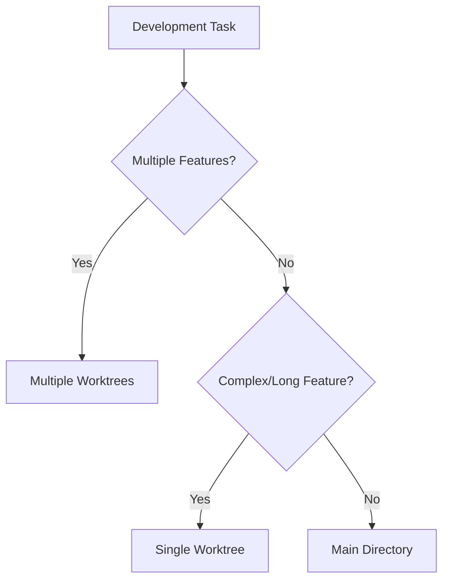

# Branching and Worktree Strategy

Standardized branching and worktree patterns for CycleTime development.

## Branch Naming

**Pattern**: `<type>/spi-<issue-number>-<description>`

**Types**: `feat/`, `fix/`, `refactor/`, `docs/`, `test/`, `chore/`

**Examples**:
```bash
feat/spi-620-documentation-standards
fix/spi-587-auth-token-expiry
docs/spi-612-api-documentation
```

## Worktree Strategy

**Location**: `.worktrees/` under project root (avoids authorization prompts)

**Structure**:
```
cycletime/
├── .git/
├── src/
├── .worktrees/
│   ├── spi-620-docs-standards/
│   ├── spi-587-auth-fix/
│   └── spi-612-api-docs/
└── docs/
```

## Decision Guide



**Main Directory**: Small features, bug fixes, documentation, low conflict risk
**Single Worktree**: Large features, schema changes, experimental work
**Multiple Worktrees**: Parallel development, independent features

**Complete Decision Guide**: See [Decision Guide](../reference/decision-guide.md) for detailed criteria.

## Worktree Commands

**Create Worktree:**
```bash
git worktree add .worktrees/spi-620-docs-standards -b feat/spi-620-documentation-standards
cd .worktrees/spi-620-docs-standards
```

**Remove Worktree:**
```bash
# After PR merge
git worktree remove .worktrees/spi-620-docs-standards
git branch -d feat/spi-620-documentation-standards
```

**Complete Operations**: See [Worktree Operations](../reference/worktree-operations.md) for comprehensive commands.

## Linear Integration

**Mapping**: Branch `feat/spi-620-description` ↔ Linear issue `SPI-620`

**Status Flow**: Branch Creation → In Progress, PR Creation → In Review, PR Merge → Done

**Integration Details**: See [Linear Integration](linear-branch-integration.md) for complete workflow.

## Best Practices

**Naming**: Use Linear issue ID in all branch/worktree names
**Lifecycle**: Start from main, sync regularly, clean up promptly
**File Management**: Use relative paths, install dependencies per worktree

## Security

**Worktrees**: Share Git database, inherit permissions, no additional authorization needed
**Branch Protection**: Never work directly on main, always use feature branches

## Troubleshooting

**Creation Fails**: Check disk space, verify Git repo, check for existing worktree
**Permission Issues**: Verify ownership, fix with `chmod -R u+w`
**Branch Conflicts**: Check existing branches, use versioned names

**Complete Solutions**: See [Troubleshooting Guide](../reference/troubleshooting.md) for detailed recovery procedures.

## Integration

Works with all workflows:
- [Single Feature Workflow](single-feature-workflow.md) - Main directory or single worktree
- [Parallel Development](../testing/parallel-development.md) - Multiple worktrees
- [Task Tool Workflow](../../.claude/workflows/task-tool-workflow.md) - Both environments

## Quick Reference

**Create:**
```bash
git worktree add .worktrees/spi-XXX-feature-name -b feat/spi-XXX-feature-name
cd .worktrees/spi-XXX-feature-name
```

**Complete:**
```bash
git push -u origin feat/spi-XXX-feature-name
gh pr create --title "feat: implement feature name"
# After merge:
git worktree remove .worktrees/spi-XXX-feature-name
git branch -d feat/spi-XXX-feature-name
```

**Conventions**: Worktrees in `.worktrees/spi-XXX-description/`, branches as `<type>/spi-XXX-description`