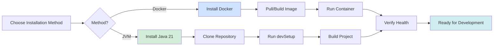

# Installation Guide

This guide walks through installing CycleTime for local development. Choose between traditional JVM installation with Java 21 or containerized deployment with Docker.

## Installation Process



## Prerequisites

### Java 21
CycleTime requires Java 21 or later. We recommend using SDKMAN for managing Java versions.

```bash
# Install SDKMAN (if not already installed)
curl -s "https://get.sdkman.io" | bash

# Install Java 21
sdk install java 21.0.5-tem

# Verify installation
java -version
```

### Alternative: GraalVM
For native image experiments:

```bash
# Install GraalVM
sdk install java 21.0.8-graal

# Verify installation
java -version
```

## Clone Repository

```bash
git clone https://github.com/spiralhouse/cycletime.git
cd cycletime

# Make Gradle wrapper executable
chmod +x gradlew
```

## Initial Setup

```bash
# One-time development environment setup
./gradlew devSetup

# Build the project
./gradlew build
```

## Docker Installation

If you prefer using Docker:

```bash
# Build container
docker build -t cycletime .

# Run container
docker run -p 8080:8080 cycletime
```

## Next Steps

- [Quick Start Guide](quick-start.md)
- [Configuration](configuration.md)
- [Development Setup](../development/setup.md)