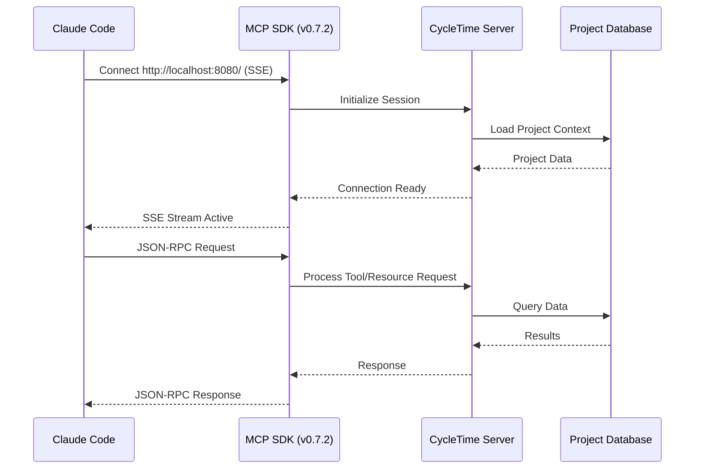
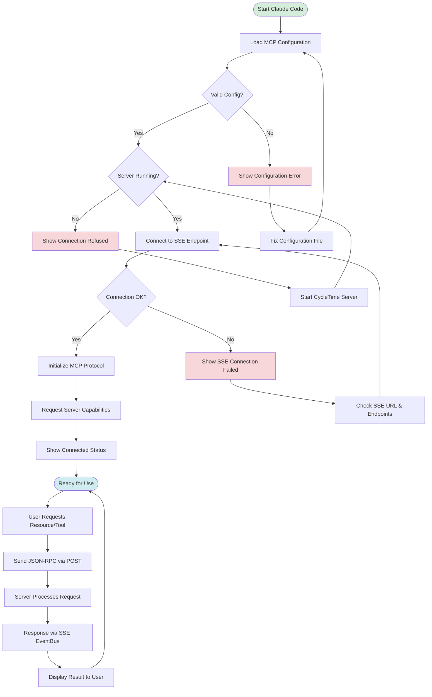

# MCP Client Setup

This guide walks through connecting Claude Code to CycleTime's MCP (Model Context Protocol) server to enable project orchestration capabilities directly within Claude Code.

## Prerequisites

Before configuring the MCP client connection, ensure you have:

- CycleTime server running (see [Installation Guide](installation.md))
- Claude Code installed and configured
- Network access to localhost:8080 (default MCP server port)

## Connection Overview

CycleTime uses the official MCP Kotlin SDK v0.7.2 maintained by Anthropic and JetBrains. Claude Code connects to the SDK-managed root endpoint for real-time project data access and tool execution.



## MCP Server Configuration

CycleTime's MCP server uses the official SDK with SSE transport and JSON-RPC 2.0 protocol.

### Default Configuration

| Setting | Default Value | Description |
|---------|--------------|-------------|
| **Protocol Version** | `2024-11-05` | MCP protocol version |
| **Transport** | SSE | Communication protocol (Server-Sent Events) |
| **Host** | `0.0.0.0` | Server bind address |
| **Port** | `8080` | Server port |
| **Endpoint** | `/` | SDK-managed root endpoint |
| **Connection URL** | `http://localhost:8080/` | Full connection URL |

### Server Capabilities

CycleTime MCP server provides:

- **Resources**: Access to project structure, issues, and session state
- **Tools**: Project management operations (create issues, update status, etc.)
- **Prompts**: Not currently supported

### Custom Server Configuration

Override default settings using environment variables:

```bash
# Custom port
MCP_PORT=3006 ./gradlew run

# Localhost-only binding
MCP_HOST=127.0.0.1 ./gradlew run

# Enable detailed logging
MCP_DETAILED_LOGGING=true ./gradlew run

# Combined custom configuration
MCP_PORT=3006 MCP_HOST=127.0.0.1 MCP_DETAILED_LOGGING=true ./gradlew run
```

### Available Environment Variables

| Variable | Default | Description |
|----------|---------|-------------|
| `MCP_HOST` | `0.0.0.0` | Server bind address |
| `MCP_PORT` | `8080` | Server port |
| `MCP_ENABLED` | `true` | Enable/disable MCP server |
| `MCP_TIMEOUT` | `15000` | Connection timeout (ms) |
| `MCP_MAX_CONNECTIONS` | `100` | Maximum concurrent connections |
| `MCP_DETAILED_LOGGING` | `false` | Enable debug-level logging |
| `MCP_METRICS_ENABLED` | `true` | Enable metrics collection |

**Note**: SDK v0.7.2 manages the root endpoint (`/`) automatically. Legacy `/mcp/events` and `/mcp` endpoints have been removed (SPI-707).

## Claude Code Configuration

Configure Claude Code to connect to CycleTime's MCP server by adding the server configuration to your Claude Code settings.

### Configuration File Location

Claude Code stores MCP server configurations in:

**User-Level Configuration (Recommended)**:
- **All Platforms**: `~/.claude.json` (in your home directory)

**Project-Level Configuration** (for team sharing):
- Create `.mcp.json` in your project root directory

**Note**: The user-level `~/.claude.json` provides the most consistent behavior across Claude Code versions and is recommended for personal MCP server configurations.

### Basic Configuration

Add the following configuration to connect to CycleTime:

```json
{
  "mcpServers": {
    "cycletime": {
      "type": "sse",
      "url": "http://localhost:8080/"
    }
  }
}
```

**Note**: The SDK manages the root endpoint (`/`). This differs from legacy configurations that used `/mcp/events`.

### Multiple Server Configuration

If you have other MCP servers configured:

```json
{
  "mcpServers": {
    "cycletime": {
      "type": "sse",
      "url": "http://localhost:8080/"
    },
    "other-server": {
      "command": "node",
      "args": ["/path/to/server.js"]
    }
  }
}
```

### Custom Port Configuration

If you changed the MCP server port, update the URL accordingly:

```json
{
  "mcpServers": {
    "cycletime": {
      "type": "sse",
      "url": "http://localhost:3006/"
    }
  }
}
```

## Connection Verification

After configuring Claude Code, verify the connection is working correctly.

### Step 1: Start CycleTime Server

```bash
# From CycleTime project directory
./gradlew run

# Wait for startup message
# [main] INFO  Application - Responding at http://0.0.0.0:8080
# [main] INFO  MCPRouting - MCP routing configured in XXXms
```

### Step 2: Verify Server Health

Check the MCP server is responding:

```bash
# Test HTTP health endpoint
curl http://localhost:8080/mcp

# Expected response:
{
  "name": "cycletime",
  "version": "0.1.0",
  "description": "CycleTime Project Orchestration MCP Server (Kotlin)",
  "capabilities": {
    "resources": true,
    "tools": true,
    "prompts": false
  },
  "activeConnections": 0,
  "totalRequests": 0
}
```

### Step 3: Restart Claude Code

After adding the configuration:

1. Completely quit Claude Code
2. Restart Claude Code
3. Open a new conversation

### Step 4: Verify Connection in Claude Code

In a Claude Code conversation, the MCP server connection status appears in the interface:

- **Connected**: Green indicator showing "cycletime" server connected
- **Disconnected**: Red indicator or missing server entry

You can also verify by asking Claude Code to list available resources:

```
Can you show me the available CycleTime project resources?
```

Claude Code should be able to access CycleTime resources and tools.

### Step 5: Check Server Statistics

Monitor active connections and requests:

```bash
# View detailed statistics
curl http://localhost:8080/mcp/stats

# Expected response includes:
{
  "connections": {
    "active": "1",
    "totalRequests": "10",
    "totalErrors": "0",
    "averageLatency": "25ms",
    "errorRate": "0.00%"
  },
  "config": {
    "maxConnections": "100",
    "asyncProcessing": "true",
    "caching": "true",
    "optimized": "true"
  }
}
```

## Configuration Troubleshooting

Common issues and solutions when connecting Claude Code to CycleTime.

### Connection Refused

**Symptom**: Claude Code shows "Connection refused" or red disconnected indicator

**Cause**: CycleTime server is not running or not accessible

**Solution**:
```bash
# Verify server is running
./gradlew run

# Check server is listening on port 8080
lsof -i :8080
# or on Windows
netstat -ano | findstr :8080

# If port is in use by another application, change MCP port
MCP_PORT=3006 ./gradlew run

# Update Claude Code configuration to match
# url: "http://localhost:3006/mcp/events"
```

### SSE Connection Failed

**Symptom**: Connection attempts fail or timeout

**Cause**: Incorrect SSE endpoint path or URL format

**Solution**:
```json
// Verify configuration uses correct SSE URL format
{
  "mcpServers": {
    "cycletime": {
      "type": "sse",
      "url": "http://localhost:8080/mcp/events"  // Must be HTTP(S) with /mcp/events path
    }
  }
}
```

### Connection Times Out

**Symptom**: Connection attempts hang or timeout

**Cause**: Firewall blocking localhost connections or server not responding

**Solution**:
```bash
# Test direct HTTP connection first
curl http://localhost:8080/mcp

# If this fails, check firewall settings
# On macOS
sudo /usr/libexec/ApplicationFirewall/socketfilterfw --getglobalstate

# Test SSE endpoint directly
curl -N http://localhost:8080/mcp/events
# Should establish an SSE connection (press Ctrl+C to exit)

# Enable detailed logging to diagnose
MCP_DETAILED_LOGGING=true ./gradlew run
```

### Server Not Listed in Claude Code

**Symptom**: "cycletime" server doesn't appear in Claude Code MCP servers list

**Cause**: Configuration file syntax error or incorrect file location

**Solution**:
```bash
# Verify configuration file exists and has correct syntax
cat ~/.claude.json | jq .

# If jq fails, there's a JSON syntax error
# Common issues:
# - Missing comma between server entries
# - Trailing comma in last entry
# - Unclosed quotes or brackets

# Valid configuration example:
{
  "mcpServers": {
    "cycletime": {
      "type": "sse",
      "url": "http://localhost:8080/mcp/events"
    }
  }
}
```

### Resources/Tools Not Available

**Symptom**: Claude Code connects but can't access CycleTime resources or tools

**Cause**: Server capabilities not properly initialized or database not accessible

**Solution**:
```bash
# Check server health and capabilities
curl http://localhost:8080/mcp | jq .

# Verify capabilities show:
# "capabilities": { "resources": true, "tools": true, "prompts": false }

# Check server logs for errors
./gradlew run
# Look for initialization errors or database connection issues

# Verify database files exist and are accessible
# H2 creates multiple files: .mv.db (main), .trace.db (logs)
ls -lh cycletime*.db

# Check database permissions
chmod 644 cycletime*.db

# Note: H2 database creates multiple files:
# - cycletime.mv.db (main database file)
# - cycletime.trace.db (trace/log file, if logging enabled)
```

### High Latency or Slow Responses

**Symptom**: Requests to CycleTime server are slow

**Cause**: Resource caching disabled or suboptimal configuration

**Solution**:
```bash
# Enable performance optimizations
MCP_CACHE_ENABLED=true \
MCP_ASYNC_ENABLED=true \
MCP_BUFFER_SIZE=8192 \
./gradlew run

# Monitor performance metrics
curl http://localhost:8080/mcp/stats | jq '.connections'

# Check if optimizations are enabled
curl http://localhost:8080/mcp/stats | jq '.config.optimized'
# Should return: "true"
```

### Multiple Connection Issues

**Symptom**: Cannot establish second connection from different client

**Cause**: Server reached max connection limit

**Solution**:
```bash
# Increase max connections
MCP_MAX_CONNECTIONS=500 ./gradlew run

# Monitor active connections
curl http://localhost:8080/mcp/stats | jq '.connections.active'

# Check for stale connections
curl http://localhost:8080/mcp | jq '.activeConnections'
```

## Advanced Configuration

### Development Mode with Auto-Reload

For development workflows, run the server with continuous build:

```bash
# Terminal 1: Run server with auto-reload
./gradlew devRun --continuous

# Terminal 2: Make code changes
# Server automatically restarts on changes
```

Claude Code will automatically reconnect when the server restarts.

### Multiple Environment Configuration

Run different CycleTime instances for different projects:

```bash
# Project A - Port 8080
MCP_PORT=8080 DATABASE_URL=jdbc:h2:file:./projectA ./gradlew run

# Project B - Port 8081
MCP_PORT=8081 DATABASE_URL=jdbc:h2:file:./projectB ./gradlew run
```

Configure multiple servers in Claude Code:

```json
{
  "mcpServers": {
    "cycletime-projectA": {
      "type": "sse",
      "url": "http://localhost:8080/mcp/events"
    },
    "cycletime-projectB": {
      "type": "sse",
      "url": "http://localhost:8081/mcp/events"
    }
  }
}
```

### SSL/TLS Configuration

For secure SSE connections (https://):

```bash
# Configure SSL in application.conf
# (Requires SSL certificate setup - see deployment guide)

# Update Claude Code configuration
{
  "mcpServers": {
    "cycletime": {
      "type": "sse",
      "url": "https://localhost:8443/mcp/events"
    }
  }
}
```

## Next Steps

With Claude Code connected to CycleTime:

- [Quick Start Guide](quick-start.md) - Begin using CycleTime features
- [Configuration Guide](configuration.md) - Advanced server configuration
- [API Reference](../api/rest-api-reference.md) - Available MCP tools and resources
- [Troubleshooting Guide](../reference/troubleshooting.md) - Common issues and solutions

## Connection Flow Reference

Complete connection and communication flow:


