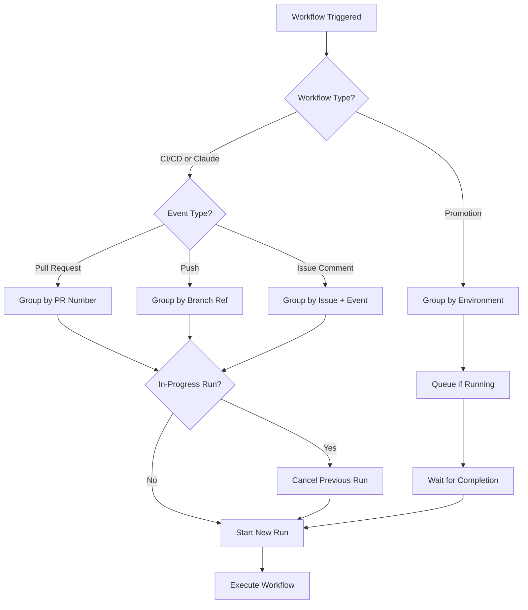

# CI/CD Workflow Concurrency Control

## Overview

All GitHub Actions workflows in CycleTime are configured with concurrency controls to prevent duplicate runs, save CI resources, and ensure clean deployment paths. This document explains the concurrency strategy for each workflow.

## Concurrency Decision Flow



## Concurrency Configuration by Workflow

### 1. CI/CD Pipeline (`cicd.yml`)

```yaml
concurrency:
  group: ci-${{ github.workflow }}-${{ github.event.pull_request.number || github.ref }}
  cancel-in-progress: true
```

**Strategy:**
- Groups runs by PR number (for pull requests) or branch reference (for pushes)
- Cancels in-progress runs when new commits are pushed to the same branch/PR
- Saves CI resources by avoiding redundant test runs on outdated commits

**Benefits:**
- Faster feedback on latest commits
- Reduced CI queue times
- Lower GitHub Actions usage costs

### 2. Claude Code Review (`claude-code-review.yml`)

```yaml
concurrency:
  group: claude-review-pr-${{ github.event.pull_request.number }}
  cancel-in-progress: true
```

**Strategy:**
- Groups reviews by PR number to ensure one review per PR at a time
- Cancels previous review when new commits are pushed to the PR
- Ensures reviews are always based on the latest code

**Benefits:**
- Avoids conflicting or outdated code reviews
- Reduces API usage for Claude reviews
- Provides timely feedback on latest changes

### 3. Claude Code Assistant (`claude.yml`)

```yaml
concurrency:
  group: claude-code-${{ github.event.issue.number || github.event.pull_request.number }}-${{ github.event_name }}
  cancel-in-progress: true
```

**Strategy:**
- Groups interactions by issue/PR number and event type
- Cancels previous Claude interactions when new comments trigger it
- Maintains context separation between different issues/PRs

**Benefits:**
- Prevents Claude from processing outdated requests
- Ensures responses are based on latest context
- Reduces confusion from overlapping interactions

### 4. Environment Promotion (`promote.yml`)

```yaml
concurrency:
  group: promote-${{ github.event.inputs.target_env }}
  cancel-in-progress: false  # Critical: Never cancel promotions
```

**Strategy:**
- Groups promotions by target environment (staging, production)
- **Never cancels in-progress promotions** (critical for deployment safety)
- Ensures only one promotion to each environment at a time

**Benefits:**
- Prevents conflicting deployments to the same environment
- Maintains deployment integrity and audit trail
- Protects production from interrupted deployments

## Key Design Decisions

### 1. Cancel-in-Progress Settings

- **CI/CD, Claude workflows:** `cancel-in-progress: true`
  - Safe to cancel as they're idempotent operations
  - Latest code/comment is always most relevant
  
- **Promotion workflow:** `cancel-in-progress: false`
  - Deployments must complete to maintain system state
  - Cancellation could leave environments in unknown state

### 2. Grouping Strategies

- **PR-based grouping:** Used for PR-triggered workflows to maintain PR isolation
- **Branch-based grouping:** Used for push events to handle direct commits
- **Environment-based grouping:** Used for deployments to prevent conflicts

### 3. Resource Optimization

The concurrency controls help optimize GitHub Actions usage:
- Reduce unnecessary compute time on outdated commits
- Minimize API calls to external services (Claude)
- Prevent resource waste from redundant builds

## Best Practices

1. **Always test concurrency behavior** after workflow changes
2. **Monitor cancelled runs** in GitHub Actions tab for patterns
3. **Document exceptions** if cancel-in-progress needs to be disabled
4. **Use descriptive group names** that clearly indicate the isolation boundary

## Troubleshooting

### Common Issues

1. **Workflow not cancelling previous runs:**
   - Check if group name is correctly formed
   - Verify cancel-in-progress is set to true

2. **Production deployments being cancelled:**
   - Ensure promote.yml has `cancel-in-progress: false`
   - Check for manual workflow cancellations

3. **Multiple workflows running for same PR:**
   - Verify PR number is being correctly extracted
   - Check for different event types triggering separate groups

## Related Documentation

- [GitHub Actions Concurrency](https://docs.github.com/en/actions/using-jobs/using-concurrency)
- [CI/CD Pipeline Overview](./overview.md)
- [Release Process](./release-process.md)