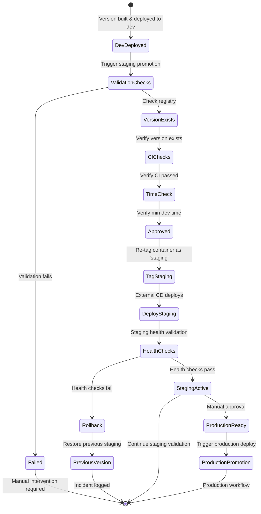

# Staging Promotion Guide

This document explains how to promote releases from dev to staging environment using the enhanced promotion workflow.

## Overview

The staging promotion process validates deployment readiness and safely promotes container versions between environments. It includes validation checks, deployment history tracking, and automated external deployment triggering.

## Promotion State Flow



## When to Promote to Staging

### Promotion Criteria

**Required Conditions:**
- Version must exist in the container registry (`ghcr.io/spiralhouse/cycletime`)
- Version must have been deployed to dev environment
- All CI/CD checks must have passed for the version
- Version should meet minimum dev deployment time (configurable, default: 2 hours)

**Recommended Conditions:**
- Dev environment testing completed successfully
- Integration tests passing
- Known issues documented and acceptable for staging
- Stakeholder approval for staging deployment

### Version Selection Strategy

**Latest Development Version:**
```bash
# Use the most recent version from main branch
# Check recent versions: https://github.com/spiralhouse/cycletime/pkgs/container/cycletime
```

**Specific Feature Version:**
```bash
# Use specific version for feature testing
# Ensure version went through dev environment first
```

**Rollback Version:**
```bash
# Use previously validated version for rollback testing
# Ensure version is still available in registry
```

## How to Promote to Staging

### Step 1: Access the Workflow

1. Go to [GitHub Actions > Environment Promotion](https://github.com/spiralhouse/cycletime/actions/workflows/promote.yml)
2. Click "Run workflow" button
3. Select the correct branch (usually `main`)

### Step 2: Configure Promotion Parameters

**Required Fields:**
- **Version**: Enter the version tag to promote (e.g., `1.2.3`, `1.2.3-SNAPSHOT`)
- **Source environment**: Select `dev`
- **Target environment**: Select `staging`

**Optional Fields:**
- **Minimum dev time**: Hours the version must have been in dev (default: 2 hours)
  - Set to `0` to skip time validation
  - Increase for more conservative promotion policy

### Step 3: Execute Promotion

1. Click "Run workflow"
2. Monitor the workflow execution
3. Check the job summary for promotion details
4. Wait for external deployment system to complete staging deployment

### Step 4: Verify Staging Deployment

**Container Verification:**
```bash
# Check staging tag was updated
docker pull ghcr.io/spiralhouse/cycletime:staging

# Verify it matches the promoted version
docker inspect ghcr.io/spiralhouse/cycletime:staging
```

**Deployment Verification:**
- Monitor external deployment system logs
- Check staging environment health endpoints
- Verify application functionality
- Run staging smoke tests

## Validation Checklist

The promotion workflow automatically validates these conditions:

### Pre-Promotion Validation

- [ ] **Version Exists**: Specified version tag exists in GHCR
- [ ] **Valid Path**: Promotion from dev → staging is valid
- [ ] **Minimum Time**: Version meets minimum dev deployment time
- [ ] **Registry Access**: Can pull version from container registry
- [ ] **Container Integrity**: Image passes integrity verification

### Post-Promotion Validation

- [ ] **Staging Tag**: `ghcr.io/spiralhouse/cycletime:staging` updated successfully
- [ ] **Timestamped Tag**: Immutable timestamp tag created
- [ ] **External Trigger**: External deployment system detects new staging tag
- [ ] **Deployment Status**: Staging environment deploys successfully
- [ ] **Health Checks**: Application passes staging health checks

## Rollback Procedures

### Immediate Rollback (Container Level)

If issues are detected immediately after promotion:

```bash
# Option 1: Promote previous working version
# Use the promotion workflow with the last known good version

# Option 2: Manual tag rollback (emergency only)
# Requires GHCR admin access - not recommended for normal use
```

### Application-Level Rollback

If issues are detected in the running application:

1. **Identify Last Good Version**:
   - Check promotion history in GitHub Actions
   - Review staging deployment logs
   - Identify the version number

2. **Execute Rollback Promotion**:
   - Use the promotion workflow
   - Set source: `dev`, target: `staging`
   - Use the last good version number
   - Set min dev time to `0` for urgent rollbacks

3. **Verify Rollback**:
   - Monitor external deployment system
   - Check application functionality
   - Validate rollback completed successfully

### Rollback Timeline

- **Detection**: 0-5 minutes (monitoring alerts)
- **Decision**: 5-10 minutes (incident response)
- **Execution**: 2-5 minutes (workflow run)
- **Deployment**: 3-8 minutes (external system)
- **Verification**: 5-10 minutes (health checks)

**Total Rollback Time**: ~15-38 minutes

## Container Tags and Versioning

### Tag Types

**Mutable Tags** (overwritten on each promotion):
- `ghcr.io/spiralhouse/cycletime:staging` - Current staging version

**Immutable Tags** (permanent historical record):
- `ghcr.io/spiralhouse/cycletime:1.2.3` - Original version tag
- `ghcr.io/spiralhouse/cycletime:1.2.3-staging-20240823-143052` - Timestamped staging tag

### Tag Selection Guide

**For External Deployment Systems:**
```bash
# Use mutable staging tag (recommended)
docker pull ghcr.io/spiralhouse/cycletime:staging

# External system should pin to specific version after pull
docker tag ghcr.io/spiralhouse/cycletime:staging app:staging-20240823
```

**For Manual Verification:**
```bash
# Use specific version for testing
docker pull ghcr.io/spiralhouse/cycletime:1.2.3

# Use timestamped tag for historical reference
docker pull ghcr.io/spiralhouse/cycletime:1.2.3-staging-20240823-143052
```

## Promotion History and Auditing

### Viewing Promotion History

1. **GitHub Actions History**:
   - Visit [Promotion Workflow Runs](https://github.com/spiralhouse/cycletime/actions/workflows/promote.yml)
   - Each successful run shows version, promoter, and timestamp

2. **Container Registry History**:
   - Visit [GHCR Package Page](https://github.com/spiralhouse/cycletime/pkgs/container/cycletime)
   - View all tags and their creation timestamps

3. **Workflow Summaries**:
   - Each promotion run includes detailed summary
   - Shows current environment status
   - Includes rollback information

### Audit Information Captured

For each promotion, the following is recorded:

- **Version**: What was promoted
- **Path**: Source → target environments
- **Actor**: Who initiated the promotion
- **Timestamp**: When the promotion occurred
- **Workflow Run**: Link to full execution details
- **Previous Version**: What was replaced
- **Validation Results**: All pre-promotion checks

## Troubleshooting

### Common Issues

**"Version not found in registry"**
- Verify the version tag exists in GHCR
- Check if the version was successfully built and pushed
- Ensure you have read access to the container registry

**"Version has not been in dev long enough"**
- Wait for minimum dev deployment time
- Override with min_dev_time_hours: 0 for urgent promotions
- Check actual dev deployment time in workflow logs

**"Version not currently in staging"**
- When promoting staging → production
- Ensure the version was promoted to staging first
- Check current staging version in workflow output

**"External deployment not triggering"**
- External system monitors `staging` tag changes
- Check external deployment system logs
- Verify external system has GHCR access

### Getting Help

1. **Check Workflow Logs**: Detailed error messages in GitHub Actions
2. **Verify Prerequisites**: Ensure all validation conditions are met
3. **Contact Team**: Escalate to DevOps team for external system issues
4. **Emergency**: Use manual container commands as temporary workaround

## Best Practices

### Scheduling
- **Regular Promotions**: Daily at low-traffic periods
- **Feature Releases**: After thorough dev environment testing
- **Hotfixes**: As soon as dev validation completes

### Communication
- **Announce Promotions**: Notify QA and product teams
- **Document Changes**: Include release notes and known issues
- **Coordinate Testing**: Schedule staging validation with QA team

### Monitoring
- **Track Promotion Frequency**: Monitor promotion patterns
- **Monitor Deployment Success**: Track external deployment failures
- **Review Rollback Usage**: Identify recurring issues

### Security
- **Access Control**: Limit promotion workflow access to authorized users
- **Version Validation**: Always validate versions exist before promotion
- **Audit Trail**: Maintain complete promotion history for compliance