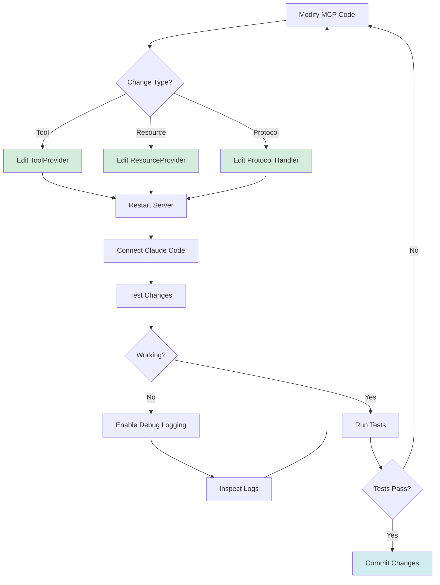

# MCP Development Workflow

This guide provides practical workflows for developing and testing Model Context Protocol (MCP) changes in CycleTime. The MCP server enables Claude Code and other AI tools to interact with your project data through a standardized protocol.

CycleTime uses the official MCP Kotlin SDK v0.7.2 for all protocol handling.

## Development Workflow Overview



## Local Development Setup

## MCP Server Development

CycleTime uses the official MCP Kotlin SDK v0.7.2 for all protocol handling.

### Architecture Overview

**Key Components:**
- `MCPSdkServer.kt` - Server initialization, capability configuration
- `MCPSdkRouting.kt` - Ktor routing integration via `mcp { }` DSL
- `sdk/adapters/` - Adapters bridging business logic to SDK APIs
- `SDKSessionManager.kt` - Session handling via request metadata

### Starting the MCP Server

The MCP server starts automatically when you run the CycleTime application:

```bash
# Standard development server
./gradlew run

# With auto-reload on code changes (recommended)
./gradlew run --continuous

# With detailed debug logging
MCP_DETAILED_LOGGING=true ./gradlew run
```

**SDK endpoint available** at root path:
- SSE connection: `GET /`
- Tool calls handled automatically by SDK

### Development Workflow

**1. Server starts automatically** when running the application:
```bash
./gradlew run
```

**2. SDK endpoint available** at root path:
- SSE connection: `GET /`
- Tool calls handled automatically by SDK

**3. Making changes:**
- Modify tool/resource providers in `mcp/tools/` or `mcp/resources/`
- Adapters automatically bridge changes to SDK
- Restart server to apply changes

### Development Configuration

The server uses development-optimized settings from `application.conf`:

```hocon
ktor {
    deployment {
        port = 8080
        port = ${?PORT}  # Optional environment variable override

        development = true
        development = ${?KTOR_DEVELOPMENT}

        autoreload = true
        autoreload = ${?KTOR_AUTORELOAD}

        watch = []
        watch = ${?KTOR_WATCH_PATHS}
    }

    development {
        watchPaths = [
            "build/classes/kotlin/main",
            "src/main/kotlin",
            "src/main/resources"
        ]
        watchPaths = ${?KTOR_DEV_WATCH_PATHS}
    }
}

database {
    url = "jdbc:h2:file:./cycletime;MODE=PostgreSQL;DATABASE_TO_LOWER=TRUE"
    url = ${?DATABASE_URL}
    driver = "org.h2.Driver"
}
```

**Environment Variable Pattern**: Configuration uses HOCON's `${?VAR}` syntax for optional environment variable substitution. The pattern `value = default` followed by `value = ${?ENV_VAR}` means "use default unless ENV_VAR is set".

### Testing with MCP Inspector

Per SPI-716 documentation, use MCP Inspector for validation:

```bash
# Install MCP Inspector (if not installed)
npm install -g @modelcontextprotocol/inspector

# Start server
./gradlew run

# In another terminal, run Inspector
mcp-inspector

# Connect to: http://localhost:8080/
```

### SDK Migration Notes (SPI-700/SPI-707)

The SDK replaced custom EventBus transport:
- **No more** `/mcp-old` endpoints
- **No more** EventBus correlation
- **SDK handles** all transport, protocol, and session management
- **We focus on** business logic in tool/resource providers

### HTTP Test Requests

Test server endpoints directly:

```bash
# Get server info
curl http://localhost:8080/mcp | jq

# Get detailed statistics (requires MCP_METRICS_ENABLED=true)
curl http://localhost:8080/mcp/stats | jq

# Monitor with watch
watch -n 1 'curl -s http://localhost:8080/mcp | jq .totalRequests'
```

## Testing MCP Changes

### Development Workflow

**Step 1: Make Your Changes**

Edit the relevant MCP component:
- **Tools**: `src/main/kotlin/io/spiralhouse/cycletime/mcp/tools/*ToolProvider.kt`
- **Resources**: `src/main/kotlin/io/spiralhouse/cycletime/mcp/resources/*ResourceProvider.kt`
- **Protocol**: `src/main/kotlin/io/spiralhouse/cycletime/mcp/protocol/*.kt`

**Step 2: Restart the Server**

```bash
# If running with --continuous, just save files (auto-restarts)
# Otherwise, stop (Ctrl+C) and restart:
./gradlew run
```

**Step 3: Test in Claude Code**

Reconnect Claude Code and test your changes:
- List available tools to verify new additions
- Execute tools with various parameters
- Check resource URIs and content
- Verify error handling with invalid inputs

**Step 4: Validate with Tests**

```bash
# Run MCP-specific tests
./gradlew unitTest --tests "*mcp.protocol*"
./gradlew unitTest --tests "*mcp.tools*"
./gradlew integrationTest --tests "*mcp.integration*"
./gradlew integrationTest --tests "*mcp.server*"

# Run all tests
./gradlew test
```

### Example: Adding a New Tool

**1. Define the Tool in ToolProvider**

Edit `DefaultProjectToolProvider.kt`:

```kotlin
Tool(
    name = "archive_project",
    description = "Archive a project by ID",
    parametersSchema = buildJsonObject {
        put("type", "object")
        put("properties", buildJsonObject {
            put("id", buildRequiredStringParam("Project ID"))
            put("reason", buildOptionalStringParam("Archive reason"))
        })
        put("required", buildJsonArray { add("id") })
    },
    handler = ToolHandler.Async { params ->
        Result.runCatching {
            val id = extractRequiredParam(params, "id")
            val reason = extractOptionalParam(params, "reason")

            // Implementation here
            val result = projectService.archiveProject(
                ProjectId(id),
                reason
            )

            createMcpTextResponse(Json.encodeToString(result))
        }
    }
)
```

**2. Restart Server**

```bash
./gradlew run
```

**3. Verify Tool Registration**

```bash
# Using curl
curl -X POST http://localhost:8080/mcp \
  -H "Content-Type: application/json" \
  -d '{"jsonrpc":"2.0","id":1,"method":"tools/list"}'

# Look for "archive_project" in response
```

**4. Test Tool Execution**

In Claude Code:
```
Use the archive_project tool to archive project abc-123 with reason "Completed"
```

### Example: Adding a New Resource

**1. Add Resource to ResourceProvider**

```kotlin
override suspend fun listResources(
    filter: ResourceFilter?,
    pagination: ResourcePagination?
): List<Resource> {
    return listOf(
        Resource(
            uri = "project://recent",
            name = "Recent Projects",
            description = "Projects updated in the last 7 days",
            mimeType = "application/json"
        )
    )
}

override suspend fun readResource(uri: String): String {
    return when (uri) {
        "project://recent" -> {
            val recentProjects = projectService.getRecentProjects(7)
            Json.encodeToString(recentProjects)
        }
        else -> throw ResourceNotFoundException(uri)
    }
}
```

**2. Test Resource Access**

```bash
# List resources
curl -X POST http://localhost:8080/mcp \
  -H "Content-Type: application/json" \
  -d '{"jsonrpc":"2.0","id":1,"method":"resources/list"}'

# Read resource content
curl -X POST http://localhost:8080/mcp \
  -H "Content-Type: application/json" \
  -d '{"jsonrpc":"2.0","id":2,"method":"resources/read","params":{"uri":"project://recent"}}'
```

## Debugging MCP Issues

### Enable Detailed Logging

Set environment variables before starting the server:

```bash
# Enable all debug features
MCP_DETAILED_LOGGING=true \
MCP_METRICS_ENABLED=true \
MCP_SLOW_REQUEST_MS=50 \
./gradlew run
```

This enables:
- **Connection Lifecycle**: SSE connection/disconnect events
- **Request/Response Details**: Full JSON-RPC message logging
- **Performance Timing**: Request duration tracking
- **Slow Request Warnings**: Alerts for requests exceeding threshold

### Application Logs

Monitor server logs for MCP events:

```bash
# Start server and watch logs
./gradlew run | grep -E "(MCP|SSE)"

# Filter for specific events
./gradlew run 2>&1 | grep "MCP.*error"
```

Key log patterns:
- `MCP Configuration loaded` - Server startup
- `MCP SSE connection` - Client connection events
- `Tool execution:` - Tool invocation traces
- `Resource read:` - Resource access traces
- `ERROR` - Error conditions and stack traces

### SSE Stream Inspection

**Browser DevTools Method**:

1. Navigate to `http://localhost:8080/mcp/events` in Chrome/Firefox
2. Open DevTools (F12)
3. Go to Network tab
4. Click on the SSE connection (EventStream type)
5. View events being received in real-time

**curl Method**:

```bash
# Monitor SSE stream with verbose output
curl -N -v -H "Accept: text/event-stream" http://localhost:8080/mcp/events

# Capture and analyze SSE traffic
sudo tcpdump -i lo0 -A 'tcp port 8080 and host localhost' | grep -A 5 "data:"
```

### JSON-RPC Protocol Debugging

Test protocol handling directly:

```bash
# Test initialize
curl -X POST http://localhost:8080/mcp \
  -H "Content-Type: application/json" \
  -d '{"jsonrpc":"2.0","id":1,"method":"initialize","params":{"protocolVersion":"2024-11-05","capabilities":{}}}'

# Test invalid method
curl -X POST http://localhost:8080/mcp \
  -H "Content-Type: application/json" \
  -d '{"jsonrpc":"2.0","id":2,"method":"invalid_method"}'

# Test malformed JSON
curl -X POST http://localhost:8080/mcp \
  -H "Content-Type: application/json" \
  -d '{invalid json}'

# Test missing required parameters
curl -X POST http://localhost:8080/mcp \
  -H "Content-Type: application/json" \
  -d '{"jsonrpc":"2.0","id":3,"method":"tools/call","params":{"name":"create_project"}}'

# Test tool execution
curl -X POST http://localhost:8080/mcp \
  -H "Content-Type: application/json" \
  -d '{"jsonrpc":"2.0","id":4,"method":"tools/call","params":{"name":"list_projects","arguments":{}}}'
```

### Common Issues and Solutions

**Issue: Connection Refused**

```bash
# Check if server is running
lsof -i :8080

# Check server logs for startup errors
./gradlew run 2>&1 | grep ERROR

# Verify port configuration
curl http://localhost:8080/mcp
```

**Issue: Tool Not Found**

```bash
# List all registered tools
curl -X POST http://localhost:8080/mcp \
  -H "Content-Type: application/json" \
  -d '{"jsonrpc":"2.0","id":1,"method":"tools/list"}'

# Check ToolProvider registration in logs
./gradlew run | grep "ToolProvider"
```

**Issue: Resource Not Available**

```bash
# List available resources
curl -X POST http://localhost:8080/mcp \
  -H "Content-Type: application/json" \
  -d '{"jsonrpc":"2.0","id":1,"method":"resources/list"}'

# Test resource read with exact URI
curl -X POST http://localhost:8080/mcp \
  -H "Content-Type: application/json" \
  -d '{"jsonrpc":"2.0","id":2,"method":"resources/read","params":{"uri":"project://stats"}}'
```

**Issue: Invalid Schema Validation**

```bash
# Check parameter schema in tool definition
# Ensure JSON Schema format is correct:
{
  "type": "object",
  "properties": {
    "param_name": {
      "type": "string",
      "description": "Parameter description"
    }
  },
  "required": ["param_name"]
}
```

### Performance Profiling

Monitor request performance:

```bash
# Enable metrics and set slow request threshold
MCP_METRICS_ENABLED=true MCP_SLOW_REQUEST_MS=100 ./gradlew run

# Check statistics endpoint
curl http://localhost:8080/mcp/stats | jq '.connections'

# Response shows:
{
  "active": "1",
  "totalRequests": "150",
  "totalErrors": "2",
  "averageLatency": "45ms",
  "maxLatency": "230ms",
  "errorRate": "1.33%"
}
```

## Validating with MCP Inspector

### Pre-Commit Validation Workflow

Before committing MCP changes, validate protocol compliance with MCP Inspector:

```bash
# 1. Run automated tests
./gradlew test

# 2. Start local server
./gradlew run

# 3. Launch MCP Inspector (in separate terminal)
# Method 1 (Recommended): SSE transport with auto-connect
npx @modelcontextprotocol/inspector sse http://localhost:8080

# Method 2 (Alternative): Direct connection via browser UI
# npx @modelcontextprotocol/inspector
# Then open http://localhost:6274 and click "Connect" → "Direct Connection"

# 4. Validate in Inspector UI (http://localhost:6274)
#    - Protocol initialization succeeds
#    - Tools/resources registered correctly
#    - Tool execution works
#    - Error handling correct

# 5. If all validations pass
git add .
git commit -m "feat(mcp): add new tool"
```

### Why Inspector is Required

MCP Inspector validates protocol compliance that automated tests cannot:

**Automated tests validate**:
- Implementation logic correctness
- Error handling code paths
- Data transformations
- Business rules

**MCP Inspector validates**:
- JSON-RPC 2.0 compliance
- MCP protocol spec adherence
- Client simulation (how Claude Code sees server)
- Protocol-level error responses

**Example failure only Inspector catches**:
```kotlin
// ❌ Tests pass but Inspector fails
// Tool returns wrong JSON-RPC error structure
return JsonRpcError(
    code = -32000,
    message = "Error"
    // Missing: should wrap in JsonRpcResponse with id field
)

// ✅ Tests pass AND Inspector passes
return JsonRpcResponse(
    jsonrpc = "2.0",
    id = request.id,
    error = JsonRpcError(code = -32000, message = "Error")
)
```

### Validation Checklist

Use this checklist before every PR:

- [ ] `./gradlew test` passes
- [ ] `./gradlew integrationTest` passes
- [ ] MCP Inspector connects successfully
- [ ] Inspector shows all tools/resources registered
- [ ] Tool execution works in Inspector
- [ ] Error handling validated in Inspector
- [ ] No protocol warnings in Inspector logs

**Detailed validation procedures**: See [MCP Testing Guide](../getting-started/mcp-testing.md#protocol-validation-with-mcp-inspector)

**Troubleshooting with Inspector**: See [MCP Troubleshooting](../reference/mcp-troubleshooting.md#mcp-inspector-protocol-diagnostics)

## Common Development Tasks

### Adding a Synchronous Tool

For simple, fast operations that don't require async execution:

```kotlin
override fun getTools(): List<Tool> = listOf(
    Tool(
        name = "get_server_version",
        description = "Get CycleTime server version",
        parametersSchema = buildEmptyPropertiesSchema(),
        handler = ToolHandler.Sync {
            Result.runCatching {
                // BuildInfo.version resolves at runtime from:
                // 1. CYCLETIME_VERSION env var (highest priority)
                // 2. cycletime.version system property (set by Gradle)
                // 3. Fallback: "0.1.0-SNAPSHOT-dev"
                createMcpTextResponse(BuildInfo.version)
            }
        }
    )
)
```

**Note**: `BuildInfo` is a manually written object at `src/main/kotlin/io/spiralhouse/cycletime/domain/services/BuildInfo.kt` that resolves version information at runtime from environment variables or system properties. It is **not** code-generated.

### Adding an Async Tool

For operations requiring database access or I/O:

```kotlin
override fun getAsyncTools(): List<Tool> = listOf(
    Tool(
        name = "search_projects",
        description = "Search projects by name or description",
        parametersSchema = buildJsonObject {
            put("type", "object")
            put("properties", buildJsonObject {
                put("query", buildRequiredStringParam("Search query"))
                put("limit", buildJsonObject {
                    put("type", "integer")
                    put("description", "Maximum results")
                    put("default", 10)
                })
            })
            put("required", buildJsonArray { add("query") })
        },
        handler = ToolHandler.Async { params ->
            Result.runCatching {
                val query = extractRequiredParam(params, "query")
                val limit = params["limit"]?.toString()?.toIntOrNull() ?: 10

                val results = projectService.searchProjects(query, limit)
                createMcpTextResponse(Json.encodeToString(results))
            }
        }
    )
)
```

### Modifying Tool Schema

When updating parameter requirements:

```kotlin
// Before: Only name required
parametersSchema = buildJsonObject {
    put("type", "object")
    put("properties", buildJsonObject {
        put("name", buildRequiredStringParam("Project name"))
    })
    put("required", buildJsonArray { add("name") })
}

// After: Name and owner required
parametersSchema = buildJsonObject {
    put("type", "object")
    put("properties", buildJsonObject {
        put("name", buildRequiredStringParam("Project name"))
        put("owner", buildRequiredStringParam("Project owner"))
        put("tags", buildJsonObject {
            put("type", "array")
            put("items", buildJsonObject {
                put("type", "string")
            })
            put("description", "Project tags")
        })
    })
    put("required", buildJsonArray {
        add("name")
        add("owner")
    })
}

// Update handler to process new parameters
handler = ToolHandler.Async { params ->
    Result.runCatching {
        val name = extractRequiredParam(params, "name")
        val owner = extractRequiredParam(params, "owner")
        val tags = params["tags"]?.jsonArray?.map {
            it.jsonPrimitive.content
        } ?: emptyList()

        // Implementation
    }
}
```

### Testing Error Handling

Verify tools handle errors gracefully:

```kotlin
handler = ToolHandler.Async { params ->
    Result.runCatching {
        val id = extractRequiredParam(params, "id")

        // Validate input
        if (!ProjectId.isValid(id)) {
            throw IllegalArgumentException("Invalid project ID format: $id")
        }

        // Handle not found
        val project = projectService.getProject(ProjectId(id))
            ?: throw IllegalArgumentException("Project not found: $id")

        // Return result
        createMcpTextResponse(Json.encodeToString(project))
    }
}
```

Test with invalid inputs:

```bash
# Missing required parameter
curl -X POST http://localhost:8080/mcp \
  -H "Content-Type: application/json" \
  -d '{"jsonrpc":"2.0","id":1,"method":"tools/call","params":{"name":"get_project","arguments":{}}}'

# Invalid parameter format
curl -X POST http://localhost:8080/mcp \
  -H "Content-Type: application/json" \
  -d '{"jsonrpc":"2.0","id":2,"method":"tools/call","params":{"name":"get_project","arguments":{"id":"invalid-id-format"}}}'

# Non-existent resource
curl -X POST http://localhost:8080/mcp \
  -H "Content-Type: application/json" \
  -d '{"jsonrpc":"2.0","id":3,"method":"tools/call","params":{"name":"get_project","arguments":{"id":"00000000-0000-0000-0000-000000000000"}}}'
```

### Adding Custom Response Formats

Return structured data beyond simple text:

```kotlin
// Text response
createMcpTextResponse("Project created successfully")

// JSON response with type safety
@Serializable
data class ProjectCreationResult(
    val id: String,
    val name: String,
    val createdAt: String,
    val url: String
)

val result = ProjectCreationResult(
    id = project.id.value,
    name = project.name,
    createdAt = project.createdAt.toString(),
    url = "project://${project.id.value}"
)
createMcpTextResponse(Json.encodeToString(result))

// Image response (future capability)
// createMcpImageResponse(imageData, "image/png")

// Embedded resource reference
createMcpTextResponse("""
    Project created: ${project.name}

    View details: project://${project.id.value}
    Related issues: issue://project/${project.id.value}
""")
```

### Running Integration Tests

Test MCP components with real infrastructure:

```bash
# Run all MCP integration tests
./gradlew integrationTest --tests "*mcp.integration*"
./gradlew integrationTest --tests "*mcp.server*"

# Test specific integration scenario
./gradlew integrationTest --tests "MCPServerIntegrationTest.should handle concurrent connections"

# Run with test logging
./gradlew integrationTest --info --tests "*mcp*"

# Run with debug output
./gradlew integrationTest --debug --tests "*MCPServer*"
```

### Continuous Development Workflow

Run server and tests in parallel terminals:

**Terminal 1: Server with auto-reload**
```bash
MCP_DETAILED_LOGGING=true ./gradlew run --continuous
```

**Terminal 2: Continuous testing**
```bash
./gradlew testWatch --continuous
```

**Terminal 3: Manual testing**
```bash
# Monitor SSE stream
curl -N -H "Accept: text/event-stream" http://localhost:8080/mcp/events
# Or test JSON-RPC requests via POST
```

**Terminal 4: Log monitoring**
```bash
tail -f build/logs/application.log | grep MCP
```

## Testing Best Practices

### Unit Testing MCP Components

Test protocol handlers and tools in isolation:

```kotlin
class ProjectToolProviderTest : StringSpec({
    lateinit var projectService: ProjectApplicationService
    lateinit var toolProvider: DefaultProjectToolProvider

    beforeEach {
        projectService = mockk<ProjectApplicationService>()
        toolProvider = DefaultProjectToolProvider(projectService)
    }

    "should register all expected tools" {
        val tools = toolProvider.getAsyncTools()
        tools.map { it.name } shouldContainAll listOf(
            "create_project",
            "get_project",
            "list_projects",
            "update_project"
        )
    }

    "create_project should validate required parameters" {
        val tool = toolProvider.getAsyncTools()
            .find { it.name == "create_project" }!!

        val schema = tool.parametersSchema
        schema["required"]?.jsonArray shouldContain JsonPrimitive("name")
    }
})
```

### Integration Testing MCP Server

Test SSE connections and request handling using `MCPIntegrationTestBase`:

```kotlin
class MCPServerIntegrationTest : MCPIntegrationTestBase() {
    init {
        "should accept SSE connection and perform handshake" {
            withTestApplication {
                // Create and initialize MCP client (handles SSE connection internally)
                val client = createInitializedMcpClient(
                    clientName = "Test-Client",
                    protocolVersion = "2024-11-05"
                )

                // Verify server responded with correct protocol
                val initResponse = client.getInitializationResponse()
                initResponse shouldNotBe null

                val serverInfo = initResponse!!.jsonObject["result"]
                    ?.jsonObject?.get("serverInfo")?.jsonObject
                serverInfo?.get("name")?.jsonPrimitive?.content shouldBe "CycleTime-CE"
            }
        }
    }
}
```

**Key Testing Patterns**:
- Extend `MCPIntegrationTestBase` for automatic test infrastructure setup
- Use `withTestApplication {}` which calls `module()` to configure full app including MCP routes
- Use `createConnectedMcpClient()` or `createInitializedMcpClient()` for SSE connections
- MCPIntegrationTestBase provides validation helpers: `validateJsonRpcResponse()`, `validateToolsList()`, etc.

### Manual Testing Checklist

Before committing MCP changes:

- [ ] Server starts without errors
- [ ] `tools/list` returns all expected tools
- [ ] `resources/list` returns all expected resources
- [ ] Tool execution with valid parameters succeeds
- [ ] Tool execution with invalid parameters returns proper errors
- [ ] Resource reads return correct content
- [ ] SSE connection handles disconnects gracefully
- [ ] Performance metrics show acceptable latency
- [ ] Unit tests pass
- [ ] Integration tests pass

## Configuration Reference

### Environment Variables

| Variable | Default | Description |
|----------|---------|-------------|
| `MCP_HOST` | `0.0.0.0` | Server bind address |
| `MCP_PORT` | `8080` | Server port |
| `MCP_SSE_PATH` | `/mcp/events` | SSE endpoint path |
| `MCP_POST_PATH` | `/mcp` | POST endpoint path |
| `MCP_ENABLED` | `true` | Enable MCP server |
| `MCP_TIMEOUT` | `15000` | Connection timeout (ms) |
| `MCP_MAX_CONNECTIONS` | `100` | Maximum concurrent connections |
| `MCP_ASYNC_ENABLED` | `true` | Enable async tool processing |
| `MCP_CACHE_ENABLED` | `true` | Enable resource caching |
| `MCP_CACHE_TTL` | `5000` | Cache TTL (ms) |
| `MCP_METRICS_ENABLED` | `true` | Enable performance metrics |
| `MCP_SLOW_REQUEST_MS` | `100` | Slow request threshold (ms) |
| `MCP_DETAILED_LOGGING` | `false` | Enable debug logging |

### Performance Tuning

**Development Settings** (fast feedback):
```bash
MCP_CACHE_ENABLED=false \
MCP_DETAILED_LOGGING=true \
MCP_METRICS_ENABLED=true \
./gradlew run
```

**Production Settings** (optimized performance):
```bash
MCP_MAX_CONNECTIONS=1000 \
MCP_ASYNC_ENABLED=true \
MCP_CACHE_ENABLED=true \
MCP_CACHE_TTL=60000 \
MCP_METRICS_ENABLED=true \
./gradlew run
```

**Load Testing** (stress testing):
```bash
MCP_MAX_CONNECTIONS=10000 \
MCP_SLOW_REQUEST_MS=50 \
MCP_METRICS_ENABLED=true \
./gradlew run
```

## Related Documentation

- [Development Setup](setup.md) - General development environment setup
- [Testing Strategy](../testing/strategy.md) - Overall testing approach
- [Project Structure](project-structure.md) - Understanding the codebase layout
- [Single Feature Workflow](single-feature-workflow.md) - Feature development process
- [Configuration Guide](../getting-started/configuration.md) - Application configuration
