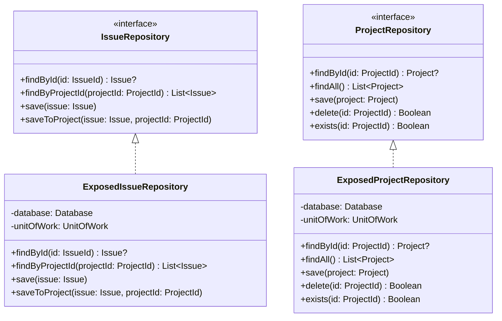

# Repository Usage Patterns

The repository pattern provides a clean abstraction between domain models and data persistence, enabling testability and future database migration flexibility. This document describes CycleTime's repository implementation using Kotlin, Exposed ORM, and H2 database.

## Architecture Overview

CycleTime implements the repository pattern with a clear separation between domain interfaces and infrastructure implementations. Each aggregate root (Project, Issue, Workflow) has its own repository interface defined in the domain layer, with concrete implementations in the infrastructure layer using Exposed ORM.



## Core Repositories

### IssueRepository

The `IssueRepository` manages persistence and retrieval of Issue entities with support for hierarchical relationships and project associations.

```kotlin
interface IssueRepository {
    suspend fun findById(id: IssueId): Issue?
    suspend fun findByProjectId(projectId: ProjectId): List<Issue>
    suspend fun save(issue: Issue): Unit
    suspend fun saveToProject(issue: Issue, projectId: ProjectId): Unit
}
```

#### Key Methods

**`findById`**: Retrieves a single issue by its unique identifier. Returns null if the issue doesn't exist.

**`findByProjectId`**: Retrieves all issues associated with a specific project, including the complete issue hierarchy (epics, stories, subtasks).

**`save`**: Persists an issue while maintaining its existing relationships. Use this method when updating existing issues to preserve project associations and parent-child links.

**`saveToProject`**: Atomically saves an issue and creates its association with a project. This method ensures referential integrity by executing both operations within a single transaction.

#### Usage Examples

**Create a new issue and associate with project:**

```kotlin
val issue = Issue.create(
    title = "Implement user authentication",
    description = "Add JWT-based authentication system",
    type = IssueType.Story
)
issueRepository.saveToProject(issue, projectId)
```

**Update an existing issue:**

```kotlin
val existingIssue = issueRepository.findById(issueId)
existingIssue?.let { issue ->
    issue.updateStatus(IssueStatus.InProgress)
    issue.updateDescription("Updated requirements for JWT auth")
    issueRepository.save(issue)
}
```

**Retrieve all project issues:**

```kotlin
val projectIssues = issueRepository.findByProjectId(projectId)
val activeIssues = projectIssues.filter { it.status == IssueStatus.InProgress }
```

### ProjectRepository

The `ProjectRepository` manages Project entities, providing standard CRUD operations with support for existence checks.

```kotlin
interface ProjectRepository {
    suspend fun findById(id: ProjectId): Project?
    suspend fun findAll(): List<Project>
    suspend fun save(project: Project): Unit
    suspend fun delete(id: ProjectId): Boolean
    suspend fun exists(id: ProjectId): Boolean
}
```

#### Usage Examples

**Create and save a new project:**

```kotlin
val project = Project.create(
    name = "E-commerce Platform",
    description = "Online marketplace with payment integration"
)
projectRepository.save(project)
```

**Update project details:**

```kotlin
val project = projectRepository.findById(projectId)
project?.let {
    it.updateStatus(ProjectStatus.Active)
    it.updateName("E-commerce Platform v2")
    projectRepository.save(it)
}
```

**Delete project (cascades to associated issues):**

```kotlin
val deleted = projectRepository.delete(projectId)
if (deleted) {
    println("Project and all associated issues deleted")
}
```

**Check project existence before operations:**

```kotlin
if (projectRepository.exists(projectId)) {
    // Proceed with project operations
}
```

### WorkflowRepository

The `WorkflowRepository` manages workflow state transitions for projects, supporting both standard and custom workflow definitions.

```kotlin
interface WorkflowRepository {
    suspend fun findById(id: WorkflowId): Workflow?
    suspend fun findByProjectId(projectId: ProjectId): Workflow?
    suspend fun save(workflow: Workflow): Unit
    suspend fun delete(id: WorkflowId): Unit
}
```

#### Usage Examples

**Create standard workflow:**

```kotlin
val workflow = Workflow.create(
    name = "Development Workflow",
    projectId = projectId
)
workflowRepository.save(workflow)
```

**Create custom workflow with specific stages:**

```kotlin
val customStages = listOf("Planning", "Development", "Testing", "Deployment")
val workflow = Workflow.createCustom(
    name = "Sprint Workflow",
    projectId = projectId,
    stages = customStages
)
workflowRepository.save(workflow)
```

**Progress workflow through stages:**

```kotlin
val workflow = workflowRepository.findByProjectId(projectId)
workflow?.let {
    it.transitionTo("Testing")
    workflowRepository.save(it)
}
```

**Reset workflow to initial state:**

```kotlin
workflow?.let {
    it.reset()
    workflowRepository.save(it)
}
```

## Transaction Patterns

All repository operations that modify data execute within database transactions to ensure data consistency and referential integrity. The infrastructure layer uses Exposed's transaction DSL to manage transaction boundaries.

```kotlin
// Example: Atomic save with project association
override suspend fun saveToProject(issue: Issue, projectId: ProjectId) =
    unitOfWork.executeInTransaction {
        // Insert or update issue
        Issues.upsert {
            it[id] = issue.id.value
            it[title] = issue.title
            it[description] = issue.description
            it[type] = issue.type.name
            it[status] = issue.status.name
        }

        // Create project association
        ProjectIssues.insertIgnore {
            it[this.projectId] = projectId.value
            it[issueId] = issue.id.value
        }
    }
```

This pattern ensures that both the issue save and project association succeed together or fail together, preventing orphaned records or inconsistent state.

## Issue Hierarchy Management

Issues support parent-child relationships enabling epic-story-subtask hierarchies. The repository pattern handles these relationships through foreign key constraints and cascading operations.

```kotlin
// Create hierarchy
val epic = Issue.create(
    title = "User Management System",
    description = "Complete user authentication and authorization",
    type = IssueType.Epic
)

val story1 = Issue.create(
    title = "User Login",
    description = "Implement JWT authentication",
    type = IssueType.Story
)

val story2 = Issue.create(
    title = "User Registration",
    description = "User signup with email verification",
    type = IssueType.Story
)

// Establish parent-child relationships
story1.setParent(epic.id)
story2.setParent(epic.id)
epic.addChild(story1.id)
epic.addChild(story2.id)

// Save hierarchy (order matters for referential integrity)
issueRepository.saveToProject(epic, projectId)
issueRepository.saveToProject(story1, projectId)
issueRepository.saveToProject(story2, projectId)
```

When querying issues by project, the repository automatically loads the complete hierarchy, allowing navigation of parent-child relationships without additional database queries.

## Issue Dependencies

Issues can have blocking dependencies on other issues, enabling workflow orchestration and dependency tracking.

```kotlin
// Create dependent issues
val backendApi = Issue.create(
    title = "REST API Endpoint",
    description = "Create /api/auth/login endpoint",
    type = IssueType.Story
)

val frontendUi = Issue.create(
    title = "Login UI Component",
    description = "Build React login form",
    type = IssueType.Story
)

// Frontend depends on backend completion
frontendUi.addDependency(backendApi.id)

issueRepository.save(backendApi)
issueRepository.save(frontendUi)

// Check if issue is blocked by dependencies
if (frontendUi.isBlocked()) {
    println("Frontend UI is blocked by: ${frontendUi.dependencies}")
}
```

The domain layer enforces dependency rules, while the repository layer persists these relationships through a dedicated dependencies table with foreign key constraints.

## Status Transitions

Issues follow a defined status workflow enforced by the domain layer. The repository pattern persists these transitions while the domain entities validate them.

```kotlin
// Valid transitions from Backlog
val issue = issueRepository.findById(issueId)
issue?.let {
    it.updateStatus(IssueStatus.Todo)        // Valid: Backlog → Todo
    issueRepository.save(it)

    // it.updateStatus(IssueStatus.InProgress)  // Invalid: must go through Todo first
}

// Complete transition sequence
issue?.let {
    it.updateStatus(IssueStatus.Todo)
    it.updateStatus(IssueStatus.InProgress)
    it.updateStatus(IssueStatus.InReview)
    it.updateStatus(IssueStatus.Done)
    issueRepository.save(it)  // Persist final state
}
```

**Valid status transitions:**
- **Backlog** → Todo, Canceled, Duplicate
- **Todo** → InProgress, Backlog, Canceled, Duplicate
- **InProgress** → InReview, Done, Todo, Canceled
- **InReview** → Done, InProgress, Canceled
- **Done, Canceled, Duplicate** → (terminal states, no further transitions)

## Performance Considerations

### Batch Operations

When performing multiple related operations, leverage Kotlin's coroutines and Exposed's batch insert capabilities for optimal performance:

```kotlin
// Efficient: Batch insert within single transaction
unitOfWork.executeInTransaction {
    Issues.batchInsert(issueList) { issue ->
        this[Issues.id] = issue.id.value
        this[Issues.title] = issue.title
        this[Issues.type] = issue.type.name
        this[Issues.status] = issue.status.name
    }
}
```

### Query Optimization

The repository implementations use Exposed's DSL which generates optimized SQL with proper indexing:

```kotlin
// Indexed query by project ID
override suspend fun findByProjectId(projectId: ProjectId): List<Issue> =
    unitOfWork.executeInTransaction {
        (Issues innerJoin ProjectIssues)
            .select { ProjectIssues.projectId eq projectId.value }
            .map { row -> mapToIssue(row) }
    }
```

### Connection Pooling

CycleTime uses HikariCP for connection pooling, providing high-performance database access with configurable pool sizes:

```kotlin
Database.connect(
    url = "jdbc:h2:file:./cycletime;MODE=PostgreSQL",
    driver = "org.h2.Driver",
    setupConnection = { connection ->
        connection.transactionIsolation = Connection.TRANSACTION_READ_COMMITTED
    }
).apply {
    // Configure HikariCP pool
    hikariConfig.maximumPoolSize = 10
    hikariConfig.minimumIdle = 2
}
```

## Error Handling

Repository operations throw domain-specific exceptions that clients can handle appropriately. The infrastructure layer maps database errors to domain exceptions:

```kotlin
try {
    issueRepository.save(issue)
} catch (e: DomainException) {
    when (e) {
        is IssueNotFoundException -> logger.error("Issue not found: ${e.id}")
        is InvalidStatusTransitionException -> logger.error("Invalid transition: ${e.message}")
        else -> throw e
    }
}
```

## Testing Strategies

Repository implementations are tested using in-memory H2 databases, providing fast, isolated test execution without external dependencies.

```kotlin
class IssueRepositoryTest : StringSpec({
    lateinit var database: Database
    lateinit var repository: IssueRepository

    beforeEach {
        // Create in-memory H2 database
        database = Database.connect(
            "jdbc:h2:mem:test;MODE=PostgreSQL;DATABASE_TO_LOWER=TRUE;DB_CLOSE_DELAY=-1"
        )

        // Run migrations
        transaction(database) {
            SchemaUtils.create(Issues, Projects, ProjectIssues)
        }

        repository = ExposedIssueRepository(database, testUnitOfWork)
    }

    afterEach {
        TransactionManager.closeAndUnregister(database)
    }

    "should save and retrieve issue" {
        val issue = Issue.create("Test Issue", "Description", IssueType.Story)
        repository.save(issue)

        val retrieved = repository.findById(issue.id)
        retrieved shouldNotBe null
        retrieved?.title shouldBe "Test Issue"
    }
})
```

## Best Practices

Following these repository usage patterns ensures data consistency, performance, and maintainability across the CycleTime codebase.

**Use transactions for multi-entity operations**: When an operation involves multiple entities or relationships, wrap it in a transaction to ensure atomicity. The `saveToProject` method demonstrates this pattern by saving both the issue and its project association in a single transaction.

**Maintain referential integrity through foreign keys**: All entity relationships use database foreign key constraints, ensuring orphaned records cannot exist. The database schema enforces these relationships automatically.

**Leverage Exposed's type-safe DSL**: Use Exposed's query DSL instead of raw SQL to prevent SQL injection and gain compile-time type safety. The DSL provides excellent IDE support and refactoring capabilities.

**Handle cleanup in tests and error scenarios**: Always close database connections and clean up resources in test teardown and error handling paths. Use Kotlin's `use` blocks or try-finally patterns for guaranteed cleanup.

**Follow domain rules for entity operations**: Status transitions, hierarchy rules, and dependency constraints are enforced in the domain layer. Repositories persist these constraints but don't validate them - keep validation in domain entities.

**Prefer `saveToProject` for new issue creation**: When creating issues for a project, use `saveToProject` to atomically establish the project association. This prevents issues from existing without a project relationship.

**Use `save` for updating existing issues**: When modifying existing issues, use the `save` method which preserves established relationships and associations while updating the entity state.

## Migration Support

The repository pattern abstracts the persistence mechanism, making database migration straightforward. All domain logic remains unchanged when switching databases.

```kotlin
// Current: H2 embedded database
val repository = ExposedIssueRepository(
    database = h2Database,
    unitOfWork = h2UnitOfWork
)

// Future: PostgreSQL for cloud deployment
val repository = ExposedIssueRepository(
    database = postgresDatabase,
    unitOfWork = postgresUnitOfWork
)

// Future: Different ORM or NoSQL
val repository = MongoIssueRepository(
    collection = mongoCollection
)
```

All repository implementations adhere to the same `IssueRepository` interface defined in the domain layer. This ensures that application services and domain logic remain completely unaware of the underlying persistence technology, enabling seamless migration between databases without modifying business logic.
