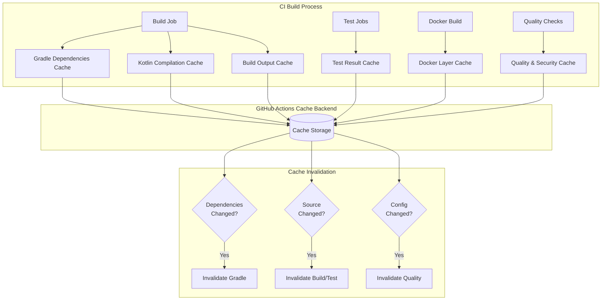

# Comprehensive Caching Strategy (SPI-475)

This document outlines the multi-layer caching strategy implemented for the CycleTime project, targeting overall CI time reduction and consistent build performance.

## Overview

The caching strategy includes six distinct cache layers, each optimized for specific use cases and invalidation patterns:

1. **Gradle Dependencies Cache** - Downloaded JAR files and metadata
2. **Build Output Cache** - Compiled classes and build artifacts
3. **Test Result Cache** - Test execution results per test suite
4. **Kotlin Compilation Cache** - Incremental compilation artifacts
5. **Docker Layer Cache** - Container image layers via BuildKit
6. **Quality & Security Cache** - Static analysis and vulnerability scan results

## Multi-Layer Cache Architecture



## Cache Layer Details

### 1. Gradle Dependencies Cache

**Purpose**: Cache downloaded dependencies to avoid repeated network requests

**Cache Key Strategy**:
```yaml
key: gradle-deps-v1-${{ runner.os }}-${{ hashFiles('**/*.gradle*', '**/gradle-wrapper.properties', 'gradle/libs.versions.toml') }}
restore-keys: gradle-deps-v1-${{ runner.os }}-
```

**Cached Paths**:
- `~/.gradle/caches` - Downloaded dependencies and metadata
- `~/.gradle/wrapper` - Gradle wrapper distributions
- `~/.gradle/daemon` - Gradle daemon state
- `.gradle/` - Project-specific Gradle cache

**Invalidation**: Changes to dependency declarations, Gradle version, or build scripts

**Target Performance**: Reduced dependency resolution time through cache reuse

### 2. Build Output Cache

**Purpose**: Cache compiled Kotlin classes and build artifacts

**Cache Key Strategy**:
```yaml
key: build-outputs-v2-${{ runner.os }}-${{ hashFiles('src/**/*.kt', 'build.gradle.kts') }}
restore-keys: build-outputs-v2-${{ runner.os }}-
```

**Cached Paths**:
- `build/classes` - Compiled Kotlin/Java classes
- `build/libs` - Generated JAR files
- `build/kotlin` - Kotlin compilation metadata
- `build/tmp` - Temporary build artifacts

**Invalidation**: Source code changes or build configuration changes

**Target Performance**: Improved compilation time for unchanged sources

### 3. Test Result Cache

**Purpose**: Cache test execution results per test suite (unit, integration, system)

**Cache Key Strategies**:

**Unit Tests**:
```yaml
key: unit-test-results-v1-${{ runner.os }}-${{ hashFiles('src/test/**/*.kt', 'src/main/**/*.kt') }}
```

**Integration Tests**:
```yaml
key: integration-test-results-v1-${{ runner.os }}-${{ hashFiles('src/test/kotlin/io/spiralhouse/cycletime/integration/**/*.kt', 'src/main/**/*.kt') }}
```

**System Tests**:
```yaml
key: system-test-results-v1-${{ runner.os }}-${{ hashFiles('src/test/kotlin/io/spiralhouse/cycletime/performance/**/*.kt', 'src/main/**/*.kt', 'src/main/resources/application.conf') }}
```

**Cached Paths**:
- `build/test-results/{testSuite}` - JUnit XML results
- `build/reports/tests/{testSuite}` - HTML test reports

**Invalidation**: Changes to test code or production code being tested

**Target Performance**: Faster test execution through result reuse when tests and sources are unchanged

### 4. Kotlin Compilation Cache

**Purpose**: Enable incremental compilation across CI builds

**Cache Key Strategy**:
```yaml
key: kotlin-compile-v2-${{ runner.os }}-${{ hashFiles('src/**/*.kt', 'build.gradle.kts') }}
restore-keys: kotlin-compile-v2-${{ runner.os }}-
```

**Cached Paths**:
- `build/kotlin` - Kotlin compiler metadata
- `build/tmp/kotlin-classes` - Incremental compilation state

**Configuration Enhancements**:
```properties
# gradle.properties
kotlin.compiler.execution.strategy=in-process
kotlin.caching.enabled=true
kotlin.incremental=true
```

**Invalidation**: Source file modifications or compiler configuration changes

**Target Performance**: Incremental compilation support across CI builds

### 5. Docker Layer Cache

**Purpose**: Cache Docker image layers using BuildKit

**Implementation**: GitHub Actions Cache backend with BuildKit
```yaml
- name: Build Docker image with BuildKit cache
  uses: docker/build-push-action@v5
  with:
    cache-from: type=gha
    cache-to: type=gha,mode=max
    build-args: |
      BUILDKIT_INLINE_CACHE=1
```

**Dockerfile Optimization** (Layer ordering for maximum cache efficiency):
1. Base image and system packages (changes rarely)
2. Gradle wrapper and properties (changes infrequently)  
3. Dependency declaration files (changes moderately)
4. Dependency download layer (cached until dependencies change)
5. Source code (changes frequently)
6. Build execution (invalidated with source changes)

**Invalidation**: Changes to Dockerfile, dependencies, or source code

**Target Performance**: Faster Docker builds through layer cache reuse

### 6. Quality & Security Cache

**Purpose**: Cache static analysis and security scan results

**Detekt Cache**:
```yaml
key: detekt-results-v2-${{ runner.os }}-${{ hashFiles('src/**/*.kt', 'config/detekt/detekt.yml') }}
```

**Security Scan Cache**:
```yaml
key: security-scan-v2-${{ runner.os }}-${{ hashFiles('gradle/libs.versions.toml') }}
```

**Cached Paths**:
- `build/reports/detekt` - Static analysis results
- `~/.gradle/dependency-check-data` - Vulnerability database
- `build/reports/kover` - Coverage reports

**Invalidation**: Code changes or configuration updates

**Target Performance**: Faster quality checks through cached analysis results

## Cache Management

### Cache Versioning Strategy

Each cache layer uses semantic versioning:
- **v1**: Initial implementation
- **v2**: Enhanced with SPI-475 optimizations
- Version increments when cache format or strategy changes

### Cache Key Best Practices

1. **Include OS in key**: Prevents cross-platform cache pollution
2. **Use content hashes**: Ensure cache invalidation on relevant changes
3. **Hierarchical restore keys**: Allow partial cache hits when exact match fails
4. **Scope appropriately**: Balance between cache hit rate and correctness

### Cache Size Management

- **Retention**: 7 days for build artifacts, longer for dependencies
- **Cleanup**: Automatic via GitHub Actions cache eviction policies
- **Monitoring**: Track cache hit rates in CI logs

## CI/CD Integration

### Environment Variables

```yaml
env:
  BUILD_CACHE_VERSION: "v2"
  GRADLE_CACHE_VERSION: "v2" 
  DEPENDENCY_CACHE_VERSION: "v1"
  DOCKER_CACHE_VERSION: "v1"
  TEST_CACHE_VERSION: "v1"
```

### Gradle Properties Optimization

**Local Development** (`gradle.properties`):
```properties
org.gradle.caching=true
org.gradle.configuration-cache=true
kotlin.compiler.execution.strategy=in-process
kotlin.caching.enabled=true
```

**CI Environment** (`.github/gradle-ci.properties`):
```properties
org.gradle.caching=true
org.gradle.configuration-cache=true
org.gradle.workers.max=2
kotlin.compiler.execution.strategy=in-process
kotlin.caching.enabled=true
```

### Cache Performance Monitoring

Each CI job includes cache status reporting:
```bash
echo "📊 Cache status before build:"
echo "  Gradle cache: $([ -d ~/.gradle/caches ] && echo 'HIT' || echo 'MISS')"
echo "  Kotlin cache: $([ -d build/kotlin ] && echo 'HIT' || echo 'MISS')"
echo "  Test cache: $([ -d build/test-results/unitTest ] && echo 'HIT' || echo 'MISS')"
```

## Performance Optimization Targets

The caching strategy aims to reduce CI pipeline execution time through intelligent cache reuse across different change scenarios. Actual performance improvements will vary based on change patterns, cache hit rates, and build complexity.

### Target Cache Hit Scenarios

- **Cold build**: No cache available, full build required
- **Warm build**: Significant cache hits on dependencies and build outputs
- **Documentation-only changes**: Maximum cache reuse (code unchanged)
- **Dependency updates**: Gradle cache invalidation, rebuild required
- **Source code changes**: Incremental compilation and selective test execution

### Cache Hit Rate Targets

- **Gradle Dependencies**: 95% (dependencies change infrequently)
- **Build Outputs**: 70% (moderate source changes)
- **Test Results**: 60% (tests change with features)
- **Docker Layers**: 80% (base layers stable)
- **Quality Scans**: 85% (analysis config stable)

## Troubleshooting

### Cache Debug Mode

Enable cache debugging by setting environment variables:
```properties
org.gradle.caching.debug=true
org.gradle.internal.tasks.cache.statistics=true
```

### Common Cache Issues

1. **Cache misses on identical builds**
   - Check for non-deterministic inputs (timestamps, UUIDs)
   - Verify cache key includes all relevant files
   - Review cache size limits

2. **Stale cache entries**
   - Increment cache version numbers
   - Clear caches manually via GitHub Actions UI
   - Verify invalidation logic

3. **Performance degradation**
   - Monitor cache hit rates in CI logs
   - Check for oversized cache keys
   - Validate cache path specifications

### Cache Debugging Commands

**Local Development**:
```bash
# View cache statistics
./gradlew build --build-cache --info

# Clean local caches
./gradlew clean --no-build-cache
rm -rf ~/.gradle/caches

# Check configuration cache
./gradlew help --configuration-cache --info
```

**CI Environment**:
```bash
# List cache contents
find ~/.gradle/caches -type f -name "*.jar" | wc -l
du -sh ~/.gradle/caches

# Verify cache usage
grep -r "cache" .gradle/configuration-cache/
```

## Future Enhancements

### Remote Build Cache

Consider implementing Gradle Enterprise or similar solution for:
- Cross-team cache sharing
- Build performance analytics
- Advanced cache management

### Intelligent Cache Warming

Implement cache pre-warming strategies:
- Dependency pre-download for new branches
- Scheduled cache refresh for stable dependencies
- Predictive cache population based on change patterns

### Cache Analytics

Enhanced monitoring and optimization:
- Cache hit rate tracking over time
- Build performance correlation analysis
- Automated cache strategy tuning

## Maintenance

### Regular Tasks

1. **Monthly**: Review cache hit rates and performance metrics
2. **Quarterly**: Evaluate cache key strategies and version increments
3. **On dependency updates**: Verify cache invalidation works correctly
4. **On CI changes**: Test cache behavior with new workflow modifications

### Performance Validation

Use these commands to validate caching effectiveness:

```bash
# Local build performance test
time ./gradlew clean build --build-cache

# CI cache validation
./gradlew buildStatus

# Docker cache validation
docker system df
```

This caching strategy provides the foundation for CI performance optimization while maintaining build reliability and correctness.