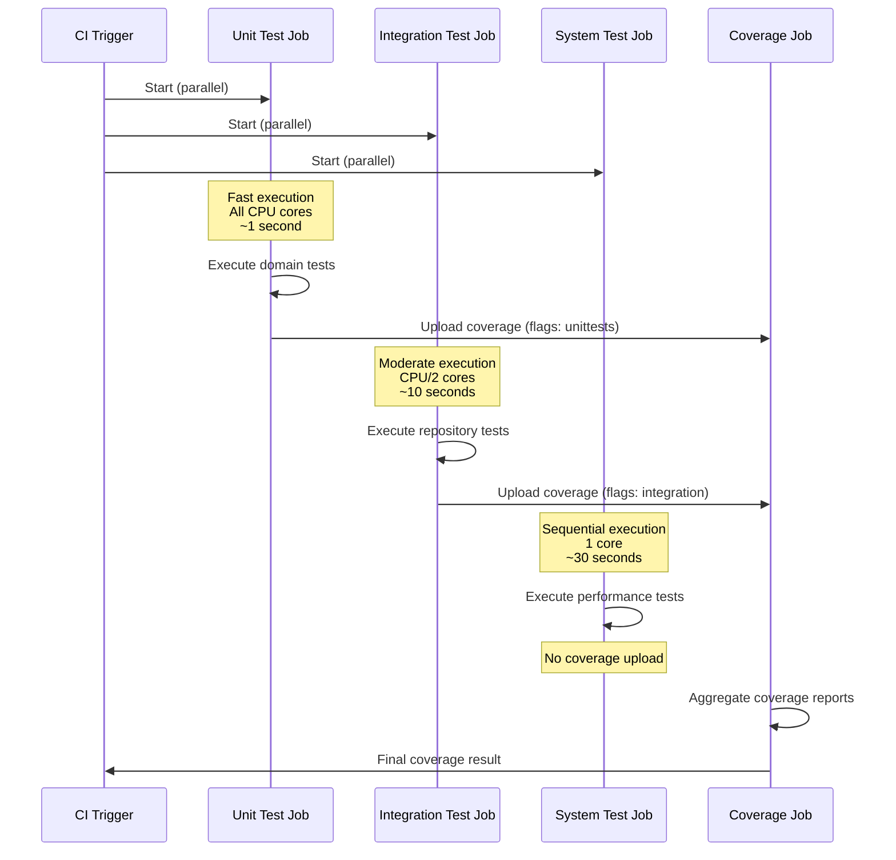

# Test Suites - SPI-473 Implementation

This document describes the separate test suite implementation with parallel execution for improved developer productivity.

## Test Suite Overview

The CycleTime project now uses three distinct test suites optimized for different purposes:

### 1. Unit Tests (`unitTest`)
- **Purpose**: Fast feedback on business logic and domain rules
- **Scope**: Domain entities, value objects, business rule verification, MCP protocol and tool tests
- **Performance Target**: < 1 second total execution
- **Parallelization**: Maximum parallel forks (all CPU cores)
- **Memory**: 128m-512m (optimized for speed)
- **Usage**: `./gradlew unitTest`

**MCP Test Coverage**: Includes MCP protocol handlers and tool logic tests with no external dependencies (see `.claude/shared/testing-standards.md` for complete categorization)

### 2. Integration Tests (`integrationTest`)
- **Purpose**: Database interactions and service integration
- **Scope**: Repository tests, application service tests, dependency injection, MCP server integration
- **Performance Target**: < 10 seconds total execution
- **Parallelization**: Conservative (CPU cores / 2) - enabled by Database DI pattern
- **Memory**: 256m-1024m (moderate for database operations)
- **Database Isolation**: Each test gets its own H2 in-memory database instance
- **Usage**: `./gradlew integrationTest`

**MCP Test Coverage**: Includes MCP server infrastructure, SSE connections, and resource management tests (see `.claude/shared/testing-standards.md` for complete categorization)

### 3. System Tests (`systemTest`)
- **Purpose**: End-to-end scenarios and performance validation
- **Scope**: Performance baseline tests, complex workflows
- **Performance Target**: < 30 seconds total execution
- **Parallelization**: Sequential (1 fork) for consistent performance measurements
- **Memory**: 512m-2048m (generous for performance testing)
- **Usage**: `./gradlew systemTest`

## Parallel Test Execution Flow



## Available Commands

### Individual Test Suites
```bash
# Fast unit tests for development feedback
./gradlew unitTest

# Integration tests for database/service verification  
./gradlew integrationTest

# System tests for performance and end-to-end validation
./gradlew systemTest
```

### Aggregate Commands
```bash
# Quick feedback during development (unit tests only)
./gradlew quickTest

# Run all test suites in optimal order
./gradlew testAll

# Backward-compatible command (runs all tests)
./gradlew test

# CI-optimized execution
./gradlew ciTest
```

## CI/CD Integration

The GitHub Actions workflow now runs test suites in parallel for faster feedback:

1. **Unit Tests** (5 min timeout) - Fast business logic validation
2. **Integration Tests** (10 min timeout) - Database and service testing  
3. **System Tests** (15 min timeout) - Performance and end-to-end validation
4. **Test Coverage** - Aggregated coverage report generation

### Parallel Execution Benefits
- **Faster overall test execution** through parallel suite execution (vs sequential)
- **Fail-fast feedback** - unit tests complete first for rapid developer feedback
- **Independent test isolation** - each suite runs in its own environment
- **Optimized resource usage** - memory and parallelization tuned per test type

## Performance Characteristics

### Unit Tests
- **Execution Pattern**: All CPU cores utilized
- **Memory Usage**: Minimal (128m-512m)
- **Typical Duration**: 10-30 seconds
- **Fail Fast**: Enabled for rapid feedback

### Integration Tests  
- **Execution Pattern**: Conservative parallelization (database safety)
- **Memory Usage**: Moderate (256m-1024m) 
- **Typical Duration**: 1-3 minutes
- **Database**: Fresh H2 instance per test class

### System Tests
- **Execution Pattern**: Sequential execution (performance consistency)
- **Memory Usage**: Generous (512m-2048m)
- **Typical Duration**: 2-5 minutes  
- **GC Logging**: Enabled for performance analysis

## Development Workflow

### Recommended Development Flow
1. **Development Loop**: Use `./gradlew quickTest` for immediate feedback
2. **Pre-commit**: Run `./gradlew testAll` to verify all tests pass
3. **CI Pipeline**: Automatic parallel execution of all test suites

### Test Organization (Source Set Based)

Tests are organized using Gradle source sets (see [Test Source Set Guide](test-source-set-guide.md)):

- **Unit Tests**: `src/test/kotlin/` - Domain logic, MCP protocol, and tool tests
- **Integration Tests**: `src/integrationTest/kotlin/` - Component integration and MCP server tests
- **System Tests**: `src/systemTest/kotlin/` - Performance and end-to-end tests

## Backward Compatibility

The default `./gradlew test` command continues to work as before, running all test suites for full backward compatibility with existing development workflows.

## Database Dependency Injection Pattern

The project uses a DI-based database pattern that enables true parallel test execution:

### Production Database Configuration
- **DatabaseProvider Interface**: Abstraction for database access
- **DefaultDatabaseProvider**: Production implementation with HikariCP connection pooling
- **Ktor Native DI**: Database provider injected through Ktor's dependency injection

### Test Database Isolation
- **TestDatabaseProvider**: Each test gets its own isolated H2 in-memory database
- **No Singleton Conflicts**: Eliminated DatabaseFactory singleton that prevented parallel execution
- **Automatic Cleanup**: In-memory databases automatically cleaned up by garbage collection
- **Naming Strategies**: UUID, Sequential, or Fixed naming for test databases

### Benefits of DI Pattern
1. **Parallel Test Execution**: Tests run concurrently without database conflicts
2. **Test Isolation**: No shared state between test suites
3. **3-5x Speed Improvement**: Parallel execution reduces CI/CD time significantly
4. **Clean Architecture**: Follows SOLID principles with proper dependency injection
5. **Future-Proof**: Easy to swap database implementations or add new providers

### Test Configuration Example

```kotlin
// Configure test with isolated database
testApplication {
    configureTestApplicationWithModule(
        strategy = TestDatabaseNamingStrategy.UUID,
        enableLogging = false
    )

    // Each test gets its own database instance
    val response = client.get("/api/v1/issues")
    // Test assertions...
}
```

## Performance Monitoring

Each test suite includes performance monitoring:
- **Unit Tests**: Sub-second execution validation
- **Integration Tests**: Database operation efficiency tracking with parallel execution
- **System Tests**: Comprehensive performance baseline with 160 test issues

The system tests include N+1 query detection and performance regression monitoring to maintain optimal system performance as the codebase evolves.