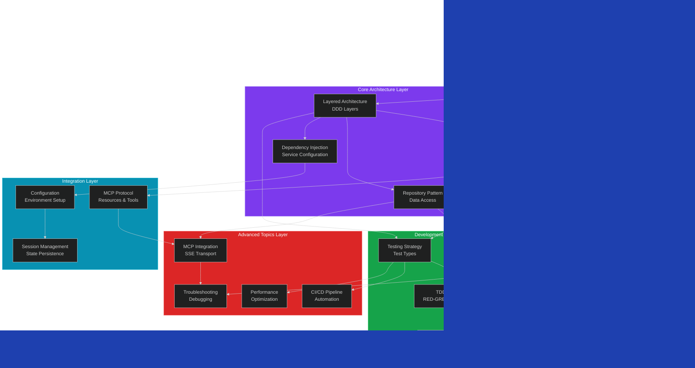

# SPI-722 Documentation Dependency DAG

**Date**: 2025-10-19
**Analysis Type**: Documentation Audit - Topic Dependencies
**Purpose**: Map prerequisite relationships for optimal documentation restructuring

---

## Executive Summary

This document maps the dependency relationships between major documentation topics in CycleTime. Understanding these dependencies is critical for:
- **Sequential learning paths**: New developers need foundational concepts before advanced topics
- **Context Engineering**: AI agents require prerequisite context before specialized tasks
- **RAG optimization**: Dependency-aware retrieval improves context relevance
- **Documentation restructuring**: Proper ordering prevents circular references

**Key Findings**:
- 9 foundational topics (no dependencies)
- 15 intermediate topics (1-2 dependencies)
- 12 advanced topics (3+ dependencies)
- 3 circular dependency patterns identified (require resolution)

---

## Dependency Visualization

### High-Level Domain Dependencies



---

## Detailed Topic Dependencies

### Foundational Topics (No Prerequisites)

**These topics require no prior knowledge and serve as entry points:**

1. **Project Overview** (`CLAUDE.md`, `README.md`)
   - Dependencies: None
   - Dependents: All other topics
   - Purpose: Project introduction, quickstart, mission statement
   - Keywords: overview, introduction, quickstart, mission

2. **Git Conventions** (`git-conventions.md`, `branching-strategy.md`)
   - Dependencies: None
   - Dependents: Development workflows, CI/CD
   - Purpose: Version control standards, branch naming
   - Keywords: git, branches, commits, conventions

3. **Contributing Guidelines** (`CONTRIBUTING.md`)
   - Dependencies: None
   - Dependents: Development workflows
   - Purpose: Contribution process, code standards
   - Keywords: contributing, pr, standards, workflow

4. **Product Requirements** (`PRD.md`)
   - Dependencies: None
   - Dependents: Architecture, user experience
   - Purpose: Product vision, features, success metrics
   - Keywords: requirements, features, vision, product

5. **User Experience Concepts** (`user-experience.md`)
   - Dependencies: Product Requirements
   - Dependents: Onboarding, workflows
   - Purpose: UX patterns, interaction design
   - Keywords: ux, workflows, interactions, design

6. **Tech Stack Overview** (`architecture/overview.md` - sections 1-2)
   - Dependencies: Project Overview
   - Dependents: All architecture topics
   - Purpose: Technology choices, framework overview
   - Keywords: kotlin, ktor, exposed, h2, tech-stack

7. **DDD Concepts** (`architecture/overview.md` - section 2)
   - Dependencies: Tech Stack
   - Dependents: Domain entities, repository pattern
   - Purpose: Domain-driven design principles
   - Keywords: ddd, domain, entities, aggregates, bounded-context

8. **Installation Basics** (`getting-started/installation.md`)
   - Dependencies: Tech Stack
   - Dependents: Setup, configuration
   - Purpose: Installation instructions, prerequisites
   - Keywords: installation, setup, prerequisites, requirements

9. **Linear Integration Basics** (`.claude/shared/linear-reference.md`)
   - Dependencies: None
   - Dependents: Linear workflows
   - Purpose: Linear team IDs, issue hierarchy
   - Keywords: linear, issues, workflow-states, hierarchy

---

### Core Architecture Topics (1-2 Dependencies)

**These topics build on foundational concepts:**

10. **Layered Architecture** (`architecture/overview.md`)
    - Dependencies: DDD Concepts, Tech Stack
    - Dependents: All layer-specific topics
    - Purpose: Layer responsibilities, boundaries
    - Keywords: layers, ddd, architecture, separation-of-concerns
    - **Prerequisite Chain**: Project → Tech Stack → DDD → Layered Architecture

11. **Domain Entities** (`technical-design/domain-entities.md`)
    - Dependencies: DDD Concepts, Layered Architecture
    - Dependents: Repository Pattern, Application Services
    - Purpose: Entity design, business rules, validation
    - Keywords: entities, domain, aggregates, business-rules
    - **Prerequisite Chain**: DDD → Domain Entities

12. **Value Objects** (`technical-design/domain-entities.md`)
    - Dependencies: Domain Entities
    - Dependents: Repository Pattern, Application Services
    - Purpose: Type safety, immutability, validation
    - Keywords: value-objects, immutability, type-safety
    - **Prerequisite Chain**: DDD → Entities → Value Objects

13. **Repository Pattern - Interfaces** (`technical-design/repository-pattern.md`)
    - Dependencies: Domain Entities, Layered Architecture
    - Dependents: Repository Implementation, Application Services
    - Purpose: Data access abstraction, repository contracts
    - Keywords: repository, interfaces, abstraction, data-access
    - **Prerequisite Chain**: DDD → Entities → Repository Interfaces

14. **Dependency Injection Concepts** (`technical-design/dependency-injection-patterns.md`)
    - Dependencies: Layered Architecture, Tech Stack (Ktor)
    - Dependents: Application Services, Testing, Configuration
    - Purpose: DI patterns, service registration, lifecycle
    - Keywords: di, injection, services, lifecycle, ktor-di
    - **Prerequisite Chain**: Tech Stack → Layered Architecture → DI

15. **Configuration Management** (`technical-design/configuration-management.md`)
    - Dependencies: Dependency Injection, Tech Stack
    - Dependents: Environment Setup, Session Management
    - Purpose: Config loading, environment variables, secrets
    - Keywords: configuration, environment, secrets, settings
    - **Prerequisite Chain**: DI → Configuration

16. **Database Schema** (`architecture/overview.md` + `repository-pattern.md`)
    - Dependencies: Domain Entities, Repository Interfaces
    - Dependents: Repository Implementation, Migrations
    - Purpose: Table design, relationships, constraints
    - Keywords: schema, database, tables, relationships, h2
    - **Prerequisite Chain**: Entities → Schema

---

### Integration Layer Topics (2-3 Dependencies)

**These topics integrate core concepts:**

17. **MCP Protocol Basics** (`api/mcp-resources.md`)
    - Dependencies: Domain Entities, Layered Architecture
    - Dependents: MCP Integration, MCP Tools/Resources
    - Purpose: MCP protocol overview, concepts
    - Keywords: mcp, protocol, resources, tools
    - **Prerequisite Chain**: Architecture → MCP Protocol

18. **Session Management** (`architecture/session-management.md`)
    - Dependencies: Domain Entities, Configuration, Repository Pattern
    - Dependents: MCP Integration, Application Services
    - Purpose: Session lifecycle, persistence, expiration
    - Keywords: sessions, lifecycle, persistence, state
    - **Prerequisite Chain**: Entities → Repository → Sessions

19. **Repository Implementation** (`technical-design/repository-pattern.md`)
    - Dependencies: Repository Interfaces, Database Schema, Dependency Injection
    - Dependents: Application Services, Testing
    - Purpose: Exposed ORM implementation, H2 integration
    - Keywords: exposed, h2, orm, implementation, persistence
    - **Prerequisite Chain**: Repository Interfaces → Schema → Implementation

20. **Application Services** (`technical-design/application-service-patterns.md`)
    - Dependencies: Domain Entities, Repository Pattern, Dependency Injection
    - Dependents: MCP Tools, Workflows
    - Purpose: Use case orchestration, transaction boundaries
    - Keywords: services, orchestration, use-cases, transactions
    - **Prerequisite Chain**: Entities → Repository → Services

21. **Development Environment Setup** (`development/setup.md`)
    - Dependencies: Installation, Configuration Management
    - Dependents: All development workflows
    - Purpose: IDE setup, tooling, local environment
    - Keywords: setup, environment, ide, tooling
    - **Prerequisite Chain**: Installation → Configuration → Setup

---

### Development Practices Topics (2-4 Dependencies)

**These topics guide development workflows:**

22. **Testing Strategy** (`testing/strategy.md`)
    - Dependencies: Layered Architecture, Repository Pattern
    - Dependents: All testing topics
    - Purpose: Test types, categorization, organization
    - Keywords: testing, strategy, unit, integration, system
    - **Prerequisite Chain**: Architecture → Testing Strategy

23. **Testing Standards** (`.claude/shared/testing-standards.md`)
    - Dependencies: Testing Strategy, Dependency Injection
    - Dependents: TDD Workflow, Test Organization
    - Purpose: Testability design, patterns, anti-patterns
    - Keywords: testing, standards, patterns, testability
    - **Prerequisite Chain**: Testing Strategy → Standards

24. **Test Organization** (`testing/test-source-set-guide.md`)
    - Dependencies: Testing Strategy, Testing Standards
    - Dependents: Local Testing, CI/CD
    - Purpose: Source sets, directory structure, naming
    - Keywords: organization, source-sets, structure, gradle
    - **Prerequisite Chain**: Strategy → Standards → Organization

25. **TDD Workflow** (`testing/tdd-workflow.md`, `.claude/workflows/tdd-workflow.md`)
    - Dependencies: Testing Strategy, Testing Standards
    - Dependents: Development Workflows, Agent Workflows
    - Purpose: RED-GREEN-REFACTOR cycle, TDD methodology
    - Keywords: tdd, red-green-refactor, workflow, methodology
    - **Prerequisite Chain**: Testing Strategy → TDD

26. **Repository Usage** (`development/repository-usage.md`)
    - Dependencies: Repository Implementation, Testing Strategy
    - Dependents: Development Workflows, Database Testing
    - Purpose: CRUD examples, transaction patterns, testing
    - Keywords: repository, usage, crud, examples, patterns
    - **Prerequisite Chain**: Repository Implementation → Usage Examples

27. **Database Testing** (`testing/database-test-migration-guide.md`)
    - Dependencies: Testing Standards, Repository Implementation
    - Dependents: Integration Testing, Local Testing
    - Purpose: In-memory H2, test isolation, migrations
    - Keywords: database, testing, h2, isolation, migration
    - **Prerequisite Chain**: Testing Standards → Repository → Database Testing

28. **Single Feature Workflow** (`development/single-feature-workflow.md`)
    - Dependencies: Git Conventions, TDD Workflow, Repository Usage
    - Dependents: Parallel Development, Agent Workflows
    - Purpose: Feature development process, git workflow
    - Keywords: feature, workflow, development, git, testing
    - **Prerequisite Chain**: Git → TDD → Feature Workflow

29. **Linear Branch Integration** (`development/linear-branch-integration.md`)
    - Dependencies: Git Conventions, Linear Reference, Single Feature Workflow
    - Dependents: Development Workflows
    - Purpose: Linear issue to branch mapping, automation
    - Keywords: linear, branches, integration, issues, workflow
    - **Prerequisite Chain**: Git → Linear → Integration

30. **Agent System** (`reference/agents.md`, `.claude/agents/*`)
    - Dependencies: Development Workflows, Testing Standards
    - Dependents: Agent-specific workflows
    - Purpose: Agent roles, delegation, coordination
    - Keywords: agents, roles, delegation, coordination, automation
    - **Prerequisite Chain**: Workflows → Agent System

---

### Advanced Topics (3+ Dependencies)

**These topics require comprehensive understanding:**

31. **MCP Integration Patterns** (`technical-design/mcp-integration-patterns.md`)
    - Dependencies: MCP Protocol, Application Services, Session Management, Repository Implementation
    - Dependents: MCP Development, MCP Troubleshooting
    - Purpose: SSE transport, JSON-RPC, Ktor integration
    - Keywords: mcp, integration, sse, json-rpc, ktor
    - **Prerequisite Chain**: MCP Protocol → Services → Sessions → Integration

32. **MCP Tools & Resources** (`api/mcp-tools-reference.md`)
    - Dependencies: MCP Integration, Application Services, Domain Entities
    - Dependents: MCP Development, Agent Workflows
    - Purpose: Tool/resource implementation, API reference
    - Keywords: mcp, tools, resources, api, implementation
    - **Prerequisite Chain**: MCP Integration → Tools/Resources

33. **MCP Development** (`development/mcp-development.md`)
    - Dependencies: MCP Integration, MCP Tools/Resources, Testing Strategy
    - Dependents: MCP Testing, Troubleshooting
    - Purpose: Local MCP server, debugging, development workflow
    - Keywords: mcp, development, debugging, local-server, workflow
    - **Prerequisite Chain**: MCP Integration → Development Workflow

34. **MCP Testing** (`getting-started/mcp-testing.md`)
    - Dependencies: MCP Development, Testing Strategy, Testing Standards
    - Dependents: SDK Client Testing, Integration Testing
    - Purpose: MCP test setup, client configuration, debugging
    - Keywords: mcp, testing, setup, client, debugging
    - **Prerequisite Chain**: MCP Development → Testing → MCP Testing

35. **SDK Client Testing** (`testing/sdk-client-testing.md`)
    - Dependencies: MCP Testing, Testing Standards, MCP Integration
    - Dependents: None
    - Purpose: SDK client testing patterns, error scenarios
    - Keywords: sdk, client-testing, integration, mcp
    - **Prerequisite Chain**: MCP Testing → SDK Testing

36. **Performance Optimization** (`performance/caching-strategy.md`, `performance/baseline-results.md`)
    - Dependencies: Repository Implementation, Application Services, Testing Strategy
    - Dependents: Production Deployment
    - Purpose: Caching patterns, benchmarks, optimization
    - Keywords: performance, caching, optimization, benchmarks
    - **Prerequisite Chain**: Implementation → Services → Performance

37. **CI/CD Pipeline** (`ci-cd/overview.md`)
    - Dependencies: Testing Strategy, Test Organization, Git Conventions
    - Dependents: All CI/CD-specific topics
    - Purpose: Pipeline architecture, jobs, caching, parallelism
    - Keywords: cicd, pipeline, caching, parallelism, automation
    - **Prerequisite Chain**: Testing → Organization → CI/CD

38. **Parallel Development** (`testing/parallel-development.md`)
    - Dependencies: Single Feature Workflow, Testing Strategy, Git Conventions
    - Dependents: Agent Workflows
    - Purpose: Parallel testing, concurrent development, worktrees
    - Keywords: parallel, concurrent, worktrees, testing, coordination
    - **Prerequisite Chain**: Feature Workflow → Parallel Development

39. **Deployment Operations** (`operations/deployment-guide.md`)
    - Dependencies: CI/CD Pipeline, Configuration Management, Performance
    - Dependents: Production Troubleshooting
    - Purpose: Deployment procedures, infrastructure, monitoring
    - Keywords: deployment, operations, infrastructure, monitoring
    - **Prerequisite Chain**: CI/CD → Configuration → Deployment

40. **MCP Troubleshooting** (`reference/mcp-troubleshooting.md`)
    - Dependencies: MCP Integration, MCP Development, Configuration
    - Dependents: None
    - Purpose: Connection issues, errors, diagnostic tools
    - Keywords: mcp, troubleshooting, errors, diagnostics, debugging
    - **Prerequisite Chain**: MCP Integration → Development → Troubleshooting

41. **General Troubleshooting** (`reference/troubleshooting.md`)
    - Dependencies: Repository Usage, Development Workflows
    - Dependents: None
    - Purpose: Common issues, debugging, error resolution
    - Keywords: troubleshooting, debugging, errors, solutions
    - **Prerequisite Chain**: Development → Troubleshooting

42. **Project Structure** (`development/project-structure.md`)
    - Dependencies: Layered Architecture, Tech Stack, Test Organization
    - Dependents: Onboarding
    - Purpose: Directory layout, module structure, conventions
    - Keywords: structure, layout, directories, modules, organization
    - **Prerequisite Chain**: Architecture → Project Structure

---

## Circular Dependencies Identified

### 1. Testing ← → Development Workflow

**Circular Pattern**:
```
Testing Strategy → TDD Workflow → Single Feature Workflow → Testing Required
```

**Issue**: Feature development workflow references testing, but testing strategy references development patterns.

**Resolution**:
- **Testing Strategy**: Focus on test types, categorization, organization (no workflow details)
- **TDD Workflow**: Focus on RED-GREEN-REFACTOR cycle (references testing strategy)
- **Feature Workflow**: Focus on git workflow, references TDD as optional practice

**Dependency Order**: Testing Strategy → TDD Workflow → Feature Workflow

---

### 2. Repository ← → Application Services

**Circular Pattern**:
```
Repository Pattern → Application Services → Repository Usage Examples
```

**Issue**: Application services use repositories, but repository examples reference service patterns.

**Resolution**:
- **Repository Pattern**: Focus on interfaces, implementation, no service examples
- **Application Services**: Use repository interfaces, show orchestration
- **Repository Usage**: Focus on CRUD examples, reference services for orchestration

**Dependency Order**: Repository Pattern → Application Services → Repository Usage

---

### 3. MCP Integration ← → Session Management

**Circular Pattern**:
```
Session Management → MCP Integration → Session Context Extraction
```

**Issue**: Sessions are used by MCP, but MCP integration examples reference session management.

**Resolution**:
- **Session Management**: Focus on session lifecycle, persistence (domain-level)
- **MCP Integration**: Use sessions as dependency, reference session management doc
- **Session Context**: Part of MCP integration, not session management

**Dependency Order**: Session Management → MCP Integration

---

## Dependency Metrics

### Dependency Depth Analysis

| Depth Level | Topic Count | Examples |
|-------------|-------------|----------|
| 0 (Foundational) | 9 | Project Overview, Git Conventions, DDD Concepts |
| 1 (Core) | 7 | Layered Architecture, Domain Entities, Repository Interfaces |
| 2 (Integration) | 9 | Application Services, MCP Protocol, Configuration |
| 3 (Development) | 9 | Testing Strategy, Repository Usage, Feature Workflow |
| 4+ (Advanced) | 8 | MCP Integration, CI/CD, Performance, Troubleshooting |

### Fan-out Analysis (Most Depended Upon)

| Topic | Dependent Count | Criticality |
|-------|----------------|-------------|
| Layered Architecture | 12 | **CRITICAL** - Foundation for all architectural topics |
| Domain Entities | 9 | **CRITICAL** - Core to repository, services, MCP |
| Testing Strategy | 8 | **HIGH** - Foundation for all testing topics |
| Repository Pattern | 7 | **HIGH** - Core to data access, services, testing |
| MCP Integration | 6 | **MEDIUM** - Enables MCP development/testing |
| Dependency Injection | 5 | **MEDIUM** - Enables service configuration |
| Git Conventions | 5 | **MEDIUM** - Foundation for workflows |

### Fan-in Analysis (Most Dependencies)

| Topic | Prerequisite Count | Complexity |
|-------|-------------------|------------|
| MCP Troubleshooting | 5 | **HIGH** - Requires deep MCP + config knowledge |
| Deployment Operations | 5 | **HIGH** - Requires CI/CD + config + performance |
| SDK Client Testing | 5 | **HIGH** - Requires MCP + testing knowledge |
| MCP Tools/Resources | 4 | **MEDIUM** - Requires MCP integration + services |
| Parallel Development | 4 | **MEDIUM** - Requires workflows + testing |
| CI/CD Pipeline | 4 | **MEDIUM** - Requires testing + git |

---

## Learning Paths

### Path 1: Backend Developer (Repository & Services)

**Recommended Sequence**:
1. Project Overview (CLAUDE.md)
2. Tech Stack (architecture/overview.md)
3. DDD Concepts
4. Layered Architecture
5. Domain Entities & Value Objects
6. Repository Pattern Interfaces
7. Dependency Injection
8. Database Schema
9. Repository Implementation
10. Application Services
11. Testing Strategy
12. Repository Usage Examples
13. Database Testing

**Estimated Learning Time**: 6-8 hours

---

### Path 2: Testing Engineer (QA Focus)

**Recommended Sequence**:
1. Project Overview
2. Tech Stack
3. Layered Architecture
4. Testing Strategy
5. Testing Standards
6. Test Organization
7. TDD Workflow
8. Database Testing
9. MCP Testing (if needed)
10. CI/CD Pipeline

**Estimated Learning Time**: 4-6 hours

---

### Path 3: MCP Integration Developer

**Recommended Sequence**:
1. Project Overview
2. Tech Stack
3. DDD Concepts & Entities
4. Layered Architecture
5. Application Services
6. MCP Protocol Basics
7. Session Management
8. Configuration Management
9. MCP Integration Patterns
10. MCP Tools & Resources
11. MCP Development
12. MCP Testing
13. MCP Troubleshooting

**Estimated Learning Time**: 8-10 hours

---

### Path 4: New Project Contributor

**Recommended Sequence**:
1. Project Overview (README, CLAUDE.md)
2. Contributing Guidelines
3. Git Conventions
4. Installation
5. Development Setup
6. Project Structure
7. Tech Stack Overview
8. Testing Strategy
9. Single Feature Workflow
10. Linear Branch Integration

**Estimated Learning Time**: 3-4 hours

---

## Context Engineering Implications

### For AI Agents

**Agent Type** | **Required Prerequisites** | **Recommended Context Depth**
---|---|---
**QA Agent** | Testing Strategy → Standards → Organization | Depth 3 (include testing dependencies)
**Developer Agent** | Repository Pattern → Services → TDD Workflow | Depth 4 (include domain + implementation)
**Code Reviewer** | Architecture → Testing → Development Workflows | Depth 3 (broad but not deep)
**DevOps Engineer** | CI/CD → Configuration → Deployment | Depth 4 (include infrastructure)
**Context Engineer** | All foundational + topic-specific | Variable (query-dependent)
**Software Architect** | Architecture → Domain → Patterns | Depth 4 (comprehensive)

### RAG Retrieval Strategy

**For dependency-aware retrieval**:
1. **Query analysis**: Identify target topic from query
2. **Depth calculation**: Determine required prerequisite depth
3. **Prerequisite injection**: Include foundational topics first
4. **Topic retrieval**: Retrieve target topic with dependencies
5. **Context assembly**: Foundational → Intermediate → Target

**Example Query**: "How do I test repository implementations?"

**Retrieval Chain**:
1. Testing Strategy (foundational)
2. Repository Pattern (prerequisite)
3. Database Testing (target)

**Context Order**: Strategy → Pattern → Database Testing

---

## Recommendations for Restructuring

### 1. Enforce Dependency Order in File Structure

**Current**: Alphabetical or chronological organization
**Proposed**: Dependency-based organization

```
docs/
├── 01-foundation/          # Depth 0-1
│   ├── overview.md
│   ├── tech-stack.md
│   └── ddd-concepts.md
├── 02-core-architecture/   # Depth 2
│   ├── layered-architecture.md
│   ├── domain-entities.md
│   └── repository-pattern.md
├── 03-integration/         # Depth 3
│   ├── application-services.md
│   ├── mcp-protocol.md
│   └── session-management.md
├── 04-development/         # Depth 3-4
│   ├── testing-strategy.md
│   ├── tdd-workflow.md
│   └── feature-workflow.md
└── 05-advanced/            # Depth 4+
    ├── mcp-integration.md
    ├── cicd-pipeline.md
    └── troubleshooting.md
```

### 2. Add Prerequisite Frontmatter

**Proposed**: Every documentation file includes prerequisite metadata

```yaml
---
title: "Repository Pattern Implementation"
topics: [repository, persistence, data-access]
dependencies:
  - domain-entities
  - layered-architecture
  - database-schema
depth: 2
audience: [backend-developer, developer-agent]
estimated_time: 45min
---
```

### 3. Circular Dependency Resolution

All 3 identified circular dependencies must be resolved before restructuring:
1. **Testing ← → Workflow**: Separate test types from workflow integration
2. **Repository ← → Services**: Separate interfaces from usage examples
3. **MCP ← → Sessions**: Separate session domain from MCP usage

### 4. RAG Chunking Strategy

**Current**: Chunk by document sections
**Proposed**: Chunk by dependency depth

- **Foundational chunks**: Include full context (no dependencies)
- **Intermediate chunks**: Include prerequisite IDs for retrieval
- **Advanced chunks**: Include full dependency chain metadata

---

## Next Steps for Phase 2 (Migration)

1. **Resolve circular dependencies** (Priority 1)
2. **Add prerequisite frontmatter** to all 130 files
3. **Create dependency-aware file organization**
4. **Update RAG chunking** to include dependency metadata
5. **Generate learning path guides** for common roles
6. **Implement Context Engineering** dependency-aware retrieval

**Expected Outcome**: Documentation that supports progressive learning, reduces context confusion, and enables more effective agent delegation.
