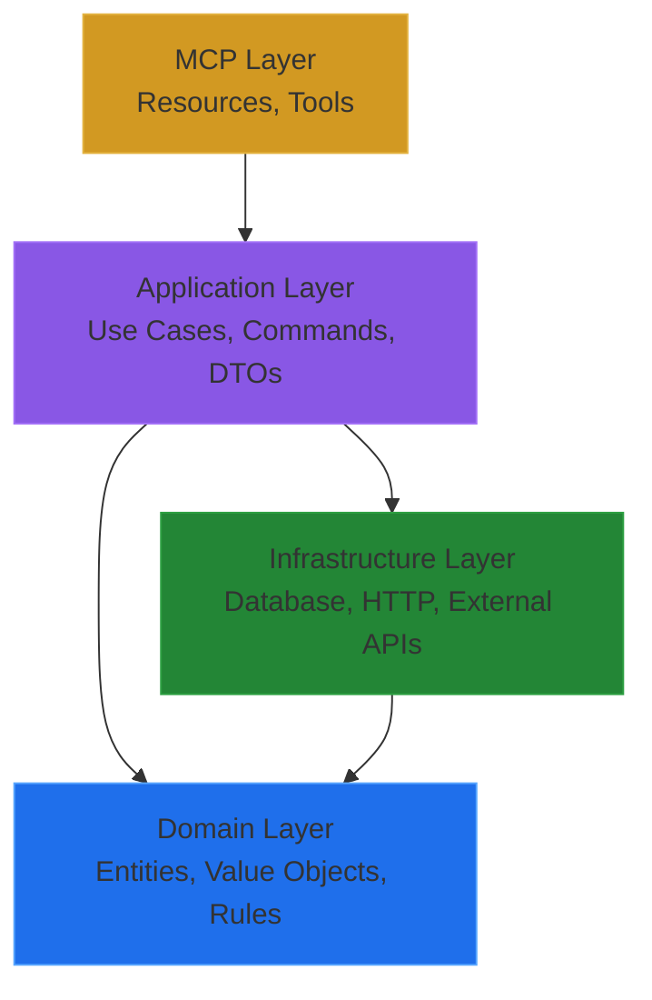

# Domain-Driven Design

## What is Domain-Driven Design?

**Domain-Driven Design (DDD)** is an approach to software development that emphasizes deep understanding of the business domain and places domain logic at the center of the application architecture. Rather than organizing code around technical concerns (databases, APIs, UI), DDD organizes code around business concepts and rules.

### Core Philosophy

DDD is built on three fundamental principles:

1. **Ubiquitous Language**: Developers and domain experts speak the same language. Terms like "Project," "Issue," "Status Transition," and "Dependency" mean the same thing in conversations, code, and documentation.

2. **Domain Models**: Business concepts are represented as rich objects that encapsulate both data and behavior. A `Project` isn't just a data containerit enforces business rules like "Cannot add issues to archived project."

3. **Bounded Contexts**: The system is divided into cohesive boundaries where models have clear, consistent meanings. CycleTime's core domain (projects, issues, workflows) is separate from infrastructure concerns (databases, HTTP, serialization).

## Why Does CycleTime Use DDD?

### Business Logic Complexity

Project orchestration involves complex rules and relationships:
- Issue hierarchies (Epic ’ Story ’ Subtask)
- Status transition validation
- Dependency cycle prevention
- Workflow state machines

**DDD keeps this complexity manageable** by encapsulating rules within domain entities where they're easy to understand, test, and maintain.

### Long-Term Maintainability

**Anemic models** (data containers with separate service classes) scatter business logic across the codebase, making it hard to find and modify rules.

**Rich domain models** (DDD approach) keep related logic together:

```kotlin
// L Anemic Model - Logic scattered
class Issue {
    var title: String
    var status: IssueStatus
}

class IssueService {
    fun validateStatusTransition(issue: Issue, newStatus: IssueStatus) {
        // Business logic far from data
    }
}

//  Rich Domain Model - Logic encapsulated
class Issue {
    private var status: IssueStatus

    fun updateStatus(newStatus: IssueStatus) {
        validateTransition(newStatus)  // Rule enforced here
        this.status = newStatus
    }

    private fun validateTransition(newStatus: IssueStatus) {
        // Business rule lives with the data
    }
}
```

### Testability

Domain entities with no infrastructure dependencies are **trivially easy to test**:

```kotlin
class IssueTest : StringSpec({
    "should reject invalid status transitions" {
        val issue = Issue.create(
            title = "Test Issue",
            description = "Description",
            type = IssueType.Story
        )

        issue.updateStatus(IssueStatus.Todo)      // Valid: Backlog ’ Todo
        shouldThrow<InvalidTransitionException> {
            issue.updateStatus(IssueStatus.Done)  // Invalid: must go through InProgress
        }
    }
})
```

No mocks, no database, no HTTPjust pure business logic testing.

### Team Communication

When domain experts and developers use the same terms with the same meanings, **communication is precise and unambiguous**. The code becomes documentation:

```kotlin
// Domain expert: "An epic cannot be a child of another epic"
// Developer writes:
fun setParent(parentType: IssueType) {
    if (this.type == IssueType.Epic && parentType == IssueType.Epic) {
        throw HierarchyViolationException("Epic cannot be child of epic")
    }
}
```

## Key Principles Applied in CycleTime

### Rich Domain Entities

**Entities are not just data holders**they enforce invariants and business rules.

**Project Entity**:
- Validates project name length
- Enforces "Cannot add issues to archived project"
- Manages issue collection consistency

**Issue Entity**:
- Validates hierarchy rules (Epic ’ Story ’ Subtask)
- Enforces status transition constraints
- Prevents circular dependencies

**Workflow Entity**:
- Manages state machine transitions
- Validates allowed stage progressions
- Tracks workflow completion

### Value Objects for Type Safety

**Value Objects** wrap primitive types to add meaning and validation:

```kotlin
// L Weak typing - Easy to make mistakes
fun findIssue(id: String): Issue?              // Which string? UUID? Key?
fun associateIssue(projectId: String, issueId: String)  // Easy to swap arguments

//  Strong typing - Compiler prevents mistakes
fun findIssue(id: IssueId): Issue?
fun associateIssue(projectId: ProjectId, issueId: IssueId)  // Cannot swap arguments
```

Value Objects enforce validation:

```kotlin
class ProjectId private constructor(val value: String) {
    init {
        require(value.isNotBlank()) { "Project ID cannot be blank" }
        require(isValidUUID(value)) { "Project ID must be valid UUID" }
    }

    companion object {
        fun generate() = ProjectId(UUID.randomUUID().toString())
    }
}
```

### Repository Pattern Abstracts Persistence

**Repositories provide domain-friendly interfaces** to data storage without leaking infrastructure concerns:

```kotlin
// Domain layer defines what it needs
interface ProjectRepository {
    suspend fun findById(id: ProjectId): Project?
    suspend fun save(project: Project)
    suspend fun delete(id: ProjectId): Boolean
}

// Infrastructure layer implements it
class H2ProjectRepository(
    private val database: Database,
    private val timeProvider: TimeProvider
) : ProjectRepository {
    // H2-specific implementation hidden from domain
}
```

Domain code works with `ProjectRepository` interfaceit never knows if data comes from H2, PostgreSQL, or a test fake.

### Layered Architecture Enforces Boundaries



**Dependencies flow inward**:
- MCP layer depends on Application layer
- Application layer depends on Domain layer
- Infrastructure layer depends on Domain layer (through interfaces)
- Domain layer depends on nothing (pure business logic)

This structure ensures **domain logic remains pure and testable** without infrastructure entanglement.

## Common Misconceptions

### Misconception: "DDD is only for large, complex systems"

**Reality**: DDD principles scale down effectively. Even simple domains benefit from rich models, ubiquitous language, and clear boundaries. The overhead is minimal compared to the clarity gained.

### Misconception: "DDD requires complex frameworks"

**Reality**: CycleTime implements DDD with plain Kotlin classes and standard language features. No special frameworks requiredjust clear thinking about domain concepts.

### Misconception: "DDD means no anemic models ever"

**Reality**: Simple data transfer objects (DTOs) at system boundaries are fine. DDD focuses on the **domain layer**, not infrastructure or presentation layers.

### Misconception: "Repositories must use ORMs"

**Reality**: Repositories are an abstraction. The implementation can use Exposed ORM, JDBC, REST APIs, or in-memory storage. The domain doesn't care.

## DDD in CycleTime Architecture

### Domain Layer (Pure Business Logic)

**No Dependencies**: Domain entities have no knowledge of databases, HTTP, or frameworks.

**Components**:
- **Entities**: `Project`, `Issue`, `Workflow`
- **Value Objects**: `ProjectId`, `IssueId`, `IssueStatus`
- **Repository Interfaces**: `ProjectRepository`, `IssueRepository`
- **Domain Services**: Complex logic spanning multiple entities

### Application Layer (Use Case Orchestration)

**Coordinates domain and infrastructure** without containing business rules.

**Components**:
- **Application Services**: `ProjectApplicationService`
- **Commands**: `CreateProjectCommand`, `UpdateIssueCommand`
- **Unit of Work**: Transaction coordination
- **DTOs**: Data transfer at boundaries

### Infrastructure Layer (Technical Implementation)

**Implements interfaces defined by domain** without affecting domain logic.

**Components**:
- **Repository Implementations**: `H2ProjectRepository`, `H2IssueRepository`
- **Database Access**: Exposed ORM, connection pooling
- **External Integrations**: Linear API, GitHub API

### MCP Layer (Claude Code Integration)

**Exposes domain capabilities** through Model Context Protocol.

**Components**:
- **MCP Resources**: Project context, dependency graphs
- **MCP Tools**: CRUD operations, workflow actions

## Benefits Realized

### Testability

Domain entities test in isolation, no database or HTTP required. Tests run in milliseconds.

### Refactoring Safety

Business rules are encapsulated in entities. Refactoring infrastructure (database migration, API changes) doesn't affect domain logic.

### Team Alignment

Developers and domain experts speak the same language. Code mirrors conversations.

### Maintainability

Related logic stays together. Finding and modifying business rules is straightforward.

### Flexibility

Swapping infrastructure (SQLite ’ H2, adding Linear integration) requires no domain changes.

## Related Concepts

- [Domain Entities](../domain-model/domain-entities.md) - How to implement entities in practice
- [Value Objects](../domain-model/value-objects.md) - Strong typing with value objects
- [Repository Pattern](../domain-model/repository-pattern.md) - Data access abstraction
- [Unit of Work](../domain-model/unit-of-work.md) - Transaction management

## Next Steps

- **Understand entities**: Read [Domain Entities](../domain-model/domain-entities.md) for implementation guidance
- **Learn value objects**: See [Value Objects](../domain-model/value-objects.md) for type safety patterns
- **Explore repositories**: Review [Repository Pattern](../domain-model/repository-pattern.md) for data access design
- **Study the architecture**: Read [CycleTime Architecture](../../architecture/overview.md) for complete system design
