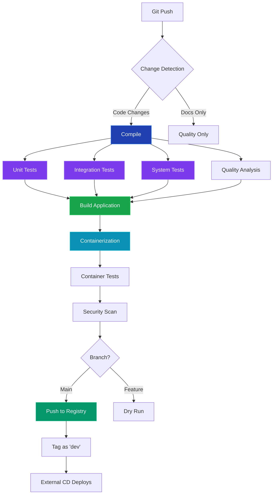
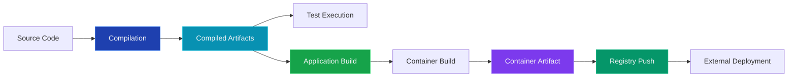
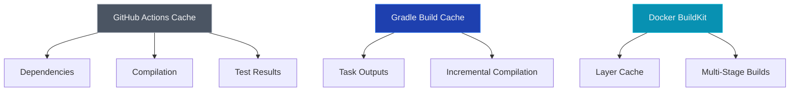

# CI/CD Pipeline Architecture

## What is Our CI/CD Pipeline?

CycleTime employs a CI/CD pipeline with compile-first architecture, caching, parallel execution, and build skipping to reduce feedback time and resource consumption. The pipeline validates every commit through automated quality gates before deployment.

## Pipeline Philosophy

Our CI/CD system is built on several core principles:

1. **Compile-First Architecture**: Separate compilation from execution to enable artifact reuse
2. **Build Skipping**: Skip unnecessary work when only documentation changes
3. **Caching Strategy**: Multi-layer caching across dependencies, compilation, and test results
4. **Parallel Execution**: Job parallelization for throughput
5. **Fail-Fast Strategy**: Quick feedback on critical issues while preserving test coverage

## Why This Approach?

### Continuous Delivery Benefits

- **Fast Feedback**: 10-20 minutes from commit to deployment readiness
- **Quality Gates**: All changes validated before reaching users
- **Zero Manual Steps**: Fully automated from commit to dev deployment
- **Rollback Capability**: Every version immutably tagged for instant rollback

### Resource Optimization

- **Smart Change Detection**: Skip builds for documentation-only changes
- **Artifact Reuse**: Compile once, use across all test suites
- **Parallel Testing**: Unit, integration, and system tests run simultaneously
- **Layer Caching**: Docker builds reuse unchanged layers

## Pipeline Flow

### High-Level Workflow

### Pipeline Stages

1. **Compile Stage**: Build all source and test code once
2. **Test Stage**: Parallel execution of unit, integration, and system tests
3. **Quality Stage**: Static analysis and code quality checks
4. **Build Stage**: Create deployable application artifacts
5. **Container Stage**: Build and test container image
6. **Security Stage**: Vulnerability scanning
7. **Deploy Stage**: Publish and deploy to environments

## Artifact Flow

**Build Once, Use Everywhere**: 
- Compilation happens once in the compile job
- Compiled artifacts uploaded to GitHub Actions
- All subsequent jobs download and reuse artifacts
- Container built once, tested, then published

## Key Concepts

### Smart Change Detection

The pipeline analyzes changed files to determine if testing is needed:
- **Documentation changes**: Skip compilation and tests
- **Code changes**: Full pipeline execution
- **Configuration changes**: Full pipeline with cache invalidation

### Multi-Layer Caching

1. **GitHub Actions Cache**: Persistent across workflow runs
2. **Gradle Build Cache**: Task output and compilation cache
3. **Docker BuildKit**: Container layer caching

### Parallel Test Execution

Tests run in parallel with specialized configurations:

| Test Type | Runtime Target | Parallelization | Memory | Coverage |
|-----------|---------------|-----------------|--------|----------|
| **Unit** | < 2 min | Max CPU | 512MB | Yes (separate) |
| **Integration** | < 5 min | Conservative (2 threads) | 1GB | Yes (separate) |
| **System** | < 10 min | Sequential | 2GB | No |

Coverage reports are collected separately and merged by Codecov.

### Fail-Fast Strategy

- **Critical failures**: Cancel dependent jobs immediately
- **Test failures**: Continue other test suites for complete feedback
- **Security failures**: Block deployment but show all issues
- **Quality failures**: Warning only, doesn't block

## Environment Deployment

### Automatic Dev Deployment

Every successful main branch build:
1. Tagged with mutable `dev` tag
2. Pushed to GitHub Container Registry
3. External CD system detects tag change
4. Automatically deploys to dev environment

### Manual Promotions

- **Staging**: Manual promotion from dev using workflow
- **Production**: Manual approval after staging validation

## Success Criteria

The pipeline considers a build successful when:

- ✅ All test suites pass
- ✅ Code quality checks pass
- ✅ Security scan passes (CVSS < 7.0)
- ✅ Container builds and passes smoke tests
- ✅ All artifacts created and validated

## Performance Characteristics

### Build Time Targets

- **Documentation-only changes**: < 2 minutes (skipped testing)
- **Code changes with cache hits**: 10-15 minutes
- **Full builds (cache miss)**: 15-25 minutes
- **Average PR feedback time**: < 12 minutes

### Resource Utilization

- **Parallel job execution**: Up to 5 concurrent jobs
- **GitHub Actions runners**: 2 CPU cores, 7GB RAM per job
- **Artifact storage**: 7-day retention for container images
- **Cache efficiency**: ~60% cache hit rate on average

## Related Documentation

- [Release Process Guide](../../guides/operations/release-process-guide.md) - How releases are created
- [Environment Concept](./environment-concept.md) - Understanding deployment environments
- [Concurrency Control Spec](../../reference/cicd/concurrency-control-spec.md) - Pipeline concurrency rules
- [Container Tagging Spec](../../reference/cicd/container-tagging-spec.md) - How containers are tagged
