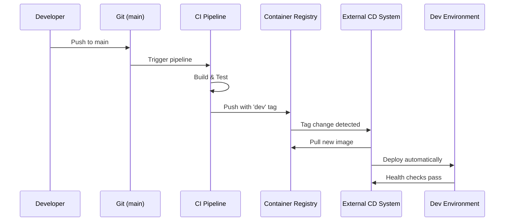
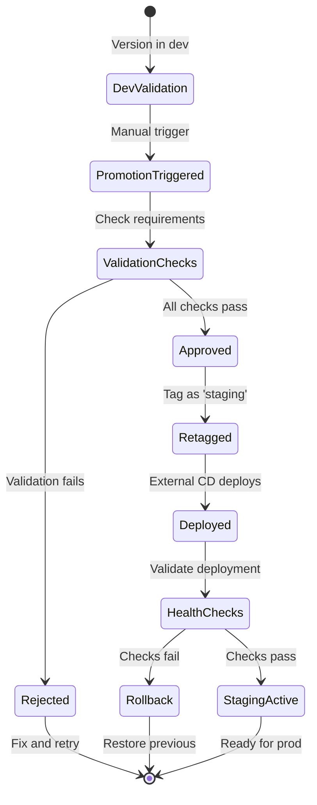
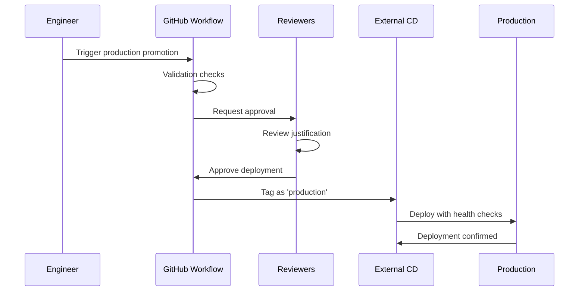

# Environment Architecture

## What Are Our Environments?

CycleTime uses a three-tier environment strategy with automatic dev deployments and manual promotion gates for staging and production. Each environment serves a specific purpose in the software delivery lifecycle.

## Environment Hierarchy


## Development Environment

### Purpose

The development environment prioritizes rapid feedback and debugging capabilities over production-like conditions. This allows developers to quickly validate changes without approval gates or production constraints.

### Characteristics

- **Latest Code**: Always reflects the current main branch
- **Debug Logging**: Verbose logging enabled for troubleshooting
- **Development Database**: Isolated database with test data
- **No Approval**: Automatic deployment on every main push
- **Rapid Iteration**: Changes deployed within 5 minutes

### Deployment Workflow



**Key Properties**:
- **Trigger**: Every push to main branch
- **Container Tag**: `ghcr.io/spiralhouse/cycletime:dev` (mutable)
- **Deployment**: Automatic via external CD system
- **Rollback**: Automatic on health check failure

### When to Use

- **Feature Validation**: Test new features before staging
- **Integration Testing**: Verify component interactions
- **Quick Experiments**: Try changes without formal process
- **Debugging**: Investigate issues with full logging

## Staging Environment

### Purpose

Staging mirrors production configuration to validate changes in a production-like environment before customer exposure. It uses a subset of production data to enable realistic testing while protecting sensitive information.

### Characteristics

- **Production-Like**: Mirrors prod configuration and infrastructure
- **Production Data Subset**: Realistic data for testing
- **Performance Monitoring**: Full observability stack enabled
- **Integration Testing**: External service integration validation
- **Manual Promotion**: Requires explicit promotion from dev

### Promotion Process



**Promotion Requirements**:
- Version must exist in container registry
- Version must be deployed to dev first
- All CI/CD checks must have passed
- Minimum dev deployment time met (default: 2 hours)

**Key Properties**:
- **Trigger**: Manual promotion workflow
- **Container Tag**: `ghcr.io/spiralhouse/cycletime:staging` (mutable)
- **Deployment**: Automatic after promotion
- **Rollback**: Manual or automatic on failure

### When to Use

- **Pre-Production Testing**: Final validation before prod
- **QA Validation**: Comprehensive testing by QA team
- **Stakeholder Demos**: Show features to stakeholders
- **Performance Testing**: Validate performance at scale

## Production Environment

### Purpose

Production requires the highest level of reliability and observability. The environment includes redundancy, comprehensive monitoring, and rollback capabilities to ensure zero-downtime deployments and rapid incident response.

### Characteristics

- **High Availability**: Redundant infrastructure
- **Full Monitoring**: Comprehensive metrics and alerting
- **Backup & DR**: Disaster recovery capabilities
- **Zero-Downtime**: Blue-green deployment strategy
- **Manual Approval**: Requires explicit approval from authorized users

### Approval Workflow



**Approval Requirements**:
- Must be currently deployed to staging
- Minimum staging time met (default: 24 hours)
- Deployment justification provided
- Required reviewer approval (minimum 1)
- No critical issues reported in staging

**Key Properties**:
- **Trigger**: Manual approval workflow
- **Container Tag**: `ghcr.io/spiralhouse/cycletime:latest` or version tag
- **Deployment**: Blue-green with manual traffic switch
- **Rollback**: Immediate rollback capability

### When to Use

- **Customer Releases**: Deploy features to users
- **Security Patches**: Critical security updates
- **Bug Fixes**: Important bug fixes
- **Performance Improvements**: Validated optimizations

## Environment Promotion Flow

### Normal Flow

```
1. Development → Automatic deployment from main
2. Staging → Manual promotion after dev validation
3. Production → Manual approval after staging validation
```

### Fast-Track (Emergency)

```
1. Development → Automatic deployment
2. Staging → Reduced minimum time (can be 0)
3. Production → Expedited approval with justification
```

## Container Registry Structure

All environments pull from GitHub Container Registry:

```
ghcr.io/spiralhouse/cycletime:
├── dev                # Current dev deployment (mutable)
├── staging            # Current staging deployment (mutable)
├── latest             # Latest production (mutable)
├── 1.2.3              # Specific version (immutable)
├── sha-abc123         # Commit-specific (immutable)
└── 1.2.3-staging-...  # Timestamped promotion (immutable)
```

## Monitoring and Health Checks

### Health Endpoints

Each environment exposes standard health endpoints:

```bash
# Development
curl https://dev.cycletime.example.com/health

# Staging
curl https://staging.cycletime.example.com/health

# Production
curl https://api.cycletime.example.com/health
```

### Monitoring Metrics

- **Response times**: P50, P95, P99 latencies
- **Error rates**: 4xx and 5xx error percentages
- **Resource usage**: CPU, memory, disk utilization
- **Business metrics**: Active users, requests/sec

### Alerting Thresholds

| Metric | Dev | Staging | Production |
|--------|-----|---------|------------|
| **Error Rate** | No alert | > 5% | > 1% |
| **Latency (P95)** | No alert | > 500ms | > 200ms |
| **Health Check** | Failure | Failure | Failure |
| **Memory** | No alert | > 80% | > 70% |

## Rollback Procedures

### Development

```bash
# Automatic rollback on failure, or revert commit
git revert HEAD && git push
```

### Staging

```bash
# Re-promote previous working version
# Use promotion workflow with last known good version
```

### Production

```bash
# Blue-green switch to previous version
# Or use rollback command in deployment system
```

## Environment Protection

### Branch Protection

- **main**: Protected, requires PR approval
- **staging**: Protected, requires staging tests
- **production**: Tags only, requires approval

### Secret Management

- GitHub Secrets for CI/CD
- Environment-specific secrets isolated
- Rotation policy enforced
- No secrets in container images

## Related Documentation

- [Deployment to Staging Guide](../../guides/operations/deployment-to-staging.md) - How to promote to staging
- [Production Deployment Guide](../../guides/operations/production-deployment.md) - Production approval process
- [Environment Specifications](../../reference/cicd/environment-specifications.md) - Technical specifications
- [CI/CD Pipeline Concept](./cicd-pipeline-concept.md) - Understanding the pipeline
