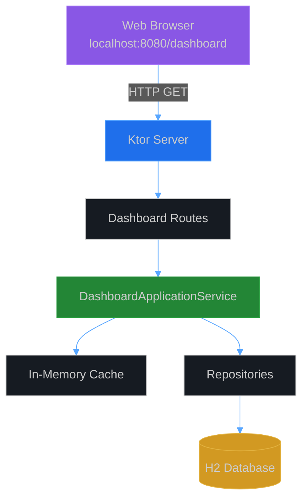
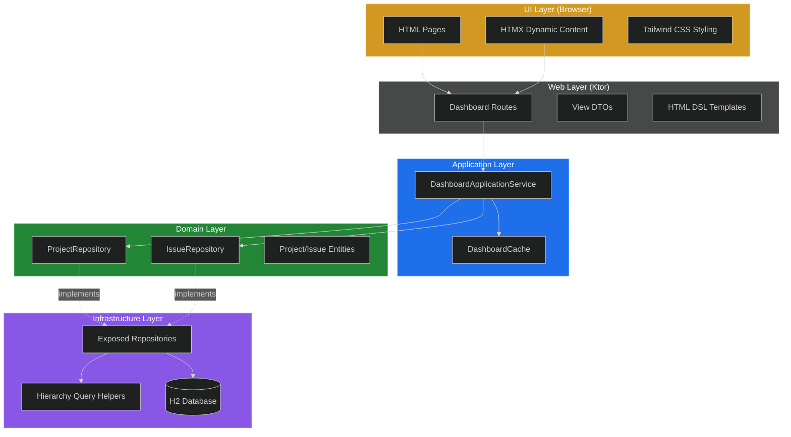

# CycleTime Dashboard Architecture

## Overview

The CycleTime Dashboard provides a view-only web interface for exploring project hierarchies through a localhost-accessible web application. This document explains the architectural concepts and design decisions behind the dashboard implementation.

## Key Architectural Decisions

**Frontend Strategy**: HTMX + Tailwind CSS for modern UX without heavy JavaScript
**Backend Framework**: Ktor routes with dedicated DashboardApplicationService
**Rendering Approach**: Server-side HTML generation using Ktor HTML DSL
**Caching Strategy**: In-memory LRU cache with smart invalidation
**Scope**: View-only (no modifications in initial release)

## System Context



The dashboard operates as a read-only view into the CycleTime database, accessed through a standard web browser. All rendering happens server-side, with HTMX providing progressive enhancement for dynamic interactions.

## Component Architecture

The dashboard follows the existing DDD layered architecture pattern established in CycleTime:



### Layer Responsibilities

**UI Layer**: Browser-rendered HTML with progressive enhancement via HTMX. No complex JavaScript framework required.

**Web Layer**: Ktor HTTP routes, view DTOs, and HTML template rendering using kotlinx.html DSL.

**Application Layer**: Orchestrates business operations through DashboardApplicationService, handles caching strategy.

**Domain Layer**: Provides access to domain entities through repository interfaces. No dashboard-specific logic here.

**Infrastructure Layer**: Database queries optimized for hierarchical data retrieval. Uses Exposed ORM for type-safe SQL.

## Why HTMX + Tailwind?

This technology choice represents a deliberate architectural decision based on several factors:

### 1. Server-Driven Architecture Alignment

HTMX enables a server-driven UI architecture that fits naturally with Ktor's strengths:

- Server-side rendering leverages Kotlin's type safety
- No client-side state management complexity
- Backend developers can build full-stack features
- Reduced impedance mismatch between backend and frontend

### 2. Minimal JavaScript Complexity

Heavy JavaScript frameworks (React, Vue, Angular) introduce significant overhead:

- Build toolchain complexity
- State management libraries
- Client-server synchronization logic
- Large bundle sizes affecting performance

HTMX provides dynamic interactions with ~14KB compressed, dramatically simplifying the frontend stack.

### 3. Progressive Enhancement Philosophy

The dashboard works without JavaScript and enhances when available:

- Base functionality: Full page navigation
- Enhanced: HTMX dynamic content loading
- Graceful degradation for accessibility

### 4. Developer Experience Benefits

**For Kotlin developers**: Familiar HTML-centric development using kotlinx.html DSL means no context switching to JavaScript/TypeScript.

**For full-stack work**: Single-language development reduces cognitive load.

**For maintenance**: Fewer moving parts, less toolchain brittleness.

### 5. Performance Characteristics

Small bundle sizes improve initial page load:

- HTMX: ~14KB compressed
- Tailwind CSS: ~3KB compressed (when purged)
- No framework runtime overhead
- Server-side rendering means faster time-to-interactive

### 6. Future Extensibility

HTMX makes adding interactivity straightforward:

- **Filtering**: Load filtered results without page reload
- **Search**: Incremental search with live results
- **Real-time Updates**: SSE integration for live data
- **Optimistic UI**: Client-side updates with server validation

## Data Flow Architecture

### Read Path (Typical Request)

```
1. Browser requests /dashboard/projects/{id}
2. Ktor route extracts projectId parameter
3. DashboardApplicationService checks cache
4. Cache miss → Query repositories for project + issues
5. Map domain entities to view DTOs
6. Build hierarchical structure in memory
7. Pass DTOs to HTML DSL template
8. Render HTML with Tailwind styling
9. Cache result for future requests
10. Return HTTP 200 with HTML response
```

### Cache Invalidation Path

```
1. MCP tool modifies project/issue via domain service
2. Domain service emits domain event (future)
3. Dashboard service invalidates related cache keys
4. Next request fetches fresh data from database
```

## Hierarchical Data Strategy

The dashboard displays three-level issue hierarchies:

**Level 1**: Projects (entry point)
**Level 2**: Epics → Stories (loaded on project detail)
**Level 3**: Subtasks (lazy-loaded via HTMX)

### Query Optimization Approach

**Problem**: Naive implementation causes N+1 queries when traversing hierarchy.

**Solution**: Batch loading strategy

```kotlin
// Single query fetches ALL issues for project
val allIssues = issueRepository.findByProject(projectId)

// In-memory grouping (fast, no additional queries)
val epics = allIssues.filter { it.type == IssueType.EPIC }
val stories = allIssues.filter { it.type == IssueType.STORY }
val subtasks = allIssues.filter { it.type == IssueType.SUBTASK }

// Build hierarchy from in-memory collections
// Result: 1 database query instead of 1 + N + M
```

This approach trades a slightly larger initial query for zero subsequent queries during hierarchy construction.

## Caching Architecture

### Cache Design Rationale

**Why cache?** Dashboard is read-heavy with infrequent writes. Caching prevents redundant database queries.

**Why in-memory?** Simple, fast, sufficient for localhost deployment. No external cache server needed.

**Why TTL-based?** Simple invalidation strategy. 5-minute TTL balances freshness with performance.

### Cache Key Strategy

```
projects:all                      → List of all projects
project:{id}:hierarchy            → Full project hierarchy
story:{id}:subtasks              → Subtasks for specific story
```

### Invalidation Strategy

**On project modification**: Invalidate `projects:all` and `project:{id}:hierarchy`

**On issue modification**: Invalidate parent project hierarchy and related story subtasks

**Pattern matching**: Support wildcard patterns like `story:*:subtasks` for bulk invalidation

## Security Architecture

### Localhost-Only Access

Dashboard binds exclusively to `127.0.0.1` (localhost):

```kotlin
embeddedServer(CIO, port = 8080, host = "127.0.0.1") {
    // Only accessible from same machine
}
```

**Rationale**: Initial release focuses on local development use. No authentication needed.

**Future**: Add authentication/authorization when exposing remotely.

### XSS Prevention

Ktor HTML DSL provides automatic HTML escaping:

```kotlin
div {
    +userInput  // Automatically escaped
}

div {
    unsafe { raw(trustedHTML) }  // Explicitly marked as unsafe
}
```

**View-only scope**: No user input in initial release reduces XSS surface area.

### CSRF Protection

**Not required**: View-only dashboard performs no state modifications.

**Future**: Add CSRF tokens when implementing edit functionality.

## Performance Architecture

### Lazy Loading Strategy

**Initial load**: Projects list only (lightweight overview)
**Project detail**: Epic → Story hierarchy (2 levels deep)
**Subtasks**: Lazy-loaded via HTMX on user expand action (3rd level)

**Benefit**: Reduces initial page payload by ~70% for large projects with many subtasks.

### Database Indexing

Required indexes for efficient hierarchy queries:

```sql
CREATE INDEX idx_issues_project_id ON issues(project_id);
CREATE INDEX idx_issues_parent_id ON issues(parent_id);
CREATE INDEX idx_issues_type ON issues(type);
```

These indexes enable fast filtering by project, parent relationship, and issue type.

## Scalability Considerations

### Current Design Limits

**Target scale**: Up to 1000 issues per project
**Cache size**: Up to 100 cached responses
**Concurrent users**: Designed for single developer (localhost)

### Future Scalability Paths

**For larger projects**: Implement pagination or virtual scrolling
**For remote access**: Add authentication, rate limiting, connection pooling
**For high concurrency**: Consider distributed cache (Redis) and horizontal scaling

## Architecture Trade-offs

### Chosen Trade-offs

**Server-side rendering** over client-side: Simpler architecture, better initial load, less JavaScript complexity
**In-memory caching** over distributed cache: Sufficient for localhost, eliminates external dependencies
**TTL-based invalidation** over event-driven: Simpler implementation, acceptable staleness for view-only use
**HTMX** over full framework: Smaller bundle, progressive enhancement, less frontend complexity

### Accepted Limitations

**Not real-time**: 5-minute cache TTL means data may be stale
**Localhost only**: Requires authentication before remote access
**View-only**: Editing requires MCP tools in separate session
**Modern browsers**: Requires JavaScript for enhanced experience

## Related Documentation

### Implementation Patterns

- [Dashboard DTO Mapping Pattern](../../patterns/dashboard/dashboard-dto-mapping-pattern.md) - DTO design and mapping strategies
- [Dashboard API Reference](../../reference/dashboard/dashboard-api-reference.md) - HTTP endpoints and routing
- [HTMX Patterns](../../patterns/ui/htmx-patterns.md) - Progressive enhancement patterns
- [Tailwind Design System](../../patterns/ui/tailwind-design-system.md) - Visual design tokens

### Implementation Guides

- [Dashboard Implementation Guide](../../guides/dashboard/dashboard-implementation-guide.md) - Step-by-step implementation phases
- [Dashboard Testing Guide](../../guides/dashboard/dashboard-testing-guide.md) - Testing strategies

### Technology References

- [Dashboard Technology Stack](../../reference/dashboard/dashboard-technology-stack-reference.md) - Complete technology specifications
- [Project Fundamentals](../../reference/project-fundamentals.md) - CycleTime architecture basics

## Summary

The CycleTime Dashboard architecture prioritizes simplicity, performance, and maintainability through:

- Server-driven UI with progressive enhancement via HTMX
- Clean layered architecture following DDD principles
- Optimized hierarchical queries with batch loading
- Simple TTL-based caching for read-heavy operations
- Type-safe server-side rendering with Kotlin

This architecture provides a solid foundation for a view-only dashboard while maintaining alignment with CycleTime's existing architectural patterns.
