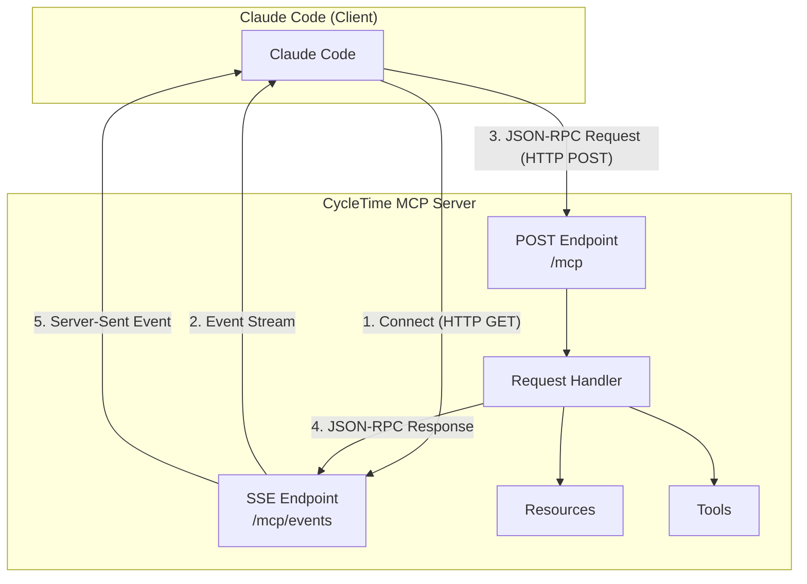
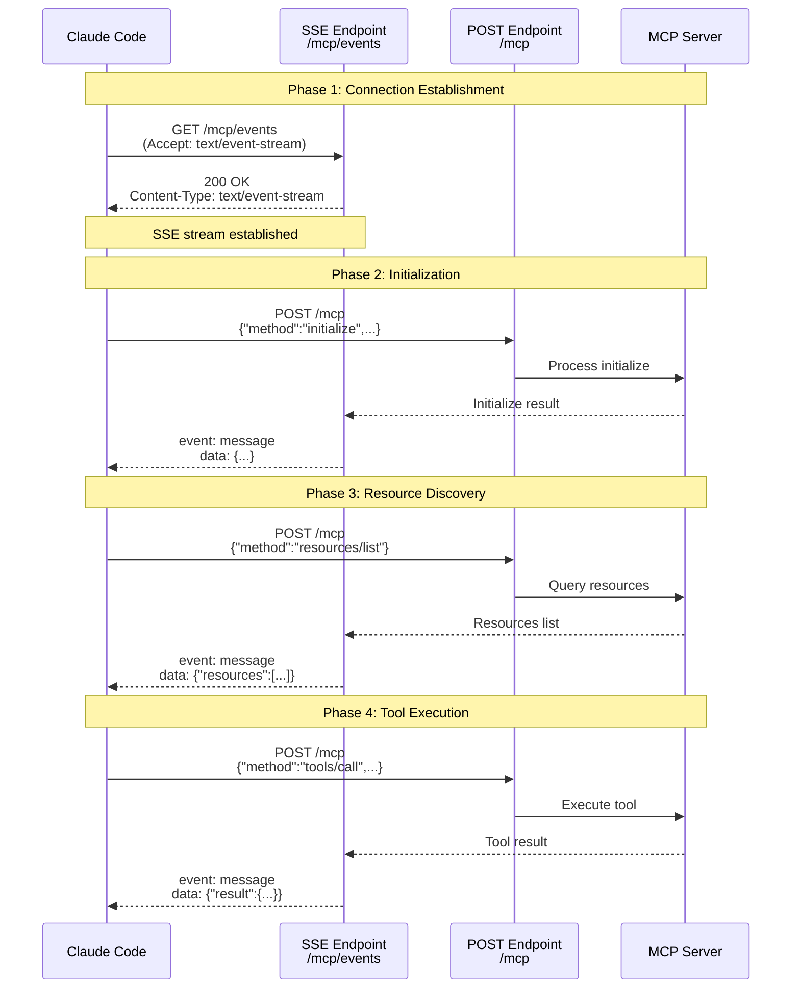
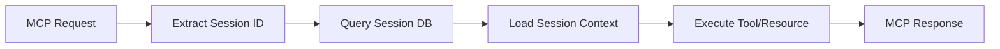

# MCP Protocol Concepts

## What is Model Context Protocol (MCP)?

Model Context Protocol (MCP) is an open protocol that enables seamless integration between AI assistants and development tools. MCP provides a standardized way for AI systems like Claude Code to access project data, execute operations, and interact with development workflows.

### Why MCP for CycleTime?

CycleTime uses MCP to expose project orchestration capabilities to Claude Code:

- **Structured Access**: Claude Code can query projects, issues, and workflows through standardized resources
- **Tool Execution**: Claude Code can create, update, and manage project entities through MCP tools
- **Workflow Integration**: Predefined prompts guide Claude Code through common development workflows
- **Session Continuity**: MCP maintains session state across Claude Code interactions

## Core Concepts

MCP is built on three fundamental primitives that enable AI-tool integration:

### Resources

**Resources** are read-only data exposed to Claude Code. They represent the current state of project data.

**Characteristics**:
- Read-only (no mutations)
- URI-based addressing (e.g., `cycletime://projects/{id}`)
- JSON representation
- Collection and individual resource patterns

**Examples in CycleTime**:
- `cycletime://projects` - List of all projects
- `cycletime://projects/{id}` - Individual project details
- `cycletime://issues` - List of all issues
- `cycletime://sessions/active` - Current active session

**Use Cases**:
- Querying current project state
- Reading issue details
- Accessing workflow configurations
- Retrieving session context

### Tools

**Tools** are executable functions Claude Code can invoke to perform operations. They represent actions that modify project state.

**Characteristics**:
- Execute operations (create, update, delete)
- Input schema validation
- Synchronous execution with result returns
- Idempotent where possible

**Examples in CycleTime**:
- `create_project` - Create a new project
- `update_issue` - Update issue properties
- `transition_workflow` - Move issue through workflow
- `create_session` - Start new development session

**Use Cases**:
- Creating new project entities
- Updating existing data
- Executing workflow transitions
- Managing development sessions

### Prompts

**Prompts** are pre-configured prompt templates for common workflows. They guide Claude Code through multi-step processes.

**Characteristics**:
- Reusable templates
- Parameter placeholders
- Context-aware
- Workflow orchestration

**Examples in CycleTime**:
- `start_feature` - Initialize new feature development
- `fix_bug` - Systematic bug resolution workflow
- `code_review` - Code review checklist and process
- `release_workflow` - Release preparation steps

**Use Cases**:
- Standardizing development workflows
- Guiding complex multi-step processes
- Ensuring consistency across sessions
- Reducing cognitive load

## MCP Protocol Architecture

### Dual Transport Model

MCP uses two complementary communication channels:



#### SSE (Server-Sent Events)

**Purpose**: Server-to-client unidirectional streaming

**How it works**:
1. Client opens persistent HTTP connection to `/mcp/events`
2. Server sends events as they occur
3. Connection remains open for continuous updates
4. Automatic reconnection on disconnect

**Used for**:
- Streaming MCP responses from server to client
- Server-initiated notifications
- Long-running operation updates
- Keep-alive heartbeats

#### POST Requests

**Purpose**: Client-to-server JSON-RPC commands

**How it works**:
1. Client sends HTTP POST to `/mcp`
2. Body contains JSON-RPC 2.0 request
3. Server processes synchronously
4. Response sent via SSE stream

**Used for**:
- Client-initiated requests (tools/list, resources/read, etc.)
- Tool execution commands
- Resource queries
- Protocol initialization

### Protocol Flow

Complete lifecycle of an MCP interaction:



### JSON-RPC 2.0 Message Format

MCP uses JSON-RPC 2.0 for all client-server communication:

**Request Format**:
```json
{
  "jsonrpc": "2.0",
  "id": 1,
  "method": "tools/call",
  "params": {
    "name": "create_project",
    "arguments": {
      "name": "My Project",
      "description": "Project description"
    }
  }
}
```

**Response Format**:
```json
{
  "jsonrpc": "2.0",
  "id": 1,
  "result": {
    "id": "proj_abc123",
    "name": "My Project",
    "created": "2025-10-19T10:00:00Z"
  }
}
```

**Error Format**:
```json
{
  "jsonrpc": "2.0",
  "id": 1,
  "error": {
    "code": -32602,
    "message": "Invalid params: name is required"
  }
}
```

## Technology Stack

### Server-Side Dependencies

CycleTime MCP server implementation requires:

```kotlin
// build.gradle.kts
dependencies {
    // Ktor SSE support
    implementation("io.ktor:ktor-server-sse:3.3.0")
    implementation("io.ktor:ktor-server-content-negotiation:3.3.0")
    implementation("io.ktor:ktor-serialization-kotlinx-json:3.3.0")

    // MCP Kotlin SDK (official from Anthropic/JetBrains)
    implementation("io.modelcontextprotocol:kotlin-sdk:0.7.2")

    // Coroutines for async handling
    implementation("org.jetbrains.kotlinx:kotlinx-coroutines-core:1.7.3")

    // Serialization
    implementation("org.jetbrains.kotlinx:kotlinx-serialization-json:1.6.2")
}
```

### Client-Side (Claude Code)

Claude Code includes built-in MCP client support:
- Automatic SSE connection management
- JSON-RPC request handling
- Resource and tool discovery
- Error recovery and reconnection

## MCP Capabilities

### Resource Capabilities

What Claude Code can do with resources:

- **List**: Enumerate available resources
- **Read**: Fetch resource content by URI
- **Subscribe**: Receive updates when resources change (future)
- **Template**: Discover resource URI patterns

### Tool Capabilities

What Claude Code can do with tools:

- **List**: Discover available tools and their schemas
- **Call**: Execute tools with validated arguments
- **Progress**: Receive progress updates for long-running tools (future)
- **Cancel**: Abort in-progress tool execution (future)

### Prompt Capabilities

What Claude Code can do with prompts:

- **List**: Enumerate available prompt templates
- **Get**: Retrieve prompt template with context
- **Execute**: Render prompt with provided parameters

## Session Model

### Stateless Per-Request

Each MCP request is stateless at the protocol level:
- No server-side session state in MCP layer
- Each request contains complete context
- Authentication/authorization per request

### Session Context from Database

Application-level sessions managed separately:
- Session data persisted in database
- Session ID extracted from request headers
- Resources and tools access session context
- Enables cross-session continuity



## Design Principles

### 1. Separation of Concerns

- **MCP Layer**: Protocol handling, message parsing, SSE management
- **Application Layer**: Business logic, session management, validation
- **Domain Layer**: Core project entities and rules
- **Infrastructure Layer**: Database, external integrations

### 2. Testability

- Interfaces for all MCP components (resources, tools, prompts)
- Dependency injection for external dependencies
- Mock-friendly design
- Protocol-level and integration testing

### 3. Extensibility

- New resources added by implementing `MCPResource` interface
- New tools added by implementing `MCPTool` interface
- Plugin architecture for domain-specific capabilities
- No core protocol changes required

### 4. Performance

- Async/await for non-blocking operations
- SSE for efficient streaming
- Resource caching where appropriate
- Database connection pooling

## MCP vs REST API

Understanding when to use MCP vs traditional REST:

| Aspect | MCP | REST API |
|--------|-----|----------|
| **Purpose** | AI assistant integration | General API access |
| **Transport** | SSE + POST (dual channel) | HTTP Request/Response |
| **Data Model** | Resources, Tools, Prompts | Endpoints with various semantics |
| **Discoverability** | Built-in (list resources/tools) | Requires documentation |
| **Client** | Claude Code, MCP-aware tools | Any HTTP client |
| **Session** | Database-backed continuity | Typically stateless |
| **Use Case** | AI-driven development workflows | Programmatic access, integrations |

**CycleTime provides both**:
- MCP server for Claude Code integration
- REST API for general programmatic access

## Next Steps

To implement MCP in CycleTime, explore these pattern documents:

1. **[SSE Transport Pattern](../../patterns/mcp/sse-transport-pattern.md)**
   - Implementing SSE endpoints in Ktor
   - Connection lifecycle management
   - Keep-alive and reconnection

2. **[JSON-RPC Pattern](../../patterns/mcp/json-rpc-pattern.md)**
   - Request/response handling
   - Error code mapping
   - Message validation

3. **[Session Integration Pattern](../../patterns/mcp/session-integration-pattern.md)**
   - Extracting session context from requests
   - Resource and tool implementation
   - Database integration

4. **[MCP Testing Pattern](../../patterns/mcp/mcp-testing-pattern.md)**
   - Testing SSE connections
   - Mock MCP clients
   - Integration testing strategies

## References

- [MCP Official Specification](https://modelcontextprotocol.io/) - Complete protocol specification
- [MCP Kotlin SDK](https://github.com/modelcontextprotocol/kotlin-sdk) - Official Kotlin SDK
- [JSON-RPC 2.0 Specification](https://www.jsonrpc.org/specification) - JSON-RPC protocol
- [Server-Sent Events (SSE)](https://developer.mozilla.org/en-US/docs/Web/API/Server-sent_events) - SSE standard
- [Ktor SSE Documentation](https://ktor.io/docs/server-sent-events.html) - Ktor SSE implementation

## Related Documentation

- [MCP Architecture Overview](../../architecture/overview.md#mcp-server-integration) - System architecture
- [MCP Troubleshooting](../../guides/troubleshooting/mcp/overview.md) - Common issues and solutions
- [MCP Development Guide](../../guides/development/mcp-development.md) - Development workflows
