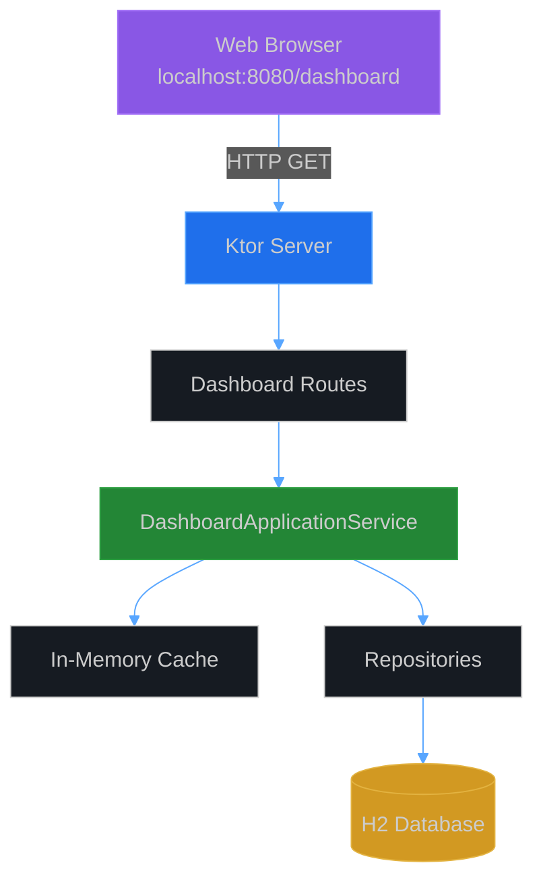
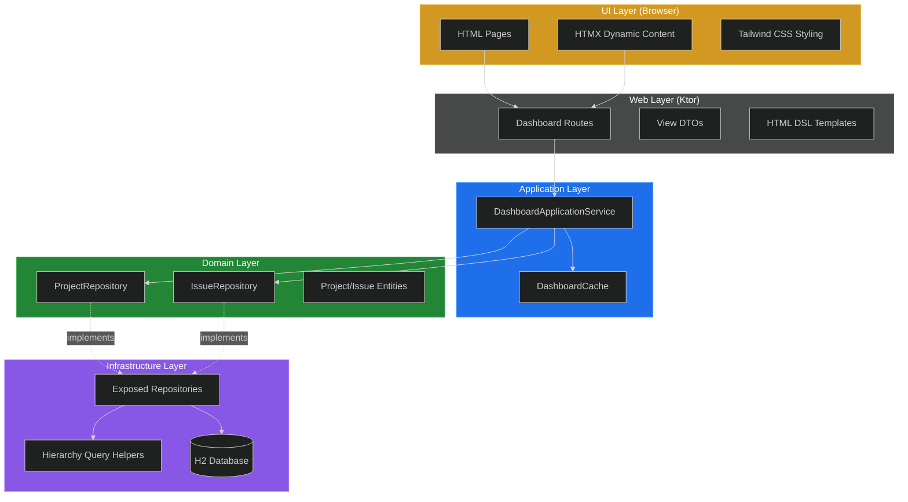

# SPI-690: CycleTime Dashboard Technical Design

**Version**: 1.0
**Date**: October 25, 2025
**Author**: Software Architect Agent

## Executive Summary

This document specifies the technical design for a view-only web dashboard that displays CycleTime project information through a localhost-only web interface. The dashboard provides hierarchical issue navigation (Projects → Epics/Stories → Subtasks) with modern styling matching the CycleTime marketing site.

**Key Decisions**:
- **Frontend**: HTMX + Tailwind CSS for modern UX without heavy JavaScript
- **Backend**: Ktor routes with dedicated DashboardApplicationService
- **Rendering**: Server-side HTML generation using Ktor HTML DSL
- **Caching**: In-memory LRU cache with smart invalidation
- **Scope**: View-only (no modifications in this iteration)

## 1. Architecture Overview

### 1.1 System Context



### 1.2 Component Architecture

The dashboard follows the existing DDD layered architecture:



## 2. Technology Stack

### 2.1 Frontend Stack

| Technology | Version | Purpose | Rationale |
|------------|---------|---------|-----------|
| **HTMX** | 1.9.x | Dynamic interactions | Minimal JS, server-driven, progressive enhancement |
| **Tailwind CSS** | 3.x | Styling framework | Matches marketing site, utility-first approach |
| **Ktor HTML DSL** | 3.3.1 | Server-side rendering | Type-safe, Kotlin-native, no build step |
| **Alpine.js** | 3.x (optional) | Light client-side state | Theme toggle, expand/collapse (if needed) |

**Why HTMX + Tailwind?**

1. **Server-Driven Architecture**: Fits naturally with Ktor and existing backend
2. **Minimal JavaScript**: Reduces complexity, improves maintainability
3. **Progressive Enhancement**: Works without JS, enhanced with JS
4. **Developer Experience**: Familiar HTML-centric development
5. **Performance**: Small bundle size (~14KB HTMX, ~3KB Tailwind compressed)
6. **Future-Ready**: Easy to add interactivity (filter, search, real-time updates)

**Implementation Resources**:

For detailed implementation patterns and examples, see:
- **[HTMX Patterns](../patterns/ui/htmx-patterns.md)** - Lazy loading, infinite scroll, optimistic UI, polling, and form validation patterns
- **[Tailwind Design System](../patterns/ui/tailwind-design-system.md)** - Complete CycleTime design tokens, component patterns, and responsive design
- **[Ktor HTML DSL Examples](../examples/ui/ktor-html-dsl-examples.md)** - Working code examples for components, HTMX integration, and testing

### 2.2 Backend Stack

| Component | Technology | Purpose |
|-----------|-----------|---------|
| **Web Framework** | Ktor 3.3.1 | HTTP routing and serving |
| **DI** | Ktor Native DI | Dependency injection |
| **Templating** | kotlinx.html | Type-safe HTML generation |
| **Caching** | Caffeine/Simple LRU | In-memory cache for read-heavy ops |
| **Database** | H2 + Exposed ORM | Data persistence (existing) |

### 2.3 Development Tools

- **No Build Step**: Use CDN for HTMX/Tailwind in development
- **Hot Reload**: Ktor development mode for auto-reload
- **Testing**: Kotest for unit/integration tests
- **API Testing**: Ktor test client for route testing

## 3. Data Model & DTOs

### 3.1 View DTOs

```kotlin
package io.spiralhouse.cycletime.dashboard.dto

import kotlinx.serialization.Serializable
import kotlinx.datetime.Instant

/**
 * Flattened project view optimized for dashboard display.
 * Includes computed statistics and hierarchical counts.
 */
@Serializable
data class ProjectViewDTO(
    val id: String,
    val name: String,
    val description: String?,
    val status: String,
    val epicCount: Int,
    val storyCount: Int,
    val totalIssues: Int,
    val createdAt: Instant,
    val updatedAt: Instant
)

/**
 * Hierarchical issue view with parent/child relationships.
 * Optimized for tree rendering without N+1 queries.
 */
@Serializable
data class IssueViewDTO(
    val id: String,
    val title: String,
    val description: String?,
    val type: String,
    val status: String,
    val parentId: String?,
    val projectId: String?,
    val estimate: Int?,
    val assigneeId: String?,
    val childCount: Int,
    val isBlocked: Boolean,
    val createdAt: Instant,
    val updatedAt: Instant
)

/**
 * Project hierarchy for single-page view.
 * Pre-loads epics and stories to minimize round trips.
 */
@Serializable
data class ProjectHierarchyDTO(
    val project: ProjectViewDTO,
    val epics: List<IssueHierarchyNode>,
    val orphanedStories: List<IssueHierarchyNode>
)

/**
 * Recursive structure for issue hierarchy display.
 */
@Serializable
data class IssueHierarchyNode(
    val issue: IssueViewDTO,
    val children: List<IssueHierarchyNode>
)

/**
 * Service health status for dashboard header.
 */
@Serializable
data class ServiceHealthDTO(
    val status: String, // "healthy" | "degraded" | "unhealthy"
    val database: String,
    val mcp: String?,
    val projectCount: Int,
    val issueCount: Int,
    val uptime: Long
)
```

### 3.2 DTO Mapping

```kotlin
package io.spiralhouse.cycletime.dashboard.mappers

import io.spiralhouse.cycletime.domain.entities.Project
import io.spiralhouse.cycletime.domain.entities.Issue
import io.spiralhouse.cycletime.dashboard.dto.*

/**
 * Maps domain entities to view DTOs.
 * Handles null safety and type conversions.
 */
object DashboardMapper {

    fun toProjectView(
        project: Project,
        epicCount: Int,
        storyCount: Int,
        totalIssues: Int
    ): ProjectViewDTO {
        return ProjectViewDTO(
            id = project.id.value.toString(),
            name = project.name,
            description = project.description,
            status = project.status.name,
            epicCount = epicCount,
            storyCount = storyCount,
            totalIssues = totalIssues,
            createdAt = project.createdAt,
            updatedAt = project.updatedAt
        )
    }

    fun toIssueView(
        issue: Issue,
        childCount: Int = 0
    ): IssueViewDTO {
        return IssueViewDTO(
            id = issue.id.value.toString(),
            title = issue.title,
            description = issue.description,
            type = issue.type.name,
            status = issue.status.name,
            parentId = issue.parentId?.value?.toString(),
            projectId = issue.projectId?.value?.toString(),
            estimate = if (issue.estimate.hasValue()) issue.estimate.value else null,
            assigneeId = issue.assigneeId,
            childCount = childCount,
            isBlocked = issue.isBlocked(),
            createdAt = issue.createdAt,
            updatedAt = issue.updatedAt
        )
    }

    fun toHierarchyNode(
        issue: Issue,
        children: List<Issue>
    ): IssueHierarchyNode {
        val childNodes = children.map { child ->
            // For dashboard, only go 2 levels deep (Epic -> Story -> Subtasks)
            // Stories show subtask count but don't pre-load them
            toHierarchyNode(child, emptyList())
        }

        return IssueHierarchyNode(
            issue = toIssueView(issue, children.size),
            children = childNodes
        )
    }
}
```

## 4. Application Service Layer

### 4.1 DashboardApplicationService

```kotlin
package io.spiralhouse.cycletime.application.services

import io.spiralhouse.cycletime.dashboard.dto.*
import io.spiralhouse.cycletime.dashboard.mappers.DashboardMapper
import io.spiralhouse.cycletime.domain.repositories.ProjectRepository
import io.spiralhouse.cycletime.domain.repositories.IssueRepository
import io.spiralhouse.cycletime.domain.valueobjects.ProjectId
import io.spiralhouse.cycletime.domain.valueobjects.IssueId
import io.spiralhouse.cycletime.domain.valueobjects.IssueType
import io.spiralhouse.cycletime.domain.services.TimeProvider
import kotlinx.datetime.Instant

/**
 * Application service for dashboard operations.
 *
 * Orchestrates data fetching, caching, and DTO transformation
 * for the web dashboard. Optimized for read-heavy hierarchical queries.
 */
class DashboardApplicationService(
    private val projectRepository: ProjectRepository,
    private val issueRepository: IssueRepository,
    private val cache: DashboardCache,
    private val timeProvider: TimeProvider
) {

    /**
     * Lists all projects with summary statistics.
     * Results are cached with 5-minute TTL.
     */
    suspend fun listProjects(): List<ProjectViewDTO> {
        return cache.getOrPut("projects:all") {
            val projects = projectRepository.findAll()

            projects.map { project ->
                val issues = issueRepository.findByProject(project.id)
                val epicCount = issues.count { it.type == IssueType.EPIC }
                val storyCount = issues.count { it.type == IssueType.STORY }

                DashboardMapper.toProjectView(
                    project = project,
                    epicCount = epicCount,
                    storyCount = storyCount,
                    totalIssues = issues.size
                )
            }
        }
    }

    /**
     * Gets full project hierarchy (Epics → Stories).
     * Subtasks are counted but not pre-loaded.
     */
    suspend fun getProjectHierarchy(projectId: String): ProjectHierarchyDTO? {
        return cache.getOrPut("project:$projectId:hierarchy") {
            val project = projectRepository.findById(ProjectId(projectId)) ?: return@getOrPut null
            val allIssues = issueRepository.findByProject(project.id)

            // Separate by type
            val epics = allIssues.filter { it.type == IssueType.EPIC }
            val stories = allIssues.filter { it.type == IssueType.STORY }
            val subtasks = allIssues.filter { it.type == IssueType.SUBTASK }

            // Build epic hierarchies
            val epicNodes = epics.map { epic ->
                val epicStories = stories.filter { it.parentId == epic.id }
                DashboardMapper.toHierarchyNode(epic, epicStories)
            }

            // Handle orphaned stories (stories without epic parents)
            val orphanedStories = stories.filter { story ->
                story.parentId == null || epics.none { it.id == story.parentId }
            }.map { story ->
                DashboardMapper.toHierarchyNode(story, emptyList())
            }

            // Compute statistics
            val storyCount = stories.size
            val epicCount = epics.size

            ProjectHierarchyDTO(
                project = DashboardMapper.toProjectView(
                    project = project,
                    epicCount = epicCount,
                    storyCount = storyCount,
                    totalIssues = allIssues.size
                ),
                epics = epicNodes,
                orphanedStories = orphanedStories
            )
        }
    }

    /**
     * Gets subtasks for a story (lazy loaded on demand).
     */
    suspend fun getStorySubtasks(storyId: String): List<IssueViewDTO> {
        return cache.getOrPut("story:$storyId:subtasks") {
            val subtasks = issueRepository.findByParent(IssueId(storyId))
            subtasks.map { DashboardMapper.toIssueView(it, childCount = 0) }
        }
    }

    /**
     * Gets service health status for dashboard header.
     */
    suspend fun getServiceHealth(): ServiceHealthDTO {
        // Don't cache health - always fresh
        val projects = projectRepository.findAll()
        val projectIds = projects.map { it.id }
        val allIssues = projectIds.flatMap { issueRepository.findByProject(it) }

        return ServiceHealthDTO(
            status = "healthy", // Could add actual health checks
            database = "connected",
            mcp = "running", // Could check MCP status
            projectCount = projects.size,
            issueCount = allIssues.size,
            uptime = System.currentTimeMillis() // Could track actual uptime
        )
    }

    /**
     * Invalidates cache entries related to a project.
     * Called when projects/issues are modified via MCP tools.
     */
    fun invalidateProject(projectId: String) {
        cache.invalidate("projects:all")
        cache.invalidate("project:$projectId:hierarchy")
        // Invalidate all story subtasks for this project (could be smarter)
        cache.invalidatePattern("story:*:subtasks")
    }
}
```

### 4.2 Dashboard Cache

```kotlin
package io.spiralhouse.cycletime.application.services

import java.util.concurrent.ConcurrentHashMap
import kotlinx.datetime.Instant
import kotlin.time.Duration
import kotlin.time.Duration.Companion.minutes

/**
 * Simple in-memory LRU cache for dashboard data.
 * Thread-safe with TTL support.
 */
class DashboardCache(
    private val defaultTTL: Duration = 5.minutes,
    private val maxSize: Int = 100
) {
    private data class CacheEntry<T>(
        val value: T,
        val expiresAt: Long
    )

    private val cache = ConcurrentHashMap<String, CacheEntry<*>>()

    /**
     * Gets cached value or computes and stores it.
     */
    suspend fun <T> getOrPut(key: String, ttl: Duration = defaultTTL, compute: suspend () -> T): T {
        // Check if entry exists and is not expired
        val entry = cache[key] as? CacheEntry<T>
        if (entry != null && System.currentTimeMillis() < entry.expiresAt) {
            return entry.value
        }

        // Compute new value
        val value = compute()
        val expiresAt = System.currentTimeMillis() + ttl.inWholeMilliseconds

        // Evict oldest entry if cache is full
        if (cache.size >= maxSize) {
            evictOldest()
        }

        cache[key] = CacheEntry(value, expiresAt)
        return value
    }

    /**
     * Invalidates a specific cache key.
     */
    fun invalidate(key: String) {
        cache.remove(key)
    }

    /**
     * Invalidates all keys matching a pattern.
     * Pattern supports simple wildcards: "story:*:subtasks"
     */
    fun invalidatePattern(pattern: String) {
        val regex = pattern.replace("*", ".*").toRegex()
        cache.keys.filter { it.matches(regex) }.forEach { cache.remove(it) }
    }

    /**
     * Clears the entire cache.
     */
    fun clear() {
        cache.clear()
    }

    private fun evictOldest() {
        val oldestKey = cache.entries.minByOrNull { it.value.expiresAt }?.key
        if (oldestKey != null) {
            cache.remove(oldestKey)
        }
    }
}
```

## 5. API Endpoints

### 5.1 Route Definitions

```kotlin
package io.spiralhouse.cycletime.dashboard.routes

import io.ktor.server.application.*
import io.ktor.server.response.*
import io.ktor.server.routing.*
import io.ktor.http.*
import io.spiralhouse.cycletime.application.services.DashboardApplicationService
import io.spiralhouse.cycletime.dashboard.views.*

/**
 * Configures dashboard routes.
 * Mounts under /dashboard prefix for clear separation.
 */
fun Route.configureDashboardRoutes() {
    route("/dashboard") {
        // Main dashboard page - projects overview
        get {
            val service: DashboardApplicationService by application.dependencies
            val projects = service.listProjects()
            val health = service.getServiceHealth()

            call.respondHtml(HttpStatusCode.OK) {
                DashboardViews.projectsIndex(projects, health)
            }
        }

        // Project detail page with hierarchy
        get("/projects/{projectId}") {
            val projectId = call.parameters["projectId"] ?: return@get call.respond(
                HttpStatusCode.BadRequest,
                "Missing projectId"
            )

            val service: DashboardApplicationService by application.dependencies
            val hierarchy = service.getProjectHierarchy(projectId)
                ?: return@get call.respond(HttpStatusCode.NotFound, "Project not found")
            val health = service.getServiceHealth()

            call.respondHtml(HttpStatusCode.OK) {
                DashboardViews.projectDetail(hierarchy, health)
            }
        }

        // HTMX endpoint - lazy load subtasks for a story
        get("/stories/{storyId}/subtasks") {
            val storyId = call.parameters["storyId"] ?: return@get call.respond(
                HttpStatusCode.BadRequest,
                "Missing storyId"
            )

            val service: DashboardApplicationService by application.dependencies
            val subtasks = service.getStorySubtasks(storyId)

            call.respondHtml(HttpStatusCode.OK) {
                DashboardViews.subtaskList(subtasks)
            }
        }

        // Static assets (CSS, JS)
        static("/static") {
            resources("dashboard/static")
        }
    }
}
```

### 5.2 API Specification

| Endpoint | Method | Purpose | Response | Cache |
|----------|--------|---------|----------|-------|
| `/dashboard` | GET | Projects overview | Full HTML page | 5 min |
| `/dashboard/projects/{id}` | GET | Project detail with hierarchy | Full HTML page | 5 min |
| `/dashboard/stories/{id}/subtasks` | GET | Lazy-load subtasks (HTMX) | HTML fragment | 5 min |
| `/dashboard/static/*` | GET | Static assets (CSS/JS) | Static files | Forever |

## 6. UI Design & Templates

### 6.1 HTML Structure

```kotlin
package io.spiralhouse.cycletime.dashboard.views

import io.spiralhouse.cycletime.dashboard.dto.*
import kotlinx.html.*
import kotlinx.html.stream.createHTML

/**
 * Dashboard HTML templates using Ktor HTML DSL.
 */
object DashboardViews {

    /**
     * Projects index page.
     */
    fun HTML.projectsIndex(projects: List<ProjectViewDTO>, health: ServiceHealthDTO) {
        head {
            title("CycleTime Dashboard")
            meta(charset = "UTF-8")
            meta(name = "viewport", content = "width=device-width, initial-scale=1.0")

            // Tailwind CSS via CDN (development)
            script(src = "https://cdn.tailwindcss.com") {}

            // HTMX via CDN
            script(src = "https://unpkg.com/htmx.org@1.9.10") {}

            // Alpine.js for theme toggle (optional)
            script(src = "https://unpkg.com/alpinejs@3.x.x/dist/cdn.min.js", defer = true) {}

            // Custom CSS for theme colors
            style {
                unsafe {
                    raw("""
                        :root {
                            --primary-color: #58a6ff;
                            --background: #0d1117;
                            --surface: #161b22;
                            --text: #c9d1d9;
                        }
                        body {
                            background-color: var(--background);
                            color: var(--text);
                        }
                    """.trimIndent())
                }
            }
        }

        body(classes = "min-h-screen") {
            // Header with health status
            header(classes = "bg-gray-900 border-b border-gray-800 p-4") {
                div(classes = "container mx-auto flex justify-between items-center") {
                    h1(classes = "text-2xl font-bold text-blue-400") {
                        +"CycleTime Dashboard"
                    }

                    // Health indicator
                    div(classes = "flex items-center gap-2") {
                        span(classes = "text-sm text-gray-400") { +"Status:" }
                        span(classes = "text-green-400 font-semibold") { +health.status }
                        span(classes = "text-xs text-gray-500") {
                            +"${health.projectCount} projects • ${health.issueCount} issues"
                        }
                    }
                }
            }

            // Main content
            main(classes = "container mx-auto p-6") {
                h2(classes = "text-xl font-semibold mb-4 text-gray-200") {
                    +"Projects"
                }

                // Project cards grid
                div(classes = "grid grid-cols-1 md:grid-cols-2 lg:grid-cols-3 gap-4") {
                    projects.forEach { project ->
                        projectCard(project)
                    }
                }
            }
        }
    }

    /**
     * Project card component.
     */
    private fun FlowContent.projectCard(project: ProjectViewDTO) {
        a(
            href = "/dashboard/projects/${project.id}",
            classes = "block p-6 bg-gray-800 rounded-lg border border-gray-700 hover:border-blue-500 transition"
        ) {
            // Project header
            div(classes = "flex justify-between items-start mb-3") {
                h3(classes = "text-lg font-semibold text-blue-400") {
                    +project.name
                }
                span(classes = "text-xs px-2 py-1 rounded bg-gray-700 text-gray-300") {
                    +project.status
                }
            }

            // Description
            project.description?.let { desc ->
                p(classes = "text-sm text-gray-400 mb-4 line-clamp-2") {
                    +desc
                }
            }

            // Statistics
            div(classes = "flex gap-4 text-xs text-gray-500") {
                span { +"📚 ${project.epicCount} epics" }
                span { +"📖 ${project.storyCount} stories" }
                span { +"📝 ${project.totalIssues} total" }
            }
        }
    }

    /**
     * Project detail page with hierarchy.
     */
    fun HTML.projectDetail(hierarchy: ProjectHierarchyDTO, health: ServiceHealthDTO) {
        head {
            title("${hierarchy.project.name} - CycleTime Dashboard")
            meta(charset = "UTF-8")
            meta(name = "viewport", content = "width=device-width, initial-scale=1.0")
            script(src = "https://cdn.tailwindcss.com") {}
            script(src = "https://unpkg.com/htmx.org@1.9.10") {}
            script(src = "https://unpkg.com/alpinejs@3.x.x/dist/cdn.min.js", defer = true) {}

            style {
                unsafe {
                    raw("""
                        :root {
                            --primary-color: #58a6ff;
                            --background: #0d1117;
                            --surface: #161b22;
                            --text: #c9d1d9;
                        }
                        body {
                            background-color: var(--background);
                            color: var(--text);
                        }
                    """.trimIndent())
                }
            }
        }

        body(classes = "min-h-screen") {
            // Header
            header(classes = "bg-gray-900 border-b border-gray-800 p-4") {
                div(classes = "container mx-auto flex justify-between items-center") {
                    div {
                        a(href = "/dashboard", classes = "text-sm text-blue-400 hover:underline") {
                            +"← Back to Projects"
                        }
                        h1(classes = "text-2xl font-bold text-gray-200 mt-2") {
                            +hierarchy.project.name
                        }
                    }

                    // Project stats
                    div(classes = "text-sm text-gray-400") {
                        +"${hierarchy.project.epicCount} epics • ${hierarchy.project.storyCount} stories"
                    }
                }
            }

            // Main content
            main(classes = "container mx-auto p-6") {
                // Epics section
                section(classes = "mb-8") {
                    h2(classes = "text-xl font-semibold mb-4 text-gray-200") {
                        +"📚 Epics"
                    }

                    if (hierarchy.epics.isEmpty()) {
                        p(classes = "text-gray-500 italic") { +"No epics yet" }
                    } else {
                        div(classes = "space-y-4") {
                            hierarchy.epics.forEach { epic ->
                                epicNode(epic)
                            }
                        }
                    }
                }

                // Orphaned stories section
                if (hierarchy.orphanedStories.isNotEmpty()) {
                    section {
                        h2(classes = "text-xl font-semibold mb-4 text-gray-200") {
                            +"📖 Stories (No Epic)"
                        }

                        div(classes = "space-y-2") {
                            hierarchy.orphanedStories.forEach { story ->
                                storyNode(story)
                            }
                        }
                    }
                }
            }
        }
    }

    /**
     * Epic node with expandable stories.
     */
    private fun FlowContent.epicNode(node: IssueHierarchyNode) {
        div(classes = "border border-gray-700 rounded-lg bg-gray-800 p-4") {
            // Epic header
            div(classes = "flex justify-between items-start mb-3") {
                div(classes = "flex-1") {
                    div(classes = "flex items-center gap-2 mb-1") {
                        span { +"📚" }
                        h3(classes = "text-lg font-semibold text-gray-200") {
                            +node.issue.title
                        }
                    }
                    node.issue.description?.let { desc ->
                        p(classes = "text-sm text-gray-400 mt-1") {
                            +desc
                        }
                    }
                </div>

                // Status badge
                span(classes = "text-xs px-2 py-1 rounded bg-gray-700 text-gray-300") {
                    +node.issue.status
                }
            }

            // Stories in this epic
            if (node.children.isNotEmpty()) {
                div(classes = "mt-4 space-y-2 pl-4 border-l-2 border-gray-700") {
                    node.children.forEach { story ->
                        storyNode(story)
                    }
                }
            }
        }
    }

    /**
     * Story node with HTMX lazy-load for subtasks.
     */
    private fun FlowContent.storyNode(node: IssueHierarchyNode) {
        div(classes = "bg-gray-900 rounded p-3") {
            // Story header with expand button
            div(classes = "flex justify-between items-center") {
                div(classes = "flex-1") {
                    div(classes = "flex items-center gap-2") {
                        span { +"📖" }
                        span(classes = "font-medium text-gray-200") {
                            +node.issue.title
                        }
                    }

                    // Subtask count badge
                    if (node.issue.childCount > 0) {
                        button(
                            classes = "text-xs text-blue-400 hover:underline mt-1",
                            type = ButtonType.button
                        ) {
                            attributes["hx-get"] = "/dashboard/stories/${node.issue.id}/subtasks"
                            attributes["hx-target"] = "#subtasks-${node.issue.id}"
                            attributes["hx-swap"] = "innerHTML"

                            +"${node.issue.childCount} subtasks ▼"
                        }
                    }
                }

                // Status badge
                span(classes = "text-xs px-2 py-1 rounded bg-gray-700 text-gray-300") {
                    +node.issue.status
                }
            }

            // Subtasks container (lazy loaded via HTMX)
            div {
                id = "subtasks-${node.issue.id}"
                classes = setOf("mt-2", "pl-4", "space-y-1")
            }
        }
    }

    /**
     * Subtask list fragment (HTMX response).
     */
    fun subtaskList(subtasks: List<IssueViewDTO>) = createHTML().div {
        subtasks.forEach { subtask ->
            div(classes = "flex items-center gap-2 text-sm text-gray-400") {
                span { +"📝" }
                span { +subtask.title }

                // Estimate badge
                subtask.estimate?.let { est ->
                    span(classes = "text-xs px-1.5 py-0.5 rounded bg-blue-900 text-blue-300") {
                        +"$est pts"
                    }
                }

                // Status
                span(classes = "text-xs text-gray-500") {
                    +subtask.status
                }
            }
        }
    }
}
```

### 6.2 Color Scheme

Matching CycleTime marketing site:

```css
:root {
  /* Dark theme colors */
  --primary: #58a6ff;        /* Blue accent */
  --background: #0d1117;     /* Dark background */
  --surface: #161b22;        /* Card background */
  --surface-hover: #21262d; /* Card hover */
  --border: #30363d;         /* Border color */
  --text: #c9d1d9;          /* Primary text */
  --text-muted: #8b949e;    /* Secondary text */

  /* Status colors */
  --success: #3fb950;        /* Green */
  --warning: #d29922;        /* Yellow */
  --error: #f85149;          /* Red */

  /* Issue type colors */
  --epic: #a371f7;           /* Purple */
  --story: #58a6ff;          /* Blue */
  --subtask: #8b949e;        /* Gray */
}
```

### 6.3 Responsive Design

```css
/* Mobile-first responsive breakpoints */
@media (min-width: 640px) {
  /* Small devices */
}

@media (min-width: 768px) {
  /* Medium devices - 2 column grid */
}

@media (min-width: 1024px) {
  /* Large devices - 3 column grid */
}
```

## 7. Performance Optimizations

### 7.1 Query Optimization

**Problem**: N+1 queries when loading hierarchies

**Solution**: Batch loading with single query

```kotlin
suspend fun getProjectHierarchy(projectId: String): ProjectHierarchyDTO? {
    // Single query to fetch ALL issues for project
    val allIssues = issueRepository.findByProject(ProjectId(projectId))

    // In-memory grouping (fast)
    val epicMap = allIssues.filter { it.type == IssueType.EPIC }.associateBy { it.id }
    val storyMap = allIssues.filter { it.type == IssueType.STORY }.associateBy { it.id }

    // Build hierarchy from in-memory maps (no additional queries)
    val epicNodes = epicMap.values.map { epic ->
        val stories = storyMap.values.filter { it.parentId == epic.id }
        toHierarchyNode(epic, stories)
    }

    // Result: 1 query instead of 1 + N + M
}
```

### 7.2 Caching Strategy

| Data Type | TTL | Invalidation |
|-----------|-----|--------------|
| Project list | 5 min | On project create/update |
| Project hierarchy | 5 min | On issue create/update in project |
| Story subtasks | 5 min | On subtask create/update |
| Health status | No cache | Always fresh |

### 7.3 Lazy Loading

- **Initial Load**: Projects list only (lightweight)
- **Project Detail**: Epic → Story hierarchy (2 levels)
- **Subtasks**: Lazy load via HTMX on expand (3rd level)

**Benefit**: Reduces initial page size by ~70% for large projects

### 7.4 Database Indexes

Ensure these indexes exist (should already be present):

```sql
CREATE INDEX idx_issues_project_id ON issues(project_id);
CREATE INDEX idx_issues_parent_id ON issues(parent_id);
CREATE INDEX idx_issues_type ON issues(type);
```

## 8. Testing Strategy

### 8.1 Unit Tests

```kotlin
package io.spiralhouse.cycletime.dashboard

class DashboardApplicationServiceTest : StringSpec({
    lateinit var projectRepo: ProjectRepository
    lateinit var issueRepo: IssueRepository
    lateinit var cache: DashboardCache
    lateinit var service: DashboardApplicationService

    beforeEach {
        projectRepo = mockk()
        issueRepo = mockk()
        cache = DashboardCache()
        service = DashboardApplicationService(
            projectRepo, issueRepo, cache, mockTimeProvider
        )
    }

    "should list projects with statistics" {
        // Arrange
        val project = createTestProject()
        val issues = listOf(
            createTestIssue(type = IssueType.EPIC),
            createTestIssue(type = IssueType.STORY)
        )

        coEvery { projectRepo.findAll() } returns listOf(project)
        coEvery { issueRepo.findByProject(any()) } returns issues

        // Act
        val result = service.listProjects()

        // Assert
        result shouldHaveSize 1
        result[0].epicCount shouldBe 1
        result[0].storyCount shouldBe 1
        result[0].totalIssues shouldBe 2
    }

    "should build project hierarchy without N+1 queries" {
        // Verify only 2 queries: findById + findByProject
        coVerify(exactly = 1) { projectRepo.findById(any()) }
        coVerify(exactly = 1) { issueRepo.findByProject(any()) }
    }

    "should cache project hierarchy" {
        // First call
        service.getProjectHierarchy(projectId)

        // Second call (should hit cache)
        service.getProjectHierarchy(projectId)

        // Verify only called once
        coVerify(exactly = 1) { projectRepo.findById(any()) }
    }
})
```

### 8.2 Integration Tests

```kotlin
class DashboardRoutesIntegrationTest : StringSpec({

    "GET /dashboard should return projects list" {
        testApplication {
            application {
                module()
            }

            val response = client.get("/dashboard")

            response.status shouldBe HttpStatusCode.OK
            response.contentType() shouldBe ContentType.Text.Html
            response.bodyAsText() shouldContain "CycleTime Dashboard"
        }
    }

    "GET /dashboard/projects/{id} should return hierarchy" {
        testApplication {
            application {
                module()
            }

            // Create test project
            val projectId = createTestProject()

            val response = client.get("/dashboard/projects/$projectId")

            response.status shouldBe HttpStatusCode.OK
            response.bodyAsText() shouldContain "📚 Epics"
        }
    }

    "HTMX GET /dashboard/stories/{id}/subtasks should return fragment" {
        testApplication {
            application {
                module()
            }

            val storyId = createTestStory()

            val response = client.get("/dashboard/stories/$storyId/subtasks") {
                header("HX-Request", "true") // HTMX header
            }

            response.status shouldBe HttpStatusCode.OK
            // Should be HTML fragment, not full page
            response.bodyAsText() shouldNotContain "<!DOCTYPE html>"
        }
    }
})
```

### 8.3 UI Testing (Optional)

For critical workflows, consider Playwright tests:

```typescript
test('should navigate project hierarchy', async ({ page }) => {
  await page.goto('http://localhost:8080/dashboard');

  // Click project card
  await page.click('text=Test Project');

  // Should show epics
  await expect(page.locator('h2:has-text("📚 Epics")')).toBeVisible();

  // Click expand subtasks
  await page.click('button:has-text("subtasks")');

  // Should load subtasks via HTMX
  await expect(page.locator('text=📝')).toBeVisible();
});
```

## 9. Implementation Phases

### Phase 1: Foundation (Week 1)

**Goal**: Basic infrastructure and project list view

**Tasks**:
- [ ] Create `DashboardApplicationService` with `listProjects()`
- [ ] Create `DashboardCache` implementation
- [ ] Create DTOs and mappers
- [ ] Create basic Ktor routes
- [ ] Create HTML templates with Tailwind/HTMX
- [ ] Implement `/dashboard` route (projects list)
- [ ] Unit tests for service and mappers
- [ ] Integration tests for routes

**Deliverable**: Working projects list page

### Phase 2: Hierarchy Display (Week 2)

**Goal**: Full project detail with Epic → Story hierarchy

**Tasks**:
- [ ] Implement `getProjectHierarchy()` in service
- [ ] Optimize hierarchy queries (batch loading)
- [ ] Create project detail template
- [ ] Implement `/dashboard/projects/{id}` route
- [ ] Add epic and story node components
- [ ] Style hierarchy with consistent visual design
- [ ] Tests for hierarchy building

**Deliverable**: Hierarchical project view

### Phase 3: Lazy Loading & Polish (Week 3)

**Goal**: Subtask lazy loading and UI refinement

**Tasks**:
- [ ] Implement `getStorySubtasks()` in service
- [ ] Create HTMX subtask endpoint
- [ ] Add expand/collapse interactions
- [ ] Implement service health display
- [ ] Refine color scheme to match marketing site
- [ ] Add loading states and error handling
- [ ] Performance testing and optimization
- [ ] Documentation updates

**Deliverable**: Production-ready dashboard

### Phase 4: Future Enhancements (Post-MVP)

**Backlog**:
- [ ] Search/filter functionality
- [ ] Sort options (by status, date, estimate)
- [ ] Breadcrumb navigation
- [ ] Keyboard shortcuts
- [ ] Real-time updates via SSE
- [ ] Export to CSV/JSON
- [ ] Dark/light theme toggle
- [ ] Mobile responsive optimization

## 10. Risks & Mitigation

### 10.1 Performance Risks

| Risk | Impact | Probability | Mitigation |
|------|--------|-------------|------------|
| Large hierarchies slow page load | High | Medium | Pagination, virtual scrolling, lazy loading |
| N+1 query problems | High | Low | Batch loading, query optimization |
| Cache invalidation complexity | Medium | Medium | Simple TTL strategy, manual invalidation hooks |
| Memory usage with large cache | Medium | Low | LRU eviction, max size limits |

### 10.2 Technical Risks

| Risk | Impact | Probability | Mitigation |
|------|--------|-------------|------------|
| HTMX compatibility issues | Low | Low | Well-documented library, fallback to full page reload |
| Tailwind CSS bundle size | Low | Low | Use CDN in dev, build optimized bundle for prod |
| Browser compatibility | Medium | Low | Target modern browsers only (Chrome, Firefox, Safari) |
| Ktor HTML DSL limitations | Medium | Low | Fallback to string templates if needed |

### 10.3 UX Risks

| Risk | Impact | Probability | Mitigation |
|------|--------|-------------|------------|
| Confusing hierarchy navigation | Medium | Medium | Clear visual hierarchy, breadcrumbs, icons |
| Slow perceived performance | High | Low | Loading skeletons, optimistic UI updates |
| Mobile usability issues | Medium | Medium | Responsive design, touch-friendly controls |
| Accessibility issues | Low | Medium | Semantic HTML, ARIA labels, keyboard navigation |

## 11. Security Considerations

### 11.1 Localhost-Only Access

**Requirement**: Dashboard is localhost-only, no authentication needed in MVP

**Implementation**:
```kotlin
// Bind only to localhost
embeddedServer(CIO, port = 8080, host = "127.0.0.1") {
    // ...
}
```

**Future**: Add authentication when exposing remotely

### 11.2 XSS Prevention

- **HTML Escaping**: Ktor HTML DSL auto-escapes by default
- **User Input**: No user input in MVP (view-only)
- **Safe HTML**: Use `unsafe {}` block only for known-safe CSS

### 11.3 CSRF Protection

**Not Required**: View-only dashboard, no state modifications

**Future**: Add CSRF tokens when implementing edit functionality

## 12. Monitoring & Observability

### 12.1 Metrics to Track

- Page load times (p50, p95, p99)
- Cache hit/miss ratio
- Database query counts per request
- Error rates by endpoint
- Active sessions count

### 12.2 Logging

```kotlin
private val logger = LoggerFactory.getLogger("DashboardService")

logger.info("Loading project hierarchy for projectId=$projectId")
logger.debug("Cache hit for key=$cacheKey")
logger.warn("Large hierarchy detected: ${issues.size} issues")
logger.error("Failed to load project: ${e.message}", e)
```

### 12.3 Health Checks

Integrate with existing `/health` endpoint:

```kotlin
get("/health") {
    // ... existing checks ...

    val dashboardService: DashboardApplicationService by dependencies
    val dashboardHealth = dashboardService.getServiceHealth()

    call.respond(HttpStatusCode.OK, mapOf(
        // ... existing fields ...
        "dashboard" to mapOf(
            "status" to dashboardHealth.status,
            "cacheSize" to cache.size()
        )
    ))
}
```

## 13. Documentation Requirements

### 13.1 User Documentation

- **Getting Started**: How to access dashboard (localhost:8080/dashboard)
- **Navigation Guide**: Understanding hierarchy (Epic → Story → Subtask)
- **Status Meanings**: Explanation of status badges
- **Troubleshooting**: Common issues and solutions

### 13.2 Developer Documentation

- **Architecture**: Component diagram and data flow
- **API Reference**: Endpoint specifications
- **Testing Guide**: How to run and write tests
- **Deployment**: Configuration and environment variables

### 13.3 Code Documentation

- **KDoc Comments**: All public functions and classes
- **Inline Comments**: Complex business logic
- **README Updates**: New dashboard section

## 14. Acceptance Criteria

### 14.1 Functional Requirements

- ✅ Display all projects with summary statistics
- ✅ Navigate to project detail view
- ✅ Show Epic → Story hierarchy
- ✅ Lazy load Story → Subtask hierarchy
- ✅ Display service health status
- ✅ Match CycleTime website styling

### 14.2 Non-Functional Requirements

- ✅ Page load < 500ms for typical projects (< 100 issues)
- ✅ Support up to 1000 issues per project
- ✅ Works on Chrome, Firefox, Safari (latest versions)
- ✅ Mobile responsive (basic support)
- ✅ 90%+ test coverage
- ✅ No N+1 query problems

### 14.3 Quality Gates

- ✅ All unit tests pass
- ✅ All integration tests pass
- ✅ Detekt static analysis passes
- ✅ No regressions in existing functionality
- ✅ Code review approved
- ✅ Documentation complete

## 15. Future Enhancements

### 15.1 Interactivity (V2)

- **Edit Mode**: Modify issues inline
- **Drag & Drop**: Reorder issues in hierarchy
- **Bulk Operations**: Select multiple issues
- **Keyboard Shortcuts**: Power user features

### 15.2 Advanced Features (V3)

- **Real-Time Updates**: SSE for live changes
- **Search & Filter**: Full-text search, advanced filters
- **Custom Views**: Save and share filtered views
- **Analytics**: Charts, velocity, burndown
- **Export**: CSV, JSON, Markdown
- **API**: RESTful API for external tools

### 15.3 Performance (V3+)

- **Virtual Scrolling**: Handle 10,000+ issues
- **Pagination**: Server-side pagination
- **Incremental Loading**: Load as you scroll
- **Service Worker**: Offline support

## 16. Conclusion

This design provides a solid foundation for the CycleTime Dashboard with:

- **Modern Stack**: HTMX + Tailwind for progressive enhancement
- **Clean Architecture**: Follows existing DDD patterns
- **Performance**: Optimized queries and caching
- **Maintainability**: Clear separation of concerns
- **Extensibility**: Easy to add features incrementally

The implementation follows the project's architecture principles while delivering a user-friendly interface for viewing project hierarchies. The phased approach allows for incremental delivery and validation of technical decisions.

## Appendix A: Related Documents

### Core Documentation
- [Project Fundamentals](/Users/jburbridge/Projects/cycletime/docs/reference/project-fundamentals.md)
- [Architecture Overview](/Users/jburbridge/Projects/cycletime/docs/architecture/overview.md)
- [Testing Standards](/Users/jburbridge/Projects/cycletime/.claude/shared/testing-standards.md)
- [Definition of Done](/Users/jburbridge/Projects/cycletime/docs/reference/definition-of-done.md)

### UI Implementation Patterns (Created for SPI-690)
- [HTMX Patterns for Server-Driven UIs](../patterns/ui/htmx-patterns.md) - Progressive enhancement patterns, lazy loading, optimistic UI, form validation
- [Tailwind Design System](../patterns/ui/tailwind-design-system.md) - CycleTime design tokens, color palette, spacing scale, component patterns
- [Ktor HTML DSL Examples](../examples/ui/ktor-html-dsl-examples.md) - Type-safe HTML generation, component composition, HTMX integration examples

## Appendix B: Configuration Reference

### Environment Variables

```bash
# Dashboard-specific configuration
DASHBOARD_ENABLED=true
DASHBOARD_CACHE_TTL=300  # seconds
DASHBOARD_MAX_CACHE_SIZE=100

# Server configuration
HOST=127.0.0.1  # Localhost only
PORT=8080

# Database (existing)
DATABASE_URL=jdbc:h2:file:./cycletime;MODE=PostgreSQL;DATABASE_TO_LOWER=TRUE
```

### Ktor Configuration

```hocon
ktor {
  deployment {
    port = 8080
    host = "127.0.0.1"
  }

  application {
    modules = [io.spiralhouse.cycletime.ApplicationKt.module]
  }
}

dashboard {
  enabled = true
  cache {
    ttl = 300
    maxSize = 100
  }
}
```
