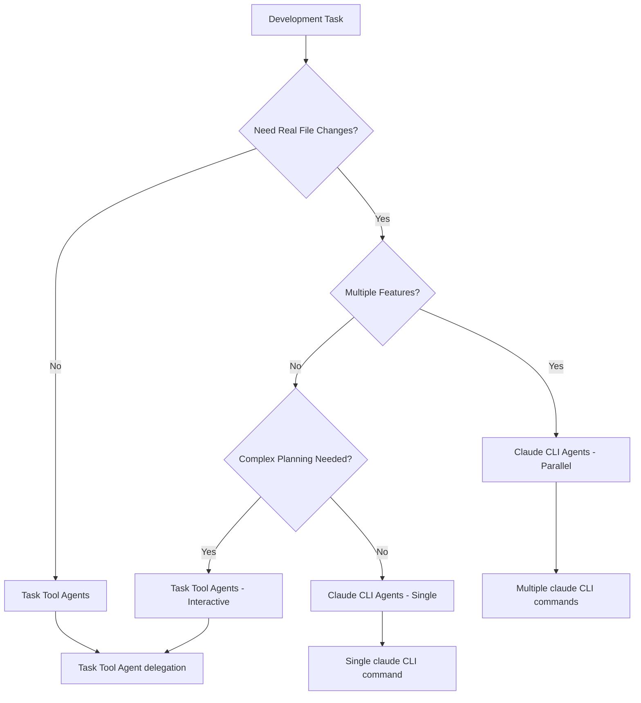
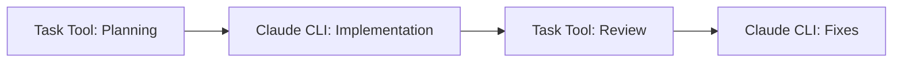

# Agent Invocation Patterns

This document clarifies when and how to use different agent invocation methods in CycleTime development, providing clear guidance for choosing between Task tool delegation and Claude CLI agents.

## Overview

CycleTime supports two distinct agent invocation methods, each with specific capabilities and use cases:

1. **Task Tool Agents** (`@agent-*`) - Delegated, isolated task execution
2. **Claude CLI Agents** - Direct filesystem access with background execution

## Task Tool Agents

### What They Are

Task tool agents use Claude Code's built-in Task tool with specialized agent types:

```
@agent-developer
@agent-qa
@agent-code-reviewer
@agent-product-manager
@agent-tech-lead
@agent-software-architect
@agent-devops-engineer
```

### Capabilities

✅ **What Task Tool Agents Can Do:**
- Research and analyze existing code
- Create implementation plans
- Write code following project patterns
- Run tests and validate functionality
- Perform code reviews and quality checks
- Create documentation and specifications
- Coordinate between team roles
- Make informed architectural decisions

✅ **Key Strengths:**
- Deep codebase understanding through file system access
- Context-aware decision making
- Integration with development tools
- Role-based specialization
- Interactive refinement and iteration
- Real-time problem solving

### Limitations

❌ **What Task Tool Agents Cannot Do:**
- Make real filesystem changes (in isolated environment)
- Create actual git commits
- Work with actual worktrees (simulated only)
- Run in true parallel (sequential execution)
- Access external services directly
- Persist state between invocations

### When to Use Task Tool Agents

**Ideal for:**
- Single feature development
- Interactive problem-solving
- Code reviews and analysis
- Research and exploration
- Planning and coordination
- Iterative refinement
- Learning and understanding codebases

**Examples:**
```
# Feature implementation
@agent-developer "Implement user authentication with JWT tokens"

# Code review
@agent-code-reviewer "Review the authentication implementation for security best practices"

# Architecture guidance
@agent-software-architect "Design the database schema for user management"

# Test planning
@agent-qa "Create comprehensive test plan for the authentication system"
```

## Claude CLI Agents

### What They Are

Claude CLI agents are executed directly via command line with specialized prompt files:

```bash
claude -p "task description" \
  --append-system-prompt "$(cat .claude/prompts/task-agent.txt)" \
  --permission-mode bypassPermissions \
  --output-format stream-json \
  --verbose
```

### Agent Types

- **`task-agent.txt`** - General purpose development tasks
- **`test-agent.txt`** - Testing specialist (all modes)
- **`implementation-agent.txt`** - Code implementation specialist
- **`review-agent.txt`** - Code review and quality assurance

### Capabilities

✅ **What Claude CLI Agents Can Do:**
- Make real filesystem changes
- Create actual git commits
- Work in actual worktrees
- Run in true parallel across multiple features
- Execute long-running background tasks
- Integrate with build systems and CI/CD
- Persist work between executions

✅ **Key Strengths:**
- Real filesystem modification
- True parallel execution
- Background processing
- Git integration
- Build system integration
- Production-ready outputs

### Limitations

❌ **What Claude CLI Agents Cannot Do:**
- Interactive refinement (one-shot execution)
- Context switching between tasks
- Real-time problem solving with user
- Deep architectural analysis (limited context)
- Complex multi-step coordination

### When to Use Claude CLI Agents

**Ideal for:**
- Parallel development of multiple features
- Automated build and test workflows
- Production deployment tasks
- Large-scale refactoring
- Batch processing tasks
- CI/CD integration

**Examples:**
```bash
# Parallel feature implementation
cd .worktrees/auth-feature && claude -p "Implement JWT authentication" \
  --append-system-prompt "$(cat .claude/prompts/task-agent.txt)" \
  --permission-mode bypassPermissions --output-format stream-json --verbose

# Automated testing
cd .worktrees/auth-feature && claude -p "Add comprehensive test coverage" \
  --append-system-prompt "$(cat .claude/prompts/test-agent.txt)" \
  --permission-mode bypassPermissions --output-format stream-json --verbose
```

## Decision Matrix

### Choosing the Right Agent Type



### Decision Criteria

#### Use Task Tool Agents When:
- Need interactive problem-solving
- Require deep code analysis
- Want iterative refinement
- Need role-based expertise
- Working on single feature
- Exploring or researching
- Planning architecture

#### Use Claude CLI Agents When:
- Need real file modifications
- Want parallel execution
- Have well-defined tasks
- Need git integration
- Working on multiple features
- Automating workflows
- Running background tasks

## Mixed-Mode Development

### Combining Both Approaches

You can use both agent types in a single workflow:



### Example: Feature Development Workflow

1. **Planning Phase** (Task Tool)
   ```
   @agent-software-architect "Design authentication system architecture"
   @agent-product-manager "Define user stories and acceptance criteria"
   ```

2. **Implementation Phase** (Claude CLI)
   ```bash
   # Parallel implementation across worktrees
   cd .worktrees/auth-backend && claude -p "Implement JWT backend"
   cd .worktrees/auth-frontend && claude -p "Implement login UI"
   ```

3. **Review Phase** (Task Tool)
   ```
   @agent-code-reviewer "Review authentication implementation for security"
   @agent-qa "Validate test coverage and quality"
   ```

4. **Refinement Phase** (Claude CLI)
   ```bash
   # Apply review feedback
   cd .worktrees/auth-backend && claude -p "Fix security issues identified in review"
   ```

## Workflow Integration

### Single Feature Development

**Recommended**: Task Tool Agents
- Interactive development
- Real-time feedback
- Iterative refinement
- Role-based guidance

```
@agent-developer "Implement user profile management with CRUD operations"
# Interactive refinement based on feedback
```

### Parallel Feature Development

**Recommended**: Claude CLI Agents
- True parallel execution
- Real filesystem changes
- Background processing
- Git integration

```bash
# Launch multiple agents in parallel
claude -p "Implement auth" --append-system-prompt "$(cat .claude/prompts/task-agent.txt)" &
claude -p "Implement profiles" --append-system-prompt "$(cat .claude/prompts/task-agent.txt)" &
claude -p "Implement settings" --append-system-prompt "$(cat .claude/prompts/task-agent.txt)" &
```

### Research and Analysis

**Recommended**: Task Tool Agents
- Deep code analysis
- Interactive exploration
- Architectural insights
- Best practices guidance

```
@agent-software-architect "Analyze current authentication patterns and recommend improvements"
```

### Production Deployment

**Recommended**: Claude CLI Agents
- Real file modifications
- Build system integration
- Automated workflows
- CI/CD compatibility

```bash
claude -p "Update production configuration and deploy" \
  --append-system-prompt "$(cat .claude/prompts/devops-agent.txt)"
```

## Best Practices

### Task Tool Agent Best Practices

1. **Be Specific**: Provide clear, detailed task descriptions
2. **Iterate**: Use feedback to refine and improve
3. **Leverage Expertise**: Choose appropriate agent roles
4. **Review Output**: Validate recommendations before implementing
5. **Document Decisions**: Capture architectural decisions

### Claude CLI Agent Best Practices

1. **Prepare Environment**: Ensure worktrees and dependencies are ready
2. **Monitor Progress**: Use BashOutput to track execution
3. **Batch Related Tasks**: Group similar operations together
4. **Handle Failures**: Plan for error scenarios and recovery
5. **Verify Results**: Test outputs thoroughly

### Mixed-Mode Best Practices

1. **Plan First**: Use Task tool agents for planning and analysis
2. **Implement Second**: Use Claude CLI agents for execution
3. **Review Third**: Use Task tool agents for quality assurance
4. **Iterate**: Combine both for refinement cycles

## Common Patterns

### Pattern 1: Interactive Development
```
@agent-developer "Start implementation"
# → Interactive refinement
# → User provides feedback
@agent-developer "Refine based on feedback"
```

### Pattern 2: Parallel Execution
```bash
# Launch parallel Claude CLI agents
for feature in auth profiles settings; do
  cd .worktrees/$feature && claude -p "Implement $feature" &
done
wait # Wait for all to complete
```

### Pattern 3: Planning → Execution
```
@agent-software-architect "Design system"
# → Get architectural plan
# → Execute with Claude CLI
claude -p "Implement according to plan"
```

### Pattern 4: Execution → Review
```bash
# Implement with Claude CLI
claude -p "Implement feature"
# → Review with Task tool
@agent-code-reviewer "Review implementation"
```

## Troubleshooting

### Task Tool Agent Issues

**Problem**: Agent doesn't understand context
**Solution**: Provide more specific details and context

**Problem**: Agent provides generic advice
**Solution**: Use more specialized agent roles

**Problem**: Need real file changes
**Solution**: Switch to Claude CLI agents

### Claude CLI Agent Issues

**Problem**: Agent fails to start
**Solution**: Check Claude CLI installation and permissions

**Problem**: Agent doesn't have enough context
**Solution**: Provide more detailed task descriptions

**Problem**: Need interactive refinement
**Solution**: Switch to Task tool agents

## Integration with Other Workflows

This agent invocation strategy integrates with:

- **[Branching Strategy](branching-strategy.md)**: Works with both main directory and worktrees
- **[Single Feature Workflow](single-feature-workflow.md)**: Task tool agents for interactive development
- **[Parallel Development](../testing/parallel-development.md)**: Claude CLI agents for parallel execution
- **[Linear Integration](linear-branch-integration.md)**: Both support Linear status updates

## Quick Reference

### Task Tool Agents
```
# General implementation
@agent-developer "task description"

# Code review
@agent-code-reviewer "review requirements"

# Architecture guidance
@agent-software-architect "design requirements"

# Test planning
@agent-qa "testing requirements"
```

### Claude CLI Agents
```bash
# General tasks
claude -p "task" --append-system-prompt "$(cat .claude/prompts/task-agent.txt)" \
  --permission-mode bypassPermissions --output-format stream-json --verbose

# Testing
claude -p "test task" --append-system-prompt "$(cat .claude/prompts/test-agent.txt)" \
  --permission-mode bypassPermissions --output-format stream-json --verbose

# Review
claude -p "review task" --append-system-prompt "$(cat .claude/prompts/review-agent.txt)" \
  --permission-mode bypassPermissions --output-format stream-json --verbose
```

Choose the right agent type based on your specific needs: Task tool agents for interactive, analytical work, and Claude CLI agents for execution and parallel processing.