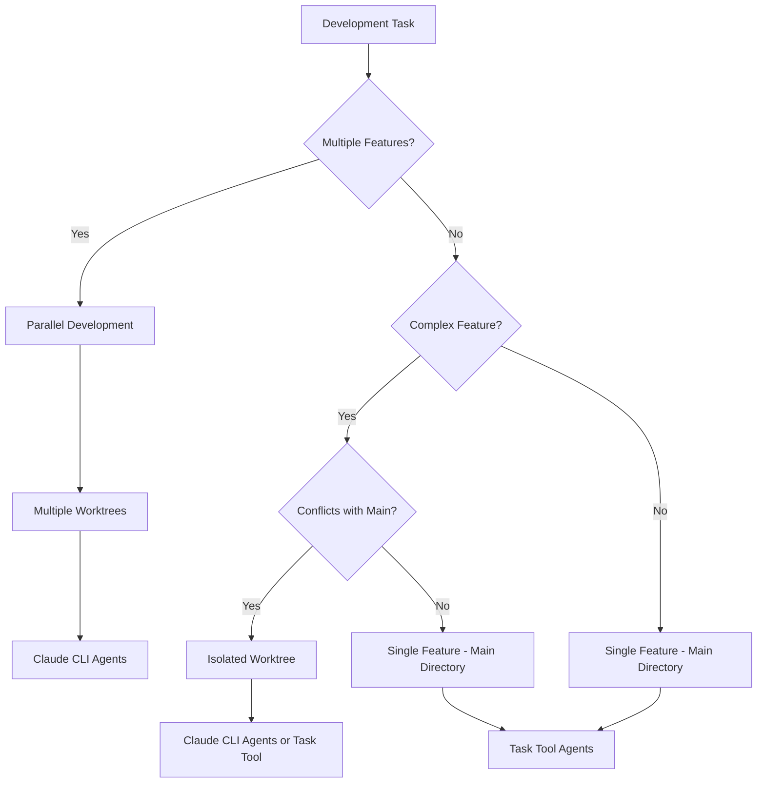

# Branching and Worktree Strategy

This document defines the standardized branching and worktree patterns for CycleTime development, ensuring consistency across all workflows whether using Task tool delegation or Claude CLI agents.

## Branch Naming Conventions

All branches follow a consistent pattern that integrates with Linear issue tracking:

```
<type>/spi-<issue-number>-<description>
```

### Branch Types

- **`feat/`** - New features and enhancements
- **`fix/`** - Bug fixes and issue resolutions
- **`refactor/`** - Code refactoring without functional changes
- **`docs/`** - Documentation updates and additions
- **`test/`** - Test additions or modifications
- **`chore/`** - Maintenance tasks, build updates, tooling

### Examples

```bash
feat/spi-620-documentation-standards
fix/spi-587-auth-token-expiry
refactor/spi-445-repository-patterns
docs/spi-612-api-documentation
test/spi-598-integration-coverage
chore/spi-601-ci-optimization
```

## Worktree Strategy

### Standard Worktree Location

**All worktrees are created under the project root:**

```
/Users/[user]/Projects/cycletime/.worktrees/
```

This location:
- Avoids authorization prompts (within project scope)
- Maintains consistent relative paths
- Simplifies cleanup and management
- Works with all development workflows

### Worktree Directory Structure

```
cycletime/                          # Main project (main branch)
├── .git/                           # Shared Git database
├── src/                            # Main development area
├── .worktrees/                     # Parallel development area
│   ├── spi-620-docs-standards/     # Feature: Documentation standardization
│   │   ├── .claude/                # Agent configurations
│   │   ├── src/                    # Feature implementation
│   │   ├── docs/                   # Feature documentation
│   │   └── tests/                  # Feature tests
│   ├── spi-587-auth-fix/           # Bug fix: Authentication issue
│   │   └── [same structure]
│   └── spi-612-api-docs/           # Documentation: API updates
│       └── [same structure]
└── docs/                           # Shared documentation
```

## Development Workflow Decision Tree

### When to Use Worktrees



### Decision Criteria

#### Use Main Directory (No Worktree) When:
- Single feature development
- Small bug fixes
- Documentation updates
- Test additions
- Minimal conflict risk with ongoing work

#### Use Single Worktree When:
- Large feature that may conflict with main
- Long-running development (multiple days)
- Experimental work
- Need to preserve main branch for demos/releases
- Database schema changes

#### Use Multiple Worktrees When:
- Parallel development of independent features
- Multiple developers working simultaneously
- Need to switch context frequently
- Testing different approaches in parallel

## Worktree Commands

### Creating Worktrees

#### Standard Feature Worktree
```bash
# Create feature branch and worktree
git worktree add .worktrees/spi-620-docs-standards -b feat/spi-620-documentation-standards

# Navigate to feature workspace
cd .worktrees/spi-620-docs-standards

# Verify worktree setup
pwd && git branch --show-current
```

#### Bug Fix Worktree
```bash
# Create fix branch and worktree
git worktree add .worktrees/spi-587-auth-fix -b fix/spi-587-auth-token-expiry

# Navigate to fix workspace
cd .worktrees/spi-587-auth-fix
```

#### Documentation Worktree
```bash
# Create docs branch and worktree
git worktree add .worktrees/spi-612-api-docs -b docs/spi-612-api-documentation

# Navigate to docs workspace
cd .worktrees/spi-612-api-docs
```

### Managing Worktrees

#### List All Worktrees
```bash
git worktree list
```

#### Remove Completed Worktree
```bash
# After PR is merged
git worktree remove .worktrees/spi-620-docs-standards
git branch -d feat/spi-620-documentation-standards
```

#### Force Remove Abandoned Worktree
```bash
git worktree remove --force .worktrees/abandoned-feature
git branch -D feat/abandoned-feature
```

## Linear Integration

### Branch to Issue Mapping

Each branch corresponds to a Linear issue:

- **Branch**: `feat/spi-620-documentation-standards`
- **Linear Issue**: `SPI-620`
- **Linear URL**: `https://linear.app/spiral-house/issue/SPI-620/...`

### Status Synchronization

Branch lifecycle automatically maps to Linear status:

1. **Branch Creation** → Linear status: `In Progress`
2. **PR Creation** → Linear status: `In Review`
3. **PR Merge** → Linear status: `Done`
4. **Branch Deletion** → Cleanup complete

### Automated Workflows

When working with branches, Linear status should be updated:

```bash
# Starting work
git checkout -b feat/spi-620-documentation-standards
# → Update Linear SPI-620 to "In Progress"

# Creating PR
gh pr create --title "feat: standardize documentation patterns"
# → Update Linear SPI-620 to "In Review"

# After merge
# → Update Linear SPI-620 to "Done"
```

## Best Practices

### Worktree Management

1. **Consistent Naming**: Always use Linear issue ID in worktree name
2. **Clean Up Promptly**: Remove worktrees after PR merge
3. **Avoid Nested Worktrees**: Keep flat structure under `.worktrees/`
4. **Document Purpose**: Use descriptive branch/worktree names

### Branch Lifecycle

1. **Start from Main**: Always branch from latest main
2. **Regular Sync**: Merge/rebase from main frequently
3. **Atomic Commits**: Keep commits focused and logical
4. **Clean History**: Use interactive rebase before PR if needed

### File Management

1. **Relative Paths**: Use relative paths in scripts and configs
2. **Shared Resources**: Keep shared files in main, reference from worktrees
3. **Dependencies**: Install dependencies in each worktree as needed
4. **Testing**: Run tests in both main and worktree environments

## Security Considerations

### File System Access

- Worktrees share the same `.git` database
- File permissions inherited from parent directory
- No additional authorization needed within project scope
- Claude CLI agents have full filesystem access within worktree

### Branch Protection

```bash
# Protect main branch
git config branch.main.merge refs/heads/main
git config branch.main.remote origin

# Never work directly on main
git checkout main && echo "Switch to feature branch before making changes"
```

## Troubleshooting

### Common Issues

#### Worktree Creation Fails
```bash
# Check available space
df -h .

# Verify Git repository
git status

# Check for existing worktree
git worktree list | grep spi-620
```

#### Permission Issues
```bash
# Verify ownership
ls -la .worktrees/

# Fix permissions if needed
chmod -R u+w .worktrees/spi-620-docs-standards/
```

#### Branch Conflicts
```bash
# Check existing branches
git branch -a | grep spi-620

# Use different branch name if exists
git worktree add .worktrees/spi-620-docs-v2 -b feat/spi-620-documentation-standards-v2
```

### Cleanup Commands

#### Emergency Cleanup
```bash
# Remove all worktrees (use with caution)
git worktree list --porcelain | grep "worktree " | cut -d' ' -f2 | xargs -I {} git worktree remove --force {}

# Prune deleted worktrees
git worktree prune
```

## Integration with Development Workflows

This branching strategy works with all development approaches:

- **[Single Feature Workflow](single-feature-workflow.md)**: Uses main directory or single worktree
- **[Parallel Development](../testing/parallel-development.md)**: Uses multiple worktrees with Claude CLI agents
- **[Task Tool Workflow](../../.claude/workflows/task-tool-workflow.md)**: Works with both main directory and worktrees
- **[Agent Invocation Patterns](agent-invocation-patterns.md)**: Consistent across all agent types

## Quick Reference

### Create Feature Branch
```bash
git worktree add .worktrees/spi-XXX-feature-name -b feat/spi-XXX-feature-name
cd .worktrees/spi-XXX-feature-name
```

### Complete Feature
```bash
git push -u origin feat/spi-XXX-feature-name
gh pr create --title "feat: implement feature name"
# After merge:
git worktree remove .worktrees/spi-XXX-feature-name
git branch -d feat/spi-XXX-feature-name
```

### Standard Locations
- **Worktrees**: `.worktrees/spi-XXX-description/`
- **Branch naming**: `<type>/spi-XXX-description`
- **Linear mapping**: `SPI-XXX` issue ID

This strategy ensures consistent, predictable development patterns while supporting both automated agent workflows and manual development processes.