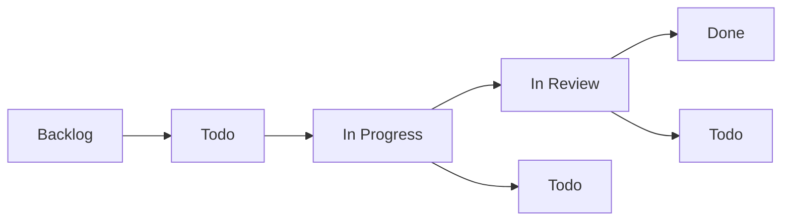
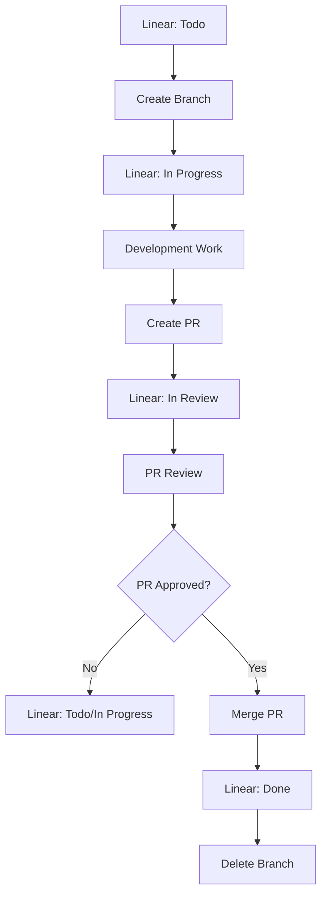
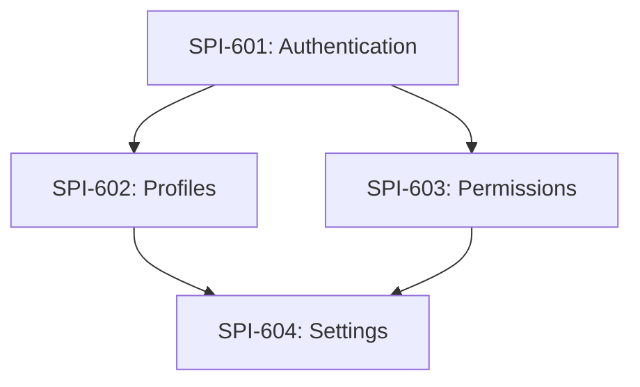

# Linear Branch Integration

This document defines how Linear issues integrate with Git branches, automated status updates, and workflow patterns in CycleTime development.

## Overview

Linear integration ensures that every branch corresponds to a Linear issue, providing clear traceability from requirements to implementation and enabling automated workflow tracking.

## Linear Issue Mapping

### Issue ID Format

Linear issues use the format: `SPI-XXX` where:
- `SPI` = Project identifier (Spiral House Innovations)
- `XXX` = Sequential issue number

Examples:
- `SPI-620` - Documentation standardization
- `SPI-587` - Authentication token expiry
- `SPI-612` - API redesign

### Branch Naming Convention

Branches include the Linear issue ID in lowercase:

```
<type>/spi-<issue-number>-<description>
```

### Mapping Examples

| Linear Issue | Branch Name | Worktree Path |
|--------------|-------------|---------------|
| `SPI-620` | `feat/spi-620-documentation-standards` | `.worktrees/spi-620-docs-standards` |
| `SPI-587` | `fix/spi-587-auth-token-expiry` | `.worktrees/spi-587-auth-fix` |
| `SPI-612` | `feat/spi-612-api-redesign` | `.worktrees/spi-612-api-redesign` |
| `SPI-598` | `test/spi-598-integration-coverage` | `.worktrees/spi-598-test-coverage` |
| `SPI-601` | `chore/spi-601-ci-optimization` | `.worktrees/spi-601-ci-optimization` |

## Status Lifecycle Integration

### Linear Status Progression



### Git Workflow Integration



### Automated Status Updates

#### Manual Updates (Current)

```bash
# Starting work on SPI-620
git checkout -b feat/spi-620-documentation-standards
# → Manually update Linear SPI-620 to "In Progress"

# Creating PR
gh pr create --title "feat: standardize documentation patterns"
# → Manually update Linear SPI-620 to "In Review"

# After PR merge
# → Manually update Linear SPI-620 to "Done"
```

#### Future Automation Opportunities

```bash
# Git hooks for automatic updates
.git/hooks/post-checkout    # → Update to "In Progress"
.git/hooks/pre-push        # → Update to "In Review" if PR exists
.git/hooks/post-merge      # → Update to "Done" if merged to main
```

## Branch Creation Patterns

### Standard Feature Branch

```bash
# From Linear issue SPI-620
git checkout main
git pull origin main
git checkout -b feat/spi-620-documentation-standards

# Update Linear status
# SPI-620: Todo → In Progress
```

### Worktree Feature Branch

```bash
# From Linear issue SPI-612
git worktree add .worktrees/spi-612-api-redesign -b feat/spi-612-api-redesign
cd .worktrees/spi-612-api-redesign

# Update Linear status
# SPI-612: Todo → In Progress
```

### Bug Fix Branch

```bash
# From Linear issue SPI-587 (bug)
git checkout -b fix/spi-587-auth-token-expiry

# Update Linear status
# SPI-587: Todo → In Progress
```

## Linear Issue Requirements

### Issue Creation Standards

Every Linear issue should include:

1. **Clear Title**: Descriptive and actionable
2. **Description**: Detailed problem statement
3. **Acceptance Criteria**: Specific, measurable outcomes
4. **Labels**: Appropriate categorization
5. **Priority**: Business priority level
6. **Estimate**: Complexity points (if applicable)

### Example Linear Issue

```
Title: Standardize branching, worktree, and agent invocation documentation

Description:
The current documentation has inconsistencies and gaps in how we handle
branching, worktrees, and agent invocation patterns...

Acceptance Criteria:
- [ ] All worktree references use consistent `.worktrees/` path
- [ ] Clear distinction between Task tool and Claude CLI agent usage
- [ ] Single-feature workflow documented with examples
- [ ] Branch naming standards include Linear ID integration

Labels: documentation, developer-experience, infrastructure
Priority: Medium
Estimate: 5 points
```

## Branch-to-PR Integration

### PR Creation

```bash
# Create PR with Linear reference
gh pr create \
  --title "feat: standardize documentation patterns (SPI-620)" \
  --body "$(cat <<'EOF'
## Summary
Implements standardized documentation patterns per SPI-620.

## Linear Issue
Fixes SPI-620: https://linear.app/spiral-house/issue/SPI-620/standardize-branching-worktree-and-agent-invocation-documentation

## Changes Made
- Created docs/development/branching-strategy.md
- Created docs/development/agent-invocation-patterns.md
- Updated existing documentation for consistency

## Acceptance Criteria
- [x] All worktree references use consistent `.worktrees/` path
- [x] Clear distinction between Task tool and Claude CLI agent usage
- [x] Single-feature workflow documented with examples
- [x] Branch naming standards include Linear ID integration

## Test Plan
- [ ] All examples work correctly
- [ ] Documentation is consistent across files
- [ ] Patterns are clear and actionable

🤖 Generated with [Claude Code](https://claude.ai/code)

Co-Authored-By: Claude <noreply@anthropic.com>
EOF
)"
```

### PR Template Integration

```markdown
## Linear Issue
Fixes SPI-XXX: [Linear URL]

## Changes Made
- List key changes that address acceptance criteria

## Acceptance Criteria
- [ ] Copy acceptance criteria from Linear issue
- [ ] Check off completed items

## Test Plan
- [ ] Describe how changes were tested
- [ ] Include validation steps
```

## Worktree Management

### Worktree Naming Convention

Worktree directories should be shorter but still traceable:

```bash
# Full branch name: feat/spi-620-documentation-standards
# Worktree path: .worktrees/spi-620-docs-standards

# Pattern: spi-{number}-{short-description}
```

### Directory Structure

```
.worktrees/
├── spi-620-docs-standards/     # SPI-620: Documentation standardization
├── spi-587-auth-fix/           # SPI-587: Authentication bug fix
├── spi-612-api-redesign/       # SPI-612: API redesign
└── spi-598-test-coverage/      # SPI-598: Test coverage improvement
```

### Cleanup Integration

```bash
# After PR merge and Linear issue closure
git worktree remove .worktrees/spi-620-docs-standards
git branch -d feat/spi-620-documentation-standards

# Verify Linear issue is marked "Done"
```

## Multi-Issue Workflows

### Epic and Story Relationships

```
Epic: SPI-600 - User Management System
├── Story: SPI-601 - User Authentication
├── Story: SPI-602 - User Profiles
├── Story: SPI-603 - User Permissions
└── Story: SPI-604 - User Settings
```

### Parallel Development

```bash
# Create worktrees for each story
git worktree add .worktrees/spi-601-auth -b feat/spi-601-user-authentication
git worktree add .worktrees/spi-602-profiles -b feat/spi-602-user-profiles
git worktree add .worktrees/spi-603-permissions -b feat/spi-603-user-permissions

# Work in parallel
cd .worktrees/spi-601-auth && @agent-developer "implement authentication"
cd .worktrees/spi-602-profiles && @agent-developer "implement profiles"
cd .worktrees/spi-603-permissions && @agent-developer "implement permissions"
```

### Dependency Management



Handle dependencies through:
1. **Sequential development**: Complete dependencies first
2. **Mocking**: Mock dependencies during parallel development
3. **Integration branches**: Merge dependencies for testing

## Linear MCP Integration

CycleTime integrates with Linear through MCP (Model Context Protocol) tools, enabling Claude Code to read and update Linear issues programmatically. These tools provide type-safe access to Linear's API without requiring separate CLI installation.

### Reading Issue Data

Claude Code can access Linear issue details using MCP tools:

```bash
# Get issue details with MCP tool
# Claude Code automatically invokes: mcp__linear__get_issue
"Get details for Linear issue SPI-620"

# List team issues with filtering
# Claude Code automatically invokes: mcp__linear__list_issues
"Show all issues for team Spiral House"
"Show issues with status In Progress"
```

**MCP Tool Reference:**
- `mcp__linear__get_issue` - Retrieve detailed information about a specific issue
- `mcp__linear__list_issues` - Query issues with filters (team, status, assignee, project)
- `mcp__linear__list_comments` - Get comments for an issue

### Updating Issue Status

Claude Code updates Linear status through MCP tools during workflow transitions:

```bash
# Update status when starting work
# Claude Code uses: mcp__linear__update_issue
"Update SPI-620 status to In Progress"

# Update status when creating PR
"Update SPI-620 status to In Review"

# Update status after merge
"Update SPI-620 status to Done"
```

**MCP Tool Reference:**
- `mcp__linear__update_issue` - Update issue status, assignee, priority, labels, etc.
- `mcp__linear__create_comment` - Add progress updates or notes

### Automated Status Updates (Future)

Git hooks can trigger Claude Code to update Linear status automatically:

```bash
# Git hook example (.git/hooks/post-checkout)
#!/bin/bash
BRANCH=$(git branch --show-current)
if [[ $BRANCH =~ ^(feat|fix|chore)/spi-([0-9]+) ]]; then
    ISSUE_ID="SPI-${BASH_REMATCH[2]}"
    # Invoke Claude Code with MCP tool
    claude "Update ${ISSUE_ID} status to In Progress"
fi
```

## Quality Gates

### Before Creating Branch

- [ ] Linear issue exists with clear requirements
- [ ] Acceptance criteria are defined
- [ ] Issue is assigned and prioritized
- [ ] Dependencies are identified
- [ ] Technical approach is planned

### During Development

- [ ] Branch name matches Linear issue ID
- [ ] Linear status reflects actual progress
- [ ] Commits reference issue ID when relevant
- [ ] Progress updates are communicated

### Before PR Creation

- [ ] All acceptance criteria addressed
- [ ] Linear issue ready for review
- [ ] Implementation matches requirements
- [ ] Testing completed

### Before Merge

- [ ] PR approved by reviewers
- [ ] All checks passing
- [ ] Linear issue acceptance criteria met
- [ ] Ready to close Linear issue

## Integration Examples

### Example 1: Simple Feature

```bash
# Linear: SPI-625 - Add user search functionality
# Status: Todo

# 1. Create branch
git checkout -b feat/spi-625-user-search

# 2. Update Linear status to "In Progress"

# 3. Implement
@agent-developer "Implement user search functionality per SPI-625 requirements"

# 4. Create PR
gh pr create --title "feat: add user search functionality (SPI-625)"

# 5. Update Linear status to "In Review"

# 6. After merge, update Linear to "Done"
```

### Example 2: Bug Fix

```bash
# Linear: SPI-630 - Fix pagination not working
# Status: Todo

# 1. Create branch
git checkout -b fix/spi-630-pagination-bug

# 2. Update Linear status to "In Progress"

# 3. Reproduce and fix
@agent-developer "Reproduce and fix pagination bug described in SPI-630"

# 4. Add tests
@agent-qa "Add regression tests for pagination fix"

# 5. Create PR
gh pr create --title "fix: resolve pagination not working (SPI-630)"

# 6. Update Linear status to "In Review"
```

### Example 3: Parallel Features

```bash
# Epic: SPI-635 - Dashboard improvements
# Stories: SPI-636, SPI-637, SPI-638

# 1. Create parallel worktrees
git worktree add .worktrees/spi-636-charts -b feat/spi-636-dashboard-charts
git worktree add .worktrees/spi-637-filters -b feat/spi-637-dashboard-filters
git worktree add .worktrees/spi-638-export -b feat/spi-638-dashboard-export

# 2. Update all Linear stories to "In Progress"

# 3. Implement in parallel using Claude CLI agents
cd .worktrees/spi-636-charts && claude -p "Implement dashboard charts"
cd .worktrees/spi-637-filters && claude -p "Implement dashboard filters"
cd .worktrees/spi-638-export && claude -p "Implement dashboard export"

# 4. Create PRs for each
# 5. Update Linear stories to "In Review"
# 6. After merges, update to "Done" and close Epic
```

## Best Practices

### Linear Issue Management

Effective Linear issue management starts with the principle of one issue per branch. Each Git branch should address exactly one Linear issue to maintain clear traceability and simplify code review. This one-to-one mapping ensures that pull requests have focused scope and that Linear status accurately reflects branch state.

Every Linear issue must include clear, measurable acceptance criteria before development begins. Well-defined acceptance criteria serve as both implementation guidance and verification checkpoints, preventing scope creep and ensuring deliverables meet requirements. Issues should be sized appropriately for development cycles - typically 1-5 story points for subtasks - enabling predictable sprint planning and progress tracking.

Maintain Linear status accuracy throughout development. The issue status should always reflect the actual state of work, not aspirational progress. When starting a branch, immediately update the issue to "In Progress". When creating a PR, transition to "In Review". This real-time status tracking provides accurate project visibility and prevents stakeholder confusion.

Track dependencies explicitly by linking related issues in Linear. When one issue blocks another, document this relationship in both issues using Linear's dependency features. This enables proper sequencing in sprint planning and alerts developers to prerequisite work.

### Branch Management

Branch naming consistency is non-negotiable. Every branch name must include the Linear issue ID (lowercase) following the pattern `<type>/spi-<number>-<description>`. This convention enables automated tooling to associate branches with issues and provides immediate context when reviewing branch lists.

Choose descriptive branch names that clearly communicate purpose. While the Linear issue ID provides traceability, the description portion should summarize what the branch accomplishes. Compare `feat/spi-620-documentation-standards` (clear) versus `feat/spi-620-updates` (vague). Descriptive names reduce cognitive overhead when switching between branches or reviewing pull requests.

Maintain clean commit history through logical, atomic commits. Each commit should represent a coherent change, and the commit messages should explain why the change was made. Avoid "WIP" or "fix" commits in final history - use interactive rebase to clean up before creating pull requests.

Keep branches synced regularly with the main branch to minimize merge conflicts and integration issues. Rebase or merge from main at least daily when working on long-running branches. This practice catches integration problems early when they're easier to resolve.

Delete branches promptly after successful merge. Merged branches clutter the repository and create confusion about active work. Set up automated branch deletion in your PR workflow, or manually delete immediately after merge confirmation. Clean repository state improves developer experience and repository maintainability.

### Workflow Integration

Status synchronization between Linear and Git is essential for accurate project tracking. Update Linear status at every workflow transition: starting work (In Progress), creating PR (In Review), and completing merge (Done). These updates provide real-time visibility to stakeholders and enable accurate sprint burndown tracking.

Pull request descriptions must clearly link to Linear issues using the "Fixes SPI-XXX" notation. Include the Linear issue URL in the PR body and copy the acceptance criteria from Linear to the PR checklist. This creates bidirectional traceability and ensures reviewers understand the requirements context.

Complete testing validates all acceptance criteria before requesting PR review. Each acceptance criterion from the Linear issue should map to specific tests or verification steps. Don't mark a PR ready for review until every criterion passes - incomplete work wastes reviewer time and delays delivery.

Update documentation concurrently with implementation rather than as an afterthought. When code changes affect architecture, APIs, or workflows, update relevant documentation in the same PR. This keeps documentation synchronized with code and prevents knowledge gaps from accumulating.

Communicate blockers and status changes proactively. When dependencies block progress, update the Linear issue with blocker details and notify relevant team members. When scope changes emerge during implementation, document them in Linear and seek stakeholder input before proceeding. Transparent communication prevents surprises and enables timely course correction.

## Troubleshooting

### Common Issues

#### Linear Issue Not Found

When an issue ID appears invalid or inaccessible, verify the issue exists and you have appropriate workspace permissions. Ask Claude Code to retrieve the issue using MCP tools:

```bash
# Ask Claude Code to verify issue exists
"Get details for Linear issue SPI-620"

# This invokes mcp__linear__get_issue which will return:
# - Issue details if it exists and you have access
# - Error message if issue doesn't exist or lacks permissions
```

Check that the issue number is correct and that you're in the right Linear workspace. MCP tools automatically handle authentication if Linear integration is properly configured in Claude Code.

#### Branch Name Conflicts

When creating a branch for a Linear issue, check whether a branch for that issue already exists to avoid duplicate work or naming conflicts:

```bash
# Check existing branches for issue
git branch -a | grep spi-620

# If conflict exists, verify if previous branch is stale
git branch -v | grep spi-620

# Use alternative naming if legitimately needed
git checkout -b feat/spi-620-documentation-standards-v2
```

This situation often indicates parallel work on the same issue. Coordinate with team members to determine if branches should be consolidated or if the work genuinely requires multiple branches.

#### Status Update Failures

When Linear status updates fail through MCP tools, first verify connectivity and permissions, then fall back to manual updates if necessary:

```bash
# Ask Claude Code to update status
"Update SPI-620 status to In Progress"

# If MCP tool fails, check Linear workspace access
# Ensure Linear integration is configured in Claude Code settings

# Fallback: Update manually via Linear web interface
# Navigate to: https://linear.app/spiral-house/issue/SPI-620
```

MCP tool failures typically indicate authentication issues or workspace permission changes. Reconfigure Linear integration in Claude Code settings if errors persist.

### Recovery Procedures

#### Orphaned Branches

Identify and clean up branches that reference non-existent or closed Linear issues. This prevents workspace clutter and confusion:

```bash
# Find branches without valid Linear issues
git branch | grep -v main | while read branch; do
  if [[ $branch =~ spi-([0-9]+) ]]; then
    issue_id="SPI-${BASH_REMATCH[1]}"
    # Ask Claude: "Check if ${issue_id} exists and is open"
    # Delete branch if issue doesn't exist or is closed
  fi
done
```

Orphaned branches often result from issues being deleted or marked as duplicates in Linear. Verify with the team before deleting branches to ensure no valuable work is lost.

#### Status Mismatches

When Git branch state doesn't align with Linear issue status, audit and reconcile the differences to maintain accurate project tracking:

```bash
# Compare Git state with Linear state
# For each branch matching spi-XXX pattern:
# 1. Ask Claude: "Get status for Linear issue SPI-XXX"
# 2. Compare with branch presence/merge status
# 3. Update Linear or Git to match actual state

# Example reconciliation
git branch -a | grep "spi-" | while read branch; do
  if [[ $branch =~ spi-([0-9]+) ]]; then
    echo "Branch: $branch - Ask Claude to check SPI-${BASH_REMATCH[1]} status"
  fi
done
```

Status mismatches occur when manual updates bypass automation or when workflows are interrupted. Regular audits prevent accumulation of inconsistencies.

## Integration with Other Workflows

This Linear integration works with:

- **[Branching Strategy](branching-strategy.md)**: Provides the branch naming conventions
- **[Single Feature Workflow](single-feature-workflow.md)**: Integrates status updates throughout development
- **[Parallel Development](../testing/parallel-development.md)**: Supports multiple Linear issues in parallel
- **[Agent Invocation Patterns](agent-invocation-patterns.md)**: Works with both Task tool and Claude CLI agents

## Quick Reference

### Create Branch from Linear Issue
```bash
# Pattern: <type>/spi-<number>-<description>
git checkout -b feat/spi-620-documentation-standards
# Update Linear SPI-620 to "In Progress"
```

### Create Worktree from Linear Issue
```bash
git worktree add .worktrees/spi-620-docs-standards -b feat/spi-620-documentation-standards
cd .worktrees/spi-620-docs-standards
# Update Linear SPI-620 to "In Progress"
```

### Create PR with Linear Reference
```bash
gh pr create --title "feat: implement feature (SPI-XXX)" --body "Fixes SPI-XXX: [Linear URL]"
# Update Linear SPI-XXX to "In Review"
```

### Complete Work
```bash
# After PR merge
git worktree remove .worktrees/spi-620-docs-standards  # if using worktree
git branch -d feat/spi-620-documentation-standards
# Update Linear SPI-620 to "Done"
```

This integration ensures clear traceability from requirements to implementation while supporting both single and parallel development workflows.