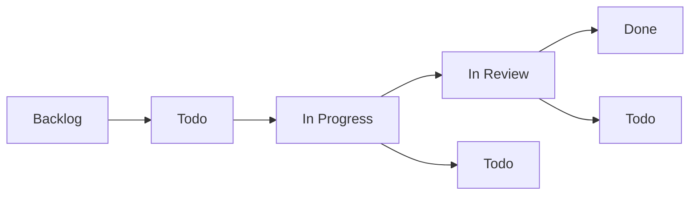
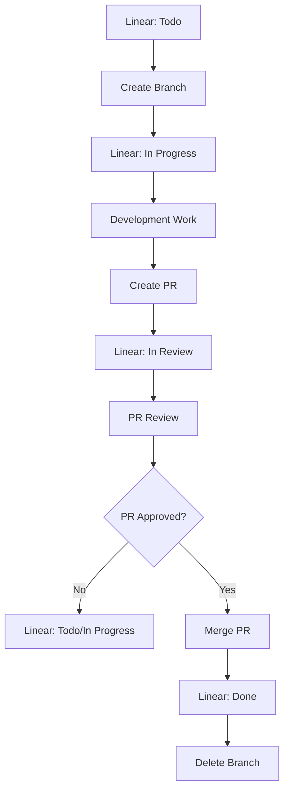
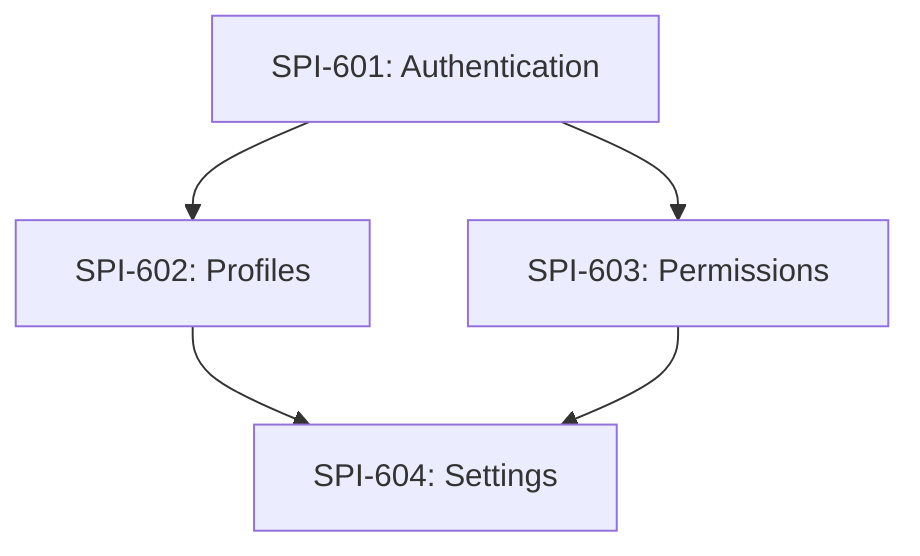

# Linear Branch Integration

This document defines how Linear issues integrate with Git branches, automated status updates, and workflow patterns in CycleTime development.

## Overview

Linear integration ensures that every branch corresponds to a Linear issue, providing clear traceability from requirements to implementation and enabling automated workflow tracking.

## Linear Issue Mapping

### Issue ID Format

Linear issues use the format: `SPI-XXX` where:
- `SPI` = Project identifier (Spiral House Innovations)
- `XXX` = Sequential issue number

Examples:
- `SPI-620` - Documentation standardization
- `SPI-587` - Authentication token expiry
- `SPI-612` - API redesign

### Branch Naming Convention

Branches include the Linear issue ID in lowercase:

```
<type>/spi-<issue-number>-<description>
```

### Mapping Examples

| Linear Issue | Branch Name | Worktree Path |
|--------------|-------------|---------------|
| `SPI-620` | `feat/spi-620-documentation-standards` | `.worktrees/spi-620-docs-standards` |
| `SPI-587` | `fix/spi-587-auth-token-expiry` | `.worktrees/spi-587-auth-fix` |
| `SPI-612` | `feat/spi-612-api-redesign` | `.worktrees/spi-612-api-redesign` |
| `SPI-598` | `test/spi-598-integration-coverage` | `.worktrees/spi-598-test-coverage` |
| `SPI-601` | `chore/spi-601-ci-optimization` | `.worktrees/spi-601-ci-optimization` |

## Status Lifecycle Integration

### Linear Status Progression



### Git Workflow Integration



### Automated Status Updates

#### Manual Updates (Current)

```bash
# Starting work on SPI-620
git checkout -b feat/spi-620-documentation-standards
# → Manually update Linear SPI-620 to "In Progress"

# Creating PR
gh pr create --title "feat: standardize documentation patterns"
# → Manually update Linear SPI-620 to "In Review"

# After PR merge
# → Manually update Linear SPI-620 to "Done"
```

#### Future Automation Opportunities

```bash
# Git hooks for automatic updates
.git/hooks/post-checkout    # → Update to "In Progress"
.git/hooks/pre-push        # → Update to "In Review" if PR exists
.git/hooks/post-merge      # → Update to "Done" if merged to main
```

## Branch Creation Patterns

### Standard Feature Branch

```bash
# From Linear issue SPI-620
git checkout main
git pull origin main
git checkout -b feat/spi-620-documentation-standards

# Update Linear status
# SPI-620: Todo → In Progress
```

### Worktree Feature Branch

```bash
# From Linear issue SPI-612
git worktree add .worktrees/spi-612-api-redesign -b feat/spi-612-api-redesign
cd .worktrees/spi-612-api-redesign

# Update Linear status
# SPI-612: Todo → In Progress
```

### Bug Fix Branch

```bash
# From Linear issue SPI-587 (bug)
git checkout -b fix/spi-587-auth-token-expiry

# Update Linear status
# SPI-587: Todo → In Progress
```

## Linear Issue Requirements

### Issue Creation Standards

Every Linear issue should include:

1. **Clear Title**: Descriptive and actionable
2. **Description**: Detailed problem statement
3. **Acceptance Criteria**: Specific, measurable outcomes
4. **Labels**: Appropriate categorization
5. **Priority**: Business priority level
6. **Estimate**: Complexity points (if applicable)

### Example Linear Issue

```
Title: Standardize branching, worktree, and agent invocation documentation

Description:
The current documentation has inconsistencies and gaps in how we handle
branching, worktrees, and agent invocation patterns...

Acceptance Criteria:
- [ ] All worktree references use consistent `.worktrees/` path
- [ ] Clear distinction between Task tool and Claude CLI agent usage
- [ ] Single-feature workflow documented with examples
- [ ] Branch naming standards include Linear ID integration

Labels: documentation, developer-experience, infrastructure
Priority: Medium
Estimate: 5 points
```

## Branch-to-PR Integration

### PR Creation

```bash
# Create PR with Linear reference
gh pr create \
  --title "feat: standardize documentation patterns (SPI-620)" \
  --body "$(cat <<'EOF'
## Summary
Implements standardized documentation patterns per SPI-620.

## Linear Issue
Fixes SPI-620: https://linear.app/spiral-house/issue/SPI-620/standardize-branching-worktree-and-agent-invocation-documentation

## Changes Made
- Created docs/development/branching-strategy.md
- Created docs/development/agent-invocation-patterns.md
- Updated existing documentation for consistency

## Acceptance Criteria
- [x] All worktree references use consistent `.worktrees/` path
- [x] Clear distinction between Task tool and Claude CLI agent usage
- [x] Single-feature workflow documented with examples
- [x] Branch naming standards include Linear ID integration

## Test Plan
- [ ] All examples work correctly
- [ ] Documentation is consistent across files
- [ ] Patterns are clear and actionable

🤖 Generated with [Claude Code](https://claude.ai/code)

Co-Authored-By: Claude <noreply@anthropic.com>
EOF
)"
```

### PR Template Integration

```markdown
## Linear Issue
Fixes SPI-XXX: [Linear URL]

## Changes Made
- List key changes that address acceptance criteria

## Acceptance Criteria
- [ ] Copy acceptance criteria from Linear issue
- [ ] Check off completed items

## Test Plan
- [ ] Describe how changes were tested
- [ ] Include validation steps
```

## Worktree Management

### Worktree Naming Convention

Worktree directories should be shorter but still traceable:

```bash
# Full branch name: feat/spi-620-documentation-standards
# Worktree path: .worktrees/spi-620-docs-standards

# Pattern: spi-{number}-{short-description}
```

### Directory Structure

```
.worktrees/
├── spi-620-docs-standards/     # SPI-620: Documentation standardization
├── spi-587-auth-fix/           # SPI-587: Authentication bug fix
├── spi-612-api-redesign/       # SPI-612: API redesign
└── spi-598-test-coverage/      # SPI-598: Test coverage improvement
```

### Cleanup Integration

```bash
# After PR merge and Linear issue closure
git worktree remove .worktrees/spi-620-docs-standards
git branch -d feat/spi-620-documentation-standards

# Verify Linear issue is marked "Done"
```

## Multi-Issue Workflows

### Epic and Story Relationships

```
Epic: SPI-600 - User Management System
├── Story: SPI-601 - User Authentication
├── Story: SPI-602 - User Profiles
├── Story: SPI-603 - User Permissions
└── Story: SPI-604 - User Settings
```

### Parallel Development

```bash
# Create worktrees for each story
git worktree add .worktrees/spi-601-auth -b feat/spi-601-user-authentication
git worktree add .worktrees/spi-602-profiles -b feat/spi-602-user-profiles
git worktree add .worktrees/spi-603-permissions -b feat/spi-603-user-permissions

# Work in parallel
cd .worktrees/spi-601-auth && @agent-developer "implement authentication"
cd .worktrees/spi-602-profiles && @agent-developer "implement profiles"
cd .worktrees/spi-603-permissions && @agent-developer "implement permissions"
```

### Dependency Management



Handle dependencies through:
1. **Sequential development**: Complete dependencies first
2. **Mocking**: Mock dependencies during parallel development
3. **Integration branches**: Merge dependencies for testing

## Linear API Integration

### Reading Issue Data

```bash
# Get issue details
linear issue SPI-620

# List team issues
linear issues --team "Spiral House"

# Filter by status
linear issues --status "In Progress"
```

### Updating Issue Status

```bash
# Update status programmatically
linear issue update SPI-620 --status "In Progress"
linear issue update SPI-620 --status "In Review"
linear issue update SPI-620 --status "Done"
```

### Automated Status Updates (Future)

```bash
# Git hook example (.git/hooks/post-checkout)
#!/bin/bash
BRANCH=$(git branch --show-current)
if [[ $BRANCH =~ ^(feat|fix|chore)/spi-([0-9]+) ]]; then
    ISSUE_ID="SPI-${BASH_REMATCH[2]}"
    linear issue update $ISSUE_ID --status "In Progress"
fi
```

## Quality Gates

### Before Creating Branch

- [ ] Linear issue exists with clear requirements
- [ ] Acceptance criteria are defined
- [ ] Issue is assigned and prioritized
- [ ] Dependencies are identified
- [ ] Technical approach is planned

### During Development

- [ ] Branch name matches Linear issue ID
- [ ] Linear status reflects actual progress
- [ ] Commits reference issue ID when relevant
- [ ] Progress updates are communicated

### Before PR Creation

- [ ] All acceptance criteria addressed
- [ ] Linear issue ready for review
- [ ] Implementation matches requirements
- [ ] Testing completed

### Before Merge

- [ ] PR approved by reviewers
- [ ] All checks passing
- [ ] Linear issue acceptance criteria met
- [ ] Ready to close Linear issue

## Integration Examples

### Example 1: Simple Feature

```bash
# Linear: SPI-625 - Add user search functionality
# Status: Todo

# 1. Create branch
git checkout -b feat/spi-625-user-search

# 2. Update Linear status to "In Progress"

# 3. Implement
@agent-developer "Implement user search functionality per SPI-625 requirements"

# 4. Create PR
gh pr create --title "feat: add user search functionality (SPI-625)"

# 5. Update Linear status to "In Review"

# 6. After merge, update Linear to "Done"
```

### Example 2: Bug Fix

```bash
# Linear: SPI-630 - Fix pagination not working
# Status: Todo

# 1. Create branch
git checkout -b fix/spi-630-pagination-bug

# 2. Update Linear status to "In Progress"

# 3. Reproduce and fix
@agent-developer "Reproduce and fix pagination bug described in SPI-630"

# 4. Add tests
@agent-qa "Add regression tests for pagination fix"

# 5. Create PR
gh pr create --title "fix: resolve pagination not working (SPI-630)"

# 6. Update Linear status to "In Review"
```

### Example 3: Parallel Features

```bash
# Epic: SPI-635 - Dashboard improvements
# Stories: SPI-636, SPI-637, SPI-638

# 1. Create parallel worktrees
git worktree add .worktrees/spi-636-charts -b feat/spi-636-dashboard-charts
git worktree add .worktrees/spi-637-filters -b feat/spi-637-dashboard-filters
git worktree add .worktrees/spi-638-export -b feat/spi-638-dashboard-export

# 2. Update all Linear stories to "In Progress"

# 3. Implement in parallel using Claude CLI agents
cd .worktrees/spi-636-charts && claude -p "Implement dashboard charts"
cd .worktrees/spi-637-filters && claude -p "Implement dashboard filters"
cd .worktrees/spi-638-export && claude -p "Implement dashboard export"

# 4. Create PRs for each
# 5. Update Linear stories to "In Review"
# 6. After merges, update to "Done" and close Epic
```

## Best Practices

### Linear Issue Management

1. **One Issue, One Branch**: Each branch addresses exactly one Linear issue
2. **Clear Acceptance Criteria**: Every issue has measurable success criteria
3. **Appropriate Sizing**: Issues are sized appropriately for development cycles
4. **Status Accuracy**: Linear status reflects actual development state
5. **Dependency Tracking**: Related issues are linked appropriately

### Branch Management

1. **Consistent Naming**: Always include Linear issue ID in branch name
2. **Descriptive Names**: Branch names clearly indicate purpose
3. **Clean History**: Maintain clean, logical commit history
4. **Regular Sync**: Keep branches synced with main
5. **Prompt Cleanup**: Delete branches after successful merge

### Workflow Integration

1. **Status Updates**: Keep Linear status current throughout development
2. **Clear PRs**: PR descriptions clearly link to Linear issues
3. **Complete Testing**: Validate all acceptance criteria before merge
4. **Documentation**: Update documentation as needed
5. **Communication**: Communicate blockers and status changes

## Troubleshooting

### Common Issues

#### Linear Issue Not Found
```bash
# Verify issue exists
linear issue SPI-620

# Check issue number and project
# Ensure you have access to the Linear workspace
```

#### Branch Name Conflicts
```bash
# Check existing branches
git branch -a | grep spi-620

# Use alternative naming if needed
git checkout -b feat/spi-620-documentation-standards-v2
```

#### Status Update Failures
```bash
# Verify Linear CLI setup
linear auth

# Check issue exists and you have permissions
linear issue SPI-620

# Update manually via Linear web interface if CLI fails
```

### Recovery Procedures

#### Orphaned Branches
```bash
# Find branches without Linear issues
git branch | grep -v main | while read branch; do
  if [[ $branch =~ spi-([0-9]+) ]]; then
    issue_id="SPI-${BASH_REMATCH[1]}"
    linear issue $issue_id 2>/dev/null || echo "Orphaned branch: $branch"
  fi
done
```

#### Status Mismatches
```bash
# Audit Linear status vs Git state
# Create script to compare branch status with Linear status
# Manually reconcile any mismatches
```

## Integration with Other Workflows

This Linear integration works with:

- **[Branching Strategy](branching-strategy.md)**: Provides the branch naming conventions
- **[Single Feature Workflow](single-feature-workflow.md)**: Integrates status updates throughout development
- **[Parallel Development](../testing/parallel-development.md)**: Supports multiple Linear issues in parallel
- **[Agent Invocation Patterns](agent-invocation-patterns.md)**: Works with both Task tool and Claude CLI agents

## Quick Reference

### Create Branch from Linear Issue
```bash
# Pattern: <type>/spi-<number>-<description>
git checkout -b feat/spi-620-documentation-standards
# Update Linear SPI-620 to "In Progress"
```

### Create Worktree from Linear Issue
```bash
git worktree add .worktrees/spi-620-docs-standards -b feat/spi-620-documentation-standards
cd .worktrees/spi-620-docs-standards
# Update Linear SPI-620 to "In Progress"
```

### Create PR with Linear Reference
```bash
gh pr create --title "feat: implement feature (SPI-XXX)" --body "Fixes SPI-XXX: [Linear URL]"
# Update Linear SPI-XXX to "In Review"
```

### Complete Work
```bash
# After PR merge
git worktree remove .worktrees/spi-620-docs-standards  # if using worktree
git branch -d feat/spi-620-documentation-standards
# Update Linear SPI-620 to "Done"
```

This integration ensures clear traceability from requirements to implementation while supporting both single and parallel development workflows.