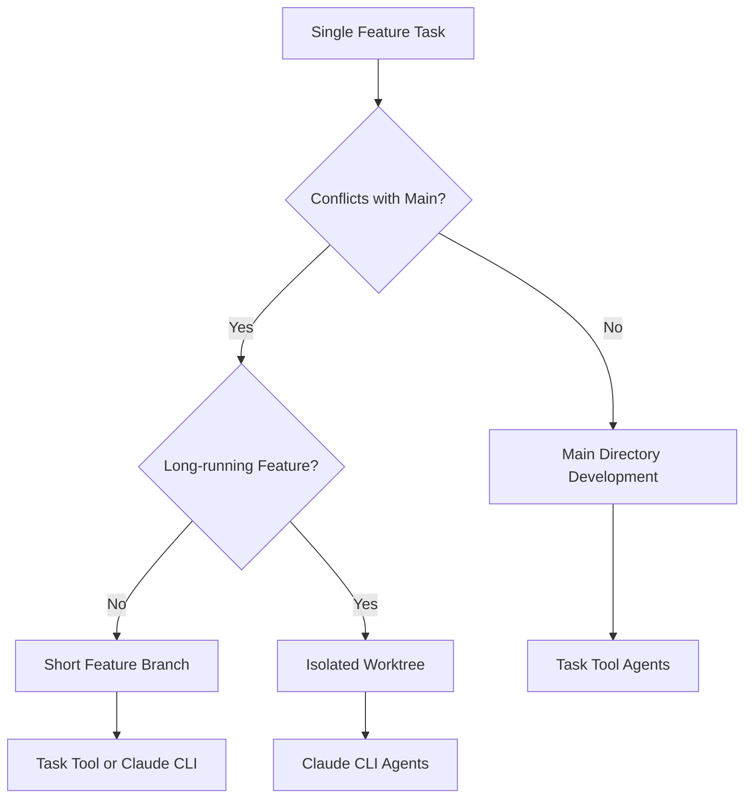

# Single Feature Workflow

This document describes the standard workflow for developing single features in CycleTime, covering both main directory development and isolated worktree development patterns.

## Overview

Single feature development is the most common workflow in CycleTime. It focuses on implementing one feature, bug fix, or improvement at a time with clear Linear issue tracking and proper branching.

## Workflow Decision

### Main Directory vs Worktree



### Decision Criteria

#### Use Main Directory When:
- Small features or bug fixes
- Low conflict probability
- Quick implementation (< 1 day)
- Documentation updates
- Test additions
- Configuration changes

#### Use Worktree When:
- Large features (multiple days)
- Database schema changes
- Architectural modifications
- Experimental work
- Need to preserve main for demos
- High conflict probability

## Main Directory Workflow

### Standard Process

1. **Start from Latest Main**
   ```bash
   git checkout main
   git pull origin main
   ```

2. **Create Feature Branch**
   ```bash
   git checkout -b feat/spi-620-documentation-standards
   ```

3. **Update Linear Status**
   ```bash
   # Update SPI-620 status to "In Progress"
   ```

4. **Implement Feature** (Task Tool Agents)
   ```
   @agent-developer "Implement documentation standardization patterns according to SPI-620 requirements"
   ```

5. **Iterative Development**
   ```
   @agent-code-reviewer "Review implementation for consistency and completeness"
   @agent-developer "Refine based on review feedback"
   ```

6. **Validate Implementation**
   ```
   @agent-qa "Test the documentation patterns and validate examples work correctly"
   ```

7. **Final Review**
   ```
   @agent-code-reviewer "Perform final code review before PR creation"
   ```

8. **Create Pull Request**
   ```bash
   git push -u origin feat/spi-620-documentation-standards
   gh pr create --title "feat: standardize documentation patterns" --body "$(cat <<'EOF'
   ## Summary
   - Implements standardized documentation patterns per SPI-620
   - Creates consistent branching and worktree strategies
   - Adds agent invocation guidance

   ## Changes Made
   - Created docs/development/branching-strategy.md
   - Created docs/development/agent-invocation-patterns.md
   - Updated existing documentation for consistency

   ## Test Plan
   - [ ] All examples work correctly
   - [ ] Documentation is consistent across files
   - [ ] Patterns are clear and actionable

   🤖 Generated with [Claude Code](https://claude.ai/code)

   Co-Authored-By: Claude <noreply@anthropic.com>
   EOF
   )"
   ```

9. **Update Linear Status**
   ```bash
   # Update SPI-620 status to "In Review"
   ```

### Example: Bug Fix Workflow

```bash
# 1. Start from main
git checkout main && git pull origin main

# 2. Create fix branch
git checkout -b fix/spi-587-auth-token-expiry

# 3. Implement fix with Task Tool
@agent-developer "Fix authentication token expiry issue in SPI-587. Token should refresh automatically before expiration."

# 4. Add tests
@agent-qa "Add regression tests for token expiry fix to prevent future occurrences"

# 5. Review implementation
@agent-code-reviewer "Review the token expiry fix for security and correctness"

# 6. Create PR
git push -u origin fix/spi-587-auth-token-expiry
gh pr create --title "fix: resolve authentication token expiry issue"
```

## Isolated Worktree Workflow

### When to Use Worktrees for Single Features

Use worktrees when you need:
- Isolation from main branch
- Long-running development
- Experimental approaches
- Database schema changes
- Major refactoring work

### Process

1. **Create Feature Worktree**
   ```bash
   git worktree add .worktrees/spi-612-api-redesign -b feat/spi-612-api-redesign
   cd .worktrees/spi-612-api-redesign
   ```

2. **Install Dependencies**
   ```bash
   npm install
   ```

3. **Update Linear Status**
   ```bash
   # Update SPI-612 status to "In Progress"
   ```

4. **Choose Agent Approach**

   **Option A: Task Tool Agents (Interactive)**
   ```
   @agent-software-architect "Design new API structure for SPI-612 requirements"
   @agent-developer "Implement the new API design"
   ```

   **Option B: Claude CLI Agent (Automated)**
   ```bash
   claude -p "Implement comprehensive API redesign according to SPI-612 requirements. Include proper error handling, validation, and documentation." \
     --append-system-prompt "$(cat .claude/prompts/task-agent.txt)" \
     --permission-mode bypassPermissions \
     --output-format stream-json \
     --verbose
   ```

5. **Testing and Validation**
   ```bash
   # Run tests in worktree
   npm run test

   # Add additional tests if needed
   @agent-qa "Add comprehensive test coverage for the new API design"
   ```

6. **Create Pull Request**
   ```bash
   git push -u origin feat/spi-612-api-redesign
   gh pr create --title "feat: redesign API structure for better usability"
   ```

7. **Cleanup After Merge**
   ```bash
   # Return to main
   cd ../../

   # Remove worktree after PR merge
   git worktree remove .worktrees/spi-612-api-redesign
   git branch -d feat/spi-612-api-redesign
   ```

## Agent Selection Guidelines

### Task Tool Agents (Recommended for Single Features)

**Best for:**
- Interactive development
- Iterative refinement
- Complex problem-solving
- Architecture decisions
- Code reviews

**Usage Pattern:**
```
@agent-developer "Initial implementation"
# Review and provide feedback
@agent-developer "Refine based on requirements"
@agent-code-reviewer "Final review"
```

### Claude CLI Agents

**Best for:**
- Well-defined tasks
- Automated implementation
- Background processing
- Batch operations

**Usage Pattern:**
```bash
claude -p "Complete task description with all requirements" \
  --append-system-prompt "$(cat .claude/prompts/task-agent.txt)" \
  --permission-mode bypassPermissions \
  --output-format stream-json \
  --verbose
```

## Linear Integration

### Status Management

Track feature progress through Linear status updates:

1. **Planning** → Status: `Todo`
2. **Implementation Start** → Status: `In Progress`
3. **PR Creation** → Status: `In Review`
4. **PR Merge** → Status: `Done`

### Branch Naming Integration

Ensure branch names match Linear issue IDs:

```bash
# Linear Issue: SPI-620
# Branch: feat/spi-620-documentation-standards
# Worktree: .worktrees/spi-620-documentation-standards
```

### Automated Updates

Consider automating status updates:

```bash
# Start work
git checkout -b feat/spi-620-feature
# → Auto-update Linear SPI-620 to "In Progress"

# Create PR
gh pr create --title "feat: implement feature"
# → Auto-update Linear SPI-620 to "In Review"
```

## Quality Gates

### Before Implementation
- [ ] Linear issue has clear acceptance criteria
- [ ] Requirements are well understood
- [ ] Technical approach is planned
- [ ] Dependencies are identified

### During Implementation
- [ ] Code follows project patterns
- [ ] Tests are written alongside code
- [ ] Commits are logical and atomic
- [ ] Regular progress updates

### Before PR Creation
- [ ] All tests pass
- [ ] Code is reviewed (by agent or human)
- [ ] Documentation is updated
- [ ] Linear issue acceptance criteria met

### Before Merge
- [ ] PR has been reviewed
- [ ] CI/CD checks pass
- [ ] No merge conflicts
- [ ] Linear issue ready to close

## Common Patterns

### Pattern 1: Simple Feature
```
1. git checkout -b feat/spi-xxx-simple-feature
2. @agent-developer "implement simple feature"
3. @agent-qa "add tests for simple feature"
4. git push && gh pr create
```

### Pattern 2: Complex Feature
```
1. git worktree add .worktrees/spi-xxx-complex -b feat/spi-xxx-complex
2. cd .worktrees/spi-xxx-complex
3. @agent-software-architect "design complex feature architecture"
4. @agent-developer "implement according to design"
5. @agent-qa "comprehensive testing"
6. @agent-code-reviewer "final review"
7. git push && gh pr create
```

### Pattern 3: Bug Fix
```
1. git checkout -b fix/spi-xxx-bug-description
2. @agent-developer "reproduce and fix bug"
3. @agent-qa "add regression tests"
4. @agent-code-reviewer "review fix"
5. git push && gh pr create
```

### Pattern 4: Documentation
```
1. git checkout -b docs/spi-xxx-documentation
2. @agent-developer "create/update documentation"
3. @agent-code-reviewer "review for clarity and accuracy"
4. git push && gh pr create
```

## Best Practices

### Git Workflow
1. **Always start from latest main**
2. **Use descriptive commit messages**
3. **Make atomic commits**
4. **Rebase if history is messy**
5. **Delete branches after merge**

### Agent Usage
1. **Be specific in task descriptions**
2. **Iterate based on feedback**
3. **Use appropriate agent types**
4. **Review agent outputs**
5. **Test agent implementations**

### Linear Integration
1. **Keep issue status updated**
2. **Link PRs to issues**
3. **Update acceptance criteria**
4. **Close issues when complete**
5. **Use consistent naming**

### Code Quality
1. **Follow project conventions**
2. **Write tests alongside code**
3. **Document complex decisions**
4. **Review before committing**
5. **Ensure CI passes**

## Troubleshooting

### Common Issues

#### Branch Conflicts
```bash
# Sync with latest main
git checkout main && git pull origin main
git checkout feat/spi-xxx-feature
git rebase main
```

#### Failed Tests
```bash
# Run tests locally
npm run test

# Fix issues
@agent-developer "fix failing tests while maintaining functionality"

# Re-run tests
npm run test
```

#### Merge Conflicts
```bash
# Pull latest main
git checkout main && git pull origin main
git checkout feat/spi-xxx-feature

# Rebase onto main
git rebase main

# Resolve conflicts
@agent-developer "resolve merge conflicts while preserving feature functionality"
```

#### Linear Integration Issues
```bash
# Verify issue exists
# Check branch naming matches Linear ID
# Update Linear status manually if automation fails
```

## Integration with Other Workflows

This single feature workflow integrates with:

- **[Branching Strategy](branching-strategy.md)**: Uses standard branch naming and worktree patterns
- **[Agent Invocation Patterns](agent-invocation-patterns.md)**: Primarily uses Task tool agents
- **[Linear Integration](linear-branch-integration.md)**: Follows Linear issue lifecycle
- **[Parallel Development](../testing/parallel-development.md)**: Can scale to parallel when needed

## Quick Reference

### Main Directory Development
```bash
git checkout main && git pull origin main
git checkout -b feat/spi-xxx-feature
@agent-developer "implement feature"
git push -u origin feat/spi-xxx-feature
gh pr create
```

### Worktree Development
```bash
git worktree add .worktrees/spi-xxx-feature -b feat/spi-xxx-feature
cd .worktrees/spi-xxx-feature
npm install
@agent-developer "implement feature"
git push -u origin feat/spi-xxx-feature
gh pr create
cd ../../ && git worktree remove .worktrees/spi-xxx-feature
```

### Agent Commands
```
# Development
@agent-developer "task description"

# Testing
@agent-qa "testing requirements"

# Review
@agent-code-reviewer "review requirements"

# Architecture
@agent-software-architect "design requirements"
```

This workflow provides a structured, predictable approach to single feature development while maintaining flexibility for different feature types and complexity levels.