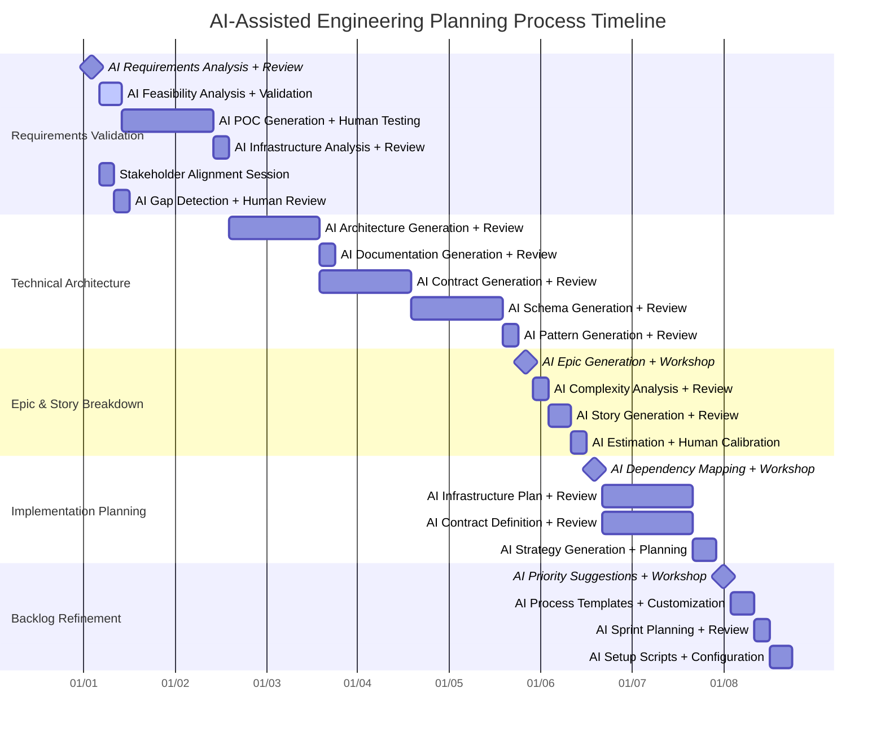

# Engineering Planning Process: From PRD to Backlog

## Overview

This document defines our systematic process for transforming Product Requirements Documents (PRDs) into well-defined engineering backlogs ready for implementation. This process ensures consistent quality, reduces implementation risks, and enables efficient parallel development.

### Process Goals

- **Reduce planning time** from weeks to days through AI-assisted systematic approaches
- **Minimize integration risks** by establishing clear contracts and dependencies upfront
- **Enable parallel development** through well-defined system boundaries
- **Maintain documentation quality** that stays synchronized with actual implementation
- **Ensure implementable stories** with clear acceptance criteria and testable conditions
- **Leverage AI efficiency** while maintaining human oversight and decision-making authority

### Process Overview

| Phase | Duration | Stakeholders | Deliverables |
|-------|----------|--------------|-------------|
| Requirements Validation | 2-3 Days | PM, EM, Senior Dev, AI | Validated requirements, technical feasibility |
| Technical Architecture | 3-4 Days | EM, Senior Dev, Architect, AI | Architecture docs, API contracts |
| Epic & Story Breakdown | 1-2 Days | EM, Senior Dev, AI | Epics, user stories, estimates |
| Implementation Planning | 2-3 Days | Full Dev Team, AI | Dependency maps, sprint plans |
| Backlog Refinement | 1-2 Days | Full Team, AI | Ready backlog, Sprint 0 plan |

### Process Timeline



## Phase 1: Requirements Validation & Technical Analysis (2-3 Days)

### Objectives
- Validate technical feasibility of PRD requirements
- Identify and resolve ambiguous requirements
- Establish performance benchmarks
- Confirm integration constraints

### Activities

#### 1.1 AI-Assisted Technical Feasibility Review
**Participants:** Engineering Manager, Senior Developers, Technical Architect, AI Assistant

**Process:**
1. **AI Requirements Analysis + Human Review** (4 hours total)
   - AI analyzes PRD technical requirements against existing system architecture (30 minutes)
   - Human experts review AI analysis and validate findings (2 hours)
   - Team discussion to address AI-identified challenges and bottlenecks (1.5 hours)
   - Document architectural assumptions and decisions

2. **AI Feasibility Analysis + Validation** (6 hours total)
   - AI generates feasibility assessment for high-risk technical components (1 hour)
   - AI suggests validation approaches for integrations (30 minutes)
   - Human experts review and test AI recommendations (4 hours)
   - Measure performance baseline with AI-generated benchmarks (30 minutes)

3. **AI POC Generation + Human Testing** (1 day total)
   - AI generates minimal POC code for critical components (1 hour)
   - Human developers test and validate AI-generated POCs (6 hours)
   - Iterate on AI suggestions based on testing results (1 hour)

4. **AI Infrastructure Analysis + Review** (4 hours total)
   - AI analyzes hosting, deployment, and CI/CD requirements (1 hour)
   - AI estimates infrastructure costs and scaling needs (30 minutes)
   - Human experts review and validate AI infrastructure recommendations (2.5 hours)

#### 1.2 AI-Assisted Requirements Clarification
**Participants:** Product Manager, Engineering Manager, AI Assistant

**Process:**
1. **Stakeholder Alignment Session** (4 hours total)
   - Review MVP scope boundaries and success metrics
   - Clarify acceptance criteria and performance requirements
   - Align on timeline expectations and constraints
   - Validate AI analysis findings with business stakeholders

2. **AI Gap Detection + Human Review** (4 hours total)
   - AI analyzes PRD for ambiguous functional requirements (15 minutes)
   - AI identifies missing non-functional requirements (15 minutes)
   - AI highlights unclear integration requirements and edge cases (15 minutes)
   - Human experts review AI findings and add business context (2 hours)
   - Document clarifications and decisions (1.25 hours)

### Deliverables
- **Technical Feasibility Report** (`/docs/technical-designs/feasibility-analysis.md`)
- **Requirements Clarification Document** (`/docs/requirements/requirements-clarifications.md`)
- **Performance Benchmark Baseline** (`/docs/requirements/performance-requirements.md`)

## Phase 2: Technical Architecture & Design (3-4 Days)

### Objectives
- Define detailed system architecture
- Create API contracts and data models
- Establish service boundaries and interfaces
- Document security architecture

### Activities

#### 2.1 AI-Assisted System Architecture Definition
**Participants:** Technical Architect, Senior Developers, AI Assistant

**Process:**
1. **AI Architecture Generation + Review Sessions** (1 day total)
   - AI generates multiple architectural options with component boundaries (2 hours)
   - AI creates data flow and integration patterns (1 hour)
   - AI proposes security architecture and deployment strategies (1 hour)
   - Human architects review, refine, and select optimal approach (4 hours)

2. **AI Documentation Generation + Review** (4 hours total)
   - AI creates system architecture diagrams and documentation (1 hour)
   - AI defines component responsibilities and interfaces (30 minutes)
   - AI documents data flow patterns and deployment architecture (30 minutes)
   - Human review and refinement of AI-generated documentation (2 hours)

#### 2.2 AI-Assisted Technical Design Documents
**Participants:** Senior Developers, Technical Architect, AI Assistant

**Process:**
1. **AI Contract Generation + Review** (1 day total)
   - AI creates OpenAPI/GraphQL specifications from architecture (1 hour)
   - AI defines request/response schemas and authentication patterns (1 hour)
   - AI establishes versioning and governance strategies (30 minutes)
   - Human developers review and refine API contracts (4.5 hours)

2. **AI Schema Generation + Review** (1 day total)
   - AI designs database schemas from data requirements (1 hour)
   - AI defines migration strategies and validation rules (1 hour)
   - AI establishes data governance patterns (30 minutes)
   - Human experts review and optimize schema designs (4.5 hours)

3. **AI Pattern Generation + Review** (4 hours total)
   - AI designs integration patterns and error handling strategies (1 hour)
   - AI documents monitoring, observability, and circuit breaker patterns (30 minutes)
   - Human architects review and validate integration approaches (2.5 hours)

### Deliverables
- **System Architecture Document** (`/docs/architecture/system-architecture.md`)
- **API Specifications** (`/docs/contracts/api-specifications/`)
- **Database Schema Design** (`/docs/technical-designs/database-schema.md`)
- **Integration Architecture** (`/docs/architecture/integration-patterns.md`)

## Phase 3: Epic & Story Breakdown (1-2 Days)

### Objectives
- Map P0 features to engineering epics
- Decompose epics into implementable user stories
- Estimate complexity and effort
- Identify cross-epic dependencies

### Activities

#### 3.1 AI-Assisted Epic Definition
**Participants:** Product Manager, Engineering Manager, Senior Developers, AI Assistant

**Process:**
1. **AI Epic Generation + Workshop** (4 hours total)
   - AI analyzes P0 features and generates epic structure (30 minutes)
   - AI defines epic boundaries, scope, and success criteria (30 minutes)
   - AI identifies epic-level dependencies and relationships (15 minutes)
   - Human team reviews and refines AI-generated epic structure (2.75 hours)

2. **AI Complexity Analysis + Review** (4 hours total)
   - AI performs T-shirt sizing and complexity assessment (15 minutes)
   - AI identifies high-risk epics and breakdown requirements (15 minutes)
   - AI documents assumptions, constraints, and delivery sequencing (15 minutes)
   - Human experts review and validate AI complexity analysis (3.25 hours)

#### 3.2 AI-Assisted Story Decomposition
**Participants:** Senior Developers, Engineering Manager, AI Assistant

**Process:**
1. **AI Story Generation + Review** (6 hours total)
   - AI breaks epics into implementable user stories with standard template (30 minutes)
   - AI defines acceptance criteria with testable conditions (30 minutes)
   - AI identifies technical debt and infrastructure stories (15 minutes)
   - Human developers review and refine AI-generated stories (4.75 hours)

2. **AI Estimation + Human Calibration** (4 hours total)
   - AI performs initial estimation using Planning Poker and Fibonacci scale (15 minutes)
   - AI establishes story point baseline and documents rationale (15 minutes)
   - AI flags stories requiring further breakdown (10 minutes)
   - Human team calibrates and validates AI estimations (3.33 hours)

### Story Template

```markdown
**Story:** [Brief description]
**As a** [user role]
**I want** [functionality]
**So that** [business value]

**Acceptance Criteria:**
- [ ] [Testable condition 1]
- [ ] [Testable condition 2]
- [ ] [Testable condition 3]

**Definition of Done:**
- [ ] Unit tests with 90%+ coverage
- [ ] Integration tests passing
- [ ] Code review completed
- [ ] Documentation updated
- [ ] Security review (if applicable)
- [ ] Performance requirements met

**Story Points:** [1, 2, 3, 5, 8, 13]
**Dependencies:** [List dependent stories]
**Technical Notes:** [Implementation guidance]
```

### Deliverables
- **Epic Definitions** (`/docs/requirements/epics/`)
- **User Stories** (Created in Linear with links to documentation)
- **Story Estimation Results** (`/docs/requirements/story-estimates.md`)
- **Cross-Epic Dependency Map** (`/docs/requirements/epic-dependencies.md`)

## Phase 4: Implementation Planning (2-3 Days)

### Objectives
- Create detailed dependency graphs
- Plan infrastructure and foundational work
- Define integration points and contracts
- Prepare for sprint planning

### Activities

#### 4.1 AI-Assisted Dependency Mapping
**Participants:** Engineering Manager, Senior Developers, AI Assistant

**Process:**
1. **AI Dependency Mapping + Workshop** (4 hours total)
   - AI creates story-level dependency graph (30 minutes)
   - AI identifies critical path and blocking dependencies (30 minutes)
   - AI plans optimal parallel work streams (15 minutes)
   - Human team reviews and validates AI dependency analysis (2.75 hours)

2. **AI Infrastructure Plan + Review** (1 day total)
   - AI identifies foundational technical work and migration needs (1 hour)
   - AI designs CI/CD pipeline updates and monitoring strategy (1 hour)
   - AI creates infrastructure implementation roadmap (30 minutes)
   - Human engineers review and refine infrastructure plans (4.5 hours)

#### 4.2 AI-Assisted Contract-First Development Planning
**Participants:** Senior Developers, Technical Architect, AI Assistant

**Process:**
1. **AI Contract Definition + Review** (1 day total)
   - AI creates detailed API contracts for each service boundary (1 hour)
   - AI defines data contracts, message schemas, and testing contracts (1 hour)
   - AI documents mock/stub requirements and validation strategies (30 minutes)
   - Human architects review and refine AI-generated contracts (4.5 hours)

2. **AI Strategy Generation + Planning** (6 hours total)
   - AI plans team assignments to minimize dependencies (30 minutes)
   - AI defines handoff points and integration testing schedule (30 minutes)
   - AI establishes contract validation checkpoints (15 minutes)
   - Human managers review and optimize AI development strategy (4.75 hours)

### Deliverables
- **Story Dependency Graph** (`/docs/requirements/story-dependencies.md`)
- **Infrastructure Roadmap** (`/docs/technical-designs/infrastructure-plan.md`)
- **Service Contracts** (`/docs/contracts/service-contracts/`)
- **Parallel Development Plan** (`/docs/requirements/parallel-development-strategy.md`)

## Phase 5: Backlog Refinement & Sprint Planning (1-2 Days)

### Objectives
- Create refined product backlog with ready stories
- Establish backlog management processes
- Plan Sprint 0 infrastructure work
- Set up development processes and quality gates

### Activities

#### 5.1 AI-Assisted Backlog Organization
**Participants:** Product Manager, Engineering Manager, Scrum Master, AI Assistant

**Process:**
1. **AI Priority Suggestions + Workshop** (4 hours total)
   - AI orders stories by business value and dependencies (15 minutes)
   - AI identifies MVP boundary and release milestones (15 minutes)
   - AI suggests backlog refinement cadence (10 minutes)
   - Human team reviews and validates AI prioritization (3.33 hours)

2. **AI Process Templates + Customization** (6 hours total)
   - AI generates Definition of Ready criteria and template standards (30 minutes)
   - AI sets up estimation baseline and backlog procedures (30 minutes)
   - AI creates team-specific process documentation (30 minutes)
   - Human team customizes and validates AI-generated processes (4.5 hours)

#### 5.2 AI-Assisted Sprint 0 Planning
**Participants:** Full Development Team, AI Assistant

**Process:**
1. **AI Sprint Planning + Review** (4 hours total)
   - AI plans development environment setup and CI/CD implementation (30 minutes)
   - AI establishes monitoring, logging, and foundational code structure (30 minutes)
   - AI creates Sprint 0 task breakdown and timeline (15 minutes)
   - Human team reviews and refines AI sprint planning (2.75 hours)

2. **AI Setup Scripts + Configuration** (6 hours total)
   - AI generates development tool configurations and workflows (1 hour)
   - AI creates code review processes and testing framework setup (1 hour)
   - AI documents team working agreements and standards (30 minutes)
   - Human team validates and configures AI-generated setups (3.5 hours)

### Deliverables
- **Prioritized Product Backlog** (In Linear with documentation links)
- **Backlog Management Process** (`/docs/development/backlog-process.md`)
- **Sprint 0 Plan** (`/docs/requirements/sprint-0-plan.md`)
- **Team Working Agreements** (`/docs/development/team-agreements.md`)

## Quality Gates and Success Criteria

### Requirements Validation Gate
- [ ] All PRD ambiguities resolved and documented
- [ ] Technical feasibility confirmed with POCs
- [ ] Performance benchmarks established
- [ ] Integration constraints validated

### Architecture Design Gate
- [ ] System architecture reviewed and approved
- [ ] API contracts defined and validated
- [ ] Security architecture documented
- [ ] Integration patterns established

### Story Readiness Gate
- [ ] All epics broken down into estimable stories
- [ ] Stories meet Definition of Ready criteria
- [ ] Dependencies mapped and documented
- [ ] Team capacity planning completed

### Sprint Readiness Gate
- [ ] Sprint 0 infrastructure work planned
- [ ] Development processes established
- [ ] Quality gates and CI/CD configured
- [ ] Team ready to begin development

## Change Management During Development

### Overview

While the systematic planning process minimizes surprises, new features and requirements inevitably emerge during development. This section defines how to handle changes that arise after Sprint 0, ensuring minimal disruption while maintaining project quality and team productivity.

### Change Management Principles

1. **Human Control**: All significant changes require explicit stakeholder approval
2. **Impact Transparency**: Full cost and timeline implications must be clear before decisions
3. **Quality Protection**: Changes cannot compromise existing quality gates or standards
4. **Team Stability**: Frequent changes that disrupt team productivity must be actively managed
5. **Documentation Currency**: All changes must be reflected in living documentation

### Change Classification Framework

#### Level 1: Minor Enhancements (Can be absorbed within current sprint)
- **Criteria**: 
  - No new dependencies or API changes
  - Can be completed within existing story estimates
  - No impact on other teams or parallel development
  - Maintains existing contracts and system boundaries
- **Examples**: UI improvements, error message updates, minor validation changes
- **Approval Required**: Engineering Manager + Senior Developer
- **Timeline**: Immediate consideration

#### Level 2: Significant Features (Require re-planning and stakeholder approval)
- **Criteria**:
  - Requires new stories or epic modifications
  - Creates new dependencies or affects existing ones
  - Impacts timeline or resource allocation
  - May affect API contracts but not break existing implementations
- **Examples**: New API endpoints, additional integrations, expanded functionality
- **Approval Required**: Product Manager + Engineering Manager + affected stakeholders
- **Timeline**: 2-5 business days for decision

#### Level 3: Breaking Changes (Affect existing contracts and parallel development)
- **Criteria**:
  - Breaks existing API contracts other teams depend on
  - Requires architectural changes affecting multiple components
  - Significantly impacts project timeline or scope
  - Affects external commitments or customer-facing features
- **Examples**: API breaking changes, database schema modifications, architecture pivots
- **Approval Required**: Technical Architect + Engineering Director + Product Owner
- **Timeline**: 1-2 weeks for full assessment and decision

### Impact Assessment Process

#### Step 1: Initial Change Analysis (< 2 hours)
**Responsible**: Senior Developer + Engineering Manager

**Analysis Template**:
```markdown
## Change Request: [Brief Description]
**Requested by**: [Stakeholder]
**Date**: [Request Date]
**Classification**: [Level 1/2/3]

### Business Justification
- **Problem Statement**: Why is this needed now?
- **Business Impact**: Revenue, customer, competitive implications
- **Urgency**: Why can't this wait for next planning cycle?

### Technical Analysis
- **Affected Components**: [List systems/services impacted]
- **Dependency Impact**: [New/modified dependencies]
- **Contract Changes**: [API/data contract modifications needed]
- **Architecture Impact**: [System design changes required]

### Resource Impact
- **Story Point Estimate**: [Initial estimate for new/modified work]
- **Timeline Impact**: [Effect on current milestones]
- **Team Assignment**: [Which teams/developers affected]
- **Blocked Work**: [What work must be paused/modified]

### Risk Assessment
- **Technical Risks**: [Implementation and integration risks]
- **Schedule Risks**: [Timeline and dependency risks]
- **Quality Risks**: [Testing and quality assurance implications]
```

#### Step 2: Detailed Impact Assessment (1-3 days for Level 2/3 changes)
**Responsible**: Technical Architect + affected Senior Developers

**Deep Analysis**:
1. **Dependency Ripple Analysis**
   - Map all affected stories and epics
   - Identify critical path modifications
   - Assess parallel development impact
   - Calculate cascading effects

2. **Contract Compliance Review**
   - Analyze existing API contracts affected
   - Identify breaking vs non-breaking changes
   - Plan contract versioning strategy
   - Assess integration testing implications

3. **Resource Reallocation Planning**
   - Identify work that must be delayed/cancelled
   - Calculate opportunity cost of change
   - Plan team reassignment strategy
   - Estimate new completion timeline

### Decision-Making Workflow

#### Level 1 Changes: Engineering Decision
1. **Assessment** (Same day): Senior Developer analyzes impact
2. **Decision** (Same day): Engineering Manager approves/rejects
3. **Implementation** (Same sprint): Add to current sprint if capacity allows
4. **Documentation** (Same day): Update story details in Linear

#### Level 2 Changes: Stakeholder Approval Required
1. **Assessment** (1-2 days): Complete impact analysis template
2. **Stakeholder Review** (1-2 days): PM, EM, and affected teams review
3. **Decision Meeting** (1 hour): Stakeholders decide go/no-go
4. **Planning Update** (2-3 days): Update documentation, stories, and timeline
5. **Team Communication** (Same day): Notify all affected teams

#### Level 3 Changes: Executive Review Process
1. **Comprehensive Assessment** (3-5 days): Full technical and business analysis
2. **Architecture Review** (2-3 days): Technical Architect evaluates design impact
3. **Executive Briefing** (Prepared document): Business case and technical implications
4. **Decision Committee** (1-week maximum): Engineering Director + Product Owner decide
5. **Change Implementation Plan** (1-2 weeks): Detailed implementation strategy
6. **All-Hands Communication** (Same day): Notify all stakeholders

### Implementation of Approved Changes

#### Documentation Update Process
1. **Branch Strategy**: Create `change/[change-id]-[description]` branch
2. **Update Sequence**:
   - Update PRD with change rationale (`/docs/requirements/PRD-updates.md`)
   - Modify affected technical designs (`/docs/technical-designs/`)
   - Update API contracts if needed (`/docs/contracts/`)
   - Revise project plan and milestones (`/docs/mvp-project-plan.md`)
   - Update dependency maps (`/docs/requirements/epic-dependencies.md`)

#### Story and Epic Management
1. **Linear Updates**:
   - Create new stories for additional work using standard template
   - Modify existing story acceptance criteria if needed
   - Update story point estimates and dependencies
   - Link all changes to change request Linear issue
   - Update epic scope and timelines

2. **Sprint Planning Adjustments**:
   - Remove stories that must be delayed to accommodate change
   - Re-estimate affected stories already in progress
   - Plan integration points for new work
   - Update sprint goals and commitments

#### Contract Change Management
1. **API Versioning Strategy**:
   - Create new API versions for breaking changes
   - Maintain backward compatibility where possible
   - Document deprecation timeline for old versions
   - Update integration tests for new contracts

2. **Team Coordination**:
   - Notify dependent teams of contract changes immediately
   - Provide updated mock/stub implementations
   - Schedule integration testing sessions
   - Plan coordinated deployment if needed

### Communication Protocols

#### Notification Matrix

| Stakeholder             | Level 1      | Level 2                 | Level 3         |
|-------------------------|--------------|-------------------------|-----------------|
| Affected Developers     | Immediate    | Within 4 hours          | Same day        |
| Engineering Manager     | Immediate    | Immediate               | Immediate       |
| Product Manager         | End of day   | Within 2 hours          | Immediate       |
| Technical Architect     | Not required | Within 4 hours          | Immediate       |
| Other Teams             | If dependent | Within 24 hours         | Same day        |
| Engineering Director    | Not required | If timeline affected    | Within 4 hours  |
| External Stakeholders   | Not required | If commitments affected | Within 24 hours |

#### Communication Templates

**Level 1 Change Notification** (Slack/Teams):
```
🔄 Minor Change Approved: [Brief description]
- Sprint: [Current sprint]
- Impact: [Brief impact statement]
- Stories: [Linear links]
- Questions: @[Engineering Manager]
```

**Level 2 Change Notification** (Email + Slack):
```
Subject: Change Approved: [Feature name] - Timeline Impact

Hi Team,

We've approved a mid-development change request with the following details:

**Change**: [Description]
**Business Justification**: [Why now]
**Timeline Impact**: [New dates/milestones]
**Affected Work**: [What's being delayed/modified]
**Next Steps**: [Immediate actions needed]

Full details: [Linear change request link]
Questions: [Contact information]
```

**Level 3 Change Notification** (All-hands communication):
```
Subject: Significant Project Change: [Change name]

Team,

We've made a strategic decision to implement [change description] that will affect our current project timeline and scope.

**Background**: [Business context]
**Change Details**: [Technical scope]
**Timeline Impact**: [Revised milestones]
**Resource Impact**: [Team/priority changes]
**Quality Assurance**: [How we maintain standards]

We'll hold a team meeting on [date] to discuss implementation details and address questions.

Documentation: [Change package link]
```

### Quality Assurance During Changes

#### Maintaining Quality Gates
1. **Definition of Done**: All new/modified stories must meet existing DoD criteria
2. **Testing Requirements**: Changes cannot reduce test coverage below team standards
3. **Code Review**: All change-related code follows standard review process
4. **Security Review**: Changes affecting authentication, authorization, or data handling require security review
5. **Performance Testing**: Changes affecting system performance require performance validation

#### Change-Specific Quality Checks
1. **Contract Compliance**: Automated testing of API contract compliance
2. **Integration Testing**: Comprehensive testing of affected integration points
3. **Regression Testing**: Ensure changes don't break existing functionality
4. **Documentation Review**: All documentation updates reviewed for accuracy and completeness

#### Sprint Protection Policies
1. **Mid-Sprint Changes**: Level 1 only, and only with team capacity buffer
2. **Sprint Boundary Protection**: No Level 2/3 changes in last 2 days of sprint
3. **Change Velocity Limits**: Maximum 1 Level 2 change per sprint, Level 3 changes require sprint break
4. **Team Consensus**: Changes affecting multiple developers require team buy-in

### Rollback and Mitigation Procedures

#### When Changes Go Wrong
1. **Immediate Assessment** (< 4 hours):
   - Identify what's not working as expected
   - Assess impact on project timeline and quality
   - Determine if issue can be fixed or requires rollback

2. **Rollback Decision Criteria**:
   - Change introduces critical bugs that can't be fixed within 1 sprint
   - Change creates architectural problems affecting multiple teams
   - Change significantly exceeds estimated effort (>50% over estimate)
   - Change negatively impacts team productivity or morale

3. **Rollback Process**:
   - Immediate stakeholder notification
   - Revert documentation to previous state
   - Restore previous sprint plans and story assignments
   - Communicate lessons learned to prevent recurrence

#### Learning and Process Improvement
1. **Change Retrospectives**: Analyze successful and failed changes monthly
2. **Pattern Recognition**: Identify what types of changes cause most disruption
3. **Process Refinement**: Update change management process based on learnings
4. **Predictive Indicators**: Develop early warning signs for problematic changes

### Change Management Metrics

#### Success Metrics
- **Change Approval Time**: Average time from request to decision
- **Implementation Accuracy**: % of changes completed within revised estimates
- **Quality Maintenance**: Test coverage and bug rates during change periods
- **Team Satisfaction**: Developer feedback on change management process

#### Warning Indicators
- **Change Frequency**: >1 Level 2 change per sprint indicates planning issues
- **Estimation Variance**: Changes consistently exceeding estimates by >30%
- **Rollback Rate**: >10% of changes requiring rollback indicates process problems
- **Team Velocity**: Sprint velocity declining due to change disruption

## Risk Mitigation Strategies

### Technical Risks
- **AI Integration Complexity**
  - Mitigation: Start with simplified integration, build comprehensive POCs
  - Fallback: Manual processes for AI failures

- **External API Dependencies**
  - Mitigation: Implement circuit breakers and fallback mechanisms
  - Monitoring: Comprehensive API health monitoring

- **Performance Requirements**
  - Mitigation: Early performance testing and optimization
  - Baseline: Establish performance benchmarks in Phase 1

### Process Risks
- **Scope Creep**
  - Mitigation: Clear MVP boundaries and change control process
  - Tracking: Regular scope reviews with stakeholders

- **Estimation Accuracy**
  - Mitigation: Conservative estimates with buffer, regular velocity tracking
  - Learning: Retrospective analysis of estimation vs. actual

## Success Metrics

### Planning Efficiency
- **Time to Backlog Ready**: Target 1.5-2 weeks from PRD finalization (AI-assisted)
- **AI Generation Accuracy**: 85%+ of AI-generated content approved with minor revisions
- **Story Quality**: 95%+ of stories completed without scope changes
- **Estimation Accuracy**: Velocity variance < 20% after 3 sprints
- **Human Review Efficiency**: Average 4:1 ratio of AI generation time to human review time

### Development Efficiency
- **Parallel Development**: 60%+ of stories can be developed in parallel
- **Integration Success**: < 10% of stories blocked by integration issues
- **Rework Rate**: < 15% of completed stories requiring rework

### Documentation Quality
- **Documentation Coverage**: 100% of epics linked to technical designs
- **Documentation Currency**: Documentation updates within 1 sprint of implementation
- **Context Availability**: Developers can find relevant context in < 5 minutes

## Integration with Existing Workflow

This process integrates with the workflows defined in `CLAUDE.md`:

### Linear Integration
- Use Linear for all issue tracking and progress monitoring
- Follow the defined status workflow: Todo → In Progress → Review → Done
- Leverage Linear's project structure and team assignments

### Git Workflow
- All documentation lives in repository under `/docs/`
- Follow conventional commit standards for documentation changes
- Use feature branches for technical design development

### AI-Assisted Development
- Use `/linear:start-feature` for technical design phase initiation
- Leverage `/docs:technical-design` for design document creation
- Apply `/linear:create-subtasks` for story breakdown automation

## Templates and Tools

### Required Templates
- **Epic Definition Template** (`/docs/templates/epic-template.md`)
- **User Story Template** (`/docs/templates/story-template.md`)
- **Technical Design Template** (`/docs/templates/technical-design-template.md`)
- **Sprint 0 Checklist** (`/docs/templates/sprint-0-checklist.md`)

### Supporting Tools
- **Linear** for issue tracking and project management
- **Mermaid** for architectural diagrams
- **Planning Poker** for story estimation
- **Dependency Graph Tools** for visualization

## Conclusion

This systematic approach ensures that PRDs are consistently transformed into high-quality engineering backlogs that enable efficient, parallel development with minimal integration risks. By following this process, teams can achieve significant time savings while maintaining high standards for technical planning and documentation.

The process emphasizes human decision-making supported by systematic approaches, ensuring that engineering teams can confidently move from requirements to implementation with clear success criteria and measurable outcomes.