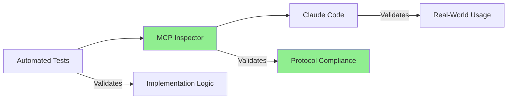

# MCP Connection Testing Guide

Comprehensive testing and verification procedures for CycleTime's Model Context Protocol (MCP) server implementation.

## Overview

This guide provides step-by-step procedures to verify MCP functionality, test protocol compliance, and troubleshoot connection issues. The CycleTime MCP server provides SSE (Server-Sent Events) transport following the MCP specification version 2024-11-05.

**MCP Endpoints**:
- **SSE Stream**: `GET http://localhost:8080/mcp/events` - Server-to-client event stream (MCP v2024-11-05)
- **POST Endpoint**: `POST http://localhost:8080/mcp` - Client-to-server JSON-RPC requests
- **Server Info**: `GET http://localhost:8080/mcp` - Server metadata and capabilities
- **Statistics**: `GET http://localhost:8080/mcp/stats` - Connection metrics and monitoring

## Prerequisites

### Required Tools

**Server Runtime**:
```bash
# Java 21 or higher
java -version

# Gradle (bundled wrapper)
./gradlew --version
```

**Testing Tools**:
```bash
# curl for HTTP/SSE testing (usually pre-installed)
curl --version

# jq for JSON formatting (optional but recommended)
brew install jq  # macOS
sudo apt-get install jq  # Linux
```

**HTTP Client**:
```bash
# curl (usually pre-installed)
curl --version

# Or httpie for nicer output
brew install httpie  # macOS
```

### Start the Server

**Standard Mode**:
```bash
# Build and run
./gradlew build
./gradlew run

# Server starts at http://localhost:8080
# SSE endpoint: http://localhost:8080/mcp/events
# POST endpoint: http://localhost:8080/mcp
```

**Development Mode with Hot Reload**:
```bash
./gradlew devRun --continuous
```

## Basic Health Checks

### 1. Server Information Endpoint

**Test Command**:
```bash
curl http://localhost:8080/mcp
```

**Expected Response**:
```json
{
  "name": "cycletime",
  "version": "0.1.0",
  "description": "CycleTime Project Orchestration MCP Server (Kotlin)",
  "capabilities": {
    "resources": true,
    "tools": true,
    "prompts": false
  },
  "activeConnections": 0,
  "totalRequests": 0,
  "averageLatency": "0ms",
  "errorRate": "0%"
}
```

**Verification Checklist**:
- [ ] HTTP 200 OK status
- [ ] Server name matches "cycletime"
- [ ] Version string present
- [ ] Capabilities show resources and tools enabled
- [ ] Metrics fields present (if `MCP_METRICS_ENABLED=true`)

**Common Issues**:
```bash
# Connection refused - server not running
curl: (7) Failed to connect to localhost port 8080

# Fix: Start the server
./gradlew run

# Invalid JSON response - server starting up
# Fix: Wait a few seconds for full initialization
```

## Protocol Validation with MCP Inspector

### What is MCP Inspector?

MCP Inspector is the official validation tool from Anthropic that validates protocol compliance at a level automated tests cannot. While curl tests verify HTTP connectivity and basic request/response handling, Inspector validates JSON-RPC 2.0 compliance, MCP protocol adherence, and simulates how Claude Code will interact with your server.

**When to use MCP Inspector**:
- ✅ **Before creating PRs** - Validate protocol changes
- ✅ **After SDK updates** - Confirm compatibility
- ✅ **Debugging client issues** - Simulate Claude Code connection
- ✅ **Protocol compliance** - Verify MCP spec adherence

**When to use curl**:
- ✅ Quick smoke tests during development
- ✅ CI/CD health checks
- ✅ Debugging HTTP-level issues

### Quick Start with Inspector

**Installation**:
```bash
npm install -g @modelcontextprotocol/inspector
```

**Launch Inspector** (Two Methods):

**Method 1: SSE Transport (Recommended)**:
```bash
# Terminal 1: Start CycleTime server
./gradlew run

# Terminal 2: Launch Inspector with SSE transport
npx @modelcontextprotocol/inspector sse http://localhost:8080

# Access Inspector UI at http://localhost:6274
# Connection established automatically via command line
```

**Method 2: Browser Direct Connection**:
```bash
# Terminal 1: Start CycleTime server
./gradlew run

# Terminal 2: Launch Inspector without server URL
npx @modelcontextprotocol/inspector

# Access Inspector UI at http://localhost:6274
# Click "Connect" → "Direct Connection" → Enter "http://localhost:8080"
```

**Which method to use**:
- ✅ **Method 1 (SSE)**: Faster setup, connection pre-established
- ✅ **Method 2 (Direct)**: Interactive, good for testing different servers

### Validation Checklist (from SPI-706)

Use Inspector to validate these critical aspects:

**1. Protocol Initialization**:
- [ ] Server responds to `initialize` request
- [ ] Protocol version negotiation succeeds (2024-11-05)
- [ ] Capability exchange completes
- [ ] Server info correctly formatted

**2. Tool Registry**:
- [ ] All 17 tools registered and discoverable
- [ ] Tool schemas validate (JSON Schema format)
- [ ] Tool execution returns correct response structure
- [ ] Error handling produces proper MCP error responses

**3. Resource Registry**:
- [ ] All 4 resource providers registered
- [ ] Resource URIs follow `cycletime://` scheme
- [ ] Resource content is valid JSON
- [ ] MIME types correctly specified

**4. Error Handling**:
- [ ] Invalid tool names return `-32601` (Method not found)
- [ ] Missing parameters return `-32602` (Invalid params)
- [ ] Error responses include descriptive messages

### Inspector vs curl Testing

| Validation Type | curl | MCP Inspector | Automated Tests |
|-----------------|------|---------------|-----------------|
| HTTP connectivity | ✅ | ✅ | ✅ |
| JSON-RPC format | ✅ | ✅ | ✅ |
| **Protocol compliance** | ❌ | **✅** | ⚠️ |
| **Client simulation** | ❌ | **✅** | ❌ |
| Interactive testing | ❌ | ✅ | ❌ |
| CI/CD automation | ✅ | ❌ | ✅ |

**Best Practice**: Use all three validation layers:
```
Unit/Integration Tests → MCP Inspector → Claude Code Testing
```

### Three-Layer Validation Model



**Validation Flow**:
1. **Automated Tests**: Run `./gradlew test` - validates implementation correctness
2. **MCP Inspector**: Launch Inspector - validates protocol compliance
3. **Claude Code**: Connect real client - validates production readiness

Each layer catches different failure modes. All three must pass before deployment.

### Related Documentation

- [MCP Development Workflow](../development/mcp-development.md#validating-with-mcp-inspector) - Inspector in development workflow
- [MCP Troubleshooting](../reference/mcp-troubleshooting.md#mcp-inspector-protocol-diagnostics) - Inspector as diagnostic tool

### 2. Statistics Endpoint

**Test Command**:
```bash
# Requires MCP_METRICS_ENABLED=true (default)
curl http://localhost:8080/mcp/stats
```

**Expected Response**:
```json
{
  "connections": {
    "active": "0",
    "totalRequests": "0",
    "totalErrors": "0",
    "averageLatency": "0ms",
    "maxLatency": "0ms",
    "errorRate": "0.00%"
  },
  "cleanup": {
    "isRunning": "true",
    "isActive": "true",
    "consecutiveFailures": "0",
    "intervalSeconds": "30"
  },
  "config": {
    "maxConnections": "100",
    "asyncProcessing": "true",
    "caching": "true",
    "optimized": "true"
  }
}
```

**Verification Checklist**:
- [ ] Connection statistics present
- [ ] Cleanup service running
- [ ] Configuration reflects environment settings
- [ ] All numeric values properly formatted

**Metrics Disabled**:
```bash
# With MCP_METRICS_ENABLED=false
curl http://localhost:8080/mcp/stats
# Response: {"error": "Metrics disabled"}
```

## SSE Connectivity Tests

### 3. Basic SSE Connection

**Using curl**:
```bash
# Connect to SSE endpoint (server-to-client event stream)
curl -N http://localhost:8080/mcp/events
```

**Expected Output**:
```
# SSE connection established, waiting for server events
# (Connection stays open, press CTRL+C to exit)
```

**Verification**:
- SSE connection establishes without errors
- curl stays connected (doesn't immediately exit)
- Server may send periodic keep-alive events

**Alternative test with headers**:
```bash
# Show HTTP headers during connection
curl -N -v http://localhost:8080/mcp/events

# Expected headers:
# < HTTP/1.1 200 OK
# < Content-Type: text/event-stream
# < Cache-Control: no-cache
# < Connection: keep-alive
```

### 4. MCP Protocol Handshake

**Initialize Request**:
```json
{
  "jsonrpc": "2.0",
  "id": 1,
  "method": "initialize",
  "params": {
    "protocolVersion": "2024-11-05",
    "capabilities": {
      "roots": {
        "listChanged": false
      }
    },
    "clientInfo": {
      "name": "test-client",
      "version": "1.0.0"
    }
  }
}
```

**Expected Response**:
```json
{
  "jsonrpc": "2.0",
  "id": 1,
  "result": {
    "protocolVersion": "2024-11-05",
    "capabilities": {
      "resources": {
        "subscribe": false,
        "listChanged": false
      },
      "tools": {
        "listChanged": false
      },
      "prompts": {}
    },
    "serverInfo": {
      "name": "cycletime",
      "version": "0.1.0"
    }
  }
}
```

**Verification Checklist**:
- [ ] `jsonrpc` field is "2.0"
- [ ] `id` matches request (1)
- [ ] `result.protocolVersion` is "2024-11-05"
- [ ] Server capabilities match expected values
- [ ] Server info contains name and version

### 5. List Tools Request

**After successful initialization**, send:

```json
{
  "jsonrpc": "2.0",
  "id": 2,
  "method": "tools/list"
}
```

**Expected Response** (17 tools total):
```json
{
  "jsonrpc": "2.0",
  "id": 2,
  "result": {
    "tools": [
      {
        "name": "create_project",
        "description": "Create a new CycleTime project",
        "inputSchema": {
          "type": "object",
          "properties": {
            "name": {
              "type": "string",
              "description": "Project name"
            },
            "description": {
              "type": "string",
              "description": "Project description"
            }
          },
          "required": ["name"]
        }
      },
      {
        "name": "get_project",
        "description": "Get a project by ID",
        "inputSchema": {
          "type": "object",
          "properties": {
            "id": {
              "type": "string",
              "description": "Project ID"
            }
          },
          "required": ["id"]
        }
      },
      {
        "name": "list_projects",
        "description": "List all projects",
        "inputSchema": {
          "type": "object",
          "properties": {}
        }
      },
      {
        "name": "update_project",
        "description": "Update an existing project",
        "inputSchema": {
          "type": "object",
          "properties": {
            "id": {
              "type": "string",
              "description": "Project ID"
            },
            "name": {
              "type": "string",
              "description": "Project name"
            },
            "description": {
              "type": "string",
              "description": "Project description"
            }
          },
          "required": ["id"]
        }
      },
      {
        "name": "create_issue",
        "description": "Create a new issue",
        "inputSchema": {
          "type": "object",
          "properties": {
            "title": {
              "type": "string",
              "description": "Issue title"
            },
            "description": {
              "type": "string",
              "description": "Issue description"
            },
            "projectId": {
              "type": "string",
              "description": "Project ID"
            },
            "type": {
              "type": "string",
              "enum": ["EPIC", "STORY", "SUBTASK"],
              "description": "Issue type",
              "default": "STORY"
            }
          },
          "required": ["title", "projectId"]
        }
      },
      {
        "name": "get_issue",
        "description": "Get an issue by ID",
        "inputSchema": {
          "type": "object",
          "properties": {
            "id": {
              "type": "string",
              "description": "Issue ID"
            }
          },
          "required": ["id"]
        }
      },
      {
        "name": "list_issues",
        "description": "List all issues",
        "inputSchema": {
          "type": "object",
          "properties": {}
        }
      },
      {
        "name": "update_issue",
        "description": "Update an existing issue",
        "inputSchema": {
          "type": "object",
          "properties": {
            "id": {
              "type": "string",
              "description": "Issue ID"
            },
            "title": {
              "type": "string",
              "description": "Issue title"
            },
            "description": {
              "type": "string",
              "description": "Issue description"
            },
            "type": {
              "type": "string",
              "enum": ["EPIC", "STORY", "SUBTASK"],
              "description": "Issue type"
            }
          },
          "required": ["id"]
        }
      },
      {
        "name": "create_session",
        "description": "Create a new work session",
        "inputSchema": {
          "type": "object",
          "properties": {
            "projectId": {
              "type": "string",
              "description": "Project ID for the session"
            }
          },
          "required": ["projectId"]
        }
      },
      {
        "name": "list_active_sessions",
        "description": "List active sessions",
        "inputSchema": {
          "type": "object",
          "properties": {}
        }
      },
      {
        "name": "get_session",
        "description": "Get session by key",
        "inputSchema": {
          "type": "object",
          "properties": {
            "sessionKey": {
              "type": "string",
              "description": "Session key"
            }
          },
          "required": ["sessionKey"]
        }
      },
      {
        "name": "get_next_task",
        "description": "Get the next task for the current session",
        "inputSchema": {
          "type": "object",
          "properties": {
            "sessionKey": {
              "type": "string",
              "description": "Session key (optional)"
            }
          }
        }
      },
      {
        "name": "get_active_session",
        "description": "Get the currently active session",
        "inputSchema": {
          "type": "object",
          "properties": {}
        }
      },
      {
        "name": "list_sessions",
        "description": "List all sessions (active and inactive)",
        "inputSchema": {
          "type": "object",
          "properties": {}
        }
      },
      {
        "name": "create_workflow",
        "description": "Create a new workflow",
        "inputSchema": {
          "type": "object",
          "properties": {
            "name": {
              "type": "string",
              "description": "Workflow name"
            },
            "description": {
              "type": "string",
              "description": "Workflow description"
            },
            "stages": {
              "type": "array",
              "description": "Workflow stages",
              "items": {
                "type": "object",
                "properties": {
                  "name": {
                    "type": "string"
                  },
                  "description": {
                    "type": "string"
                  }
                }
              }
            }
          },
          "required": ["name"]
        }
      },
      {
        "name": "list_workflows",
        "description": "List all workflows",
        "inputSchema": {
          "type": "object",
          "properties": {}
        }
      },
      {
        "name": "execute_workflow_stage",
        "description": "Execute a specific workflow stage",
        "inputSchema": {
          "type": "object",
          "properties": {
            "workflowId": {
              "type": "string",
              "description": "Workflow ID"
            },
            "stage": {
              "type": "string",
              "description": "Stage name to execute"
            },
            "context": {
              "type": "object",
              "description": "Execution context"
            }
          },
          "required": ["workflowId", "stage"]
        }
      }
    ]
  }
}
```

**Verification Checklist**:
- [ ] Response contains `tools` array with 17 tools
- [ ] Each tool has name, description, inputSchema
- [ ] Input schemas define required parameters correctly
- [ ] Tool names match expected functionality
- [ ] All 4 domains covered: Projects (4), Issues (4), Sessions (6), Workflows (3)

### 6. List Resources Request

```json
{
  "jsonrpc": "2.0",
  "id": 3,
  "method": "resources/list"
}
```

**Expected Response**:
```json
{
  "jsonrpc": "2.0",
  "id": 3,
  "result": {
    "resources": [
      {
        "uri": "cycletime://session/current",
        "name": "Current Session",
        "description": "The active CycleTime session with current project context",
        "mimeType": "application/json"
      },
      {
        "uri": "cycletime://projects",
        "name": "All Projects",
        "description": "Complete list of projects in the CycleTime workspace",
        "mimeType": "application/json"
      },
      {
        "uri": "cycletime://issues",
        "name": "All Issues",
        "description": "Complete list of issues across all projects",
        "mimeType": "application/json"
      }
    ]
  }
}
```

**Verification Checklist**:
- [ ] Response contains `resources` array
- [ ] Each resource has uri, name, description, mimeType
- [ ] URIs follow `cycletime://` scheme
- [ ] MIME types are valid (application/json)

### 7. Execute Tool Request

**Call list_projects tool**:

```json
{
  "jsonrpc": "2.0",
  "id": 4,
  "method": "tools/call",
  "params": {
    "name": "list_projects",
    "arguments": {}
  }
}
```

**Expected Response (empty database)**:
```json
{
  "jsonrpc": "2.0",
  "id": 4,
  "result": {
    "content": [
      {
        "type": "text",
        "text": "[]"
      }
    ]
  }
}
```

**Expected Response (with projects)**:
```json
{
  "jsonrpc": "2.0",
  "id": 4,
  "result": {
    "content": [
      {
        "type": "text",
        "text": "[{\"id\":\"proj-123\",\"name\":\"My Project\",\"description\":\"Test project\"}]"
      }
    ]
  }
}
```

**Verification Checklist**:
- [ ] Response contains `result.content` array
- [ ] Content type is "text"
- [ ] Text field contains valid JSON array
- [ ] Data structure matches expected format

### 8. Read Resource Request

```json
{
  "jsonrpc": "2.0",
  "id": 5,
  "method": "resources/read",
  "params": {
    "uri": "cycletime://session/current"
  }
}
```

**Expected Response**:
```json
{
  "jsonrpc": "2.0",
  "id": 5,
  "result": {
    "contents": [
      {
        "uri": "cycletime://session/current",
        "mimeType": "application/json",
        "text": "{\"sessionId\":\"sess-abc\",\"projectId\":\"proj-123\",\"startTime\":\"2024-01-15T10:30:00Z\"}"
      }
    ]
  }
}
```

**Verification Checklist**:
- [ ] Response contains `result.contents` array
- [ ] URI matches requested resource
- [ ] MIME type is application/json
- [ ] Text field contains valid JSON

## Complete SSE + POST Test Session

**Full test sequence using curl and POST**:

```bash
# Terminal 1: Establish SSE connection (server-to-client events)
curl -N http://localhost:8080/mcp/events

# Terminal 2: Send JSON-RPC requests via POST (client-to-server)

# 1. Initialize
curl -X POST http://localhost:8080/mcp \
  -H "Content-Type: application/json" \
  -d '{"jsonrpc":"2.0","id":1,"method":"initialize","params":{"protocolVersion":"2024-11-05","capabilities":{},"clientInfo":{"name":"test-client","version":"1.0.0"}}}'

# 2. List tools
curl -X POST http://localhost:8080/mcp \
  -H "Content-Type": "application/json" \
  -d '{"jsonrpc":"2.0","id":2,"method":"tools/list"}'

# 3. List resources
curl -X POST http://localhost:8080/mcp \
  -H "Content-Type": "application/json" \
  -d '{"jsonrpc":"2.0","id":3,"method":"resources/list"}'

# 4. Execute tool
curl -X POST http://localhost:8080/mcp \
  -H "Content-Type": "application/json" \
  -d '{"jsonrpc":"2.0","id":4,"method":"tools/call","params":{"name":"list_projects","arguments":{}}}'

# 5. Read resource
curl -X POST http://localhost:8080/mcp \
  -H "Content-Type": "application/json" \
  -d '{"jsonrpc":"2.0","id":5,"method":"resources/read","params":{"uri":"cycletime://session/current"}}'
```

**Expected Flow**:
- **Terminal 1 (SSE)**: Receives server-sent events with JSON-RPC responses
- **Terminal 2 (POST)**: Sends JSON-RPC requests, receives immediate HTTP responses
- Responses correlate via EventBus + MessageCorrelator using request IDs

## Debugging and Troubleshooting

### Enable Detailed Logging

**Configuration**:
```bash
# Enable verbose MCP logging
MCP_DETAILED_LOGGING=true ./gradlew run
```

**Log Output** (example):
```
[MCP] SSE connection established from /127.0.0.1:54321
[MCP] Received request: method=initialize, id=1
[MCP] Processing initialize request...
[MCP] Sending response: id=1, size=234 bytes
[MCP] Request completed in 12ms
[MCP] Received request: method=tools/list, id=2
[MCP] Processing tools/list request...
[MCP] Returning 4 tools
[MCP] Sending response: id=2, size=1024 bytes
[MCP] Request completed in 8ms
```

**Performance Monitoring**:
```bash
# Enable metrics with slow request threshold
MCP_METRICS_ENABLED=true MCP_SLOW_REQUEST_MS=100 ./gradlew run
```

**Slow Request Logs**:
```
[WARN] Slow MCP request: method=tools/call, duration=156ms (threshold: 100ms)
```

### Common Connection Issues

**Issue: Connection Refused**
```bash
curl: (7) Failed to connect to localhost port 8080
```

**Diagnosis**:
```bash
# Check if server is running
lsof -i :8080

# Check server logs
./gradlew run | grep -i error
```

**Solution**:
- Ensure server is running: `./gradlew run`
- Check port availability: `lsof -i :8080`
- Verify no firewall blocking port 8080

**Issue: SSE Connection Failed**
```bash
curl -N http://localhost:8080/mcp/events
# No response or immediate disconnect
```

**Diagnosis**:
```bash
# Verify SSE endpoint exists
curl -v http://localhost:8080/mcp/events
# Should return HTTP 200 with Content-Type: text/event-stream

# Verify POST endpoint exists
curl http://localhost:8080/mcp
# Should return server info JSON
```

**Solution**:
- Confirm correct SSE path: `/mcp/events` for server-to-client stream
- Confirm correct POST path: `/mcp` for client-to-server requests
- Check server logs for routing errors
- Verify MCP module loaded: look for "MCP routing configured" in logs

**Issue: Invalid Protocol Version**
```json
{
  "jsonrpc": "2.0",
  "id": 1,
  "error": {
    "code": -32602,
    "message": "Invalid params",
    "data": "Unsupported protocol version"
  }
}
```

**Solution**:
- Use protocol version "2024-11-05" in initialize request
- Check server logs for supported versions
- Verify client compatibility with MCP spec

**Issue: Tool Not Found**
```json
{
  "jsonrpc": "2.0",
  "id": 4,
  "error": {
    "code": -32601,
    "message": "Method not found",
    "data": "Tool 'invalid_tool' not found"
  }
}
```

**Diagnosis**:
```bash
# List available tools first
# Send: {"jsonrpc":"2.0","id":2,"method":"tools/list"}
```

**Solution**:
- Verify tool name matches tools/list response
- Check for typos in tool name
- Ensure tool is registered in server

**Issue: Resource Not Found**
```json
{
  "jsonrpc": "2.0",
  "id": 5,
  "error": {
    "code": -32602,
    "message": "Invalid params",
    "data": "Resource not found: cycletime://invalid"
  }
}
```

**Solution**:
- Use resources/list to verify available URIs
- Check URI format follows `cycletime://` scheme
- Ensure resource template matches pattern

### Performance Issues

**Slow Response Times**:

```bash
# Monitor with detailed logging and metrics
MCP_DETAILED_LOGGING=true MCP_METRICS_ENABLED=true ./gradlew run

# Check stats endpoint
curl http://localhost:8080/mcp/stats | jq '.connections.averageLatency'
```

**High Latency Diagnosis**:
```bash
# Check database performance
# Look for slow queries in logs
grep "took.*ms" build/logs/cycletime.log

# Verify cache is enabled
curl http://localhost:8080/mcp/stats | jq '.config.caching'
# Should return "true"

# Check connection pool
curl http://localhost:8080/mcp/stats | jq '.connections.active'
# Should be reasonable number, not near maxConnections
```

**Optimization Settings**:
```bash
# Enable all performance optimizations
MCP_ASYNC_ENABLED=true \
MCP_CACHE_ENABLED=true \
MCP_BUFFER_SIZE=8192 \
./gradlew run

# Verify optimizations active
curl http://localhost:8080/mcp/stats | jq '.config.optimized'
# Should return "true"
```

### Memory and Resource Monitoring

**Monitor Active Connections**:
```bash
# Check current connections
watch -n 1 'curl -s http://localhost:8080/mcp | jq .activeConnections'

# Check connection stats
curl http://localhost:8080/mcp/stats | jq '.connections'
```

**Connection Cleanup**:
```bash
# Verify cleanup service running
curl http://localhost:8080/mcp/stats | jq '.cleanup'

# Expected output:
# {
#   "isRunning": "true",
#   "isActive": "true",
#   "consecutiveFailures": "0",
#   "intervalSeconds": "30"
# }
```

**Database Connection Pool**:
```bash
# Monitor database connections
# Look for connection pool warnings in logs
./gradlew run | grep -i "connection pool"

# Check for connection leaks
# Active connections should return to baseline after activity
```

## Test Verification Checklist

Use this checklist to verify complete MCP functionality:

### Server Health
- [ ] GET /mcp returns 200 OK with server info
- [ ] Server name, version, and description present
- [ ] Capabilities show resources=true, tools=true
- [ ] GET /mcp/stats returns connection metrics (if enabled)

### SSE Connectivity
- [ ] SSE connection to http://localhost:8080/mcp/events succeeds
- [ ] Connection remains open and stable
- [ ] Keep-alive events work correctly

### MCP Protocol
- [ ] Initialize handshake completes successfully
- [ ] Protocol version negotiation works
- [ ] Server capabilities match expected values
- [ ] Client info properly exchanged

### Tools Functionality
- [ ] tools/list returns all available tools
- [ ] Each tool has name, description, inputSchema
- [ ] tools/call executes successfully
- [ ] Tool responses have correct structure

### Resources Functionality
- [ ] resources/list returns all resource URIs
- [ ] Each resource has uri, name, description, mimeType
- [ ] resources/read returns resource content
- [ ] Resource content is valid JSON

### Error Handling
- [ ] Invalid method returns error -32601
- [ ] Invalid params return error -32602
- [ ] Error responses include descriptive messages
- [ ] Server remains stable after errors

### Performance
- [ ] Initialize request completes in < 100ms
- [ ] tools/list completes in < 50ms
- [ ] resources/list completes in < 50ms
- [ ] Simple tool execution completes in < 100ms
- [ ] Average latency stays below threshold

### Monitoring
- [ ] Statistics endpoint shows accurate metrics
- [ ] Connection counts update correctly
- [ ] Cleanup service shows healthy status
- [ ] Configuration reflects environment settings

## Advanced Testing Scenarios

### Concurrent Connections

**Test multiple clients**:
```bash
# Terminal 1: First SSE connection
curl -N http://localhost:8080/mcp/events

# Terminal 2: Second SSE connection
curl -N http://localhost:8080/mcp/events

# Terminal 3: Check active connections
curl http://localhost:8080/mcp | jq .activeConnections
# Should show 2
```

### Load Testing

**Basic load test**:
```bash
# Install hey (HTTP load testing tool)
go install github.com/rakyll/hey@latest

# Test GET /mcp endpoint
hey -n 1000 -c 10 http://localhost:8080/mcp

# Check results
curl http://localhost:8080/mcp/stats | jq '.connections.totalRequests'
```

### Connection Stability

**Long-running connection test**:
```bash
# Terminal 1: Open SSE connection and leave idle
curl -N http://localhost:8080/mcp/events

# Terminal 2: Wait 5 minutes, then send request via POST
curl -X POST http://localhost:8080/mcp \
  -H "Content-Type: application/json" \
  -d '{"jsonrpc":"2.0","id":1,"method":"tools/list"}'

# Verify: Should still respond normally via SSE in Terminal 1
# Connection should survive ping/timeout mechanisms
```

### Cache Verification

**Test resource caching**:
```bash
# Enable detailed logging
MCP_DETAILED_LOGGING=true MCP_CACHE_ENABLED=true ./gradlew run

# First request - cache miss
# logs: "Resource cache miss: cycletime://session/current"

# Second request within TTL - cache hit
# logs: "Resource cache hit: cycletime://session/current"
```

## Configuration Reference

**Environment Variables**:

```bash
# Connection
MCP_HOST=0.0.0.0              # Bind address
MCP_PORT=8080                  # Server port
MCP_SSE_PATH=/mcp/events       # SSE endpoint (server-to-client)
MCP_POST_PATH=/mcp             # POST endpoint (client-to-server)

# Performance
MCP_MAX_CONNECTIONS=100        # Max concurrent connections
MCP_ASYNC_ENABLED=true         # Async request processing
MCP_BUFFER_SIZE=8192           # Connection buffer size

# Caching
MCP_CACHE_ENABLED=true         # Resource caching
MCP_CACHE_TTL=5000             # Cache TTL in milliseconds
MCP_CACHE_MAX_SIZE=100         # Max cached resources

# Monitoring
MCP_METRICS_ENABLED=true       # Enable statistics
MCP_SLOW_REQUEST_MS=100        # Slow request threshold
MCP_DETAILED_LOGGING=false     # Verbose logging

# Connection Settings
MCP_TIMEOUT=15000              # Connection timeout (ms)
MCP_SESSION_TIMEOUT=3600000    # Session timeout (1 hour)
```

## Related Documentation

- [Quick Start Guide](quick-start.md) - Initial server setup
- [Configuration Guide](configuration.md) - Detailed configuration options
- [API Documentation](../api/rest-endpoints.md) - REST API reference
- [MCP Specification](https://spec.modelcontextprotocol.io/) - Official protocol spec
- [Troubleshooting Guide](../reference/troubleshooting.md) - Common issues and solutions
