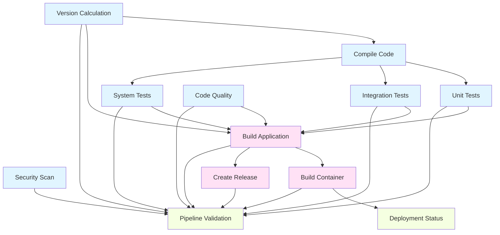
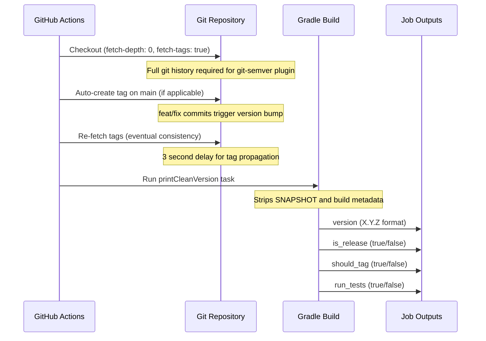
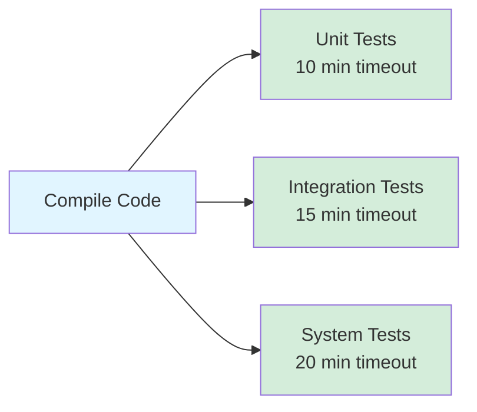
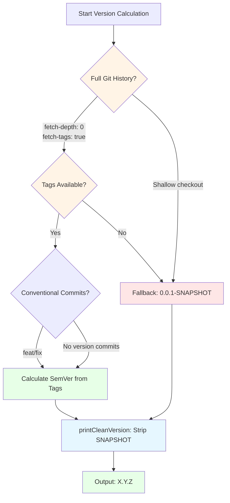
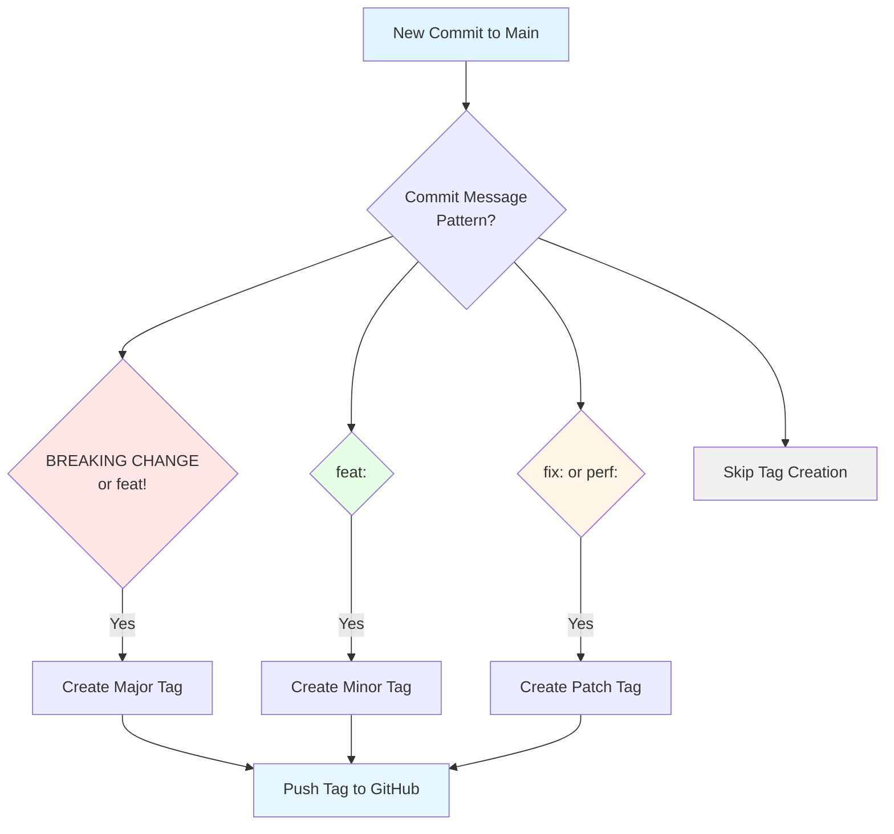
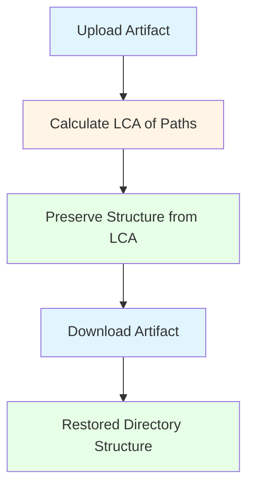
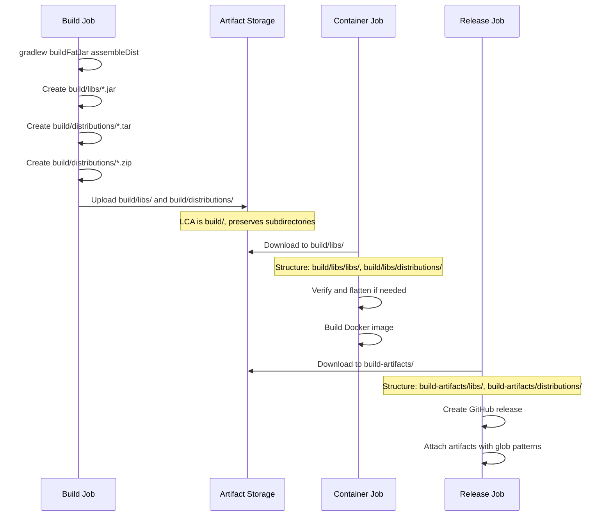
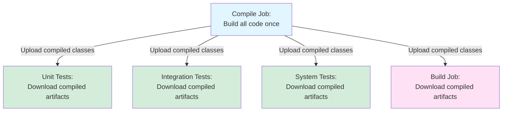

# CI/CD Pipeline Architecture

## Goal

Understand the complete CI/CD pipeline architecture including job dependencies, version calculation, artifact flow, and deployment strategy. This guide provides the mental model needed to troubleshoot pipeline failures and extend the pipeline safely.

## Pipeline Overview

The CycleTime CI/CD pipeline is split into two distinct stages:

1. **CI Stage** - Runs on all branches (PRs and direct commits)
   - Version calculation
   - Compilation
   - Test execution (unit, integration, system)
   - Code quality checks
   - Security scanning

2. **CD Stage** - Runs only on main branch after successful CI
   - Application build (JAR + distributions)
   - Container build and push
   - GitHub release creation

## Job Dependency Graph

The pipeline uses a directed acyclic graph (DAG) of job dependencies to optimize parallelism while maintaining correctness:



**CI Stage Jobs** (blue): Run on all branches
**CD Stage Jobs** (pink): Run only on main branch
**Validation Jobs** (green): Run on all branches, aggregate results

## Job Execution Flow

### Stage 1: Version Calculation

**Job**: `version`
**Purpose**: Calculate semantic version and determine release status
**Runs on**: All branches



**Critical Details**:
- **Full git history required**: `fetch-depth: 0` and `fetch-tags: true` enable git-semver plugin to calculate correct version
- **Output filtering**: `printCleanVersion | tail -1` handles Gradle wrapper download output (SPI-908)
- **Tag propagation delay**: 3 second sleep accounts for GitHub's eventual consistency (SPI-908)
- **Auto-tagging**: Main branch merges with `feat:` or `fix:` commit messages trigger automatic version tags

### Stage 2: Compilation

**Job**: `compile`
**Purpose**: Build all code and test classes once, share across test jobs
**Runs on**: All branches (if code changes detected)

**Checkout Configuration**:
```yaml
- uses: actions/checkout@v4
  with:
    fetch-depth: 0  # Full history for build reproducibility
```

**Key Operations**:
1. Compile main source: `compileKotlin`
2. Compile unit tests: `compileTestKotlin`
3. Compile integration tests: `compileIntegrationTestKotlin`
4. Compile system tests: `compileSystemTestKotlin`
5. Upload compiled artifacts for reuse

**Artifact Output**:
```
build/classes/
build/kotlin/
build/tmp/kotlin-classes/
build/resources/
```

### Stage 3: Parallel Test Execution

Three test jobs run in parallel after compilation completes:



**All test jobs**:
- Download compiled artifacts from `compile` job
- Skip compilation steps (`-x compileKotlin ...`)
- Run tests using pre-compiled classes
- Upload test results and coverage reports
- Report to Codecov

**Test Categories** (enforced by source set location):
- **Unit Tests** (`src/test/kotlin/`): Fast, isolated, no external dependencies (< 10ms each)
- **Integration Tests** (`src/integrationTest/kotlin/`): Real infrastructure, controlled environment (< 100ms each)
- **System Tests** (`src/systemTest/kotlin/`): End-to-end workflows, performance testing (< 1s each)

### Stage 4: Quality and Security (Parallel)

Two jobs run independently:

**Code Quality** (`quality`):
- Runs Detekt static analysis
- Generates code quality reports
- Continues pipeline on failure (non-blocking)

**Security Scan** (`security`):
- Runs OWASP Dependency Check
- Scans for vulnerable dependencies
- Uses NVD API key from secrets
- Continues pipeline on failure (temporarily, due to NVD API issues)

### Stage 5: Build Application (CD Stage - Main Only)

**Job**: `build`
**Purpose**: Create production artifacts (JAR + distributions)
**Runs on**: Main branch only, after all tests pass

**Checkout Configuration** (CRITICAL):
```yaml
- uses: actions/checkout@v4
  with:
    fetch-depth: 0     # Full git history for git-semver plugin
    fetch-tags: true   # All version tags required
```

**Why full history is required** (SPI-911):
- git-semver plugin requires full git history to calculate version
- Without `fetch-depth: 0`, git-semver falls back to `0.0.1-SNAPSHOT`
- Release v0.3.2 contained artifacts versioned as `0.0.1-SNAPSHOT` due to shallow checkout
- Fix: Always use full checkout in build job

**Build Commands**:
```bash
./gradlew buildFatJar assembleDist \
  -x compileKotlin \
  -x test \
  --no-build-cache \
  --configuration-cache \
  --no-daemon
```

**Why both tasks are required** (SPI-910):
- `buildFatJar`: Creates executable JAR with all dependencies (`cycletime-server.jar`)
- `assembleDist`: Creates TAR and ZIP distributions with startup scripts
- Original pipeline only ran `buildFatJar`, causing release to miss TAR/ZIP artifacts

**Artifact Output**:
```
build/libs/*.jar                    # Fat JAR
build/distributions/*.tar           # TAR distribution
build/distributions/*.zip           # ZIP distribution
```

**Artifact Upload**:
```yaml
- uses: actions/upload-artifact@v4
  with:
    name: build-artifacts-${{ needs.version.outputs.version }}
    path: |
      build/libs/*.jar
      build/distributions/
```

### Stage 6: Container Build and Push (CD Stage - Main Only)

**Job**: `container`
**Purpose**: Build Docker image and push to GitHub Container Registry
**Runs on**: Main branch only, after successful build

**Artifact Download**:
```yaml
- uses: actions/download-artifact@v4
  with:
    name: build-artifacts-${{ needs.version.outputs.version }}
    path: build/libs/
```

**Critical**: Artifact path verification required before Docker build:
```bash
# upload-artifact@v4 preserves directory structure from LCA
# Expected: build/libs/cycletime-server.jar
# NOT: build/libs/libs/cycletime-server.jar
if [[ -f "build/libs/cycletime-server.jar" ]]; then
  echo "✅ JAR file verified"
elif [[ -f "build/libs/libs/cycletime-server.jar" ]]; then
  # Handle nested structure (legacy artifact behavior)
  mv build/libs/libs/*.jar build/libs/
fi
```

**Container Tags**:
- `${{ version }}`: Immutable version tag (e.g., `0.3.2`)
- `latest`: Latest release version (main branch only)
- `dev`: Mutable dev environment tag (main branch only)
- `sha-${{ github.sha }}`: Commit-specific tag for traceability

**Deployment Trigger**:
- Container push to `dev` tag triggers external deployment system
- External system watches for `dev` tag changes in GHCR
- Automatically pulls and deploys new dev image
- Expected deployment time: < 5 minutes

### Stage 7: GitHub Release Creation (CD Stage - Main Only)

**Job**: `release`
**Purpose**: Create GitHub release with changelog and artifacts
**Runs on**: Main branch only, for release versions

**Release Artifacts** (SPI-910 fix):
```bash
gh release create "v$version" \
  --title "Release $version" \
  --notes "$changelog" \
  build-artifacts/libs/*.jar \
  build-artifacts/distributions/*.tar \
  build-artifacts/distributions/*.zip
```

**Artifact Path Pattern**:
- `build-artifacts/` prefix: Top-level download directory
- `libs/`: Subdirectory preserved from upload (LCA-based structure)
- `distributions/`: Subdirectory preserved from upload

**Changelog Generation**:
- Uses git-cliff action with `cliff.toml` configuration
- Generates changelog from conventional commits
- Captures output and deletes CHANGELOG.md (prevents git commit)

## Version Calculation Deep Dive

### git-semver Plugin Behavior



### Version Calculation Command

```bash
# Extract clean semantic version (X.Y.Z format only)
version=$(./gradlew printCleanVersion --quiet --no-configuration-cache | tail -1)
```

**Critical Components**:
1. `printCleanVersion`: Custom Gradle task that strips SNAPSHOT and build metadata
2. `--quiet`: Suppresses Gradle logging (but not wrapper download output)
3. `--no-configuration-cache`: Ensures fresh calculation
4. `| tail -1`: **CRITICAL FIX (SPI-908)** - Extracts only the last line

**Why `tail -1` is required**:
- Gradle wrapper download can output progress messages
- Example contaminated output:
  ```
  Downloading https://services.gradle.org/distributions/gradle-8.5-bin.zip
  0.3.2
  ```
- Without `tail -1`, version string becomes multi-line, breaking tag creation
- With `tail -1`, only `0.3.2` is captured

### Auto-Tagging Logic (Main Branch Only)



**Conventional Commit Patterns**:
- `feat!:` or `BREAKING CHANGE:` → Major version bump (X.0.0)
- `feat:` → Minor version bump (0.X.0)
- `fix:` or `perf:` → Patch version bump (0.0.X)
- `docs:`, `chore:`, `ci:`, `build:` → No version tag created

## Artifact Lifecycle

### upload-artifact@v4 Behavior

**Critical Understanding**: `upload-artifact@v4` preserves directory structure from the Lowest Common Ancestor (LCA), not from the repository root.



**Example 1: Single Directory**
```yaml
- uses: actions/upload-artifact@v4
  with:
    name: compiled-artifacts
    path: build/classes/
```
**Result**: Contents of `build/classes/` are uploaded, **not** the `build/` directory structure
**Download**: Files appear directly in download path (no `build/` parent)

**Example 2: Multiple Paths**
```yaml
- uses: actions/upload-artifact@v4
  with:
    name: build-artifacts
    path: |
      build/libs/*.jar
      build/distributions/
```
**LCA**: `build/` (lowest common ancestor of both paths)
**Result**: `build/` structure is preserved
**Download**: Creates `libs/` and `distributions/` subdirectories

### Build Artifact Flow



## Checkout Configuration Patterns

### Pattern 1: Shallow Checkout (Default)

```yaml
- uses: actions/checkout@v4
  # Default: fetch-depth: 1, fetch-tags: false
```

**Use for**:
- Code quality checks
- Security scans
- Jobs that don't need git history

**Limitations**:
- No version calculation (git-semver falls back to 0.0.1-SNAPSHOT)
- No changelog generation
- Limited git log availability

### Pattern 2: Full History Checkout

```yaml
- uses: actions/checkout@v4
  with:
    fetch-depth: 0
```

**Use for**:
- Test jobs (reproducibility)
- Compilation (build caching)

**Benefits**:
- Full git log available
- Better build cache keys
- Reproducible builds

### Pattern 3: Full History + Tags (REQUIRED for Versioning)

```yaml
- uses: actions/checkout@v4
  with:
    fetch-depth: 0     # Full git history
    fetch-tags: true   # Explicitly fetch tags
```

**Use for**:
- Version calculation job
- Build job (artifact versioning)
- Release job (changelog generation)

**Critical for**:
- git-semver plugin version calculation
- Preventing version fallback to 0.0.1-SNAPSHOT (SPI-911)
- Tag-based changelog generation

### Checkout Configuration by Job

| Job | fetch-depth | fetch-tags | Reason |
|-----|-------------|------------|--------|
| version | 0 | true | **REQUIRED**: git-semver version calculation |
| compile | 0 | false | Full history for build reproducibility |
| unit-tests | 0 | false | Full history for test reproducibility |
| integration-tests | 0 | false | Full history for test reproducibility |
| system-tests | 0 | false | Full history for test reproducibility |
| quality | 1 | false | Shallow checkout sufficient |
| security | 1 | false | Shallow checkout sufficient |
| **build** | **0** | **true** | **CRITICAL**: Artifact versioning (SPI-911) |
| container | 1 | false | Shallow checkout sufficient |
| **release** | **0** | **true** | **REQUIRED**: Changelog generation |

## Caching Strategy

### Gradle Dependency Cache

```yaml
- uses: actions/cache@v4
  with:
    path: |
      ~/.gradle/caches
      ~/.gradle/wrapper
      ~/.gradle/daemon
      .gradle/
    key: gradle-deps-v2-${{ runner.os }}-jdk21-${{ hashFiles('**/*.gradle*', 'gradle/libs.versions.toml') }}
```

**Cache Key Components**:
- `gradle-deps-v2`: Cache version (increment to invalidate all caches)
- `${{ runner.os }}`: OS-specific caching
- `jdk21`: Java version-specific caching
- `${{ hashFiles(...) }}`: Dependency file hash for invalidation

**Invalidation Triggers**:
- Changes to `build.gradle.kts`
- Changes to `settings.gradle.kts`
- Changes to `gradle/libs.versions.toml`
- Changes to Gradle wrapper version

### Kotlin Compilation Cache

```yaml
- uses: actions/cache@v4
  with:
    path: |
      build/kotlin
      build/tmp/kotlin-classes
    key: kotlin-compile-v2-${{ runner.os }}-jdk21-${{ hashFiles('src/**/*.kt', 'build.gradle.kts') }}
```

**Benefits**:
- Faster compilation on cache hit
- Reduced CPU usage in compile job
- Faster feedback for test jobs

### Gradle Build Action Cache

```yaml
- uses: gradle/actions/setup-gradle@v3
  with:
    cache-read-only: ${{ github.ref != 'refs/heads/main' }}
```

**Strategy**:
- **Main branch**: Read-write cache (updates cache for all branches)
- **Feature branches**: Read-only cache (consume main branch cache, don't pollute)

**Benefits**:
- Feature branches benefit from main branch compilation
- No cache thrashing from feature branch experiments
- Faster PR validation

## Performance Optimizations

### Smart Build Skipping

```yaml
- name: Check for code changes
  run: |
    if git diff --name-only HEAD~1 HEAD | grep -E '\.(kt|kts|java)$|src/|build.gradle'; then
      echo "run_tests=true"
    else
      echo "run_tests=false"  # Skip tests for docs-only changes
    fi
```

**Skipped Paths**:
- `**.md`: Documentation changes
- `docs/**`: Documentation directory
- `.claude/**`: Claude Code configuration
- `.gitignore`, `LICENSE`: Non-code files

**Always run for**:
- Dependabot PRs (security validation required)
- Code file changes (`.kt`, `.kts`, `.java`)
- Build configuration changes

### Artifact Reuse Strategy



**Benefits**:
- Compile once, run tests in parallel
- No redundant compilation across jobs
- Faster total pipeline execution
- Consistent build across all test jobs

### Parallel Execution

**Jobs that run in parallel**:
- `quality` + `security` (independent)
- `unit-tests` + `integration-tests` + `system-tests` (after compile)

**Jobs that run sequentially**:
- `version` → `compile` → tests
- tests → `build` → `container` / `release`

**Rationale**:
- Maximize parallelism where safe
- Enforce dependencies for correctness
- Optimize for total pipeline time (not individual job time)

## Common Failure Patterns

### Pattern 1: Version Tag Creation Fails (SPI-908)

**Symptom**: No version tags created despite `feat:` or `fix:` commits

**Root Cause**: Gradle wrapper output contaminating version string

**Fix**: Added `| tail -1` to extract only the last line
```bash
version=$(./gradlew printCleanVersion --quiet --no-configuration-cache | tail -1)
```

**Prevention**: Always filter command output to last line when extracting single values

### Pattern 2: Flaky Test Failures (SPI-909)

**Symptom**: Tests pass locally but fail randomly in CI

**Root Cause**: Order-dependent assertions on non-deterministic database queries

**Example**:
```kotlin
// ❌ BAD: Comparing ordered List with unordered database result
issues.map { it.id } shouldBe listOf(id1, id2, id3)

// ✅ GOOD: Order-agnostic comparison
issues.map { it.id }.toSet() shouldBe setOf(id1, id2, id3)
```

**Prevention**: Use `.toSet()` for order-agnostic comparisons on database results without `ORDER BY`

### Pattern 3: GitHub Release Has No Artifacts (SPI-910)

**Symptom**: Release created but no TAR/ZIP files attached

**Root Cause**: Build command only ran `buildFatJar`, not `assembleDist`

**Fix**: Added `assembleDist` to build command
```bash
./gradlew buildFatJar assembleDist
```

**Prevention**: Verify artifact output paths before release job runs

### Pattern 4: Artifacts Versioned Incorrectly (SPI-911)

**Symptom**: Release v0.3.2 contains artifacts named `cycletime-server-0.0.1-SNAPSHOT.jar`

**Root Cause**: Build job used shallow checkout without tags

**Fix**: Added full checkout with tags in build job
```yaml
- uses: actions/checkout@v4
  with:
    fetch-depth: 0     # Full git history
    fetch-tags: true   # All version tags
```

**Prevention**: Always use full checkout in jobs that require version calculation

## Verification Commands

### Local Version Calculation

```bash
# Verify version calculation matches CI
./gradlew printCleanVersion --quiet --no-configuration-cache | tail -1

# Expected output: X.Y.Z (no SNAPSHOT, no build metadata)
```

### Local Artifact Build

```bash
# Build all release artifacts
./gradlew buildFatJar assembleDist

# Verify JAR exists
ls -lh build/libs/cycletime-server.jar

# Verify distributions exist
ls -lh build/distributions/*.tar build/distributions/*.zip
```

### Git Tag Verification

```bash
# List all version tags
git tag -l "v*" --sort=-version:refname

# Verify current commit is tagged
git describe --exact-match --tags HEAD

# Verify git-semver plugin calculation
./gradlew printVersion --quiet
```

### Artifact Upload Simulation

```bash
# Simulate artifact upload structure
mkdir -p /tmp/artifact-test
cd /tmp/artifact-test

# Create test structure
mkdir -p build/libs build/distributions
touch build/libs/test.jar
touch build/distributions/test.tar

# Upload simulation: LCA of build/libs/* and build/distributions/ is build/
# Download will preserve: libs/ and distributions/ subdirectories
```

## Next Steps

- [Troubleshooting Pipeline Failures](./troubleshooting-pipeline-failures.md) - Common issues and debugging procedures
- [Git Checkout Configuration Reference](../../reference/cicd/checkout-configuration.md) - Detailed checkout patterns
- [Artifact Build Commands Reference](../../reference/cicd/artifact-build-commands.md) - Complete build task reference
