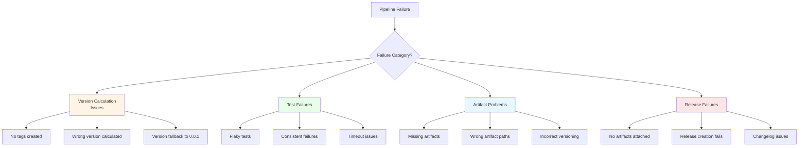
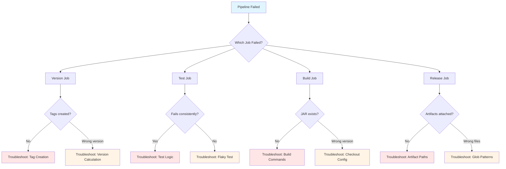

# Troubleshooting CI/CD Pipeline Failures

## Goal

Learn systematic approaches to diagnosing and resolving CI/CD pipeline failures using real examples from production issues (SPI-908, SPI-909, SPI-910, SPI-911). Master debugging techniques applicable to any GitHub Actions workflow.

## Prerequisites

- Basic understanding of GitHub Actions workflows
- Familiarity with [Pipeline Architecture](./pipeline-architecture.md)
- Access to GitHub Actions workflow runs

## Failure Categories

CI/CD failures fall into distinct categories, each requiring different diagnostic approaches:



## Diagnostic Decision Tree

Use this decision tree to quickly identify the failure category:



## Issue 1: No Version Tags Created (SPI-908)

### Symptoms

- Commit message matches `feat:` or `fix:` pattern
- Pushed to main branch
- No version tag created
- Version calculation succeeds but tag creation silently fails

### Root Cause

Gradle wrapper download output contaminated the version string, causing tag creation to fail validation.

**Example Contaminated Output**:
```
Downloading https://services.gradle.org/distributions/gradle-8.5-bin.zip
0.3.2
```

When this multi-line string was used as a tag name, it failed validation.

### Diagnosis Steps

**Step 1: Check workflow logs for version calculation**

```bash
# In GitHub Actions workflow run logs, find the "Auto-create version tag on main" step
# Look for the printCleanVersion output
```

Expected output:
```
📦 Creating tag: v0.3.2
```

Contaminated output:
```
Downloading https://services.gradle.org/distributions/gradle-8.5-bin.zip
📦 Creating tag: vDownloading https://...
0.3.2
```

**Step 2: Verify version extraction locally**

```bash
# Reproduce version calculation without tail -1
./gradlew printCleanVersion --quiet --no-configuration-cache

# Compare with tail -1 filter
./gradlew printCleanVersion --quiet --no-configuration-cache | tail -1
```

**Step 3: Check tag creation logs**

```bash
# In workflow logs, look for git tag command output
# Successful tag creation shows:
✅ Tag v0.3.2 created successfully
✅ Tag v0.3.2 pushed successfully
```

### Solution

Add `| tail -1` to extract only the last line of output:

```bash
# Before (vulnerable to contamination)
next_version=$(./gradlew printCleanVersion --quiet --no-configuration-cache)

# After (robust)
next_version=$(./gradlew printCleanVersion --quiet --no-configuration-cache | tail -1)
```

### Local Reproduction

```bash
# Simulate Gradle wrapper download (first run after clean)
rm -rf ~/.gradle/wrapper/dists/gradle-8.5-bin

# Run version calculation
version=$(./gradlew printCleanVersion --quiet --no-configuration-cache)

# Check if version is clean
echo "Version: $version"
echo "Length: ${#version}"

# Expected: 5 characters (e.g., "0.3.2")
# Actual without tail -1: Multiple lines

# Test tag creation with contaminated version
git tag -a "v$version" -m "Test" 2>&1
# Should fail with invalid tag name error
```

### Prevention

**Always filter command output to last line when extracting single values**:
```bash
value=$(command | tail -1)
```

**Use version format validation**:
```bash
if [[ ! "$version" =~ ^[0-9]+\.[0-9]+\.[0-9]+$ ]]; then
  echo "❌ Invalid version format: $version"
  exit 1
fi
```

### Verification

After fix, verify:
1. Tags are created for `feat:` and `fix:` commits
2. Tag name matches version exactly (no extra lines)
3. Tag is pushed to repository successfully

```bash
# Check recent tags
git tag -l "v*" --sort=-version:refname | head -5

# Verify tag content
git show v0.3.2
```

## Issue 2: Flaky Test Failures (SPI-909)

### Symptoms

- Test passes locally 100% of the time
- Test fails randomly in CI (5-10% failure rate)
- Failure message shows unexpected order or different elements
- Re-running the same commit sometimes passes

### Root Cause

Order-dependent assertion comparing ordered collection (List) with unordered database query result.

**Example Failure**:
```kotlin
// Database query without ORDER BY clause
val issues = issueRepository.findByProjectId(projectId)

// Assertion comparing List (ordered) with Set (unordered)
issues.map { it.id } shouldBe listOf(id1, id2, id3)

// Failure: Expected [id1, id2, id3], got [id2, id1, id3]
```

### Diagnosis Steps

**Step 1: Identify non-deterministic behavior**

Indicators of flaky tests:
- Passes on retry without code changes
- Different assertions fail on different runs
- Involves database queries or concurrent operations
- Collection order matters in assertion

**Step 2: Check database query for ORDER BY**

```kotlin
// ❌ BAD: Non-deterministic ordering
fun findByProjectId(projectId: UUID): List<Issue> {
    return IssuesTable
        .select { IssuesTable.projectId eq projectId }
        .map { it.toIssue() }
    // No ORDER BY - database may return in any order
}

// ✅ GOOD: Deterministic ordering
fun findByProjectId(projectId: UUID): List<Issue> {
    return IssuesTable
        .select { IssuesTable.projectId eq projectId }
        .orderBy(IssuesTable.createdAt to SortOrder.ASC)  // Explicit ordering
        .map { it.toIssue() }
}
```

**Step 3: Review assertion semantics**

```kotlin
// Question: Does order matter for this assertion?

// If order matters (e.g., sorted by timestamp):
issues.map { it.id } shouldBe listOf(id1, id2, id3)  // List comparison

// If order doesn't matter (e.g., just checking presence):
issues.map { it.id }.toSet() shouldBe setOf(id1, id2, id3)  // Set comparison
```

### Solution Patterns

**Pattern 1: Order-agnostic assertions (preferred for unordered data)**

```kotlin
// Before: Order-dependent
issues.map { it.id } shouldBe listOf(id1, id2, id3)

// After: Order-agnostic
issues.map { it.id }.toSet() shouldBe setOf(id1, id2, id3)
```

**Pattern 2: Add ORDER BY to query (preferred for ordered data)**

```kotlin
// Before: Non-deterministic ordering
IssuesTable.select { IssuesTable.projectId eq projectId }

// After: Explicit ordering
IssuesTable
    .select { IssuesTable.projectId eq projectId }
    .orderBy(IssuesTable.createdAt to SortOrder.ASC)
```

**Pattern 3: Sort before assertion**

```kotlin
// Before: Compares with arbitrary order
issues.map { it.title } shouldBe listOf("Task 1", "Task 2", "Task 3")

// After: Explicit sorting before comparison
issues.sortedBy { it.createdAt }.map { it.title } shouldBe
    listOf("Task 1", "Task 2", "Task 3")
```

### Local Reproduction

```bash
# Run test multiple times to detect flakiness
for i in {1..100}; do
  ./gradlew test --tests "com.example.FlakyTest" --rerun-tasks
  if [ $? -ne 0 ]; then
    echo "Failed on iteration $i"
    break
  fi
done
```

**Advanced: Run with different JVM seeds**
```bash
# Different JVM runs may use different hash algorithms
for i in {1..20}; do
  ./gradlew test --tests "com.example.FlakyTest" \
    --rerun-tasks \
    -Dtest.seed=$RANDOM
done
```

### Prevention

**Design tests for determinism**:
1. Always use ORDER BY for database queries if order matters
2. Use `.toSet()` for order-agnostic comparisons
3. Avoid relying on hash-based ordering (HashMap, HashSet)
4. Use explicit sorting before assertions
5. Test with multiple runs locally before pushing

**Testing checklist**:
- [ ] Query has ORDER BY if results are compared as List
- [ ] Assertion uses Set comparison for unordered data
- [ ] No reliance on hash-based ordering
- [ ] Test passes 100/100 times locally with `--rerun-tasks`

### Verification

```bash
# Run affected test 100 times
./gradlew test \
  --tests "SessionIntegrationTest.should clear expired sessions" \
  --rerun-tasks

# Check for consistent results
echo "Test should pass 100/100 times"
```

## Issue 3: GitHub Release Has No Artifacts (SPI-910)

### Symptoms

- GitHub release created successfully
- Release page shows no attached files
- Build job shows successful artifact upload
- Release notes generated correctly

### Root Cause

**Two distinct issues**:
1. Build command only ran `buildFatJar`, not `assembleDist` (missing TAR/ZIP files)
2. Artifact glob patterns assumed incorrect download structure

### Diagnosis Steps

**Step 1: Check build job artifacts**

```bash
# In GitHub Actions UI:
# Build job → Artifacts → build-artifacts-{version}
# Download and inspect contents
```

Expected structure:
```
build-artifacts/
├── libs/
│   └── cycletime-server.jar
└── distributions/
    ├── cycletime-server.tar
    └── cycletime-server.zip
```

**Step 2: Check build commands**

```bash
# In workflow file, look for build job build commands
./gradlew buildFatJar assembleDist
```

**Before (broken)**:
```bash
./gradlew buildFatJar  # Only builds JAR
```

**After (fixed)**:
```bash
./gradlew buildFatJar assembleDist  # Builds JAR + distributions
```

**Step 3: Verify artifact paths in release job**

```yaml
# In release job
gh release create "v$version" \
  build-artifacts/libs/*.jar \
  build-artifacts/distributions/*.tar \
  build-artifacts/distributions/*.zip
```

**Common mistake**: Assuming flat structure
```bash
# ❌ WRONG (assumes flat structure after download)
gh release create "v$version" \
  build/libs/*.jar \
  build/distributions/*.tar
```

**Correct**: Accounting for download directory prefix
```bash
# ✅ CORRECT (accounts for download-artifact path)
gh release create "v$version" \
  build-artifacts/libs/*.jar \
  build-artifacts/distributions/*.tar
```

### Solution

**Fix 1: Add assembleDist to build command**

```yaml
- name: Build application JAR and distributions
  run: |
    ./gradlew buildFatJar assembleDist \
      -x compileKotlin \
      -x test \
      --no-build-cache \
      --configuration-cache \
      --no-daemon
```

**Fix 2: Correct artifact glob patterns**

```bash
# Upload in build job
- uses: actions/upload-artifact@v4
  with:
    name: build-artifacts-${{ needs.version.outputs.version }}
    path: |
      build/libs/*.jar
      build/distributions/

# Download in release job (creates build-artifacts/ prefix)
- uses: actions/download-artifact@v4
  with:
    name: build-artifacts-${{ needs.version.outputs.version }}
    path: build-artifacts/

# Use correct paths in gh release create
gh release create "v$version" \
  build-artifacts/libs/*.jar \
  build-artifacts/distributions/*.tar \
  build-artifacts/distributions/*.zip
```

### Local Reproduction

```bash
# Build artifacts locally
./gradlew clean buildFatJar assembleDist

# Verify all artifacts exist
ls -lh build/libs/cycletime-server.jar
ls -lh build/distributions/*.tar build/distributions/*.zip

# Simulate artifact upload/download structure
mkdir -p /tmp/release-test/build-artifacts
cp -r build/libs build/distributions /tmp/release-test/build-artifacts/

# Verify glob patterns match
ls /tmp/release-test/build-artifacts/libs/*.jar
ls /tmp/release-test/build-artifacts/distributions/*.tar
ls /tmp/release-test/build-artifacts/distributions/*.zip
```

### Prevention

**Build job checklist**:
- [ ] `buildFatJar` command present (creates JAR)
- [ ] `assembleDist` command present (creates TAR/ZIP)
- [ ] All expected artifacts verified after build
- [ ] Artifact paths match upload configuration

**Release job checklist**:
- [ ] Artifact download path documented
- [ ] Glob patterns tested locally
- [ ] All artifact types included in release
- [ ] Dry-run tested with actual artifacts

### Verification

```bash
# After fix, verify release artifacts
gh release view v0.3.2

# Expected output:
# Assets:
#   cycletime-server.jar
#   cycletime-server.tar
#   cycletime-server.zip

# Download and verify artifacts
gh release download v0.3.2
ls -lh cycletime-server.*
```

## Issue 4: Artifacts Versioned Incorrectly (SPI-911)

### Symptoms

- Release version is v0.3.2
- Downloaded JAR is named `cycletime-server-0.0.1-SNAPSHOT.jar`
- TAR/ZIP distributions have incorrect version
- git-semver plugin falls back to default version

### Root Cause

Build job used shallow git checkout without tags, causing git-semver plugin to fall back to default version `0.0.1-SNAPSHOT`.

**git-semver plugin requirements**:
- Full git history (fetch-depth: 0)
- All version tags (fetch-tags: true)
- Without these, plugin cannot calculate version from tags

### Diagnosis Steps

**Step 1: Check artifact naming**

```bash
# Download release artifacts
gh release download v0.3.2

# Check actual filenames
ls -l cycletime-server-*.jar

# Expected: cycletime-server-0.3.2.jar
# Actual (broken): cycletime-server-0.0.1-SNAPSHOT.jar
```

**Step 2: Check build job checkout configuration**

```yaml
# ❌ BAD (causes version fallback)
- uses: actions/checkout@v4
  # Default: fetch-depth: 1, fetch-tags: false

# ✅ GOOD (enables correct versioning)
- uses: actions/checkout@v4
  with:
    fetch-depth: 0
    fetch-tags: true
```

**Step 3: Verify git-semver plugin logs**

```bash
# In build job logs, look for git-semver plugin output
./gradlew build --info 2>&1 | grep -i "semver"

# Broken output:
# git-semver: No tags found, using default version 0.0.1-SNAPSHOT

# Correct output:
# git-semver: Calculated version 0.3.2 from tag v0.3.2
```

**Step 4: Test version calculation in build environment**

```bash
# Simulate shallow checkout
git clone --depth 1 https://github.com/spiralhouse/cycletime.git /tmp/shallow
cd /tmp/shallow

# Try version calculation
./gradlew printVersion --quiet

# Output: 0.0.1-SNAPSHOT (fallback version)

# Compare with full checkout
git fetch --depth=100 --tags
./gradlew printVersion --quiet

# Output: 0.3.2 (correct version from tags)
```

### Solution

Add full checkout with tags in build job:

```yaml
- name: Checkout
  uses: actions/checkout@v4
  with:
    fetch-depth: 0        # Fetch full git history for git-semver plugin
    fetch-tags: true      # Fetch all version tags
```

**Critical jobs requiring this configuration**:
- `version` job (version calculation)
- `build` job (artifact versioning)
- `release` job (changelog generation)

### Local Reproduction

```bash
# Test 1: Shallow checkout (broken)
cd /tmp
git clone --depth 1 https://github.com/spiralhouse/cycletime.git cycletime-shallow
cd cycletime-shallow
./gradlew printVersion --quiet
# Expected: 0.0.1-SNAPSHOT

# Test 2: Full checkout (correct)
cd /tmp
git clone https://github.com/spiralhouse/cycletime.git cycletime-full
cd cycletime-full
./gradlew printVersion --quiet
# Expected: Current version (e.g., 0.3.2)

# Test 3: Build artifacts with shallow checkout
cd /tmp/cycletime-shallow
./gradlew buildFatJar
ls -l build/libs/
# Expected: cycletime-server-0.0.1-SNAPSHOT.jar

# Test 4: Build artifacts with full checkout
cd /tmp/cycletime-full
./gradlew buildFatJar
ls -l build/libs/
# Expected: cycletime-server-{current-version}.jar
```

### Prevention

**Checkout configuration by job type**:

| Job Type | Needs Version? | Configuration |
|----------|----------------|---------------|
| Tests | No | `fetch-depth: 0` (reproducibility) |
| Static Analysis | No | `fetch-depth: 1` (shallow) |
| **Build** | **Yes** | **fetch-depth: 0, fetch-tags: true** |
| **Release** | **Yes** | **fetch-depth: 0, fetch-tags: true** |
| **Version** | **Yes** | **fetch-depth: 0, fetch-tags: true** |

**Verification checklist**:
- [ ] Build job has `fetch-depth: 0`
- [ ] Build job has `fetch-tags: true`
- [ ] Version job has full checkout
- [ ] Release job has full checkout
- [ ] Artifact naming tested locally with shallow vs full checkout

### Verification

```bash
# After fix, verify artifact versioning
gh release download v0.3.3

# Check artifact names
ls -lh cycletime-server-*.jar cycletime-server-*.tar cycletime-server-*.zip

# All should be versioned as 0.3.3, not 0.0.1-SNAPSHOT

# Verify JAR manifest
unzip -p cycletime-server-0.3.3.jar META-INF/MANIFEST.MF | grep Implementation-Version
# Expected: Implementation-Version: 0.3.3
```

## General Debugging Techniques

### Technique 1: Reproduce Locally First

**Steps**:
1. Identify failing step from GitHub Actions logs
2. Extract exact command that failed
3. Replicate environment locally (Java version, dependencies)
4. Run command with same inputs
5. Iterate until local reproduction succeeds

**Example**:
```bash
# From CI logs: "Run unit tests with coverage" step fails
# Extract command:
./gradlew unitTest koverXmlReport --no-build-cache --configuration-cache --no-daemon

# Run locally:
./gradlew clean unitTest koverXmlReport --rerun-tasks

# Add verbosity if needed:
./gradlew unitTest --info --stacktrace
```

### Technique 2: Isolate Variables

Test one change at a time:
1. Start with known working configuration
2. Change one variable (e.g., checkout depth)
3. Verify impact
4. Iterate

**Example: Testing checkout configurations**
```bash
# Test 1: Shallow checkout
git clone --depth 1 /tmp/test-shallow
# Measure version calculation

# Test 2: Shallow checkout with tags
git clone --depth 1 /tmp/test-shallow-tags
git fetch --tags
# Measure version calculation

# Test 3: Full checkout
git clone /tmp/test-full
# Measure version calculation

# Compare results
```

### Technique 3: Add Diagnostic Logging

Insert logging steps in workflow to capture state:

```yaml
- name: Debug - Check git state
  run: |
    echo "🔍 Git diagnostic information"
    echo "Current branch: $(git branch --show-current)"
    echo "Latest tag: $(git describe --tags --abbrev=0 2>/dev/null || echo 'none')"
    echo "Commit count: $(git rev-list --count HEAD)"
    echo "Tags in repo: $(git tag -l | wc -l)"

- name: Debug - Check artifact structure
  run: |
    echo "🔍 Build artifact structure"
    find build -type f -name "*.jar" -o -name "*.tar" -o -name "*.zip"
    ls -lh build/libs/ build/distributions/ || true
```

### Technique 4: Use Workflow Dispatch for Testing

Add manual trigger for testing fixes:

```yaml
on:
  workflow_dispatch:
    inputs:
      test_version_calculation:
        description: 'Test version calculation'
        type: boolean
        default: false
```

Then test specific scenarios:
```bash
gh workflow run cicd.yml \
  --ref feature-branch \
  --field test_version_calculation=true
```

### Technique 5: Compare Successful vs Failed Runs

```bash
# Download logs from successful run
gh run view 12345678 --log > success.log

# Download logs from failed run
gh run view 12345679 --log > failure.log

# Compare
diff success.log failure.log
# or use a diff tool
code --diff success.log failure.log
```

## Troubleshooting Checklist

Before escalating issues, verify:

### Version Calculation Issues
- [ ] Checkout uses `fetch-depth: 0` and `fetch-tags: true`
- [ ] Command output is filtered with `| tail -1`
- [ ] Version format validation is in place
- [ ] Local version calculation matches CI
- [ ] Tags exist in repository (not just local)

### Test Failures
- [ ] Test passes locally 100/100 times with `--rerun-tasks`
- [ ] Database queries use ORDER BY if order matters
- [ ] Assertions use Set comparison for unordered data
- [ ] No reliance on hash-based ordering
- [ ] Test has proper isolation (no shared state)

### Artifact Issues
- [ ] Build commands include all required tasks
- [ ] Artifact paths verified after build
- [ ] Upload/download paths match expected structure
- [ ] Glob patterns tested locally
- [ ] Artifact versioning verified

### Release Issues
- [ ] All artifacts built successfully
- [ ] Artifact download structure correct
- [ ] Glob patterns match actual paths
- [ ] Release creation tested with dry-run
- [ ] Changelog generation successful

## Next Steps

- [Pipeline Architecture Guide](./pipeline-architecture.md) - Understand the complete pipeline structure
- [Checkout Configuration Reference](../../reference/cicd/checkout-configuration.md) - Detailed checkout patterns
- [Artifact Build Commands Reference](../../reference/cicd/artifact-build-commands.md) - Complete build task reference
