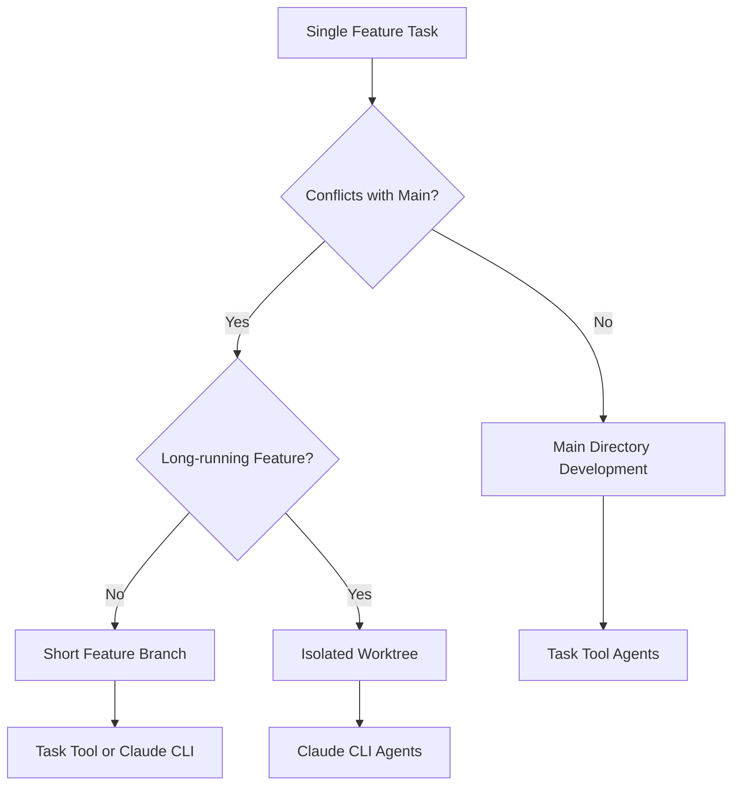

# Single Feature Workflow

Standard workflow for developing individual features using main directory or worktree patterns.

## Overview

Most common CycleTime workflow: implement one feature, bug fix, or improvement with clear Linear tracking and proper branching.

**Decision Guide**: See [Decision Guide](../../reference/decision-guide.md) for detailed environment selection criteria.

## Workflow Selection



**Use Main Directory**: Small features, low conflict, quick implementation
**Use Worktree**: Large features, schema changes, experimental work

## Main Directory Workflow

### Standard Process

```bash
# 1. Setup
git checkout main && git pull origin main
git checkout -b feat/spi-620-documentation-standards
# Update Linear SPI-620 to "In Progress"

# 2. Development (Task Tool Agents)
@agent-developer "Implement documentation standardization per SPI-620"
@agent-code-reviewer "Review implementation for consistency"
@agent-developer "Refine based on feedback"
@agent-qa "Test documentation patterns and examples"

# 3. Pull Request
git push -u origin feat/spi-620-documentation-standards
gh pr create --title "feat: standardize documentation patterns"
# Update Linear SPI-620 to "In Review"
```

### Bug Fix Example

```bash
git checkout main && git pull origin main
git checkout -b fix/spi-587-auth-token-expiry
@agent-developer "Fix token expiry issue - auto-refresh before expiration"
@agent-qa "Add regression tests for token expiry fix"
@agent-code-reviewer "Review fix for security and correctness"
git push -u origin fix/spi-587-auth-token-expiry
gh pr create --title "fix: resolve authentication token expiry"
```

## Worktree Workflow

**When to Use**: Long-running features, schema changes, experimental work, major refactoring.

**Worktree Commands**: See [Worktree Operations](../../reference/worktree-operations.md) for complete reference.

### Process

```bash
# 1. Setup
git worktree add .worktrees/spi-612-api-redesign -b feat/spi-612-api-redesign
cd .worktrees/spi-612-api-redesign
npm install
# Update Linear SPI-612 to "In Progress"

# 2. Development
# Option A: Task Tool Agents
@agent-software-architect "Design new API structure for SPI-612"
@agent-developer "Implement the new API design"

# Option B: Claude CLI Agent
claude -p "Implement API redesign per SPI-612 requirements" \
  --append-system-prompt "$(cat .claude/prompts/task-agent.txt)" \
  --permission-mode bypassPermissions

# 3. Testing and PR
npm run test
@agent-qa "Add comprehensive test coverage"
git push -u origin feat/spi-612-api-redesign
gh pr create --title "feat: redesign API structure"

# 4. Cleanup
cd ../../
git worktree remove .worktrees/spi-612-api-redesign
git branch -d feat/spi-612-api-redesign
```

## Agent Selection

**Task Tool Agents** (Recommended): Interactive development, iterative refinement, complex problem-solving

**Claude CLI Agents**: Well-defined tasks, automated implementation, background processing

**Agent Reference**: See [Agent Reference](../../reference/agents.md) for complete capabilities and selection guidelines.

## Linear Integration

**Status Flow**: Todo → In Progress → In Review → Done

**Branch Naming**: `feat/spi-620-description` matches Linear issue SPI-620

**Integration Details**: See [Linear Integration](linear-integration.md) for complete workflow patterns.

## Quality Gates

**Before Implementation:**
- [ ] Clear acceptance criteria and requirements
- [ ] Technical approach planned

**Before PR:**
- [ ] Tests pass, code reviewed
- [ ] Documentation updated
- [ ] Acceptance criteria met

**Before Merge:**
- [ ] PR reviewed, CI passes
- [ ] No conflicts, ready to close issue

## Common Patterns

**Simple Feature:**
```
git checkout -b feat/spi-xxx-feature
@agent-developer "implement feature"
@agent-qa "add tests"
git push && gh pr create
```

**Complex Feature:**
```
git worktree add .worktrees/spi-xxx-complex -b feat/spi-xxx-complex
@agent-software-architect "design architecture"
@agent-developer "implement according to design"
@agent-qa "comprehensive testing"
git push && gh pr create
```

**Bug Fix:**
```
git checkout -b fix/spi-xxx-bug
@agent-developer "reproduce and fix bug"
@agent-qa "add regression tests"
git push && gh pr create
```

## Best Practices

**Git**: Start from latest main, atomic commits, descriptive messages
**Agents**: Be specific, iterate based on feedback, review outputs
**Linear**: Keep status updated, link PRs to issues, consistent naming
**Quality**: Follow conventions, write tests, document decisions

## Troubleshooting

**Branch Conflicts:**
```bash
git checkout main && git pull origin main
git checkout feat/spi-xxx-feature && git rebase main
```

**Failed Tests:**
```bash
npm run test
@agent-developer "fix failing tests while maintaining functionality"
```

**Common Issues**: See [Troubleshooting Guide](../../reference/troubleshooting.md) for detailed solutions.

## Integration

Integrates with:
- [Branching Strategy](branching-strategy.md) - Standard branch naming patterns
- [Agent Reference](../../reference/agents.md) - Agent capabilities and selection
- [Linear Integration](linear-integration.md) - Issue lifecycle tracking
- [Parallel Development](../../guides/testing/parallel-testing-guide.md) - Scaling to multiple features

## Quick Reference

**Main Directory:**
```bash
git checkout main && git pull origin main
git checkout -b feat/spi-xxx-feature
@agent-developer "implement feature"
git push -u origin feat/spi-xxx-feature
gh pr create
```

**Worktree:**
```bash
git worktree add .worktrees/spi-xxx-feature -b feat/spi-xxx-feature
cd .worktrees/spi-xxx-feature && npm install
@agent-developer "implement feature"
git push -u origin feat/spi-xxx-feature && gh pr create
cd ../../ && git worktree remove .worktrees/spi-xxx-feature
```
