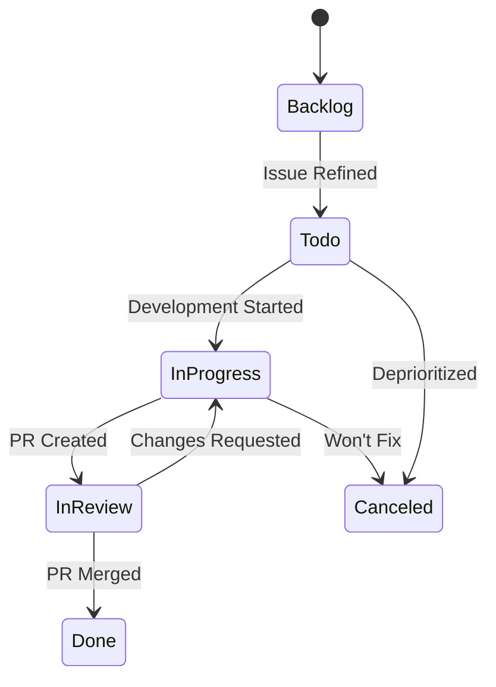
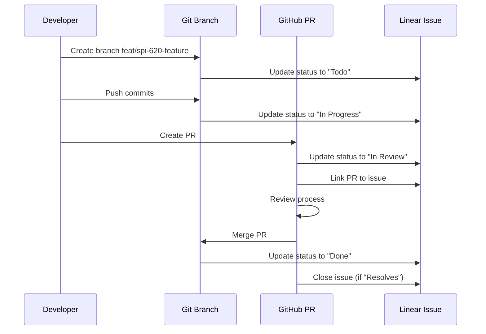

# Linear Integration Guide

Complete guide to integrating Linear issue tracking with git workflows, branch management, and automated status updates.

## Overview

CycleTime uses Linear for issue tracking with deep integration into git workflows. This integration provides automatic status updates, bidirectional linking between issues and branches, and streamlined development processes from issue creation to PR merge.

### Key Benefits

**Automatic Status Tracking**: Linear issue status updates automatically as you create branches, push commits, and open PRs.

**Bidirectional Linking**: Git branches reference Linear issues, and Linear issues link to git branches and PRs.

**Structured Development**: Clear hierarchy from Epic → Story → Subtask maps to feature branches and development workflow.

**Context Preservation**: Issue descriptions, acceptance criteria, and discussions remain accessible throughout development.

### Issue Hierarchy

CycleTime uses a three-tier Linear issue hierarchy:

1. **Epics** (Top Level)
   - High-level features or major project phases
   - Example: "Phase 1: MVP Workflow Engine"
   - Contains multiple Stories
   - No direct estimates

2. **Stories** (Middle Level)
   - User-facing functionality or complete features
   - Example: "Implement single-stage workflow execution"
   - Contains multiple Subtasks (or standalone with estimate)
   - Estimation Rule: Stories have estimates ONLY when they don't have subtasks

3. **Subtasks** (Bottom Level)
   - Specific implementation work items
   - Example: "Create workflow engine core"
   - Always have estimates (required)
   - Maps to individual git branches

### Prerequisites

Before using Linear integration:

- **Linear Access**: Team member access to Spiral House team
- **Git Setup**: Git configured with SSH or HTTPS authentication
- **Claude Code MCP**: Linear MCP server enabled for automated status updates
- **GitHub CLI**: `gh` installed for PR creation and management

### Configuration

**Team ID**: `03ee7cf5-773e-4f53-bc0d-2e5e4d3bc3bc` (Spiral House)
**Project ID**: `217eeb45-4f83-4ca0-8030-81f9c78692bc` (CycleTime)

MCP server handles authentication automatically when configured in Claude Code settings.

## Linear Issue to Git Branch Mapping

### Branch Naming Pattern

**Standard Format**: `<type>/spi-<issue-number>-<description>`

**Types**:
- `feat/` - New features
- `fix/` - Bug fixes
- `refactor/` - Code refactoring
- `docs/` - Documentation changes
- `test/` - Test additions or modifications
- `chore/` - Build, CI, or tooling changes

### Good Branch Names

```bash
# Feature development
feat/spi-620-documentation-standards
feat/spi-612-api-redesign
feat/spi-587-authentication-system

# Bug fixes
fix/spi-445-token-expiry-handling
fix/spi-398-database-connection-leak

# Documentation
docs/spi-722-linear-integration-guide

# Refactoring
refactor/spi-531-repository-pattern
```

**Good Patterns**:
- Issue ID always prefixed with `spi-`
- Description uses kebab-case (lowercase, hyphens)
- Description is concise but meaningful
- Type matches work being done

### Bad Branch Names

```bash
# ❌ Missing issue ID
feat/documentation-standards

# ❌ Wrong issue ID format
feat/SPI-620-documentation-standards  # Uppercase
feat/620-documentation-standards      # No spi- prefix

# ❌ Poor description
feat/spi-620-docs                     # Too vague
feat/spi-620-documentation_standards  # Underscores instead of hyphens
feat/spi-620-ImplementDocumentation   # CamelCase

# ❌ Wrong type
feat/spi-445-fix-token-expiry        # Should be fix/
chore/spi-722-linear-docs            # Should be docs/
```

### Extracting Issue IDs

Branch names encode the Linear issue ID for automated linking:

```bash
# From branch name: feat/spi-620-documentation-standards
# Extract: SPI-620 (uppercase in Linear)

# Pattern: /spi-(\d+)-/
# Captured: 620
# Linear format: SPI-{number}
```

Git hooks and automation scripts extract issue IDs from branch names to:
- Update Linear status automatically
- Link commits to Linear issues
- Reference issues in PR descriptions
- Associate CI runs with specific issues

### Worktree Naming

For parallel development with worktrees, use simplified naming without the type prefix:

```bash
# Worktree directory structure
.worktrees/
├── spi-620-docs-standards/
├── spi-587-auth-fix/
└── spi-612-api-redesign/

# Created with full branch name
git worktree add .worktrees/spi-620-docs-standards \
  -b feat/spi-620-documentation-standards
```

**Worktree Naming Rules**:
- Directory: `spi-{number}-{description}`
- Branch: `{type}/spi-{number}-{description}`
- Keep directory names short for easier navigation
- Issue ID remains consistent across directory and branch

### Automated Branch Creation

Create branches directly from Linear issues using automation:

```bash
# Manual creation
ISSUE_ID="SPI-620"
DESCRIPTION="documentation-standards"
TYPE="feat"
git checkout -b ${TYPE}/spi-${ISSUE_ID,,}-${DESCRIPTION}

# With Claude Code MCP
# Automatically extract from Linear issue title
@agent-developer "Create branch for Linear issue SPI-620"
# Creates: feat/spi-620-documentation-standards
```

**Best Practice**: Let Claude Code create branches automatically from Linear issues to ensure consistent naming and immediate status updates.

## Status Flow Automation

### Linear Status Workflow

CycleTime uses a standard Linear workflow with five primary states:



### Status IDs and Meanings

| Status | Status ID | Type | Usage |
|--------|-----------|------|-------|
| **Backlog** | `1e7bd879-6685-4d94-8887-b7709b3ae6e8` | backlog | Unrefined issues, future work |
| **Todo** | `fc814d1f-22b5-4ce6-8b40-87c1312d54ba` | unstarted | Refined, ready to start |
| **In Progress** | `a433a32b-b815-4e11-af23-a74cb09606aa` | started | Active development |
| **In Review** | `8d617a10-15f3-4e26-ad28-3653215c2f25` | started | PR open, awaiting review |
| **Done** | `3d267fcf-15c0-4f3a-8725-2f1dd717e9e8` | completed | PR merged, issue complete |
| **Canceled** | `a2581462-7e43-4edb-a13a-023a2f4a6b1e` | canceled | Won't fix or deprioritized |
| **Duplicate** | `3f7c4359-7560-4bd9-93b7-9900671742aa` | canceled | Duplicate issue |

### Automatic Status Transitions

Status updates happen automatically at key workflow milestones:

#### 1. Branch Creation → Todo

```bash
git checkout -b feat/spi-620-documentation-standards
# Triggers: Update SPI-620 status to "Todo"
# Rationale: Developer has claimed the issue
```

**MCP Automation**:
```typescript
// Automatically executed by git hook
mcp__linear__update_issue({
  id: "SPI-620",
  state: "Todo"  // Status ID: fc814d1f-22b5-4ce6-8b40-87c1312d54ba
})
```

#### 2. First Commit → In Progress

```bash
git add src/documentation/standards.md
git commit -m "feat: add documentation standards framework"
# Triggers: Update SPI-620 status to "In Progress"
# Rationale: Development has actively begun
```

**MCP Automation**:
```typescript
// Automatically executed by git hook
mcp__linear__update_issue({
  id: "SPI-620",
  state: "In Progress"  // Status ID: a433a32b-b815-4e11-af23-a74cb09606aa
})
```

#### 3. PR Creation → In Review

```bash
gh pr create --title "feat: standardize documentation patterns"
# Triggers: Update SPI-620 status to "In Review"
# Rationale: Code complete, awaiting review
```

**MCP Automation**:
```typescript
// Automatically executed by gh CLI hook
mcp__linear__update_issue({
  id: "SPI-620",
  state: "In Review"  // Status ID: 8d617a10-15f3-4e26-ad28-3653215c2f25
})
```

#### 4. PR Merge → Done

```bash
gh pr merge 123 --merge
# Triggers: Update SPI-620 status to "Done"
# Rationale: Work complete and integrated
```

**MCP Automation**:
```typescript
// Automatically executed by GitHub webhook
mcp__linear__update_issue({
  id: "SPI-620",
  state: "Done"  // Status ID: 3d267fcf-15c0-4f3a-8725-2f1dd717e9e8
})
```

### Manual Status Updates via MCP

Update status manually when automation doesn't cover edge cases:

```bash
# Update single subtask
@agent-developer "Update Linear SPI-620 status to In Progress"

# Update multiple subtasks during parallel development
@agent-developer "Update Linear issues SPI-621, SPI-622, SPI-623 to In Progress"

# Mark issue as blocked
@agent-developer "Update Linear SPI-620 status to Todo and add comment about dependency on SPI-615"
```

**Direct MCP Call**:
```typescript
mcp__linear__update_issue({
  id: "SPI-620",
  state: "In Progress"
})

// With comment for context
mcp__linear__create_comment({
  issueId: "SPI-620",
  body: "Blocked by SPI-615 - waiting for API redesign completion"
})
```

### Subtask vs Story Status Management

**Critical Rule**: Always update subtask status, not parent story status.

#### Correct Workflow

```
Epic: "Core Infrastructure"
└── Story: "Technical Implementation" (status managed automatically)
    ├── Subtask: "Technology Decisions" (SPI-621)
    │   → Update: SPI-621 status to "Done" ✅
    ├── Subtask: "Project Structure" (SPI-622)
    │   → Update: SPI-622 status to "Done" ✅
    └── Subtask: "Configuration Files" (SPI-623)
        → Update: SPI-623 status to "Done" ✅

# Only when ALL subtasks Done:
Parent Story → Update status to "In Review" ✅
```

#### Incorrect Workflow

```
❌ Never add comments to parent story for subtask progress
❌ Never update parent story status while subtasks remain incomplete
❌ Never skip subtask status updates

# Wrong:
Story: "Technical Implementation"
└── Comment: "Completed technology decisions" ❌

# Right:
Subtask: "Technology Decisions"
└── Status: "Done" ✅
```

**Enforcement Pattern**:
- Claude Code agents always update subtask status fields
- Parent story status changes only when ALL subtasks complete
- Comments on stories reserved for clarifications, not progress tracking

## PR Creation and Linking Workflows

### Creating PRs Linked to Linear Issues

Pull requests automatically link to Linear issues when branch names follow conventions:

```bash
# Standard PR creation
git push -u origin feat/spi-620-documentation-standards

gh pr create \
  --title "feat: standardize documentation patterns (SPI-620)" \
  --body "$(cat <<'EOF'
## Summary
Implements standardized documentation patterns across the codebase.

## Changes
- Add documentation framework with templates
- Create validation rules for doc structure
- Implement automated checks via CI

## Linear Issue
Resolves SPI-620

## Test Plan
- [ ] Documentation templates render correctly
- [ ] Validation catches malformed docs
- [ ] CI checks pass for valid docs
- [ ] CI checks fail for invalid docs

🤖 Generated with [Claude Code](https://claude.com/claude-code)
EOF
)"
```

### PR Title Conventions

**Pattern**: `<type>: <description> (SPI-<number>)`

**Examples**:
```
feat: standardize documentation patterns (SPI-620)
fix: resolve authentication token expiry (SPI-445)
refactor: implement repository pattern (SPI-531)
docs: complete Linear integration guide (SPI-722)
```

**Rules**:
- Start with conventional commit type
- Lowercase description
- Include Linear issue ID in parentheses
- Keep under 72 characters when possible

### PR Description Conventions

**Standard Template**:
```markdown
## Summary
Brief 1-2 sentence overview of what this PR does.

## Changes
- Bullet list of key changes
- Focus on what changed, not how
- 3-7 items typically

## Linear Issue
Resolves SPI-{number}

## Test Plan
- [ ] Test case 1
- [ ] Test case 2
- [ ] Test case 3

🤖 Generated with [Claude Code](https://claude.com/claude-code)
```

**Linking Keywords**:
- `Resolves SPI-620` - Closes issue when PR merges
- `Fixes SPI-445` - Closes issue when PR merges
- `Relates to SPI-531` - Links without closing

### Using gh pr create with Linear References

```bash
# Basic PR with Linear link
gh pr create \
  --title "feat: implement feature (SPI-620)" \
  --body "Resolves SPI-620"

# PR with full template
gh pr create \
  --title "feat: implement feature (SPI-620)" \
  --body-file .github/pull_request_template.md

# PR with inline template and Linear link
gh pr create \
  --title "feat: implement feature (SPI-620)" \
  --body "$(cat <<'EOF'
## Summary
Feature implementation details.

## Linear Issue
Resolves SPI-620

## Test Plan
- [ ] Tests pass
EOF
)"
```

**Automation with Claude Code**:
```bash
# Let Claude Code handle PR creation
@agent-developer "Create PR for SPI-620 with standard template"

# Claude Code extracts:
# - Issue ID from branch name
# - Title from Linear issue title
# - Description from Linear issue description
# - Acceptance criteria as test plan
```

### Automatic Linear Updates on PR Events

Linear issues update automatically on GitHub PR events:

**PR Opened**:
- Issue status → "In Review"
- Add PR link to issue
- Notify issue assignee

**PR Review Requested**:
- Add comment with reviewer names
- Update issue with review status

**Changes Requested**:
- Issue status → "In Progress"
- Add comment with requested changes

**PR Approved**:
- Add approval comment to issue
- Keep status as "In Review"

**PR Merged**:
- Issue status → "Done"
- Add merge commit reference
- Close issue automatically (if using "Resolves" keyword)

**PR Closed (Unmerged)**:
- Issue status → "Canceled" (if issue should be closed)
- Or → "Todo" (if issue should be retried)
- Add comment explaining closure

### Review Workflow Integration



**Manual Review Updates**:
```bash
# Request specific reviewers
gh pr review 123 --request-changes \
  --body "Please address authentication concerns in auth.ts"

# Approve PR
gh pr review 123 --approve \
  --body "LGTM - excellent implementation"

# Linear automatically receives review status updates
```

## Best Practices

### One Branch Per Linear Issue

**Rule**: Each Linear issue maps to exactly one git branch.

**Benefits**:
- Clear ownership and accountability
- Simplified status tracking
- Atomic changes and reviews
- Easy rollback if needed

**Example**:
```
SPI-620 → feat/spi-620-documentation-standards
SPI-621 → feat/spi-621-technology-decisions
SPI-622 → feat/spi-622-project-structure
```

**Anti-Pattern**:
```bash
# ❌ Multiple issues in one branch
feat/spi-620-spi-621-multiple-features

# ❌ One issue across multiple branches
feat/spi-620-part-1
feat/spi-620-part-2
```

### Subtask Workflow

**Always update subtask status, not parent story status:**

```bash
# ✅ Correct: Update subtask status
@agent-developer "Update Linear SPI-621 (subtask) to Done"

# ❌ Wrong: Comment on parent story
@agent-developer "Add comment to parent story about completing SPI-621"
```

**Subtask Development Pattern**:
1. Create branch from subtask ID: `feat/spi-621-technology-decisions`
2. Implement subtask requirements
3. Update subtask status: "Todo" → "In Progress" → "Done"
4. Create PR referencing subtask: `Resolves SPI-621`
5. Merge PR, subtask marked "Done"
6. Repeat for remaining subtasks
7. When all subtasks "Done", update parent story to "In Review"

### Conventional Commits with Issue References

**Pattern**: `<type>(<scope>): <description> [SPI-<number>]`

**Examples**:
```bash
git commit -m "feat(docs): add documentation standards framework [SPI-620]"
git commit -m "fix(auth): resolve token expiry handling [SPI-445]"
git commit -m "refactor(db): implement repository pattern [SPI-531]"
git commit -m "test(api): add integration tests for endpoints [SPI-620]"
```

**Benefits**:
- Automatic changelog generation
- Easy issue tracking from commit history
- Clear context for each commit
- Enables commit-level Linear linking

### When to Use Worktrees for Parallel Development

**Use worktrees when**:
- Developing multiple Linear subtasks simultaneously
- Long-running feature with frequent main sync needs
- Experimental work that shouldn't block other development
- Schema changes that require clean rebuild

**Example Parallel Workflow**:
```bash
# Story SPI-620 with 3 subtasks
git worktree add .worktrees/spi-621-tech-decisions -b feat/spi-621-tech-decisions
git worktree add .worktrees/spi-622-project-structure -b feat/spi-622-project-structure
git worktree add .worktrees/spi-623-config-files -b feat/spi-623-config-files

# Develop all three in parallel
cd .worktrees/spi-621-tech-decisions
@agent-developer "Implement technology decisions per SPI-621"

cd ../spi-622-project-structure
@agent-developer "Create project structure per SPI-622"

cd ../spi-623-config-files
@agent-developer "Setup configuration files per SPI-623"
```

**See Also**: [Branching Strategy](branching-strategy.md) for complete worktree decision guide.

### Status Hygiene and Issue Lifecycle

**Status Hygiene Rules**:
1. Never leave issues in "In Progress" longer than 2 weeks
2. Update status immediately when work state changes
3. Use "Canceled" for won't-fix, "Duplicate" for actual duplicates
4. Comment on issue if blocked or waiting for external dependency
5. Archive completed issues promptly to keep board clean

**Lifecycle Timeline**:
```
Backlog → Todo: During sprint planning (manual)
Todo → In Progress: When branch created (automatic)
In Progress → In Review: When PR opened (automatic)
In Review → In Progress: If changes requested (manual)
In Review → Done: When PR merged (automatic)
```

**Stale Issue Detection**:
```bash
# Find stale "In Progress" issues (via MCP)
@agent-developer "List Linear issues in 'In Progress' status updated more than 14 days ago"

# Triage stale issues
# - Still relevant? Continue work
# - Blocked? Add comment, move to "Todo"
# - Deprioritized? Move to "Canceled"
```

## Troubleshooting

### Common Integration Issues

#### Issue Not Updating When Branch Created

**Symptom**: Created branch `feat/spi-620-feature` but Linear issue still shows "Todo" or "Backlog".

**Causes**:
- Branch name doesn't match pattern
- MCP Linear integration not configured
- Issue ID doesn't exist in Linear

**Solution**:
```bash
# 1. Verify branch name format
git branch --show-current
# Should be: feat/spi-620-feature (lowercase spi-)

# 2. Manually update Linear status
@agent-developer "Update Linear SPI-620 status to In Progress"

# 3. Verify issue exists
@agent-developer "Show details for Linear issue SPI-620"
```

#### PR Not Linking to Linear Issue

**Symptom**: Created PR but Linear issue doesn't show PR link.

**Causes**:
- PR title/body missing issue reference
- Issue ID format incorrect
- GitHub-Linear integration not configured

**Solution**:
```bash
# 1. Check PR title includes issue ID
gh pr view 123 --json title

# 2. Add Linear reference to PR body
gh pr edit 123 --body "$(cat <<'EOF'
## Summary
Feature implementation.

## Linear Issue
Resolves SPI-620

🤖 Generated with [Claude Code](https://claude.com/claude-code)
EOF
)"

# 3. Manually add comment to Linear issue
@agent-developer "Add comment to Linear SPI-620 with PR link https://github.com/org/repo/pull/123"
```

### Status Sync Problems

#### Issue Stuck in Wrong Status

**Symptom**: Issue shows "In Progress" but PR already merged.

**Solution**:
```bash
# Manual status correction
@agent-developer "Update Linear SPI-620 status to Done"

# Verify all subtasks completed (if story with subtasks)
@agent-developer "List all subtasks for Linear story SPI-620 and show their statuses"
```

#### Subtasks Not Updating Parent Story

**Symptom**: All subtasks marked "Done" but parent story still "In Progress".

**Expected Behavior**: Parent story status must be updated manually after reviewing all completed subtasks.

**Solution**:
```bash
# 1. Verify all subtasks complete
@agent-developer "List all subtasks for Linear story SPI-620"

# 2. Update parent story to In Review
@agent-developer "Update Linear story SPI-620 status to In Review"

# 3. Trigger code review
@agent-code-reviewer "Review completed implementation for Linear story SPI-620"
```

### Branch Naming Conflicts

#### Duplicate Branch Names

**Symptom**: Branch `feat/spi-620-feature` already exists.

**Causes**:
- Previous work not cleaned up
- Multiple developers working on same issue
- Worktree still active

**Solution**:
```bash
# 1. Check existing branch status
git branch -a | grep spi-620

# 2. If previous work merged, delete old branch
git branch -d feat/spi-620-feature

# 3. If previous work abandoned, rename new branch
git checkout -b feat/spi-620-feature-v2

# 4. For worktree conflicts, check active worktrees
git worktree list
git worktree remove .worktrees/spi-620-feature
```

#### Wrong Branch Name Format

**Symptom**: Branch created as `feat/SPI-620-feature` (uppercase) or `feat/620-feature` (missing spi-).

**Solution**:
```bash
# Rename branch locally
git branch -m feat/SPI-620-feature feat/spi-620-feature

# If already pushed, delete remote and push correct name
git push origin --delete feat/SPI-620-feature
git push -u origin feat/spi-620-feature
```

### Recovery Procedures

#### Lost Linear Issue Link

**Symptom**: Working on feature but forgot which Linear issue it relates to.

**Solution**:
```bash
# 1. Extract from branch name
git branch --show-current
# feat/spi-620-documentation-standards → SPI-620

# 2. Search Linear by description
@agent-developer "Search Linear for issues about 'documentation standards'"

# 3. Check commit messages
git log --oneline --grep="SPI-"
```

#### Multiple Issues in One Branch

**Symptom**: Accidentally worked on SPI-620 and SPI-621 in same branch.

**Solution**:
```bash
# 1. Create separate branch for each issue
git checkout -b feat/spi-620-documentation-standards
git cherry-pick <commits-for-620>

git checkout main
git checkout -b feat/spi-621-technology-decisions
git cherry-pick <commits-for-621>

# 2. Create separate PRs
cd $(git rev-parse --show-toplevel)
gh pr create --base main --head feat/spi-620-documentation-standards
gh pr create --base main --head feat/spi-621-technology-decisions

# 3. Update Linear issues separately
@agent-developer "Update Linear SPI-620 status to In Review"
@agent-developer "Update Linear SPI-621 status to In Review"
```

#### Merged PR But Issue Not Closed

**Symptom**: PR merged successfully but Linear issue still shows "In Review".

**Solution**:
```bash
# 1. Verify PR used closing keyword
gh pr view 123 --json body | grep -i "resolves\|fixes\|closes"

# 2. If missing, manually close issue
@agent-developer "Update Linear SPI-620 status to Done"

# 3. Add merge commit reference
@agent-developer "Add comment to Linear SPI-620: 'Fixed in #123, merged in commit abc123'"
```

## Integration

This guide integrates with other CycleTime workflows:

- **[Branching Strategy](branching-strategy.md)** - Branch naming conventions and worktree patterns
- **[Feature Workflow](feature-workflow.md)** - Development workflow with Linear status updates
- **[Worktree Operations](../../reference/worktree-operations.md)** - Complete worktree command reference
- **[Agent Reference](../../reference/agents.md)** - Using agents for Linear status updates
- **[Decision Guide](../../reference/decision-guide.md)** - Choosing workflows based on issue complexity

## Quick Reference

**Create Branch from Linear Issue:**
```bash
git checkout -b feat/spi-620-documentation-standards
# Auto-updates: SPI-620 → "Todo"
```

**Push and Create PR:**
```bash
git push -u origin feat/spi-620-documentation-standards
gh pr create --title "feat: standardize documentation patterns (SPI-620)" \
  --body "Resolves SPI-620"
# Auto-updates: SPI-620 → "In Review"
```

**Manual Status Update:**
```bash
@agent-developer "Update Linear SPI-620 status to In Progress"
```

**Update Subtask (Not Parent):**
```bash
@agent-developer "Update Linear SPI-621 status to Done"
# Parent story updated only when ALL subtasks Done
```

**Check Issue Status:**
```bash
@agent-developer "Show details for Linear issue SPI-620"
```
