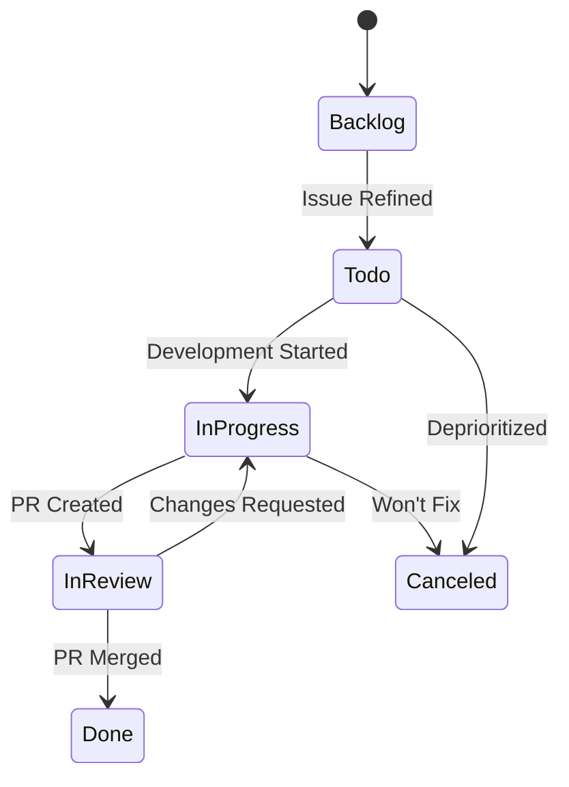
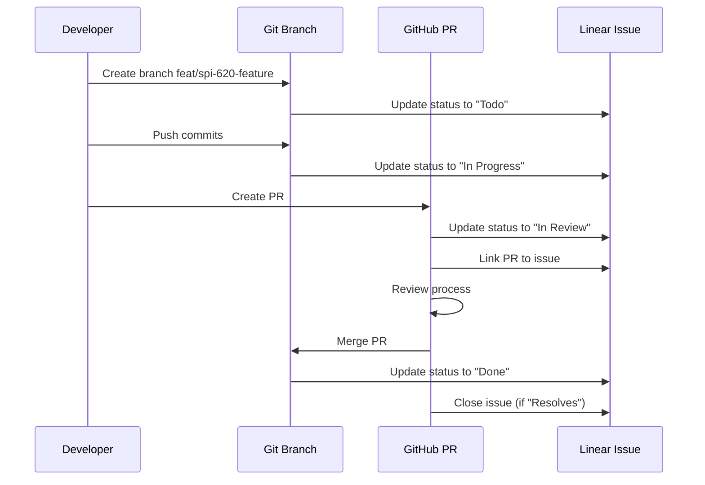

# Linear Integration Guide

Complete guide to integrating Linear issue tracking with git workflows, branch management, and automated status updates.

## Overview

CycleTime integrates Linear issue tracking with git workflows for automatic status updates, bidirectional linking, and streamlined development from issue creation to PR merge.

### Key Benefits

- **Automatic Status Tracking**: Issue status updates as you create branches, commit, and open PRs
- **Bidirectional Linking**: Git branches reference issues; issues link to branches and PRs
- **Structured Development**: Epic → Story → Subtask hierarchy maps to development workflow
- **Context Preservation**: Issue descriptions and acceptance criteria accessible throughout development

### Issue Hierarchy

Three-tier structure:

1. **Epics**: High-level features, contain Stories, no estimates
2. **Stories**: User-facing functionality, contain Subtasks (or standalone with estimate)
3. **Subtasks**: Specific work items, always have estimates, map to git branches

**Estimation Rule**: Stories have estimates ONLY when they don't have subtasks.

### Prerequisites

- Linear Access (Spiral House team)
- Git with SSH/HTTPS authentication
- Claude Code MCP with Linear server enabled
- GitHub CLI (`gh`)

**Team ID**: `03ee7cf5-773e-4f53-bc0d-2e5e4d3bc3bc` (Spiral House)
**Project ID**: `217eeb45-4f83-4ca0-8030-81f9c78692bc` (CycleTime)

## Linear Issue to Git Branch Mapping

### Branch Naming Pattern

**Standard Format**: `<type>/spi-<issue-number>-<description>`

**Types**:
- `feat/` - New features
- `fix/` - Bug fixes
- `refactor/` - Code refactoring
- `docs/` - Documentation changes
- `test/` - Test additions or modifications
- `chore/` - Build, CI, or tooling changes

### Good Branch Names

```bash
feat/spi-620-documentation-standards
fix/spi-445-token-expiry-handling
docs/spi-722-linear-integration-guide
```

Issue ID prefixed with `spi-`, description in kebab-case, type matches work.

### Bad Branch Names

```bash
feat/SPI-620-feature              # ❌ Uppercase issue ID
feat/620-feature                  # ❌ Missing spi- prefix
feat/spi-620-fix-bug             # ❌ Wrong type (should be fix/)
```

### Worktree Naming

```bash
# Worktree directory structure
.worktrees/
├── spi-620-docs-standards/
├── spi-587-auth-fix/
└── spi-612-api-redesign/
```

**Naming**: Directory uses `spi-{number}-{description}`, branch uses full `{type}/spi-{number}-{description}`. See [Worktree Operations](../../reference/worktree-operations.md) for creation commands.

### Automated Branch Creation

```bash
# With Claude Code MCP
@agent-developer "Create branch for Linear issue SPI-620"
# Creates: feat/spi-620-documentation-standards
# Updates: SPI-620 status to "Todo"
```

Claude Code extracts issue details automatically and ensures consistent naming.

## Status Flow Automation

### Linear Status Workflow

CycleTime uses a standard Linear workflow with five primary states:



### Status IDs and Meanings

| Status | Status ID | Type | Usage |
|--------|-----------|------|-------|
| **Backlog** | `1e7bd879-6685-4d94-8887-b7709b3ae6e8` | backlog | Unrefined issues, future work |
| **Todo** | `fc814d1f-22b5-4ce6-8b40-87c1312d54ba` | unstarted | Refined, ready to start |
| **In Progress** | `a433a32b-b815-4e11-af23-a74cb09606aa` | started | Active development |
| **In Review** | `8d617a10-15f3-4e26-ad28-3653215c2f25` | started | PR open, awaiting review |
| **Done** | `3d267fcf-15c0-4f3a-8725-2f1dd717e9e8` | completed | PR merged, issue complete |
| **Canceled** | `a2581462-7e43-4edb-a13a-023a2f4a6b1e` | canceled | Won't fix or deprioritized |
| **Duplicate** | `3f7c4359-7560-4bd9-93b7-9900671742aa` | canceled | Duplicate issue |

### Automatic Status Transitions

| Event | Status Update | Rationale |
|-------|--------------|-----------|
| Branch created | → Todo | Developer claimed the issue |
| First commit | → In Progress | Development actively begun |
| PR created | → In Review | Code complete, awaiting review |
| PR merged | → Done | Work complete and integrated |

Updates triggered automatically via git hooks and GitHub webhooks.

### Manual Status Updates via MCP

```bash
# Update single subtask
@agent-developer "Update Linear SPI-620 status to In Progress"

# Update multiple subtasks in parallel
@agent-developer "Update Linear issues SPI-621, SPI-622, SPI-623 to In Progress"

# Add blocking comment
@agent-developer "Add comment to Linear SPI-620: Blocked by SPI-615 - waiting for API redesign"
```

### Subtask vs Story Status Management

**Critical Rule**: Always update subtask status fields, never add progress comments to parent stories.

**Correct Pattern**:
- Each subtask: Update status field (`Todo` → `In Progress` → `Done`)
- Parent story: Update to `In Review` only when ALL subtasks are `Done`
- Comments: Use for clarifications or blockers, not progress tracking

**Example**:
```
Story: "Technical Implementation"
├── Subtask SPI-621 → Status: "Done" ✅
├── Subtask SPI-622 → Status: "Done" ✅
└── Subtask SPI-623 → Status: "Done" ✅

When all subtasks Done:
Story → Status: "In Review" ✅
```

## PR Creation and Linking Workflows

### Creating PRs Linked to Linear Issues

```bash
git push -u origin feat/spi-620-documentation-standards

gh pr create \
  --title "feat: standardize documentation patterns (SPI-620)" \
  --body "Resolves SPI-620

[Include summary, changes, and test plan from .github/pull_request_template.md]"
```

### PR Title Conventions

**Pattern**: `<type>: <description> (SPI-<number>)`

**Examples**:
```
feat: standardize documentation patterns (SPI-620)
fix: resolve authentication token expiry (SPI-445)
```

### PR Description Conventions

**Linking Keywords**:
- `Resolves SPI-620` - Closes issue when PR merges
- `Fixes SPI-445` - Closes issue when PR merges
- `Relates to SPI-531` - Links without closing

Template available in `.github/pull_request_template.md`.

### Using gh pr create with Linear References

```bash
# With template file
gh pr create \
  --title "feat: implement feature (SPI-620)" \
  --body-file .github/pull_request_template.md

# Automated via Claude Code
@agent-developer "Create PR for SPI-620 with standard template"
# Extracts: issue ID, title, description, acceptance criteria
```

### Automatic Linear Updates on PR Events

| PR Event | Linear Issue Update |
|----------|---------------------|
| PR opened | Status → "In Review", add PR link |
| Review requested | Add comment with reviewer names |
| Changes requested | Status → "In Progress", add change comments |
| PR approved | Add approval comment |
| PR merged | Status → "Done", close issue (if "Resolves" used) |
| PR closed (unmerged) | Status → "Canceled" or "Todo" with comment |

### Review Workflow Integration



## Best Practices

### One Branch Per Linear Issue

**Rule**: Each Linear issue maps to exactly one git branch.

**Benefits**: Clear ownership, simplified status tracking, atomic changes, easy rollback.

**Example**:
```
SPI-620 → feat/spi-620-documentation-standards
SPI-621 → feat/spi-621-technology-decisions
```

### Conventional Commits with Issue References

**Pattern**: `<type>(<scope>): <description> [SPI-<number>]`

**Examples**:
```bash
git commit -m "feat(docs): add documentation standards framework [SPI-620]"
git commit -m "fix(auth): resolve token expiry handling [SPI-445]"
git commit -m "refactor(db): implement repository pattern [SPI-531]"
```

### When to Use Worktrees for Parallel Development

**Use worktrees when**:
- Developing multiple Linear subtasks simultaneously
- Long-running feature with frequent main sync needs
- Experimental work that shouldn't block other development

**Example**:
```bash
git worktree add .worktrees/spi-621-tech -b feat/spi-621-tech-decisions
git worktree add .worktrees/spi-622-structure -b feat/spi-622-project-structure
```

See [Branching Strategy](branching-strategy.md) for complete decision guide.

### Status Hygiene and Issue Lifecycle

**Hygiene Rules**:
1. Update status immediately when work state changes
2. Don't leave issues in "In Progress" longer than 2 weeks
3. Comment if blocked or waiting for external dependency
4. Use "Canceled" for won't-fix, "Duplicate" for duplicates

**Stale Issue Detection**:
```bash
@agent-developer "List Linear issues in 'In Progress' status updated more than 14 days ago"
# Triage: Continue work, move to "Todo" if blocked, or "Canceled" if deprioritized
```

## Troubleshooting

### Issue Not Updating When Branch Created

**Symptom**: Branch created but Linear issue status unchanged.

**Solution**:
```bash
# Verify branch name format (lowercase spi-)
git branch --show-current

# Manually update status
@agent-developer "Update Linear SPI-620 status to In Progress"
```

### PR Not Linking to Linear Issue

**Symptom**: PR created but Linear issue doesn't show link.

**Solution**:
```bash
# Add Linear reference to PR body
gh pr edit 123 --body "Resolves SPI-620

[Include summary and test plan]"

# Or add comment manually
@agent-developer "Add comment to Linear SPI-620 with PR link https://github.com/org/repo/pull/123"
```

### Issue Stuck in Wrong Status

**Symptom**: Issue shows wrong status after PR merged.

**Solution**:
```bash
@agent-developer "Update Linear SPI-620 status to Done"

# For stories with subtasks, verify all complete
@agent-developer "List all subtasks for Linear story SPI-620"
```

### Subtasks Not Updating Parent Story

**Symptom**: All subtasks "Done" but parent story still "In Progress".

**Expected**: Parent story must be updated manually after all subtasks complete.

**Solution**:
```bash
@agent-developer "List all subtasks for Linear story SPI-620"
@agent-developer "Update Linear story SPI-620 status to In Review"
@agent-code-reviewer "Review completed implementation for story SPI-620"
```

For additional troubleshooting scenarios (branch conflicts, recovery procedures), see [Linear Troubleshooting Reference](../../reference/linear-troubleshooting.md).

## Integration

This guide integrates with other CycleTime workflows:

- **[Branching Strategy](branching-strategy.md)** - Branch naming conventions and worktree patterns
- **[Feature Workflow](feature-workflow.md)** - Development workflow with Linear status updates
- **[Worktree Operations](../../reference/worktree-operations.md)** - Complete worktree command reference
- **[Agent Reference](../../reference/agents.md)** - Using agents for Linear status updates
- **[Decision Guide](../../reference/decision-guide.md)** - Choosing workflows based on issue complexity

## Quick Reference

**Create Branch from Linear Issue:**
```bash
git checkout -b feat/spi-620-documentation-standards
# Auto-updates: SPI-620 → "Todo"
```

**Push and Create PR:**
```bash
git push -u origin feat/spi-620-documentation-standards
gh pr create --title "feat: standardize documentation patterns (SPI-620)" \
  --body "Resolves SPI-620"
# Auto-updates: SPI-620 → "In Review"
```

**Manual Status Update:**
```bash
@agent-developer "Update Linear SPI-620 status to In Progress"
```

**Update Subtask (Not Parent):**
```bash
@agent-developer "Update Linear SPI-621 status to Done"
# Parent story updated only when ALL subtasks Done
```

**Check Issue Status:**
```bash
@agent-developer "Show details for Linear issue SPI-620"
```
